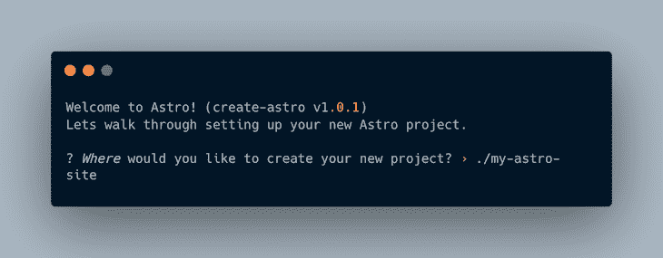
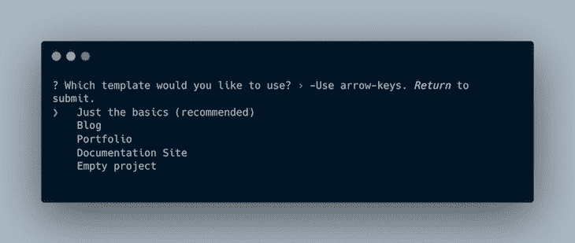
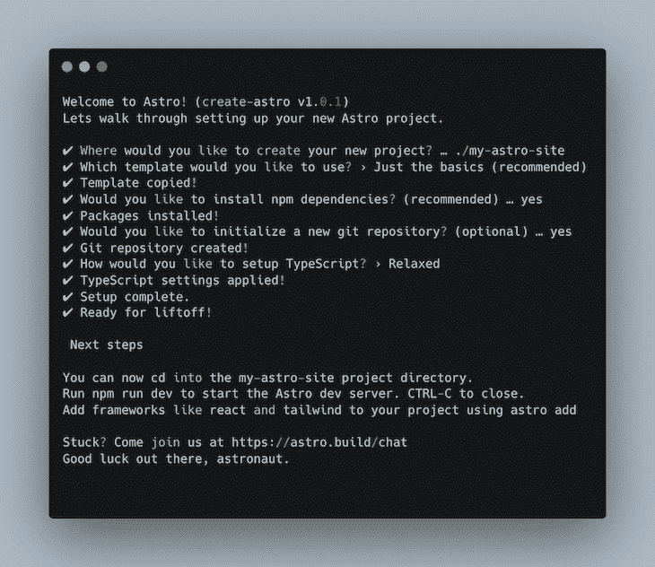
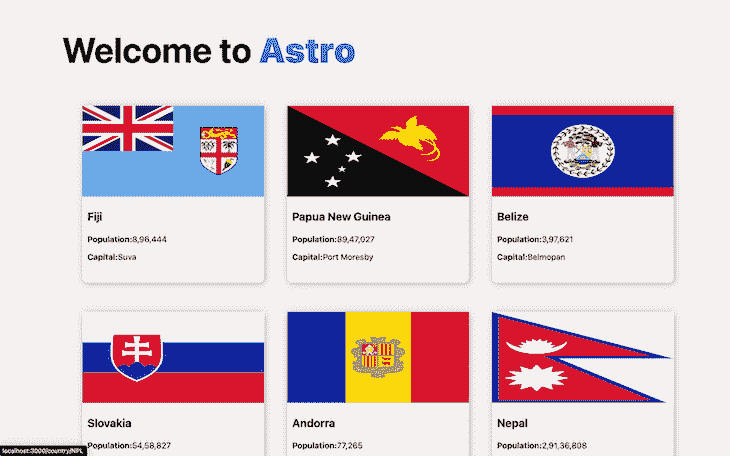
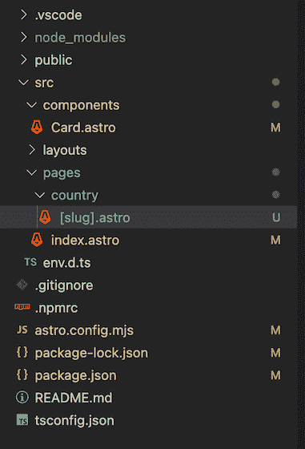
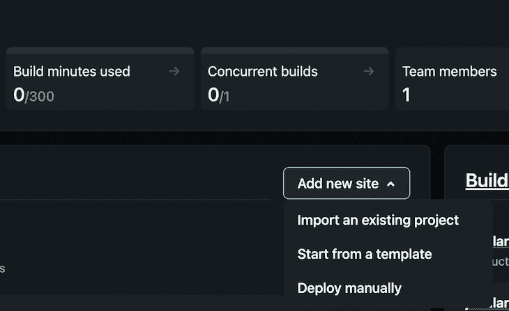
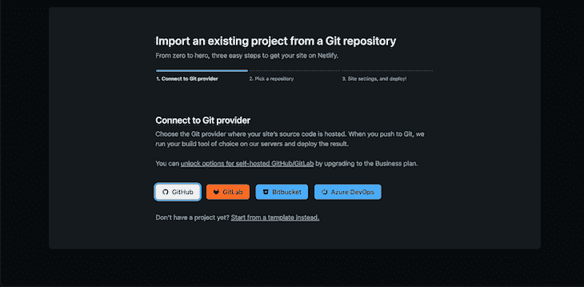
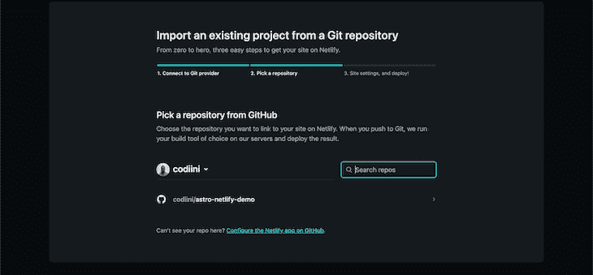

# 使用 Astro 和 Netlify 构建和部署 web 应用程序- LogRocket Blog

> 原文：<https://blog.logrocket.com/astro-netlify-build-deploy-web-app/>

## 什么是阿童木？

Astro 是一个强大的静态网站生成器，让你在不使用 JavaScript 的情况下创建高性能的网站。

默认情况下，Astro 在最终版本中没有提供 JavaScript，但是如果您需要 JavaScript 提供的交互性，Astro 可以在页面上显示交互组件时自动合并它们。

有了 Astro，你可以使用任何 JavaScript 框架的 UI 组件(React，Svelte，Vue)。在构建期间，这些组件将呈现为静态 HTML。查看这篇文章以了解更多关于 Astro 的信息。

## 什么是 Netlify？

Netlify 是一个虚拟主机平台，它简化了静态网站的托管和部署过程。

Netlify 有许多特性，包括持续集成和部署，允许我们在没有服务器的情况下执行后端操作的功能，等等。由于 Netlify 的健壮性和简单性，它也常用于构建 Jamstack 应用程序。

在本教程中，您将学习如何使用 Astro 构建一个 web 应用程序并将其部署到 Netlify。

向前跳:

## 先决条件

*   一个[净值账户](https://www.netlify.com/)
*   Node.js 的最新版本
*   命令行/终端
*   代码编辑器
*   JavaScript 的工作知识

## Astro 入门

使用 Astro CLI 创建一个项目，首先在终端中运行以下命令:

```
npm create [email protected]

```

命令运行后，将进行脚本安装。

终端上将出现以下提示。



要么按下`Enter`继续，一个名为`my-astro-site`的文件夹将被创建在你的当前目录中，或者你可以通过键入你想要的文件夹来重命名该文件夹，以`./`开头，后跟名称，例如`./desired-name`。

接下来，您将看到一个提示，要求您选择一个模板来开始使用。在本教程中，选择`Just the basics`模板并按下`ENTER`继续。



接下来，会提示您选择是否安装`npm`依赖项。按`ENTER`继续，因为“是”是推荐答案。

然后，会询问您是否希望将项目初始化为 Git 存储库。我建议这样做，因为您稍后将需要它来部署到 Netlify。

最后，选择您的 TypeScript 严格程度，或者选择完全不使用 TypeScript。我选择了`relaxed`选项，但这完全取决于你。



现在设置已经完成，在`my-astro-site`目录中键入`cd`并运行命令:

```
npm run dev

```

这将在 [http://localhost/3000/](http://localhost/3000/) 打开一个服务器。

它应该是这样的:


## 构建您的 Astro web 应用程序

您将在本教程中创建的应用程序是一个国家目录应用程序。您将向一个端点发出一个 HTTP 请求，获取并呈现所有国家，每个国家都有自己的详细页面，通过这个您将学习 Astro 的动态路由。

让我们开始吧。

首先，在您选择的代码编辑器中打开您新创建的项目文件夹。

导航到`/src/components`文件夹中的`Card.astro`文件，对其进行修改以适应您正在构建的内容。

然后，用下面的代码替换`Card.astro`文件中的代码:

```
//Card.astro
---
export interface Props {
  name: string;
  capital: string;
  population: number;
  cca3: string;
  flag: string;
}
const { name, capital, population, flag, cca3 } = Astro.props;
---
<li class="country">
  <a href={`country/${cca3}`}>
    
    <h3>{name}</h3>
    <p>
      <strong>Population:</strong>{
        new Intl.NumberFormat("en-US").format(population)
      }
    </p>
    <p><strong>Capital:</strong>{capital}</p>
  </a>
</li>
<style>
  .country {
    list-style-type: none;
    height: 350px;
    width: 30ch;
    margin: 0 auto;
    border-radius: 10px;
    box-shadow: 1.5px 1.5px 11px hsla(208.4, 23.5%, 31.8%, 0.39),
      -1.5px -1.5px 11px rgba(0, 0, 0, 0);
  }
  .country h3,
  p {
    margin-left: 10px;
  }
  p {
    font-size: 16px;
    font-weight: 500;
  }
  .countryflag {
    aspect-ratio: 2/1;
    width: 100%;
    height: auto;
  }
  a {
    text-decoration: none;
    color: black;
  }
</style>

```

在组件文件的顶部，您会注意到`Props`接口。这有助于定义组件期望接收的数据的属性。

然后，在第 9 行，props 被析构以在组件中使用。

大概值得一提的是，Astro 组件被划分为三个部分:JavaScript 部分使用三个连字符来划分，HTML 部分使用 HTML `element`标签来划分，样式部分使用`style`标签来划分。

接下来，转到位于`pages`文件夹中的`index.astro`文件，并用下面的代码替换它:

```
// index.astro
---
import Layout from "../layouts/Layout.astro";
import Card from "../components/Card.astro";
const allCountries = await fetch("https://restcountries.com/v3/all").then(
  (res) => res.json()
);
---
<Layout title="Welcome to Astro.">
  <main>
    <h1>Welcome to <span class="text-gradient">Astro</span></h1>
    <ul role="list" class="countries">
      {
        allCountries.map((country: any) => {
          return (
            <Card
              name={country.name.common}
              capital={country.capital}
              cca3={country.cca3}
              population={country.population}
              flag={country.flags[1]}
            />
          );
        })
      }
    </ul>
  </main>
</Layout>
<style>
  :root {
    --astro-gradient: linear-gradient(0deg, #4f39fa, #da62c4);
  }
  .countries {
    display: grid;
    grid-template-columns: repeat(auto-fill, minmax(260px, 1fr));
    grid-gap: 3rem;
    grid-auto-rows: minmax(100px, auto);
    margin: 70px auto;
  }
  h1 {
    margin: 2rem 0;
  }
  main {
    margin: auto;
    padding: 1em;
    max-width: 100ch;
  }
  .text-gradient {
    font-weight: 900;
    background-image: var(--astro-gradient);
    -webkit-background-clip: text;
    -webkit-text-fill-color: transparent;
    background-size: 100% 200%;
    background-position-y: 100%;
    border-radius: 0.4rem;
    animation: pulse 4s ease-in-out infinite;
  }
</style>

```

这里，向端点发出一个 HTTP 请求，以获取所有国家的列表。然后，每个国家的数据被作为道具传递给`Card.astro`组件。添加了一些样式来使应用程序看起来更好。

这个应用程序现在应该是这样的:



## 动态路由

Astro 中的路由是用 HTML `a` (anchor)元素完成的，因为它没有附带定制的`Link`组件。

从`Cards.astro`组件中，有一个`a`元素，它的“href”属性指向`/country/cca3`。为此，在 pages 目录中创建一个`country`文件夹。

一旦创建了文件夹，就创建一个名为`[slug].astro`的文件。

> 注意，Astro 使用括号符号来定义动态路线。



接下来，打开`[slug].astro`文件，并粘贴以下代码:

```
//[slug].astro

---
import Layout from "../../layouts/Layout.astro";
export async function getStaticPaths() {
  const characters = await fetch("https://restcountries.com/v3/all").then(
    (res) => res.json()
  );
  return characters.map((el: any) => ({
    params: {
      slug: el.cca3,
    },
  }));
}
const { slug } = Astro.params;
const data = await fetch(`https://restcountries.com/v3.1/alpha/${slug}`).then(
  (res) => res.json()
);
---
<Layout title={data[0]?.name}>
  <section class="page-content">
    <div class="container">
      
      <h2>{data[0].name.common}</h2>
      <ul>
        <li>Official Name: {data[0]?.name.official}</li>
        <li>Independent: {data[0]?.independent ? `Yes` : `No`}</li>
        <li>Continents: {data[0]?.continents}</li>
        <li>Sub Region: {data[0]?.subregion}</li>
        <li>Timezones: {data[0]?.timezones}</li>
        <li>
          Population: {
            new Intl.NumberFormat("en-US").format(data[0]?.population)
          }
        </li>
      </ul>
    </div>
  </section>
</Layout>
<style>
  .page-content {
    display: flex;
    flex-direction: column;
    padding-top: 100px;
    align-items: center;
    justify-content: center;
  }
  .container {
    display: flex;
    flex-direction: column;
    align-items: center;
    justify-content: center;
  }
  img {
    aspect-ratio: 2/1;
    width: 50%;
  }
</style>

```

为了在 Astro 中运行动态路由，需要预先生成所有可能的路由。方法是使用`getStaticPaths`函数。

在上面的代码中，`getStaticPaths`函数是异步的，因为 HTTP 请求被发送到`[https://restcountries.com/v3/all](https://restcountries.com/v3/all)`端点以获取所有国家。然后，来自每个国家的唯一的三个字母的`cca3`标识符被用作`params`。

然后“slug”属性从`Astro.params`开始被析构，并在用户导航到某个特定国家的路线时用于获取该国家的详细信息。然后可以在组件的模板部分访问数据。

到目前为止，您的应用程序应该是这样的:


## 使用 Netlify 托管

为了在 Netlify 上托管您的 Astro 应用程序并从持续部署中获益，我建议将您的应用程序部署到一个远程 Git 存储库，比如 GitHub、GitLab 或 Bitbucket。对于这个项目，我将使用 GitHub。

一旦你将你的应用程序部署到 Git 存储库，进入 [Netlify](https://app.netlify.com/) ，点击**添加新站点**，选择**导入现有项目**。您将被重定向到一个三步配置过程。



1.  1.连接到您的 Git 提供程序。
2.  导入并选择项目的存储库。我的名字叫`astro-netlify-demo`。
    
3.  选择项目构建设置。这里不需要额外配置什么，因为都是标配。点击**部署站点**，瞧！
    T3

现在您所要做的就是等待 Netlify 完成您的项目部署，您就可以在仪表板中访问您的托管 URL 了。

## 结论

本教程讲述了如何使用 Astro 组件建立 Astro 项目，使用 Astro 动态路由，以及将您的 web 应用程序部署到 Netlify。

我希望你喜欢！如果你有任何问题或建议，请告诉我。

## 使用 [LogRocket](https://lp.logrocket.com/blg/signup) 消除传统错误报告的干扰

[](https://lp.logrocket.com/blg/signup)

[LogRocket](https://lp.logrocket.com/blg/signup) 是一个数字体验分析解决方案，它可以保护您免受数百个假阳性错误警报的影响，只针对几个真正重要的项目。LogRocket 会告诉您应用程序中实际影响用户的最具影响力的 bug 和 UX 问题。

然后，使用具有深层技术遥测的会话重放来确切地查看用户看到了什么以及是什么导致了问题，就像你在他们身后看一样。

LogRocket 自动聚合客户端错误、JS 异常、前端性能指标和用户交互。然后 LogRocket 使用机器学习来告诉你哪些问题正在影响大多数用户，并提供你需要修复它的上下文。

关注重要的 bug—[今天就试试 LogRocket】。](https://lp.logrocket.com/blg/signup-issue-free)