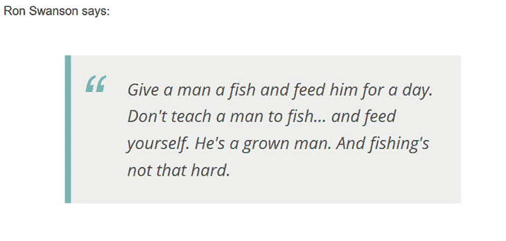

# 使用 Thunk 或定制中间件的 bare Redux 中的异步操作

> 原文：<https://blog.logrocket.com/async-actions-bare-redux-thunk-custom-middleware/>

***编者按*** *:本帖更新于 2022 年 2 月 4 日，旨在解决 Redux 工具包的发布问题，并再次强调本文的重点是 Redux 的裸实现。*

***免责声明**:本指南主要关注一个裸 Redux 实现。如果你是 Redux 的新手，用 React 和 Redux 启动新应用的推荐方式是使用官方模板之一: [Redux + JS 模板](https://github.com/reduxjs/cra-template-redux)， [Redux + TS 模板](https://github.com/reduxjs/cra-template-redux-typescript)，或者[创建 React 应用](https://github.com/reduxjs/cra-template-redux)。这些利用了 [Redux Toolkit](https://redux-toolkit.js.org/) 和 React Redux 与 React 组件的集成。*

正如罗恩·斯旺森所说，

> 给一个人一条鱼，喂他一天。不要教一个人去钓鱼…自己养活自己。他是个成年人了。钓鱼也没那么难。

如您所知， [Redux](https://redux.js.org/) 为您提供了一种管理 JavaScript 应用程序状态的优雅方法。它的基础设施是基于功能基础的，让您可以轻松地构建可测试的代码。

然而，Redux 的状态管理任务流是完全同步的:调度一个动作会立即生成对中间件和 reducers 的调用链，以执行状态转换。

这给我们带来了一些问题:

1.  我们如何通过异步动作实现应用程序的状态转换？
2.  我们如何实现状态转换，包括对 web 服务器的请求，或者使用计时器？
3.  我们如何将应用程序状态与异步操作生成的数据集成在一起，同时遵守 Redux 的架构模式？

在本文中，我们将讨论:

这应该会让您对中间件如何与 Redux 协同工作有一个很好的了解。

## 拆分异步操作

将异步任务集成到 Redux 架构中的常见方法是将一个异步动作分解为至少三个同步动作，每个动作通知异步任务:

*   出发
*   已成功完成
*   不成功的

这些操作中的每一个都会改变应用程序的状态，并使其与异步任务执行期间发生的事情保持一致。

实现这种方法要求您调度启动异步任务的操作。当异步任务结束时，回调应该管理异步任务的结果，并用肯定或否定的响应适当地更新状态。

也就是说，您可能想通过修改它们的 reducer 来支持异步操作，也就是说，确保拦截该操作的 reducer 启动异步任务并管理其结果。

然而，这种实现违反了缩减器必须是纯函数的约束。事实上，就其本质而言，异步任务的结果是基于副作用的。所以，让我们来看看这个问题的几个有效的解决方案。

第一种方法基于 [Thunk 中间件](https://github.com/reduxjs/redux-thunk)。这个[中间件](https://redux.js.org/advanced/middleware)的作用非常简单:验证一个动作是否是一个函数，如果是，就执行它。这个简单的行为允许我们创建动作，而不是简单的对象，而是具有业务逻辑的功能。

为了解决异步任务的问题，我们可以将一个动作定义为一个函数，该函数启动一个异步任务并将其执行委托给 Thunk 中间件。与 reducer 不同，不要求中间件是一个纯函数，因此 Thunk 中间件可以毫无问题地执行触发副作用的功能。

让我们通过实现一个简单的应用程序来将这些概念付诸实践，这个应用程序显示了来自一个专门的 API 的随机引用。网页的标记如下所示:

```
  <div>
  Ron Swanson says:
  <blockquote id="quote"></blockquote>
</div>

```

对于 JavaScript 端，需要获取 [`redux`和`redux-thunk`](https://redux.js.org/introduction/installation) 依赖项，并在模块中导入几项，如下所示:

```
import { createStore, applyMiddleware } from 'redux';
import thunk from 'redux-thunk';

```

如前所述，您必须首先定义三个同步动作，它们代表异步任务执行期间的状态变化。让我们定义以下常数:

```
const QUOTE_REQUESTED = "QUOTE_REQUESTED";
const QUOTE_RECEIVED = "QUOTE_RECEIVED";
const QUOTE_FAILED = "QUOTE_FAILED";

```

如您所见，它们代表了我们上面描述的三个阶段。

现在让我们为 Thunk 定义一个动作创建者:

```
function getQuoteAction() {
  return function(dispatch) {
    dispatch({
      type: QUOTE_REQUESTED,
    });

  fetch("https://ron-swanson-quotes.herokuapp.com/v2/quotes")
    .then(response => response.json())
    .then(data => dispatch({
        type: QUOTE_RECEIVED,
        payload: data
      }))
    .catch(error => dispatch({
        type: QUOTE_FAILED,
        payload: error
      })
    );
  }
}

```

您可能注意到的第一件事是，动作创建者`getQuoteAction()`像预期的那样返回了一个函数。返回的函数开始分派同步动作`QUOTE_REQUESTED`并执行`fetch()`来实际启动异步 HTTP 请求。然后，它根据异步 HTTP 请求的结果，分派另外两个同步操作中的一个。

### 管理状态转换

一旦我们定义了一个异步动作到三个同步动作的转换，我们需要管理它们对状态转换的影响。让我们定义应用程序的初始状态以及将管理报价检索的缩减器:

```
const initialState = { data: [], status:"" };

function quotes(state = initialState, action) {
  switch (action.type) {
    case QUOTE_REQUESTED:
      state = Object.assign({}, state, {status: "waiting"});
      break;
    case QUOTE_RECEIVED:
      state = Object.assign({}, state, {data: […action.payload], status: "received"});
      break;
    case QUOTE_FAILED:
      state = Object.assign({}, state, {status: "failed", error: action.payload});
    break;
  }

  return state;
}

```

应用程序状态的结构由一个数据数组和一个状态字符串组成，数据数组包含要显示的引号列表(在我们的例子中，我们只有一个引号)，状态字符串表示异步操作的当前状态。对于应用程序的正确行为来说,`status`属性并不是严格必需的，但是为了向用户提供反馈，它可能是有用的。`quotes()`函数通过处理三个同步动作并相应地生成新的应用程序状态来实现一个标准的缩减器。

### 创建存储并指定 Thunk

下一步是通过指定 Thunk 中间件的使用来创建 Redux 存储，如以下语句所示:

```
let store = createStore(quotes, initialState, applyMiddleware(thunk));

```

最后，您必须管理将它连接到 Redux store 的 UI，如下面的代码所示:

```
const quoteElement = document.getElementById("quote");

store.dispatch(getQuoteAction());
store.subscribe(() => {
  const state = store.getState();

  if (state.status == "waiting") {
    quoteElement.innerHTML = "Loading…";
  }
  if (state.status == "received") {
    quoteElement.innerHTML = state.data[0];
  }
});

```

如您所见，当调用`getQuoteAction()`创建者并订阅状态更改时，启动操作被调度。当状态发生变化时，检查`status`属性值，并相应地在 blockquote HTML 元素中注入文本。

浏览器中的最终结果如下:


在 [CodePen](https://codepen.io/andychiare/pen/aPgxgp) 上试试这段代码。

### bare Redux 和 RTK 实现的区别

Redux Toolkit 提供了一个 [`createAsyncThunk API`](https://redux-toolkit.js.org/api/createAsyncThunk) ，它封装了所有这些逻辑，并为您提供了一个简洁流畅的异步操作实现。Redux Toolkit 的 [RTK 查询数据获取 API](https://redux-toolkit.js.org/rtk-query/overview) 是专门为 Redux 应用程序构建的数据获取和缓存解决方案，可以消除编写任何 thunks 或 reducers 来管理数据获取的需要。

## 创建您自己的定制 Redux 中间件

***免责声明** : Redux Thunk 的默认中间件广泛应用于多个 React Redux 应用。本节将解释它是如何工作的，以及如何在实践中使用强大的 Redux 中间件。*

Redux Thunk 很好地解决了 Redux 中管理异步动作的问题，但是它迫使您通过发送 HTTP 请求和处理响应来使动作创建者的代码变得更加复杂。

### 为什么我需要定制中间件？

如果您的应用程序经常与服务器交互，那么在动作创建器中会有大量重复或非常相似的代码。这扭曲了动作创建者的最初目的，即基于参数创建一个动作。

因此，在这些情况下，创建特定的中间件可能更合适。目标是在一个特殊的中间件中隔离向服务器发出 HTTP 请求的代码，并将动作创建器恢复到其原始作业。

让我们定义一个常量来标识 HTTP 请求的元操作。我们称之为元操作，因为它不是直接修改应用程序状态的操作。相反，它是一个将触发 HTTP 请求的操作，这将通过生成其他操作而导致应用程序状态的更改。

以下是我们不变的定义:

```
const HTTP_ACTION = "HTTP_ACTION";

```

除了这个常量之外，您还需要定义标识实际操作及其相关同步操作的常量，以实现 HTTP 请求，正如我们之前看到的:

```
const QUOTE = "QUOTE"
const QUOTE_REQUESTED = "QUOTE_REQUESTED";
const QUOTE_RECEIVED = "QUOTE_RECEIVED";
const QUOTE_FAILED = "QUOTE_FAILED";

```

现在，您需要元操作创建器——这个操作创建器将一个普通的操作对象作为输入并包装它，以便创建一个通过 HTTP 处理的异步操作。下面是我们将要使用的元操作创建器:

```
function httpAction(action) {
  const httpActionTemplate = {
    type: "",
    endpoint: null,
    verb: "GET",
    payload: null,
    headers: []
  };

  return {
    HTTP_ACTION: Object.assign({}, httpActionTemplate, action)
  };
}

```

您可能会注意到，它返回了一个以`HTTP_ACTION`常量作为唯一属性的对象。该属性的值来自作为参数传递的动作，并与动作模板相结合。注意，这个模板包含了 HTTP 请求的一般选项。

每当您想要创建一个包含 HTTP 请求的异步操作时，您都可以使用这个元操作创建器。例如，为了应用这种方法来检索前面描述的随机 Ron Swanson 引语，您可以使用下面的 action creator:

```
function getQuoteAction() {
  return httpAction({
    type: QUOTE,
    endpoint: "https://ron-swanson-quotes.herokuapp.com/v2/quotes"
  });
}

```

如您所见，任何涉及 HTTP 请求的异步动作都可以通过调用`httpAction()`元动作创建器来定义，只需最少的必要数据来构建请求。您不再需要在这里添加同步动作生成的逻辑，因为它被移到了自定义中间件中，如以下代码所示:

```
const httpMiddleware = store => next => action => {
  if (action[HTTP_ACTION]) {
    const actionInfo = action[HTTP_ACTION];
    const fetchOptions = {
      method: actionInfo.verb,
      headers: actionInfo.headers,
      body: actionInfo.payload || null
    };

    next({
      type: actionInfo.type + "_REQUESTED"
    });

    fetch(actionInfo.endpoint, fetchOptions)
      .then(response => response.json())
      .then(data => next({
        type: actionInfo.type + "_RECEIVED",
        payload: data
      }))
      .catch(error => next({
        type: actionInfo.type + "_FAILED",
        payload: error
     }));
  } else {
    return next(action);
  }
}

```

中间件寻找`HTTP_ACTION`标识符，并使用`_REQUESTED`后缀为当前动作添加一个全新的动作。这个新动作通过`next()`插入到中间件管道中，向服务器发送 HTTP 请求，等待响应或失败。当其中一个事件发生时，中间件生成`RECEIVED`或`FAILED`动作，就像基于 thunk 的方法一样。

* * *

### 更多来自 LogRocket 的精彩文章:

* * *

此时，为了达到与基于 thunk 的方法相同的结果，您唯一需要做的更改就是创建存储:

```
let store = createStore(quotes, initialState, applyMiddleware(httpMiddleware));

```

您告诉 Redux 通过应用您的定制`httpMiddleware`来创建商店，而不是 Thunk 中间件。缩减器的实现和 UI 管理保持不变。

你可以尝试在 [CodePen](https://codepen.io/andychiare/pen/roXxpB) 上实现这个方法。

## 结论

总之，我们发现任何异步动作都可以被分割成至少三个同步动作。我们利用这个原则实现了两种在使用 Redux 时管理异步动作的方法。

您可能会考虑基于标准 Thunk 中间件的第一种方法，这是两种方法中比较容易的一种，但是它会迫使您改变动作创建器的原始性质。

第二种方法基于定制的中间件，乍看起来可能更复杂，但最终却更具可伸缩性和可维护性。

为 Redux 编写中间件是一个强大的工具；Redux Thunk 是最广泛使用的异步操作中间件之一。Thunk 也是 Redux Toolkit 和 RTK Query 的默认异步中间件。

如果您想为 Redux 应用程序提供一个简单的 API 集成，那么强烈推荐使用 RTK Query。

## 使用 [LogRocket](https://lp.logrocket.com/blg/signup) 消除传统错误报告的干扰

[](https://lp.logrocket.com/blg/signup)

[LogRocket](https://lp.logrocket.com/blg/signup) 是一个数字体验分析解决方案，它可以保护您免受数百个假阳性错误警报的影响，只针对几个真正重要的项目。LogRocket 会告诉您应用程序中实际影响用户的最具影响力的 bug 和 UX 问题。

然后，使用具有深层技术遥测的会话重放来确切地查看用户看到了什么以及是什么导致了问题，就像你在他们身后看一样。

LogRocket 自动聚合客户端错误、JS 异常、前端性能指标和用户交互。然后 LogRocket 使用机器学习来告诉你哪些问题正在影响大多数用户，并提供你需要修复它的上下文。

关注重要的 bug—[今天就试试 LogRocket】。](https://lp.logrocket.com/blg/signup-issue-free)