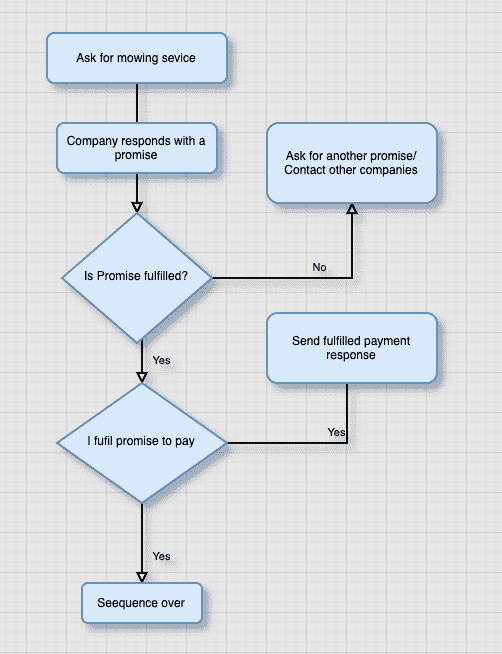

# TypeScript 中的异步/等待

> 原文：<https://blog.logrocket.com/async-await-in-typescript/>

如果您正在阅读这篇博客，您可能对 JavaScript 中的异步编程有所了解，并且您可能想知道它在 TypeScript 中是如何工作的。

由于 TypeScript 是 JavaScript 的超集，async/await 的工作原理是一样的，但是有一些额外的好处和类型安全。TypeScript 使您能够对预期的结果进行类型安全保护，甚至进行类型检查错误，这有助于您在开发过程的早期检测到错误。

async/await 本质上是承诺的[语法糖](https://medium.com/@matt.mcalister93/async-and-await-syntactic-sugar-for-promises-in-javascript-aee7ace36d14)，也就是说`async/await`关键字是承诺的包装器。一个`async`函数总是返回一个承诺。即使你省略了`Promise`关键字，编译器也会将你的函数包装在一个立即解析的承诺中。

请允许我演示:

```
const myAsynFunction = async (url: string): Promise<T> => {
    const { data } = await fetch(url)
    return data
}

const immediatelyResolvedPromise = (url: string) => {
    const resultPromise = new Promise((resolve, reject) => {
        resolve(fetch(url))
    })
    return  resultPromise
}

```

虽然它们看起来完全不同，但上面的代码片段或多或少是等价的。 [Async/await](https://blog.logrocket.com/promise-chaining-is-dead-long-live-async-await-445897870abc/) 只是让您能够以更同步的方式编写代码，并为您解开内联承诺。当您处理复杂的异步模式时，这是非常强大的。

为了充分利用`async/await`语法，你需要对承诺有一个基本的理解。让我们从根本上仔细看看承诺。

## TypeScript 中的承诺是什么？

根据 Lexico 的说法，在英语中，承诺是“一个人将做一件特定的事情或特定的事情将会发生的声明或保证。”在 JavaScript 中，承诺指的是对某件事将在特定时间发生的预期，你的应用程序依赖于该未来事件的结果来执行某些其他任务。

为了说明我的意思，我将分解一个真实世界的例子，并将其转换为伪代码，然后是实际的类型脚本代码。

假设我有一片草坪要割草。我联系了一家割草公司，他们承诺在几个小时内为我的草坪割草。反过来，我也承诺，如果草坪修剪得好，我会立刻付钱给他们。

你能看出这个模式吗？首先要注意的是，第二个事件完全依赖于前一个事件。如果第一个事件的承诺实现了，下一个事件的将会执行。在这种情况下，承诺要么被履行，要么被拒绝，要么仍然悬而未决。

让我们一步一步地看这个序列，然后编码出来。



## 承诺语法

在我们写出完整的代码之前，检查一下承诺的语法是有意义的——特别是一个解析为字符串的承诺的例子。

我们用关键字`new + Promise`声明了一个`promise`，它接受了`resolve`和`reject`参数。现在让我们为上面的流程图写一个承诺。

```
// I send a request to the company. This is synchronous
// company replies with a promise
const angelMowersPromise = new Promise<string>((resolve, reject) => {
    // a resolved promise after certain hours
    setTimeout(() => {
        resolve('We finished mowing the lawn')
    }, 100000) // resolves after 100,000ms
    reject("We couldn't mow the lawn")
})

const myPaymentPromise = new Promise<Record<string, number | string>>((resolve, reject) => {
    // a resolved promise with  an object of 1000 Euro payment
    // and a thank you message
    setTimeout(() => {
        resolve({
            amount: 1000,
            note: 'Thank You',
        })
    }, 100000)
    // reject with 0 Euro and an unstatisfatory note
    reject({
        amount: 0,
        note: 'Sorry Lawn was not properly Mowed',
    })
})

```

在上面的代码中，我们声明了公司的承诺和我们的承诺。公司承诺要么在 100，000 毫秒后解决，要么被拒绝。一个`Promise`总是处于三种状态之一:`resolved`如果没有错误，`rejected`如果遇到错误，或者`pending`如果`promise`既没有被拒绝也没有被履行。在我们的例子中，它属于`100000ms`周期。

但是，我们如何以顺序和同步的方式执行任务呢？这就是`then`关键字的用武之地。没有它，函数只是按照解析的顺序运行。

## 用`.then`顺序执行

现在我们可以将承诺链接起来，这允许它们按照`.then`的顺序运行。这就像一种正常的人类语言——做这个，然后那个，然后那个，等等。

```
angelMowersPromise
    .then(() => myPaymentPromise.then(res => console.log(res)))
    .catch(error => console.log(error))

```

上面的代码将运行`angelMowersPromise`。如果没有错误，它将运行`myPaymentPromise`。如果这两个承诺中有任何一个出错，它就会陷入`catch`阻塞。

现在让我们看一个更技术性的例子。前端编程中的一个常见任务是发出网络请求并相应地响应结果。

下面是一个从远程服务器获取雇员列表的请求。

```
const api =  'http://dummy.restapiexample.com/api/v1/employees'
   fetch(api)
    .then(response => response.json())
    .then(employees => employees.forEach(employee => console.log(employee.id)) // logs all employee id
    .catch(error => console.log(error.message))) // logs any error from the promise

```

有时，您可能需要并行或顺序执行大量承诺。像`Promise.all`或`Promise.race`这样的构造在这些场景中特别有用。

例如，假设您需要获取 1，000 名 GitHub 用户的列表，然后使用该 ID 发出一个额外的请求来获取每个用户的头像。您不一定要等待序列中的每个用户；你只需要所有提取的头像。我们将在稍后讨论`Promise.all`时更详细地研究这一点。

现在你已经对承诺有了基本的了解，让我们看看`async/await`的语法。

## `async/await`

Async/await 是一种非常容易处理承诺的语法。它提供了一个简单的接口来读取和写入承诺，使它们看起来是同步的。

一个`async/await`总是会返回一个`Promise`。即使省略了`Promise`关键字，编译器也会将函数包装在一个立即解析的`Promise`中。这使您能够将 [`async`函数](https://blog.logrocket.com/the-visual-learners-guide-to-async-js-62a0a03d1d57/)的返回值视为`Promise`，这在您需要解析大量异步函数时非常有用。

顾名思义，`async`总是与`await`齐头并进。也就是说，你只能在一个`async`函数中使用`await`。`async`函数通知编译器这是一个异步函数。

如果我们转换上面的承诺，语法如下所示:

```
const myAsync = async (): Promise<Record<string, number | string>> => {
    await angelMowersPromise
    const response = await myPaymentPromise
    return response
}

```

正如您可以立即看到的，这看起来可读性更好，并且看起来是同步的。我们在第 3 行告诉编译器在做任何事情之前等待`angelMowersPromise`的执行。然后，我们从`myPaymentPromise`返回响应。

您可能已经注意到我们省略了错误处理。我们可以用承诺中的`.then`后的`catch`块来做这件事。但是如果我们遇到错误会怎么样呢？这让我们想到了`try/catch`。

## 使用`try/catch`进行错误处理

我们将引用 employee 获取示例来说明实际的错误处理，因为它很可能在网络请求中遇到错误。

比方说，服务器关闭了，或者我们发送了一个格式错误的请求。我们需要暂停执行以防止程序崩溃。语法如下所示:

```
interface Employee {
    id: number
    employee_name: string
    employee_salary: number
    employee_age: number
    profile_image: string
}
const fetchEmployees = async (): Promise<Array<Employee> | string> => {
    const api = 'http://dummy.restapiexample.com/api/v1/employees'
    try {
        const response = await fetch(api)
        const { data } = await response.json()
        return data
    } catch (error) {
        if (error) {
            return error.message
        }
    }
}

```

我们将该函数初始化为一个`async`函数。我们期望返回值是雇员的`typeof`数组或一串错误消息。因此，承诺的类型是`Promise<Array<Employee> | string>`。

在`try`块中是我们期望函数在没有错误的情况下运行的表达式。`catch`块捕获任何出现的错误。在这种情况下，我们只需返回`error`对象的`message`属性。

它的妙处在于，任何第一次出现在`try`块中的错误都会被抛出并在`catch`块中被捕获。未捕获的异常可能导致难以调试的代码，甚至破坏整个程序。

## 使用 [LogRocket](https://logrocket.com/signup/) 增强错误处理:通过理解上下文更容易地调试 JavaScript 错误

调试代码总是一项单调乏味的任务。但是你越了解自己的错误，就越容易改正。

LogRocket 让你以新的独特的方式理解这些错误。我们的前端监控解决方案跟踪用户与您的 JavaScript 前端的互动，让您能够准确找出导致错误的用户行为。

[](https://logrocket.com/signup/)

LogRocket 记录控制台日志、页面加载时间、堆栈跟踪、慢速网络请求/响应(带有标题+正文)、浏览器元数据和自定义日志。理解您的 JavaScript 代码的影响从来没有这么简单过！

[免费试用](https://logrocket.com/signup/)。

## 与`Promise.all`同时执行

正如我前面所说的，有时候我们需要承诺同时执行。

让我们看一个来自员工 API 的例子。假设我们首先需要获取所有员工，然后获取他们的姓名，然后根据姓名生成一封电子邮件。显然，我们需要以同步的方式并行执行这些函数，这样一个函数就不会阻塞另一个函数。

在这种情况下，我们将使用`Promise.all`。根据 Mozilla 的说法，“`Promise.all`通常用于启动多个异步任务并发运行，并为其结果创建承诺，以便可以等待所有任务完成之后。”

在伪代码中，我们会有这样的内容:

*   获取所有用户=> `/employee`
*   等待所有用户数据。从每个用户提取`id`。>获取每个用户=`/employee/{id}`
*   根据用户名为每个用户生成电子邮件

```
const baseApi = 'https://reqres.in/api/users?page=1'
const userApi = 'https://reqres.in/api/user'

const fetchAllEmployees = async (url: string): Promise<Employee[]> => {
    const response = await fetch(url)
    const { data } = await response.json()
    return data
}

const fetchEmployee = async (url: string, id: number): Promise<Record<string, string>> => {
    const response = await fetch(`${url}/${id}`)
    const { data } = await response.json()
    return data
}
const generateEmail = (name: string): string => {
    return `${name.split(' ').join('.')}@company.com`
}

const runAsyncFunctions = async () => {
    try {
        const employees = await fetchAllEmployees(baseApi)
        Promise.all(
            employees.map(async user => {
                const userName = await fetchEmployee(userApi, user.id)
                const emails = generateEmail(userName.name)
                return emails
            })
        )
    } catch (error) {
        console.log(error)
    }
}
runAsyncFunctions()
```

在上面的代码中，`fetchEmployees`从`baseApi`获取所有的雇员。我们`await`响应，将其转换为`JSON`，然后返回转换后的数据。

要记住的最重要的概念是我们如何在带有关键字`await`的`async`函数中一行一行地执行代码。如果我们试图将数据转换成尚未完全等待的 JSON，我们会得到一个错误。同样的概念也适用于`fetchEmployee`，除了我们只取一个雇员。更有趣的部分是`runAsyncFunctions`，在这里我们同时运行所有的异步函数。

首先，将`runAsyncFunctions`中的所有方法包装在`try/catch`块中。接下来，`await`获取所有员工的结果。我们需要每个雇员的`id`来获取他们各自的数据，但是我们最终需要的是关于雇员的信息。

这是我们可以调用`Promise.all`来同时处理所有`Promises`的地方。每个`fetchEmployee` `Promise`对所有员工同时执行。员工信息中等待的数据随后被用于通过`generateEmail`功能为每个员工生成一封电子邮件。

在错误的情况下，它照常传播，从失败的承诺到`Promise.all`，然后成为我们可以在`catch`块中捕获的异常。

## 关键要点

`async`和`await`使我们能够以一种看起来和行为上都像同步代码的方式编写异步代码。这使得代码更容易阅读、编写和推理。

最后，当您在 TypeScript 中进行下一个异步项目时，我将牢记一些关键概念。

*   `await`只在`async`函数中起作用
*   标有`async`关键字的函数总是返回一个`Promise`
*   如果`async`中的返回值没有返回一个`Promise`，它将被包装在一个立即解析的`Promise`中
*   当遇到一个`await`关键字时，执行暂停，直到一个`Promise`完成
*   `await`将从已完成的`Promise`返回一个结果，或者从已拒绝的`Promise`抛出一个异常

## [LogRocket](https://lp.logrocket.com/blg/typescript-signup) :全面了解您的网络和移动应用

[](https://lp.logrocket.com/blg/typescript-signup)

LogRocket 是一个前端应用程序监控解决方案，可以让您回放问题，就像问题发生在您自己的浏览器中一样。LogRocket 不需要猜测错误发生的原因，也不需要向用户询问截图和日志转储，而是让您重放会话以快速了解哪里出错了。它可以与任何应用程序完美配合，不管是什么框架，并且有插件可以记录来自 Redux、Vuex 和@ngrx/store 的额外上下文。

除了记录 Redux 操作和状态，LogRocket 还记录控制台日志、JavaScript 错误、堆栈跟踪、带有头+正文的网络请求/响应、浏览器元数据和自定义日志。它还使用 DOM 来记录页面上的 HTML 和 CSS，甚至为最复杂的单页面和移动应用程序重新创建像素级完美视频。

[Try it for free](https://lp.logrocket.com/blg/typescript-signup)

.