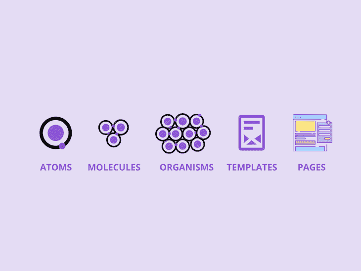
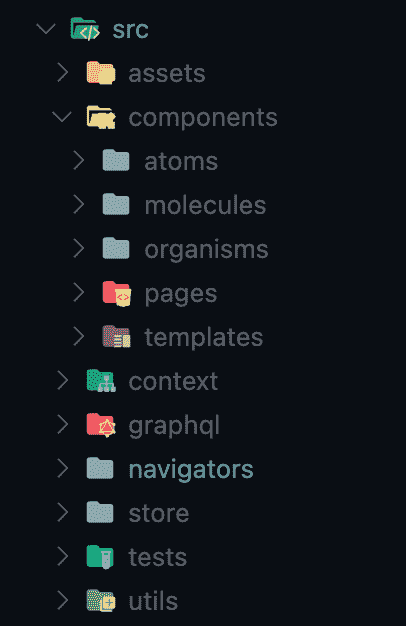
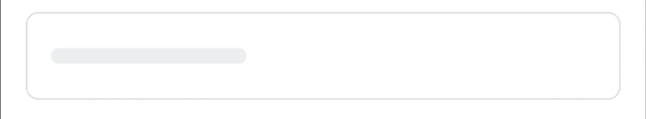
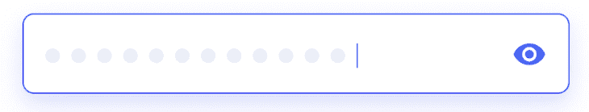
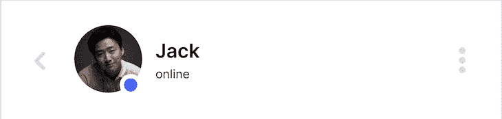
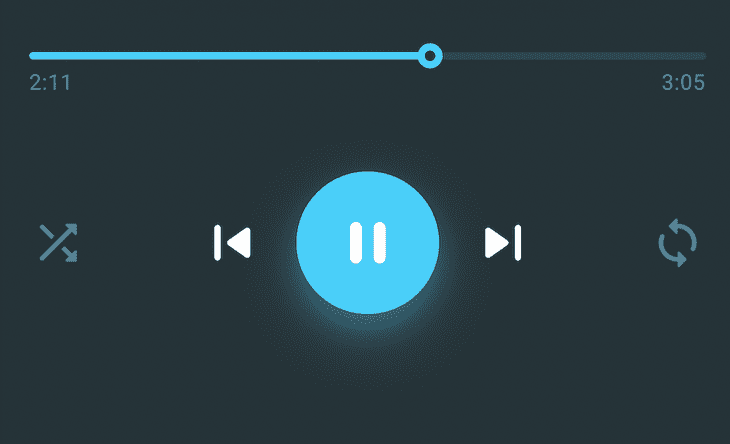
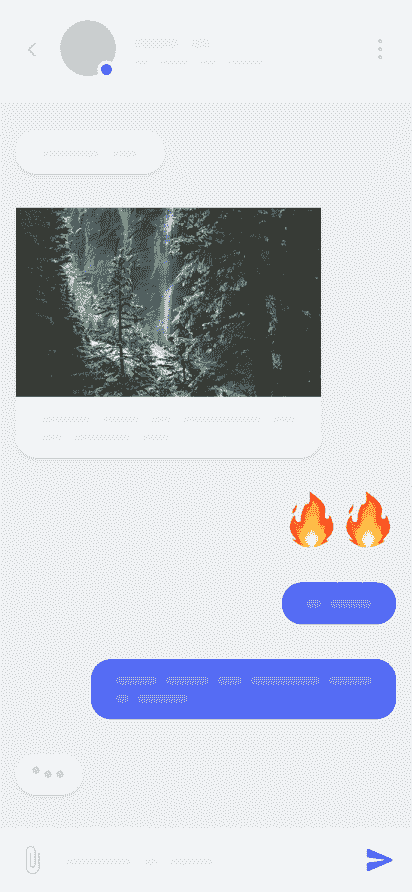
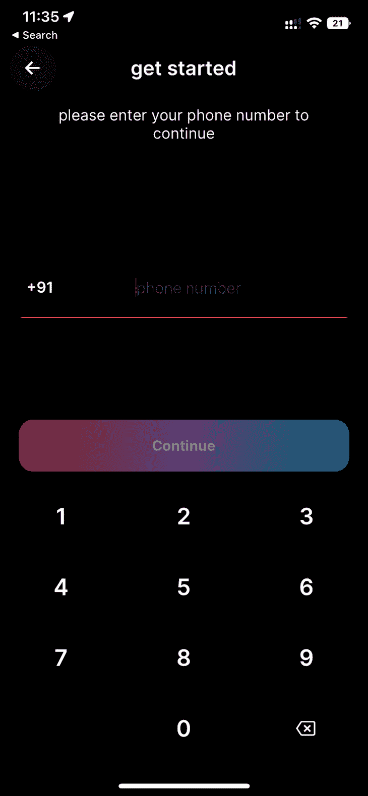

# 了解如何在 React Native 中使用原子设计

> 原文：<https://blog.logrocket.com/atomic-design-react-native/>

如今，组织和维护设计团队使用的组件和模块的最流行的方法之一是原子设计，这是一种将页面的所有元素分解成简单桶的文件结构方法。

文件结构是一种排列各种文件的方式，如组件、类等。—以特定的方式，以确保开发过程尽可能高效。在本文中，我们将着眼于原子设计:它是什么，以及作为一个整体构成方法论的每个元素的角色。

## 什么是原子设计？

原子设计是组织项目组件的一种特定方式；它直接受到化学中原子概念的启发，因此得名。原子设计的灵感来自原子是最小单位的概念，其次是原子的组合，最后是由分子组成的有机体。

举个例子，原子指定了最小的组件，比如按钮和输入。分子表示这些原子的组合(例如，形式)。由这些分子组成的整页可以被认为是有机体，由所有元素组成。

本质上，原子设计用于以模块化的方式构建用户界面，主要关注于创建组件。

现在我们了解了原子设计是如何产生的，前端工程师如何在他们的项目中应用这个概念？让我们看看如何实现原子设计原则，以更好地组织 React 原生项目中的组件和页面。

为了跟上进度，你应该熟悉 React Native 的[基础知识，包括](https://blog.logrocket.com/how-to-build-ios-apps-using-react-native/)[【JSX】](https://blog.logrocket.com/diving-into-the-new-jsx-transform/)、[组件](https://blog.logrocket.com/a-complete-guide-to-default-props-in-react-984ea8e6972d/)(类和功能)，以及样式。本指南假设您已经完成了应用程序的基本设置。

你 c 安 简单地 复制并粘贴本指南 中的但是我建议 阅读 贯穿整个 t对于 一个完整的 理解。本指南假设您已经为您的 r app 完成了基本设置。

## React Native 中的原子设计方法



正如我们上面讨论的，原子设计从化学的原子和分子概念中获得灵感。它由以下五个不同的层次组成:

1.  原子:这些是建筑材料，不能再分解了
2.  **分子:**原子聚集在一起形成单个分子
3.  **生物体:**分子结合在一起创造出一部分界面
4.  **模板:**内容结构
5.  **页面:**作为模板实例构建的接口



在根据原子设计原则组织组件之后，这就是典型项目结构的样子。

## 原子




原子是项目的基本单位。它们是整个设计所依赖的基本构件。这些可以是输入和按钮，也可以是调色板和动画。它们是可以在分子、有机体和模板的整个项目中使用的最小可能单位。

由于它们有许多状态，例如，在某些情况下可能被禁用的按钮或输入，因此它们应该是易于全局访问的，并且以使它们在整个项目的任何地方都可用的方式构建。

下面的代码块包含一个按钮、一个文本和一个加载器组件的代码。对于这些代码块中使用的自定义字体，请在这里查看可用的指南。

### Text.tsx

```
import React, {ReactElement} from 'react';
import {View, StyleSheet, ViewProps, StyleProp, TextStyle} from 'react-native';
import {Text as UKText, TextProps} from '@ui-kitten/components';
type Props = {
  // style?: StyleProp<TextStyle>;
  [key: string]: any;
};
const Text = ({style, ...props}: Props) => {
  return (
    <UKText style={StyleSheet.flatten([styles.txt, style])} {...props}>
      {props.children}
    </UKText>
  );
};
const styles = StyleSheet.create({
  txt: {
    fontFamily: 'Inter',
  },
});
export default Text;

```

### LoaderGrad.tsx

```
import MaskedView from '@react-native-masked-view/masked-view';
import React from 'react';
import {ActivityIndicator, ActivityIndicatorProps} from 'react-native';
import LinearGradient from 'react-native-linear-gradient';
type Props = {
  colors: string[];
  start?: {x: number; y: number};
  end?: {x: number; y: number};
} & ActivityIndicatorProps;
const LoaderGrad = ({colors, start, end, ...props}: Props) => {
  return (
    <MaskedView maskElement={<ActivityIndicator {...props} />}>
      <LinearGradient colors={colors} start={start} end={end}>
        <ActivityIndicator {...props} style={[props.style, {opacity: 0}]} />
      </LinearGradient>
    </MaskedView>
  );
};
export default LoaderGrad;

```

## 分子



正如我们所知，当两个或更多的原子结合在一起时，它们形成一个分子，提供新的组合性质。类似地，原子设计中的分子是各种原子组件的组合，以构建一个全新的组件。

在上面的例子中，我们可以看到一个使用视图、输入和按钮构建的输入组。组合这三个原子组件允许我们构建这个分子，即密码输入部分的分组组件，它使用户能够按下眼睛以在输入中显示或隐藏他们的密码。

这里我们有一个自定义按钮的例子，带有一个加载指示器——在我们的设计中分组形成一个分子:

```
import {Layout} from '@ui-kitten/components';
import AnimatedLottieView from 'lottie-react-native';
import React, {ReactNode} from 'react';
import {
  StyleSheet,
  View,
  Pressable,
  PressableProps,
  ViewStyle,
  TextStyle,
} from 'react-native';
import LinearGradient from 'react-native-linear-gradient';
import {GLOBAL_STYLE} from '../../../assets/theme';
import {HAPTICS} from '../../../utils';
import {LoaderGrad} from '../Activity';
import {Text, TextGrad} from '../Typography';
type Props = {
  children?: React.ReactNode;
  child?: (pressed: any) => React.ReactNode;
  style?: ViewStyle;
  containerStyle?: ViewStyle;
  boxStyle?: ViewStyle;
  title?: string;
  icon?: any;
  name?: string;
  size?: number;
  lottie?: any;
  noShadow?: boolean;
  noBg?: boolean;
  loading?: boolean;
  color?: string;
} & PressableProps;
const PrimeBtn = ({
  style,
  containerStyle,
  boxStyle,
  title,
  icon,
  name,
  size,
  noShadow,
  lottie,
  noBg,
  loading,
  color,
  onPress,
  disabled,
  ...props
}: Props) => {
  const Icon = icon;
  const onPressIn = () => {
    HAPTICS.heavy();
  };
  const onPressOut = () => {
    HAPTICS.heavy();
  };
  return (
    <Pressable
      onPressIn={onPressIn}
      onPressOut={onPressOut}
      style={StyleSheet.flatten([boxStyle])}
      onPress={onPress}
      disabled={disabled || loading}>
      {({pressed}) => (
        <LinearGradient
          colors={GLOBAL_STYLE.gradients.prime_btn}
          style={StyleSheet.flatten([
            styles.container,
            {opacity: disabled ? 0.5 : 1},
          ])}
          start={{
            x: 0,
            y: 0,
          }}
          end={{
            x: 1,
            y: 0.5,
          }}>
          <Layout
            style={{
              ...StyleSheet.flatten([
                styles.btn,
                style,
                {
                  opacity: pressed ? 0.95 : 1,
                },
                noBg && {
                  backgroundColor: 'transparent',
                },
              ]),
            }}>
            {loading ? (
              <LoaderGrad
                colors={
                  noBg ? ['#fff', '#fff'] : GLOBAL_STYLE.gradients.prime_btn
                }
                start={{
                  x: 0,
                  y: 0,
                }}
                end={{
                  x: 1,
                  y: 1,
                }}
              />
            ) : (
              <>
                {Icon && (
                  <Icon
                    name={name}
                    size={size || 24}
                    color={
                      pressed
                        ? GLOBAL_STYLE.colors.primary
                        : GLOBAL_STYLE.colors.primary_dark
                    }
                  />
                )}
                <TextGrad
                  colors={
                    noBg
                      ? color
                        ? [color, color]
                        : ['#fff', '#fff']
                      : GLOBAL_STYLE.gradients.prime_btn
                  }
                  start={{
                    x: 0,
                    y: 0,
                  }}
                  end={{
                    x: 1,
                    y: 1,
                  }}
                  style={{
                    ...StyleSheet.flatten([
                      styles.txt,
                      {
                        opacity: pressed ? 0.9 : 1,
                      },
                      color && {color: color},
                    ]),
                  }}>
                  {title || ''}
                </TextGrad>
              </>
            )}
          </Layout>
        </LinearGradient>
      )}
    </Pressable>
  );
};
const styles = StyleSheet.create({
  container: {
    // width: 50,
    height: 55,
    padding: 1,
    borderRadius: 15,
  },
  btn: {
    flex: 1,
    alignItems: 'center',
    justifyContent: 'center',
    borderRadius: 14,
  },
  txt: {
    fontWeight: 'bold',
  },
});
export default PrimeBtn;

```

## 有机体





同样，当我们沿着链往上走，把多个分子组合在一起，我们就得到一个有机体。有机体仍然不能被认为是项目的整体结构，因为它们应该是独立的，并且可以在任何给定项目的各个部分中重用。

在这个阶段，我们开始看到一个有点成型的 UI 结构。在上面的例子中，各种分子被组合在一起用于标题和音乐控制。标题可以在项目的不同页面上重复使用，因为它们在大多数页面上都具有相同的结构。

这里我们有一个包含`button`和`text`组件的基本报头示例:

```
import React from 'react';
import {View, StyleSheet} from 'react-native';
import {Layout} from '@ui-kitten/components';
import {RoundBtn} from '../../atoms/Buttons';
import {Text} from '../../atoms/Typography';
type Props = {
  title?: string;
};
const BasicHeader = ({title}: Props) => {
  return (
    <View style={styles.container}>
      <RoundBtn noShadow />
      <View style={styles.mid}>
        <Text style={styles.title}>{title}</Text>
      </View>
      <RoundBtn style={{opacity: 0}} active={true} />
    </View>
  );
};
const styles = StyleSheet.create({
  container: {
    flexDirection: 'row',
    alignSelf: 'stretch',
    paddingHorizontal: 10,
  },
  mid: {
    flex: 1,
    alignItems: 'center',
    justifyContent: 'center',
  },
  title: {
    fontSize: 21,
    fontWeight: '600',
  },
});
export default BasicHeader;

```

## 模板



这些是组合在一起形成页面或布局框架的多个有机体。就设计而言，这是所有方面集合在一起的地方；这就像是书页的蓝图。除了 UI 设计所要求的默认值之外，它们本身不包含任何要显示的数据。

## 页


页面是模板的实例。它们是设计的完整形式，在模板中完全成形。数据与模板相结合，期望的结果就是我们以页面的形式得到的结果。

页面还演示了模板的可行性。例如，当更多的数据添加到设计中时，设计将如何反应——例如，聊天可以有多种形式的数据作为消息。可能有许多包含文本、图像或视频的消息。我们可以看到所有这些东西在屏幕上呈现出来。

页面是我们用原子设计构建的所有东西的最终结果。虽然页面当然不是来自化学中的原子概念，但它们代表了使用原子设计作为构建页面基础的最终产品。

这里，我们终于有了注册页面，使用我们创建的原子和分子构建。

```
import React, {useState} from 'react';
import {View, StyleSheet, KeyboardAvoidingView} from 'react-native';
import {Input, Layout} from '@ui-kitten/components';
import {PrimeBtn, SecBtn} from '../../molecules/Buttons';
import {useSafeAreaInsets} from 'react-native-safe-area-context';
import {Keypad, PhoneInput} from '../../molecules/Inputs';
import {BasicHeader} from '../../molecules/Headers';
import {Text} from '../../atoms/Typography';
import {GLOBAL_STYLE} from '../../../assets/theme';
import {useNavigation} from '@react-navigation/native';
const Register = () => {
  const insets = useSafeAreaInsets();
  const [phone, setPhone] = useState('');
  const nav = useNavigation<any>();
  const _signUp = () => {
    nav.navigate('OTP_SCREEN');
  };
  return (
    <KeyboardAvoidingView style={{flex: 1}}>
      <Layout
        style={StyleSheet.flatten([
          styles.container,
          {paddingTop: insets.top, paddingBottom: insets.bottom},
        ])}>
        <BasicHeader title={'get started'} />
        <View style={styles.topCon}>
          <View style={styles.infoCon}>
            <Text style={styles.infoTxt}>
              please enter your phone number to continue
            </Text>
          </View>
          <View style={styles.inputCon}>
            <PhoneInput
              size={'large'}
              placeholder={'phone number'}
              value={phone}
            />
          </View>
        </View>
        <View style={styles.bottomCon}>
          <PrimeBtn
            title={'Continue'}
            boxStyle={{marginBottom: 10, marginHorizontal: 20}}
            noBg={true}
            // color={GLOBAL_STYLE.colors.dark}
            disabled={phone?.length != 10}
            // loading
            onPress={_signUp}
          />
          <Keypad onChangeValue={setPhone} />
        </View>
      </Layout>
    </KeyboardAvoidingView>
  );
};
const styles = StyleSheet.create({
  container: {
    flex: 1,
  },
  topCon: {
    flex: 1,
  },
  infoCon: {
    alignSelf: 'stretch',
    paddingHorizontal: 35,
    paddingVertical: 15,
  },
  infoTxt: {
    textAlign: 'center',
    fontSize: 16,
  },
  inputCon: {
    paddingHorizontal: 20,
    flex: 1,
    justifyContent: 'center',
  },
  input: {},
  bottomCon: {
    // paddingHorizontal: 20,
  },
});
export default Register;

```

一旦我们使用原子设计原则完成了所有元素的组装，我们的产品将会是这样的:



## 结论

有许多不同的方法可以用来构建您的 [React Native](https://blog.logrocket.com/tag/react-native/) 项目。即使在 React 的官方网站上，也注意到没有关于如何管理文件和文件夹的标准。如果你正在寻找一种简单而有效的方法来组织你的项目文件，那么原子设计可能是你的最佳选择。

原子设计是我组织项目的主要方法，我希望这种方法像帮助我和许多其他开发人员一样帮助你。

## [LogRocket](https://lp.logrocket.com/blg/react-native-signup) :即时重现 React 原生应用中的问题。

[](https://lp.logrocket.com/blg/react-native-signup)

[LogRocket](https://lp.logrocket.com/blg/react-native-signup) 是一款 React 原生监控解决方案，可帮助您即时重现问题、确定 bug 的优先级并了解 React 原生应用的性能。

LogRocket 还可以向你展示用户是如何与你的应用程序互动的，从而帮助你提高转化率和产品使用率。LogRocket 的产品分析功能揭示了用户不完成特定流程或不采用新功能的原因。

开始主动监控您的 React 原生应用— [免费试用 LogRocket】。](https://lp.logrocket.com/blg/react-native-signup)