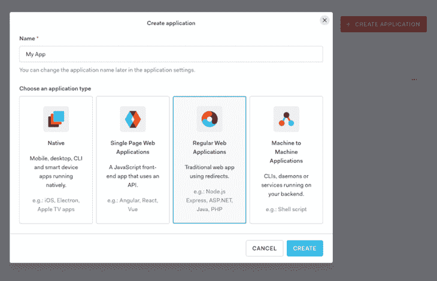
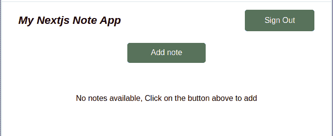
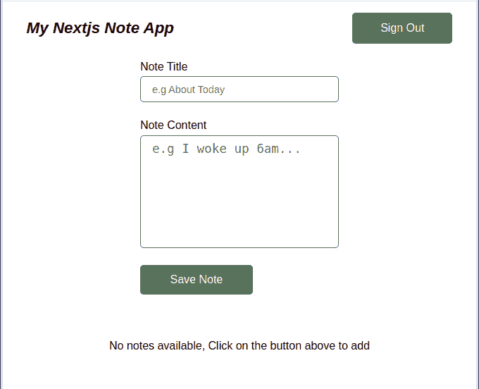
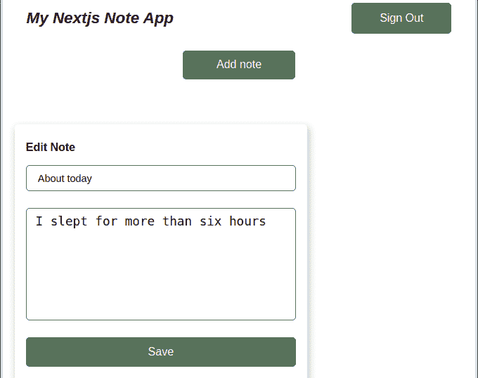
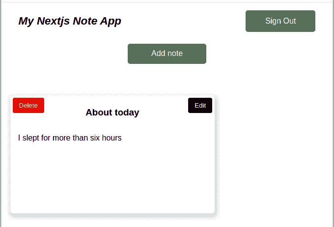

# 使用 Auth0 - LogRocket Blog 验证您的 Next.js 应用程序

> 原文：<https://blog.logrocket.com/authenticate-your-next-js-application-using-auth0/>

身份验证，或确认应用程序中用户的身份，对于在 web 应用程序中实现是至关重要的。身份认证创建了一个通过用户名、密码、令牌、指纹、面部识别或安全问题来验证用户凭据的系统。

开发人员经常在构建自己的身份验证系统和使用第三方服务之间左右为难。在本文中，我们将看看如何使用 [Auth0](https://auth0.com) 在 Next.js 应用程序中实现身份验证。

## 什么是 Auth0？

根据其文档，“ [Auth0](https://auth0.com/docs/get-started) 是一种灵活的嵌入式解决方案，可为您的应用程序添加认证和授权服务”。基本上，Auth0 允许您使用任何语言或堆栈为应用程序增加安全性。它的一些功能包括:

*   多因素身份验证:需要两个或更多凭据才能访问(即双因素身份验证)
*   社交登录 **:** 允许你注册并使用你的社交网络登录你的应用
*   单点登录:存储凭证，因此您不必每次登录都输入凭证
*   分析:分析和报告工具

Auth0 还自带了各种前端库的框架和 SDK。其中之一是 [Auth0 Next.js SDK](https://github.com/auth0/nextjs-auth0) ，它允许您使用 Auth0 向 Next.js 应用程序添加身份验证。

## Auth0 Next.js SDK

首先，让我们从 npm 安装 [Auth0 Next.js SDK](https://www.npmjs.com/package/@auth0/nextjs-auth0) 包。我们将根据我们独特的项目需求配置 Auth0，然后我们将准备实施它！

通过 Auth0 Next.js SDK，我们可以使用客户端和服务器端方法向应用程序添加身份验证。在后端，我们将使用 API 路由。在前端，我们将使用 [React 上下文 API](https://blog.logrocket.com/a-deep-dive-into-react-context-api/) 。

## 正在安装 Auth0

首先，[创建一个 Auth0 帐户](http://React%20Context%20API)。导航到您的 [Auth0 仪表板](https://manage.auth0.com/dashboard/us/dev-ubpam88v/)并点击应用程序。创建新的应用程序；我们将使用常规的 web 应用程序。

您将看到一个弹出窗口，询问您正在使用哪个框架或堆栈。选择`Next.js`。



点击**应用**选项卡，选择您最近创建的应用。在您的**设置**选项卡上，滚动至应用程序 URIs 子部分，并更新以下详细信息:

在上面的代码片段中，我们添加了一个[回调 URL](https://auth0.com/docs/users/redirect-users-after-login) 来在用户登录到我们的应用程序后重定向用户，并添加了一个[注销 URL](https://auth0.com/docs/logout/redirect-users-after-logout) 来在用户注销后重定向用户。

在我们的 Auth0 仪表板上，我们可以为用户配置所需的身份验证类型，添加登录和注册页面，添加用户注册，甚至为用户添加数据库。现在，我们准备好创建我们的 Next.js 应用程序了！

## 创建 Next.js 应用程序

要初始化 Next.js 应用程序，我推荐使用 [Create Next App](https://blog.logrocket.com/introducing-the-new-create-next-app/) 。这个 CLI 工具会自动设置您的应用程序所需的一切。运行以下命令创建一个新项目:

```
npx create-next-app {project name}

```

或者，您可以使用纱线:

```
yarn create-next-app {project name}

```

接下来，`cd`进入项目目录，使用下面的命令启动开发服务器:

```
cd {project name} && yarn run dev

```

## 为 Next.js 配置 Auth0

现在，我们将在应用程序中安装`@auth0/next.js-auth0`依赖项:

```
npm install @auth0/nextjs-auth0

```

使用纱线:

```
yarn add @auth/nextjs-auth0

```

接下来，让我们安装`dotenv`包，我们将使用它来存储我们的环境变量。我们还添加了样式组件，我们将使用它们来设计我们的应用程序:

```
npm install dotenv styled-components

```

使用纱线:

```
yarn add dotenv styled-components

```

在项目的根目录下创建一个名为`.env`的新文件，并添加 Auth0 提供的以下凭证:

```
AUTH0_SECRET="your auth secret goes here"
AUTH0_BASE_URL="http://localhost:3000"
AUTH0_ISSUER_BASE_URL="your base URL from auth0"
AUTH0_CLIENT_ID="your unique ID goes here"
AUTH0_CLIENT_SECRET="your auth0 secret goes here"

```

`AUTH0_SECRET`是一个 32 个字符的秘密，用于加密 cookies，而`AUTH0_CLIENT_SECRET`可以在您的 Auth0 仪表板上的 Settings 选项卡下找到。

你可以在文档中阅读更多关于 [Auth0 的配置](https://auth0.com/docs/)。

## 构建应用程序组件和路线

在 Next.js 应用程序的`src`目录中创建一个名为`components`的新文件夹。在`components`文件夹中，创建一个名为`Navbar`的新文件夹。在`Navbar`中，创建一个名为`Navbar.jsx`的文件。

让我们创建一个名为`Navbar`的功能组件，它有两个动态链接，一个用于用户登录，另一个用于用户注销:

```
// components/Navbar/Navbar.jsx

import { useUser } from "@auth0/nextjs-auth0";
import styled from "styled-components";

const Navbar = () => {
    const { user } = useUser();
    return (
        <Nav>
            <h1>My Nextjs Note App</h1>
            {!user ? (
                <a href="/api/auth/login">Sign In</a>
            ) : (
                <a href="/api/auth/logout">Sign Out</a>
            )}
        </Nav>
    );
};

```

在上面的代码中，我们创建了一个名为`Navbar`的功能组件。在里面，我们初始化了一个`nav`标签，并添加了一个带有应用程序标题的`h1`。然后，我们检查用户是否登录。如果是，我们会显示登出按钮。如果他们没有登录，我们会呈现一个登录按钮。

接下来，我们将向我们的`Navbar`文件添加样式:

```
const Nav = styled.nav`
    display: flex;
    align-items: center;
    justify-content: space-between;
    width: 90%;
    margin: 0 auto;
    h1 {
        font-size: 1.4rem;
        font-style: oblique;
    }
    & > div {
        display: flex;
        a {
            margin-left: 1rem;
        }
    }
    a {
        display: block !important;
        border: none;
        outline: none;
        background: #5b6d5b;
        color: #fff;
        font-size: 1rem;
        padding: 0.8rem 2.5rem;
        border-radius: 5px;
        transition: opacity 0.7s;
        text-decoration: none;
        &:hover {
            opacity: 0.8;
        }
    }
`;
export default Navbar;

```

我们的`Navbar`组件应该如下图所示:



## 构建表单组件

在本节中，我们将构建一个表单，供用户向他们的应用程序添加注释。我们将构建一个输入字段、一个提交按钮和一个在表单组件中提交注释的函数。

我们将使用`localStorage`作为存储笔记的数据库:

```
import { useState } from "react";
import styled from "styled-components";
import { addNote } from "../../utils/utils";

const Form = ({ hideForm, setRefresh }) => {
    const [title, setTitle] = useState("");
    const [content, setContent] = useState("");
    const SubmitHandler = (e) => {
        e.preventDefault();
        title && content && addNote(title, content);
        setTitle("");
        setContent("");
        hideForm(false);
        setRefresh();
    };

```

在上面的代码块中，我们从 React 导入了`useState`钩子，从`utilities`目录导入了`addNote`对象。然后，我们创建了一个表单组件，它接受一个`hideForm`和一个`setRefresh`道具。

接下来，我们添加了`SubmitHandler`函数来处理提交我们的笔记。对于要提交的注释，它必须包含标题和内容。

现在，让我们构建一个组件和按钮来使用上面的函数提交我们的笔记:

```
return (
        <FormWrapper onSubmit={SubmitHandler}>
            <div>
                <label htmlFor="title">Note Title</label>
                <input
                    onChange={(e) => setTitle(e.target.value)}
                    value={title}
                    type="text"
                    name="note-title"
                    id="title"
                    placeholder="e.g About Today"
                />
            </div>
            <div>
                <label htmlFor="content">Note Content</label>
                <textarea
                    onChange={(e) => setContent(e.target.value)}
                    value={content}
                    name="note-content"
                    id="content"
                    placeholder="e.g I woke up 6am..."
                />
            </div>
            <button type="submit">Save Note</button>
        </FormWrapper>
    );
};

```

在上面的代码块中，我们创建了两个输入字段，一个用于添加注释标题，另一个供用户输入内容。最后，我们添加了一个提交按钮。

为了完成我们的`components`目录，我们需要为一个笔记构建一个组件。

## 构建 notes 组件

现在，我们将编写一个函数，作为向应用程序添加注释的主干。我们将初始化用户添加注释后编辑和删除注释的函数。该组件将为我们的注释获取一个 ID，并将其设置为应用程序的状态:

```
import { useState } from "react";
import styled from "styled-components";
import { editNote, deleteNote } from "../../utils/utils";

const Note = ({ title, id, content, setRefresh }) => {
    const [edit, setEdit] = useState(false);
    const [newTitle, setNewTitle] = useState(title);
    const [newContent, setNewContent] = useState(content);

    const submitHandler = (e) => {
        e.preventDefault();
        newTitle && newContent && editNote(id, newTitle, newContent);
        setEdit(false);
        setRefresh();
    };

    const deleteHandler = () => {
        const ok = window.confirm("Are you sure you want to delete?");
        if (ok) {
            deleteNote(id);
            setRefresh();
        }
    };

```

在上面的代码中，我们初始化了一个函数`Note`，它接受`title`、`id`、`content`和`setRefresh`作为道具。使用`useState`钩子，我们给`title`、`edit`和`newContent`添加了状态。就像我们对表单组件所做的那样，我们为用户创建了一个`submitHandler`函数。

为了处理用户删除注释，我们创建了另一个名为`deleteHandler`的函数，在试图删除基于注释`ID`的注释之前，该函数会请求确认警告。

接下来，我们将构建一个用于编辑笔记的`Edit`按钮，并添加一个用于使用条件语句删除帖子的`Delete`按钮。

```
return (
        <Wrapper>
            {!edit ? (
                <button
                    className="edit-btn"
                    onClick={() => setEdit(true)}
                    type="button"
                >
                    Edit
                </button>
            ) : null}
            {!edit ? (
                <button className="delete-btn" onClick={deleteHandler} type="button">
                    Delete
                </button>
            ) : null}
            {edit ? (
                <form onSubmit={submitHandler}>
                    <h4>Edit Note</h4>
                    <div>
                        <input
                            onChange={(e) => setNewTitle(e.target.value)}
                            value={newTitle}
                            type="text"
                            name="note-title"
                            id="title"
                            placeholder="e.g About Today"
                        />
                    </div>
                    <div>
                        <textarea
                            onChange={(e) => setNewContent(e.target.value)}
                            value={newContent}
                            name="note-content"
                            id="content"
                            placeholder="e.g I woke up 6am..."
                        />
                    </div>
                    <button type="submit">Save</button>
                </form>
            ) : (
                <>
                    <h3>{title}</h3>
                    <p>{content}</p>
                </>
            )}
        </Wrapper>
    );
};

```

在上面的代码块中，我们添加了供用户添加注释的输入字段。我们还增加了`Edit`和`Delete`按钮。为了编辑输入，我们使用输入的`ID`更新了用户的注释。

请注意屏幕上的错误，显示`utils`未声明。我们将在我们的`src`中创建一个名为`utils`的新文件夹，它将包含在用户设备的本地存储中存储用户笔记的逻辑。

## 存储和编辑笔记

让我们在`utils`目录中编写这个任务的逻辑。

### 将用户注释添加到本地存储:

```
/**
 * Adds Note to list of Note in localStorage
 * @param {*} title note title
 * @param {*} content body of note
 */
export const addNote = (title, content) => {
    let notesArr = JSON.parse(localStorage.getItem("next:note-app"));
    if (notesArr?.length) {
        const newNote = {
            id: new Date().getTime(),
            title,
            content,
        };
        const newNotesArr = [...notesArr, newNote];
        localStorage.setItem("next:note-app", JSON.stringify(newNotesArr));
    } else {
        const newNote = {
            id: new Date().getTime(),
            title,
            content,
        };
        const newNotesArr = [newNote];
        localStorage.setItem("next:note-app", JSON.stringify(newNotesArr));
     }
};

```

在上面的代码中，我们导出了接受标题和内容的`addNote`对象。接下来，我们初始化该对象，并将其作为 JSON 传递给本地存储。为了确保用户不会添加空笔记，我们添加了一个方法，该方法监视用户笔记的数组长度，然后将其作为 JSON 字符串存储在本地存储中。

我们的组件应该如下图所示:



### 编辑便笺

在本节中，我们将创建一个函数，在将笔记添加到用户的本地存储后对其进行编辑:

```
**
 * Edit Note Func
 * @param {*} id note id
 * @param {*} title new title
 * @param {*} content new content
 */
export const editNote = (id, title, content) => {
    let notesArr = JSON.parse(localStorage.getItem("next:note-app"));
    let noteIndex = notesArr.findIndex((note) => note.id === id);
    const selectedNote = notesArr[noteIndex];
    const updatedNote = {
        id: selectedNote.id,
        title,
        content,
    };
    notesArr.splice(noteIndex, 1, updatedNote);
    localStorage.setItem("next:note-app", JSON.stringify(notesArr));
};

```

在上面的代码块中，我们将本地存储中的一个注释解析为一个 JSON 文件。然后，我们通过传递注释的`ID`来检索我们想要编辑的注释。使用原生的 [JavaScript Splice](https://developer.mozilla.org/en-US/docs/Web/JavaScript/Reference/Global_Objects/Array/splice) 方法，我们更新注释的内容，替换注释或向注释添加新内容。

我们的编辑页面应该如下图所示:



## 呈现我们的应用程序

让我们导航到`src`文件夹中的`api`目录。在里面，让我们更新`index.js`来呈现我们的整个应用程序:

```
import Head from "next/head";
import { useState, useEffect } from "react";
import { useUser } from "@auth0/nextjs-auth0";
import styled from "styled-components";
import Form from "../components/Form/Form";
import Navbar from "../components/Navbar/Navbar";
import Note from "../components/Note/Note";

const App = () => {
    const [showForm, setShowForm] = useState(false);
    const [notes, setNotes] = useState([]);
    const [refresh, setRefresh] = useState(false);
    const { user, isLoading, error } = useUser();

    useEffect(() => {
        // Our notes from LocalStorage (our DB)
        const store = JSON.parse(localStorage.getItem("next:note-app"));
        setNotes(store);
    }, [refresh]);
    return (
        <>
            <Head>
                <title>Next.js note app with auth0</title>
                <meta
                    name="description"
                    content="A basic crud project to illustrate how to use autho in a next.js app"
                />
                <link rel="icon" href="/favicon.ico" />
            </Head>
            <Wrapper>
                <Navbar />
                {isLoading ? (
                    <p className="nodata-indicator">Loading...</p>
                ) : error ? (
                    <p>{error?.message}</p>
                ) : user ? (
                    <>
                        {showForm ? (
                            <article className="form-wrapper">
                                <Form
                                    setRefresh={() => setRefresh(!refresh)}
                                    hideForm={setShowForm}
                                />
                            </article>
                        ) : (
                            <article className="form-wrapper">
                                <button onClick={() => setShowForm(!showForm)} type="button">
                                    Add note
                                </button>
                            </article>
                        )}
                        {!notes?.length ? (
                            <div>
                                <p className="nodata-indicator">
                                    No notes available, Click on the button above to add
                                </p>
                            </div>
                        ) : (
                            <article className="notes-wrapper">
                                {notes.map((note) => {
                                    return (
                                        <Note
                                            key={note.id}
                                            id={note.id}
                                            title={note.title}
                                            content={note.content}
                                            setRefresh={() => setRefresh(!refresh)}
                                        />
                                    );
                                })}
                            </article>
                        )}
                    </>
                ) : (
                    <div>
                        <p className="non-auth-text">
                            Welcome to my next.js note app, sign in to get started
                        </p>
                    </div>
                )}
            </Wrapper>
        </>
    );
};

```

在上面的代码块中，我们使用`useEffect`钩子从我们的本地存储中获取注释，本地存储充当我们的数据库，并将它们呈现为我们的默认注释。

我们还为我们的应用程序添加了一个标题。使用 Auth0，我们为用户添加了登录特性，以便登录他们的个性化 notes 应用程序。我们还创建了一个添加注释的按钮。为了呈现我们所有的笔记，我们使用了原生的 [JavaScript map](https://www.w3schools.com/jsref/jsref_map.asp) 对象。

为了完成我们的应用程序，让我们添加一些样式:

```
const Wrapper = styled.section`
    margin: 1rem 0;
    max-width: 100%;
    overflow-x: hidden;
    height: 100%;
    .form-wrapper {
        max-width: 60%;
        margin: 1.5rem auto 0;
        display: flex;
        flex-direction: column;
        align-items: center;
        justify-content: center;
        button {
            border: none;
            outline: none;
            background: #5b6d5b;
            color: #fff;
            font-size: 1rem;
            height: 2.6rem;
            width: 10rem;
            border-radius: 5px;
            transition: opacity 0.7s;
            &:hover {
                opacity: 0.8;
            }
        }
    }
    .notes-wrapper {
        max-width: 95%;
        margin: 4rem auto;
        display: grid;
        grid-template-columns: repeat(3, 1fr);
        grid-gap: 2rem;
    }
    .nodata-indicator {
        margin-top: 4rem;
        text-align: center;
    }
    .non-auth-text {
        margin-top: 4rem;
        text-align: center;
        font-size: 1.5rem;
    }
`;
export default App;

```

我们的应用程序应该如下图所示:



## 结论

在本文中，我们学习了如何在 Next.js 应用程序中设置 Auth0 进行身份验证。

我们使用 Next.js 和 Auth0 Next.js SDK 构建了一个 Notes 应用程序。然后，我们添加了 Auth0 自带的身份验证功能，如登录、注销和电子邮件验证。

如果您正在寻找一种简单的方法来向您的项目添加身份验证，Auth0 是一个很好的工具。在本文中，我们只涉及了不同验证方法的表面。最终，最适合您的解决方案将取决于您项目的需求。

本文中代码的工作版本可以在 [Code](https://codesandbox.io/s/amazing-kapitsa-m06je) [S](https://codesandbox.io/s/amazing-kapitsa-m06je) [和 box 中找到。](https://codesandbox.io/s/amazing-kapitsa-m06je)

## [LogRocket](https://lp.logrocket.com/blg/nextjs-signup) :全面了解生产 Next.js 应用

调试下一个应用程序可能会很困难，尤其是当用户遇到难以重现的问题时。如果您对监视和跟踪状态、自动显示 JavaScript 错误、跟踪缓慢的网络请求和组件加载时间感兴趣，

[try LogRocket](https://lp.logrocket.com/blg/nextjs-signup)

.

[](https://lp.logrocket.com/blg/nextjs-signup)[](https://lp.logrocket.com/blg/nextjs-signup)

LogRocket 就像是网络和移动应用的 DVR，记录下你的 Next.js 应用上发生的一切。您可以汇总并报告问题发生时应用程序的状态，而不是猜测问题发生的原因。LogRocket 还可以监控应用程序的性能，报告客户端 CPU 负载、客户端内存使用等指标。

LogRocket Redux 中间件包为您的用户会话增加了一层额外的可见性。LogRocket 记录 Redux 存储中的所有操作和状态。

让您调试 Next.js 应用的方式现代化— [开始免费监控](https://lp.logrocket.com/blg/nextjs-signup)。