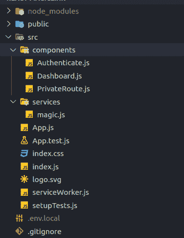
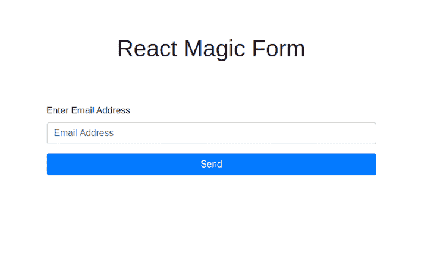
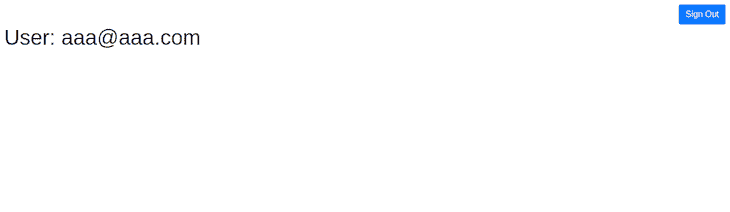
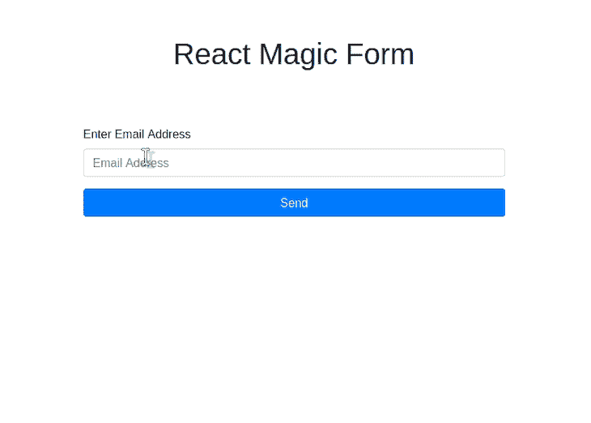

# 用神奇的链接认证 React 应用程序

> 原文：<https://blog.logrocket.com/authenticating-react-applications-with-magic-links/>

安全性是任何 web 应用程序的一个基本特性，可以防止未经授权的入侵和数据窃取。保护应用的一种方法是通过身份验证。身份验证有助于控制用户对部分应用程序的访问，并确定用户的身份。

React 应用程序的身份验证策略包括:

*   密码
*   双因素身份验证(2FA)
*   卡查斯
*   令牌(Token)
*   单点登录(SSO)

在本教程中，我们将介绍:

*   使用 React 设置基本认证流程
*   控制对应用程序特定部分的访问
*   神奇链接背后的想法
*   将神奇链接集成到 React 应用程序中

## 什么是神奇链接？

神奇链接提供了一种无需密码即可验证用户身份的方法。Magic Link 是由 Fortmatic 开发的，每当用户注册或登录应用程序时，Magic SDK 都会生成一个链接。

当用户注册或登录时，会发生以下情况。

1.  一个神奇的链接被生成并发送到用户的电子邮件地址
2.  用户点击链接，Magic 对用户进行身份验证
3.  如果成功，用户将被重定向回最初的身份验证点；如果不成功，将显示一个错误页面

## 为什么是魔法链接？

对于用户来说，Magic Links 消除了设置和记忆安全密码的麻烦。它还让您不必在数据库中存储和管理用户密码和会话。它使用一个类似 SSH 的基于区块链的密钥管理系统，因此每当用户注册或登录时，它都会生成一个公钥-私钥对，随后用于验证用户的请求。

## 先决条件

要跟随本教程，您需要以下内容。

*   npm >= v5.2 或纱线
*   React 和 JavaScript 知识
*   代码编辑器
*   一个[神奇的](https://dashboard.magic.link/login)账户

## 创建 React 应用程序

首先，我们必须创建一个新的 React 项目。打开您的终端，运行:

```
npx create-react-app react-magic-tutorial

```

这将在`react-magic-tutorial`目录中创建一个 React 项目。要运行该应用程序，请转到该目录的根目录，并通过运行以下命令启动该应用程序。

```
cd react-magic-tutorial
npm start

```

## 设置魔法

在为 React 应用程序创建组件之前，我们需要设置神奇的服务。

登录到 [Magic](https://dashboard.magic.link/login) ，获取你的测试可发布 API 密匙以访问 Magic 服务，并复制它。在应用程序的根目录中创建一个`.env`文件，在编辑器中打开该文件并粘贴以下内容。

```
REACT_APP_PK_KEY=API_KEY

```

用你复制的密钥替换`API_KEY`，然后回到你的终端，安装 Magic SDK。

```
npm install --save magic-sdk

```

接下来，创建一个文件来处理魔术服务:

```
mkdir service
cd service
touch magic.js

```

这将在服务目录中创建一个`magic.js`文件。在编辑器中打开该文件，并粘贴以下内容。

```
import { Magic } from 'magic-sdk';
const magic = new Magic(process.env.REACT_APP_PK_KEY);

export const checkUser = async (cb) => {
  const isLoggedIn = await magic.user.isLoggedIn();
  if (isLoggedIn) {
    const user = await magic.user.getMetadata();
    return cb({ isLoggedIn: true, email: user.email });
  }
  return cb({ isLoggedIn: false });
};

export const loginUser = async (email) => {
  await magic.auth.loginWithMagicLink({ email });
};

export const logoutUser = async () => {
  await magic.user.logout();
};

```

`magic`变量用你的可发布的`API_KEY`初始化魔术服务。`checkUser`函数接受回调`cb`作为参数，并检查用户是否登录。如果用户已登录，它将获取用户元数据并将其传递给回调函数。如果用户没有登录，它将返回回调函数，并将`isLoggedIn`属性设置为 false。

`loginUser`函数将用户电子邮件作为参数传递给`magic.auth.loginWithMagicLink({ email })`函数。该函数负责创建并向用户发送登录链接，并创建用户会话。`logoutUser`函数将用户注销并销毁会话。

## 构建反应组件

下一步是创建我们的应用程序所需的组件:

1.  `Authenticate` —允许用户注册或登录的表单组件
2.  `Dashboard` —显示认证是否成功的组件
3.  `PrivateRoute` —在呈现组件之前检查用户是否被认证的包装组件；否则，它会将用户重定向回注册/登录页面
4.  `App` —主要应用组件。如果用户没有登录，它将呈现`Authentication`组件；如果用户登录，它将呈现`Dashboard`组件。

稍后我们将使用 React 上下文将用户数据传递给基于用户是否经过身份验证而呈现的组件。我们还将使用 [React 路由器](https://reacttraining.com/react-router/web/guides/quick-start)来处理路由。

要安装 React 路由器，请运行以下命令。

```
npm install react-router-dom

```

安装后，运行以下命令。

```
cd src
mkdir components
cd components
touch Authenticate.js DashBoard.js PrivateRoute.js

```

这将创建一个组件目录，其中包含了`src`目录中的组件。你的文件夹结构应该类似于下面的截图。



我们将使用 React 引导库来设计项目的样式。运行以下命令安装库。

```
npm install react-bootstrap bootstrap

```

打开`Authtentication.js`文件夹，粘贴以下内容。

```
import React, { useState } from 'react';
import { useHistory } from 'react-router-dom';
import {
  Button,
  Form,
  FormGroup,
  FormLabel,
  FormControl,
} from 'react-bootstrap';
import { loginUser } from '../services/magic';
const Authenticate = () => {
  const [email, setEmail] = useState('');
  const [loading, setLoading] = useState('');
  const [error, setError] = useState(null);
  const history = useHistory();
  const handleSubmit = async (event) => {
    event.preventDefault();
    setLoading(true);
    if (!email) {
      setLoading(false);
      setError('Email is Invalid');
      return;
    }
    try {
      await loginUser(email);
      setLoading(false);
      history.replace('/dashboard');
    } catch (error) {
      setError('Unable to log in');
      console.error(error);
    }
  };
  const handleChange = (event) => {
    setEmail(event.target.value);
  };
  return (
    <div className="w-50 p-5 mt-5 mx-auto">
      <h1 className="h1 text-center">React Magic Form</h1>
      <Form onSubmit={handleSubmit} className="p-2 my-5 mx-auto">
        <FormGroup className="mt-3" controlId="formBasicEmail">
          <FormLabel fontSize="sm">Enter Email Address</FormLabel>
          <FormControl
            type="email"
            name="email"
            id="email"
            value={email}
            onChange={handleChange}
            placeholder="Email Address"
          />
          <p className="text-danger text-small">{error}</p>
        </FormGroup>
        <Button
          type="submit"
          size="md"
          className="d-block w-100"
          variant="primary"
        >
          {loading ? 'Loading...' : 'Send'}
        </Button>
      </Form>
    </div>
  );
};
export default Authenticate;

```

该组件创建一个表单，其中包含一个电子邮件地址的文本字段和一个按钮，用于发送用户输入的电子邮件的神奇链接。当用户点击按钮时，它运行`handleSubmit`函数，该函数验证电子邮件地址并从`magic.js`服务文件中调用`loginUser`函数。



我们要解决的下一个组件是`Dashboard`组件。但是首先，让我们创建一个用户上下文，将用户数据传递给我们的`Dashboard`组件。在`src`目录中，运行以下命令。

```
mkdir context
cd context
touch userContext.js

```

这将在上下文目录中创建一个`userContext`文件。打开文件并输入以下内容。

```
import { createContext } from 'react';
export const UserContext = createContext({ user: null });

```

默认情况下，`UserContext`创建一个上下文并将用户属性设置为 null。要了解更多关于上下文以及如何有效地使用它们，请阅读 [React 关于上下文](https://reactjs.org/docs/context.html)的文档。

打开`Dashboard.js`组件文件，输入以下内容。

```
import React, { useContext } from 'react';
import { useHistory } from 'react-router-dom';
import Button from 'react-bootstrap/Button';
import { UserContext } from '../context/UserContext';
import { logoutUser } from '../services/magic';
const Dashboard = () => {
  const { email } = useContext(UserContext);
  const history = useHistory();
  const handleLogOut = async () => {
    try {
      await logoutUser();
      history.replace('/');
    } catch (error) {
      console.error(error);
    }
  };
  return (
    <div className="p-2">
      <div className="d-flex justify-content-end">
        <Button variant="primary" onClick={handleLogOut}>
          Sign Out
        </Button>
      </div>
      <h1 className="h1">User: {email}</h1>
    </div>
  );
};
export default Dashboard;

```

仪表板组件显示登录的用户电子邮件和注销按钮。从上下文`UserContext`中获取登录用户；我们使用`useContext`钩子从`UserContext`中获取我们需要的数据。

当用户点击退出按钮时，它调用`handleLogOut`函数。`handleLogOut`函数从魔术服务中调用`logoutUser`函数，负责破坏用户会话并注销用户。

之后，我们使用`react-router-dom`包的`useHistory`钩子将用户重定向回注册页面。`useHistory`钩子让我们能够访问用户的会话历史，并允许我们将用户重定向到历史上的某个点。



接下来，我们创建`PrivateRoute`组件。`PrivateRoute`组件允许我们为应用程序创建受保护的路由——用户只有登录后才能访问的路由，比如仪表板。

打开`PrivateRoute.js`文件，输入以下内容。

```
import React, { useContext } from 'react';
import { Redirect, Route } from 'react-router-dom';
import { UserContext } from '../context/UserContext';
const PrivateRoute = ({ component: Component, ...rest }) => {
  const { isLoggedIn } = useContext(UserContext);
  return (
    <Route
      {...rest}
      render={(props) =>
        isLoggedIn ? <Component {...props} /> : <Redirect to="/" />
      }
    />
  );
};
export default PrivateRoute;

```

`PrivateRoute`是`react-router-dom`的`Route`组件的包装器。它检查用户的登录状态`isLoggedIn`，这是从`UserContext`中获取的。如果登录状态为真，则渲染`Component`道具。如果没有，我们使用另一个名为`Redirect`的`react-router-dom`组件，它将用户重定向到一个位置——在本例中是身份验证页面。

所有这些都完成后，我们将所有的东西放在我们的`App`组件中。打开根目录中的`App.js`组件，输入以下内容。

```
import React, { useState, useEffect } from 'react';
import {
  Switch,
  BrowserRouter as Router,
  Route,
  Redirect,
} from 'react-router-dom';
import Spinner from 'react-bootstrap/Spinner';
import { UserContext } from './context/UserContext';
import { checkUser } from './services/magic';
import Authenticate from './components/Authenticate';
import Dashboard from './components/Dashboard';
import PrivateRoute from './components/PrivateRoute';
const App = () => {
  const [user, setUser] = useState({ isLoggedIn: null, email: '' });
  const [loading, setLoading] = useState();
  useEffect(() => {
    const validateUser = async () => {
      setLoading(true);
      try {
        await checkUser(setUser);
        setLoading(false);
      } catch (error) {
        console.error(error);
      }
    };
    validateUser();
  }, [user.isLoggedIn]);
  if (loading) {
    return (
      <div
        className="d-flex justify-content-center align-items-center"
        style={{ height: '100vh' }}
      >
        <Spinner animation="border" />
      </div>
    );
  }
  return (
    <UserContext.Provider value={user}>
      <Router>
        {user.isLoggedIn && <Redirect to={{ pathname: '/dashboard' }} />}
        <Switch>
          <Route exact path="/" component={Authenticate} />
          <PrivateRoute path="/dashboard" component={Dashboard} />
        </Switch>
      </Router>
    </UserContext.Provider>
  );
};
export default App;

```

App 组件中首先要注意的是`useEffect` hoo。每当应用程序呈现或者用户状态的`isLoggedIn`属性改变时，我们用这个来验证用户。`validateUser`函数调用了我们神奇服务的`checkUser`函数，它检查用户是否登录。它接受一个回调，这是我们的`setUser`函数，并根据`checkUser`函数返回的内容设置用户状态。如果`isLoggedIn`属性为真，那么用户被重定向到仪表板。我们使用`UserContext.Provider`将用户状态传递给应用程序的子组件。

我们的应用程序有两个路由:`/`路由，它呈现`Authentication`组件(我们的默认组件)，以及前面提到的作为`Route`组件包装器的`PrivateRoute`,它仅在用户登录时呈现`Dashboard`组件。`Switch`组件通过检查`Route`组件的路径来确保一次只呈现一条路线。

现在我们的应用程序已经准备好了。启动它并测试身份验证流程。输入电子邮件地址后，会有一个链接发送到你的邮箱。当您单击该链接时，它会引导您返回到应用程序，在确认链接的有效性后，会将您重定向到仪表板。

如果你玩够了，你可以退出，这将带你回到登录页面。



# 结论

在本教程中，我们介绍了如何使用神奇的链接来保护 React 应用程序。Magic service 提供了超出本文范围的更多内容，并支持与现有基础设施的集成。为了扩展你关于神奇链接的知识，我建议阅读官方文档。

在保护您的应用程序时，没有通用的方法。Magic 是您可能已经习惯的流行身份验证策略的可行替代方案。

您可以找到我们在 [GitHub](https://github.com/sa-ma/react-magic-link-test) 上构建的应用程序的存储库。

## 使用 LogRocket 消除传统反应错误报告的噪音

[LogRocket](https://lp.logrocket.com/blg/react-signup-issue-free)

是一款 React analytics 解决方案，可保护您免受数百个误报错误警报的影响，只针对少数真正重要的项目。LogRocket 告诉您 React 应用程序中实际影响用户的最具影响力的 bug 和 UX 问题。

[ ](https://lp.logrocket.com/blg/react-signup-general) [  ](https://lp.logrocket.com/blg/react-signup-general) [LogRocket](https://lp.logrocket.com/blg/react-signup-issue-free)

自动聚合客户端错误、反应错误边界、还原状态、缓慢的组件加载时间、JS 异常、前端性能指标和用户交互。然后，LogRocket 使用机器学习来通知您影响大多数用户的最具影响力的问题，并提供您修复它所需的上下文。

关注重要的 React bug—[今天就试试 LogRocket】。](https://lp.logrocket.com/blg/react-signup-issue-free)