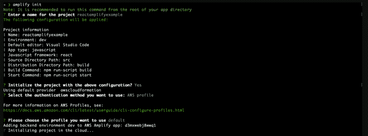
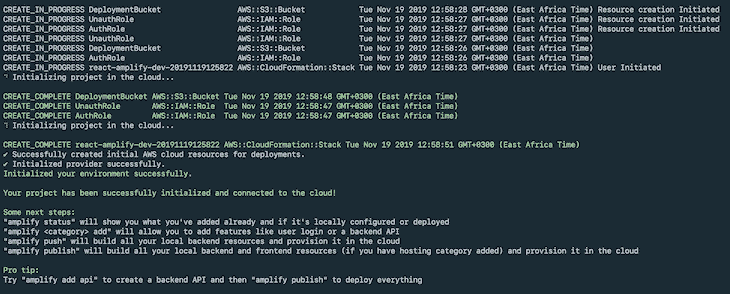
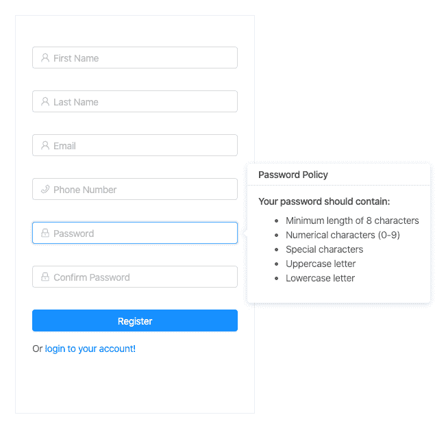
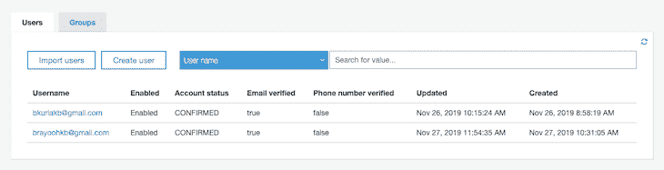
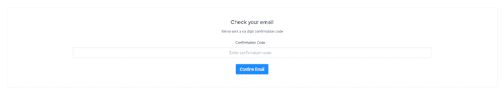
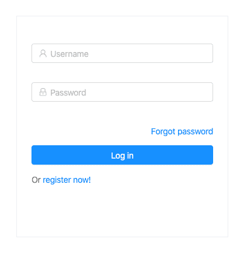
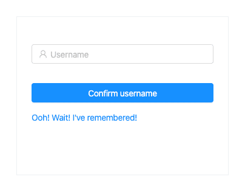
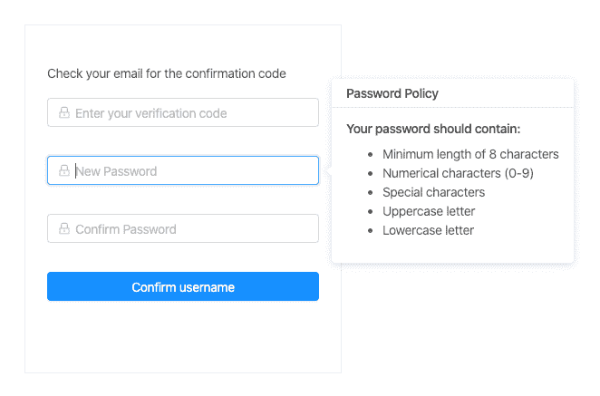

# 与 AWS Cognito 和 Amplify - LogRocket Blog 一起进行身份验证

> 原文：<https://blog.logrocket.com/authentication-react-aws-amplify-cognito/>

***编者按:*** *本文于 2022 年 6 月 9 日更新，以反映 AWS Cognito 和 Amplify 的最新版本。*

当你开始一个新项目时，授权是你应该做的第一件事，不管你是为电子商务、游戏、物流还是任何其他项目领域而建。

在任何给定的组织中，都可能有您可以重用的现有解决方案。但是如果您没有那么幸运，那么您可以选择构建您自己的实现或者构建现有的解决方案，这是我们强烈推荐的，可以节省您大量的时间。

在本教程中，我们将介绍如何使用 AWS Cognito 用户池和 [Amplify 框架](https://aws-amplify.github.io/docs/)为您未来(甚至当前)的 React 应用添加身份验证。

### 内容

## 什么是 AWS Cognito 用户池？

根据文档中的定义， [Amazon Cognito 用户池](https://docs.aws.amazon.com/cognito/latest/developerguide/cognito-user-identity-pools.html)是全功能的用户目录服务，用于处理用户注册、认证和帐户恢复。

用户池是 Amazon Cognito 中的一个用户目录。借助用户池，您的用户可以通过 Amazon Cognito 登录您的 web 或移动应用程序。您的用户也可以通过脸书或亚马逊等社交身份提供商以及 SAML 身份提供商登录。

无论您的用户是直接登录还是通过第三方登录，用户池的所有成员都有一个目录配置文件，您可以通过 SDK 访问它。

## 什么是 Amplify 框架？

Amplify Framework 是一个全面的库，用于在 AWS 上灵活、可扩展、可靠的无服务器后端上构建复杂的云计算应用。Amplify 允许您访问 AWS 提供的一系列云服务。

## 放大 CLI 设置

为了访问 Amplify，您需要有一个 AWS 帐户。如果你已经有了一个，那么你就可以开始了；如果你没有，你可以在这里注册 AWS 免费层。

要安装 Amplify CLI，请运行以下命令:

```
$ npm install -g @aws-amplify/cli

```

成功安装后，我们现在可以通过运行以下命令来配置 CLI:

```
$ amplify configure

```

这将带你完成一系列解释清楚、简单明了的步骤，登录你的 AWS 账户，选择一个用户名，设置一个新的管理员用户，并生成一个`secret access key`和`access key id`，它们保存在位于`~/.aws/credentials`的 AWS 配置文件中。

成功设置后，您将收到一条确认消息，表明新用户已成功设置:

## React 应用程序设置

我更喜欢在我的所有项目中使用 TypeScript，因此要开始一个新的 TypeScript/React 项目，我们将使用 Create React App 通过运行以下命令来引导我们的应用程序:

```
$ yarn create react-app my-app --template typescript

```

启动应用程序需要几分钟的时间来完成，所以如果你不耐烦了，你可以给自己倒杯咖啡。

为了启动我们的 Amplify 项目，我们运行以下命令来初始化和配置项目:

```
$ amplify init

```

这将引导您逐步选择最适合您项目的设置。在我们的案例中，我们将采用以下选项。



部署应该立即开始，之后您应该会得到一条与以下内容相匹配的成功消息。



部署完成后，一个名为`aws-exports.js`的生成文件将出现在您的`src`文件夹中。您不应该修改这个文件，因为每当您部署您的更改时，它都会发生变化。

接下来，我们需要向我们的应用程序添加身份验证资源。运行以下命令，为我们的 Cognito 池选择配置选项:

```
$ amplify add auth

```

要为您的应用程序提供最佳配置选项，请选择手动配置，然后从菜单中选择以下选项。


为了将新的资源更改部署到云，运行:

```
$ amplify push

```

现在我们的 Amplify 和 Cognito 设置已经完全完成，我们可以继续安装依赖项了。

为此，请运行以下命令:

```
$ yarn add aws-amplify react-router-dom styled-components antd password-validator jwt-decode

```

## AWS 认知和放大演示

接下来，让我们来看看示例应用程序的源代码。我们将逐个处理这些文件，同时分解每个文件中的逻辑。

### `SignUpContainer.tsx`

该组件包含注册新用户所需的逻辑。我们将为 UI 组件使用 [Ant Design](https://blog.logrocket.com/data-visualization-with-react-ant-design/) ，为了验证用户密码，我们将使用密码验证器。

我们在设置用户池时添加了密码要求，如下所示:

*   最少八个字符
*   至少有一个大写字母
*   至少有一个小写字母
*   至少有一个符号
*   至少有一位数字

在成功验证所有必需的用户详细信息之后，我们将有效负载发送到`Cognito API`，它将验证码发送到用户的电子邮件，并在`UserPool`中创建一个新用户。

代码如下:

```
import * as React from "react";
import { Link, Redirect } from 'react-router-dom';
import { Auth } from 'aws-amplify';
import { Form, Input, Icon, Button, notification, Popover, Spin, Col, Row } from 'antd';

// Presentational 
import FormWrapper from '../../Components/Styled/FormWrapper';

// App theme 
import { colors } from '../../Themes/Colors';

type Props = {
  form: any;
};

type State = {
  confirmDirty: boolean;
  redirect: boolean;
  loading: boolean;
  email: string;
};

type UserFormData = {
  fname: string;
  lname: string;
  password: string;
  email: string;
  phoneNumber: number;
};

const passwordValidator = require('password-validator');

// create a password schema
const schema = new passwordValidator();

schema
  .is()
  .min(8)
  .has()
  .uppercase()
  .has()
  .lowercase()
  .has()
  .digits()
  .has()
  .symbols();

class SignUpContainer extends React.Component<Props, State> {
  state = {
    confirmDirty: false,
    redirect: false,
    loading: false,
    email: ''
  };

  handleSubmit = (event: React.FormEvent) => {
    event.preventDefault();

    this.props.form.validateFieldsAndScroll((err: Error, values: UserFormData) => {
      if (!err) {
        let { fname, lname, password, email, phoneNumber } = values;

        // show loader
        this.setState({ loading: true });

        Auth.signUp({
          username: email,
          password,
          attributes: {
            email,
            name: ${fname} ${lname},
            phone_number: phoneNumber
          }
        })
          .then(() => {
            notification.success({
              message: 'Succesfully signed up user!',
              description: 'Account created successfully, Redirecting you in a few!',
              placement: 'topRight',
              duration: 1.5,
              onClose: () => {
                this.setState({ redirect: true });
              }
            });

            this.setState({ email });
          })
          .catch(err => {
            notification.error({
              message: 'Error',
              description: 'Error signing up user',
              placement: 'topRight',
              duration: 1.5
            });

            this.setState({
              loading: false
            });
          });
      }
    });
  };

  handleConfirmBlur = (event: React.FormEvent) => {
    const { value } = event.currentTarget;

    this.setState({ confirmDirty: this.state.confirmDirty || !!value });
  };

  compareToFirstPassword = (rule: object, value: string, callback: (message?: string) => void) => {
    const { form } = this.props;

    if (value && value !== form.getFieldValue('password')) {
      callback('Two passwords that you enter is inconsistent!');
    } else {
      callback();
    }
  };

  validateToNextPassword = (rule: object, value: string, callback: (message?: string) => void) => {
    const form = this.props.form;
    const validationRulesErrors = schema.validate(value, { list: true });

    if (value && this.state.confirmDirty) {
      form.validateFields(['confirm'], { force: true });
    }
    if (validationRulesErrors.length > 0) {
      callback(this.formatPasswordValidateError(validationRulesErrors));
    }
    callback();
  };

  formatPasswordValidateError = (errors: Array) => {
    for (let i = 0; i < errors.length; i++) {
      if (errors[i] === 'min') {
        return 'password length should be a at least 8 characters';
      } else if (errors[i] === 'lowercase') {
        return 'password should contain lowercase letters';
      } else if (errors[i] === 'uppercase') {
        return 'password should contain uppercase letters';
      } else if (errors[i] === 'digits') {
        return 'password should contain digits';
      } else if (errors[i] === 'symbols') {
        return 'password should contain symbols';
      }
    }
  };

  render() {
    const { getFieldDecorator } = this.props.form;
    const { redirect, loading } = this.state;

    const title = 'Password Policy';
    const passwordPolicyContent = (
      <React.Fragment>
        <h4>Your password should contain: </h4>
        <ul>
          <li>Minimum length of 8 characters</li>
          <li>Numerical characters (0-9)</li>
          <li>Special characters</li>
          <li>Uppercase letter</li>
          <li>Lowercase letter</li>
        </ul>
      </React.Fragment>
    );
     return (
      <React.Fragment>
        <FormWrapper onSubmit={this.handleSubmit}>
          <Form.Item>
            {getFieldDecorator('fname', {
              rules: [
                {
                  required: true,
                  message: 'Please input your first name!'
                }
              ]
            })(
              <Input
                prefix={<Icon type="user" style={{ color: colors.transparentBlack }} />}
                placeholder="First Name"
              />
            )}
          </Form.Item>
          <Form.Item>
            {getFieldDecorator('lname', {
              rules: [
                {
                  required: true,
                  message: 'Please input your last name!'
                }
              ]
            })(
              <Input prefix={<Icon type="user" style={{ color: colors.transparentBlack }} />} placeholder="Last Name" />
            )}
          </Form.Item>
          <Form.Item>
            {getFieldDecorator('email', {
              rules: [{ required: true, message: 'Please input your email!' }]
            })(<Input prefix={<Icon type="user" style={{ color: colors.transparentBlack }} />} placeholder="Email" />)}
          </Form.Item>
          <Form.Item>
            {getFieldDecorator('phoneNumber', {
              rules: [
                {
                  required: true,
                  message: 'Please input your phone number!'
                }
              ]
            })(
              <Input
                prefix={<Icon type="phone" style={{ color: colors.transparentBlack }} />}
                placeholder="Phone Number"
              />
            )}
          </Form.Item>
          <Form.Item>
            <Popover placement="right" title={title} content={passwordPolicyContent} trigger="focus">
              {getFieldDecorator('password', {
                rules: [
                  { required: true, message: 'Please input your Password!' },
                  {
                    validator: this.validateToNextPassword
                  }
                ]
              })(
                <Input
                  prefix={<Icon type="lock" style={{ color: colors.transparentBlack }} />}
                  type="password"
                  placeholder="Password"
                />
              )}
            </Popover>
          </Form.Item>
          <Form.Item>
            {getFieldDecorator('confirm', {
              rules: [
                {
                  required: true,
                  message: 'Please confirm your password!'
                },
                {
                  validator: this.compareToFirstPassword
                }
              ]
            })(
              <Input
                prefix={<Icon type="lock" style={{ color: colors.transparentBlack }} />}
                type="password"
                placeholder="Confirm Password"
                onBlur={this.handleConfirmBlur}
              />
            )}
          </Form.Item>

          <Form.Item className="text-center">
            <Row>
              <Col lg={24}>
                <Button style={{ width: '100%' }} type="primary" disabled={loading} htmlType="submit">
                  {loading ? <Spin indicator={<Icon type="loading" style={{ fontSize: 24 }} spin />} /> : 'Register'}
                </Button>
              </Col>
              <Col lg={24}>
                Or <Link to="/login">login to your account!</Link>
              </Col>
            </Row>
          </Form.Item>
        </FormWrapper>
        {redirect && (
          <Redirect
            to={{
              pathname: '/verify-code',
              search: `?email=${this.state.email}`
            }}
          />
        )}
      </React.Fragment>
    );
  }
}

export default Form.create()(SignUpContainer);

```

您现在应该有类似这样的东西。



注册后，您的用户池您现在应该有一个新用户的列表。



### `ConfirmEmailContainer.tsx`

注册成功后，确认码会发送到用户的电子邮件中。为了验证它，添加下面的代码，这样我们就有了一个带有提交按钮的基本输入。

当提交确认码时，我们调用`Cognito API`来检查它的有效性，之后我们重定向到成功验证的登录页面:

```
import * as React from 'react';
import { Redirect, RouteComponentProps } from 'react-router-dom';
import { Spin, Icon, Button, Form, notification, Input, Col } from 'antd';

// amplify
import { Auth } from 'aws-amplify';

/** Presentational */
import FullWidthWrapper from '../../Components/Styled/FullWidthWrapper';
import EmailConfirmFormWrapper from '../../Components/Styled/EmailConfirmFormWrapper';

type State = {
  username: string;
  loading: boolean;
  redirect: boolean;
  confirmationCode: string;
  error: string;
};

class ConfirmEmailContainer extends React.Component<RouteComponentProps, State> {
  state = {
    username: '',
    loading: false,
    redirect: false,
    confirmationCode: '',
    error: ''
  };

  componentDidMount() {
    if (this.props.location.search) {
      // get username from url params
      let username = this.props.location.search.split('=')[1];

      this.setState({ username });
    }
  }

  handleSubmit = (event: React.FormEvent) => {
    event.preventDefault();

    const { confirmationCode } = this.state;

    // show progress spinner
    this.setState({ loading: true });

    Auth.confirmSignUp(this.state.username, confirmationCode)
      .then(() => {
        this.handleOpenNotification('success', 'Succesfully confirmed!', 'You will be redirected to login in a few!');
      })
      .catch(err => {
        this.handleOpenNotification('error', 'Invalid code', err.message);
        this.setState({
          loading: false
        });
      });
  };

  /**
   * @param  {string} - type
   * @param  {string} - title
   * @param  {string} - message
   *
   * @returns {void} - no value returned
   */
  handleOpenNotification = (type: string, title: string, message: string): void => {
    switch (type) {
      case 'success':
        notification['success']({
          message: title,
          description: message,
          placement: 'topRight',
          duration: 1.5,
          onClose: () => {
            this.setState({ redirect: true });
          }
        });
        break;

      case 'error':
        notification['error']({
          message: title,
          description: message,
          placement: 'topRight',
          duration: 1.5
        });
        break;
    }
  };

  handleOnPaste = (event: React.ClipboardEvent) => {
    event.preventDefault();

    let code = event.clipboardData.getData('Text').trim();

    /** Update input */
    this.setState({ confirmationCode: code });

    // regex to check if string is numbers only
    const reg = new RegExp('^[0-9]+$');

    if (reg.test(code) && code.length === 6) {
      // code is a valid number

      this.setState({ loading: true });

      Auth.confirmSignUp(this.state.username, code)
        .then(() => {
          this.handleOpenNotification('success', 'Succesfully confirmed!', 'You will be redirected to login in a few!');
        })
        .catch(err => {
          this.handleOpenNotification('error', 'Invalid code', err.message);
          this.setState({
            loading: false
          });
        });
    }
  };

  handleChange = (event: React.ChangeEvent<HTMLInputElement>) => {
    this.setState({ confirmationCode: event.currentTarget.value });
  };

  render() {
    const { loading, error, confirmationCode, redirect } = this.state;

    return (
      <FullWidthWrapper align="center">
        <EmailConfirmFormWrapper onSubmit={this.handleSubmit}>
          <Col md={24} lg={18}>
            <div className="full-width">
              <h2>Check your email</h2>
              <p>We've sent a six­ digit confirmation code</p>
            </div>
            <Form.Item validateStatus={error && 'error'} help={error} label="Confirmation Code">
              <Input
                size="large"
                type="number"
                placeholder="Enter confirmation code"
                onChange={this.handleChange}
                onPaste={this.handleOnPaste}
                value={confirmationCode}
              />
            </Form.Item>
          </Col>
          <Col md={24} lg={12}>
            <Button type="primary" disabled={loading} htmlType="submit" size="large">
              {loading ? <Spin indicator={<Icon type="loading" style={{ fontSize: 24 }} spin />} /> : 'Confirm Email'}
            </Button>
          </Col>
        </EmailConfirmFormWrapper>
        {redirect && <Redirect to={{ pathname: '/login' }} />}
      </FullWidthWrapper>
    );
  }
}

export default ConfirmEmailContainer;

```

上面的代码应该会产生这样的结果。



### `LoginContainer.tsx`

成功确认用户代码后，我们重定向到登录页面。下面，我们将创建一个由 Ant Design 提供的具有强大验证功能的表单。

验证通过后，我们使用 AWS SDK 中包含的`Auth`模块提交用户名和密码有效载荷，然后调用`Cognito API`并返回成功或错误有效载荷。如果用户凭证通过，我们将令牌保存到`localStorage`，并重定向到仪表板登录页面。

代码如下:

```
import * as React from 'react';
import { Link, RouteComponentProps } from 'react-router-dom';
import { Auth } from 'aws-amplify';
import { Form, Icon, Spin, Input, Button, notification, Col, Row } from 'antd';

/** Presentational */
import FormWrapper from '../../Components/Styled/FormWrapper';

/** App theme */
import { colors } from '../../Themes/Colors';

/** App constants */
import { AUTH_USER_TOKEN_KEY } from '../../Utils/constants';

type Props = RouteComponentProps & {
  form: any;
};

type State = {
  loading: boolean;
};

class LoginContainer extends React.Component<Props, State> {
  state = {
    loading: false
  };

  handleSubmit = (event: React.FormEvent) => {
    event.preventDefault();

    this.props.form.validateFields((err: Error, values: { username: string; password: string }) => {
      if (!err) {
        let { username, password } = values;

        this.setState({ loading: true });

        Auth.signIn(username, password)
          .then(user => {
            const { history, location } = this.props;
            const { from } = location.state || {
              from: {
                pathname: '/dashboard'
              }
            };

            localStorage.setItem(AUTH_USER_TOKEN_KEY, user.signInUserSession.accessToken.jwtToken);

            notification.success({
              message: 'Succesfully logged in!',
              description: 'Logged in successfully, Redirecting you in a few!',
              placement: 'topRight',
              duration: 1.5
            });

            history.push(from);
          })
          .catch(err => {
            notification.error({
              message: 'Error',
              description: err.message,
              placement: 'topRight'
            });

            console.log(err);

            this.setState({ loading: false });
          });
      }
    });
  };

  render() {
    const { getFieldDecorator } = this.props.form;
    const { loading } = this.state;

    return (
      <React.Fragment>
        <FormWrapper onSubmit={this.handleSubmit} className="login-form">
          <Form.Item>
            {getFieldDecorator('username', {
              rules: [
                {
                  required: true,
                  message: 'Please input your username!'
                }
              ]
            })(
              <Input prefix={<Icon type="user" style={{ color: colors.transparentBlack }} />} placeholder="Username" />
            )}
          </Form.Item>
          <Form.Item>
            {getFieldDecorator('password', {
              rules: [
                {
                  required: true,
                  message: 'Please input your password!'
                }
              ]
            })(
              <Input
                prefix={<Icon type="lock" style={{ color: colors.transparentBlack }} />}
                type="password"
                placeholder="Password"
              />
            )}
          </Form.Item>
          <Form.Item className="text-center">
            <Row type="flex" gutter={16}>
              <Col lg={24}>
                <Link style={{ float: 'right' }} className="login-form-forgot" to="/forgot-password">
                  Forgot password
                </Link>
              </Col>
              <Col lg={24}>
                <Button
                  style={{ width: '100%' }}
                  type="primary"
                  disabled={loading}
                  htmlType="submit"
                  className="login-form-button"
                >
                  {loading ? <Spin indicator={<Icon type="loading" style={{ fontSize: 24 }} spin />} /> : 'Log in'}
                </Button>
              </Col>
              <Col lg={24}>
                Or <Link to="/signup">register now!</Link>
              </Col>
            </Row>
          </Form.Item>
        </FormWrapper>
      </React.Fragment>
    );
  }
}

export default Form.create()(LoginContainer);

```

您最终应该会看到下面的视图。



### `ForgotPasswordContainer.tsx`

万一用户忘记了密码，我们需要一种方法让他们找回密码。使用 Amplify 时，这非常容易。

我们将通过添加以下逻辑来实现这一点，该逻辑接受用户名有效负载并向用户的电子邮件发送验证码，然后我们将使用该验证码来重置他们的密码:

```
import * as React from 'react';
import { Link, Redirect } from 'react-router-dom';
import { Auth } from 'aws-amplify';
import { Form, Icon, Spin, Input, Button, notification, Row, Col } from 'antd';

/** Presentational */
import FormWrapper from '../../Components/Styled/FormWrapper';

/** App theme */
import { colors } from '../../Themes/Colors';

type Props = {
  form: any;
};

type State = {
  username: string;
  redirect: boolean;
  loading: boolean;
};

class ForgotPasswordContainer extends React.Component<Props, State> {
  state = {
    username: '',
    redirect: false,
    loading: false
  };

  handleSubmit = (event: React.FormEvent) => {
    event.preventDefault();

    this.props.form.validateFields((err: { message: string }, values: { username: string }) => {
      if (!err) {
        let { username } = values;

        this.setState({
          loading: true,
          username
        });

        Auth.forgotPassword(username)
          .then(data => {
            notification.success({
              message: 'Redirecting you in a few!',
              description: 'Account confirmed successfully!',
              placement: 'topRight',
              duration: 1.5,
              onClose: () => {
                this.setState({ redirect: true });
              }
            });
          })
          .catch(err => {
            notification.error({
              message: 'User confirmation failed',
              description: err.message,
              placement: 'topRight',
              duration: 1.5
            });
            this.setState({ loading: false });
          });
      }
    });
  };

  render() {
    const { getFieldDecorator } = this.props.form;
    const { loading, redirect, username } = this.state;

    return (
      <React.Fragment>
        <FormWrapper onSubmit={this.handleSubmit} className="login-form">
          <Form.Item>
            {getFieldDecorator('username', {
              rules: [
                {
                  required: true,
                  message: 'Please input your username!'
                }
              ]
            })(
              <Input prefix={<Icon type="user" style={{ color: colors.transparentBlack }} />} placeholder="Username" />
            )}
          </Form.Item>
          <Form.Item className="text-center">
            <Row>
              <Col lg={24}>
                <Button style={{ width: '100%' }} type="primary" htmlType="submit" className="login-form-button">
                  {loading ? (
                    <Spin indicator={<Icon type="loading" style={{ fontSize: 24 }} spin />} />
                  ) : (
                    'Confirm username'
                  )}
                </Button>
              </Col>
              <Col lg={24}>
                <Link to="/login">Ooh! Wait! I've remembered!</Link>
              </Col>
            </Row>
          </Form.Item>
        </FormWrapper>
        {redirect && (
          <Redirect
            to={{
              pathname: '/reset-password',
              search: `?username=${username}`
            }}
          />
        )}
      </React.Fragment>
    );
  }
}

export default Form.create()(ForgotPasswordContainer);

```

该表单将如下所示:



### `PasswordResetContainer.tsx`

发送验证码后，我们将重定向到密码重置组件。在那里，用户输入验证码和新密码，该密码被发送到`Cognito API`。如果验证码匹配，新密码将被设置为当前密码，用户现在可以使用该密码登录。

代码如下:

```
import * as React from 'react';
import { Redirect, RouteComponentProps } from 'react-router-dom';
import { Auth } from 'aws-amplify';
import { Form, Input, Icon, Button, notification, Popover, Spin, Row, Col } from 'antd';

/** App theme */
import { colors } from '../../Themes/Colors';
import FormWrapper from '../../Components/Styled/FormWrapper';

type Props = RouteComponentProps & {
  form: any;
};

type State = {
  confirmDirty: boolean;
  redirect: boolean;
  loading: boolean;
};

class PasswordResetContainer extends React.Component<Props, State> {
  state = {
    confirmDirty: false,
    redirect: false,
    loading: false
  };

  handleBlur = (event: React.FormEvent<HTMLInputElement>) => {
    const value = event.currentTarget.value;

    this.setState({ confirmDirty: this.state.confirmDirty || !!value });
  };

  compareToFirstPassword = (rule: object, value: string, callback: (message?: string) => void) => {
    const form = this.props.form;

    if (value && value !== form.getFieldValue('password')) {
      callback('Two passwords that you enter is inconsistent!');
    } else {
      callback();
    }
  };

  validateToNextPassword = (rule: object, value: string, callback: (message?: string) => void) => {
    const form = this.props.form;
    if (value && this.state.confirmDirty) {
      form.validateFields(['confirm'], { force: true });
    }
    callback();
  };

  handleSubmit = (event: React.FormEvent) => {
    event.preventDefault();

    this.props.form.validateFieldsAndScroll((err: Error, values: { password: string; code: string }) => {
      if (!err) {
        let { password, code } = values;
        let username = this.props.location.search.split('=')[1];

        Auth.forgotPasswordSubmit(username.trim(), code.trim(), password.trim())
          .then(() => {
            notification.success({
              message: 'Success!',
              description: 'Password reset successful, Redirecting you in a few!',
              placement: 'topRight',
              duration: 1.5,
              onClose: () => {
                this.setState({ redirect: true });
              }
            });
          })
          .catch(err => {
            notification['error']({
              message: 'Error reseting password',
              description: err.message,
              placement: 'topRight',
              duration: 1.5
            });

            this.setState({ loading: false });
          });

        // show loader
        this.setState({ loading: true });
      }
    });
  };

  render() {
    const { getFieldDecorator } = this.props.form;
    const { redirect, loading } = this.state;

    const title = 'Password Policy';
    const passwordPolicyContent = (
      <React.Fragment>
        <h4>Your password should contain: </h4>
        <ul>
          <li>Minimum length of 8 characters</li>
          <li>Numerical characters (0-9)</li>
          <li>Special characters</li>
          <li>Uppercase letter</li>
          <li>Lowercase letter</li>
        </ul>
      </React.Fragment>
    );

    return (
      <React.Fragment>
        <FormWrapper onSubmit={this.handleSubmit}>
          <div className="text-center">
            <p>Check your email for the confirmation code</p>
          </div>
          <Form.Item>
            <Row>
              <Col lg={24}>
                {getFieldDecorator('code', {
                  rules: [
                    {
                      required: true,
                      message: 'Please input your confirmation code!'
                    }
                  ]
                })(
                  <Input
                    prefix={<Icon type="lock" style={{ color: colors.transparentBlack }} />}
                    placeholder="Enter your verification code"
                  />
                )}
              </Col>
            </Row>
          </Form.Item>

          <Form.Item>
            <Popover placement="right" title={title} content={passwordPolicyContent} trigger="focus">
              {getFieldDecorator('password', {
                rules: [
                  { required: true, message: 'Please input your Password!' },
                  {
                    validator: this.validateToNextPassword
                  }
                ]
              })(
                <Input
                  prefix={<Icon type="lock" style={{ color: colors.transparentBlack }} />}
                  type="password"
                  placeholder="New Password"
                />
              )}
            </Popover>
          </Form.Item>

          <Form.Item>
            <Row>
              <Col lg={24}>
                {getFieldDecorator('confirm', {
                  rules: [
                    {
                      required: true,
                      message: 'Please confirm your password!'
                    },
                    {
                      validator: this.compareToFirstPassword
                    }
                  ]
                })(
                  <Input
                    prefix={<Icon type="lock" style={{ color: colors.transparentBlack }} />}
                    type="password"
                    placeholder="Confirm Password"
                    onBlur={this.handleBlur}
                  />
                )}
              </Col>
            </Row>
          </Form.Item>

          <Form.Item className="text-center">
            <Row>
              <Col lg={24}>
                <Button style={{ width: '100%' }} type="primary" htmlType="submit" className="login-form-button">
                  {loading ? (
                    <Spin indicator={<Icon type="loading" style={{ fontSize: 24 }} spin />} />
                  ) : (
                    'Confirm username'
                  )}
                </Button>
              </Col>
            </Row>
          </Form.Item>
        </FormWrapper>
        {redirect && <Redirect to={{ pathname: '/login' }} />}
      </React.Fragment>
    );
  }
}

export default Form.create()(PasswordResetContainer);

```

该组件将显示如下所示的视图。



## 结论

我们已经介绍了如何使用 AWS Cognito 和 Amplify 进行注册、登录和密码重置，这是一个高度可靠的组合，可以让开发人员的工作更加轻松。您可以专注于实现您的业务逻辑，而不用担心应用程序的身份验证。

AWS Cognito 和 Amplify 还可以集成到您拥有的任何架构模式中，无论是整体架构还是微服务架构。你可以在这里访问代码[，也可以在这里](https://github.com/brayoh/react-amplify)试用演示 app [。](http://react-amplify-20191127160520-hostingbucket-dev.s3-website-eu-west-1.amazonaws.com)