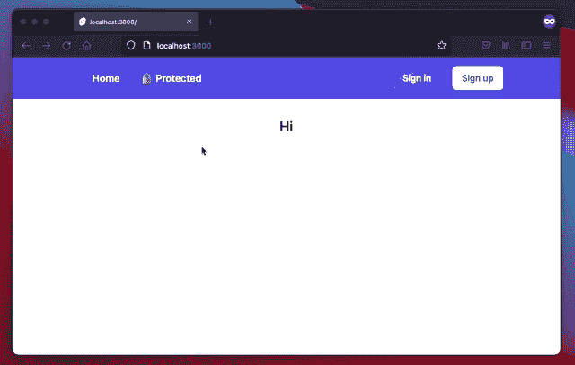

# 使用 cookies 进行认证

> 原文：<https://blog.logrocket.com/authentication-svelte-using-cookies/>

身份验证是任何应用程序的重要组成部分，它使某些功能只对某些用户可用。web 应用程序中的两种主要身份验证方法是 cookies 和令牌(主要是 JSON Web 令牌(jwt))。在本教程中，我们将使用 SvelteKit 创建一个 Svelte 应用程序，它实现了一个用于身份验证的 cookie。

该应用程序提供了您需要的与身份验证相关的基本功能:登录、注册、注销，以及在前端访问一些用户数据。这是应用程序的外观:



这是我们的目录:

首先，在进入有趣的部分之前，我们先从一些基础开始。

## 苗条套装介绍

在我们开始实际编码之前，还有最后一件事。什么是[苗条套装](https://kit.svelte.dev/)？和苗条有什么不同？

你可以认为 SvelteKit 代表苗条，Next.js 代表反应。它是框架之上的框架——元框架。

SvelteKit 是一个用于构建各种规模的 web 应用程序的框架，具有漂亮的开发体验和灵活的基于文件系统的路由。

SvelteKit 用我们将在本教程中使用的一些功能扩展了 Svelte:基于文件系统的路由、端点(服务器端函数)和钩子。

## 用 SvelteKit 在 Svelte 中实现认证

好的，现在让我们继续建造这个。所有代码也可以在 GitHub 上获得[。](https://github.com/JannikWempe/svelte-auth)

### 设置

首先，我们初始化 SvelteKit 项目。对于本教程，我们将继续使用 JavaScript 而不是 TypeScript:

```
npm init [email protected] sveltekit-auth
# ✔ Which Svelte app template? › Skeleton project
# ✔ Use TypeScript? … No
# ✔ Add ESLint for code linting? … Yes
# ✔ Add Prettier for code formatting? … Yes
cd sveltekit-auth
npm install

```

让我们添加一些基本的造型顺风。我们还使用了 Tailwind 表单插件，它为我们的表单提供了一些基本的样式:

```
npx [email protected] tailwindcss
npm i @tailwindcss/forms

```

为了使用 Tailwind 表单插件，我们必须将它添加到由`svelte-add` 命令创建的`tailwind.config.cjs`中的`plugins`:

```
// tailwind.config.cjs
const config = {
    mode: 'jit',
    purge: ['./src/**/*.{html,js,svelte,ts}'],

    theme: {
     extend: {},
    },

    plugins: [
    require('@tailwindcss/forms')
  ],
};

module.exports = config;

```

这就是最基本的设置。在进行实际的身份验证之前，让我们接下来构建 UI。

### 构建用户界面

让我们首先创建注册和登录的表单。创建`/src/lib/components/SignInForm.svelte`:

```
// src/lib/components/SignInForm.svelte
<script>
  import Input from '$lib/components/Input.svelte';
  import Button from '$lib/components/Button.svelte';

  import { createEventDispatcher } from 'svelte';

  let email = '';
  let password = '';

  const dispatch = createEventDispatcher();

  function submit() {
    dispatch('submit', {
    email,
    password
    })
  }
</script>

<form on:submit|preventDefault={submit} class='space-y-5 {$$props.class}'>
  <Input label='Email' id='email' name='email' type='email' bind:value={email} required />
  <Input label='Password' id='password' name='password' type='password' bind:value={password} required />
  <Button type='submit'>Sign In</Button>
</form>

```

这里我们有一个带有电子邮件和密码输入的表单。当用户提交表单时，组件调度一个`submit`事件。在`form`的`class`属性中有了`{$$props.class}`，我们允许从外部传入顺风类。我主要用它来从外部定位一个组件。组件本身的容器上不应该有`margin`或类似的东西。

*注意，你可以在 [GitHub 回购](https://github.com/JannikWempe/svelte-auth/tree/master/src/lib/components)中找到* `Button` *和* `Input` *的代码。*

对于`SignUpForm.svelte`来说也是如此:

```
// src/lib/components/SignUpForm.svelte
<script>
  import Input from '$lib/components/Input.svelte';
  import Button from '$lib/components/Button.svelte';

  import { createEventDispatcher } from 'svelte';

  let email = '';
  let password = '';
  let confirmPassword = '';
  let error;
  let confirmPasswordInputRef;

  const dispatch = createEventDispatcher();

  function submit() {
    error = null;
    if (password !== confirmPassword) {
    error = "Passwords do not match.";
    confirmPasswordInputRef.focus();
    return;
    }

    dispatch('submit', {
    email,
    password
    })
  }
</script>

<form on:submit|preventDefault={submit} class='space-y-5 {$$props.class}'>
  <Input label='Email' id='email' name='email' type='email' bind:value={email} />
  <Input label='Password' id='password' name='password' type='password' bind:value={password} />
  <Input label='Confirm Password' id='confirm-password' name='confirm-password' type='password' bind:value={confirmPassword} bind:inputRef={confirmPasswordInputRef} />
  {#if error}
    <p class='text-red-600 text-sm font-semibold'>{error}</p>
  {/if}
  <Button type='submit'>Sign Up</Button>
</form>

```

在这种情况下，我们有一个额外的输入，以验证用户输入了预期的密码。如果用户输入了不同的密码，我们会显示一个错误并将焦点设置回输入。

好，现在让我们在实际的页面上使用这些表格。您可以通过在`src/routes`文件夹中创建一个`.svelte`文件来使用 SvelteKit 创建路线。文件名将与将要创建的路线相匹配。我们通过创建`src/routes/sign-up.svelte`来创建我们的`/sign-up`路线:

```
// src/routes/sign-up.svelte
<script>
  import SignUpForm from '$lib/components/SignUpForm.svelte';

  let error;

  async function handleSubmit({detail: {email, password}}) {
    const response = await fetch('/api/sign-up', {
    method: 'POST',
    body: JSON.stringify({email, password}),
    headers: {
        'Content-Type': 'application/json'
    }
    });

    if (!response.ok) {
    error = (await response.json()).message;
    return;
    }

    window.location = '/protected';
  }
</script>

<h1 class='text-2xl font-semibold text-center'>Sign Up</h1>
{#if error}
  <p class='mt-3 text-red-500 text-center font-semibold'>{error}</p>
{/if}
<SignUpForm class='max-w-xl mx-auto mt-8' on:submit={handleSubmit}/>

```

在这里，我们使用我们的`SignUpForm`并处理分派的`submit`事件。如果用户提交表单，我们会向`/api/sign-up`发送一个主体包含`email`和`password`的`POST`请求，稍后我们会创建这个请求。如果服务器以成功状态(`2xx`)响应，我们将把用户导航到`/protected`路线，这也将在后面创建。否则，我们会呈现一个错误。

*注意，SvelteKit 为客户端导航提供了自己的函数:* `[goto](https://kit.svelte.dev/docs#modules-%24app-navigation)` *。但在这种情况下，它对我不起作用。用户必须刷新页面才能登录。一个简单的`window.location = '/protected' *does its job here.*`*

`/sign-in`看起来完全一样，唯一的区别是使用的形式和发送请求的端点:

```
// src/routes/sign-in.svelte
<script>
  import SignInForm from '$lib/components/SignInForm.svelte';

  let error;

  async function handleSubmit({detail: {email, password}}) {
    const response = await fetch('/api/sign-in', {
    method: 'POST',
    body: JSON.stringify({ email, password }),
    headers: {
        'Content-Type': 'application/json'
    }
    });

    if (!response.ok) {
    error = (await response.json()).message;
    return;
    }

    window.location = '/protected';
  }
</script>

<h1 class='text-2xl font-semibold text-center'>Sign In</h1>
{#if error}
  <p class='mt-3 text-red-500 text-center font-semibold'>{error}</p>
{/if}
<SignInForm class='max-w-xl mx-auto mt-8' on:submit={handleSubmit} />

```

还有一个布局组件、一个索引页面和一个导航组件，这里我就不详细介绍了。他们不需要理解如何在 Svelte 中实现认证。你可以在 [GitHub repo](https://github.com/JannikWempe/svelte-auth) 中查找它们。

让我们为身份验证创建端点。

### 身份验证端点

用户必须先注册。因此，我们将继续创建`/sign-up`端点，当用户提交注册表单时，我们将在此发送请求。您必须在`src/routes`中创建一个`.js`(或`.ts`)文件，以便[在 SvelteKit](https://kit.svelte.dev/docs#routing-endpoints) 中创建一个端点。我们在`api`子文件夹中创建 JavaScript 文件，它创建以`/api/`开头的路线。首先，我们需要两个额外的端点库:

```
npm i cookie uuid

```

让我向您介绍一下我们用于存储用户数据和会话的内存数据库:

```
// src/routes/api/_db.js
import { v4 as uuidv4 } from 'uuid';

const users = [
    {
     email: '[email protected]',
     // ⚠️ CAUTION: Do not store a plain password like this. Use proper hashing and salting.
     password: 'thisisnotsecret',
    },
];

let sessions = [];

export const getUserByEmail = async (email) => {
    const existingUser = users.find((user) => user.email === email);
    if (!existingUser) return Promise.resolve(null);
    return Promise.resolve(existingUser);
};

export const registerUser = (user) => {
    const existingUser = users.find((u) => u.email === user.email);
    if (!!existingUser) return Promise.reject(new Error('User already exists'));
    users.push(user);
    return Promise.resolve(user);
};

export const createSession = (email) => {
    const session = {
     id: uuidv4(),
     email,
    };
    sessions.push(session);
    return Promise.resolve(session);
};

export const getSession = (id) => {
    const session = sessions.find((session) => session.id === id);
    if (!session) return Promise.resolve(null);
    return Promise.resolve(session);
};

export const removeSession = (id) => {
    const session = sessions.find((session) => session.id === id);
    if (!session) return Promise.reject(new Error('Session not found'));
    sessions = sessions.filter((session) => session.id !== id);
    return Promise.resolve(session);
};

```

注意以`_`为前缀的文件名，这表明这不是一个端点，而是一个普通的 JS 文件。

`users`和`sessions`数组充当我们的内存数据库。如果应用程序重新启动，数据将会丢失。这对于本教程来说没问题，但是在现实世界中，你会连接到一个真实的数据库或者使用一个 SaaS，比如 [Supabase](https://supabase.io/) 。

这个文件中的所有其他函数只是充当我们在`users`和`sessions`中的数据的 API。我们将用户数据存储在`users`中，将由`session_id`和`email`组成的会话数据存储在`sessions`中。

现在让我们来看看第一个实际的端点:

```
// src/routes/api/sign-up.js
import { createSession, getUserByEmail, registerUser } from './_db';
import { serialize } from 'cookie';

/** @type {import('@sveltejs/kit').RequestHandler} */
export async function post({ body: { email, password } }) {
    const user = await getUserByEmail(email);

    if (user) {
     return {
         status: 409,
         body: {
             message: 'User already exists',
         },
     };
    }

    // ⚠️ CAUTION: Do not store a plain password like this. Use proper hashing and salting.
    await registerUser({
     email,
     password,
    });

    const { id } = await createSession(email);
    return {
     status: 201,
     headers: {
         'Set-Cookie': serialize('session_id', id, {
             path: '/',
             httpOnly: true,
                sameSite: 'strict',
             secure: process.env.NODE_ENV === 'production',
             maxAge: 60 * 60 * 24 * 7, // one week
         }),
     },
     body: {
         message: 'Successfully signed up',
     },
    };
}

```

通过导出一个名为`post`的函数，SvelteKit 将使用这个函数进行 post 请求(您也可以导出`get`等)。).我们检查具有给定电子邮件的用户是否已经存在。如果不是这样，我们就注册新用户并创建一个会话。

有趣且重要的部分发生在响应的 headers 部分。我们设置包含`session_id`的实际 cookie。该 ID 将由客户端在后续请求中自动发送。我们可以在我们的`sessions`数据库中查找会话 ID

这是我们传递给`serialize`函数的 cookie 选项的一个快速概述，该函数返回描述 cookie 的字符串。你可以使用 HTTP cookies 阅读 MDN 的[细节:](https://developer.mozilla.org/en-US/docs/Web/HTTP/Cookies)

*   `path`:定义 cookie 将随请求一起发送到哪些路径。通过将路径设置为`/`，cookie 将与每个请求一起发送(也是我们对`/api/**`的请求)
*   `httpOnly`:阻止客户端的 JS 访问该 cookie。`document.cookie`不会包含那个 cookie。这是一个安全设置，应该是您的默认设置。如果不将它设置为`true`，恶意的 JS(也来自浏览器扩展)可能会读取那个`session_id`，并将它发送到某个地方，然后用您的会话登录
*   `sameSite` = `strict`设置 cookie 中的`Same-Site`属性。通过将它设置为`strict`，cookie 只被发送到它产生的站点。它阻止了 [CSRF](https://developer.mozilla.org/en-US/docs/Glossary/CSRF) 。
*   `secure`是另一个安全特性。通过设置`secure = true`，如果使用了`https://`，客户端将只发送请求旁边的 cookie。它防止攻击者利用中间人攻击在发送 cookie 时读取 cookie
*   `max-age`设置 cookie 中的`Max-Age`属性。如果指定的持续时间超过了(在我们的例子中是一周)，客户机(=浏览器)将不再发送请求旁边的 cookie，并删除它。这使得 cookie 成为“永久”cookie，而不是“会话”cookie。还记得常见的**保持我登录**复选框吗？通过启用该复选框，服务器将在 cookie 中设置`Max-Age`(或`Expires`)属性。用户将保留该会话，并因此保持登录一周

旁注ℹ️:向客户发送电子邮件已经被使用的信息是否是一个好主意值得怀疑。潜在的攻击者可以使用现有电子邮件地址的信息。然而，像 Twitter 和脸书这样的公司也在向客户发送信息(并不是说这些应该成为数据隐私和安全的黄金标准)。

好了，了解了注册的工作原理，登录和退出就很容易理解了。这是`/api/sign-in`处理程序的样子:

```
// src/routes/api/sign-in.js
import { createSession, getUserByEmail } from './_db';
import { serialize } from 'cookie';

/** @type {import('@sveltejs/kit').RequestHandler} */
export async function post({ body: { email, password } }) {
    const user = await getUserByEmail(email);

    // ⚠️ CAUTION: Do not store a plain passwords. Use proper hashing and salting.
    if (!user || user.password !== password) {
     return {
         status: 401,
         body: {
             message: 'Incorrect user or password',
         },
     };
    }

    const { id } = await createSession(email);
    return {
     status: 200,
     headers: {
         'Set-Cookie': serialize('session_id', id, {
             path: '/',
             httpOnly: true,
             sameSite: 'strict',
             secure: process.env.NODE_ENV === 'production',
             maxAge: 60 * 60 * 24 * 7, // one week
         }),
     },
     body: {
         message: 'Successfully signed in',
     },
    };
}

```

本质上是一样的，但是这次我们只查找一个现有用户，而不是创建一个新用户。我们再次创建一个会话，并将包含`session_id`的 cookie 发送给客户端。

在`/api/sign-out`处理程序中，我们使用`GET`请求，因为客户端不需要主动发送任何数据(记住，cookie 会自动发送)。我们从内存数据库中删除该会话，并通过打乱值和设置立即到期日期来删除 cookie:

```
// src/routes/api/sign-out.js
import { removeSession } from './_db';
import { parse, serialize } from 'cookie';

/** @type {import('@sveltejs/kit').RequestHandler} */
export async function get({ headers: { cookie } }) {
    const cookies = parse(cookie || '');

    if (cookies.session_id) {
     await removeSession(cookies.session_id);
    }

    return {
     status: 200,
     headers: {
         'Set-Cookie': serialize('session_id', '', {
             path: '/',
             expires: new Date(0),
         }),
     },
    };
}

```

这就是我们的终点。但是客户端如何能够访问任何会话数据呢？我们没有向客户端发送除了`session_id`之外的任何东西。这就是我们接下来要看的。

### 细长的钩子

挂钩是苗条套装中的一个特别的东西。钩子在服务器上运行，允许我们扩展 SvelteKit 的行为。

[句柄挂钩](https://kit.svelte.dev/docs#hooks-handle)在每个请求上运行(并且在预渲染期间)。它让我们能够访问请求，并允许我们修改响应。我们可以在`request.locals`中添加自定义数据，它将在所有端点中可用。我们将使用它来解析`session_id` cookie，检索会话，并将会话数据附加到`request.locals`。

但这并不意味着客户端可以访问会话。这就是另一个钩子发挥作用的地方:`[getSession](https://kit.svelte.dev/docs#hooks-getsession)`。无论我们从`getSession`返回什么，都可以在前台的一个会话苗条商店中获得。确保不要在这里返回敏感数据(如密码)。

您可以通过向从`getSession`返回的`user`对象添加类似于`permissions`数组的东西来添加授权功能。您可以在前端检查这些权限，只允许用户根据权限做某些事情。

这是我们实现钩子的方法:

```
// src/hooks.js
import { parse } from 'cookie';
import { getSession as getSessionFromApi } from './routes/api/_db';

/** @type {import('@sveltejs/kit').Handle} */
export async function handle({ request, resolve }) {
    const cookies = parse(request.headers.cookie || '');

    if (cookies.session_id) {
     const session = await getSessionFromApi(cookies.session_id);
     if (session) {
         request.locals.user = { email: session.email };
         return resolve(request);
     }
    }

    request.locals.user = null;
    return resolve(request);
}

/** @type {import('@sveltejs/kit').GetSession} */
export function getSession(request) {
    return request?.locals?.user
     ? {
             user: {
                 email: request.locals.user.email,
             },
       }
     : {};
}

```

这样，包含用户电子邮件的`user`对象将可以在前端访问。这就是我们接下来要看的。

* * *

### 更多来自 LogRocket 的精彩文章:

* * *

### 在客户端保护路由和访问会话

回到前台。现在让我们在会话中使用`user`对象。我们现在创建另一条路由，只有经过身份验证的用户才能访问。

页面和布局可以访问一个叫做`[load](https://kit.svelte.dev/docs#loading)`的特殊方法。该方法必须写在`<script context="module">`块中，因为它在组件呈现之前运行。在服务器端渲染期间，它在客户端和服务器上运行。`load`函数让我们可以访问`session`(以及其他一些我们在这里不需要的东西)。

我们可以检查会话是否包含用户。如果不是这样，用户就没有登录。我们可以通过返回 HTTP 状态代码`302` (Found)和一个指向用户应该被重定向到的路由的`redirect`的组合来重定向用户。因为`load`函数是在页面实际呈现之前运行的，所以未经验证的用户将永远看不到页面。(您可以在完成的演示中导航至`/protected`进行尝试。)

通过从`load`函数返回`props`对象中的`user`，我们可以在组件实例中将`user`作为道具来访问。由于`load`功能仅在页面和布局上可用，因此在会话中还有一种访问`user`的替代方法。您可以通过 SvelteKit 提供的[会话存储](https://kit.svelte.dev/docs#modules-%24app-stores)来访问会话。(这在[导航组件](https://github.com/JannikWempe/svelte-auth/blob/master/src/lib/components/Navigation.svelte)中使用)。

这是受保护路由的外观:

```
// src/routes/protected.svelte
<script context="module">
  export async function load({ session }) {
    if (!session?.user) {
    return {
        status: 302,
        redirect: "/sign-in"
    }
    }
    return {
    props: {
        user: session.user
    }
    };
  }
</script>

<script>
  export let user;

  // import { session } from '$app/stores';
  // $session.user;
</script>

<h1 class='text-2xl font-semibold text-center'>Hi! You are registered with email {user.email}.</h1>

```

就是这样。我们检查了所有的框，并有一个工作认证的应用程序。

## 结论

SvelteKit 帮助很大，它为我们提供了创建良好的认证用户流所需的工具。我们可以很容易地为逻辑创建端点；用于解析、检查和提供会话的钩子；在前端，我们可以在`load`函数中或者通过提供的`session`存储来访问会话数据。您可以完全控制并轻松扩展和更改功能。

一定要试玩一下演示( [GitHub repo](https://github.com/JannikWempe/svelte-auth) )。或者——更好的是——试着自己重新创造。

## 使用 [LogRocket](https://lp.logrocket.com/blg/signup) 消除传统错误报告的干扰

[](https://lp.logrocket.com/blg/signup)

[LogRocket](https://lp.logrocket.com/blg/signup) 是一个数字体验分析解决方案，它可以保护您免受数百个假阳性错误警报的影响，只针对几个真正重要的项目。LogRocket 会告诉您应用程序中实际影响用户的最具影响力的 bug 和 UX 问题。

然后，使用具有深层技术遥测的会话重放来确切地查看用户看到了什么以及是什么导致了问题，就像你在他们身后看一样。

LogRocket 自动聚合客户端错误、JS 异常、前端性能指标和用户交互。然后 LogRocket 使用机器学习来告诉你哪些问题正在影响大多数用户，并提供你需要修复它的上下文。

关注重要的 bug—[今天就试试 LogRocket】。](https://lp.logrocket.com/blg/signup-issue-free)