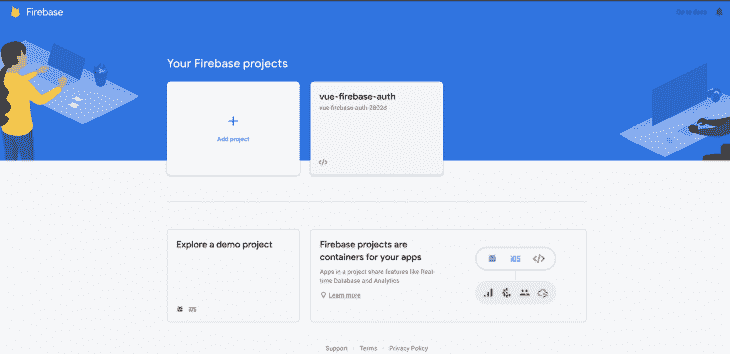
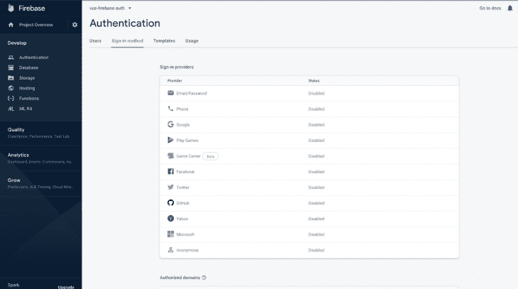
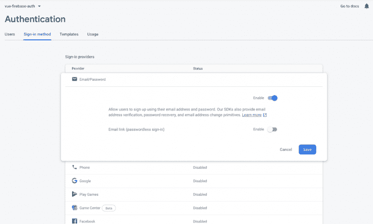
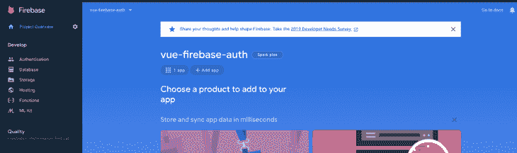

# 使用 Vue 3 和 Firebase - LogRocket 博客进行认证

> 原文：<https://blog.logrocket.com/authentication-vue-3-firebase/>

***编者按:*** *本文最后一次更新于 2022 年 8 月 18 日，以反映 Firebase v9 和 Vue v3 中所做的更改。*

在构建任何类型的应用程序时，隐私和安全是需要牢记的两个重要因素。随着网络犯罪变得越来越先进，身份认证是阻止黑客攻击和保护用户最有价值信息的重要一步。

[Firebase Authentication](https://firebase.google.com/docs/auth) 提供后端服务来帮助验证应用程序中的用户，支持不同的身份验证方法，如密码和电话号码，并支持包括谷歌、推特和脸书在内的身份提供商。

要将 Firebase 身份验证集成到您的应用程序中，您可以使用 [Firebase UI，](https://firebase.google.com/docs/auth/android/firebaseui)来处理用户登录不同提供商的 UI 流，或者您可以在您的项目中手动设置 Firebase SDK，并配置对您想要使用的任何提供商的支持。

在本教程中，我们将手动设置 Firebase。我们将创建用户注册和登录所需的不同视图，最后提供对电子邮件和密码认证的支持。

为了跟随本文，您可以[访问完整的代码库](https://github.com/Abiola-Farounbi/VUE-authentication)。我们开始吧！

## 设置 Vue

首先，我们将使用 [Vue CLI](https://github.com/vuejs/vue-cli) v3.0 快速搭建一个新的 Vue 项目。如果您已经安装了较旧版本的 CLI，可以通过运行以下命令卸载它:

```
npm uninstall -g vue/cli

```

然后，通过运行以下命令全局安装新的 CLI:

```
npm install -g @vue/cli

```

接下来，通过运行下面的命令创建一个新的 Vue 项目:

```
vue create firebase-auth

```

系统会提示您选择一个预设。选择 **Default ([Vue 3] babel，eslint)** ，这将在指定位置搭建一个新的 Vue 应用程序。

## 设置 Firebase 项目

要开始使用 Firebase，你需要一个 Gmail 帐户。前往[https://console.firebase.google.com/u/0/](https://console.firebase.google.com/u/0/)创建一个新项目:



Firebase 支持使用不同的方法进行身份验证，比如社交身份验证、电话号码以及标准的电子邮件和密码。

在本教程中，我们将使用电子邮件和密码认证方法。我们需要为我们刚刚在 Firebase 中创建的项目启用它，因为默认情况下它是禁用的。

在项目的**认证部分**下，点击**登录方法**，您应该会看到 Firebase 当前支持的提供商列表:



接下来，单击电子邮件/密码提供程序上的**编辑**图标，并打开**启用**开关:



接下来，您需要在 Firebase 项目下注册您的应用程序。在项目的概述页面上，在**通过将 Firebase 添加到您的应用**开始下，选择 **web** **图标**:



一旦你完成了应用程序的注册，你会看到一个包含你的应用程序凭证的 **Add Firebase SDK** 部分。注意`firebaseConfig`对象，我们将在我们的 Vue 应用程序中使用它。

## 安装依赖项

接下来，`cd`进入您的项目目录，并运行以下命令来安装所有需要的依赖项:

```
npm i firebase [email protected] [email protected] 

```

*   Firebase 是我们将用来与 Firebase 交互的 npm 包
*   [Vue 路由器](https://router.vuejs.org/)是 Vue 的官方路由器
*   Vuex 是 Vue 的一个状态管理库

## 如何集成 Firebase 和 Vue

现在，我们可以用我们的 Vue 项目设置 Firebase。在`main.js`文件中，我们将导入 Firebase 包，并将其配置为使用我们之前从 Firebase 控制台记录的应用程序凭证。在`src`文件夹中，创建一个名为`firebaseConfig.js`的文件，然后添加应用程序凭证，它应该类似于下面的代码:

```
// Import the functions you need from the SDKs you need
import { initializeApp } from "firebase/app";
import { getAuth } from 'firebase/auth'

const firebaseConfig = {
  apiKey: process.env.VUE_APP_FIREBASE_API_KEY,
  authDomain: process.env.VUE_APP_FIREBASE_AUTH_DOMAIN,
  databaseURL: process.env.VUE_APP_FIREBASE_DATABASE_URL,
  projectId: process.env.VUE_APP_FIREBASE_PROJECT_ID,
  storageBucket: process.env.VUE_APP_FIREBASE_STORAGE_BUCKET,
  messagingSenderId: process.env.VUE_APP_FIREBASE_MESSAGING_SENDER_ID,
  appId: process.env.VUE_APP_FIREBASE_APP_ID,
  measurementId: process.env.VUE_APP_FIREBASE_MEASUREMENT_ID
};

// Initialize Firebase
const app = initializeApp(firebaseConfig);

//initialize firebase auth
const auth = getAuth()

export { app, auth }

```

不要忘记用我们之前提到的 Firebase 凭证替换`firebaseConfig` vales。

## 创建组件

现在，我们可以继续为我们的项目创建所需的组件。

*   `Register.vue`:处理允许用户注册的逻辑，以及显示注册视图
*   `Login.vue`:允许用户登录并显示登录视图的句柄
*   `Dashboard.vue`:用户成功注册或认证后显示
*   `Navbar.vue`:将在所有其他组件之间共享的导航栏组件

转到`src/components`目录，运行下面的命令来创建上面列出的组件:

```
touch Register.vue Login.vue Dashboard.vue Navbar.vue

```

## 将路由添加到项目中

在我们开始处理组件之前，让我们添加应用程序将拥有的路线。在`src`目录下创建一个`routes`文件夹。在该文件夹中，添加一个`index.js`文件，并用以下代码编辑该文件:

```
import { createRouter, createWebHistory } from 'vue-router'
import Login from '../views/Login.vue';
import Register from '../views/Register.vue';
import Dashboard from '../views/Dashboard.vue';

const routes = [
        {
        path: '/login',
        name: 'login',
        component: Login
    },
    {
        path: '/register',
        name: 'Register',
        component: Register
    },
    {
        path: '/',
        name: 'Dashboard',
        component: Dashboard
    }
]

const router = createRouter({
    history: createWebHistory(),
    routes
  })

  export default router      

```

接下来，用`<router-view/>`标签替换`App.vue`文件的内容:

```
<template>
  <div>
    <main class="py-4">
      <router-view></router-view>
    </main&gt;
  </div>
</template>

<script>
export default {
};
</script>

```

## 使用 Vuex 管理状态

Vuex 是一个[状态管理库，它提供了一个集中的存储库](https://blog.logrocket.com/managing-multiple-store-modules-vuex/)来帮助管理你的 Vue 应用中的组件。在`src`目录中创建一个`store.js`文件，并将以下代码添加到该文件中:

```
import { createStore } from 'vuex'

const store = createStore({
})

// export the store
export default store

```

首先，我们定义包含一个`user`对象的状态，该对象包含关于登录用户的信息:

```
state: {
  user: {
    loggedIn: false,
    data: null
  }
},

```

属性`loggedIn`的默认值为`false`，它是一个布尔值，告诉我们用户是否已经过身份验证。`data`属性保存登录用户的信息:

```
getters: {
    user(state){
      return state.user
    }
  },

```

在 [Vuex 中，getters 通常提供一种访问存储在状态中的数据](https://blog.logrocket.com/unit-testing-vuex-modules-jest/#testing-getters)的方法。我们定义了一个名为`user`的简单 getter，它从状态中返回`user`对象:

```
mutations: {
  SET_LOGGED_IN(state, value) {
    state.user.loggedIn = value;
  },
  SET_USER(state, data) {
    state.user.data = data;
  }
}

```

突变允许我们改变我们的状态；这里，我们定义了两种突变。第一个是`SET_LOGGED_IN`，它将`state.user`上的`loggedIn`属性设置为传递给它的`value`。`SET_USER`在`state.user`对`data`属性进行修改:

```
  actions: {
      async register(context, { email, password, name}){
          const response = await createUserWithEmailAndPassword(auth, email, password)
          if (response) {
              context.commit('SET_USER', response.user)
              response.user.updateProfile({displayName: name})
          } else {
              throw new Error('Unable to register user')
          }
      },

      async logIn(context, { email, password }){
        const response = await signInWithEmailAndPassword(auth, email, password)
        if (response) {
            context.commit('SET_USER', response.user)
        } else {
            throw new Error('login failed')
        }
    },

    async logOut(context){
        await signOut(auth)
        context.commit('SET_USER', null)
    },

    async fetchUser(context ,user) {
      context.commit("SET_LOGGED_IN", user !== null);
      if (user) {
        context.commit("SET_USER", {
          displayName: user.displayName,
          email: user.email
        });
      } else {
        context.commit("SET_USER", null);
      }
  }
  }

```

动作类似于突变，但是[不是突变状态，而是提交突变](https://blog.logrocket.com/unit-testing-vuex-modules-jest/#testing-actions)。
为了简化流程，我们将在动作中定义认证的所有动作，然后在方法中分派它们。

`register` action 使用来自`firebase.auth()`的`createUserWithEmailAndPassword()`方法，传递我们想要在 Firebase 上注册的用户的电子邮件和密码。

我们不需要散列密码，因为 Firebase 会自动处理。如果注册成功，我们调用返回的`user`对象上的`updateProfile()`方法，将名称字段与`user`关联起来。否则，我们抛出一个错误异常，然后显示给用户。

`logIn`动作使用与寄存器动作`()`相同的逻辑，但使用不同的`signInWithEmailAndPassword()`方法。

`logout()`动作使用`signOut()`方法，然后将用户状态更新为`null`。`fetchUser`动作接受用户作为参数，根据其当前值更新状态。

## 在 Firebase 中注册用户

让我们看看如何在 Firebase 上注册用户并存储他们的详细信息。用以下代码编辑`src/components/Register.vue`:

```
<template>
  <div class="container">
    <div class="row justify-content-center">
      <div class="col-md-8">
        <div class="card">
          <div class="card-header">Register</div>
          <div class="card-body">
            <div v-if="error" class="alert alert-danger">{{error}}</div>
            <form action="#" @submit.prevent="Register">
              <div class="form-group row">
                <label for="name" class="col-md-4 col-form-label text-md-right">Name</label>

                <div class="col-md-6">
                  <input
                    id="name"
                    type="name"
                    class="form-control"
                    name="name"
                    value
                    required
                    autofocus
                    v-model="name"
                  />
                </div>
              </div>

              <div class="form-group row">
                <label for="email" class="col-md-4 col-form-label text-md-right">Email</label>

                <div class="col-md-6">
                  <input
                    id="email"
                    type="email"
                    class="form-control"
                    name="email"
                    value
                    required
                    autofocus
                    v-model="email"
                  />
                </div>
              </div>

              <div class="form-group row">
                <label for="password" class="col-md-4 col-form-label text-md-right">Password</label>

                <div class="col-md-6">
                  <input
                    id="password"
                    type="password"
                    class="form-control"
                    name="password"
                    required
                    v-model="password"
                  />
                </div>
              </div>

              <div class="form-group row mb-0">
                <div class="col-md-8 offset-md-4">
                  <button type="submit" class="btn btn-primary">Register</button>
                </div>
              </div>
            </form>
          </div>
        </div>
      </div>
    </div>
  </div>
</template>

<script>
import { ref } from 'vue'
import { useStore } from 'vuex'
import { useRouter } from 'vue-router'

export default {
  name: "RegisterComponent",
 setup() {
    const name = ref('')
    const email = ref('')
    const password = ref('')
    const error = ref(null)

    const store = useStore()
    const router = useRouter()

    const Register = async () => {
      try {
        await store.dispatch('register', {
          email: email.value,
          password: password.value,
          name: name.value
        })
        router.push('/')
      }
      catch (err) {
        error.value = err.message
            }
    }

    return { Register, name,email, password, error }
  }
};
</script>

```

在`<template></template>`标签中，我们为注册用户创建了一个简单的引导表单。表单中的每个输入字段都在来自组合 API 的 [`setup()`钩子中定义。当提交表单时，调用`Register`函数，该函数处理用户在 Firebase 上的实际注册。](https://blog.logrocket.com/vue-composition-api-vs-react-hooks/)

为了进一步理解发生了什么，让我们来详细看看`Register`函数:

```
const Register = async () => {
      try {
        await store.dispatch('register', {
          email: email.value,
          password: password.value,
          name: name.value
        })
        router.push('/')
      }
      catch (err) {
        error.value = err.message
            }
    }

```

在`submit()`方法中，`firebase.auth()`让我们可以访问默认应用的认证服务。

接下来，我们调用`createUserWithEmailAndPassword()`，传递我们想要在 Firebase 上注册的用户的电子邮件和密码。我们不需要散列密码，因为 Firebase 会自动完成这项工作。

由此，我们定义了一个异步函数`Register`，它从商店和电子邮件中调度`Register`动作，然后传递密码和名称作为有效负载。如果成功，用户将被重定向到仪表板页面。否则，错误会显示在页面中。

## 登录用户

接下来，让我们学习如何允许用户登录。继续用下面的代码编辑我们之前创建的`Login.vue`组件:

```
<template>
  <div class="container">
    <div class="row justify-content-center">
      <div class="col-md-8">
        <div class="card">
          <div class="card-header">Login</div>
          <div class="card-body">
            <div v-if="error" class="alert alert-danger">{{error}}</div>
            <form action="#"  @submit.prevent="Login">
              <div class="form-group row">
                <label for="email" class="col-md-4 col-form-label text-md-right">Email</label>

                <div class="col-md-6">
                  <input
                    id="email"
                    type="email"
                    class="form-control"
                    name="email"
                    value
                    required
                    autofocus
                    v-model="email"
                  />
                </div>
              </div>

              <div class="form-group row">
                <label for="password" class="col-md-4 col-form-label text-md-right">Password</label>

                <div class="col-md-6">
                  <input
                    id="password"
                    type="password"
                    class="form-control"
                    name="password"
                    required
                    v-model="password"
                  />
                </div>
              </div>

              <div class="form-group row mb-0">
                <div class="col-md-8 offset-md-4">
                  <button type="submit" class="btn btn-primary">Login</button>
                </div>
              </div>
            </form>
          </div>
        </div>
      </div>
    </div>
  </div>
</template>

<script>
import { ref } from 'vue'
import { useStore } from 'vuex'
import { useRouter } from 'vue-router'

export default {
  name: "LoginComponent",
    setup() {
    const email = ref('')
    const password = ref('')
    const error = ref(null)

    const store = useStore()
    const router = useRouter()

    const Login = async () => {
      try {
        await store.dispatch('logIn', {
          email: email.value,
          password: password.value
        })
        router.push('/')
      }
      catch (err) {
        error.value = err.message
      }
    }
    return { Login, email, password, error }
  }
};
</script>

```

`Login.vue`组件类似于`Register.vue`组件。表单中的每个输入字段都在组合 API 的`setup()`钩子中定义。当用户提交表单时，调用`Login`函数，处理用户在 Firebase 上的实际注册:

```
    const Login = async () => {
      try {
        await store.dispatch('logIn', {
          email: email.value,
          password: password.value
        })
        router.push('/')
      }
      catch (err) {
        error.value = err.message
      }
    }

```

## 创建`Dashboard`组件

接下来，我们将定义一个简单的仪表板视图，其中包含一个引导警报，通知用户他们已经成功登录，显示用户配置文件，并显示注销按钮。将以下代码添加到`src/components/Dashboard.vue`文件中:

```
<template>
  <div class="container">
    <div class="row justify-content-center">
      <div class="col-md-8">
        <div class="card">
          <div v-if="user.loggedIn">

          <div class="card-header">Welcome, {{user.data.displayName}}</div>
          <div class="card-body">
            <div class="alert alert-success" role="alert">
            You are logged in!
            <div class="my-4">
                  <button  @click.prevent="signOut" class="btn btn-primary">Log Out</button>
            </div>
             </div>
          </div>

          </div>
            <div v-else class="alert alert-danger" role="alert">
              You are not logged in! 
            </div>
        </div>
      </div>
    </div>
  </div>
</template>

<script>
import { useStore} from "vuex";
import { useRouter } from "vue-router";
import {computed} from "vue";
import { auth } from '../firebaseConfig'

export default {
  name: "DashboardComponent",

  setup() {

  const store = useStore()
  const router = useRouter()

  auth.onAuthStateChanged(user => {
    store.dispatch("fetchUser", user);
  });

  const user = computed(() => {
    return store.getters.user;
  });

  const signOut = async () => {
        await store.dispatch('logOut')
        router.push('/')
  }

    return {user,signOut}
 }

};
</script>

```

使用`onAuthStateChanged()`观察器，我们可以在用户成功通过身份验证时分派`fetchUser()`动作:

```
  auth.onAuthStateChanged(user => {
    store.dispatch("fetchUser", user);
  });

```

使用计算出的属性，我们可以很容易地从存储 getters 中更新用户对象:

```
  const user = computed(() => {
    return store.getters.user;
  });

```

然后，用户的配置文件信息会显示在仪表板页面上。

## 注销用户

在`Dashboard.vue`组件中，我们定义了一个`signOut()`函数。该函数从商店调度`logout`动作，然后它被重定向回登录页面:

```
const signOut = async () => {
        await store.dispatch('logOut')
        router.push('/login')
  }

```

## 结论

在本教程中，我们学习了如何使用 Firebase 支持的电子邮件和密码提供者来建立一个简单的认证系统。Firebase 是提高应用程序安全性的一个很好的工具，正如您所看到的，Firebase 身份验证使用起来相当简单。

为了构建这个项目，您可以向某些路由添加中间件，并且只允许经过身份验证的用户访问这些路由。我希望你喜欢这个教程，如果你有任何问题，一定要留下评论。编码快乐！

## 像用户一样体验您的 Vue 应用

调试 Vue.js 应用程序可能会很困难，尤其是当用户会话期间有几十个(如果不是几百个)突变时。如果您对监视和跟踪生产中所有用户的 Vue 突变感兴趣，

[try LogRocket](https://lp.logrocket.com/blg/vue-signup)

.

[](https://lp.logrocket.com/blg/vue-signup)[https://logrocket.com/signup/](https://lp.logrocket.com/blg/vue-signup)

LogRocket 就像是网络和移动应用程序的 DVR，记录你的 Vue 应用程序中发生的一切，包括网络请求、JavaScript 错误、性能问题等等。您可以汇总并报告问题发生时应用程序的状态，而不是猜测问题发生的原因。

LogRocket Vuex 插件将 Vuex 突变记录到 LogRocket 控制台，为您提供导致错误的环境，以及出现问题时应用程序的状态。

现代化您调试 Vue 应用的方式- [开始免费监控](https://lp.logrocket.com/blg/vue-signup)。