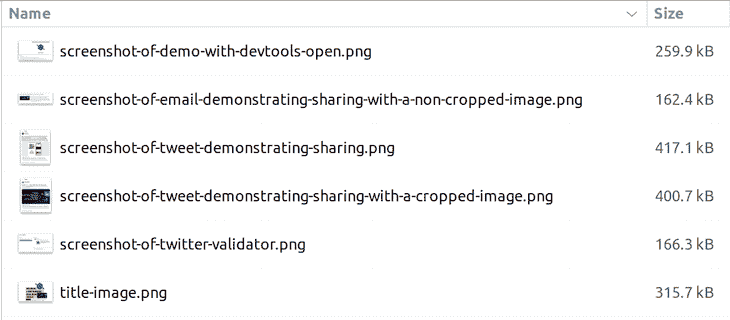
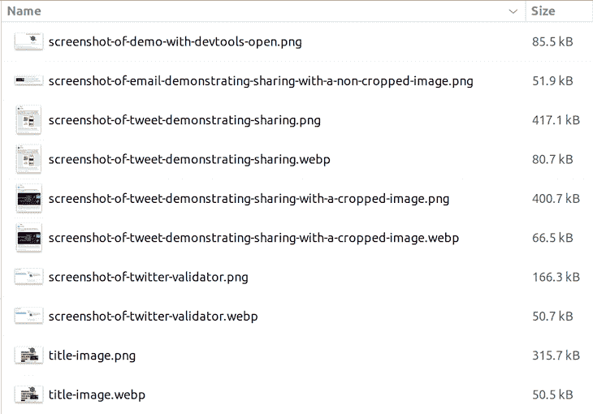

# 使用 TinyPNG API 自动优化图像

> 原文：<https://blog.logrocket.com/automate-image-optimization-tinypng-api/>

如果您想学习自动化图像优化，那么您来对地方了，因为您可以使用 TinyPNG API 来实现这一点！这篇文章将清楚地展示如何做到这一点，这样你就可以在你的项目中轻松地优化你的图像。

*向前跳转:*

## 图像和优化

图像是网络的一大部分——它们也是网络有效载荷的一大部分。如果我们不小心的话，我们最终会得到一个加载缓慢且托管费用昂贵的网站；一个非常糟糕的组合！

我在我的博客上运行 [Lighthouse](https://developer.chrome.com/docs/lighthouse/overview/) ，我一直在寻找提高网站性能的方法；Lighthouse 标记的事情之一是图像优化。最好[优化我们的图片](https://blog.logrocket.com/ux-design/optimizing-images-mobile-browsers-ux-mindset/)，以确保它们不会无用地变大，妨碍我们项目的[表现](https://blog.logrocket.com/top-5-web-apis-performance-based-analysis/)。

我们可以使用像 [TinyPNG](https://tinypng.com/) 或 [Squoosh](https://squoosh.app/) 这样的工具手动完成这个过程，但是也有可能完全自动化这个过程。在这篇文章中，我将向您展示如何使用 TinyPNG API 自动优化图像。

## TinyPNG API

TinyPNG API 是一个付费服务。我们可以获得一个免费的 API 密钥，允许我们每月优化 500 张图像。如果我们需要更多的优化，我们需要付费订阅。我个人很少发现我每月优化超过 500 张图片，所以我对免费计划很满意。

值得注意的是，“TinyPNG”这个名字有点用词不当。该 API 支持多种图像格式，包括 PNG、JPEG 和 WebP，因此它不仅仅适用于 PNG——事实上，在本文中我们将使用 WebP 格式。

如果您愿意，您可以直接使用 API，但是我更喜欢使用客户端库——我们将使用 [Node.js](https://tinypng.com/developers/reference/nodejs) 库。

我们将使用[类型脚本](https://www.typescriptlang.org/)和 [`ts-node`](https://typestrong.org/ts-node/) 初始化一个名为 tinify 的简单 Node.js 控制台应用程序:

```
mkdir tinify
cd tinify
npm init -y
npm install @types/node tinify ts-node typescript
npx tsc --init

```

你会注意到我们使用的是在这里开发的`tinify` npm 包[。很方便，这个包附带了 TypeScript 定义，所以我们不需要安装单独的类型包。](https://github.com/tinify/tinify-nodejs)

在我们的`package.json`文件中，我们将添加一个`start`脚本来运行我们的应用程序:

```
  "scripts": {
    "start": "ts-node index.ts"
  },

```

在我们的`tsconfig.json`文件中，我们还将把`target`升级到新的 [ECMAScript](https://blog.logrocket.com/typescript-4-7-ecmascript-module-support/) emit 版本，以允许我们使用一些更新的语言特性。对于 TinyPNG，我们不需要这个，但是使用新的特性很好:

```
{
  "compilerOptions": {
    "target": "es2021"
  }
}

```

现在，我们可以创建我们的`index.ts`文件:

```
import fs from 'fs';
import path from 'path';
import tinify from 'tinify';

function setUpTinify() {
  if (!process.env.TINIFY_KEY) {
    console.log(
      'Run with: TINIFY_KEY=$YOUR_API_KEY IMAGE_DIR=$YOUR_IMAGE_DIRECTORY yarn start'
    );
    process.exit(1);
  }

  tinify.key = process.env.TINIFY_KEY;
}

function getImageFilesFromDirectory(dir: string) {
  return fs
    .readdirSync(dir)
    .filter(
      (file) =>
        file.endsWith('.jpg') ||
        file.endsWith('.jpeg') ||
        file.endsWith('.webp') ||
        file.endsWith('.png')
    )
    .map((file) => path.resolve(dir, file))
    .filter((file) => fs.statSync(file).size > 0);
}

async function processImageFiles(imageFiles: string[]) {
  let processed = 0;
  let totalOriginalSizeKb = 0n;
  let totalNewSizeKb = 0n;
  let failed: string[] = [];

  for (const imageFilePath of imageFiles) {
    try {
      console.log(`
🖼️  Processing ${imageFilePath}
`);
      const originalImageFilePrefix = imageFilePath.substring(
        0,
        imageFilePath.lastIndexOf('.')
      );

      const originalStats = await fs.promises.stat(imageFilePath, {
        bigint: true,
      });
      const originalSizeKb = originalStats.size / 1024n;

      const source = tinify.fromFile(imageFilePath);
      const converted = source.convert({ type: ['image/webp', 'image/png'] });
      const convertedExtension = await converted.result().extension();
      const newImageFilePath = `${originalImageFilePrefix}.${convertedExtension}`;
      await converted.toFile(newImageFilePath);

      const newStats = await fs.promises.stat(newImageFilePath, {
        bigint: true,
      });
      const newSizeKb = newStats.size / 1024n;

      const imageFileName = path.basename(imageFilePath);
      const newImageFileName = path.basename(newImageFilePath);

      totalOriginalSizeKb += originalSizeKb;
      totalNewSizeKb += newSizeKb;

      console.log(`- 🔴 ${originalSizeKb}kb - ${imageFileName}
- 🟢 ${newSizeKb}kb - ${newImageFileName}
- 🔽 ${calculatePercentageReduction({ originalSizeKb, newSizeKb }).toFixed(
        2
      )}% reduction

✅ Processed! (${++processed} of ${imageFiles.length})

----------------------`);
    } catch (e) {
      console.log(`\n❌ Failed to process ${imageFilePath}`);
      failed.push(imageFilePath);
    }
  }

  console.log(`
************************************************
* Total savings for ${imageFiles.length} images 
- 🔴 ${totalOriginalSizeKb}kb
- 🟢 ${totalNewSizeKb}kb
- 🔽 ${calculatePercentageReduction({
    originalSizeKb: totalOriginalSizeKb,
    newSizeKb: totalNewSizeKb,
  }).toFixed(2)}% reduction
************************************************
`);

  if (failed.length > 0) console.log('Failed to process', failed);
}

function calculatePercentageReduction({
  originalSizeKb,
  newSizeKb,
}: {
  originalSizeKb: bigint;
  newSizeKb: bigint;
}) {
  return (
    ((Number(originalSizeKb) - Number(newSizeKb)) / Number(originalSizeKb)) *
    100
  );
}

async function run() {
  setUpTinify();

  let directory = process.env.IMAGE_DIR;

  if (!directory) {
    console.log('No directory specified!');
    process.exit(1);
  }

  const imageFiles = getImageFilesFromDirectory(directory);
  console.log(`Found ${imageFiles.length} image files in ${directory}`);
  await processImageFiles(imageFiles);
}

// do it!
run();

```

这里发生了很多事情，所以让我更详细地介绍一下。

每次运行它时，我们都会检查是否指定了 TinyPNG API 键和图像目录。如果没有，我们将退出并显示一条错误消息。

然后，我们从指定的目录中获取图像文件的列表。我们搜索扩展名为`.jpg`、`.jpeg`、`.webp`和`.png`(TinyPNG 支持的格式)的文件，并过滤掉任何空文件。

接下来，我们将遍历图像文件并逐个处理它们。我们正在使用`tinify`包来缩小图像，我们说我们将接受`webp`或`png`作为我们的目标格式。Tinify 将根据每个请求决定哪种格式是最佳的，并相应地进行呈现。

最后，我们将新文件保存到与原始文件相同的目录中，并计算文件大小减少的百分比。

为了了解这里发生了什么，我们可以看看进行转换的代码:

```
const source = tinify.fromFile(imageFilePath);
const converted = source.convert({ type: ['image/webp', 'image/png'] });
const convertedExtension = await converted.result().extension();
const newImageFilePath = `${originalImageFilePrefix}.${convertedExtension}`;
await converted.toFile(newImageFilePath);

```

工具编写完成后，我们现在需要测试它。我有一个要压缩的图像目录:

`~/code/github/open-graph-sharing-previews/images-to-shrink`



现在，让我们针对该目录运行我们的工具，看看会发生什么。

```
TINIFY_KEY=YOUR_API_KEY_GOES_HERE IMAGE_DIR=~/code/github/open-graph-sharing-previews/images-to-shrink yarn start

yarn run v1.22.18
$ ts-node index.ts
Found 6 image files in /home/john/code/github/open-graph-sharing-previews/images-to-shrink

🖼️  Processing /home/john/code/github/open-graph-sharing-previews/images-to-shrink/screenshot-of-demo-with-devtools-open.png

- 🔴 253kb - screenshot-of-demo-with-devtools-open.png
- 🟢 83kb - screenshot-of-demo-with-devtools-open.png
- 🔽 67.19% reduction

✅ Processed! (1 of 6)

----------------------

🖼️  Processing /home/john/code/github/open-graph-sharing-previews/images-to-shrink/screenshot-of-email-demonstrating-sharing-with-a-non-cropped-image.png

- 🔴 158kb - screenshot-of-email-demonstrating-sharing-with-a-non-cropped-image.png
- 🟢 50kb - screenshot-of-email-demonstrating-sharing-with-a-non-cropped-image.png
- 🔽 68.35% reduction

✅ Processed! (2 of 6)

----------------------

🖼️  Processing /home/john/code/github/open-graph-sharing-previews/images-to-shrink/screenshot-of-tweet-demonstrating-sharing-with-a-cropped-image.png

- 🔴 391kb - screenshot-of-tweet-demonstrating-sharing-with-a-cropped-image.png
- 🟢 64kb - screenshot-of-tweet-demonstrating-sharing-with-a-cropped-image.webp
- 🔽 83.63% reduction

✅ Processed! (3 of 6)

----------------------

🖼️  Processing /home/john/code/github/open-graph-sharing-previews/images-to-shrink/screenshot-of-tweet-demonstrating-sharing.png

- 🔴 407kb - screenshot-of-tweet-demonstrating-sharing.png
- 🟢 78kb - screenshot-of-tweet-demonstrating-sharing.webp
- 🔽 80.84% reduction

✅ Processed! (4 of 6)

----------------------

🖼️  Processing /home/john/code/github/open-graph-sharing-previews/images-to-shrink/screenshot-of-twitter-validator.png

- 🔴 162kb - screenshot-of-twitter-validator.png
- 🟢 49kb - screenshot-of-twitter-validator.webp
- 🔽 69.75% reduction

✅ Processed! (5 of 6)

----------------------

🖼️  Processing /home/john/code/github/open-graph-sharing-previews/images-to-shrink/title-image.png

- 🔴 308kb - title-image.png
- 🟢 49kb - title-image.webp
- 🔽 84.09% reduction

✅ Processed! (6 of 6)

----------------------

************************************************
* Total savings for 6 images
- 🔴 1679kb
- 🟢 373kb
- 🔽 77.78% reduction
************************************************

Done in 25.23s.

```

这难道不令人印象深刻吗？我们已经将所有这些图像的文件大小平均减少了 77.78%！这是一笔巨大的节省！

如果我们仔细观察，我们会发现在两种情况下，格式仍然是 PNG 文件，并且大小缩小了。在四种情况下，格式已更改为 WebP 文件。当我们再次查看我们的目录时，我们可以看到文件已经更新，并且创建了一些新的 WebP 文件:



## 结论

在本文中，我们看到了如何使用 TinyPNG API 来优化我们的图像。除此之外，我们还演示了如何构建一个工具，使用 TinyPNG API 自动优化给定目录中的图像。

这一切都是自动化的，所以我们现在可以随时随地运行这个脚本来优化图像！

如果你有兴趣学习其他图像优化的方法，你可能会发现[这篇关于使用 Cloudinary 作为你的图像 CDN](https://johnnyreilly.com/2022/12/26/docusaurus-image-cloudinary-rehype-plugin) 的文章很有趣。

## [LogRocket](https://lp.logrocket.com/blg/typescript-signup) :全面了解您的网络和移动应用

[](https://lp.logrocket.com/blg/typescript-signup)

LogRocket 是一个前端应用程序监控解决方案，可以让您回放问题，就像问题发生在您自己的浏览器中一样。LogRocket 不需要猜测错误发生的原因，也不需要向用户询问截图和日志转储，而是让您重放会话以快速了解哪里出错了。它可以与任何应用程序完美配合，不管是什么框架，并且有插件可以记录来自 Redux、Vuex 和@ngrx/store 的额外上下文。

除了记录 Redux 操作和状态，LogRocket 还记录控制台日志、JavaScript 错误、堆栈跟踪、带有头+正文的网络请求/响应、浏览器元数据和自定义日志。它还使用 DOM 来记录页面上的 HTML 和 CSS，甚至为最复杂的单页面和移动应用程序重新创建像素级完美视频。

[Try it for free](https://lp.logrocket.com/blg/typescript-signup)

.