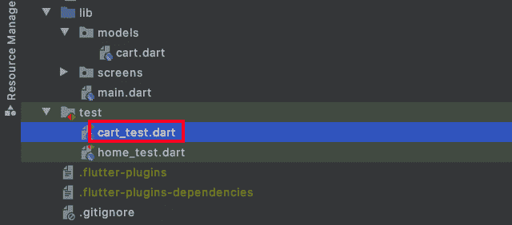
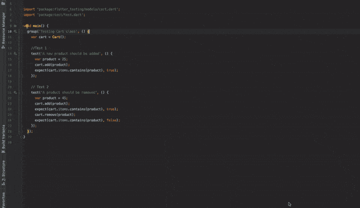
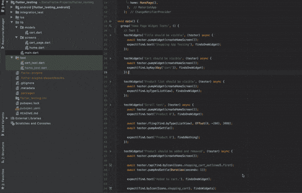

# 颤振的自动测试:综述

> 原文：<https://blog.logrocket.com/automated-testing-flutter/>

任何应用程序的成功都取决于其质量。要让客户喜欢一个应用程序，并通过口碑广告宣传它，它必须提供尽可能高的质量，并能承受不利条件。

质量保证对于在应用程序进入生产之前解决其缺陷起着重要的作用。几乎所有的软件团队都有某种形式的 QA 作为他们开发生命周期的一部分，即使没有专门的 QA 团队只做这项工作。

软件工程的本质是在现有代码基础上构建新功能。因此，无论是谁负责 QA，都必须不仅测试新功能，还要测试现有功能，以确保应用程序能够很好地与新功能集成。

现在的问题是:花在 QA 上的时间会随着每一个新特性而增加，而且很有可能不是所有的东西都经过了充分的测试。虫子很容易溜进使用者的手里。

自动化测试通过自动化 QA 手动完成的一些工作，确实有所帮助。我们可以为那些 QA 已经测试过的特性编写一个自动化测试，这样团队就可以专注于测试新特性，而旧特性将被自动测试。这节省了大量时间，并为将应用交付生产带来了更高的信心。

在本教程中，我们将介绍 Flutter 的自动化测试，并通过一个例子回顾如何编写每种类型的自动化测试。

下面是我们将涉及的三种类型的测试:

*   单元测试
*   小部件测试
*   集成测试

## 回顾我们的示例颤振应用程序

让我们来看看我们将要测试的示例应用程序:


出于本教程的目的，我们的要求是所有产品的列表应该在应用程序主页上可用。用户可以通过单击旁边的购物车图标将产品添加到购物车中。一旦添加，购物车图标应该改变。

点击**购物车**文本将打开一个购物车页面，显示添加到购物车的所有产品的列表。可以通过“取消”按钮或滑动来删除购物车中的产品。

## 为我们的 Flutter 应用程序编写测试

如上所述，我们将为我们的 Flutter 应用程序自动化三种类型的测试:单元测试、小部件测试和集成测试。一个应用程序可以有这三种测试的几种组合，但是由你来设计和实现测试，为你的用例提供最大的信心。

### 单元测试

让我们从应用程序的单元测试开始。这通过确保该方法根据给它的输入提供预期的结果来测试该类的单个方法。它帮助您编写更易测试和维护的代码。

我们的目标是为`Cart`类编写单元测试——更具体地说，我们将确保为产品添加和移除方法会给出正确的结果。

首先，添加测试依赖:

```
dev_dependencies:
  test: ^1.14.4

```

下面是`Cart`类，它有添加和删除项目的方法:

```
import 'package:flutter/material.dart';

/// The [Cart] class holds a list of cart items saved by the user.
class Cart extends ChangeNotifier {
  final List<int> _cartItems = [];

  List<int> get items => _cartItems;

  void add(int itemNo) {
    _cartItems.add(itemNo);
    notifyListeners();
  }

  void remove(int itemNo) {
    _cartItems.remove(itemNo);
    notifyListeners();
  }
}

```

接下来，我们将创建一个文件来编写测试用例。在`test`文件夹中(在项目的根目录下)，创建一个新文件`cart_test.dart`。它应该是这样的:



现在，在其中添加以下代码:

> **注意:**，确保给出一个名为`(classToTest)_test.dart`的测试文件。

```
import 'package:flutterdemos/testingdemo/models/cart.dart';
import 'package:test/test.dart';

void main() {
  group('Testing Cart class', () {
    var cart = Cart();

    //Test 1
    test('A new product should be added', () {
      var product = 25;
      cart.add(product);
      expect(cart.items.contains(product), true);
    });

    // Test 2
    test('A product should be removed', () {
      var product = 45;
      cart.add(product);
      expect(cart.items.contains(product), true);
      cart.remove(product);
      expect(cart.items.contains(product), false);
    });
  });
}

```

这里，测试 1 验证购物车列表中应该存在添加的商品，测试 2 检查购物车中是否不存在删除的商品。`expect()`方法是一种用期望值来验证我们的输出的方法。

现在我们将运行单元测试。只需点击 IDE 中的播放按钮。



您也可以使用以下命令尝试使用终端:

```
flutter test test/cart_test.dart

```

### 小部件测试

顾名思义，小部件测试关注单个小部件。与单元测试不同，小部件测试确保特定小部件的外观和行为符合预期。您应该至少为所有常见的小部件编写一个小部件测试。

我们这里的目标是编写一个小部件测试来确保[主页](https://github.com/pinkeshdarji/flutter_testing/blob/master/lib/screens/home.dart)按预期工作。

首先，再添加一个测试依赖项:

```
dev_dependencies:
  test: ^1.14.4 # for unit test
  flutter_test:   
    sdk: flutter

```

类似于我们在上一节中创建的`cart_test.dart`文件，我们现在将在`test`文件夹中再创建一个文件`home_test.dart`。让我们添加下面的代码。

```
Widget createHomeScreen() => ChangeNotifierProvider<Cart>(
      create: (context) => Cart(),
      child: MaterialApp(
        home: HomePage(),
      ),
    );

void main() {
  group('Home Page Widget Tests', () {
    // Test 1
    testWidgets('Title should be visible', (tester) async {
      await tester.pumpWidget(createHomeScreen());
      expect(find.text('Shopping App Testing'), findsOneWidget);
    });
  });
}

```

下面的方法是编写小部件测试的基础:

*   `createHomeScreen()`–提供我们通常在`main.dart`文件中使用的主屏幕 UI
*   `testWidgets()`–创建`WidgetTester`，它提供了与被测试的小部件进行交互的方法
*   `await tester.pumpWidget()`–呈现提供的小工具
*   `find.text()`–查找带有给定文本的小工具。有时我们可能在 UI 中有相同的文本，所以`find.byKey(Key('string'))`变得非常有用
*   `expect()`——将找到的 widget 与预期的`Matcher`进行比较，可以是`findsOneWidget`、`findsNothing`等。

让我们来看看其他几个重要的测试用例，否则我们将不得不手动执行。这里，我们测试产品列表在主页上是否可见:

```
testWidgets('Product list should be visible', (tester) async {
  await tester.pumpWidget(createHomeScreen());
  expect(find.byType(ListView), findsOneWidget);
});

```

在这里，我们测试用户是否能够滚动产品列表:

```
testWidgets('Scroll test', (tester) async {
  await tester.pumpWidget(createHomeScreen());
  expect(find.text('Product 0'), findsOneWidget);

  await tester.fling(find.byType(ListView), Offset(0, -200), 3000);
  await tester.pumpAndSettle();

  expect(find.text('Product 0'), findsNothing);
});

```

完整列表可在[这里](https://github.com/pinkeshdarji/flutter_testing/blob/master/test/home_test.dart)找到。

现在进行测试。



### 集成测试

集成测试有助于实现应用程序的端到端测试。它们使我们能够了解用户是否能够完成应用程序的全部流程。这本质上就像测试一个真实的应用程序。

与单元测试和小部件测试不同，集成测试在真实的设备上运行，因此我们有机会看到测试是如何执行的。在一个完美的世界里，我们可以根据需要编写和运行尽可能多的测试。但是如果我们时间有限，我们绝对应该至少写一个集成测试。

我们的目标是测试用户是否能够在购物车中添加和删除产品。下面是集成测试所需的依赖关系:

```
dev_dependencies:
  test: ^1.14.4 # for unit test
  flutter_test: # for widget test
    sdk: flutter
  flutter_driver:
    sdk: flutter
  integration_test: ^1.0.1

```

现在，我们在项目根目录下创建`integration_test`文件夹，并在其中添加一个文件`driver.dart`，代码如下:

```
import 'package:integration_test/integration_test_driver.dart';

Future<void> main() => integrationDriver();

```

然后我们将创建一个文件`app_test.dart`并添加以下代码:

```
void main() {
  group('Testing full app flow', () {
    IntegrationTestWidgetsFlutterBinding.ensureInitialized();

    testWidgets('Add product and remove using cancel button', (tester) async {
      await tester.pumpWidget(MyApp());

      //Add
      await tester.tap(find.byIcon(Icons.shopping_cart_outlined).first);
      await tester.pumpAndSettle(Duration(seconds: 1));
      expect(find.text('Added to cart.'), findsOneWidget);

      // Move to next page
      await tester.tap(find.text('Cart'));
      await tester.pumpAndSettle();

      //Remove via cancel button
      await tester.tap(find.byKey(ValueKey('remove_icon_0')));
      await tester.pumpAndSettle(Duration(seconds: 1));
      expect(find.text('Removed from cart.'), findsOneWidget);
    });

  });
}

```

正如我们在上面的代码中看到的，有执行操作和验证结果的指令，就像我们手动操作一样:

*   `await tester.tap()`–点击指定的小工具
*   当用户点击一个 UI 元素时，可能会有一个动画。这个方法确保动画在指定的持续时间内稳定下来(例如，如果我们认为所需的小部件还不可用)，在这段时间之后，我们就可以开始新的指令了

我们还有通过刷卡移除产品的规定。实现这种行为的代码在这里:

```
//Remove via swipe
await tester.drag(find.byType(Dismissible), Offset(500.0, 0.0));
await tester.pumpAndSettle(Duration(seconds: 1));
expect(find.text('Removed from cart.'), findsOneWidget);

```

最后，我们将在真实设备上运行测试。在终端中运行以下命令:

```
flutter drive — driver integration_test/driver.dart — target integration_test/app_test.dart

```


## 结论

在本教程中，我们已经介绍了 Flutter 中的自动化测试，并通过例子介绍了我们可以编写的各种类型的测试。你可以在我的 GitHub 中查看[完整的源代码](https://github.com/pinkeshdarji/flutter_testing)以及所有的测试用例。

## 使用 [LogRocket](https://lp.logrocket.com/blg/signup) 消除传统错误报告的干扰

[](https://lp.logrocket.com/blg/signup)

[LogRocket](https://lp.logrocket.com/blg/signup) 是一个数字体验分析解决方案，它可以保护您免受数百个假阳性错误警报的影响，只针对几个真正重要的项目。LogRocket 会告诉您应用程序中实际影响用户的最具影响力的 bug 和 UX 问题。

然后，使用具有深层技术遥测的会话重放来确切地查看用户看到了什么以及是什么导致了问题，就像你在他们身后看一样。

LogRocket 自动聚合客户端错误、JS 异常、前端性能指标和用户交互。然后 LogRocket 使用机器学习来告诉你哪些问题正在影响大多数用户，并提供你需要修复它的上下文。

关注重要的 bug—[今天就试试 LogRocket】。](https://lp.logrocket.com/blg/signup-issue-free)