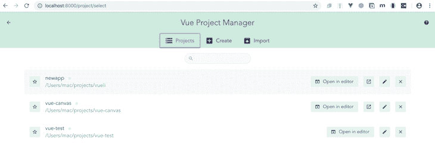
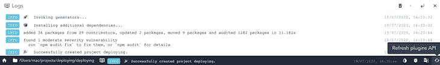
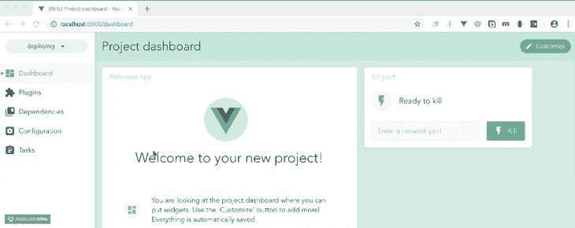
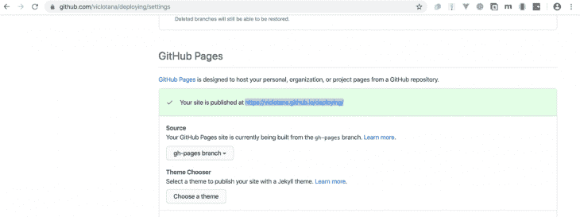

# 使用 GitHub Pages 自动构建和部署 Vue.js 应用程序

> 原文：<https://blog.logrocket.com/automatically-build-deploy-vuejs-app-github-pages/>

编者按:这篇文章于 2021 年 11 月 5 日更新，以反映 Vue 3 的更新，并根据自发布以来收到的意见改进教程。

Vue.js 由尤雨溪创建，由 250 多名社区成员持续维护和更新。它是一个非常先进的构建用户界面的框架，由一个只关注视图层的可接近的核心库和一个支持库的生态系统组成，帮助您解决构建更大的单页面应用程序的复杂性。

在这篇文章中，你将了解到一种简单的方法来构建 Vue 应用程序，以及如何用 GitHub 页面来部署它们。

## 开始之前

这篇文章适合任何级别的使用 Vue.js 的前端开发人员，所以不要求他们熟悉初学者的概念和安装过程。在通过本文开始使用 Vue CLI 3 之前，您应该已经具备了一些先决条件。

首先，您需要安装 Node.js ≥10.x。您可以通过在终端中运行以下命令来验证您是否已经这样做了:

```
node -v

```

您还需要:

*   已安装 NPM≥6.7 版
*   代码编辑器——我强烈推荐 Visual Studio 代码
*   使用 Git 的一般知识
*   Vue 的最新版本全球安装在您的机器上
*   您的计算机上安装的 vue CLI≥3.0 版

要安装最新版本的 Vue CLI，请运行以下命令:

```
npm uninstall -g vue-cli
```

然后，安装新的:

```
npm install -g @vue/cli
```

或者，您可以:

*   在这里下载一个 [Vue 启动项目](https://github.com/viclotana/vue-canvas)
*   解压缩下载的项目
*   导航到解压缩后的文件，并运行命令以保持所有依赖项最新:

```
npm install
```

## 什么是 GitHub Pages？

[GitHub Pages 是一个静态站点托管服务](https://blog.logrocket.com/github-actions-how-to-autodeploy-your-app/),它直接从 GitHub 库部署你的静态应用。你可以将 GitHub 页面设置为用户(主要用于个人品牌资产，如作品集)，这让你可以部署到`yourGitHubUsername.github.io`。

为此，您必须在 GitHub 上创建一个新的存储库，并将其命名为:

```
<Your username>.github.io

```

保存存储库后，它会使用项目根目录下的 HTML 自动为您创建一个 GitHub 页面。您还可以为 GitHub 上的任何新的或现有的存储库设置 GitHub 页面。

在本帖中，我们将创建一个 Vue.js 项目，然后将其部署到 GitHub 页面。

## Vue 项目设置

让我们使用 Vue GUI 来创建一个新项目。如果您从一开始就关注了这篇文章，并且已经有了 Vue 画布，那么您仍然可以创建一个新项目来获得使用 GUI 的经验。

在您的机器上，导航到一个首选位置并打开您的终端。运行下面的命令:

```
vue ui

```

您将被重定向到您的默认浏览器上的远程服务器，在那里您可以创建和管理 Vue 项目。您的浏览器将如下所示:



当您点击 **Create** 并选择您选择的位置时，它开始设置新项目。在第一个详细信息页面中，输入您的项目名称并保留所有的默认值，但是将 Git 初始化切换到**关闭**。

在预设页面上，选择默认的预设，其中有 Babel 和 ESLint，然后按 enter 键。这将需要一段时间，如果您不是以管理员身份在计算机上运行该命令，可能会返回错误。如果成功，您应该会看到一个完整的通知，日志应该如下所示:



现在点击左下角的 **Home** 按钮，选择新创建的项目，并将其导入远程服务器。现在我们的应用程序已经创建好了，我们可以通过运行以下命令在开发环境中查看它:

```
npm run serve

```

为此，在 GUI 上点击 **Tasks** ，选择 **Serve** ，并运行 Serve 任务。



现在我们已经成功构建了一个示例 Vue 应用程序，您可以点击**打开应用程序**在 localhost 中查看 Vue 应用程序。

## 设置 GitHub

首先要做的是用新项目创建一个 GitHub 存储库(这通常是在搭建阶段为我们创建的，但是我们禁用了它)。

首先，转到您的 GitHub 帐户并创建一个新的存储库，然后在 VS 代码中，项目位于您的本地机器中，打开一个新的终端并使用以下命令为 Git 设置它:

```
git init
git remote add origin https://github.com/your username/github project name.git

```

用您自己的项目凭据替换关键字。VS 代码可以让你在应用程序中很容易地准备、提交和推送你的更改，所以让我们来使用它。在 VS 代码中点击最左边的**源代码控制**标签，提交你的修改。成功后，您可以点击 VS 代码应用页脚附近的**下载**按钮。

## 使用 Node.js 脚本部署到 GitHub 页面

你要做的第一件事是在 Vue 项目的根目录下创建一个`vue.config.js`文件，并将下面的代码复制到其中:

```
module.exports = {
  publicPath: '/project name/'
}

```

现在提交并将更改推送到原始主分支。对于我们的部署，我们将使用 Roland Doda 编写的 Node.js 脚本[，它支持自动部署，并且基于](https://dev.to/rolanddoda/deploy-to-github-pages-like-a-pro-with-github-actions-4hdg) [execa 包](https://github.com/sindresorhus/execa)。

在应用程序的根文件夹中创建一个`Scripts`文件夹，并在其中创建一个`gh-pages-deploy.js`文件。将下面的代码块粘贴到内部:

```
/* eslint-disable no-console */
const execa = require("execa");
const fs = require("fs");
(async () => {
  try {
    await execa("git", ["checkout", "--orphan", "gh-pages"]);
    // eslint-disable-next-line no-console
    console.log("Building started...");
    await execa("npm", ["run", "build"]);
    // Understand if it's dist or build folder
    const folderName = fs.existsSync("dist") ? "dist" : "build";
    await execa("git", ["--work-tree", folderName, "add", "--all"]);
    await execa("git", ["--work-tree", folderName, "commit", "-m", "gh-pages"]);
    console.log("Pushing to gh-pages...");
    await execa("git", ["push", "origin", "HEAD:gh-pages", "--force"]);
    await execa("rm", ["-r", folderName]);
    await execa("git", ["checkout", "-f", "master"]);
    await execa("git", ["branch", "-D", "gh-pages"]);
    console.log("Successfully deployed, check your settings");
  } catch (e) {
    // eslint-disable-next-line no-console
    console.log(e.message);
    process.exit(1);
  }
})();

```

上面的这些命令简单地自动化了以下整个过程:

*   在存储库中创建 GitHub Pages 分支
*   [为生产构建您的 Vue 应用](https://blog.logrocket.com/scaffolding-app-vue-3-nuxt-typescript/)
*   将已构建的`dist`文件的更改提交并推送到页面
*   在选择并部署构建之后，删除并完全移除 GitHub Pages 分支。这样，您就可以在进行任何新的更改后再次运行该命令，而不会出错

现在打开您的`package.json`文件，并将`execa`配置添加到您的开发依赖项中，如下所示:

```
//.json
"devDependencies": {
      "execa": "latest"
    }

```

然后，在脚本部分，添加以下内容:

```
//.json
"scripts": {
     "deploy": "node scripts/gh-pages-deploy.js"
    }

```

现在，要安装它们并确保它们是最新的，请在您的终端中运行以下命令:

```
npm install

```

我们准备走了。要使用 GitHub Pages 部署您的 Vue 应用程序，只需运行以下命令:

```
npm run deploy

```

这将向公众部署您的 Vue 应用程序，并为您提供一个唯一的链接。在 GitHub 上打开那个项目，点击**设置**。



您的 Vue 应用程序已上线！

## 结论

在本文中，我们通过使用一个`execa` Node.js 脚本自动化大部分过程，使用 Vue UI 工具创建了一个 Vue 应用程序,并将其托管在 GitHub 页面上。我希望这对你的 Vue.js 项目有所帮助——保持安全，继续黑客活动！

## 像用户一样体验您的 Vue 应用

调试 Vue.js 应用程序可能会很困难，尤其是当用户会话期间有几十个(如果不是几百个)突变时。如果您对监视和跟踪生产中所有用户的 Vue 突变感兴趣，

[try LogRocket](https://lp.logrocket.com/blg/vue-signup)

.

[](https://lp.logrocket.com/blg/vue-signup)[https://logrocket.com/signup/](https://lp.logrocket.com/blg/vue-signup)

LogRocket 就像是网络和移动应用程序的 DVR，记录你的 Vue 应用程序中发生的一切，包括网络请求、JavaScript 错误、性能问题等等。您可以汇总并报告问题发生时应用程序的状态，而不是猜测问题发生的原因。

LogRocket Vuex 插件将 Vuex 突变记录到 LogRocket 控制台，为您提供导致错误的环境，以及出现问题时应用程序的状态。

现代化您调试 Vue 应用的方式- [开始免费监控](https://lp.logrocket.com/blg/vue-signup)。