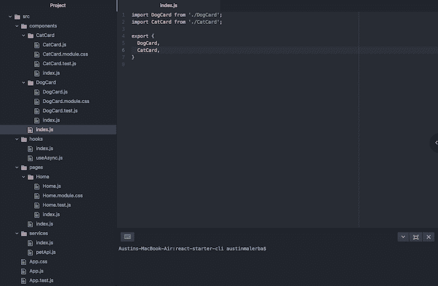
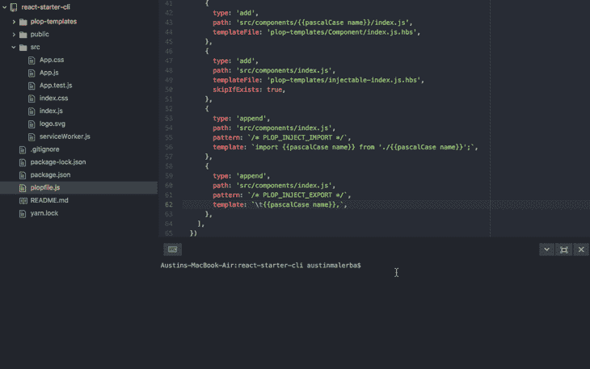
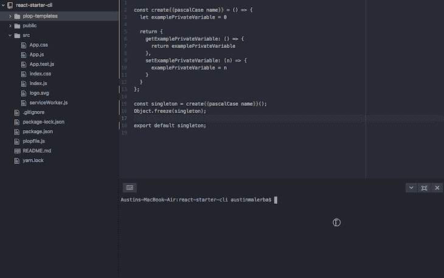

# 用 Plop.js 自动生成 React 组件

> 原文：<https://blog.logrocket.com/automatically-generate-react-components-plop-js/>

***编者按*** :本帖 2021 年 10 月 28 日。它可能仍然包含过时的信息。

您是否经常发现自己复制并粘贴旧组件作为新组件的模板？我知道我有。

以前和 Angular 一起工作过，我对没有与 [Angular CLI 的 generate API](https://angular.io/cli) 等价的 React 感到沮丧。对于那些不熟悉它的人来说，Angular CLI 提供了从命令行生成组件、路由、服务和管道的工具。

然后，我开始思考，为什么没有 React 等价物？我突然想到，React 生态系统不像 Angular 生态系统那样标准化。

一款新的 React 应用并没有搭载太多功能；目录结构和依赖关系很大程度上取决于开发人员。这可能很好，但是 React 应用程序之间缺乏一致性使得 React 组件生成器之类的工具更难处理。

经过一番调查，我偶然发现了一个名为 Plop.js 的库。

## 什么是扑通. js？

Plop.js 库可以与 React 一起使用，并允许您定义自己的参数化代码模板，这些模板可以注入到您的源代码中，以生成样板代码，否则您将不得不自己编写。

Plop 的优点在于它提供了一个相当高级的 API，同时还非常具有可定制性。我们不仅仅局限于组件；我们可以生成容器、服务、挂钩、缩减器、动作、实用程序、文档、自述文件等等。

## Plop.js 项目结构

在我们能够自动生成样板代码之前，我们必须知道我们想要生成的样板。

使用下面的 React 应用程序结构，让我们用这个结构来构建我们的生成器。



关于此设置，需要注意以下几点:

## 构建 CLI 界面

现在我们知道了我们想要如何构建代码，我们可以将注意力集中在我们想要构建的 CLI 界面上。出于本文的目的，我们将生成组件、页面、挂钩和服务。

为了简单起见，我们必须为每个变量提供的唯一参数是一个`name`:

```
# Generate a single-use component
npm run generate page <name>
# Generate page called Home
npm run generate page Home

# Generate a reusable component
npm run generate component <name>
# Generate a component called DogCard
npm run generate component DogCard

# Generate a custom hook
npm run generate hook <name>
# Generate a hook called useAsync
npm run generate hook useAsync

# Generate a service
npm run generate service <name>
# Generate a service called petApi
npm run generate service petApi

```

## 构建组件生成器

### 配置 Plop.js

让我们创建一个新的 React 应用程序并配置 Plop.js:

```
# Create new react app
npx create-react-app react-starter-cli
# Change working directory to root of app
cd react-starter-cli
# Install plop as a dev-dependency
npm install --save-dev plop
# Make a directory for our templates
mkdir plop-templates
# Create a plopfile to hold our cli logic
touch plopfile.js

```

一旦我们运行了这些命令，我们必须修改`plopfile.js`以包含以下内容:

```
module.exports = plop => {
  plop.setGenerator('component', {
    description: 'Create a component',
    // User input prompts provided as arguments to the template
    prompts: [
      {
        // Raw text input
        type: 'input',
        // Variable name for this input
        name: 'name',
        // Prompt to display on command line
        message: 'What is your component name?'
      },
    ],
    actions: [
      {
        // Add a new file
        type: 'add',
        // Path for the new file
        path: 'src/components/{{pascalCase name}}.js',
        // Handlebars template used to generate content of new file
        templateFile: 'plop-templates/Component.js.hbs',
      },
    ],
  });
};

```

我们还需要一个组件模板来指定我们生成的组件的内容。我们可以在`plop-templates/Component.js.hbs`下创建它(`.hbs`扩展表示这是一个 [Handlebars.js](https://handlebarsjs.com/) 模板)。

```
import React from 'react';

const {{pascalCase name}} = props => {
  return (
    <div>
      {{pascalCase name}}
    </div>
  );
};

export default {{pascalCase name}};

```

最后，让我们添加一个脚本到我们的`package.json`中，为扑通命令创建一个别名:

```
{
  /* ... */
  "scripts": {
    "start": "react-scripts start",
    "build": "react-scripts build",
    "test": "react-scripts test",
    "eject": "react-scripts eject",
    "generate": "plop"
  },
  /* ... */
}

```

这是这种配置的结果:


您可以看到，当我们试图在命令行上生成一个组件时，我们的提示出现了，要求用户输入组件名。然后，它使用该值来填充我们的车把模板中的`name`参数。

`pascalCase`修饰符确保`name`在 [PascalCase 中格式化，这是通过连接大写单词](http://wiki.c2.com/?PascalCase)来创建单词。这里是可用模板助手的[完整列表](https://github.com/amwmedia/plop#built-in-helpers)。

### 添加 Plop.js 操作

我们正朝着正确的方向前进，但这仍然很无力。让我们增强我们的扑通文件，以提供一些真正酷的功能和行动:

```
module.exports = plop => {
  plop.setGenerator('component', {
    description: 'Create a reusable component',
    prompts: [
      {
        type: 'input',
        name: 'name',
        message: 'What is your component name?'
      },
    ],
    actions: [
      {
        type: 'add',
        // Plop will create directories for us if they do not exist
        // so it's okay to add files in nested locations.
        path: 'src/components/{{pascalCase name}}/{{pascalCase name}}.js',
        templateFile:
          'plop-templates/Component/Component.js.hbs',
      },
      {
        type: 'add',
        path: 'src/components/{{pascalCase name}}/{{pascalCase name}}.test.js',
        templateFile:
          'plop-templates/Component/Component.test.js.hbs',
      },
      {
        type: 'add',
        path:
          'src/components/{{pascalCase name}}/{{pascalCase name}}.module.css',
        templateFile:
          'plop-templates/Component/Component.module.css.hbs',
      },
      {
        type: 'add',
        path: 'src/components/{{pascalCase name}}/index.js',
        templateFile: 'plop-templates/Component/index.js.hbs',
      },
      {
        // Adds an index.js file if it does not already exist
        type: 'add',
        path: 'src/components/index.js',
        templateFile: 'plop-templates/injectable-index.js.hbs',
        // If index.js already exists in this location, skip this action
        skipIfExists: true,
      },
      {
        // Action type 'append' injects a template into an existing file
        type: 'append',
        path: 'src/components/index.js',
        // Pattern tells plop where in the file to inject the template
        pattern: `/* PLOP_INJECT_IMPORT */`,
        template: `import {{pascalCase name}} from './{{pascalCase name}}';`,
      },
      {
        type: 'append',
        path: 'src/components/index.js',
        pattern: `/* PLOP_INJECT_EXPORT */`,
        template: `t{{pascalCase name}},`,
      },
    ],
  })
}

```

因为我们不希望我们生成的组件仅仅被表示为单个文件，所以我们将它们表示为打包了测试、样式等等的目录。

我们还添加了为每个新组件创建新目录的操作，并指示 Plop 不仅将我们的组件文件添加到目录中，还将测试、样式和索引的文件作为组件目录的接口。

此外，我们还添加了几个动作来添加到现有文件`components/index.js`中。该文件将所有组件打包到一个简洁的小模块中，因此我们可以使用以下命令将它们导入到其他地方:

```
import { Foo, Bar } from './components'.

```

使用`type: 'append'`的扑通动作在文件中搜索模式，并在`pattern`匹配位置后注入渲染模板。

出于这个原因，我们必须确保在`components/index.js`处存在一个文件，然后我们可以在文件内的扑通注入挂钩位置附加渲染模板。

### 更新 Plop.js 模板

让我们看看更新后的模板:

```
/* PLOP_INJECT_IMPORT */

export {
  /* PLOP_INJECT_EXPORT */
}

```

在上面的模板中，我们看到了前面提到的扑通钩。请注意，这些钩子完全是任意的，我们只需要文件中的一些东西来匹配我们的扑通动作中定义的模式。

模板的其余部分非常简单，因为它们没有引入任何新概念:

```
import React from 'react';
import PropTypes from 'prop-types';
import styles from './{{pascalCase name}}.module.css';

const {{pascalCase name}} = props => {
  return (
    <div className={styles.root}>
    </div>
  );
};

{{pascalCase name}}.defaultProps = {

};

{{pascalCase name}}.propTypes = {

};

export default {{pascalCase name}};</pre>
<pre>.root {

}
import React from 'react';
import {{pascalCase name}} from './{{pascalCase name}}';

describe('{{pascalCase name}}', () => {
   it('renders without error', () => {

   });
});
import {{pascalCase name}} from './{{pascalCase name}}';

export default {{pascalCase name}};

```

尽管在这个例子中这不是问题，但是要注意模板内容和手柄之间的语法可能会冲突。

例如，如果有一个包含`<div style={{ height: 100 }}/>`的模板，Handlebars 会错误地将花括号解释为表达式。如果发生这种情况，您必须按如下方式对大括号进行转义:

```
<div style={{ height: 100 }}/>

```

随着我们的更新扑通文件，我们的发电机看起来相当光滑。



## 为页面、挂钩和服务构建生成器

既然我们已经构建了组件生成器，我们也可以为页面、挂钩和服务构建生成器。构建这些其他生成器并没有引入任何新概念，所以我将直接展示我们最终的扑通文件:

```
module.exports = plop => {
  plop.setGenerator('component', {
    description: 'Create a reusable component',
    prompts: [
      {
        type: 'input',
        name: 'name',
        message: 'What is your component name?',
      },
    ],
    actions: [
      {
        type: 'add',
        path: 'src/components/{{pascalCase name}}/{{pascalCase name}}.js',
        templateFile:
          'plop-templates/Component/Component.js.hbs',
      },
      {
        type: 'add',
        path: 'src/components/{{pascalCase name}}/{{pascalCase name}}.test.js',
        templateFile:
          'plop-templates/Component/Component.test.js.hbs',
      },
      {
        type: 'add',
        path:
          'src/components/{{pascalCase name}}/{{pascalCase name}}.module.css',
        templateFile:
          'plop-templates/Component/Component.module.css.hbs',
      },
      {
        type: 'add',
        path: 'src/components/{{pascalCase name}}/index.js',
        templateFile: 'plop-templates/Component/index.js.hbs',
      },
      {
        type: 'add',
        path: 'src/components/index.js',
        templateFile: 'plop-templates/injectable-index.js.hbs',
        skipIfExists: true,
      },
      {
        type: 'append',
        path: 'src/components/index.js',
        pattern: `/* PLOP_INJECT_IMPORT */`,
        template: `import {{pascalCase name}} from './{{pascalCase name}}';`,
      },
      {
        type: 'append',
        path: 'src/components/index.js',
        pattern: `/* PLOP_INJECT_EXPORT */`,
        template: `t{{pascalCase name}},`,
      },
    ],
  })

  plop.setGenerator('page', {
    description: 'Create a page',
    prompts: [
      {
        type: 'input',
        name: 'name',
        message: 'What is your page name?',
      },
    ],
    actions: [
      {
        type: 'add',
        path: 'src/pages/{{pascalCase name}}/{{pascalCase name}}.js',
        templateFile:
          'plop-templates/Page/Page.js.hbs',
      },
      {
        type: 'add',
        path: 'src/pages/{{pascalCase name}}/{{pascalCase name}}.test.js',
        templateFile:
          'plop-templates/Page/Page.test.js.hbs',
      },
      {
        type: 'add',
        path:
          'src/pages/{{pascalCase name}}/{{pascalCase name}}.module.css',
        templateFile:
          'plop-templates/Page/Page.module.css.hbs',
      },
      {
        type: 'add',
        path: 'src/pages/{{pascalCase name}}/index.js',
        templateFile: 'plop-templates/Page/index.js.hbs',
      },
      {
        type: 'add',
        path: 'src/pages/index.js',
        templateFile: 'plop-templates/injectable-index.js.hbs',
        skipIfExists: true,
      },
      {
        type: 'append',
        path: 'src/pages/index.js',
        pattern: `/* PLOP_INJECT_IMPORT */`,
        template: `import {{pascalCase name}} from './{{pascalCase name}}';`,
      },
      {
        type: 'append',
        path: 'src/pages/index.js',
        pattern: `/* PLOP_INJECT_EXPORT */`,
        template: `t{{pascalCase name}},`,
      },
    ],
  })

  plop.setGenerator('service', {
    description: 'Create service',
    prompts: [
      {
        type: 'input',
        name: 'name',
        message: 'What is your service name?',
      },
    ],
    actions: [
      {
        type: 'add',
        path: 'src/services/{{camelCase name}}.js',
        templateFile: 'plop-templates/service.js.hbs',
      },
      {
        type: 'add',
        path: 'src/services/index.js',
        templateFile: 'plop-templates/injectable-index.js.hbs',
        skipIfExists: true,
      },
      {
        type: 'append',
        path: 'src/services/index.js',
        pattern: `/* PLOP_INJECT_IMPORT */`,
        template: `import {{camelCase name}} from './{{camelCase name}}';`,
      },
      {
        type: 'append',
        path: 'src/services/index.js',
        pattern: `/* PLOP_INJECT_EXPORT */`,
        template: `t{{camelCase name}},`,
      }
    ],
  })

  plop.setGenerator('hook', {
    description: 'Create a custom react hook',
    prompts: [
      {
        type: 'input',
        name: 'name',
        message: 'What is your hook name?',
      },
    ],
    actions: [
      {
        type: 'add',
        path: 'src/hooks/{{camelCase name}}.js',
        templateFile: 'plop-templates/hook.js.hbs',
      },
      {
        type: 'add',
        path: 'src/hooks/index.js',
        templateFile: 'plop-templates/injectable-index.js.hbs',
        skipIfExists: true,
      },
      {
        type: 'append',
        path: 'src/hooks/index.js',
        pattern: `/* PLOP_INJECT_IMPORT */`,
        template: `import {{camelCase name}} from './{{camelCase name}}';`,
      },
      {
        type: 'append',
        path: 'src/hooks/index.js',
        pattern: `/* PLOP_INJECT_EXPORT */`,
        template: `t{{camelCase name}},`,
      }
    ],
  })
}

```

这就是了。这个扑通文件让我们生成组件、页面、钩子和服务。上面的代码引用了很多模板文件；我认为它们太多了，无法一一展示，但是您可以在 [react-starter-cli 资源库](https://github.com/malerba118/react-starter-cli)中查看它们。

这是最后一个应用程序:



## 结论

这就是如何构建一个自动生成 React 组件的 Plop.js 应用程序。

然而，有了这个高度个性化的 React CLI，接下来会发生什么呢？以下是一些扩展这种扑通配置的方法:

*   添加一个提示来指定组件应该是类组件还是功能组件
*   添加一个提示，动态输入应该创建组件的目录
*   验证用户输入(例如，最小长度要求)
*   通过提示填充`propTypes`和/或`defaultProps`
*   为动作类型、动作和缩减器添加生成器
*   与其他框架一起使用 plop，而不仅仅是 React

希望这对您有所帮助，祝您编码愉快！

## [LogRocket](https://lp.logrocket.com/blg/react-signup-general) :全面了解您的生产 React 应用

调试 React 应用程序可能很困难，尤其是当用户遇到难以重现的问题时。如果您对监视和跟踪 Redux 状态、自动显示 JavaScript 错误以及跟踪缓慢的网络请求和组件加载时间感兴趣，

[try LogRocket](https://lp.logrocket.com/blg/react-signup-general)

.

[ ](https://lp.logrocket.com/blg/react-signup-general) [](https://lp.logrocket.com/blg/react-signup-general) 

LogRocket 结合了会话回放、产品分析和错误跟踪，使软件团队能够创建理想的 web 和移动产品体验。这对你来说意味着什么？

LogRocket 不是猜测错误发生的原因，也不是要求用户提供截图和日志转储，而是让您回放问题，就像它们发生在您自己的浏览器中一样，以快速了解哪里出错了。

不再有嘈杂的警报。智能错误跟踪允许您对问题进行分类，然后从中学习。获得有影响的用户问题的通知，而不是误报。警报越少，有用的信号越多。

LogRocket Redux 中间件包为您的用户会话增加了一层额外的可见性。LogRocket 记录 Redux 存储中的所有操作和状态。

现代化您调试 React 应用的方式— [开始免费监控](https://lp.logrocket.com/blg/react-signup-general)。