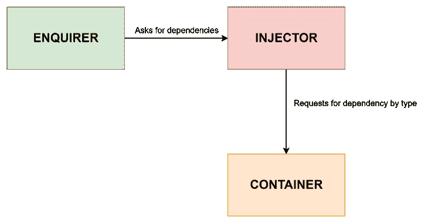
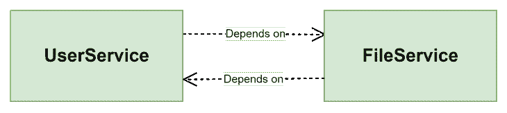
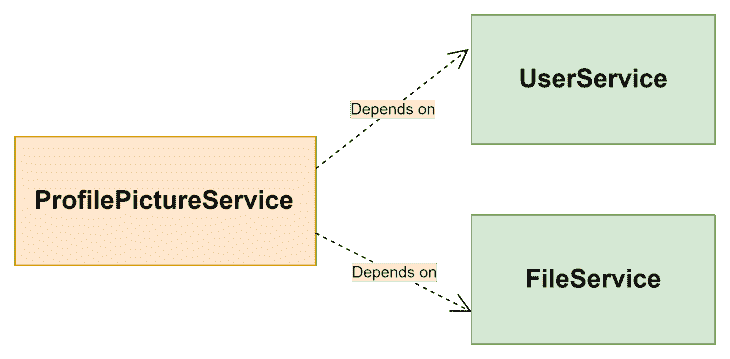

# 如何避免 NestJS 中的循环依赖

> 原文：<https://blog.logrocket.com/avoid-circular-dependencies-nestjs/>

## 介绍

NestJS 的优点之一是它允许我们在应用程序中分离关注点。NestJS 体系结构倾向于将逻辑层创建为可由访问层(即控制器)使用的依赖项(即服务)。

尽管 NestJS 有一个内置的依赖注入系统，它负责解决我们代码不同部分所需的依赖，但是在处理依赖时仍然必须小心。在这方面遇到的一个常见问题是循环依赖。如果存在未解决的循环依赖，NestJS 代码甚至无法编译。

在本文中，我们将学习 NestJS 中的循环依赖，它们为什么会出现，以及我们如何避免它们。我将不仅仅展示 NestJS 提供的解决方法，而是通过重新思考我们如何耦合依赖关系来引导我们如何避免循环依赖，这将有助于我们后端代码中更好的架构。

避免循环依赖还可以确保我们的代码更容易理解和修改，因为循环依赖意味着我们的代码中存在紧密耦合。

### 内容

## 什么是循环依赖？

在编程中，当两个或多个模块(或类)直接或间接相互依赖时，就会出现循环依赖。比方说`A`、`B`、`C`和`D`是四个模块，一个直接循环依赖的例子是`A` → `B` → `A`。模块`A`依赖于模块`B`，模块`B`又依赖于`A`。

间接循环依赖的一个例子是`A` → `B` → `C` → `A`。模块`A`依赖于`B`，而`B`并不直接依赖于`A`，而是稍后在其依赖链中引用`A`。

注意，循环依赖的概念并不是 NestJS 所独有的，事实上，这里作为例子使用的模块甚至不一定是 NestJS 模块。它们只是代表了编程中模块的一般思想，指的是我们如何组织代码。

在我们讨论 NestJS 中的循环依赖(以及如何避免它们)之前，让我们先讨论一下 NestJS 依赖注入系统是如何工作的。

了解 NestJS 如何处理依赖注入将使我们更容易理解循环引用是如何在我们的依赖中发生的，以及为什么 NestJS compile 在循环引用被解决之前不能编译。

## NestJS 依赖注入系统

在 NestJS 中，通过依赖注入(DI ),我们可以将依赖的实例化委托给运行时系统，而不是在我们自己的代码中强制完成。

例如，假设我们有一个如下定义的`UserService`:

```
import { Injectable } from '@nestjs/common';

@Injectable()
export class UserService {
  constructor() {}
  public async getUserById(userId: string) {
    ...
  }
  ...
}

```

现在，假设我们在`UserController`类中使用如下的`UserService`:

```
import { Controller } from '@nestjs/common';
import { UserService } from './user.service';

@Controller('user')
export class UserController {
  constructor(private readonly userService: UserService) {}

  public async getUserById(userId: string) {
    return await this.userService.getUserById(userId);
  }
}

```

在这种情况下，`UserController`是一个询问者，请求将`UserService`作为其依赖项之一。NestJS 依赖注入器将在一个容器中检查所请求的依赖，它在容器中存储对 NestJS 项目中定义的提供者的引用。

在`UserService`定义中使用的`@Injectable()`装饰器将该类标记为一个提供者，它应该可以被 NestJS 依赖注入系统注入，也就是说，它应该由容器管理。当编译器编译 TypeScript 代码时，这个装饰器发出 NestJS 用来管理依赖注入的元数据。



在 NestJS 中，每个模块都有自己的可以访问容器的注入器。当声明一个模块时，必须指定该模块应该可用的提供程序，除非该提供程序是全局提供程序。

例如，`UserModule`定义如下:

```
import { Module } from '@nestjs/common';
import { UserService } from './user.service';
import { UserController } from './user.controller';

@Module({
  providers: [UserService],
  controllers: [UserController],
  exports: [UserService],
})
export class UserModule {}

```

在正常的执行模式中，当询问者询问依赖关系时，注入器检查容器，以查看该依赖关系的对象之前是否已经被缓存。如果是，则将该对象返回给查询者。否则，NestJS 实例化一个新的依赖对象，缓存它，然后将对象返回给查询者。

声明`providers: [UserService]`实际上是以下内容的简写:

```
providers: [
    {
      provide: UserService,
      useClass: UserService,
    },
]

```

`provide`的值是一个注入令牌，用于在被查询时识别提供者。

## 循环依赖问题是如何产生的

NestJS DI 系统严重依赖于 TypeScript 编译器发出的元数据，因此当两个模块或两个提供者之间存在循环引用时，如果没有进一步的帮助，编译器将无法编译它们中的任何一个。

例如，假设我们有一个用于管理上传到应用程序的文件的`FileService`，定义如下:

```
import { Injectable } from '@nestjs/common';
import { UserService } from '../user/user.service';
import { File } from './interfaces/file.interface';

@Injectable()
export class FileService {
  constructor(private readonly userService: UserService) {}
  public getById(pictureId: string): File {
    // not real implementation
    return {
      id: pictureId,
      url: 'https://www.gravatar.com/avatar/205e460b479e2e5b48aec07710c08d50',
    };
  }

  public async getUserProfilePicture(userId: string): Promise<File> {
    const user = await this.userService.getUserById(userId);
    return this.getById(user.profilePictureId);
  }
}

```

该服务有一个`getUserProfilePicture`方法，获取作为用户资料图片附加的图像文件。`FileService`需要作为依赖项注入的`UserService`才能获取用户。

`UserService`也更新如下:

```
import { Injectable } from '@nestjs/common';
import { FileService } from '../file-service/file.service';

@Injectable()
export class UserService {
  constructor(private readonly fileService: FileService) {}
  public async getUserById(userId: string) {
    // actual work of retrieving user
    return {
      id: userId,
      name: 'Sam',
      profilePictureId: 'kdkf43',
    };
  }

  public async addUserProfilePicture(userId: string, pictureId: string) {
    const picture = await this.fileService.getById(pictureId);
    // update user with the picture url
    return { id: userId, name: 'Sam', profilePictureId: picture.id };
  }
}

```

在这种情况下，我们有一个循环依赖，因为`UserService`和`FileService`都相互依赖(`UserService` → `FileService` → `UserService`)。



有了循环引用，代码将无法编译。

## 通过重构避免循环依赖

NestJS 文档建议尽可能避免循环依赖。

循环依赖在相关的类或模块之间产生了紧密的耦合，这意味着每当类或模块中的一个发生变化时，都必须重新编译。正如我在[上一篇文章](https://blog.logrocket.com/understanding-dependency-inversion-principle-typescript/)中提到的，紧耦合违背了坚实的原则，我们应该努力避免它。

在这个例子中，我们可以很容易地去除循环依赖。我们拥有的循环引用也可以表示为:

```
UserService → FileService
and 
FileService → UserService

```

为了打破这种循环，我们可以将两个服务的共同特性提取到一个依赖于这两个服务的新服务中。在这种情况下，我们可以有一个同时依赖于`UserService`和`FileService`的`ProfilePictureService`。

`ProfilePictureService`将有自己的模块，定义如下:

```
import { Module } from '@nestjs/common';
import { FileModule } from '../file-service/file.module';
import { UserModule } from '../user/user.module';
import { ProfilePictureService } from './profile-picture.service';
@Module({
  imports: [FileModule, UserModule],
  providers: [ProfilePictureService],
})
export class ProfilePictureModule {}

```

注意，这个模块同时导入了`FileModule`和`UserModule`。两个导入的模块都必须导出我们想要在`ProfilePictureService`使用的服务。

`ProfilePictureService`的定义如下:

```
import { Injectable } from '@nestjs/common';
import { File } from '../file-service/interfaces/file.interface';
import { FileService } from '../file-service/file.service';
import { UserService } from '../user/user.service';

@Injectable()
export class ProfilePictureService {
  constructor(
    private readonly fileService: FileService,
    private readonly userService: UserService,
  ) {}

  public async addUserProfilePicture(userId: string, pictureId: string) {
    const picture = await this.fileService.getById(pictureId);
    // update user with the picture url
    return { id: userId, name: 'Sam', profilePictureId: picture.id };
  }

  public async getUserProfilePicture(userId: string): Promise<File> {
    const user = await this.userService.getUserById(userId);
    return this.fileService.getById(user.profilePictureId);
  }
}

```

`ProfilePictureService`需要`UserService`和`FileService`作为它的依赖项，并且包含执行我们之前在`UserService`和`FileService`中执行的动作的方法。

`UserService`不再需要依赖于`FileService`，正如你在这里看到的:

```
import { Injectable } from '@nestjs/common';

@Injectable()
export class UserService {
  public async getUserById(userId: string) {
    // actual work of retrieving user
    return {
      id: userId,
      name: 'Sam',
      profilePictureId: 'kdkf43',
    };
  }
}

```

同样，`FileService`也不需要知道`UserService`的任何事情:

```
import { Injectable } from '@nestjs/common';
import { File } from './interfaces/file.interface';

@Injectable()
export class FileService {
  public getById(pictureId: string): File {
    return {
      id: pictureId,
      url: 'https://www.gravatar.com/avatar/205e460b479e2e5b48aec07710c08d50',
    };
  }
}

```

这三个服务之间的关系现在可以表示如下:



从图中可以看出，服务之间没有循环引用。

虽然这个重构的例子是关于提供者之间的循环依赖，但是我们可以使用相同的思想来避免模块之间的循环依赖。

## 使用前向引用解决循环依赖关系

理想情况下，应该避免循环依赖，但是在不可能的情况下，Nest 提供了一种解决方法。

前向引用允许 Nest 引用尚未使用`forwardRef()`实用函数定义的类。我们必须在循环引用的两边都使用这个函数。

例如，我们可以将`UserService`修改如下:

```
import { forwardRef, Inject, Injectable } from '@nestjs/common';
import { FileService } from '../file-service/file.service';

@Injectable()
export class UserService {
  constructor(
    @Inject(forwardRef(() => FileService))
    private readonly fileService: FileService,
  ) {}

  public async getUserById(userId: string) {
    ...
  }
  public async addFile(userId: string, pictureId: string) {
    const picture = await this.fileService.getById(pictureId);
    // update user with the picture url
    return { id: userId, name: 'Sam', profilePictureUrl: picture.url };
  }
}

```

然后`FileService`像这样:

```
import { forwardRef, Inject, Injectable } from '@nestjs/common';
import { UserService } from '../user/user.service';
import { File } from './interfaces/file.interface';

@Injectable()
export class FileService {
  constructor(
    @Inject(forwardRef(() => UserService))
    private readonly userService: UserService,
  ) {}

  public getById(pictureId: string): File {
    ...
  }

  public async getUserProfilePicture(userId: string): Promise<File> {
    const user = await this.userService.getUserById(userId);
    return this.getById(user.id);
  }
}

```

有了这个前向引用，代码将编译无误。

### 模块的前向引用

`forwardRef()`实用函数也可以用来解决模块之间的循环依赖，但是它必须在模块关联的两端使用。例如，可以在循环模块引用的一侧执行以下操作:

```
@Module({
  imports: [forwardRef(() => SecondCircularModule)],
})
export class FirstCircularModule {}

```

## 结论

在本文中，我们学习了什么是循环依赖，依赖注入在 NestJS 中是如何工作的，以及循环依赖的问题是如何产生的。

我们还了解了如何在 NestJS 中避免循环依赖，以及为什么我们应该总是试图避免它。希望您现在知道如何解决这个问题，以防使用前向引用无法避免。

本文的代码示例托管在 GitHub 上的[here](https://github.com/Olusamimaths/circular-dependency-article-project)；存储库中有三个名为`circular`、`fix/forward-referencing`和`fix/refactoring`的分支。您可以使用分支导航到项目的不同阶段。

## 使用 [LogRocket](https://lp.logrocket.com/blg/signup) 消除传统错误报告的干扰

[](https://lp.logrocket.com/blg/signup)

[LogRocket](https://lp.logrocket.com/blg/signup) 是一个数字体验分析解决方案，它可以保护您免受数百个假阳性错误警报的影响，只针对几个真正重要的项目。LogRocket 会告诉您应用程序中实际影响用户的最具影响力的 bug 和 UX 问题。

然后，使用具有深层技术遥测的会话重放来确切地查看用户看到了什么以及是什么导致了问题，就像你在他们身后看一样。

LogRocket 自动聚合客户端错误、JS 异常、前端性能指标和用户交互。然后 LogRocket 使用机器学习来告诉你哪些问题正在影响大多数用户，并提供你需要修复它的上下文。

关注重要的 bug—[今天就试试 LogRocket】。](https://lp.logrocket.com/blg/signup-issue-free)