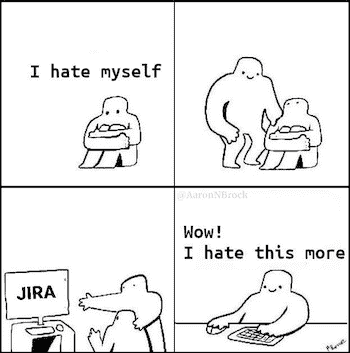
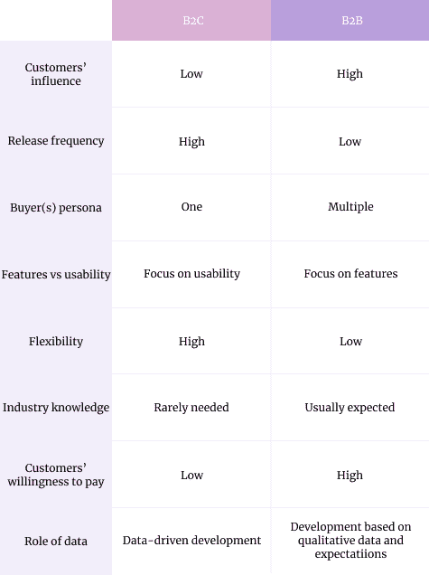

# B2B 与 B2C 产品管理:主要差异和例子

> 原文：<https://blog.logrocket.com/product-management/b2b-vs-b2c-product-management/>

产品管理是一门广泛的学科。它可以包括一切，从战略工作，到发现，到执行，到营销，甚至更多。

考虑到这个角色的广度，不可能面面俱到。可能性太多了。这就是为什么我们有各种专业化，比如核心[产品经理](https://blog.logrocket.com/product-management/product-manager-vs-product-owner/)、[成长型产品经理](https://blog.logrocket.com/product-management/product-marketing-manager-job-description-role-skills/)，平台 pm 等。

即使在这些专业化的层次中，管理 B2C 和 B2B 产品的产品经理之间也有区别。

* * *

## **目录**

* * *

## B2B 与 B2C 产品管理

为大众客户或企业服务在产品制造方式和产品经理的[角色两方面都有很大的不同。](https://blog.logrocket.com/product-management/what-does-a-product-manager-do-role-responsibilities/)

一方面，产品管理的基本原则保持不变:都是通过解决用户问题来实现业务成果。然而，每天如何做到这一点的细节却大相径庭。

最大的区别在于:

让我们详细探讨一下每个领域。

## 顾客的影响

B2B 和 B2C 细分市场最显著的区别之一是单个客户可能具有的影响力。

B2B 产品经常会遇到这样的情况，比如一个大客户需要一个特殊的功能。事实是，如果客户占你收入的 30 %,你很难拒绝这样的请求——如果他们愿意赞助就更难了。

然而，在 B2C 产品管理的情况下，单个客户通常不会带来超过 0.1%的总收入。我还没有听说过 B2C 产品为单个客户做出调整。

## 发布频率

大多数消费产品比商业产品有更高的发布节奏。

对于 B2C 产品，市场通常竞争非常激烈；速度就是一切。此外，用户很快就会对新产品感到厌倦，因此持续不断的新鲜内容至关重要。

虽然频繁的更新有时可能很烦人，但最终用户往往不会注意到它们。

对于 B2B 客户来说，这是一个完全不同的故事。改变事物的工作方式通常会导致暂时的生产力下降，因为用户必须更新产品并习惯新事物。生产率的频繁下降可能会对公司的底线产生重大影响。

更重要的更新通常要求公司更新他们的产品手册、培训计划等。这比按下“立即更新”按钮要麻烦得多。每周获得更新是企业客户的梦想。

发布频率的差异要求 B2B 产品的发布计划更加细致周到。

## 购买人员

B2C 和 B2B 客户的购买过程有很大的不同。

对于消费品来说，很简单:通常情况下，你的用户就是你的买家。在某些情况下，你可能有一个单独的买家和用户(例如，一个父母是买家，一个孩子是用户)，但这不应该使事情变得太复杂。

对于企业客户来说，情况完全不同。用户很少是买家，在购买过程中有多个决策者。您经常需要满足各种具有竞争优先权的人，例如:

*   首席技术官，他需要考虑技术要求
*   想要低价的贸易部
*   法律部门，可能有特定的安全或 GDPR 要求
*   想要轻松入职和培训的团队领导

迎合多个买家角色的需求使得 B2B 产品开发和[优先级排序](https://blog.logrocket.com/product-management/rice-framework-prioritization-made-simple/)变得更加复杂。

## 功能与可用性

虽然 B2C 用户通常需要完美、流畅的体验，但 B2B 用户只是希望尽可能多的完成他们的工作。

一个理想的 B2C 产品无缝融入用户生活。坚持的产品是那些融入我们日常生活方式的产品。如果使用一种产品会产生额外的摩擦，这通常会令人沮丧，并可能影响消费者放弃该产品或转向其他产品。

这样，B2B 客户更关心有助于完成工作的[特性](https://blog.logrocket.com/product-management/what-are-product-features-define-examples/)。即使一个产品的 UX 低于标准，只要它有助于完成需要做的事情，它仍然是一个可行的解决方案。

此外，B2B 用户经常每天使用该产品数小时，不管他们是否愿意。随着时间的推移，他们更可能习惯于可用性问题，甚至完全不再注意它们。

Jira is a perfect example. There is enormous hate for this tool in the industry. Although it has some serious usability issues, there’s barely any competition for it — it just has hundreds of features that are applicable in a wide range of scenarios.

如果你需要在吉拉做些什么，你有 99%的机会做到。巨大的可能性弥补了糟糕的用户体验。

我无法想象没有吉拉的生活，尽管它每五分钟就慢一分钟。谈谈斯德哥尔摩综合症…

对于 B2C 产品，整体 UX 和可用性是必须的。对于 B2B 产品，功能和帮助完成多项工作更重要。

## 可预测性

与 B2B 产品相比，B2C 产品允许更多的灵活性，或者如一些人所说，灵活性。

一个原因是 B2B 产品需要可预测性。企业通常需要提前知道产品中会实现什么变化，因为他们自己的计划可能依赖于它。

* * *

订阅我们的产品管理简讯
将此类文章发送到您的收件箱

* * *

出于这个原因，B2B 产品经理经常为所有当前和潜在客户维护一个外部的[路线图](https://blog.logrocket.com/product-management/agile-roadmaps-examples-how-to-create/)。这迫使他们提前几个月做好计划，为快速转变留出一点空间。企业客户不喜欢惊喜。

在 B2C，你有更多的回旋余地。你通常没有公开的路线图。尽管您的客户可能有一些期望，但这些期望很少会改变游戏规则。

我见过 B2C 产品一夜之间贬低功能的。他们的 B2B 对手必须提前几个月宣布，让他们的客户做好准备。

## 行业知识

与 B2C 产品相比，B2B 产品更需要行业专业知识。

B2C 产品往往有更广泛、更普遍的价值主张。即使产品定位于小众角色，也更容易引起终端用户的共鸣或尝试穿他们的鞋。

B2B 产品通常是专门的解决方案。比方说，如果你正在为企业会计构建一个工具，如果你不知道什么是资产负债表，就很难理解他们。如果你不知道任何会计基础知识，你甚至不能自己玩这个产品。

鉴于大多数 B2B 产品是多么的小众，行业专业知识通常是非常受欢迎的，基本的行业知识是必备的。B2C 产品更容易被通才接触到；没有以前的经验更容易理解产品。

## 顾客的支付意愿

企业客户习惯于为服务付费。大众消费者喜欢免费赠品。这种差异极大地影响了整个[优先排序和产品创造流程](https://blog.logrocket.com/product-management/product-feature-prioritization-frameworks-strategies/)。

当建立一个 B2B 产品，这是所有关于投资回报。价格是一个次要因素，只要你能证明和推销该产品将产生总体正投资回报。

例如，如果一个产品可以帮助我每月节省相当于 50K 美元的时间，那么即使每月订阅高达 40K 美元的费用似乎也是合理的——尤其是在没有更便宜的替代方案的情况下。

对于 B2C 客户来说，就没那么科学了。消费者倾向于在情感基础上购买，而不是基于冷酷的成本效益计算。

此外，鉴于我们已经习惯了免费产品，价格标签上每增加一美元都会显著增加摩擦，即使这是合理的。这不是推断给定的功能提供了多少价值，而是最终用户从这些功能中感知了多少价值。

品牌和信息也发挥着重要作用。与其说是科学，不如说是艺术。

简而言之，B2B 产品更多的是成本和收益之间的冷计算。对于 B2C 产品，更多的是关于产品的整体品牌、感觉和感知价值。

## 数据的作用

作为一个 B2C 产品经理的最好的部分之一是你得到的数据点的数量。

有了成千上万甚至数十亿的用户，你就有了一个可以分析和洞察的数据海洋。你甚至有机会吸引足够多的用户在一天内运行几十个 A/B 测试。的确如此[数据驱动发展](https://blog.logrocket.com/product-management/what-metrics-kpis-product-managers-track/)。

不要误会我；用 B2B 还是可以数据驱动的。只是更有挑战性，效率更低。你得到的数据通常不太准确，运行 A/B 测试的空间也较小。不仅你可能没有足够的用户，而且对长期可预测性的需求降低了分割测试的可用性。

相反，B2C [产品的路线图](https://blog.logrocket.com/product-management/how-to-build-product-roadmap-overview-examples/)通常严重依赖定量数据，而 B2B 产品往往更依赖定性数据和客户的期望。

# 总结和关键要点

B2C 和 B2B 产品经理之间的差异比你想象的更加多样和显著。总结一下我们在这篇文章中强调的区别:

B2C 产品管理更多的是快速和肮脏的试验和旋转。产品经理往往是多面手，产品管理流程更加灵活，数据驱动。移情、数据和用户体验在这里是必不可少的。

B2B 产品管理更像是一盘战略棋。产品经理通常是主题专家，更专注于管理买家和关键人物。这都是关于投资回报率的计算和适当的预期管理。

*精选图片来源:[icon scout](https://iconscout.com/icon/product-2676449)*

## [LogRocket](https://lp.logrocket.com/blg/pm-signup) 产生产品见解，从而导致有意义的行动

[LogRocket](https://lp.logrocket.com/blg/pm-signup) 确定用户体验中的摩擦点，以便您能够做出明智的产品和设计变更决策，从而实现您的目标。

使用 LogRocket，您可以[了解影响您产品的问题的范围](https://logrocket.com/for/analytics-for-web-applications)，并优先考虑需要做出的更改。LogRocket 简化了工作流程，允许工程和设计团队使用与您相同的[数据进行工作](https://logrocket.com/for/web-analytics-solutions)，消除了对需要做什么的困惑。

让你的团队步调一致——今天就试试 [LogRocket](https://lp.logrocket.com/blg/pm-signup) 。

[Bart Krawczyk Follow](https://blog.logrocket.com/author/bartkrawczyk/) Learning how to build beautiful products without burning myself out (again). Writing about what I discovered along the way.