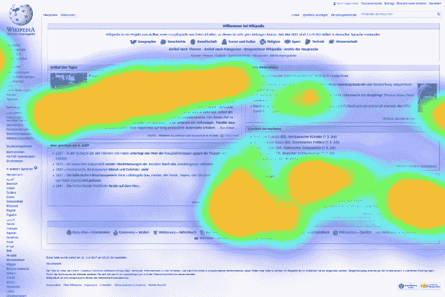

# 平衡定量和定性的用户参与度

> 原文：<https://blog.logrocket.com/balancing-quantitative-and-qualitative-user-engagement/>

因为只要有事情发生，某个地方的某个人就会想要量化它们——并且可以依靠站在附近的某个人来分享他们的观点，即第一个人是在浪费他们的时间。这是生活的现实。

定性和定量分析之间的矛盾由来已久。从旅游业到 T2 的战区，各行各业都有来自这两个阵营的警示故事。在数字时代，我们都会从他们的教训中受益。

随着客户经理和前端工程师被前所未有的海量数据淹没，遵循数字的诱惑比以往任何时候都更强烈。这需要高度警惕，但如果我们能够退后一步，利用这种力量为自己的目的服务，改进的潜力是不可思议的。

U.S. Secretary of Defense Robert McNamara famously went all in on a quantitative approach to the Vietnam War. It went badly.

在网上，没有比用户参与度更受人尊敬的指标了。它是人们如何与你的网站、产品或服务互动的黄金门票。衡量标准有多种形式——流量、转化率、页面停留时间、下载量、分享量、电子邮件注册量等等。

在某种程度上，度量标准是由您所做的事情决定的。例如，Spotify 等音乐流媒体应用的用户参与度与联盟营销网站的用户参与度会非常不同，但有很多重叠之处。

充分利用无数的数据点是一种平衡行为。在开发人员拥有比以往任何时候都多的工具的时代，知道什么时候不使用它们以及应该问什么问题是同样重要的。通常情况下，有针对性的使用——结合经验和专业知识——更有价值。

### TL；速度三角形定位法(dead reckoning)

*   原始数据看似不可靠。将度量标准放在适当的环境中，永远不要让它们左右大局。
*   用户参与度数据的好坏取决于对它的审查。
*   每当有疑问时，记住古德哈特定律:当一个衡量标准成为目标时，它就不再是一个好的衡量标准。

## 大数据时代

自本世纪初以来，数据处理能力呈指数级增长。今天，各种复杂的分析工具都可以得到，而且经常是免费的。总的来说，这是一件好事。开发人员可以更容易地发现和解决问题，编辑人员可以看到读者点击了哪些内容，KPI 爱好者可以将更多的数字放入更多的电子表格中。每个人都很开心。

只是事情没那么简单，对吧？随着大数据地位的提高，对其潜在扼杀良好决策的担忧也在增加。正如肯尼斯·库基尔和维克托·迈尔·舍恩伯格在 2013 年为*麻省理工科技评论*撰写的文章《[数据独裁](https://www.technologyreview.com/s/514591/the-dictatorship-of-data/)》中总结的那样，“威胁在于我们会让自己盲目地被我们的分析结果所束缚，即使我们有合理的理由怀疑有些事情出了问题。”

这是我们大多数人都熟悉的东西。我曾经和一些才华横溢的专业人士一起工作过，他们深深地陷入数字之中，以至于不再把用户看作人。相反，它们变成了一种模糊的数学挑战。

你可以做得比玛丽莎·梅耶尔树立的榜样更好，她在谷歌工作期间曾下令对 41 种蓝色进行测试，以找出用户更喜欢哪一种。诚然，谷歌蓝是一种非常漂亮的蓝色，但总有一天你会浪费自己和其他人的时间。

Painstakingly optimized blue is the best blue, I guess. (#4285f4, if you were wondering.)

这一直是一种容易陷入的心态，用户参与度指标的可及性将这种风险放大了数倍。(讽刺的是)大数据的潜力是不可估量的，但这并不意味着它值得无条件的尊重。正如杰里·穆勒在他 2018 年的书 *[中总结的那样，度量的暴政](https://press.princeton.edu/books/hardcover/9780691174952/the-tyranny-of-metrics)* ，“不是所有重要的东西都是可测量的，许多可测量的东西都是不重要的。”

## 做摇尾巴的狗

信不信由你，我不是来抨击量化数据的。这是一个无价的资源，在用户参与领域，可用工具的广度和质量是无与伦比的。只是不要让他们成为摇尾狗。下面，我们将分解两个常见的用户参与度数据的例子，以及它们所要求的谨慎。

### 交通

任何在网络上工作的人都知道这个。流量才是王道。页面浏览量和独特的用户是销售、订阅、广告商、转化和其他一切美好事物的关键。从表面上看，这似乎是显而易见的。交通拥挤是好事，对吗？每个月都有更多的流量是好事，对吗？

嗯，看情况。我不认为任何人会希望看到他们的流量下降，但将其作为一个纯粹的量化指标会导致奇怪的不人道的选择。例如，你知道那些微小的文章莫名其妙地散布在多个页面上吗？它们是定量用户参与决定行为的教科书范例。这种做法可能会在短期内带来更多的页面浏览量，但这对 UX、对作家、甚至最终对广告商都是不利的。

这种特殊的不平衡并不新鲜。只要出版物出售广告空间，它们就会拼命增加发行量。毕竟，更多的读者意味着你可以收取更多的费用。《华尔街日报欧洲版》在 2009 年至 2011 年间的情况就是如此，当 41%的发行量是虚假的时候，高发行量还是一件好事吗？大概不会。为流量而流量会导致内容单薄，误导 SEO，以及陈腐的开发。

那么什么才是正确的平衡呢？通常，这可以简单到交叉引用数据点，并将每个数据点放在适当的上下文中。如果流量暴涨，但回头率骤降，也许事情并不像你想的那么美好。除此之外，你必须愿意完全脱离数据，问一些无法衡量的问题。你的品牌周围有信任你的社区吗？什么外部因素可能会驱使人们向你靠拢？

增加页面浏览量和独立用户是值得追求的目标。记住，他们不是数字，他们是人。

### 热图

视觉分析是一个完全不同的游戏。像热图这样的工具有更自然的定性倾向，因为它们允许你观察人们的行为。他们可以消除来自原始数据的猜测。然而，与任何分析工具一样，它们并不是最重要的。为了充分利用它们，你必须警惕它们的局限性。

就像调查一样，低样本量通常会使结果令人生疑。在你了解结果的本质之前，要知道它们来自哪里。它们是 200 节还是 20 万节的结果？他们在什么设备上？他们从哪里来的？来阅读你的博客的人可能会有与热衷于演示你的软件的人不同的浏览行为。

Eye tracking is another measurement that benefits from wider knowledge. People may be drawn to the top left of this page because it’s super interesting, but more likely they’re just following the Gutenberg Principle.

眼球追踪是另一种受益于更广泛知识的测量方法。人们可能会被这一页的左上角吸引，因为它非常有趣，但更有可能的是，他们只是在遵循[古腾堡原理](http://people.sunyit.edu/~lepres/thesis/principles/119_pdfsam_POD.pdf)。

就热图本身而言，这又是一个稍微深入挖掘的案例。大量的点击可能意味着人们想要使用你的产品，也可能意味着你的网站不像你想象的那样容易浏览。你的 CTA 正经历一段艰难时期，但这是他们的位置问题还是他们前面的文字问题？好问题有产生好答案的诀窍。

还要明白，并不是所有参与其中的人都必须朝着同一个方向努力。销售经理和作家可以看到完全相同的热图，却得出截然不同的结论。这没有恶意，这只是人们在做不同事情的事实。为了最大限度地利用可视化分析，不同的团队需要相互沟通，并就优先事项达成一致。如果他们不这样做，那么热图就有可能成为色彩缤纷的罗夏测验。

同样，根据你的目标，这些变量可能没那么重要。小故障就是小故障，如果你只需要重放一次就能找到它，那就更好了。这一切都是为了让数据为您服务，而不是相反。杰里·穆勒写道:

> “我不明白有能力的专家怎么会忽视指标。问题是他们是否有能力评估指标的重要性，并认识到不可测因素的作用。”

## 永恒的警惕

有了这些以及其他用户参与度数据，就没有什么神奇的公式可以让平衡变得正确。和其他事情一样，它需要一种心态。有时候，使用风格元素会比使用任何电子表格更好。

用户参与度指标是非常强大的工具，但我们仍然是工匠。如果有疑问，可以在古德哈特定律中找到一个好的经验法则:当一个度量成为目标时，它就不再是一个好的度量。紧张永远不会消失，所以我们的警惕也不应该消失。

提出问题，合并数据点，忽略数据点，跳出可接受的参数，看看会发生什么。与其他部门沟通，找到共同点，明确自己的不同之处。主数据；不要让它控制你。

## 进一步阅读

使用 [LogRocket](https://lp.logrocket.com/blg/signup) 消除传统错误报告的干扰

## [LogRocket](https://lp.logrocket.com/blg/signup) 是一个数字体验分析解决方案，它可以保护您免受数百个假阳性错误警报的影响，只针对几个真正重要的项目。LogRocket 会告诉您应用程序中实际影响用户的最具影响力的 bug 和 UX 问题。

然后，使用具有深层技术遥测的会话重放来确切地查看用户看到了什么以及是什么导致了问题，就像你在他们身后看一样。

LogRocket 自动聚合客户端错误、JS 异常、前端性能指标和用户交互。然后 LogRocket 使用机器学习来告诉你哪些问题正在影响大多数用户，并提供你需要修复它的上下文。

关注重要的 bug—[今天就试试 LogRocket】。](https://lp.logrocket.com/blg/signup-issue-free)

Focus on the bugs that matter — [try LogRocket today](https://lp.logrocket.com/blg/signup-issue-free).