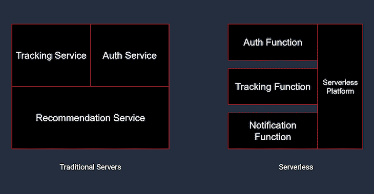
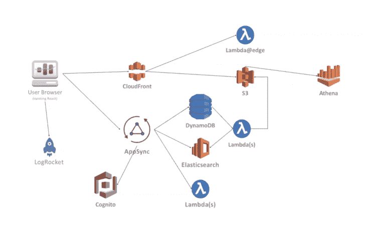

# 无服务器日志博客的优点和缺点

> 原文：<https://blog.logrocket.com/benefits-trade-offs-serverless/>

这些年来，我们构建和发布网络应用的方式逐渐发生了转变。我们已经从运行在服务器上的单一应用发展到运行在短暂实例上的灵活单元。

你只需要看看术语“aws 无服务器”的[趋势数据，就能了解无服务器在这些年有多受欢迎。那么为什么会有这种趋势呢？术语无服务器是什么意思？怎么会没有服务器呢？](https://trends.google.com/trends/explore?date=all&q=aws%20serverless)

无服务器意味着你可以将代码发送给你的用户，而不必担心运行代码所需的底层架构。仍然有一个服务器在某个地方运行您的代码，但是您不必担心设置或管理它。

> 简而言之:“让别人成为你的开发团队。”

在我们进一步讨论之前，我想直截了当地说，我是无服务器的拥护者。[如果用例是正确的，](https://cloud.google.com/functions/docs/concepts/overview#use_cases)除了一系列其他好处之外，它还可以大幅降低托管成本。

但是有一个警告——注意我使用了“如果用例是正确的”这个短语这是因为不是每个应用都应该建立在无服务器架构上。你可能最终会为主机支付更多的费用，但最终还是会给你的用户带来糟糕的体验。

这就是为什么你必须根据具体情况来权衡无服务器的利弊。在本文中，我们将看看如何确定无服务器是否适合您的项目。

首先，在我们继续讨论服务器**减去**之前，让我们看看什么是服务器。

> “像专业人士一样学习规则，这样你就可以像艺术家一样打破规则。”巴勃罗·毕加索

## 服务器以及您需要服务器的原因

[在 web 应用的环境中，](https://www.lifewire.com/servers-in-computer-networking-817380)服务器是专用于运行您的代码并向您的用户提供服务的硬件或软件。你需要一个服务器来运行你的 HTML、CSS、JavaScript 以及 Node.js 这样的后台环境，甚至你的数据库也是在服务器上运行的。

你的浏览器发出的所有请求最终都是由某个地方的服务器来处理的，所以你可以看到服务器在软件开发中的重要性。

好吧，那么我们现在使用它们的方式有什么问题呢？好吧，传统的服务器就像一个 24/7 的餐馆:它总是开放的，随时准备服务请求。自从蒂姆·伯纳斯·李在 1989 年发明网络以来，情况一直如此。

但是一直开着的问题是，当无事可做的时候，你会开始浪费资源。如果你的餐馆营业了 10 个小时，但只有 3 个小时满座，你已经浪费了 4 个小时的时间和能源。这样做的时间足够长，成本就会开始累积。它会侵蚀你的收入，并对环境造成不利影响。

让我们来看一个虚构的案例研究，以展示在特定情况下运行传统 web 服务器是多么低效。

## 传统服务器的低效率

Trakkr 是一家年轻的初创公司，试图让包裹跟踪和递送变得简单方便。

它们有一个 API 端点，使您能够通过唯一的跟踪编号来跟踪您的包裹的位置。你输入包裹追踪号码，它就会告诉你包裹的位置。

让我们想象一下，他们在传统服务器上托管这个 API，处理一个跟踪请求大约需要 200 毫秒。我们假设他们平均每天处理 10，000 个请求。

```
10,000 requests per day * 200ms per request
=
2,000,000ms of work done by the server in a day
or
33 minutes of work done by the server in a day
```

将请求数量乘以处理每个请求所需的时间，我们可以看到，他们每天只需要服务器运行 33 分钟。

运行一台服务器一整天的平均成本约为 3 美元。运行同样的服务器 33 分钟大约是 0.07 美元。

按比例增加到一个月，Trakkr 为一台 97%时间空闲的服务器支付了 90 美元，而不是只为他们需要的 33 分钟支付 2 美元。

这让我们想到了无服务器架构的主要卖点:[您只需为您使用的东西付费。](https://aws.amazon.com/lambda/pricing/)

## 无服务器架构的优势

在传统架构中，无论服务器是否被使用，它总是处于开启状态，而无服务器“服务器”则不同，它只在有事情要做的时候才开启。这意味着您只需为给定时间段内使用的时间和资源付费。这是如何工作的？

如果你决定构建一个无服务器的架构，你必须对你的代码结构做一些重大的改变。您的应用程序将由更小的函数组成，每次被调用时都会启动，而不是由一个单独的服务器来处理所有请求。

让我们看一下我们之前关于 Trakkr API 的例子。在传统方法中，API 将被托管在一个单一的、始终在线的服务器上(这是简化的，因为您可以实现负载平衡)，并且服务器将保持在线，等待跟踪请求进行处理。

在无服务器架构中，API 是模块化的。所有的端点都将被分割成位于云上的更小的功能。这些函数可以访问文件系统、数据库、相互通信或使用第三方服务。



Serverless favors modularity.

因此，在这种情况下，Trakkr API 将由托管在服务上的这些功能组成，如 [AWS Lambda](https://aws.amazon.com/lambda/) 或[谷歌云功能。](https://cloud.google.com/functions)每个请求可以通过 API 网关路由到相应的功能。那么当用户请求跟踪包裹时会发生什么呢？

当发出跟踪请求时，API 网关拦截该请求，并调用适当的函数来处理该请求。然后，该函数的一个短暂实例在一个隔离的容器中旋转起来。该函数完成它的工作，像普通的 REST 端点一样将响应返回给用户，然后实例被销毁。

所以，概括一下:

*   无服务器架构要求您将公共端点模块化为功能
*   每个函数都位于云中，每次调用函数时都会创建新的实例*
*   每个功能实例都可以访问文件系统、数据库和资源
*   函数实例在被销毁之前只能运行很短一段时间**

> *在某些情况下，实例被重用以加快加载速度。
> 
> * * AWS Lambda 最多 15 分钟，Google Cloud 功能最多 9 分钟。

无服务器架构的主要优势在于，您只需为您在一段时间内使用的资源付费。如果该功能在一天内运行了 10 分钟，并使用了 128MB 的内存，您将只为这 10 分钟和 128MB 的内存付费。

### 无服务器上的 Trakkr

如果 Trakkr 换成 AWS 这样的无服务器平台会怎样？

我们已经知道他们的跟踪服务每天处理大约 **10，000 个请求**，每个请求需要**200 毫秒**来处理。

我们还知道 Trakkr 支付了 90 美元来托管支持这项服务的服务器。如果换成 AWS 他们会付出多少？

AWS 根据请求的数量和每个请求的持续时间收费，他们的免费层为你提供**100 万个请求**和 **40 万个计算时间**。有了这些免费赠品，Trakkr 的每月托管费用实际上将降至 0 美元。

如果他们出于某种原因决定不选择免费层会怎么样？AWS 对每 100 万个请求收费 0.20 美元，每 100 毫秒计算时间收费 0.0000002083 美元。让我们重温一下之前的计算。

由于 Trakkr 一天只需要 **2，000，000 毫秒的计算时间**，他们将花费:

200 万毫秒**x**0.00000002083 美元**/**100 毫秒 **=每天 0.004166 美元**，或**每月 0.125 美元**

对于同样的服务，服务器成本降低了 860%以上。您可以开始看到，在某些情况下，切换到无服务器架构可以帮助您大幅削减基础架构成本。这只是一个无服务器提供商的例子，但大多数提供类似的节省。

除了转换到无服务器架构可能获得的财务收益之外，以这种方式构建应用还有其他优势:

*   缩放是根据负载自动处理的
*   多语言开发
*   代码优化直接影响运营成本
*   独立扩展应用的不同部分

## 走向无服务器的权衡

您可能已经注意到了无服务器功能运行方式的一些问题。大多数情况下，当被称为冷启动时，它们必须从头开始旋转。这包括一些开销，如设置文件系统、分配内存、获取依赖项等。

在功能准备就绪之前必须完成的这些额外工作会导致启动时间变慢，进而导致糟糕的用户体验。这就是为什么像 AWS 和 Google 云平台这样的提供商有时会重用一个函数的实例来减少延迟(热启动)。

除了启动时间慢之外，无服务器功能还受到其他方面的限制。

因为每个函数都是短暂的，所以一个新函数不能依赖于前一个函数的数据——也就是说，除非数据存储在一个单独的、持久的层中，比如某个地方的 Postgres 数据库。但是这并不理想，因为在与单独的服务器进行通信以检索这些数据时，会产生更多的延迟。

使用无服务器架构还有许多其他缺点。Martin Fowler 在他的博客中对这些缺点进行了更深入的探讨。

如果您有兴趣了解无服务器是否适合您，请继续阅读。

## 您应该转换到无服务器架构吗？

采用架构的决定不应该基于一篇文章。然而，本节的目的是提供一些你在考虑采用无服务器架构时应该问的问题。

这些问题可以指导[您的研究](https://serverless.com/blog/when-why-not-use-serverless/)，使您能够做出明智的决策，为您的特定用例带来最佳结果。

*   您是否已经利用了大部分服务器硬件？
*   您的应用程序需要大量内存缓存吗？
*   频繁的冷启动会如何影响你的 UX？
*   大多数情况下，您需要长生命周期的流程吗？
*   您的流量状况是否发挥了无服务器架构的优势？

也许可以和你的 CTO 或者你的团队领导聊聊，来回答上面的问题(这绝不是一个详尽的列表)。在对话的另一端，您应该更清楚无服务器是否适合某个项目。

我想引用 Martin Fowler 的一句话，这句话总结了 bests 转向无服务器架构的决定:

> “虽然有丰富的扩展和节省的部署工作可以掠夺，但也有调试和监控的恶龙潜伏在下一个角落。”

## 考虑实施无服务器架构？了解无服务器如何帮助您更快地发布前端功能:[点击此处观看网络研讨会](https://www2.logrocket.com/release-features-faster?utm_source=cro-blog&utm_medium=logrocket&utm_campaign=20Q1_WB_Branch&utm_term=serverless_post)

网上技术交流讲座由 Branch insurance 的首席技术官主讲，探讨 Branch 如何创新以推动更高效的前端和更好的用户体验。了解 Branch 如何使用 serverless 将更多时间用于迭代和增强 Branch 平台，以及他们如何获得用户洞察力来比以往更好地完成这项工作。

[](https://www2.logrocket.com/release-features-faster?utm_source=cro-blog&utm_medium=logrocket&utm_campaign=20Q1_WB_Branch&utm_term=serverless_post)

[点击此处观看网络研讨会](https://www2.logrocket.com/release-features-faster?utm_source=cro-blog&utm_medium=logrocket&utm_campaign=20Q1_WB_Branch&utm_term=serverless_post)。