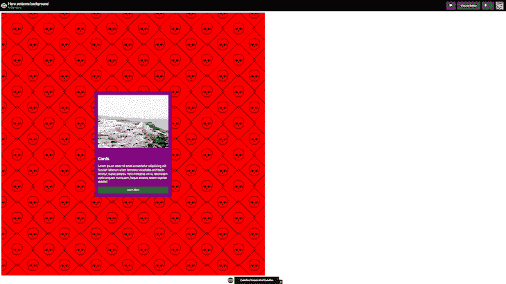
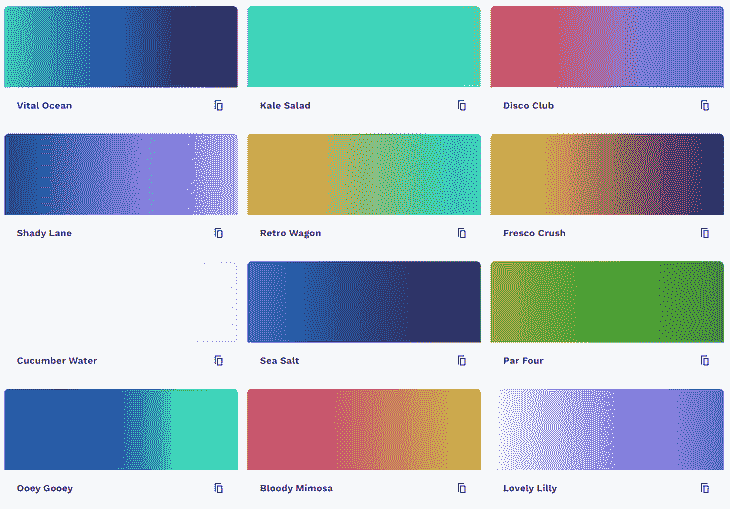
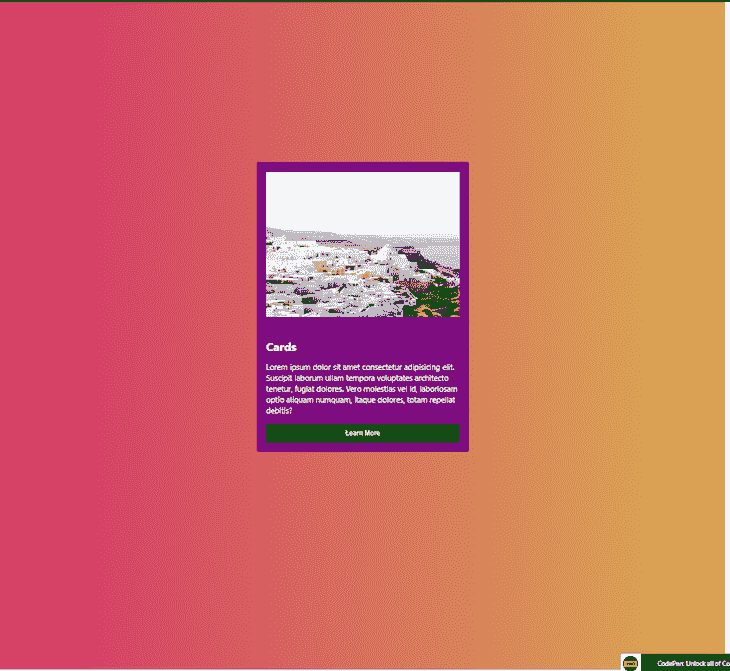
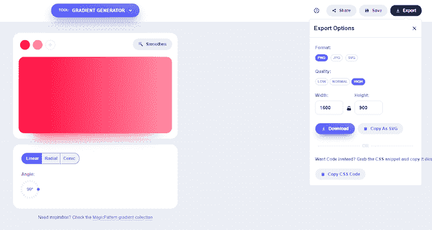
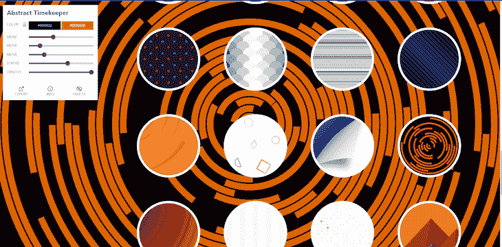
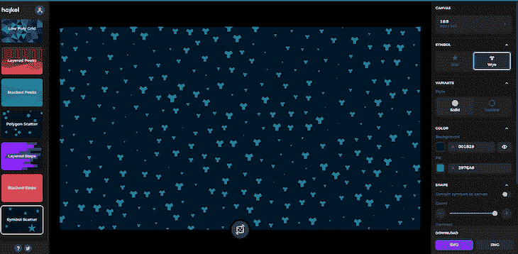
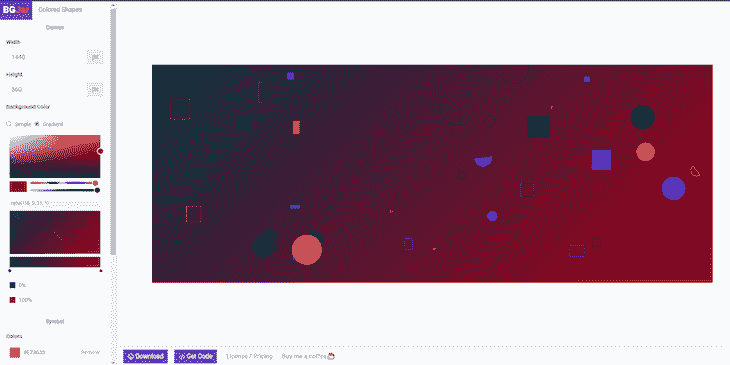

# 6 个最好的 CSS 背景生成器

> 原文：<https://blog.logrocket.com/best-css-background-generators/>

背景对任何网页来说都是必不可少的，它可以决定你网站设计的成败。网上有成千上万的生成器来帮助你创建美观的背景，用于你的网站设计，但有些生成器可能过于复杂，所以最好根据你的首选设计来研究使用哪个生成器。

使用 CSS 为你的网页背景添加图案和效果可以让你的网站更有特色。这篇文章将为你提供一个 CSS 中使用的最好的背景和模式生成器的列表，帮助你在你的网页设计中创造一些令人兴奋的东西。

在本文中，我们将讨论:

别再浪费时间了，让我们开始吧。

## 英雄模式

对于想要快速方便地获得源源不断的美丽图案的设计师来说，Hero Patterns 是一个完美的工具。该发电机有广泛的模式，从自然，动物，更肯定适合任何设计风格。所有这些预制的模板都可以用不同的配色方案和你选择的不透明度来定制。

Hero Patterns 免费且易于使用，是专业设计师或初学者的理想资源。

要使用 Hero 模式，您只需选择一个模板，编辑您认为合适的颜色和不透明度，然后将生成的代码应用到您的 CSS 中。例如，下图显示了如何为站点布局选择两种颜色:

这将生成以下 CSS 代码，如果该代码应用于容器，您将得到:

这是 CodePen 的例子:

参见 [CodePen](https://codepen.io) 上 fimber elems([@ fimbosky 1](https://codepen.io/Fimbosky1))
的笔 [英雄图案背景](https://codepen.io/Fimbosky1/pen/LYmOjBP)。

如您所见，该模式在应用它的整个容器中重复出现。很漂亮，对吧？

## CSS 渐变

CSS Gradient 是一个生成漂亮的线性和径向渐变的优秀网站。CSS 渐变最好的一点是它的用户界面，它很直观，很容易提供你创建下一个华丽背景所需的一切。从渐变预设到线性和径向切换和调整渐变方向，甚至添加更多的爆发点，CSS Gradient 的 UI 都是一流的。

与英雄图案不同，CSS 渐变没有图案化的模板背景。然而，它通过提供几乎无限量的预先设计的渐变样本来弥补这一点，同时还允许您创建自己的渐变。CSS 渐变也可以应用于文本，而不仅仅是背景。

CSS Gradient 还提供了一个专门的博客，解释该工具的每个方面，便于设计师在使用它之前完全理解。

使用 CSS 渐变就像复制站点上的代码并将其添加到您的容器中一样简单。如果你去样本部分，你会看到线性渐变背景如下:

您所要做的就是单击“复制”按钮，然后将样本粘贴到您想要的任何 div 或文本中。

如果我们想使用“血腥含羞草”样本作为我们之前使用的示例的背景，它看起来会像这样:

## 魔术图案

MagicPattern 是目前最好的背景生成器。相比之下，它具有与 CSS 渐变和英雄模式相同的功能，并且还提供了更多的功能，如:

*   斑点生成器
*   涂鸦背景生成器
*   自由噪声发生器
*   社交媒体帖子生成器

MagicPattern generator 是一个很棒的工具，它可以帮助您使用各种不同的参数生成模式。图案是基于大小、方向、颜色和图案类型生成的，因此对于所需的结果存在许多选项。

MagicPattern 也很容易使用-您所要做的就是单击您想要的图案类型，并通过单击其中一个预设按钮或输入特定的 RGB 值来选择颜色渐变。这些图案是即时生成的，因此当它们出现在您的设计中时，您可以看到它们。

使用 MagicPattern，您可以选择以 PNG、SVG 或 JPG 格式的图片下载您的设计，或者复制代码并将其添加到您的 CSS 文件中。如果您选择图片格式，您将能够选择下载图片的大小。如果你问我，我会说这是非常好的东西:

MagicPattern 唯一的缺点是它不是免费的。它有一个提供很大价值的免费选项，但可供选择的模式或选项数量有限。订阅的费用是每月 10 到 20 美元，所以如果你负担得起，这是一个很好的选择。

## SVG 背景

SVG 背景是为你的网页设计添加更多细节和技巧的好方法。SVG 文件格式是基于矢量的，所以即使你放大，你的设计也会很清晰。此外，可以通过更改站点上的值来修改形状，这可以节省时间，并使您的设计过程更加容易。

只需点击几下，这个免费的 SVG 背景 CSS 生成器就可以用你选择的形状生成你的背景。它可以定制一切，从颜色、渐变，在某些情况下，还有图案的位置:

SVG Backgrounds 是一个很好的生成器，但是与列表中的其他三个生成器相比，它提供的价值不够，因为用户可以选择的选项范围有限。然而，它们的背景设计非常独特，是最好的 CSS 生成器之一。

## 海凯

Haikei 是一个免费的在线工具，可以帮助你为你的网站创建简单而美丽的图案。这个过程非常简单——你需要做的就是输入想要的图案，然后选择配色方案。然后，生成器将创建一个已经嵌入了图案的图像:

如果有任何缺陷或瑕疵，可以通过改变图案的密度或添加更多的颜色来修复。这可能不适合那些想要更个性化的东西的人，因为没有办法通过文本或图像来添加个性化。

此外，Haikei 一次只允许你选择两种颜色，所以如果你想要多种不同的颜色，那可能不会很好。

最后，Haikei 是一个背景图像生成器，所以你只能下载生成的图像(它没有代码选项)。

## BGJar

CSS 生成器是一个允许你使用各种输入类型生成背景图像和图案的工具。该工具提供了一系列预先设计的背景，每种背景都有不同的配色方案，并使用该工具的功能来创建您自己独特的背景:

要开始，选择模式的类型，并根据需要输入一些定制。然后生成器会自动生成你的新模式，这样你就可以下载各种格式的新模式(包括 CSS 代码！).您可以添加其他效果，如线性渐变，并编辑它们的范围和角度。

BGJar 的模式范围没有英雄模式大，但是，在我看来，他们更漂亮。但是，这可能只是个人喜好的情况！

## 结论

本文中列出的 CSS 生成器是 CSS 中最好的背景生成器，将满足您所有的背景需求，无论您的品味如何。通过在设计过程中节省大量时间，它们可以帮助你成为更好的开发人员。

我希望这篇文章成为你的 CSS 背景生成器的备忘单。在上面提到的六个生成器中，我个人最喜欢的是魔术模式，原因很明显。它提供了比其他后台生成器更多的价值，可以用来做其他生成器能做的一切。

## 你的前端是否占用了用户的 CPU？

随着 web 前端变得越来越复杂，资源贪婪的特性对浏览器的要求越来越高。如果您对监控和跟踪生产环境中所有用户的客户端 CPU 使用、内存使用等感兴趣，

[try LogRocket](https://lp.logrocket.com/blg/css-signup)

.

[https://logrocket.com/signup/](https://lp.logrocket.com/blg/css-signup)

LogRocket 就像是网络和移动应用的 DVR，记录你的网络应用或网站上发生的一切。您可以汇总和报告关键的前端性能指标，重放用户会话和应用程序状态，记录网络请求，并自动显示所有错误，而不是猜测问题发生的原因。

现代化您调试 web 和移动应用的方式— [开始免费监控](https://lp.logrocket.com/blg/css-signup)。