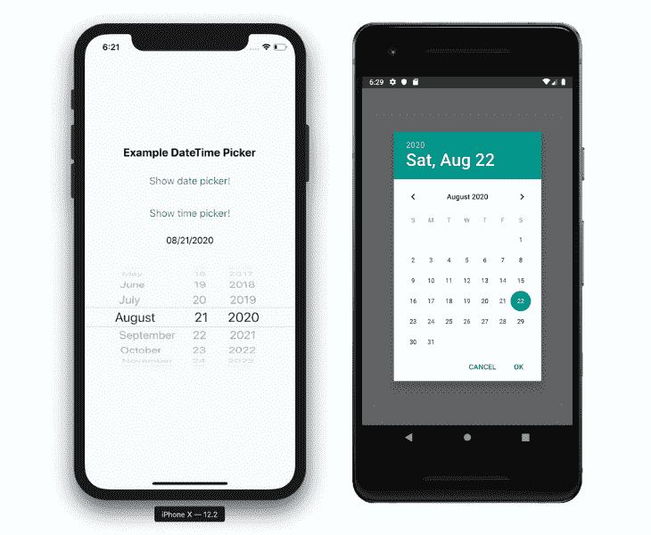
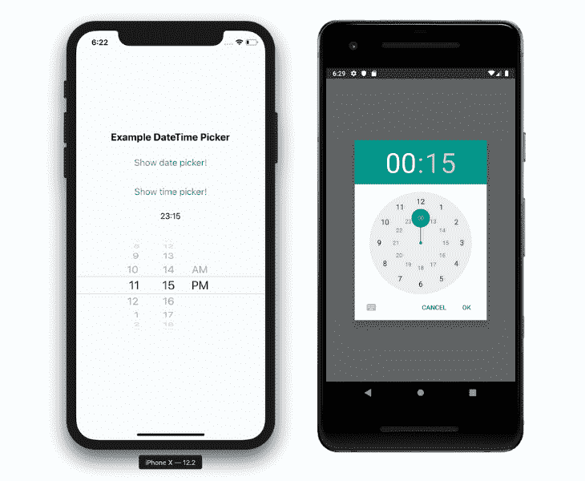
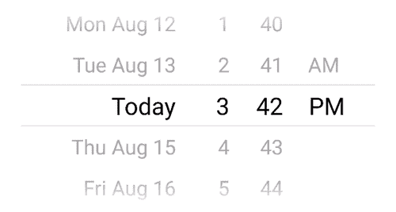
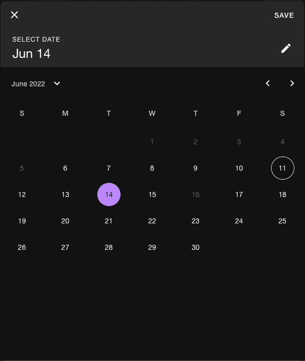
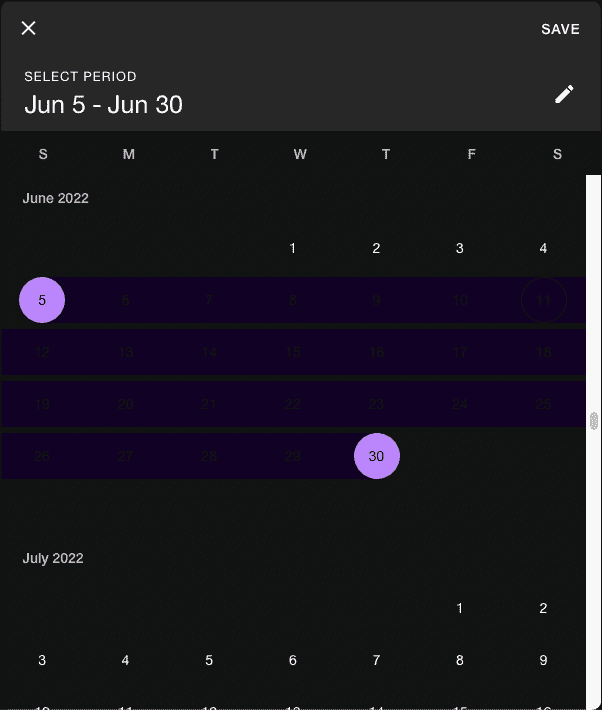
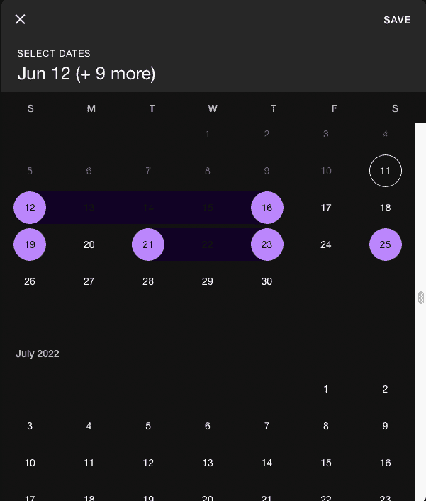

# React Native app 的最佳日期选择

> 原文：<https://blog.logrocket.com/best-date-pickers-react-native-app/>

***编者按:*** *本文于 2022 年 6 月 30 日更新，更新了各个库的统计数据，删除了过时或已弃用的库，并包含了更受欢迎和有效的库。*

今天，几乎每个应用程序都实现了某种日期或时间选择器。我们用它们来设置提醒，在日历上标记特殊的日期，设置闹钟，等等。在本文中，我们将了解 React 原生日期选择器的可用选项，并讨论如何为您的应用程序选择正确的选项。

### 内容

## 为 React 本机日期选择器选择正确的库

当使用 React Native 时，通常需要使用外部核心库，因此在选择正确的核心库时要深思熟虑。当决定是否在您正在开发的应用程序中包含第三方库时，请考虑以下四个标准:

1.  GitHub stars:如果包只有几颗星，我们既不能确定它是否可靠，也不能期望它在我们的项目中保持稳定
2.  活动:如果软件包有足够多的 GitHub 星，但没有积极维护，它可能不适合。React Native 变化很快，所以我们希望这个包能够最好地与最新版本的框架一起工作(一定要检查最后的提交日期)
3.  主要维护者:确定谁是库的主要维护者也很重要。例如，如果这个包缺少 GitHub stars，但是由 React Native 社区(一个由才华横溢且值得信赖的开发人员组成的社区，他们参与了框架的创建和扩展)维护，那么我们对这个包的信心会比它是某个不知名的人的作品更大
4.  自述文件:一个好的自述文件可以使一个好的库更加强大。鉴于 React Native 的快速发展，这一点尤为重要。在那里可以找到关于支持最新的 React 本地版本的信息

没有一个单一的标准可以确定你的应用程序的最佳日期选择器；你需要平等地考虑以上各点。

## 最佳反应本地日期采摘者

我搜索了所有可能的选项，把名单缩小到三个约会对象。让我们来详细探讨一下。

## React 本机 DateTimePicker

[React Native datetime picker](https://github.com/react-native-community/react-native-datetimepicker)按照 iOS 和 Android 开发指南实现，并在引擎盖下使用其原生系统组件。

这个包也由 React Native 社区积极维护，该社区负责 React Native 中最好的可用开源库。在撰写本文时，最后一次提交是在 2022 年 4 月。

这个包有一个描述性的自述文件，并且是 React 最新的本地版本之一。如果您正在为您的应用程序寻找一个具有本机感觉的日期和时间选择器，这使它成为最强有力的候选之一。

以下是日期选择器的外观:



时间选择器:



这个库有很多特性，README 中列出了可用的道具。它有一个简单的安装指南和一个有用的示例使用部分。

## 反应本机日期选择器

这个[日期选择器库](https://github.com/henninghall/react-native-date-picker)的 1.0.0 版本于 2018 年 4 月 8 日提交，最后一次提交是在 2022 年 6 月，这意味着它仍在积极维护中。这使它成为一个很好的测试对象。

我选择这个库是因为它可以让你在 Android 和 iOS 上保持一致的外观。尽管这不是一个受欢迎的解决方案，Henning Hall 为 Android 创建了一个定制组件，并使其看起来与原生 iOS picker 相同。



根据我的经验，在构建跨平台 React 原生应用程序时，一些客户在构建他们的应用程序的 Android 版本之前更关注 iOS。因此，用类似 iOS 的外观来构建整个应用程序通常是有意义的，这个包非常适合这一点。它还有一个有用的自述文件。

## 反应-本地-纸-日期

如果你正在使用 [React Native Paper](https://callstack.github.io/react-native-paper/) 或者在市场上寻找一个通用的跨平台材料设计日期选择器， [react-native-paper-dates](https://github.com/web-ridge/react-native-paper-dates) 值得一试。

React Native Paper Dates 提供了单个日期、日期范围和多个日期选择器选项，以及一个文本输入选项。







你需要安装 React Native Paper 来使用这个库，所以如果你不在你的项目中使用它，但想使用这个日期选择器，我会推荐使用他们的 babel 插件。它将通过排除您不使用的模块来减小包的大小。你需要做的就是更新你的 babel 配置文件—`babel.config.js`或`babelrc`——如下所示:

```
module.exports = {
  presets: ['module:metro-react-native-babel-preset'],
  env: {
    production: {
      plugins: ['react-native-paper/babel'],
    },
  },
};

```

## react-native-modal-datetime-picker

最后，但肯定不是最不重要的，react-native-modal-datetime-picker 拥有 2.5K GitHub stars 和超过 150k 的每周下载量。

它得到了积极的维护，并在幕后使用了[React Native datetime picker](https://github.com/react-native-community/react-native-datetimepicker),因此支持他们所有的道具，同时提供了改进的开发人员体验。

## 摘要

在上面描述的日期选择器选项中，所有选项都有独特的优点和缺点，您的选择应该基于您的应用程序的特定需求和目标。

也就是说，如果你正在寻找一个积极维护和支持的包，可以帮助你实现原生 iOS 和 Android 应用程序的外观和感觉，你可能要考虑第一个选项，React 原生 DateTimePicker。它不仅提供了原生用户体验，而且还受到奇妙的 React 原生社区的支持。

## [LogRocket](https://lp.logrocket.com/blg/react-native-signup) :即时重现 React 原生应用中的问题。

[](https://lp.logrocket.com/blg/react-native-signup)

[LogRocket](https://lp.logrocket.com/blg/react-native-signup) 是一款 React 原生监控解决方案，可帮助您即时重现问题、确定 bug 的优先级并了解 React 原生应用的性能。

LogRocket 还可以向你展示用户是如何与你的应用程序互动的，从而帮助你提高转化率和产品使用率。LogRocket 的产品分析功能揭示了用户不完成特定流程或不采用新功能的原因。

开始主动监控您的 React 原生应用— [免费试用 LogRocket】。](https://lp.logrocket.com/blg/react-native-signup)