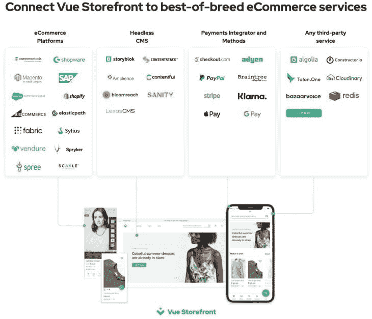

# 为你的 Vue.js 应用选择最好的电子商务平台

> 原文：<https://blog.logrocket.com/best-ecommerce-platform-vue-js-app/>

自疫情以来，网上购物活动有所增加。2020 年，超过 20 亿人在网上购买产品或服务，这一数字还在增长。据[预测，到 2022 年底，仅美国的电子商务行业就将成为一个价值万亿美元的行业。](https://www.insiderintelligence.com/newsroom/index.php/us-ecommerce-will-cross-1-trillion-in-2022/#:~:text=Insider%20Intelligence%20has%20revised%20its,will%20dip%20into%20single%20digits.)

我们想加入蓬勃发展的电子商务行业，但我们如何知道选择正确的电子商务平台？在本文中，我们将探讨在为 [Vue.js](https://blog.logrocket.com/tag/vue/) 应用程序选择电子商务平台时需要考虑的一些因素。

我们将关注以下平台:

## 选择 Vue.js 电子商务平台的标准

选择电子商务平台时，我们必须考虑以下因素

*   特征
*   开发者体验
*   集成
*   主题
*   展开性
*   成熟
*   定价

我们将探索不同的 Vue.js 电子商务平台，将所有这些都考虑在内。

## Vue 店面

Vue Storefront 也称为 VSF，是一个开源前端，采用 PWA 和 headless 方法构建，使用现代 JS 堆栈。

它利用现代技术，如 Vue.js 和 PWA，来创建移动优先的用户体验。VSF 使得在 Magento 和 Shopify 等流行的电子商务平台上利用 PWA 的优势变得很容易。

### 特征

*   编目和分类库存
*   信用卡处理
*   电子商务管理
*   存货管理
*   订单管理
*   搜索引擎优化管理
*   客户账户
*   客户服务
*   营销推广
*   分析和报告
*   结账、支付和运输
*   附带 Storefront UI，这是一个组件库

### 开发者体验

VSF 是最受欢迎的 Vue.js 电子商务平台之一，截至发稿时有 98000 名 GitHub 明星。

它附带了清晰的文档和展示我们能用它构建什么的 T2 演示。除此之外，它还有一个活跃的开发人员社区，提供涵盖不同用例的模板、示例、课程、YouTube 视频和博客帖子教程。这些资源使开发人员能够快速将 VSF 集成到他们的应用程序中。

### 集成

作为一个受欢迎的平台，VSF 支持与不同的电子商务服务和第三方支付解决方案的集成。[这里的](https://docs.vuestorefront.io/v2/integrations/)是可用集成的列表。

有了 VSF，我们有了所有的选项，而且没有任何限制，因为我们摆脱了供应商锁定。

### 主题

VSF 是一个高度可定制的库。它的[默认](https://docs.vuestorefront.io/v2/getting-started/theme.html)主题可以定制，并带有[店面 UI](https://vuestorefront.io/storefront-ui) ，这是一个可重用的组件库，我们可以用它来构建我们选择的电子商务前端。它是 100%可定制的；我们可以使用单个 UI 组件或整个系统，并使其符合我们品牌的设计。

### 展开性

在选择电子商务平台时，可扩展性是关键卖点之一，VSF 也不例外。

有了 VSF，我们可以扩展应用程序的任何部分来满足我们的需求，无论是前端，后端，或两者都有。

### 成熟

VSF 拥有 1200 多家商店、100 多家合作伙伴机构和一个由 5000 多名开发者组成的庞大社区，是一个成熟的电子商务平台，在电子商务行业拥有强大且不断增长的立足点。

除此之外，VSF 已经将最好的电子商务平台、headless CMSs、支付解决方案和第三方服务集成到其平台中。

### 定价

没有可用的价格信息。但是，它是免费启动的。

VSF 不需要编码经验，所以一个非编码人员将不得不雇用一个开发团队来整合 Vue 店面与他们的电子商务网站。

## 狙击车

Snipcart 是一个强大的、开发者至上的购物车平台。我们可以使用它在几分钟内为任何网站或网络应用程序添加定制的电子商务功能。

### 特征

*   创建折扣和促销
*   处理税务管理
*   自动计算运费
*   支持多种语言
*   支持多种货币
*   通过电子邮件发送发票
*   废弃手推车回收
*   捐款
*   货品计价
*   存货管理
*   适合您品牌的可定制购物车和结账流程
*   在 Snipcart 仪表板中管理您的库存

### 开发者体验

作为开发者第一，Snipcart 团队通过 YouTube 视频和博客帖子创建了大量内容。这些资源展示了如何使用 Snipcart 以及不同的用例和集成。

还有一个类似于 Stack Overflow 的[支持平台](https://support.snipcart.com/)，开发者可以在这里投诉和提问。

对于开发者来说，另一个好处是 Snipcart 支持 Hugo 这样的 SSG，以及 Next.js、React、Vue.js、Nuxt.js、Angular and Svelte、Laravel 和 WordPress 这样的前端框架。

Snipcart 有一个活跃的开发者社区，拥有许多资源和模板。

### 集成

我们可以将 Snipcart 与我们选择的 CMS 集成，无论是与 WordPress、Sanity、Strapi 还是 Craft CMS 等等。

### 主题

Snipcart 中的主题化是建立在 CSS 变量上的，这使得开发者可以很容易地切换主题以适应他们的品牌规格。

### 展开性

Snipcart 的建立是为了给开发者最大的自由。它提供了 API 和 webhooks，我们可以用来扩展它的功能。我们可以建立在它的电子商务 API 上，并将其与几乎任何技术和系统连接起来。

### 成熟

与其他平台相比，Snipcart 仍然是一个相对较新的平台。但是，不可小觑。

Snipcart 团队非常积极主动地创建内容，向开发人员展示如何使用 Snipcart。他们的 GitHub 概要文件中包含了几个解决不同用例和技术的存储库。它可能在年代上有所欠缺，但在内容上有所弥补。

* * *

### 更多来自 LogRocket 的精彩文章:

* * *

### 定价

Snipcart 有一个标准的定价方案，每笔交易收取 2%的费用。这是支付网关费用之外的费用。以下是他们的[定价计划](https://snipcart.com/pricing)的更多信息。还提供免费计划。

## 电力公司

有了 [Powr](https://www.powr.io/ecommerce-for-vuejs-how-to-add-to-your-site?src=tutorials) ，我们无需编码就可以将电子商务功能添加到我们的 Vue.js 网站中。它旨在帮助企业主提高知名度、参与度和转化率。

POWR 提供 24/7 的客户支持和帮助中心，其工程师团队昼夜不停地工作，以确保他们的系统平稳运行。

### 特征

Powr 有一套 60 多个应用程序，你可以在你的 Vue.js 网站上免费使用。这些是应用涵盖的一些使用案例:

*   线索收集
*   转化率优化
*   表单生成器
*   脸书聊天
*   倒计时定时器
*   评价滑块
*   工作公告板

点击查看可用应用[的完整列表。](https://www.powr.io/plugins)

### 开发者体验

Powr 以自己是一个低代码/无代码工具而自豪，所以这里的体验不是以开发人员为中心的，而是通用的。

与 Powr 合作的一个很棒的事情是它的演示页面 T1，它包含了十个最好的应用程序是如何工作的演示。在我们的网站上有一个应用程序如何工作和外观的可视化表示是一个巨大的优势。还可以编辑应用程序，以尝试不同的屏幕尺寸、设计、设置和配置。

### 集成

Powr 有几个集成涵盖不同的类别，如电子商务，电子邮件营销，网站建设，会计等。Powr 使我们能够使用正确的工具，更高效地完成最佳工作。

### 主题

Powr 很容易定制。我们可以定制字体、颜色、边框、间距等，以适应我们的品牌。

### 展开性

很少有关于 Powr 可扩展性的信息。然而，鉴于它是面向低代码/无代码工具的，开发人员可能很少或没有可扩展性。

### 成熟

Powr 拥有 8，230，145 个活跃在网站上的插件，1，200，348 个电子商务安装和 12，387 条来自客户的评论，是一个经过战斗考验的平台，具有坚实的基础。来自客户的案例研究表明，Powr 将转化率提高了 30%以上。

### 定价

有四种付款计划，包括免费计划。下一个计划是入门，每月花费 5.49 美元。了解关于[定价结构](https://www.powr.io/pricing)的更多信息。

## 商务网

[Commerce.js](https://commercejs.com/frameworks/vue-ecommerce/) 是一个面向下一代企业的电子商务基础设施，这些企业需要对其商务的控制和灵活性。它使企业能够利用其电子商务 API 和 SDK 构建产品展示、购物车、结账、追加销售等功能。

Commerce.js 旨在适应和扩展现代企业的复杂本质，支持开放集成、自定义逻辑、特定工作流，并满足当今用户的期望。

### 特征

*   JavaScript SDK
*   支持多种语言
*   支持多种货币
*   全球销售税支持
*   订单管理
*   全球航运区
*   Webhooks
*   设计定制
*   数据导出

点击查看功能[的完整列表。](https://commercejs.com/product/features)

### 开发者体验

Commerce.js 提供了一个现代化的工具包，由 JavaScript SDK 和开发人员可以使用的 API 组成。兼容 React、Next.js、Gatsby、Vue.js、Nuxt.js、Svelte 等前端框架。

Commerce.js 也有[丰富的文档](https://commercejs.com/docs/)，结构良好，易于理解。这些文档涵盖了如何使用不同的 SDK，以及如何集成不同的框架，如 Next.js、Nuxt.js 等。

### 集成

Commerce.js 提供了[一键式集成](https://commercejs.com/integrations)，我们可以用它来轻松集成我们最喜欢的工具。提供处理内容、支付、搜索、通信、运输、税务、自动化和电子商务平台(如 Shopify 和 Wix)的集成。

### 主题

您转换体验的每个方面都可以控制—从单页到多步表单、背景颜色、动画、CTA 按钮和购物车摘要。

### 展开性

没有关于如何扩展 Commerce.js 的功能或是否可能扩展的信息。

### 成熟

Commerce.js 成立于 2016 年，其团队在电子商务平台开发、内容管理系统架构、企业库存管理设计和开源贡献方面拥有超过十年的经验。

### 定价

有四种定价方案可供选择，其中一种是免费的。基本定价计划是 Pro 计划，每月 79 美元。了解有关他们的[定价计划](https://commercejs.com/pricing)的更多信息。

## 明确

结晶是一个面向前端开发者的 Vue.js 电子商务平台。

### 功能包括

*   GraphQL API
*   产品建模
*   数字资产管理
*   全球 CDN 资产交付
*   捐款
*   订单管理
*   购物车和收银台
*   报告和分析
*   本地化内容

### 开发者体验

Crystallize 提供免费开源的[电子商务样板模板](https://crystallize.com/learn/open-source/boilerplates)，针对性能、电子商务 SEO 和客户体验进行了优化。样板文件是构建丰富的电子商务体验的简单起点。

还有一个由 2000 多名开发人员组成的活跃社区，我们可以在那里构建、协作、共享、讨论和寻找解决方案。

结晶器支持 React、Gatsby、Next.js、React Native、Vue.js 和 Nuxt.js。

### 集成

Crystallize 支持 Shopify 和 Magento 等电子商务平台，Two、Stripe、Klarna 等支付集成提供商，以及 Elasticsearch 的搜索功能。

### 主题

没有可用的主题。但是，模板的样式可以调整，以适应我们品牌的需求。

### 展开性

作为一个开源平台，开发人员可以选择扩展 Crystallize 的特性和功能。其实有一个[投稿指南](https://crystallize.com/learn/open-source/sdks-and-libraries/how-to-contribute)详细介绍了如何投稿。

### 成熟

这方面的信息很少。然而，Crystallize 成立于 2017 年，目前有 23 名成员。

### 定价

有三种定价方案，包括一种免费方案。参见[更多关于定价的信息](https://crystallize.com/pricing)。

## 你应该使用哪个平台？

对于这样的问题，两个答案总是合适的:视情况而定，没有放之四海而皆准的解决方案。

每个平台都有其独特的产品，有些在某些领域比其他平台表现更好。正确的平台将是一个经济高效的选项，可以显著缩短我们的上市时间。

作为一名开发人员，我喜欢 Snipcart 的简单性，以及如何轻松地将其集成到一个网站中，但我会让您自己选择！

## 像用户一样体验您的 Vue 应用

调试 Vue.js 应用程序可能会很困难，尤其是当用户会话期间有几十个(如果不是几百个)突变时。如果您对监视和跟踪生产中所有用户的 Vue 突变感兴趣，

[try LogRocket](https://lp.logrocket.com/blg/vue-signup)

.

[https://logrocket.com/signup/](https://lp.logrocket.com/blg/vue-signup)

LogRocket 就像是网络和移动应用程序的 DVR，记录你的 Vue 应用程序中发生的一切，包括网络请求、JavaScript 错误、性能问题等等。您可以汇总并报告问题发生时应用程序的状态，而不是猜测问题发生的原因。

LogRocket Vuex 插件将 Vuex 突变记录到 LogRocket 控制台，为您提供导致错误的环境，以及出现问题时应用程序的状态。

现代化您调试 Vue 应用的方式- [开始免费监控](https://lp.logrocket.com/blg/vue-signup)。

## [LogRocket](https://lp.logrocket.com/blg/ecommerce-signup) :看看用户为什么不完成你的电子商务流程中的一个步骤的技术和 UX 原因。

LogRocket 就像是一个网络和移动应用程序和网站的 DVR，记录你的电子商务应用程序上发生的一切。LogRocket 没有猜测用户不转化的原因，而是主动揭示了阻止你转化的根本原因，比如 JavaScript 错误或死点击。LogRocket 还可以监控应用的性能，报告客户端 CPU 负载、客户端内存使用等指标。

开始主动监控您的电子商务应用程序— [免费试用](https://lp.logrocket.com/blg/ecommerce-signup)。