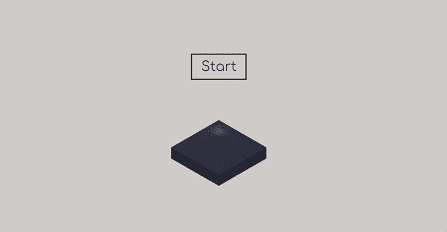
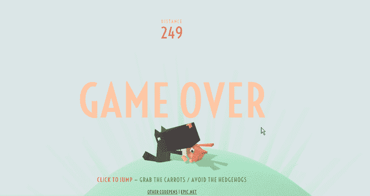
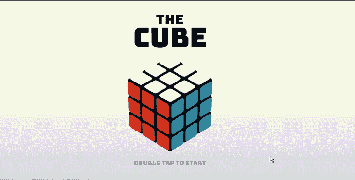
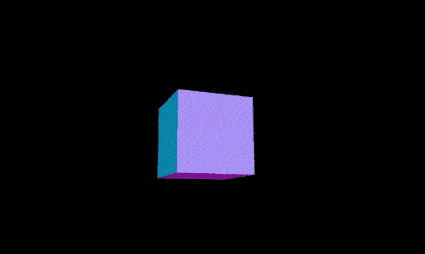
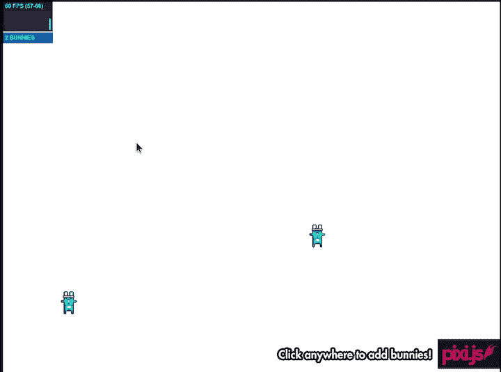
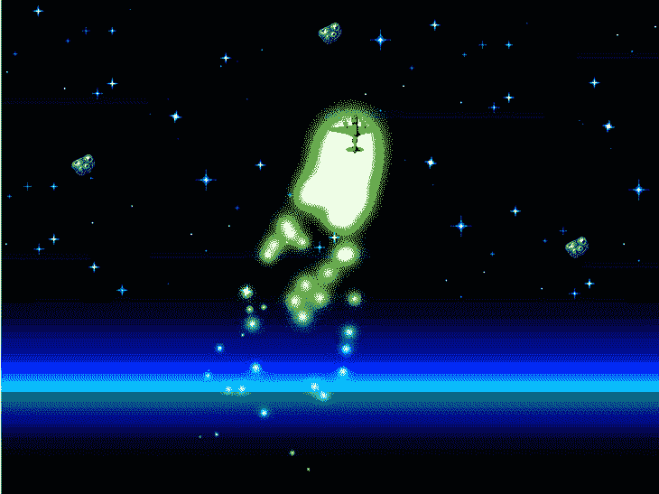
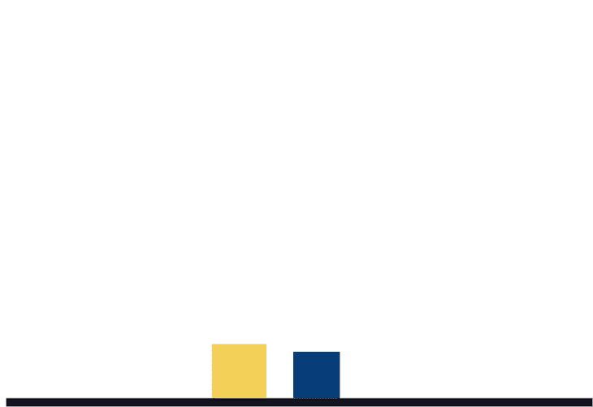
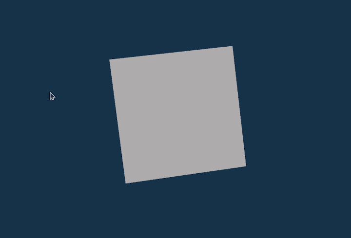

# 6 大 JavaScript 和 HTML5 游戏引擎

> 原文：<https://blog.logrocket.com/best-javascript-html5-game-engines/>

***编者按**:这篇文章最后一次更新是在 2022 年 11 月 21 日，为 JavaScript 和 HTML 游戏引擎更新信息并添加可视化示例。*

我知道你在想什么:你到底为什么要用 JavaScript 开发游戏？当我发现你可以使用 JavaScript 和 HTML5 开发 3D 游戏时，我也有同样的想法。

事实是，自从 JavaScript WebGL API 推出以来，现代浏览器具有直观的功能，使它们能够在不依赖第三方插件的情况下呈现更复杂和复杂的 2D 和 3D 图形。

你可以从纯 JavaScript 开始你的网页游戏开发之旅，如果你是初学者，这可能是最好的学习方法。但是，当有这么多广泛采用的游戏引擎可供选择时，为什么要重新发明轮子呢？

本指南将探索排名前六的 JS/HTML5 游戏引擎，按照 GitHub 星的数量进行排序，并带您了解如何使用它们。

我们将涵盖:

## 1.三. js

Three.js 是最流行的 JavaScript 库之一，用于使用 WebGL 在 web 浏览器中创建和制作 3D 计算机图形动画。它也是为网络浏览器创建 3D 游戏的一个很好的工具。

因为 Three.js 基于 JavaScript，所以在 3D 对象和用户界面(如键盘和鼠标)之间添加任何交互性都相对容易。这使得该库非常适合在网络上制作 3D 游戏。

### 赞成的意见

*   简单易学:除了能够很好地执行复杂的渲染之外，Three.js 最重要的优点是非常容易上手
*   **大量的例子**:由于它的普及，有无数的例子可以帮助你入门。下面是几个展示 Three.js 可能实现的功能的示例项目:
    [](http://https://codepen.io/ste-vg/pen/ppLQNW)
    [](http://https://codepen.io/Yakudoo/pen/YGxYej)
    [](http://https://codepen.io/bsehovac/pen/EMyWVv)
*   **大型社区** : Three.js 在 GitHub 上有 87.1k 星，33.4k 叉。它有大量的用户和相当大的开发人员社区，他们为这个库开发和创建各种第三方工具和扩展
*   好的文档:健壮的文档通常是一个强大的库的重要标志，Three.js 拥有[优秀的文档](https://threejs.org/docs/)
*   **出色的性能** : Three.js 比我用过的其他库都有性能优势
*   **PBR 渲染** : Three.js 内置了基于物理的渲染(PBR)，使得渲染图形更加精确

### 骗局

*   **没有渲染管道**:这使得很多现代的渲染技术不可能/不可行用 Three.js 来实现
*   **不是游戏引擎**:虽然 Three.js 拥有创建游戏的基本功能，但它并不是像 PlayCanvas 和 Unity 那样提供交互性和渲染以外功能的游戏引擎。但是，Three.js 的 API 可以用来创建游戏引擎；一个这样的例子是[流氓引擎](https://rogueengine.io/)
*   **面向新手**:因为 API 是面向新手的，所以隐藏了很多高级特性
*   **缺乏支持**:没有内置的空间索引、精确光线投射或平截头体剔除支持，碰撞检测在复杂场景中效率低下

### Three.js 在行动

如果你想深入研究在网络上创建简单或复杂的 3D 对象，Three.js 是首选库。它的最大优势包括大量有才华的用户和丰富的例子和资源。

Three.js 是我使用的第一个 3D 动画库，我会推荐给任何开始游戏开发的人。

让我们创建一个简单的旋转几何体来演示 Three.js 可以做什么:

```
import * as THREE from 'js/three.module.js';

var camera, scene, renderer;
var geometry, material, mesh;

animate();

```

用 Three.js 创建一个`init`函数来设置运行演示动画所需的一切:

```
function init() {
  const camera = new THREE.PerspectiveCamera( 60, window.innerWidth / window.innerHeight, .01, 20 );
  camera.position.z = 1;

  const scene = new THREE.Scene();

  const geometry = new THREE.BoxGeometry( 0.5, 0.5, 0.5 );
  const material = new THREE.MeshNormalMaterial();

  const mesh = new THREE.Mesh( geometry, material );
  scene.add( mesh );

  const renderer = new THREE.WebGLRenderer( { antialias: true } );
  renderer.setSize( window.innerWidth, window.innerHeight );
  document.body.appendChild( renderer.domElement );
}

```

接下来，创建一个`animate`函数，用你想要的运动类型来激活对象:

```
function animate() {
    init();
    requestAnimationFrame( animate );
    mesh.rotation.x += .01;
    mesh.rotation.y += .02;
    renderer.render( scene, camera );
}

```

最终结果应该是这样的:



参考[回购](https://github.com/mrdoob/three.js/)和官方[文档](https://threejs.org/docs/index.html#manual/en/introduction/Creating-a-scene)了解更多关于 Three.js 的信息

## 2.Pixi.js

如果您正在寻找一个 JS 库来创建支持跨平台应用程序的丰富的交互式 2D 图形，那么只需看看 [Pixi.js](https://github.com/pixijs/pixi.js) 就够了。这个 HTML5 创建引擎使您能够在没有 WebGL API 的先验知识的情况下开发动画和游戏。

### 赞成的意见

*   **性能快**:跟 Three.js 一样，Pixi.js 很快
*   **大型社区**:pixi . js 拥有 GitHub 上的 38.2k stars 和 4.7k forks，拥有庞大的用户/开发者社区
*   多平台支持:和 Three.js 一样，Pixi.js 也支持多种平台，比如 web 和原生系统，比如 Android、iOS、Windows 和 mac
*   简易 API:API 对于初学者来说很容易理解
*   **支持 WebGL 和画布回退** : Pixi.js 使用 WebGL 渲染器，但也支持画布回退

### 骗局

*   **过于复杂**:以我的经验来看，Three.js 比 Pixi.js 容易上手多了
*   **不完整的解决方案** : Pixi.js 骄傲地只支持渲染器

### Pixi.js 在行动

在大多数情况下，Pixi 是一个强有力的选择，特别是如果您正在创建以性能为导向的 3D 交互式图形，并考虑到设备兼容性。在 WebGL 失败的情况下，Pixi 对 Canvas 回退的支持是一个特别吸引人的特性。

让我们构建一个简单的演示来看看 Pixi.js 的运行情况。使用以下命令或 CDN 将 Pixi.js 添加到您的项目中:

```
  npm install pixi.js

```

或 CDN:

```
  <script src="https://cdnjs.cloudflare.com/ajax/libs/pixi.js/5.1.3/pixi.min.js" ></script>

```

创建一个脚本文件，并添加以下代码:

```
import * as PIXI from 'pixi.js';

const app = new PIXI.Application();
document.body.appendChild(app.view);

app.loader.add('jumper', 'jumper.png').load((loader, resources) => {
    const bunny = new PIXI.Sprite(resources.bunny.texture);
    bunny.x = app.renderer.width / 2;
    bunny.y = app.renderer.height / 2;

    bunny.anchor.x = .5;
    bunny.anchor.y = .5;

    app.stage.addChild(bunny);

    app.ticker.add(() => {
        bunny.rotation += .01;
    });
});

```

结果应该是这样的:



参考[回购](https://github.com/pixijs/pixijs)和官方[文档](https://pixijs.download/release/docs/index.html)了解更多关于 Pixi.js 的信息

## 3.相位器

Phaser 是一个跨平台的游戏引擎，可以让你创建基于 JavaScript 和 HTML5 的游戏，并为许多平台编译。例如，您可能决定使用第三方工具将您的游戏编译到 iOS、Android 和其他原生应用程序。

### 赞成的意见

*   **结构合理**:众所周知，Phaser 拥有精心设计的结构
*   **TypeScript 支持**:该库支持使用 TypeScript 进行游戏开发
*   **专注于游戏开发** : Phaser 主要是一个游戏开发引擎，而且是一个很好的引擎
*   **大型社区**:虽然没有前两个库大，Phaser 在 GitHub 上有一个相当大的社区，有 33.2k 的 stars 和 6.9k 的 forks
*   丰富的插件 : Phaser 支持大量的插件。这包括[相位器-物质-碰撞](https://github.com/mikewesthad/phaser-matter-collision-plugin)、 [navmesh](https://github.com/mikewesthad/navmesh) 、[相位器-输入](https://github.com/azerion/phaser-input)和 [slick-ui](https://github.com/Flaxis/slick-ui) 插件，不一而足
*   **WebGL 和 Canvas 支持** : Phaser 支持 WebGL 并启用 Canvas 作为后备

### 骗局

*   构建规模:Phaser for desktop 的构建规模相当庞大
*   对移动开发的支持差:创建本地移动应用需要使用 Cordova 或其他第三方框架
*   **状态管理**:开始使用 Phaser 的状态管理器可能有些困难

### 相位器开始工作

Phaser 有利于开发跨平台的游戏应用程序。它对各种插件的支持，以及使用 Phaser 开发游戏的大型开发者社区，使得使用该框架变得很容易。

让我们用 Phaser 构建一个基本的应用程序。首先，将 Phaser 作为节点模块或通过 CDN 安装:

```
npm install phaser

```

或者:

```
<script src="//cdn.jsdelivr.net/npm/[email protected]/dist/phaser.min.js"></script>

```

接下来，将一些默认配置传递给 Phaser 引擎:

```
const config = {
  type: Phaser.AUTO,
  width: 800,
  height: 600,
  physics: {
    default: "arcade",
    arcade: {
      gravity: { y: 200 },
    },
  },
  scene: {
    preload: preload,
    create: create,
  },
};

const game = new Phaser.Game(config);

```

创建预加载函数以加载到默认静态文件中:

```
function preload() {
  this.load.setBaseURL("https://labs.phaser.io");
  this.load.image("sky", "assets/skies/space3.png");
  this.load.image("plane", "assets/sprites/ww2plane.png");
  this.load.image("green", "assets/particles/green.png");
  this.load.image("astroid", "assets/games/asteroids/asteroid1.png");
  this.load.image("astroid2", "assets/games/asteroids/asteroid1.png");
  this.load.image("astroid3", "assets/games/asteroids/asteroid1.png");
}

```

最后，定义一个`create`函数来显示您新创建的游戏:

```
function create() {
  this.add.image(400, 300, "sky");
  this.add.image(700, 300, "astroid");
  this.add.image(100, 200, "astroid2");
  this.add.image(400, 40, "astroid3");

  const particles = this.add.particles("green");

  const emitter = particles.createEmitter({
    speed: 100,
    scale: { start: 1, end: 0 },
    blendMode: "ADD",
  });

  const plane = this.physics.add.image(400, 100, "plane");
  plane.setVelocity(100, 200);
  plane.setBounce(1, 1);
  plane.setCollideWorldBounds(true);
  emitter.startFollow(plane);
}

```



参考[回购](https://github.com/photonstorm/phaser)和官方[文档](https://newdocs.phaser.io/docs/3.55.2)了解更多关于 Phaser.js 的信息

## 4.巴比伦. js

Babylon.js 是一个强大、简单、开放的游戏和渲染引擎，被打包到一个友好的 JavaScript 框架中。

### 赞成的意见

*   **游乐场** : Babylon 提供了一个在全面开发之前进行测试的游乐场工具——而且它有很棒的文档
*   **强大的社区支持** : Babylon 有一个[论坛](https://forum.babylonjs.com/)，有一个活跃的开发者和用户的大型社区，非常有用。框架在 GitHub 上有 18.9k 星和 3k 叉
*   **最新的代码库**:框架拥有频繁更新的代码库和活跃的第三方工具开发。[官方](https://github.com/BabylonJS/Babylon.js) [回购](https://github.com/BabylonJS/Babylon.js) [库存](https://github.com/BabylonJS/Babylon.js)最近更新于 11/26/22
*   **PBR 渲染**:支持 PBR 渲染支持非常出色
*   **信任投票** : Babylon 被 Adobe、微软等大品牌使用和支持
*   维护:错误通常会很快被解决

### 骗局

*   **不成熟** : Babylon 于 2013 年首次发布，这使得它与许多竞争对手相比显得非常年轻
*   **文档**:发动机缺少 API 文档
*   不适合较小的项目

### Babylon.js 在行动

许多大品牌信任 Babylon.js 作为他们游戏开发引擎的选择。 [Babylon Playground](https://playground.babylonjs.com/) ，一个繁荣的代码样本中心，是帮助你开始使用这个框架的一个很好的工具。

巴比伦及其模块在 npm 上发布。要安装它，请在命令行工具中运行以下命令:

```
npm install babylonjs --save

```

或者，您可以通过 CDN 将库集成到您的项目中。为此，创建一个`index.html`文件并添加以下代码:

```
  <canvas id="renderCanvas"></canvas>
  <script src="https://cdn.babylonjs.com/babylon.js"></script>
  <script src="script.js"></script>

```

安装后，您可以通过导入全局对象或析构场景和引擎方法来开始使用该库，如下所示:

```
  import * as BABYLON from 'babylonjs'

  // OR

  import { Scene, Engine } from 'babylonjs'

```

接下来，创建一个`script.js`文件并包含以下代码:

```
  const { createScene } = require('scene.js')

  window.addEventListener('DOMContentLoaded', function(){
      const canvas = document.getElementById('renderCanvas');
      const engine = new BABYLON.Engine(canvas, true);
      const scene = createScene();
      engine.runRenderLoop(function(){
          scene.render();
      });
      window.addEventListener('resize', function(){
          engine.resize();
      });
  });

```

创建一个`scene.js`文件并添加以下代码:

```
export function(){
    const scene = new BABYLON.Scene(engine);
    const camera = new BABYLON.FreeCamera('camera', new BABYLON.Vector3(0, 5,-10), scene);
    camera.setTarget(BABYLON.Vector3.Zero());
    camera.attachControl(canvas, false);
    const light = new BABYLON.HemisphericLight('light', new BABYLON.Vector3(0,1,0), scene);
    const sphere = BABYLON.Mesh.CreateSphere('sphere', 16, 2, scene);
    sphere.position.y = 1;
    const ground = BABYLON.Mesh.CreateGround('ground', 6, 6, 2, scene);
    return scene;
}

```

下面是你的动画应该是什么样子的预览:


参考[回购](https://github.com/BabylonJS/Babylon.js)和官方[文档](https://doc.babylonjs.com/)了解更多关于 Babylon.js 的信息

## 5.Matter.js

Matter.js 是一个 JavaScript 2D，网络刚体物理引擎。尽管它是一个 JavaScript 物理引擎，但你可以将它与各种包和插件结合在一起[来创建有趣的网页游戏](https://www.youtube.com/watch?v=TDQzoe9nslY)。

### 赞成的意见

*   **激动人心的特性** : Matter.js 提供了许多特性，如刚体、复合体和复合体，稳定的堆叠和静止，运动守恒，以及[等等](https://github.com/liabru/matter-js#features)

### 骗局

*   **无 CCD** : Matter.js 缺乏连续碰撞检测(CCD)导致快速移动的物体穿过其他物体的问题

### Matter.js 在行动

从主观上来说，Matter.js 是创建简单的移动动画对象的最佳库。Matter.js 是一个物理库，更侧重于 2D 天体。但是，您可以将它与第三方解决方案结合起来，创建动态游戏。

要在普通项目中开始使用 Matter.js，请从官方 GitHub repo 下载`[matter.js](https://github.com/liabru/matter-js/blob/master/build/matter.js)`或 [`matter.min.js`](https://github.com/liabru/matter-js/blob/master/build/matter.min.js) 包文件，并使用以下代码将其添加到 HTML 文件中:

```
<script src="matter.js"></script>

```

但是，如果您使用的是 bundler，例如[P](https://parceljs.org)arcel，您可以使用以下命令通过`npm`或`yarn`将软件包安装为节点模块:

```
npm install matter-js
//OR
yarn add matter-js

```

下面是一个使用内置渲染器和运行器帮助您入门的简单示例:

```
// module aliases
const Engine = Matter.Engine;
const Render = Matter.Render;
const World = Matter.World;
const Bodies = Matter.Bodies;

// create an engine
const engine = Engine.create();

// instantiating the renderer
const render = Render.create({
  element: document.body,
  engine: engine,
  options: {
    wireframes: false,
    showAngleIndicator: false,
    background: "white",
  },
});

// create two boxes and a ground
const boxA = Bodies.rectangle(300, 300, 70, 70);
const boxB = Bodies.rectangle(400, 10, 60, 60);
const ground = Bodies.rectangle(300, 510, 910, 10, { isStatic: true });

// add all bodies to the world
World.add(engine.world, [boxA, boxB, ground]);

// run the engine
Matter.Runner.run(engine);

// run the renderer
Render.run(render);

```

将上述脚本包含在安装了 Matter.js 的页面中，然后在浏览器中打开该页面。确保脚本在页面底部(或者在窗口加载事件时或 DOM 准备好之后调用)。

你应该看到两个矩形物体下落，然后在落地时相互撞击。如果没有，请检查浏览器控制台以查看是否有任何错误:



参考[回购](https://github.com/liabru/matter-js)和官方[文档](https://brm.io/matter-js/docs/)了解更多关于 Matter.js 的信息

## 6.游戏画布

[PlayCanvas](https://github.com/playcanvas/engine) 使用 HTML5 和 WebGL 在任何移动或桌面浏览器中运行游戏和其他交互式 3D 内容。虽然 PlayCanvas 是免费和开源的，但它更关注游戏引擎而不是渲染引擎。所以更适合制作使用 WebGL 和 HTML5 Canvas 的
3D 游戏。

### 赞成的意见

*   游戏引擎:与其他游戏不同的是，PlayCanvas 是一个游戏引擎，它具有你在其他库或框架中找不到的特性
*   开源 : PlayCanvas 是一个用于强大游戏开发的开源工具
*   **移动优化**:游戏开发平台以移动为先
*   **零编译时间**:引擎的零编译时间自然使进程更快
*   **资产管道** : PlayCanvas 使用最佳实践让您决定如何以何种形式交付内容
*   **集成物理引擎**:你可以使用强大的子弹物理引擎 [ammo.js](https://github.com/kripken/ammo.js) 很容易地将物理整合到你的游戏中
*   **热重新加载**:您不必每次进行更改时都重新加载浏览器
*   **仅在浏览器上运行的渲染引擎** : PlayCanvas 具有仅在浏览器上运行的高级 WebGL 特性

### 骗局

*   私有项目付费墙:免费层不支持私有项目，所以所有代码和资产都是公开托管的
*   **碰撞偏移**:没有碰撞偏移
*   缺乏例子:PlayCanvas 的教程少之又少

### PlayCanvas 正在运行

PlayCanvas 非常适合创建小型公共项目或学校项目——至少我是这么用它的。如果你需要更多的功能和对游戏开发的更多控制，你可能要考虑订阅高级功能。

现在，让我们用引擎做一些基本的渲染。首先，从 [Git](https://code.playcanvas.com/playcanvas-latest.min.js) [H](https://code.playcanvas.com/playcanvas-latest.min.js) [ub 库](https://code.playcanvas.com/playcanvas-latest.min.js)下载包文件，并使用以下代码将其添加到您的项目中:

```
<script src='https://code.playcanvas.com/playcanvas-stable.min.js'>

```

接下来，创建一个`script.js`文件，并使用以下代码将其链接到 HTML 文件:

```
    <canvas id='canvas'></canvas>
    <script src='/script.js'>

```

现在，打开`script.js`文件并添加以下代码来实例化一个新的 PlayCanvas 应用程序:

```
  const canvas = document.getElementById('canvas');
  const app = new pc.Application(canvas);

  window.addEventListener('resize', () => app.resizeCanvas());

  const box = new pc.Entity('cube');
  box.addComponent('model', {
      type: 'box'
  });
  app.root.addChild(box);

```

要为对象创建相机和灯光，请添加以下代码:

```
  const camera = new pc.Entity('camera');
  camera.addComponent('camera', {
      clearColor: new pc.Color(.1, .1, .1)
  });
  app.root.addChild(camera);
  camera.setPosition(0, 0, 3);

  const light = new pc.Entity('light');
  light.addComponent('light');
  app.root.addChild(light);
  light.setEulerAngles(46, 0, 0);

  app.on('update', dt => box.rotate(10 * dt, 20 * dt, 30 * dt));

  app.start();

```

上面的代码应该产生以下结果:



参考[回购](https://github.com/playcanvas/engine)和官方[文档](https://developer.playcanvas.com/)了解更多关于 PlayCanvas 的信息。

## 最后的想法

通过分析与上面列出的每个 JS/HTML5 游戏引擎相关的优点、缺点和用例，我希望您能够对哪一个最适合您想要创建的游戏或动画类型有所了解。

在大多数情况下，我会推荐使用 Three.js，特别是如果你想找一个比游戏引擎更好的渲染引擎。由于它在开发者生态系统中很受欢迎，很容易找到足够的资源来帮助您启动和运行。

如果你的重点更多的是游戏开发，我会推荐 Babylon.js，因为它简单。Babylon 还有更新的代码库和活跃的第三方开发，playground 特性是测试的绝佳工具。PlayCanvas 是一个可靠的备份选项——它主要是一个游戏引擎，你可以用它来构建复杂的 3D 游戏。

你在游戏开发项目中使用什么游戏引擎？请在评论中告诉我们！

## 通过理解上下文，更容易地调试 JavaScript 错误

调试代码总是一项单调乏味的任务。但是你越了解自己的错误，就越容易改正。

LogRocket 让你以新的独特的方式理解这些错误。我们的前端监控解决方案跟踪用户与您的 JavaScript 前端的互动，让您能够准确找出导致错误的用户行为。

[](https://lp.logrocket.com/blg/javascript-signup)

LogRocket 记录控制台日志、页面加载时间、堆栈跟踪、慢速网络请求/响应(带有标题+正文)、浏览器元数据和自定义日志。理解您的 JavaScript 代码的影响从来没有这么简单过！

[Try it for free](https://lp.logrocket.com/blg/javascript-signup)

.