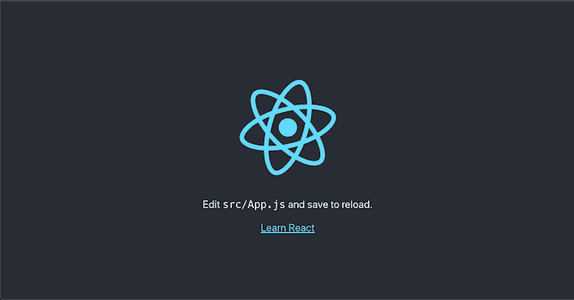
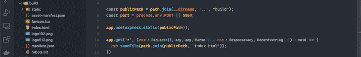
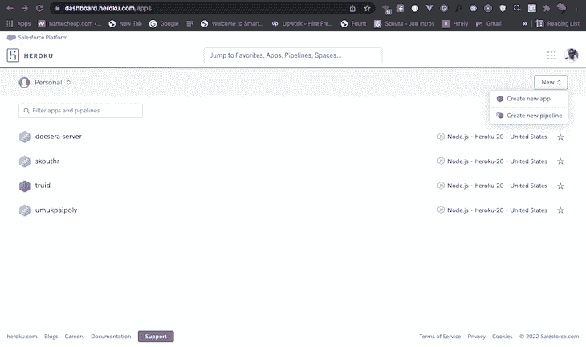
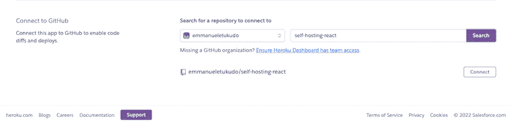
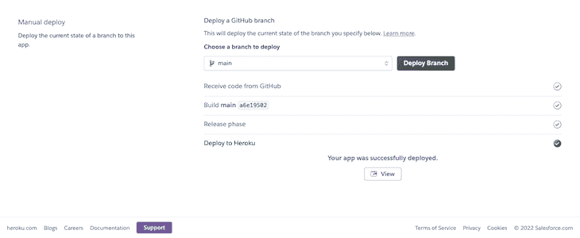

# 自托管的最佳选择创建 React 应用程序-日志火箭博客

> 原文：<https://blog.logrocket.com/best-options-self-hosting-create-react-app/>

尽管对于有经验的开发人员来说，构建 React 应用程序非常简单，但是 React 应用程序的设置、搭建和配置却令人望而生畏。然而，脸书的开源工具 Create React App 使这一过程变得更加无缝，它允许开发人员只需一个命令就可以生成必要的文件夹结构并安装所需的 npm 包来构建生产就绪的应用程序。

尽管 React 应用程序有了这一突破性创新，但许多开发人员仍然面临着关于在哪里以及如何部署 React 应用程序的未解问题。在本文中，我们将通过几个例子来探索准备和部署 React 应用程序的可用选项。我们开始吧！

### 先决条件

要跟随本教程，您需要:

*   熟悉 CSS、HTML 和 JavaScript ES6
*   安装在您机器上的网络浏览器
*   熟悉 Git
*   安装在开发机器上的代码编辑器
*   对 React 的基本理解

### 目录

## 使用 Create React app 初始化 React App

首先，我们将使用 Create React App 初始化一个新的 React 应用程序。首先，导航到您的工作目录并运行下面的命令来创建一个新的 React 应用程序:

```
npx create-react-app self-hosting-react

```

我们来分解一下上面的命令。前缀`npx`代表节点包执行，它负责运行驻留在 npm 注册表中的 Node.js 包。`create-react-app`是实际的 npm 包，而`self-hosted-app`是存放 React 生成的所有文件的文件夹名。初始化完成后，运行以下命令以确认安装成功:

```
npm start

```

上面的命令应该在你的默认浏览器中打开生成的 web 应用，通常指向`port: 3000`。如果您有另一个进程在同一个端口上运行，那么它会要求您使用另一个端口。您的 web 应用程序将类似于下面的屏幕截图:



## 准备部署

要为部署准备 Create React App 应用程序，首先，我们必须通过运行以下命令来创建应用程序的生产版本:

```
npm run build

```

上面的命令将为我们的应用程序创建构建文件，并将它们存储在应用程序根目录下名为`build`的文件夹中。见下面截图供参考:



接下来，我们必须从`gitignore`中移除`/build`文件夹，确保它将与其他文件一起被推送到 GitHub。打开`gitignore`文件，移除`/build`线；

```
# See https://help.github.com/articles/ignoring-files/ for more about ignoring files.
# dependencies
/node_modules
/.pnp
.pnp.js
# testing
/coverage
# production
/build //remove this line
# misc
.DS_Store
.env.local
.env.development.local
.env.test.local
.env.production.local
npm-debug.log*
yarn-debug.log*
yarn-error.log*

```

既然我们已经将`build`文件添加为推送至 GitHub 的文件的一部分，我们将访问 [new-repo](https://www.github.com) ，创建一个名为`self-hosting-react`的新 repo，并将 web 文件推送至 GitHub:

```
git add .
git commit -m "Initial commit"
git branch -M main
git remote add origin https://github.com/emmanueletukudo/self-hosting-react.git
git push -u origin main

```

将所有 web 文件推送到 GitHub 后，我们将创建一个 web 服务器来处理发送给 web 应用程序的所有请求。在项目的根目录下创建一个名为`server`的文件夹，创建一个名为`server.js`的文件，并添加下面的代码片段:

```
const path = require("path");
const express = require("express");
const app = express();
const publicPath = path.join(__dirname, '..', "build");
const port = process.env.PORT || 5000;
app.use(express.static(publicPath));
app.get('*', (res, req) => {
  res.sendFile(path.join(publicPath, 'index.html'));
})
app.listen(port, () => console.log(`App listening at port: ${port}`));

```

通过上面的代码片段，我们使用 Node.js 内置的`path`包访问了`build`文件夹。然后，我们继续将 web 应用程序的所有请求指向`index.html`文件。你可以在官方文档中阅读更多关于部署 Create React App 的信息。

如果您运行下面的命令，您现在应该已经在`port: 5000`上运行了 web 应用程序:

```
node server/server.js

```

现在我们已经完成了部署所需的必要配置，最后，我们将更新`package.json`以便在`start`脚本运行时为`server.js`服务。

用下面的代码片段更新包:

```
//change the start script:
"start": "node server/server.js",
//make the old start script on development
"dev": "react-scripts start",
"build": "react-scripts build",

```

## 通过 Heroku 部署

要将 Create React 应用程序部署到 Heroku，您需要[注册并获得一个账户](https://heroku.com/)。一旦您成功登录您的帐户，点击**新建、**并选择**创建新应用**:



接下来，点击 **git** 部署选项，搜索您在上一节中创建的存储库名称，在我们的例子中是`self-hosting-react`，然后点击 **Connect** :



要启用自动部署，点击**启用自动部署**，然后点击**部署**分支。要查看实时服务器上的应用程序，请点击**查看**:



现在，应用程序应该在`[https://self-hosting-react.herokuapp.com](https://self-hosting-react.herokuapp.com)`运行。

## 使用 Nginx 通过数字海洋进行部署

部署到数字海洋的工作流程与部署到 Heroku 的工作流程相似。你所需要做的就是通过 SSH 登录到你的数字海洋服务器。您应该已经在 DigitalOcean 上注册了一个帐户，安装了 Node.js 和 Nginx 的 droplet，并且在您的 droplet 上启用了`SSH`。要继续，请遵循以下说明:

`SSH`进入您的网络服务器:

```
ssh [email protected]

```

导航到`/www`目录:

```
cd /var/www

```

从 GitHub 克隆 web 文件:

```
git clone https://github.com/your-username/self-hosting-react.git

```

创建一个 Nginx 服务器块来运行应用程序并打开服务器块文件:

```
touch /etc/nginx/sites-available/your_domain 
sudo nano /etc/nginx/sites-available/your_domain

```

添加下面的代码片段:

```
server {
        listen 80;
        listen [::]:80;

        root /var/www/self-hosting-react/build;
        index index.html index.htm index.nginx-debian.html;

        server_name your_domain www.your_domain;

        location / {
                try_files $uri $uri/ =404;
        }
}

```

上面的代码块为 Nginx 服务器块创建了定义，它将每个请求指向`build`文件夹中的 HTML 文件。

在`sites-enabled`中，创建服务器块的符号链接:

```
sudo ln -s /etc/nginx/sites-available/your_domain /etc/nginx/sites-enabled/

```

Create React App 创建应用程序的部署构建，并将其作为 HTML 文件提供。对您在上面选择的域的请求应该会返回类似下面截图的输出:


## 结论

自托管 React 应用程序可能非常经济，特别是如果您打算完全控制您的部署、构建工具和工作流。

在本文中，我们探讨了使用 Create React App 创建的自托管应用程序的选项，包括 Heroku 和使用 Nginx 的 DigitalOcean。我希望你喜欢这个教程！如果你有任何问题，一定要留下评论。

## 使用 LogRocket 消除传统反应错误报告的噪音

[LogRocket](https://lp.logrocket.com/blg/react-signup-issue-free)

是一款 React analytics 解决方案，可保护您免受数百个误报错误警报的影响，只针对少数真正重要的项目。LogRocket 告诉您 React 应用程序中实际影响用户的最具影响力的 bug 和 UX 问题。

[ ](https://lp.logrocket.com/blg/react-signup-general) [  ](https://lp.logrocket.com/blg/react-signup-general) [LogRocket](https://lp.logrocket.com/blg/react-signup-issue-free)

自动聚合客户端错误、反应错误边界、还原状态、缓慢的组件加载时间、JS 异常、前端性能指标和用户交互。然后，LogRocket 使用机器学习来通知您影响大多数用户的最具影响力的问题，并提供您修复它所需的上下文。

关注重要的 React bug—[今天就试试 LogRocket】。](https://lp.logrocket.com/blg/react-signup-issue-free)