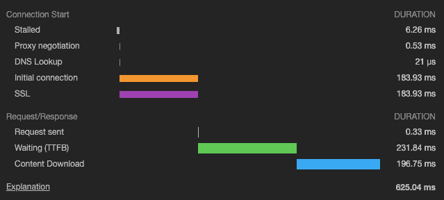
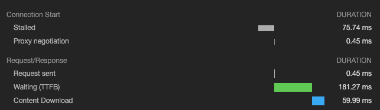
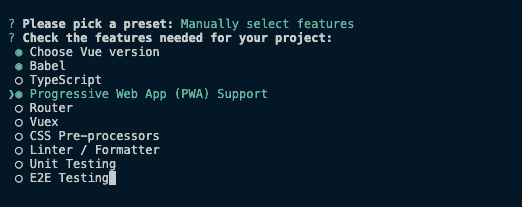
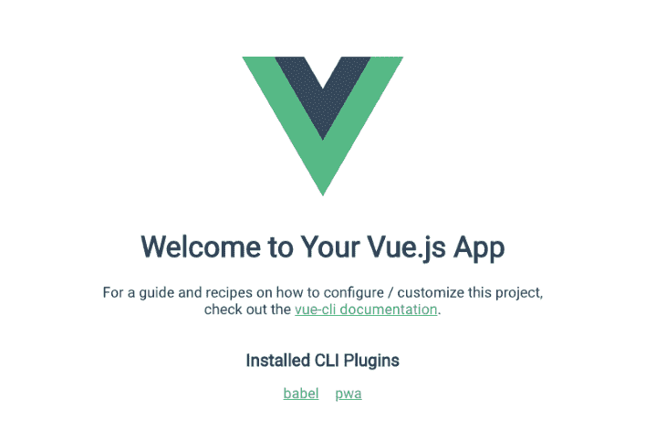

# 在 Vue 中加载字体的最佳实践

> 原文：<https://blog.logrocket.com/best-practices-for-loading-fonts-in-vue/>

添加字体不会对性能产生负面影响。在本文中，我们将探讨在 Vue 应用程序中加载字体的最佳实践。

## 为自定义字体正确声明`font-face`

确保正确声明字体是加载字体的一个重要方面。这是通过使用`font-face`属性声明您选择的字体来完成的。在您的 Vue 项目中，这个声明可以在您的根 CSS 文件中完成。在开始之前，我们先来看看 Vue 应用的结构:

```
/root
  public/
    fonts/
      Roboto/
        Roboto-Regular.woff2
        Roboto-Regular.woff
    index.html
  src/
    assets/
      main.css
    components/
    router/
    store/
    views/
    main.js

```

我们可以像这样在`main.css`中进行`font-face`声明:

```
// src/assets/main.css

@font-face {
  font-family: "Roboto";
  font-weight: 400;
  font-style: normal;
  font-display: auto;
  unicode-range: U+000-5FF;
  src: local("Roboto"), url("/fonts/Roboto/Roboto-Regular.woff2") format("woff2"), url("/fonts/Roboto/Roboto-Regular.woff") format("woff");
}

```

首先要注意的是`font-display: auto`。使用`auto`作为值允许浏览器使用最合适的策略来显示字体。这取决于一些因素，如网络速度、设备类型、空闲时间等。

为了更好地控制字体的加载方式，你应该使用`font-display: block`来指示浏览器暂时隐藏文本，直到字体完全下载完毕。其他可能的值有`swap`、`fallback`和`optional`。你可以在这里阅读更多关于他们[的信息。](https://css-tricks.com/almanac/properties/f/font-display/)

需要注意的是`unicode-range: U+000-5FF`，它指示浏览器只加载所需的字形范围(U+000–U+5FF)。你也想使用 [woff 和 woff2](https://css-tricks.com/understanding-web-fonts-getting/) 字体格式，这是优化的格式，可以在大多数现代浏览器中工作。

另一个需要注意的是`src`顺序。首先，我们检查字体的本地副本是否可用(`local("Roboto")`)并使用它。很多 Android 设备都预装了 Roboto，在这种情况下，将使用预装的副本。如果本地副本不可用，如果浏览器支持，它会继续下载 woff2 格式。否则，它会跳到声明中受支持的下一种字体。

## 预加载字体

一旦您的自定义字体被声明，您可以使用`<link rel="preload">`告诉浏览器预先加载字体。在`public/index.html`中，添加以下内容:

```
<link rel="preload" as="font" href="./fonts/Roboto/Roboto-Regular.woff2" type="font/woff2" crossorigin="anonymous">

```

`rel="preload"`指示浏览器尽快开始获取资源。`as="font"`告诉浏览器这是一种字体，因此它会优先处理请求。还要注意`crossorigin="anonymous"`,因为没有它，浏览器会丢弃预装的字体。这是因为[浏览器匿名获取字体](https://github.com/w3c/preload/issues/32)，所以使用这个属性允许匿名请求。

使用`link=preload`增加了自定义字体在需要之前被下载的机会。这个小小的调整大大加快了字体的加载速度，从而加快了 web 应用程序中文本的呈现速度。

## 对托管字体使用`link=preconnect`

当使用来自像[谷歌字体](https://fonts.google.com/)这样的网站的托管字体时，你可以通过使用`link=preconnect`获得更快的加载时间。它告诉浏览器提前建立到域的连接。

如果您使用的是 Google fonts 提供的 Roboto 字体，您可以在`public/index.html`:

```
<link rel="preconnect" href="https://fonts.gstatic.com">
...
<link href="https://fonts.googleapis.com/css2?family=Roboto&display=swap" rel="stylesheet">

```

这将建立到源[https://fonts.gstatic.com](https://fonts.gstatic.com)的初始连接，并且当浏览器需要来自源的资源时，连接将已经建立。从下图中可以看出区别:



在没有`link=preconnect`的情况下加载字体，可以看到连接所需的时间(DNS 查找、初始连接、SSL 等)。当像这样使用`link=preconnect`时，结果看起来非常不同:



在这里，您会注意到 DNS 查找、初始连接和 SSL 所花费的时间不再存在了，因为之前已经建立了连接。


## 服务人员缓存字体

字体是静态资源，不会有太大的变化，所以它们是缓存的好选择。理想情况下，您的 web 服务器应该在字体上设置一个更长的[最大期限](https://developer.mozilla.org/en-US/docs/Web/HTTP/Headers/Cache-Control)标题，这样浏览器就可以更长时间地缓存它们。如果您正在构建一个渐进式 web 应用程序(PWA ),那么您可以使用[服务工作者](https://developers.google.com/web/fundamentals/primers/service-workers)来缓存字体并直接从缓存中提供它们。

要开始使用 Vue 构建 PWA，请使用 **vue-cli** 工具生成一个新项目:

```
vue create pwa-app

```

选择**手动选择功能**选项，然后选择**渐进式网络应用(PWA)支持**:



这些是我们生成 PWA 模板所需的唯一内容。完成后，您可以将目录更改为`pwa-app`并为应用程序提供服务:

```
cd pwa-app
yarn serve

```

您会注意到在`src`目录中有一个文件`registerServiceWorker`，它包含默认配置。在项目的根目录下，创建`vue.config.js`(如果不存在),或者添加以下内容(如果存在):

```
// vue.config.js

module.exports = {
  pwa: {
    workboxOptions: {
      skipWaiting: true,
      clientsClaim: true,
    }
  }
}

```

vue-cli 工具使用 [PWA 插件](https://cli.vuejs.org/core-plugins/pwa.html)生成服务工作者。在底层，它使用[工具箱](https://developers.google.com/web/tools/workbox)来配置服务工作者及其控制的元素、要使用的缓存策略以及其他必要的配置。在上面的代码片段中，我们确保我们的应用程序始终由最新版本的服务人员控制。这是必要的，因为它确保我们的用户总是查看应用程序的最新版本。您可以查看[工具箱配置](https://developers.google.com/web/tools/workbox)文档，以获得对所生成的服务人员行为的更多控制。

接下来，我们将自定义字体添加到`public`目录中。我有以下结构:

```
root/
  public/
    index.html
    fonts/
      Roboto/
        Roboto-Regular.woff
        Roboto-Regular.woff2

```

一旦您完成了 Vue 应用程序的开发，您就可以通过从终端运行以下命令来构建它:

```
yarn build

```

这将结果输出到`dist`文件夹中。如果您检查文件夹的内容，您会注意到一个类似于`precache-manifest.1234567890.js`的文件。它包含要缓存的资产列表，这只是一个包含修订版和 URL 的键-值对列表:

```
self.__precacheManifest = (self.__precacheManifest || []).concat([
  {
    "revision": "3628b4ee5b153071e725",
    "url": "/fonts/Roboto/Roboto-Regular.woff2"
  },
  ...
]);

```

默认情况下，`public/`文件夹中的所有内容都被缓存，包括自定义字体。有了这个，你就可以用一个像 [serve](https://www.npmjs.com/package/serve) 这样的包来服务你的应用程序，或者在一个 web 服务器上托管`dist`文件夹来查看结果。你可以在下面找到这个应用的截图:



在随后的访问中，字体会从缓存中加载，从而加快应用程序的加载速度。

## 结论

在这篇文章中，我们看了一些在 Vue 应用程序中加载字体的最佳实践。使用这些实践将确保你提供好看的字体，而不损害你的应用程序的性能。

## 像用户一样体验您的 Vue 应用

调试 Vue.js 应用程序可能会很困难，尤其是当用户会话期间有几十个(如果不是几百个)突变时。如果您对监视和跟踪生产中所有用户的 Vue 突变感兴趣，

[try LogRocket](https://lp.logrocket.com/blg/vue-signup)

.

[](https://lp.logrocket.com/blg/vue-signup)[https://logrocket.com/signup/](https://lp.logrocket.com/blg/vue-signup)

LogRocket 就像是网络和移动应用程序的 DVR，记录你的 Vue 应用程序中发生的一切，包括网络请求、JavaScript 错误、性能问题等等。您可以汇总并报告问题发生时应用程序的状态，而不是猜测问题发生的原因。

LogRocket Vuex 插件将 Vuex 突变记录到 LogRocket 控制台，为您提供导致错误的环境，以及出现问题时应用程序的状态。

现代化您调试 Vue 应用的方式- [开始免费监控](https://lp.logrocket.com/blg/vue-signup)。