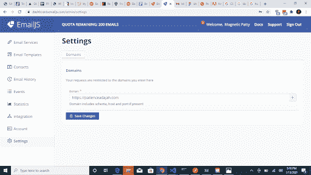
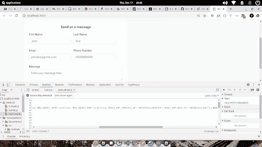

# 在前端开发中管理和存储秘密的最佳实践

> 原文：<https://blog.logrocket.com/best-practices-for-managing-and-storing-secrets-in-frontend-development/>

## 前端开发的秘密

在前端开发中，必须采取适当的措施来确保秘密和凭证得到适当的存储和管理，因为它们有可能导致鲁莽实践的大破坏。在本文中，我们将探讨管理秘密和密钥的最佳方式，通常是通过 API。

API 可以是私有的，也可以是公共的。私有 API 由组织内部的开发人员开发和托管，组织外部的开发人员不共享或使用它们。私有 API 很容易管理，因为开发人员可以完全控制如何使用它开发应用程序。

私有 API 的一个很好的例子是后端开发人员开发的 API，它允许您(前端开发人员)访问您组织的数据。因为私有 API 是受限制的，所以在使用 API 之前不需要包含密钥或秘密。

另一方面，公共 API 是由第三方提供的服务，它是公开可用的，并提供对专有软件应用程序或 web 服务的访问。顾名思义，公共 API 对开发它的组织内外的所有开发人员都是可用的。

它们允许开发人员利用已经可用的特性来增强他们的应用程序，而不是从头开始构建那些特性。公共 API 的一个很好的例子是 Google Maps API，它允许开发者在他们的应用程序中使用 Google Maps。

一些服务提供商终身免费提供他们的公共 API，而另一些则根据特定数量的请求付费或免费。为了进行有效的授权和身份验证，API 提供者使用对 API 的每个用户都是唯一的密钥和凭证秘密。这些密钥和秘密必须被安全地管理和存储，因为如果它们落入坏人之手，它们可能会带来严重的挑战。

## 因机密泄露而可能出现的潜在问题

没有正确存储的 API 密钥和凭证机密可能会导致财务、监管或声誉损失。

*   如果像谷歌云平台(GCP)这样的第三方服务提供商以有限的费率提供对其服务的访问，如果您的秘密被暴露，您可能会被拒绝访问该服务，因为未经授权的用户代表您执行了如此多的请求，从而超出了您的限制。除了超出你的限额之外，账单可能会激增
*   如果您的凭据机密被泄露，并且您的应用程序违反了 API 提供者使用条款，API 提供者可能会取消您对他们服务的访问
*   最后，你失去了对资源的控制；黑客可以直接指示提供商，绕过您的业务逻辑，此外，他们还可以访问敏感数据

## 不良做法

### 将您的凭据秘密直接嵌入到代码中

我将在下面的代码片段中使用 React，但是这些原则也可以应用于普通的 JavaScript 和其他框架:

```
import React from "react";

const index = () => {
 const Api_key = "1234567"

 return(
   <>
   <p>Hello, Secrets </p>
   </>
 )
}
export default index;

```

这是一种不好的做法，因为您的凭据机密可以很容易地从浏览器中用开发工具提取出来:

*   检查网页或`Control+Shift+I`
*   转到**源**选项卡
*   点击`static/js`
*   点击`main.chunk.js`

您会发现您的凭证是秘密的，任何人都很容易窃取:


### 将您的代码库上传到 Git 或 GitHub，并将您的秘密直接放在代码中

```
import emailjs from ‘emailjs-com’
function App(){
    const handleSubmit = (e) => {
 e.preventDefault(); 

 emailjs
   .sendForm(`gmail`, "876TY43sa23r56y789", e.target, process.env.REACT_APP_USER_ID)
   .then(
     (result) => {
alert("Message Sent, We will get back to you shortly",     result.text);
     },
     (error) => {
       alert("An error occured, Please try again", error.text);
     }
   );
};

    return(
    <>
    <form onSubmit={handleSubmit}>
<input name="name"/>
<input name="email"/>
<button type="submit">Submit</button>
</form>
    </>
)
}
export default App;

```

这也是一种不好的做法，因为任何人都可以在线访问您的存储库。即使您的存储库是私有的，一些黑客也会使用 GitHub 爬虫来搜索存储库以获取凭证机密。解决这个问题的一个好办法是将您的凭证秘密存储在一个`.env`文件中，我们将在下一节中看到。

如果您在任何时候将 API 凭证提交并推送到 Git repo，您应该尽快重置密钥。这可以通过从 API 服务提供者访问仪表板来完成，或者通过使用 Git rebase 删除添加了键的特定提交来删除它的所有痕迹。

### 不对您的 API 密钥或秘密设置限制

大多数 API 服务提供商允许您通过设置每天的请求数量限制和可以访问 API 的特定 URL 来限制使用。从下图可以看出，没有保存任何域，因此可以从任何具有 API 凭证的 URL 发送请求:


## 良好做法

### 对 API 密钥设置限制

一些服务提供商允许您对 API 密钥的使用设置限制，以便只能从您指定的 URL 访问 API 密钥。这意味着即使黑客获得了你的密钥，它也是无用的；它只能与指定的 URL 一起使用。

您还可以为 API 凭证的使用设置每日限制。在下图中，只能向指定的 URL 发出对 API 的请求:



### 在环境变量(`.env`)文件中隐藏您的密钥

使用一个`.env`文件，你的秘密不直接在你的代码中。这对于 Git 来说尤其重要。您可以将代码上传到 Git，并将`.env`文件添加到您的`.gitignore`文件中。这样，你的`.env`文件就不会被提交到 GitHub。这可以通过以下步骤完成:

*   在项目的根目录下创建一个`.env`文件:

    ```
    - your_react_project_folder  - public  - src  - node_modules  - .env         <-- your .env file  - .gitignore  - package-lock.json  - package.json 
    ```

*   In the `.env` file, add `REACT_APP_` as a prefix to your API key name and set the value (for React applications) and `VUE_APP_` as a prefix to your API key name and set the value (for Vue applications). This allows the frameworks to identify the variables:

    ```
    # .env

    REACT_APP_YOUR_API_KEY_NAME=your_api_key  <-- for react apps
    VUE_APP_YOUR_API_KEY_NAME=your_api_key <-- for vue apps

    # Example:
    REACT_APP_TEMPLATE_ID=98765432123456789
    REACT_APP_USER_ID=98765432123567
    VUE_APP_USER_ID=98765432123456789

    ```

    添加。env 文件到您的。gitignore 文件，这样您的。env 文件未提交给 git，当您将 repo 推送到 GitHub 时，这会隐藏您的 API 密钥:

    ```
    #.gitignore file

    # dependencies
    /node_modules

    # env
    .env

    ```

现在，您可以在代码中使用 API 键，方法是在它后面加上`process.env`:

```
//app.js
//here I used api keys from emailjs already declared in the .env file.
import emailjs from ‘emailjs-com’
function App(){
    const handleSubmit = (e) => {
 e.preventDefault(); 

 emailjs
   .sendForm(`gmail`, process.env.REACT_APP_TEMPLATE_ID, e.target, process.env.REACT_APP_USER_ID)
   .then(
     (result) => {
alert("Message Sent, We will get back to you shortly",     result.text);
     },
     (error) => {
       alert("An error occured, Plese try again", error.text);
     }
   );
};

    return(
    <>
    <form onSubmit={handleSubmit}>
        <input name="name"/>
        <input name="email"/>
        <button type="submit">Submit</button>
        </form>
    </>
)
}
export default App;

```

这是一种很好的做法，但不是非常安全的做法，因为您的 API 密钥在浏览器开发工具中仍然可见。您的 API 凭证仍将成为构建的一部分，并且将对检查您的文件的任何人可见，就像我们之前所做的一样。

您将在开发工具的`.env`文件中找到定义的 API 键:



### 使用秘密扫描解决方案(如 GitGuardian)扫描 Git 库

秘密扫描工具是扫描 GitHub、GitLab 或 Bitbucket 上的远程存储库中的 Git 提交的工具，以检查意外提交的秘密。这有助于防止敏感信息暴露给远程存储库。有了这些解决方案，提交给回购的机密将被自动检测和捕获。

要为您的项目设置 GitGuardian:

*   选择合适的计划并在 [GitGuardian](https://www.gitguardian.com) 上创建一个账户
*   确认您的电子邮件并登录您的仪表板
*   在你的仪表盘上，进入**集成****源监控****安装**(到你的基于网络的 repo: GitHub，GitLab，Github Enterprise)
*   一旦你安装了它，从你的仓库中选择项目
*   GitGuardian 扫描回购协议，并向您发送电子邮件，通知您可能的秘密泄露

### 不共享 GitHub 凭据

不要与开发团队以外的任何人共享 GitHub 凭据，并确保撤销不再在您团队工作的开发人员的访问权限。

## 结论

保护 API 密钥和秘密在前端应用程序中非常重要。将秘密存储在一个`.env`文件中是好的，但是仅仅这样是不安全的。请务必对您的密钥设置限制。有了这个，即使你的秘密被泄露了，它在任何能接触到它的人手中也是无用的。

一个额外的安全层是使用秘密扫描服务来扫描您的存储库。使用本文中强调的实践来确保在处理项目时敏感数据得到保护。感谢阅读。

## 使用 [LogRocket](https://lp.logrocket.com/blg/signup) 消除传统错误报告的干扰

[](https://lp.logrocket.com/blg/signup)

[LogRocket](https://lp.logrocket.com/blg/signup) 是一个数字体验分析解决方案，它可以保护您免受数百个假阳性错误警报的影响，只针对几个真正重要的项目。LogRocket 会告诉您应用程序中实际影响用户的最具影响力的 bug 和 UX 问题。

然后，使用具有深层技术遥测的会话重放来确切地查看用户看到了什么以及是什么导致了问题，就像你在他们身后看一样。

LogRocket 自动聚合客户端错误、JS 异常、前端性能指标和用户交互。然后 LogRocket 使用机器学习来告诉你哪些问题正在影响大多数用户，并提供你需要修复它的上下文。

关注重要的 bug—[今天就试试 LogRocket】。](https://lp.logrocket.com/blg/signup-issue-free)