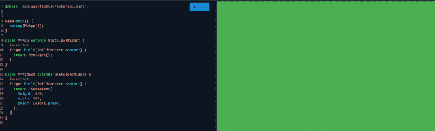
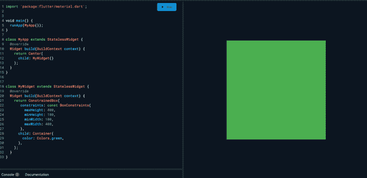

# 布局你的 Flutter 应用程序的最佳实践

> 原文：<https://blog.logrocket.com/best-practices-laying-out-flutter-app/>

Flutter 中的几乎所有东西都是一个小部件，当您编写小部件时，您可以构建一个布局。例如，您可以在 column 小部件中添加几个小部件来创建垂直布局。随着您继续添加更多的小部件，您的 Flutter 应用程序布局将变得越来越复杂。

在本文中，我将介绍一些在设计 Flutter 应用程序时要实施的最佳实践。

## 在颤振中使用`SizedBox`代替`Container`

在很多情况下，您需要使用占位符。让我们看看下面的例子:

```
return _isLoaded ? Container() : YourAwesomeWidget();

```

`Container`是一个很棒的小部件，你会在 Flutter 中广泛使用。 [`Container()`](https://api.flutter.dev/flutter/widgets/Container/Container.html) 扩展以适应父节点提供的约束，并且不是`const`构造函数。

另一方面， [`SizedBox`](https://api.flutter.dev/flutter/widgets/SizedBox/SizedBox.html) 是一个`const`构造函数，创建一个固定大小的盒子。[宽度](https://api.flutter.dev/flutter/widgets/SizedBox/width.html)和[高度](https://api.flutter.dev/flutter/widgets/SizedBox/height.html)参数可以为空，表示盒子的大小不应该被约束在相应的维度中。

因此，当我们实现一个占位符时，应该使用`SizedBox`而不是`Container`。

```
return _isLoaded ? SizedBox() : YourAwesomeWidget();

```

## 使用`if`条件代替三元运算符语法

在布局一个 Flutter 应用程序时，通常情况下，您希望有条件地呈现不同的小部件。您可能需要基于平台生成一个小部件，例如:

```
Row(
  children: [
    Text("Majid"),
    Platform.isAndroid ? Text("Android") : SizeBox(),
    Platform.isIOS ? Text("iOS") : SizeBox(),
  ]
);

```

在这种情况下，您可以删除三元运算符，并利用 Dart 的内置语法在数组中添加一个`if`语句。

```
Row(
  children: [
    Text("Majid"),
    if (Platform.isAndroid) Text("Android"),
    if (Platform.isIOS) Text("iOS"),
  ]
);

```

您还可以使用 spread 操作符扩展这个特性，并根据需要加载几个小部件。

```
Row(
  children: [
    Text("Majid"),
    if (Platform.isAndroid) Text("Android"),
    if (Platform.isIOS) ...[
      Text("iOS_1")
      Text("iOS_2")
    ],
  ]
);

```

## 考虑成本的`build()`法在颤振中的应用

当祖先小部件正在重建小部件时，Flutter 小部件中的`build`方法可能会被频繁调用。在`build()`方法中避免重复和昂贵的工作是很重要的。

一个例子是当你使用一个方法而不是在你的应用程序中创建小部件。让我详细说明一下:

```
class MyAwesomeWidget extends StatelessWidget {
  @override
  Widget build(BuildContext context) {
    return Scaffold(
      body: Column(
        mainAxisSize: MainAxisSize.min,
        children: [
          _buildHeaderWidget(),
          _buildBodyWidget(context),
          _buildFooterWidget(),
        ],
      ),
    );
  }

  Widget _buildHeaderWidget() {
    return Padding(
      padding: const EdgeInsets.all(10.0),
      child: FlutterLogo(
          size: 50.0,
      ),
    );
  }

  Widget _buildBodyWidget(BuildContext context) {
    return Expanded(
      child: Container(
        child: Center(
          child: Text(
            'Majid Hajian, Flutter GDE',
          ),
        ),
      ),
    );
  }

  Widget _buildFooterWidget() {
    return Padding(
      padding: const EdgeInsets.all(10.0),
      child: Text('Footer'),
    );
  }
}

```

这种方法的缺点是当`MyAwesomeWidget`需要重新构建时——这可能经常发生——在方法中创建的所有小部件也将被重新构建，导致浪费 CPU 周期和内存。

因此，最好通过以下方式将这些方法转换成`StatelessWidgets`:

```
class MyAwesomeWidget extends StatelessWidget {
  @override
  Widget build(BuildContext context) {
    return Scaffold(
      body: Column(
        mainAxisSize: MainAxisSize.min,
        children: [
          HeaderWidget(),
          BodyWidget(),
          FooterWidget(),
        ],
      ),
    );
  }
}

class HeaderWidget extends StatelessWidget {
  @override
  Widget build(BuildContext context) {
    return Padding(
      padding: const EdgeInsets.all(10.0),
      child: FlutterLogo(
          size: 50.0,
      ),
    );
  }
}

class BodyWidget extends StatelessWidget {
  @override
  Widget build(BuildContext context) {
    return Expanded(
      child: Container(
        child: Center(
          child: Text(
            'Majid Hajian, Flutter GDE',
          ),
        ),
      ),
    );
  }
}

class FooterWidget extends StatelessWidget {
  @override
  Widget build(BuildContext context) {
    return Padding(
      padding: const EdgeInsets.all(10.0),
      child: Text('Footer'),
    );
  }
}

```

所有的`StatefulWidgets`或`StatelessWidgets`，基于键、小部件类型和属性，都有一个特殊的缓存机制，只在必要时才重建。我们甚至可以通过添加`const`来优化这些小部件，这将引导我们进入本文的下一部分。

## 尽可能使用`const`部件

在 Dart 中，尽可能使用`const`构造函数是一个好习惯，并且记住编译器会优化你的代码。现在，让我们回顾一下上面的例子。通过一个简单的步骤，我们可以使构建方法更加有效地工作:

```
class MyAwesomeWidget extends StatelessWidget {
  @override
  Widget build(BuildContext context) {
    return Scaffold(
      body: Column(
        mainAxisSize: MainAxisSize.min,
        children: [
          const HeaderWidget(),
          const BodyWidget(),
          const FooterWidget(),
        ],
      ),
    );
  }
}

class HeaderWidget extends StatelessWidget {
  const HeaderWidget();
  @override
  Widget build(BuildContext context) {
    return Padding(
      padding: const EdgeInsets.all(10.0),
      child: FlutterLogo(
          size: 50.0,
      ),
    );
  }
}

class BodyWidget extends StatelessWidget {
  const BodyWidget();
  @override
  Widget build(BuildContext context) {
    return Expanded(
      child: Container(
        child: Center(
          child: Text(
            'Majid Hajian, Flutter GDE',
          ),
        ),
      ),
    );
  }
}

class FooterWidget extends StatelessWidget {
  const FooterWidget();
  @override
  Widget build(BuildContext context) {
    return Padding(
      padding: const EdgeInsets.all(10.0),
      child: Text('Footer'),
    );
  }
}

```

这个改变看起来很简单，但是它帮助我们避免了重新构建`const`小部件。

## 长列表的`ListView`中的编码`itemExtent`

为了理解如何最好地使用 [`itemExtent`](https://api.flutter.dev/flutter/widgets/ListView/itemExtent.html) ，假设我们有一个包含几千个元素的列表，当一个动作被触发时，例如当一个按钮被点击时，我们需要跳转到最后一个元素。这里是`itemExtent`可以大幅提高布局`ListView`的性能的时候。

指定一个`itemExtent`比让孩子决定他们的范围更有效，因为滚动机器可以使用孩子范围的预知来节省工作，就像这样:

```
class LongListView extends StatelessWidget {
  final _scrollController = ScrollController();
  @override
  Widget build(BuildContext context) {
    return Scaffold(
      floatingActionButton: FloatingActionButton(onPressed:() {
        _scrollController.jumpTo(
          _scrollController.position.maxScrollExtent,
        );
      }),
      body: ListView(
        controller: _scrollController,
        children: List.generate(10000, (index) => Text('Index: $index')),
        itemExtent: 400,
      ),
    );
  }
}

```

## 避开大树

对于何时将小部件拆分成更小的小部件，没有硬性规定。但是，最好避免大树，因为有以下好处:

*   提高可重用性
*   提供更清晰的代码
*   增强可读性
*   启用封装
*   提供缓存机制

所以，你应该尽可能地将你的代码分成不同的部件。

## 理解颤振中的约束

每个 Flutter 开发人员都必须知道的 Flutter 布局的黄金法则是:约束减少，尺寸增加，父元素设置位置。

我们来分析一下。

小部件从其父部件获得自己的约束。约束只是一组四个双精度值:最小和最大宽度，以及最小和最大高度。

然后，小部件遍历它自己的子列表。小部件一个接一个地告诉它的孩子它们的约束条件是什么(每个孩子的约束条件可能不同)，然后询问每个孩子它想要多大。

接下来，小部件逐个定位其子部件(水平放置在`x`轴上，垂直放置在`y`轴上)。最后，小部件告诉它的父部件它自己的大小(当然，在原始约束内)。

在 Flutter 中，所有的窗口小部件都基于父窗口或它们的盒子约束来呈现它们自己。这有一些限制。例如，假设您在父部件中有一个子部件，您想决定它的大小。小工具不能有任何大小！大小必须在其父级设置的约束范围内。

与第一个例子类似，小部件不知道自己在屏幕上的位置，因为这是父部件的决定。

也就是说，如果一个子部件决定了不同于其父部件的尺寸，而父部件没有足够的信息来对齐它，那么子部件的尺寸可能会被忽略。

好了，让我们来看看实际情况。

```
void main() {
  runApp(MyApp());
}

class MyApp extends StatelessWidget {
  @override
  Widget build(BuildContext context) {
    return MyWidget();
  }
}

class MyWidget extends StatelessWidget {
  @override
  Widget build(BuildContext context) {
    return ConstrainedBox(
       constraints: const BoxConstraints(
         maxHeight: 400,
         minHeight: 100,
         minWidth: 100,
         maxWidth: 400,
       ),
      child: Container(
        color: Colors.green,
      ),
    );
  }
}

```

如果您愿意，可以忽略`ConstrainedBox`并将高度和小部件添加到`Container`。

```
class MyWidget extends StatelessWidget {
  @override
  Widget build(BuildContext context) {
    return  Container(
      height: 400, 
      width: 400,
      color: Colors.green,
    );
  }
}

```

您可能希望上面的代码呈现一个最大高度和宽度为`400`的绿色`Container`。然而，当您运行这段代码时，您会感到惊讶。



整个屏幕都将是绿色的！我不会在这里深入讨论细节，但是在构建 Flutter 布局时，您可能会看到几个类似的问题。

让我们看看这是怎么回事。在上面的例子中，树看起来像这样:

```
    - `MyApp`
    - `MyWidget`
    - `ConstrainedBox`
    - `Container`

```

约束规则将从父部件传递给子部件，因此子部件可以在父部件给定的约束内决定其大小。因此，约束是适用的。

因此，Flutter 将一个[紧约束](https://api.flutter.dev/flutter/rendering/BoxConstraints/BoxConstraints.tight.html)传递给`MyApp()`，然后`MyApp()`将其紧约束传递给`ConstrainedBox`。然后，`ConstrainedBox`被迫忽略它自己的约束，将使用它的父元素，在本例中，它是全屏大小，这就是为什么你会看到一个全屏的绿色框。

通常，您会发现添加一个`Center`小部件可能会解决这个问题。让我们试一试:

```
class MyApp extends StatelessWidget {
  @override
  Widget build(BuildContext context) {
    return Center(
      child: MyWidget()
    );
  }
}

```

瞧啊。修好了！



`Center`小部件从`MyApp()`获取一个紧约束，并将其转换为其子部件`ConstrainedBox`的[松约束](https://api.flutter.dev/flutter/rendering/BoxConstraints/BoxConstraints.loose.html)。因此，`Container`遵循`ConstraiedBox`给出的约束，因此`Container`将应用最小和最大尺寸。

在我们结束本节之前，让我快速地深入解释一下什么是紧约束和松约束。

紧约束提供了一种可能性—精确的大小，这意味着它的最大宽度等于它的最小宽度，它的最大高度等于它的最小高度。

如果您转到 Flutter 的`box.dart`文件并搜索`BoxConstraints`构造函数，您会发现如下内容:

另一方面，宽松的约束设置最大宽度和高度，但允许小部件想多小就有多小。它的最小宽度和高度都等于`0`:

```
BoxConstraints.tight(Size size)
   : minWidth = size.width,
     maxWidth = size.width,
     minHeight = size.height,
     maxHeight = size.height;

```

如果你重温上面的例子，它告诉我们,`Center`允许绿色的`Container`比屏幕小，但不是比屏幕大。当然，`Center`通过将松散的约束传递给`Container`来做到这一点。

```
BoxConstraints.loose(Size size)
   : minWidth = 0.0,
     maxWidth = size.width,
     minHeight = 0.0,
     maxHeight = size.height;

```

结论

## 在本文中，我提到了在开始构建 Flutter 应用程序时应该采取的一些最佳实践。然而，还有更多的——更先进的——实践需要考虑，我建议你查看一下 [Flutter 的完整文档](https://flutter.dev/docs)。快乐编码。

使用 [LogRocket](https://lp.logrocket.com/blg/signup) 消除传统错误报告的干扰

## [LogRocket](https://lp.logrocket.com/blg/signup) 是一个数字体验分析解决方案，它可以保护您免受数百个假阳性错误警报的影响，只针对几个真正重要的项目。LogRocket 会告诉您应用程序中实际影响用户的最具影响力的 bug 和 UX 问题。

[](https://lp.logrocket.com/blg/signup)

然后，使用具有深层技术遥测的会话重放来确切地查看用户看到了什么以及是什么导致了问题，就像你在他们身后看一样。

LogRocket 自动聚合客户端错误、JS 异常、前端性能指标和用户交互。然后 LogRocket 使用机器学习来告诉你哪些问题正在影响大多数用户，并提供你需要修复它的上下文。

关注重要的 bug—[今天就试试 LogRocket】。](https://lp.logrocket.com/blg/signup-issue-free)

Focus on the bugs that matter — [try LogRocket today](https://lp.logrocket.com/blg/signup-issue-free).