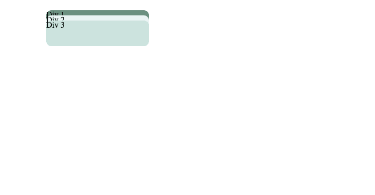
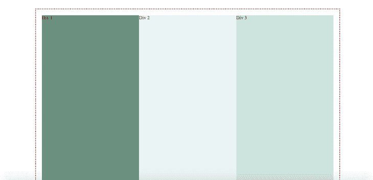
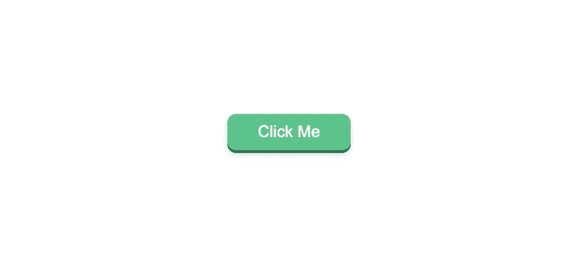
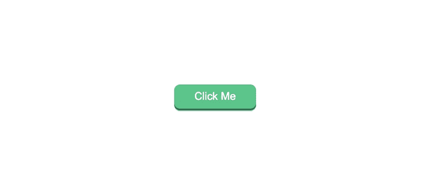

# CSS 中堆叠元素的最佳实践

> 原文：<https://blog.logrocket.com/best-practices-stacking-elements-css/>

在前端开发中，堆叠的概念是根据 HTML 元素在一个假想的 z 轴上的值，按优先级顺序对它们进行排序。堆叠顺序经常受到一些 CSS 属性的值的影响，比如`position`、`z-index`、`opacity`等等。

在本教程中，我们将展示一些使用堆叠技术在 HTML 中构建令人惊叹的 ui 的最佳实践。

### 先决条件

要跟随本教程，您需要:

*   对 web 开发的基本理解
*   熟悉 CSS 和 HTML
*   系统中安装的网络浏览器，例如 Chrome
*   安装在开发机器上的代码编辑器，例如 VS Code

在我们真正开始之前，让我们考虑两种情况:

1.  您想要创建两个重叠的元素。为此，您只需将第一个元素的`position`设置为`relative`，并将后者设置为绝对值，对吗？
2.  假设你想在你的网页上添加一个粘性的`navbar`。为此，您只需将其`z-index`设置为高于所有其他元素的值。

在这两种情况之间是 CSS 中堆栈的威力。记住这条线索，让我们更深入地探索如何使用 CSS 堆叠技术构建简单和复杂的重叠 ui。

## 使用 CSS `position`属性堆叠

在这一节中，我们将使用`position`属性用 HTML 和 CSS 构建三个重叠的 div。

首先，在您的工作目录中创建一个名为`stacking_with_position_property`的新文件夹。导航到文件夹并创建两个文件:`index.html`和`styles.css`。

接下来，在代码编辑器中打开`index.html`,添加下面的代码:

```
<html lang="en">
  <head>
    <meta charset="UTF-8" />
    <meta http-equiv="X-UA-Compatible" content="IE=edge" />
    <meta name="viewport" content="width=device-width, initial-scale=1.0" />
    <title>Stacking with Position Property</title>
  </head>
  <body></body>
</html>
```

接下来，让我们将`stylesheet`链接到`index.html`。将下面的代码添加到 HTML 文件的`head`部分:

```
<head>
...
<link rel="stylesheet" href="styles.css">
...
</head>
```

现在让我们开始构建 HTML 元素。将下面的代码添加到`body`标签中，以创建三个 div:

```
<div class="rectangle_wrapper">
      <div class="rectangle1">Div 1</div>
      <div class="rectangle2">Div 2</div>
      <div class="rectangle3">Div 3</div>
</div>
```

在这里，我们创建了一个包装器来保存类名为`rectangle1`、`rectangle2`和`rectangle3`的三个 div。

接下来，打开`styles.css`，添加下面的代码来覆盖浏览器的默认`padding`和`margin`:

```
* {
  padding: 0;
  margin: 0;
  box-sizing: border-box;
}
body {
  max-width: 1100px;
  margin: 0 auto;
}
```

这里我们使用`*`关键字将所有默认的`margin`和`padding`设置为`0`。然后，我们使用`body`关键字将网页的`max-width`设置为`1100px`，以确保浏览器视窗中的所有元素不会溢出到极限。

接下来，将下面的 CSS 添加到`styles.css`中，以设置 div 的样式:

```
...
.rectangle_wrapper {
  height: 50px;
  width: 200px;
  position: relative;
}
.rectangle1,
.rectangle2,
.rectangle3 {
  position: absolute;
  width: 100%;
  height: 100%;
  border-radius: 10px;
}
.rectangle1 {
  top: 20px;
  background: #6b9080;
}
.rectangle2 {
  top: 30px;
  background: #eaf4f4;
}
.rectangle3 {
  top: 40px;
  background: #cce3de;
}
```

现在，如果你在浏览器中打开`index.html`，网页应该看起来像下面的截图:



现在您知道了如何使用 CSS `position`属性在 HTML 中堆叠多个元素。

这个例子之所以成为可能，是因为我们向父元素添加了`position: relative`。每当一个元素被设置为`position: relative`时，该 div 中带有`position: absolute`的所有其他元素都将被绝对相对于该单元放置。

这是一个堆叠元素的老概念，但是它在所有浏览器中都工作得很好，所以强烈推荐它。

## 使用 CSS 网格堆叠

CSS 网格是现代 web 开发中一种常见的元素堆叠方法。它允许使用网格布局，用最少的代码在网页中轻松放置元素。在这一节中，我们将演示如何通过增强我们在上一节中创建的元素来使用 CSS 网格堆叠元素。

再次导航到您在上一节中创建的`stacking_with_position_property`文件夹。复制 HTML 和 CSS 文件，删除除了关键字`*`和`body`之外的所有 CSS 文件。

现在让我们将下面的代码添加到`styles.css`:

```
.rectangle_wrapper{
    height: 100%;
    display: grid;
    grid-template-columns: repeat(1fr, 3);
    grid-template-areas: "rec1 rec2 rec3";
    border: 3px dotted brown;
    padding: 20px;
    margin: 30px;
}
.rectangle1{
    width: 100%;
    grid-area: rec1 ;
    background: #6b9080;
}
.rectangle2{
    width: 100%;    
    grid-area: rec2 ;
    background: #eaf4f4;
}
.rectangle3{
    width: 100%;
    grid-area: rec3 ;
    background: #cce3de;
}
```

首先，我们将`rectangle_wrapper`类设置为`display: grid`。然后我们将`grid-template-column`设置为`repeat(1fr, 3)`，它在三列中重复一个片段。接下来，我们用`grid-template-areas`定义了网格列(`rec1 rec2 rec3`)，然后将每个矩形类`grid-area`设置为其对应的列。

有了这种样式，每个 rectangle 类都成为了`rectangle_wrapper`的直接子类，允许矩形堆叠成一条水平线。

在浏览器中打开`index.html`。该网页应该类似于下面的截图:



请注意，需要给父类一个相对位置，因为它自动允许其降序元素重叠。CSS grid 可以用来创建三维布局，父单元内的所有元素都会相对于父单元是绝对的。

## 将所有这些放在一起:构建一个 3D 按钮

在这一节中，我们将使用上面演示的技术来构建一个 3D 按钮。下面是最终按钮的外观:



你可能想知道为什么我们没有使用像`box-shadow`或`border`这样的属性来设计上面的例子。原因是设置这些属性的动画开销很大，并且没有为平滑过渡腾出空间。

复制一份`index.html`文件，并用下面的代码替换`body`标签中的代码:

```
<button class="clickable">
      <span class="front"> Click Me </span>
</button>
```

接下来，用下面的代码替换`styles.css`中的代码:

```
* {
  padding: 0;
  margin: 0;
  box-sizing: border-box;
}
body {
  max-width: 1100px;
  display: flex;
  justify-content: center;
  align-items: center;
  justify-items: center;
}
```

在这里，我们将`body`伪类设置为`display:flex`、`justify-content: center`、`align-items: center`和`justify-items: center`。这将确保它的所有后代都位于网页的中心。

接下来，将以下代码添加到`styles.css`中，以创建按钮 MVP:

```
...
.clickable {
  background: #2d6a4f;
  border-radius: 12px;
  border: none;
  padding: 0;
  cursor: pointer;
  outline-offset: 4px;
}
.front {
  display: block;
  padding: 12px 42px;
  border-radius: 12px;
  font-size: 1.4rem;
  color: #fff;
  background: #52b788;
  transform: translateY(-6px);
}
.clickable:active .front {
  transform: translate(-2px);
}
```

`button`元素有一个深绿色的背景，代表按钮的底层。我们已经通过指示`border:none`移除了按钮的默认边框。`.front`类代表按钮的前景层，它有一个较浅的绿色阴影作为背景。

每当按钮处于其`:active`状态时，我们使用`transform: translate` CSS 属性来创建滑动效果。按钮的最终 MVP 应该类似于下面的屏幕截图:


按钮看起来已经是 3D 的了！接下来，让我们给按钮添加一个悬停状态。将下面的代码添加到`styles.css`以创建一个`hover`效果:

```
...
.front{
  ...
  will-change: transform;
  transition: transform 250ms;
}
.clickable:hover .front {
  transform: translateY(-8px);
}
```

注意，我们添加了`will-change:transform`属性。这是允许悬停动画被硬件加速的最佳实践。最终结果应该类似于下面的 gif:


接下来，让我们为按钮添加阴影以增强 3D 效果。为了实现这一点，我们必须重组`index.html`中的标记:

```
<button class="clickable">
      <span class="shadow"></span>
      <span class="edge"></span>
      <span class="front"> Click Me </span>
</button>
```

之前的`.clickable`类是边缘层。随着两层的引入，我们必须使用`position: relative`使`.clickable`类成为`.shadow`、`.edge`和`.front`类的父类。

用下面的代码替换`.clickable`和`.front`类的代码:

```
.clickable {
  position: relative;
  background: transparent;
  border: none;
  padding: 0;
  cursor: pointer;
}
.front {
  display: block;
  padding: 12px 42px;
  border-radius: 12px;
  font-size: 1.4rem;
  color: #fff;
  background: #52b788;
  transform: translateY(-4px);
  will-change: transform;
  transition: transform 250ms;
}
```

我们只是使用我们之前讨论过的堆叠技术，通过将`.clickable`类设置为`position: relative`来堆叠按钮层。这样做，我们意味着每个下行元素都应该放在它的上面。

让我们添加`.shadow`和`.edge`类以及它们的`hover`效果:

```
.shadow {
  position: absolute;
  top: 0;
  left: 0;
  width: 100%;
  height: 100%;
  border-radius: 12px;
  transform: translateY(2px);
  background: #ced4da;
}
.edge {
  position: absolute;
  top: 0;
  left: 0;
  width: 100%;
  height: 100%;
  border-radius: 12px;
  background: #2d6a4f;
}
.clickable:hover .front {
  transform: translateY(-6px);
}
.clickable:hover .shadow {
  transform: translateY(4px);
}
.clickable:active .front {
  transform: translate(-2px);
}
.clickable:active .shadow {
  transform: translate(1px);
}
```

这里，我们强迫`.shadow`和`.edge`类接受它们的父类`width`和`height`的`100%`，在本例中，父类是`.clickable`类。我们还设置了它们的`top:0`和`left:0`，以确保它们位于其父类的中心，没有默认边距。

每当用户悬停按钮时，`.shadow`类向下移动`4px`，而`.front`类向上移动`6px`，显示出`.edge`类。当鼠标悬停时，按钮看起来应该像下面的 gif:



我们仅仅依靠 DOM 顺序来堆叠 HTML 元素——不需要`z-index`。这揭示了在 CSS 中堆叠和定位重叠元素的最佳实践。

我们可以通过给`.shadow`类添加一个`blur`效果来完成这个按钮，让它看起来更柔和，更吸引人。将以下代码添加到`.shadow`类中:

```
.shadow {
...
  filter: blur(4px);
}
```

按钮的最终结果应该是这样的:


你可以在这里看一下本节的[完整源代码。整个项目在这个 GitHub repo](https://github.com/emmanueletukudo/stacking-css-elements/tree/main/3D_button_with_css) 中[可用。](https://github.com/emmanueletukudo/stacking-css-elements.git)

## 结论

使用本教程中学习的技术，您可以在新的和现有的 web 应用程序中，仅使用 CSS 和 HTML 来实现具有 3D 效果的复杂重叠元素。

如果你想建立在我们今天讨论的原则上，你可能想尝试实现一个粘性头，或者两个重叠的轮子，一个顺时针旋转，另一个逆时针旋转。本教程中的指导方针是你的最佳选择——让我知道它的进展。

## 你的前端是否占用了用户的 CPU？

随着 web 前端变得越来越复杂，资源贪婪的特性对浏览器的要求越来越高。如果您对监控和跟踪生产环境中所有用户的客户端 CPU 使用、内存使用等感兴趣，

[try LogRocket](https://lp.logrocket.com/blg/css-signup)

.

[](https://lp.logrocket.com/blg/css-signup)[https://logrocket.com/signup/](https://lp.logrocket.com/blg/css-signup)

LogRocket 就像是网络和移动应用的 DVR，记录你的网络应用或网站上发生的一切。您可以汇总和报告关键的前端性能指标，重放用户会话和应用程序状态，记录网络请求，并自动显示所有错误，而不是猜测问题发生的原因。

现代化您调试 web 和移动应用的方式— [开始免费监控](https://lp.logrocket.com/blg/css-signup)。