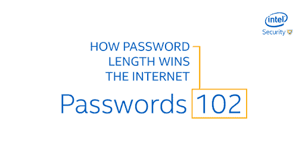

# Web3 提供商的最佳实践

> 原文：<https://blog.logrocket.com/best-practices-web3-providers/>

互联网从诞生之日起就一直在变化，从 web1 到 web2 再到 web3。Web3 是互联网的最新版本，建立在去中心化的互联网、没有严格治理的智能交易和人工智能的基础上。

区块链是 Web3 传播的领先技术。由于 Web3 仍然非常新，区块链已经运行了一段时间，由于其工作方式和给用户带来的好处而变得流行。

进入区块链空间可能是困难和令人生畏的，因为它的新概念和不断更新。赶上这项技术似乎是一件痛苦的事情，但是像 Web3 这样的技术使得与区块链的交互变得更容易，也更便宜。

本文的目的是理解 Web3 及其优势，包括用例及最佳实践。虽然许多人声称 Web3 是未来，但有多少人真正知道它是如何工作的或它的目的是什么？这篇文章应该会对这个问题给出一些答案。

总之，我们将回顾:

要阅读本文，您需要具备以下基本知识:

*   区块链
*   以太坊
*   智能合同
*   web 开发中的 JavaScript

## Web3 优势

在采用任何概念的最佳实践之前，我们应该看看概念给我们带来的好处，所以让我们看看 Web3 给开发者带来的好处。

### 减少互联网审查

世界上有些国家对互联网和信息进行审查。有了 Web3，个人在保持匿名的同时保持了他们在线发布数据的所有权，从而减少了审查。

由于区块链是基于加密安全的数字身份设计的，创建者几乎不需要将其高度敏感/可追踪的个人数据归因于他们在线发布的数据。

因此，很难发现谁发布了这些数据，也很难控制创作者发布什么和不发布什么。

### 很少甚至没有中间商

在需要中介进行某些交易(如货币兑换、商业合同、持股等)的技术中，去中心化有助于创建智能合同来管理这些交易，而不需要任何中介。

通过定义执行交易必须满足的规则，Web3 可以构建应用软件，该应用软件可以通过智能合约应用二进制接口(ABI)和远程过程调用(RPC)与智能合约进行通信。

### 高度安全

由于大多数 Web3 应用程序都是基于区块链技术构建的，因此它们比传统应用程序更安全，因为区块链具有很高的防篡改质量。

### 合作和机会的空间

因为大多数 Web3 项目是开源的，所以有更多的创新空间，因为项目可以建立在其他项目上，或者资源可以从一个项目中挖掘并用于另一个项目。

例如，[像 Polkadot 这样的项目建立在 Web3](https://blog.logrocket.com/polkadot-blockchain-app-development-deployment/) 之上，但是也作为其他 Web3 项目的协议。

## Web3 使用案例

### 使用智能合同进行通信

智能合约是自动化的规则，确保交易中的所有协议都在没有任何中介的情况下得到满足。

由于这些智能合约部署在区块链上，因此 Web3 被设计为通过 Web 浏览器或客户端应用程序与这些智能合约进行通信。

### 分散财务(DeFi)应用

[DeFi 应用是建立在区块链技术基础上的金融应用](https://blog.logrocket.com/top-5-decentralized-app-development-frameworks/#defi),以保持其分散性，同时通过智能合同进行协调。

DeFi，听起来很常见，但却是一个很多人都会误解的概念。虽然金融是一个建立在信任基础上的概念，但当人们不知道到底是谁在控制他们的财务时，它又怎么可能是分散的呢？

因为 DeFi 使用智能合约来确保所有交易都得到履行，而不需要有人手动确认交易，所以 Web3 可以在构建 DeFi 应用程序时与这些智能合约进行通信。

### 分散式应用程序

DApps 与 DeFi 类似，但并不专门关注金融，它们也有在分散的服务器/运营节点上构建软件应用程序的习惯。

这些是分布式开源应用程序，运行在点对点区块链网络上，允许个人维护其数据的所有权。使用 Web3，用户可以在这些不同的网络或分散的节点/服务器上处理数据。

例如，Brave browser 和 BitTorrent 就是 DApps [的例子，其中数据传输在 P2P 网络](https://blog.logrocket.com/p2p-protocol-acceptance-state-modern-browsers/)上完成。

## Web3 最佳实践

在讨论了 Web3 的各种用例以及实际应用之后，有必要了解如何最好地实现这些应用。如今，最佳实践听起来微不足道，但我们不应该忽视它们。

有时，产品的安全性或可持续性依赖于构建产品的实践或方法。因此，让我们继续讨论使用 Web3 时的一些最佳实践。

### 使用复杂和简单的密码

是啊！密码既复杂又简单。这些密码应该简单，以便所有者可以轻松地记住它们，但要足够复杂，以便黑客或未经授权的人和软件能够访问/破解。

以下是通常确保密码既复杂又简单的一些注意事项:

*   使用熟悉的词(例如，宠物的名字、父母的名字或城镇的名字)
*   包括一组数字(例如，出生日期或结婚日期)
*   包括特殊字符
*   确保密码长度大于六个字符

还有一些平台可以帮助生成复杂但简单的密码:



英特尔创建的上的[图展示了破解密码，并比较了密码创建的复杂性和破解密码所需的时间。](https://cdn.discordapp.com/attachments/941362696874500149/946763542575607918/Passsword_gif.gif)

### 在应用程序中使用双因素身份验证

当今软件世界最棘手的威胁之一是社交黑客，他们使用视觉上相关的信息引诱用户向骗子提供他们的详细信息。

这经常发生在 Web3 领域，流行的应用程序被克隆，看起来几乎和真实的应用程序一模一样。然后，假冒应用程序收集用户的详细信息，以访问真实应用程序上的用户帐户。

双因素身份认证旨在减少骗子在这种情况下的访问权限，因为该过程验证的不仅仅是电子邮件或密码，例如验证用于身份认证的设备。

作为开发人员，您可以使用 SMS 令牌/基于 SMS 的多因素身份验证来实现双因素身份验证，或者实现生物特征身份验证。

### 不要把用户的钱存在交易所里

就区块链或加密而言，交换是黑客的高度目标。因此，如果你的应用程序持有用户的钱，最好把它们放在分散的钱包里(热钱包或冷钱包)，如 Metamask、Phantom 或任何其他可信任的钱包。

使用这些钱包意味着它们不太容易被黑客攻击，安全性更依赖于钱包的主人。作为处理用户令牌的开发人员，最好为应用程序准备一个钱包，用来存储令牌，而不是在交换中保存它们。

### 从制造商处购买硬件设备

这可能很困难，但是如果可能的话，直接从制造商那里购买硬件设备是很重要的，因为用于创建 Web3 项目的设备必须是安全的，没有漏洞。

因为公司可能会成为目标，并被出售能够窃取机密信息的窃听设备，所以通过直接从制造商那里购买设备来避免这种情况，这样就可以很容易地跟踪问题。

### 安全私钥或种子短语

使用 Web3 或 Web3 技术时，会有各种各样的事件，您必须为钱包或帐户生成私钥或种子短语。

例如，当用户创建一个新的钱包时，可以给用户一个短语的组合用于将来的认证。如果丢失，这些密钥可能无法找回，并且它们可能无法更改，这意味着没有未经授权的人可以访问这些详细信息。

作为开发人员，保护这类信息的最佳方式是将它们存储在本地托管的数据库中，这些数据库不能通过公共网络访问；它们可以被写在日记中并保持安全，或者使用基于硬件的保护，例如硬件安全模块(HSM)。

### 使用环境变量存储信息

将应用程序部署到生产环境中时，使用环境变量来存储像私钥这样的信息。

因为应用程序的源代码可能会被窃取，所以如果在代码中发现了这些细节，就可以使用它们来访问保存真实数据或财产的钱包或帐户。

例如，当在应用程序中使用像私钥这样的信息时，而不是像这样在代码中直接使用它们:

```
const secret_key = "acd1d7d1d92245bf0fe42370430e4b1e0bac8e79"
```

使用服务器中定义的环境变量，然后用变量 address 将其导入应用程序。

为此，首先在系统控制台中定义一个环境变量:

```
export SECRET_KEY="acd1d7d1d92245bf0fe42370430e4b1e0bac8e79"
```

然后，在应用程序中调用环境变量:

```
const secret_key = process.env.SECRET_KEY
```

## 结束语

采用这些最佳实践可以大大提高任何产品的可靠性。

至于安全性，再多的加密或认证也不能保证 100%的安全。本文中建议的实践有助于降低安全威胁的风险和可能性。

此外，在讨论了 Web3 的优势和使用案例后，每个人都应该接受这个概念，并了解如何最好地利用它来改善整个互联网和 Web 技术。

## 加入像 Bitso 和 Coinsquare 这样的组织，他们使用 LogRocket 主动监控他们的 Web3 应用

影响用户在您的应用中激活和交易的能力的客户端问题会极大地影响您的底线。如果您对监控 UX 问题、自动显示 JavaScript 错误、跟踪缓慢的网络请求和组件加载时间感兴趣，

[try LogRocket](https://lp.logrocket.com/blg/web3-signup)

.

[](https://lp.logrocket.com/blg/web3-signup)[https://logrocket.com/signup/](https://lp.logrocket.com/blg/web3-signup)

LogRocket 就像是网络和移动应用的 DVR，记录你的网络应用或网站上发生的一切。您可以汇总和报告关键的前端性能指标，重放用户会话和应用程序状态，记录网络请求，并自动显示所有错误，而不是猜测问题发生的原因。

现代化您调试 web 和移动应用的方式— [开始免费监控](https://lp.logrocket.com/blg/web3-signup)。