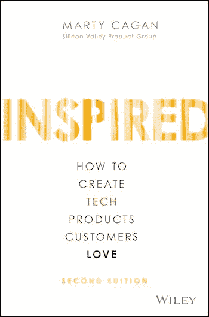
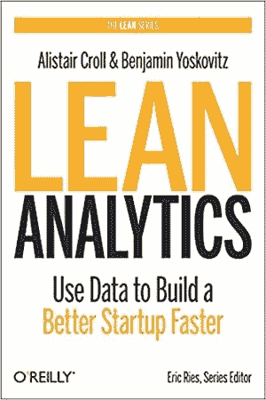
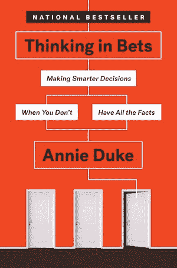
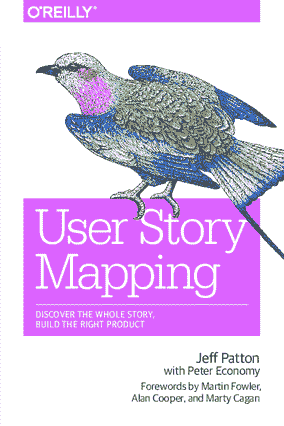
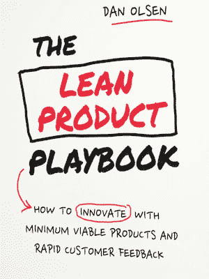
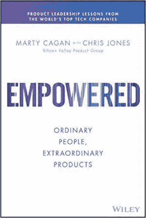

# 每个 PM 的书架上都应该有 8 本产品管理书籍

> 原文：<https://blog.logrocket.com/product-management/best-product-management-books/>

就像软件工程社区一样，产品经理可以访问大量资源来支持他们的开发；从闲散小组和聚会到 YouTube 视频和时事通讯。

但是对于那些喜欢老派内容的人来说，有大量的书籍涵盖了产品管理的所有方面。

这些书是在产品管理作为一种职业的初期写的，它们的作者认为自己是这个行业真正的先驱。无论你在[产品管理生涯的哪个阶段](https://blog.logrocket.com/product-management/product-manager-career-path/)，你都可以从那些塑造了产品团队工作方式的人那里学到很多东西。

* * *

## 目录

*   [*灵感:如何创造顾客喜爱的科技产品*](#inspired-how-to-create-tech-products-customers-love-by-marty-cagan) ，作者马蒂·卡甘
*   [*《精益分析:利用数据更快地建立更好的创业公司*](#lean-analytics-use-data-to-build-a-better-startup-faster-by-alistair-croll-and-benjamin-yoskovitz) 》，作者:Alistair Croll 和 Benjamin Yoskovitz
*   [*【在赌注中思考:当你没有所有事实时做出更明智的决定*](#thinking-in-bets-making-smarter-decisions-when-you-dont-have-all-the-facts-by-annie-duke) *，*安妮·杜克著
*   [*用户故事映射:发现整个故事，构建合适的产品*](#user-story-mapping-discover-the-whole-story-build-the-right-product-by-jeff-patton) *，*杰夫·巴顿
*   [*UX 精益创业:更快、更智能的用户体验研究与设计*](#ux-for-lean-startups-faster-smarter-user-experience-research-and-design-by-laura-klein) *，*劳拉·克莱因
*   [*《精益产品行动手册:如何用最少的可行产品和快速的客户反馈进行创新》*](#the-lean-product-playbook-how-to-innovate-with-minimum-viable-products-and-rapid-customer-feedback-by-dan-olsen) *，*丹·奥尔森著
*   [*赋能:普通人，非凡产品*](#empowered-ordinary-people-extraordinary-products-by-marty-cagan-and-chris-jones) *，*马蒂·卡甘和克里斯·琼斯
*   Gayle Laakmann McDowell 和 Jackie Bavaro 的 [*【破解 PM 面试:如何在技术领域找到一份产品经理的工作*](#cracking-the-pm-interview-how-to-land-a-product-manager-job-in-technology-by-gayle-laakmann-and-jackie-bavaro)

 ** * *

## 《灵感:如何创造顾客喜爱的科技产品》，作者 Marty Cagan

马蒂·卡甘是产品管理的教父， *[启发的](https://www.amazon.com/INSPIRED-Create-Tech-Products-Customers/dp/1119387507)* 是其有效的圣经。这本书涵盖了广泛的项目管理主题，如如何构建产品组织并为其配备人员，以及如何交付客户喜欢的技术产品。

对于那些刚开始从事产品管理的人来说，Inspired 是一个很好的资源，可以帮助你熟悉这个行业。它很好地为[产品经理如何适应一个组织](https://blog.logrocket.com/product-management/product-managers-role-each-product-lifecycle-stage/)设置了场景。

本书的前七章通过讲述成功的产品组织和对其成功至关重要的人的故事，展示了良好的产品管理如何影响商业成功。

到了第 8 章，Cagan 开始审视产品管理的核心概念，包括[产品发现](https://blog.logrocket.com/product-management/dual-track-agile-continuous-discovery/)，原型制作，交付，市场适应，以及[愿景](https://blog.logrocket.com/product-management/what-is-a-product-vision-statement-examples/)。当你从那里开始阅读这本书时，你开始理解产品团队是如何构成的，每个角色(产品经理、设计师、工程师、营销人员、研究员、数据分析师等)应该期望实现什么[，以及这些角色如何相互作用。](https://blog.logrocket.com/product-management/3-scrum-roles-agile/)

这本书的最后部分研究了完成产品经理任务的具体技术。

所有这些信息都包含在一本书里，很容易理解为什么*启发的*被认为是产品管理的蓝图。这是所有产品专业人员的必备读物。

## *精益分析:使用数据更快地建立更好的创业公司*，作者 Alistair Croll 和 Benjamin Yoskovitz

马蒂·卡甘本人推荐阅读 *[精益分析](https://www.amazon.com/Lean-Analytics-Better-Startup-Faster/dp/1449335675/ref=asc_df_1449335675/?tag=hyprod-20&linkCode=df0&hvadid=312243616995&hvpos=&hvnetw=g&hvrand=4903510632714000214&hvpone=&hvptwo=&hvqmt=&hvdev=c&hvdvcmdl=&hvlocint=&hvlocphy=9058138&hvtargid=pla-432406973006&psc=1)* ，鉴于他对[产品指标](https://blog.logrocket.com/product-management/what-product-management-metrics-matter-most-to-pms/)重要性的指导，很容易理解为什么。

作者 Alistair Croll 和 Benjamin Yoskovitz 是拥有辉煌业绩的企业家。他们汇集了他们的经验，以及对企业创始人和投资者的数百次采访，提出了一个如何确定应该衡量什么以及如何去做的指南。

本书分为四个部分，共 31 章，涵盖:

*   什么是分析
*   采取精益方法意味着什么
*   如何为你的分析建立一个框架
*   如何在您的组织中应用这个框架

作为一名[产品经理](https://blog.logrocket.com/product-management/what-does-a-product-manager-do-role-responsibilities/)，每当你开始一个新的角色，你的第一个任务就是确定哪些指标对你的组织最重要(例如[保留](https://blog.logrocket.com/product-management/what-metrics-kpis-product-managers-track/#retention)、[参与](https://blog.logrocket.com/product-management/what-product-management-metrics-matter-most-to-pms/#engagement)等)。)以及组织如何衡量它们。*精益分析*是一个很好的起点，如果你想快速启动你的公司收集和使用数据的方式。毕竟，只有当你知道成功是什么样子以及你是否正在实现它时，你才能做出成功的产品。

## 安妮·杜克著

当然，即使有世界上所有的数据，你仍然不知道影响你的产品的所有因素。有时，有些信息是隐藏的，你需要对如何进行做出判断。

根据《下注中的思考*[的作者安妮·杜克(Annie Duke)的说法，在处理这种深奥的数据时，长期成功的关键是从下注的角度来思考。例如:](https://www.amazon.com/Thinking-Bets-Making-Smarter-Decisions/dp/0735216371/ref=asc_df_0735216371/?tag=hyprod-20&linkCode=df0&hvadid=343203979134&hvpos=&hvnetw=g&hvrand=1351315868833679378&hvpone=&hvptwo=&hvqmt=&hvdev=c&hvdvcmdl=&hvlocint=&hvlocphy=1018516&hvtargid=pla-538211863139&psc=1&tag=&ref=&adgrpid=69360436752&hvpone=&hvptwo=&hvadid=343203979134&hvpos=&hvnetw=g&hvrand=1351315868833679378&hvqmt=&hvdev=c&hvdvcmdl=&hvlocint=&hvlocphy=1018516&hvtargid=pla-538211863139)*

*   我对正在决定的事情有多大把握？
*   有哪些可能的结果呢？
*   哪个决定成功的几率最高？
*   我的策略在 90%的时间里都有效，难道我落到了不幸的 10%里了吗？
*   或者，我的成功是因为运气不好，而不是伟大的决策？

第二章中有一节题为“所有的决定都是赌注”我认为这句话很好地概括了杜克想要表达的观点。

例如，如果你需要提高你的电子商务篮子的转化率，你会把钱投在什么上面？你有多少信心把赢来的钱带回家，而不担心你的损失？优先考虑你最有信心的赌注。

你可能会问，安妮杜克知道什么是下注思维？她恰好是前世界扑克锦标赛冠军！

## *用户故事映射:发现整个故事，构建合适的产品*，作者 Jeff Patton

Once you’ve picked your bet, the next step is to write up the work for the engineering team to deliver. That’s where the user story comes in.

Jeff Patton 是 Jeff Patton & Associates 的创始人和负责人，自 20 世纪 80 年代以来一直参与软件开发。在 20 世纪 90 年代末和 21 世纪初，他是 Salesforce 商业云的产品负责人，因此他对交付优秀产品略知一二。

在 *[用户故事映射:发现整个故事，构建正确的产品](https://www.amazon.com/User-Story-Mapping-Discover-Product/dp/1491904909/ref=asc_df_1491904909/?tag=hyprod-20&linkCode=df0&hvadid=312091457223&hvpos=&hvnetw=g&hvrand=12554297246526263723&hvpone=&hvptwo=&hvqmt=&hvdev=c&hvdvcmdl=&hvlocint=&hvlocphy=1018516&hvtargid=pla-433523004851&psc=1&tag=&ref=&adgrpid=62820903995&hvpone=&hvptwo=&hvadid=312091457223&hvpos=&hvnetw=g&hvrand=12554297246526263723&hvqmt=&hvdev=c&hvdvcmdl=&hvlocint=&hvlocphy=1018516&hvtargid=pla-433523004851)* 中，Patton 考察了映射用户故事的技术如何帮助你的团队专注于用户和他们的需求，而[不会迷失在对单个产品特性的热情中](https://blog.logrocket.com/product-management/what-are-product-features-define-examples/)。

绘制用户情景的行为遵循五个粗略的领域:

*   **框定** —创建一个简短的功能简介，设定您要绘制的内容的边界
*   **映射** —评估整个专题故事，查看框架的边缘，但不深入其中
*   **探索** —填充故事地图的细节，深入到高级地图要素并将其分解成更小的块
*   **发布的切片** —将用户故事分组，当一起交付时，允许你有一个可行的产品发布
*   **战略发展切片** —将你的发布切片分成几个交付阶段，这样可以降低风险，快速学习

对任何产品经理来说，保持对用户重要的东西的关注是一个很好的建议。

## *UX 精益创业:更快、更智能的用户体验研究和设计*，作者劳拉·克莱因

Laura Klein has over 20 years of product and user experience, and her expertise shines in *[UX for Lean Startups](https://www.amazon.com/UX-Lean-Startups-Experience-Research/dp/1449334911)*. Klein examines the principles of a great user experience and demonstrates how you can achieve them without having to follow a lengthy and expensive UX process.

关键原则集中在阐明和验证你的用户假设，然后在你开始设计你的产品之前，对你产生的想法做同样的事情。这个假设、想法和验证的循环帮助你确保你在正确的时间为正确的人建造正确的东西。

如果你是产品新手，*精益创业 UX*将帮助你学习如何对你的产品进行用户测试。即使你是一个经验丰富的项目经理，它也会帮助你学习如何更好地进行用户测试。

## Dan Olsen 的《精益产品行动手册:如何利用最少的可行产品和快速的客户反馈进行创新》

The *[Lean Product Playbook](https://www.amazon.com/Lean-Product-Playbook-Innovate-Products/dp/1118960874)* is a practical guide to building products that customers love. It doesn’t matter whether you work at a startup or a large, established company; building great products is hard.

大多数新产品都会失败，即使是成熟的产品也有失败的历史。在本书中，Dan Olsen 希望通过清晰、逐步的指导和建议来帮助您提高构建成功产品的机会。

该行动手册分为三个部分，介绍了:

对于那些担任许多产品管理角色的人来说，你实际上并没有花太多时间去创造全新的产品。相反，你专注于对现有产品进行迭代改进。精益产品行动手册的原则适用于渐进式产品变革。

## *赋权:普通人，非凡产品*，作者马蒂·卡甘和克里斯·琼斯

If *Inspired* looked at the blueprint for organizational product management, *[Empowered](https://www.amazon.com/EMPOWERED-Ordinary-Extraordinary-Products-Silicon/dp/111969129X)* is designed to provide you, as a leader of [product management, product design, or engineering](https://blog.logrocket.com/product-management/dual-track-agile-continuous-discovery/#the-trio-design-product-and-engineering), with everything you need to set up your team for product greatness.

该书涵盖:

*   成为授权产品团队意味着什么，它与大多数公司用来构建技术产品的“功能团队”有何不同
*   招聘和指导产品团队的成员——首先是能力，然后是发挥他们的潜力
*   创建一个鼓舞人心的[产品愿景](https://blog.logrocket.com/product-management/what-is-a-product-vision-statement-examples/)，以及一个[洞察驱动的产品战略](https://blog.logrocket.com/product-management/how-to-communicate-product-strategy/)，并通过赋予团队特定的目标——要解决的问题而不是要构建的功能——将该战略转化为行动
*   重新定义产品和公司其他部分之间的关系
*   详细说明有效和成功地将您的组织转变为真正授权的产品团队所需的变更

如你所见，*授权*针对的是更高级的产品经理——具体来说，就是管理团队的[项目经理。但这并不意味着新人不能从这本书里学到东西，因为它给了你明确的指导，告诉你应该以什么为目标，为什么要这样做。](https://blog.logrocket.com/product-management/product-manager-career-path/#group-product-manager)

## Gayle Laakmann McDowell 和 Jackie Bavaro 撰写的《破解项目经理面试:如何在技术领域获得产品经理的职位》

Of course, before you can apply all the great advice from the experts in the books mentioned above, you need to be successful in a [product management interview](https://blog.logrocket.com/product-management/product-manager-interview-questions-how-to-answer/).

当你参加面试时，你会得到一系列标准的面试问题(例如，“告诉我你最大的成就是什么”，“你为什么要找新的工作？”等等。)和特定于产品的问题。在 *[破解 PM 面试](https://www.amazon.com/Cracking-PM-Interview-Product-Technology/dp/0984782818)* 中，作者看了两组问题，并给出了如何处理它们的建议。

产品管理面试以一些具有挑战性的问题而闻名，尤其是围绕[估计](https://blog.logrocket.com/product-management/planning-poker-agile-estimation-scrum/)的问题，这些问题提供了你如何思考产品问题的深刻见解。例如:

*   曼哈顿有多少披萨外卖？
*   如何为盲人设计闹钟？
*   你将如何在印度推出视频租赁服务？

通过几个例子，这本书可以帮助你理解如何解决这类问题，即使你不知道曼哈顿在哪里，或者从未看过 VHS 录像带。

除了采访的具体细节之外，这本书还从总体上审视了产品职业生涯，比较了世界上一些最知名品牌的产品角色，并分享了领先产品专家的职业建议。

## 接下来呢？

所有的产品人员都很忙，但是如果你能每月抽出时间来写一本这样的书，你很快就会掌握一些成功的产品职业生涯所需要的关键技能——这些技能直接来自那些塑造了世界各地产品管理执行方式的人。

* * *

订阅我们的产品管理简讯
将此类文章发送到您的收件箱

* * *

*精选图片来源:[icon scout](https://iconscout.com/icon/books-1477888)*

## [LogRocket](https://lp.logrocket.com/blg/pm-signup) 产生产品见解，从而导致有意义的行动

[LogRocket](https://lp.logrocket.com/blg/pm-signup) 确定用户体验中的摩擦点，以便您能够做出明智的产品和设计变更决策，从而实现您的目标。

使用 LogRocket，您可以[了解影响您产品的问题的范围](https://logrocket.com/for/analytics-for-web-applications)，并优先考虑需要做出的更改。LogRocket 简化了工作流程，允许工程和设计团队使用与您相同的[数据进行工作](https://logrocket.com/for/web-analytics-solutions)，消除了对需要做什么的困惑。

让你的团队步调一致——今天就试试 [LogRocket](https://lp.logrocket.com/blg/pm-signup) 。*