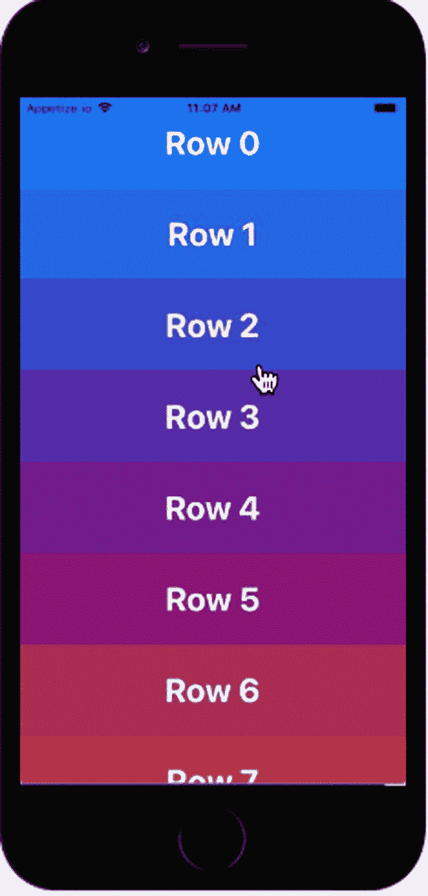
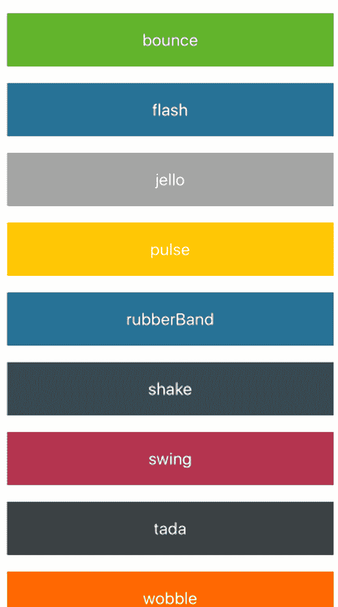
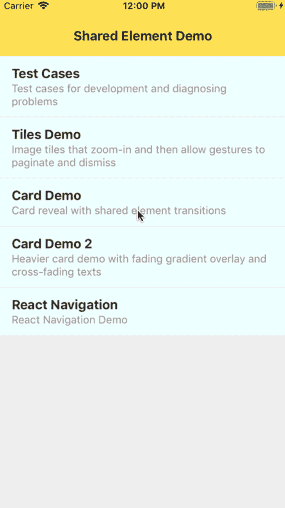

# 最好的本地动画库

> 原文：<https://blog.logrocket.com/best-react-native-animation-libraries/>

[Aman Mittal Follow](https://blog.logrocket.com/author/amanmittal/) 👨‍💻 Developer 👉 Node.js, React, React Native | Tech Blogger with 1M+ views on Medium

# 最好的反应本地动画库

## 

2020 年 5 月 26 日 3 min 读 946

在移动应用程序中，动画在交互和参与方面对用户体验有影响。动画可以很快成为用户喜欢在你的移动应用上参与的关键因素之一。

在构建 React 原生应用时，考虑用户交互是至关重要的。将用户的一些动作制作成动画真的可以帮助用户参与到应用程序中。在这篇文章中，我们将介绍一系列与 React Native 兼容的开源动画库，你可以考虑在你的下一个应用中尝试其中的一些，以加快开发时间。这里提到的库确实提供了比 React Native 自带的`[Animated](https://reactnative.dev/docs/animations)`内置 API 更高级的用例。

## 反应自然复活

React Native 自带内置的 [`Animated` API](https://reactnative.dev/docs/animations) 来创建动画和过渡；然而，当启用基于手势的交互时，它有一些限制。

### 什么是反应原生复活？

Reanimated 库专门解决了这些问题，并为基于手势的交互以及在应用程序中创建动画提供了灵活性。

Reanimated 是 React Native 的一个动画库，专门用于处理与手势交互相关的动画。它具有完全的原生支持，并直接在原生线程而不是 JavaScript 线程上执行动画。

使用这个库编写的任何动画都是使用 JavaScript 代码编写的。它也是向后兼容的，这意味着如果您计划使用该库并从动画 API 迁移，您不必更改大量代码或为特定的 React 本机核心组件重新创建动画。

这个库是由软件大厦和博览会的开发人员创建并积极维护的。它还可以很好地与 [React 本机手势处理程序库](https://software-mansion.github.io/react-native-gesture-handler/index.html)配合使用，以创建基于手势的交互。

与 React 原生动画 API 相比，Reanimated 的性能更好，因为它直接运行在原生线程上，而不是 JavaScript 线程上。它也可以在[低级设备](https://en.wikipedia.org/wiki/Feature_phone)上以每秒 60 帧的速度运行，但结果并不总是相同。

**TL；DR: React 原生复活**

## 反应原生动画

### 什么是反应原生动画？

React Native 中最受欢迎的动画库之一， [React Native Animatable](https://github.com/oblador/react-native-animatable) 在撰写本文时已经在 GitHub 上拥有 8.9k 的明星。像 React Native Reanimated 一样，它支持声明性用法，是可以用来在 React Native 应用程序中构建微交互的最佳库之一。

它有大量用于声明性用法的属性，如动画、循环、通用转换等。它还附带了一个易于理解和使用的 API，并为开发人员提供了强大的选项来控制您创建的动画。它目前还有 60 多个内置动画。

**TL；反应原生动画**

## 反应本机共享元素

这个库提供了一组用于执行共享元素转换的本机构建块。它提供了一组原语来增强核心 React Native API 提供的自定义转换的构建。这些原语都是通过原生实现的。

### 如何使用 React 原生共享元素？

这个库倾向于通过其本地实现方法来解决一系列特定的问题。例如，如果您试图添加一些繁重的过渡，如两个屏幕之间的导航，或者甚至使用 React 原生动画 API 向您的应用程序添加模态过渡，您仍然可能遇到性能问题，如丢帧。

该库解决了以下问题:

*   闪烁的
*   CPU 和 GPU 接口
*   ScrollView clipping
*   阴影过渡
*   交叉渐变过渡
*   图像`resizeMode`过渡

此外，这个库有一个单独的版本来支持使用名为`[react-navigation-shared-element](https://github.com/IjzerenHein/react-navigation-shared-element)`的`react-navigation`库的导航器之间的共享转换。它的`createSharedElementStackNavigator`有一个类似于`stackNavigator`的 API，您可以使用它来包装导航器中的每个路由屏幕，并检测触发共享元素转换的更改。

**TL；DR: React 本机共享元素**

## 促进

这个库是一个[基于物理的动画库](https://blog.logrocket.com/physics-based-animations-react-renature/)，可以让你轻松的创建动画。它的工作方式不同于本文中提到的其他库，你不需要显式地定义动画来转换状态。它会根据提到的属性名称自动选择一个动画。

它支持手势和挂载和卸载动画，就像 React 组件一样。这个库也可用于 React 和 Vue。

**TL；博士:姿势**

## 反作用弹簧

另一个简单易用的基于物理的动画库。这是一个跨平台的库，所以它支持 web、React Native、React Native Web 等平台。

我个人喜欢这个库的地方是它的 API 是以即插即用的 React 钩子的形式提供的。为什么它们是即插即用的？本库的 API 中描述的大多数钩子都遵循如下所述的三步过程:

1.  从库中导入钩子
2.  使用钩子定义动画
3.  将动画道具传递给视图组件

就是这样！就这么简单。如果你想了解更多，我们还写了关于[反应弹簧动画](https://blog.logrocket.com/animations-with-react-spring/)的更深入的内容。

## 结论

列表中包含的库要么基于个人经验，要么是那些积极维护的库。这些组件库的目的是使您的开发更快，并提供一种健壮的方法来构建应用程序，这样当您创建一个新的 React 本机应用程序时，您就不必每次都重新发明轮子。

也就是说，如果你熟悉任何其他的 React 本地动画库，请在下面的评论区留下它的链接，告诉我们你为什么喜欢它。

## [LogRocket](https://lp.logrocket.com/blg/react-native-signup) :即时重现 React 原生应用中的问题。

[LogRocket](https://lp.logrocket.com/blg/react-native-signup) 是一款 React 原生监控解决方案，可帮助您即时重现问题、确定 bug 的优先级并了解 React 原生应用的性能。

LogRocket 还可以向你展示用户是如何与你的应用程序互动的，从而帮助你提高转化率和产品使用率。LogRocket 的产品分析功能揭示了用户不完成特定流程或不采用新功能的原因。

开始主动监控您的 React 原生应用— [免费试用 LogRocket】。](https://lp.logrocket.com/blg/react-native-signup)