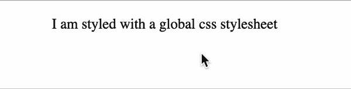

# Next.js 的最佳样式选项

> 原文：<https://blog.logrocket.com/best-styling-options-nextjs/>

Next.js 由 Vercel 创建，是一个基于 React 的 JavaScript 框架。凭借其提供[静态和服务器渲染](https://blog.logrocket.com/ssg-vs-ssr-in-next-js/)的能力，它在开发者中的受欢迎程度迅速上升。

不太为人所知的是，Next.js 提供了许多在应用程序中支持 CSS 的方法。无论您更喜欢带有类的实用 CSS 还是 JS 中的 CSS，Next.js 都能满足您的需求。在本教程中，您将发现在 Next.js 应用程序中实现样式的几种方法。让我们实现一个样式化的文本，当用户悬停在它上面时，它会变成红色:



## 在 Next.js 中使用全局 CSS 样式

在 Next.js 应用程序[中编写 CSS 最简单的方法是通过它的全局样式表](https://github.com/mariesta/nextjs-styling-options/tree/main/with-global-css))。每个新创建的 Next.js 项目都有一个`styles`文件夹，其中有一个`global.css`样式表。

因此，您可以立即开始编写 CSS，不需要任何设置。例如，在`styles/global.css`中，您可以添加以下内容:

```
    .paragraph {
      font-size: 16px;
      text-align: center;
    }

    .paragraph:hover {
      color: red;
    }

```

在`global.css`中创建的样式将应用于你的整个应用程序。

为此，这个样式表只能在`_app.js,`中导入，因为`App`组件会初始化 Next.js 页面中的所有页面。

在新的 Next.js 项目中，已经为您完成了，但是如果您的`pages`文件夹中还没有`_app.js`文件，请创建一个。完成后，导入新的全局样式表:

```
//In _app.js, import your global stylesheets
    import '../styles/globals.css'

    function MyApp({ Component, pageProps }) {
      return <Component {...pageProps} />
    }

    export default MyApp

```

然后，您可以在应用程序中使用这些类。例如，在您的主页上的`pages/index.js`:

```
    export default function Home() {
      return (
        <p className="paragraph">I am styled with a global css stylesheet</p>
      )
    }

```

### 在 CSS 中使用全局样式的好处

*   不需要设置
*   非常适合 POC 等小型项目

### 骗局

*   所有样式都包含在一个文件中
*   随着项目的增长，很难进行扩展

## 在 Next.js 中使用 CSS 模块

刚开始时，全局样式表非常方便，但随着应用程序的增长，这个文件可能变得不太容易管理。

此外，Next.js 是一个基于组件的框架，这意味着为各个组件拆分样式更容易。例如，如果您有一个页脚组件，导入一个包含该组件样式的样式表会更容易，但仅此而已。进入 CSS 模块！

如果你不熟悉， [CSS 模块允许你通过为特定风格的组件](https://github.com/mariesta/nextjs-styling-options/tree/main/with-css-modules)创建文件来隔离你的 CSS。它们非常容易使用，因为它们是简单的 CSS，但是扩展名是`module.css`。和前面的方法一样，它不需要设置，可以和全局样式表一起使用。

下面是一个`Home.module.css`的例子:

```
    //Home.module.css
    .paragraph {
      font-size: 16px;
      text-align: center;
    }

    .paragraph:hover {
      color: red;
    }

```

在组件`pages/index.js`中，您可以导入样式表并使用它:

```
  import styles from '../styles/Home.module.css'
   export default function Home() {
      return (
        <p className={styles.paragraph}>I am styled with CSS modules</p>
      )
    }

```

### 使用 CSS 模块进行样式设计的优点

*   不需要设置
*   组件可以拆分样式
*   可用于全局样式
*   与全局样式不同，避免了类之间的冲突

### 骗局

*   无动态样式(例如，基于加载、错误、成功等状态。)

## 使用 Sass 的 Next.js 样式

如果基本的 CSS 是不够的，你发现自己在寻找一个 CSS 框架，没有比 Sass 看得更远。它将自己描述为“[具有超能力的 CSS](https://sass-lang.com/)”，这是一个与 CSS 兼容的流行框架，提供了许多很酷的特性，如变量、嵌套和混合。[这是我们的示例项目](https://github.com/mariesta/nextjs-styling-options/tree/main/with-sass)的 GitHub 回购。

在 Next.js 中使用 Sass 非常简单。您所要做的就是安装库:

```
   npm install sass
    # or
    yarn add sass

```

一旦完成，您就可以开始编写 Sass 代码了。不要忘记`.scss`或`.sass`文件扩展名！这里有一个`styles/Home.module.scss`中 Sass 代码的例子:

```
    //Home.module.scss
    $hover-color: red;

    .paragraph {
      font-size: 16px;
      text-align: center;
    }

    .paragraph:hover {
      color: $hover-color;
    }

```

类似于使用 CSS 模块，一旦我们完成了 CSS 的编写，我们将导入新的文件来设计我们的应用程序。

```
  import styles from '../styles/Home.module.scss'
    export default function Home() {
      return (
        <p className={styles.paragraph}>I am styled with SASS</p>
      )
    }

```

优点:

*   使用 Next.js 轻松设置
*   CSS 兼容
*   复杂样式需求的有趣特性，如变量、嵌套等。

缺点:

*   学习 SASS 新功能所浪费的时间

## `More complex than CSS`造型与风格——JSX

如果您喜欢实用 CSS，前面的三种方法涵盖了最好的样式选项。但是也许你更像是一个 CSS-in-JS 类型的人。在这种情况下，[风格的 JSX](https://github.com/vercel/styled-jsx) 可能是你的菜。

Styled-JSX 由 Next.js 的创始人韦尔塞尔创建，允许开发人员在他们的 JavaScript 代码中编写 CSS。没有设置的必要，它开箱即用。

[这里有一个风格化的例子——JSX](https://github.com/mariesta/nextjs-styling-options/tree/main/with-styled-jsx):

```
    export default function Home() {
      return (
        <div className="paragraph">
          <style jsx>{`
            .paragraph {
              font-size: 16px;
              text-align: center;
            }

            .paragraph:hover {
              color: red;
            }
          `}</style>
          <p>I am a component styled with Styled-JSX</p>
        </div>
      )
    }

```

### 对 Next.js 使用 Sass 的优点

*   不需要设置
*   动态造型
*   可移植性:您的代码(CSS 和 JS)包含在一个文件中，因此可以很容易地移动

### 骗局

*   不像其他 CSS-in-JS 库那样支持(Github 上的 7k stars 与样式化组件的 36k)
*   当混合使用 CSS 和 JS 时，代码的可读性会更差

## 使用样式组件

风格化的 JSX 开始时很方便，但是随着应用程序的增长很难调试。因此，您可能会被[样式化组件](https://blog.logrocket.com/8-awesome-features-of-styled-components/)所诱惑。

Styled-components 非常实用，因为它是为 React 创建的。它允许开发人员创建自动注入样式的组件。您还可以利用道具进行动态造型(例如，用于禁用或悬停状态)。点击查看示例项目[。](https://github.com/mariesta/nextjs-styling-options/tree/main/with-styled-components)

要在 Next.js 中使用它，首先安装库:

```
    npm i styled-components
    # or
    yarn add styled-components

```

使用样式化组件的唯一缺点是它是为 React 设计的，这意味着它适合客户端渲染。目前，服务器端渲染不支持开箱即用。

然而，这很容易通过创建一个新的 `pages/_document.js`文件并添加以下内容来解决:

```
 import Document, { Head, Html, Main, NextScript } from 'next/document'
    import { ServerStyleSheet } from 'styled-components'

    export default class MyDocument extends Document {
      render() {
        return (
          <Html lang="en">
            <Head></Head>
            <body>
              <Main />
              <NextScript />
            </body>
          </Html>
        )
      }

      static async getInitialProps(ctx) {
        const sheet = new ServerStyleSheet()
        const originalRenderPage = ctx.renderPage

        try {
          ctx.renderPage = () =>
            originalRenderPage({
              enhanceApp: (App) => (props) =>
                sheet.collectStyles(<App {...props} />),
            })

          const initialProps = await Document.getInitialProps(ctx)
          return {
            ...initialProps,
            styles: (
              <>
                {initialProps.styles}
                {sheet.getStyleElement()}
              </>
            ),
          }
        } finally {
          sheet.seal()
        }
      }
    }

```

完成后，您可以将该库导入到您的组件中并开始使用它。例如，在`pages/index.js`中，您可以为您的主页创建一个`Paragraph`样式的组件:

```
 import styled from 'styled-components'
    const Paragraph = styled.p`
      font-size: 16px;
      text-align: center;

      &:hover {
        color: ${props => props.hoverColor};
      }
    `

    export default function Home() {
      return <Paragraph hoverColor="red">I am a component made with Styled Components</Paragraph>
    }

```

### 在 Next.js 中使用样式化组件的优点

*   使用 React 构建，拥有大量社区支持
*   基于道具的动态造型
*   像 React 组件一样可定制和可重用(即，`<Title />`而不是`<h2 className="title"/>`)

### 骗局

*   像 Next.js 这样的服务器端渲染框架所必需的额外配置
*   习惯这些功能需要一点学习过程
*   编译时，样式化组件类变得随机(即`css-1kybr8i`)，使得调试更加困难

## 情绪

另一个用 React 创建的 CSS 框架是 [Emotion](https://emotion.sh/docs/introduction) 。它提供了 CSS prop(将样式直接传递给元素)和样式组件。Emotion 的另一个好处是服务器端渲染可以开箱即用。[点击这里查看 GitHub](https://github.com/mariesta/nextjs-styling-options/tree/main/with-emotion)。

要在 Next.js 应用程序中使用 Emotion，首先需要安装库:

```
    npm install --save @emotion/react
    #or
    yarn add @emotion/react

```

要使用样式化组件，您还应该安装所需的库:

```
    npm install --save @emotion/styled
    # or
    yarn add @emotion/styled

```

然后，您可以直接开始编写您的样式组件。在 `pages/index.js`中，这里是一个`Paragraph`组件的例子:

```
    import styled from '@emotion/styled'

    const Paragraph = styled.p`
      font-size: 16px;
      text-align: center;

      &:hover {
        color: ${props => props.hoverColor};
      }
    `

    export default function Home() {
      return <Paragraph hoverColor="red">I am a component made with Emotion (Styled Components)</Paragraph>
    }

```

### 使用情感的好处

*   Next.js 的服务器端支持和简单设置
*   使用@emotion/styled，您可以获得样式化组件的所有优点
*   许多不同需求的软件包:CSS，styled，Jest，native 等。

### 骗局

*   像样式化组件一样，Emotion 生成随机的类名，使得用元素检查器进行调试更加困难
*   需要一点时间来适应这些功能

## 用顺风 CSS 设计 Next.js 的样式

使用 PostCSS，Next.js 还提供了对流行工具的支持，比如 Tailwind CSS。通过安装 Tailwind 作为 PostCSS 插件，它将扫描你的代码并为你生成正确的样式表。它不仅速度快，而且还提供了一个实用程序类列表供您选择(例如，间距、文本大小等等)。

要在 Next.js 中使用它，首先安装`tailwindcss`、`postcss`和`autoprefixer`作为对等依赖项:

```
    npm install -D tailwindcss postcss autoprefixer

```

运行`tailwindcss` init 来生成所需的文件:

```
    npx tailwindcss init -p

```

该命令生成了两个文件:

*   `postcss.config.js,`你不需要碰它
*   `tailwind.config.js`

在后者中，添加您的模板路径。这些配置将告诉 Tailwind CSS 扫描哪些代码来生成样式表:

```
    module.exports = {
      content: [
        "./pages/**/*.{js,ts,jsx,tsx}",
        "./components/**/*.{js,ts,jsx,tsx}",
      ],
      theme: {
        extend: {},
      },
      plugins: [],
    }

```

在`styles/global.css`中，添加顺风 CSS 指令:

```
    @tailwind base;
    @tailwind components;
    @tailwind utilities;

```

如果您正在使用新创建的 Next.js 项目，这将为您完成，但是，如果不是，请确保`pages/_app.js`导入您的`styles/global.css`样式表:

```
    import '../styles/globals.css'

    function MyApp({ Component, pageProps }) {
      return <Component {...pageProps} />
    }

    export default MyApp

```

你现在可以开始使用 Tailwind CSS 了。在`pages/index.js`中，如果你想创建一个悬停状态的居中段落，你可以这样做:

```
    export default function Home() {
      return (
        <p class="text-center text-lg hover:text-red-600">
          I am a component made with Tailwind CSS
        </p>
      )
    }

```

### 使用顺风 CSS 的好处

*   许多预定义的类，包括填充、边距、颜色等等
*   一旦熟悉了这些类，设计过程就会变得更快
*   通过移除未使用的 CSS，编译后的 CSS 会自动优化

### 骗局

*   没有内容和结构的分离，因为 CSS 和 HTML 是结合在一起的
*   学习所有不同的课程需要时间

## 结论

选择一个样式选项取决于许多因素:项目的大小、时间，更重要的是，个人偏好。幸运的是，无论您喜欢实用 CSS 还是 CSS-in-JS，Next.js 都提供了对 CSS 的内置支持。

在本教程中，您会发现其中的一些。首先，您学习了如何使用全局样式表或 CSS 模块编写 CSS。对于有更复杂需求的开发人员，您还看到了如何在 Next.js 中使用 Sass。

然后，对于那些喜欢 CSS-in-JS 的人，我们介绍了一些方法，比如样式化 JSX、样式化组件和情感。

最后，您还了解了 Next.js 提供了对带有 PostCSS 的 Tailwind CSS 等工具的支持，这有利于希望访问带有数千个预构建 CSS 类的设计系统的开发人员。感谢阅读！

## [LogRocket](https://lp.logrocket.com/blg/nextjs-signup) :全面了解生产 Next.js 应用

调试下一个应用程序可能会很困难，尤其是当用户遇到难以重现的问题时。如果您对监视和跟踪状态、自动显示 JavaScript 错误、跟踪缓慢的网络请求和组件加载时间感兴趣，

[try LogRocket](https://lp.logrocket.com/blg/nextjs-signup)

.

[](https://lp.logrocket.com/blg/nextjs-signup)[](https://lp.logrocket.com/blg/nextjs-signup)

LogRocket 就像是网络和移动应用的 DVR，记录下你的 Next.js 应用上发生的一切。您可以汇总并报告问题发生时应用程序的状态，而不是猜测问题发生的原因。LogRocket 还可以监控应用程序的性能，报告客户端 CPU 负载、客户端内存使用等指标。

LogRocket Redux 中间件包为您的用户会话增加了一层额外的可见性。LogRocket 记录 Redux 存储中的所有操作和状态。

让您调试 Next.js 应用的方式现代化— [开始免费监控](https://lp.logrocket.com/blg/nextjs-signup)。