# 创建有效切换按钮的最佳工具

> 原文：<https://blog.logrocket.com/ux-design/best-tools-create-effective-toggle-buttons/>

切换按钮是当今网络和应用程序中最重要的用户界面控件之一。如果没有经过仔细的规划，这种控件可能会给用户带来摩擦和困惑。为了尽可能提供最好的用户体验，这显然是我们想要做好的事情。

切换按钮的好坏取决于它的实现。在我们热情地将它们包含在我们的界面中之前，有一些考虑事项需要我们承认。

正如许多 UI 组件经常出现的情况一样，应该适当地使用切换按钮。我们真的了解用户将如何在一个特定的系统中导航吗？我们有没有预料到他们会如何做？我们能肯定地说切换按钮是一个比复选框更好的选择吗？稍后会详细介绍。

切换按钮的显示方式和它们是否可访问同样重要。切换按钮应该是可访问的，没有借口。

此外，现在有什么工具可以让我们基于这些考虑来创建有效的切换按钮呢？在本文中，让我们进一步探讨什么是切换按钮，以及我们可以使用什么工具来帮助我们制作一个遵循良好设计实践的切换按钮。一个为人民服务的按钮。

> 注意，界面设计中的切换按钮在技术上可以有两个以上的选项，我们接下来会演示。同样值得一提的是，虽然大多数出版物将这些控件称为切换按钮，但苹果更可能将它们称为分段控件。

## 目录

## 什么时候使用切换按钮比较合适？

让我们先弄清楚这一点:拨动按钮不同于拨动开关。如果你在谷歌上搜索这两个词，你可能会看到这两个控件的大杂烩，人们争先恐后地想弄明白这一切。

但实际上很简单:一个拨动按钮可以有两个以上的选项，而一个拨动开关只能有两个选项。简单吧？

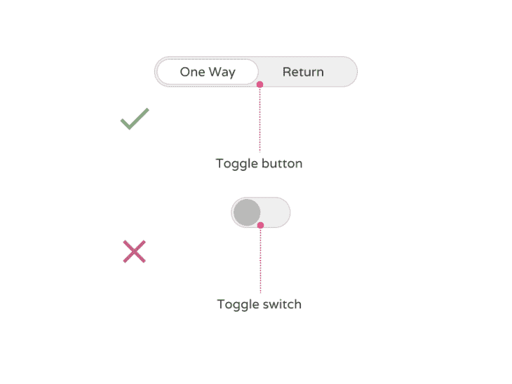

A toggle button, top, can actually have more than two options. A toggle switch is more like its real-life counterpart, the light switch. It’s either on or off.

让我们通过一个我们大多数人都熟悉的例子来关注切换按钮。当我写这篇文章时，在谷歌文档中，我可以选择左对齐、居中对齐、右对齐或完全对齐文本——这是一个切换按钮。

具体来说，这是一个独家选择切换按钮。在这种情况下排他性意味着一个；我只能从四个选项中选择一个。同时选择左对齐和右对齐的文本没有意义，对吗？

此外，所有切换按钮都应该有一个默认状态，在我们的 Google Docs 示例中，默认状态是左对齐。默认情况下，系统专门选择了我们的默认状态。

没有默认状态将违背良好建立的设计模式，如果用户不能立即确定默认的初始选择是什么，可能会在用户中引起混乱。

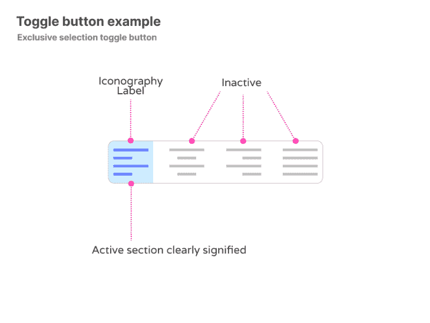

A good toggle button is clearly defined, with either text or icon labels clearly denoting the action that will take place if selected. The chosen state must be clear to signify to the user what state is selected.

### 你应该使用复选框，单选按钮，还是切换按钮？

但是你可能会想，复选框或单选按钮呢？复选框的视觉指示不同于切换按钮。虽然在切换按钮中进行选择意味着选择和实例，但复选标记仅表示选择。

实例的负担完全由用户承担，这意味着他们必须执行额外的步骤来完成他们的动作。一个很好的例子就是典型的注册表单。用户可能选择一个或多个复选框，然后需要按提交来完成他们的注册。

复选框适用于需要多重选择的情况。切换按钮不是，因为使用多个切换按钮会增加认知负荷，用户需要等待系统一个接一个地应用每个设置，这会带来额外的挫败感。在这种情况下，它们还会占用大量空间，增加混乱和认知负荷。这导致了糟糕的用户体验。复选框允许用户选择多个选项，然后在自己的时间内提交，允许系统在提交时处理多个请求。

单选按钮的相似之处在于，它们首先是一个选择*、*，而不是像切换按钮那样的选择和实例。同样，就像复选框一样，用户从许多可能的操作中选择一个，他们最终会通过提交来保存这些操作。

A typical list highlighting both use cases for checkboxes or radio buttons. Imagine how chaotic this would be if it were toggle buttons!

> 注意，如果您正在考虑在存在其他类型表单字段的长表单中包含切换，并且用户最终需要单击 Submit 才能使其他更改生效，请不要这样做。

## 什么是好的切换按钮？

所以我们现在对何时使用切换按钮有了更好的理解，但是什么是好的切换按钮呢？

### 一个默认选择

让我们用一个假设的场景。您想预订一张机票，信息被拆分为“单程”机票和“往返”机票。为了在两者之间切换，用户必须选择单向或返回。

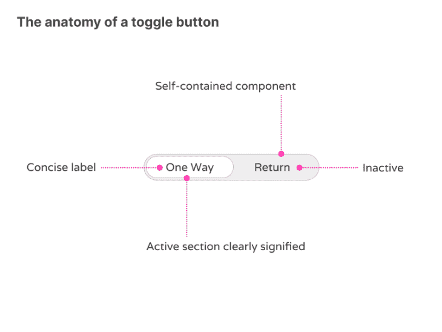

An example of a fairly typical, airline related toggle button. Would you like a one-way ticket or return?

正如我们所说的，切换按钮应该有一个默认状态。当页面为我们虚构的机票预订系统加载时，切换按钮和与“单程”相关的信息将首先加载。

通常由设计团队来决定什么选项应该是默认选项，但是从根本上来说，记住至少有一个状态需要是默认值，并且显示与该值相关的信息是很重要的。还应该清楚默认选择哪个状态。

### 清晰的视觉线索

这就是好的视觉提示的来源。选定的状态应该是自包含组件的最直接、最突出的方面。这可以通过粗体文本、颜色或图标来显示打开状态。

“关闭”状态可以是“打开”状态的相反状态，通常显示为缺少颜色，文本的重量较轻，图标显示为灰色。理想情况下，结合使用所有这些属性可以明显区分不同的状态。

当用户与其中任何一个交互时，状态会立即改变。这意味着页面将自动更新状态以及与该状态相关的信息。这对用户来说是完全无缝的，因为他们不需要手动保存所做的更改。

### 清除标签

切换按钮需要利用良好的标签。标签应该描述控件在被选中时将执行的操作；他们不应该是中立的或模棱两可的。

确保标签有意义的最好方法之一是大声说出标签，最后加上“开/关”。如果没有意义，那么标签就要重写。

标签也要简洁(一般一个字的长度)，一目了然。用户倾向于*浏览*而不是务实地阅读屏幕上的所有内容，因此适当分块的整洁信息总是能赢得忙碌用户的注意。将标签与好的图标相结合可以进一步帮助用户快速浏览页面。

现在我们知道了何时使用切换按钮*、*以及什么是有效的切换按钮，我们可以使用什么工具来帮助我们设计和/或实现它们？这个问题可能归结为你的总体目标是什么。

你已经是一个公认的界面设计师了吗？你是一个希望获得更多原型工具的产品所有者吗？也许你是一个企业主，想要快速迭代出想法，但你几乎没有设计知识。也许你想完全避开传统的设计过程，直接进入无代码的世界？

好消息是，每个人都有一个解决方案！

### 菲格玛

Figma 最适合设计师和那些想快速将想法概念化的人。

Figma 自 2016 年发布以来已经走过了漫长的道路。作为一个每天都在使用 Figma 的设计师，我可以充满信心地说，这绝对是设计切换按钮最快、最有效的方法。

无论是以线框形式，还是作为一个完全充实的概念准备开发移交，Figma 涵盖了所有的基础。感谢设计助手社区，它甚至可以利用他人的工作，并从数百个预制组件中进行选择！

如果你担心使用预制的组件，也许是因为你认为它缺乏灵活性，或者你不能改变你复制的组件的风格，不要担心。一切都是完全可定制的，随时可以复制到你自己的设计系统中。

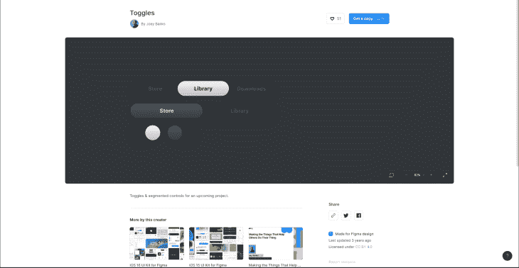

Figma’s community tab is stuffed full of all sorts of premade components. Here’s a good example of premade toggle buttons (and switches) from designer Joey Banks.

Figma 是业界标准的设计工具，无论您是设计师、开发人员还是他们中的一员，您都可能对它(或其设计竞争对手 Sketch)很熟悉。然而，有些人可能会认为 Figma 缺乏原型工具。对于大多数人来说，这可能不是什么大问题，因为切换按钮的创建可能是最重要的，但它绝对值得强调。

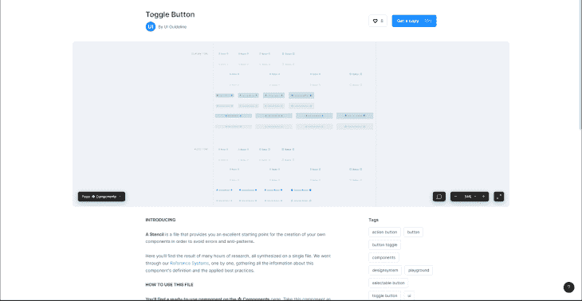

Another example of using the collective consciousness of designers that have come before. Select get a copy, copy the components over to your file, and you have instant toggle buttons!

如果合作对你来说很重要，那么 Figma 就能满足你。从一开始，协作就是关键。对于创建一个切换按钮或一系列切换按钮，与团队分享设计并获得对您工作的即时反馈是非常容易的。

使用 Figjam，一个使用 Figma 协作技术的额外协作工具，您可以绘制草图、涂鸦和游戏化设计体验，以确保您的切换按钮在任何业务环境下都能工作。不再用电子邮件发送 pdf，不再问简是否有最新的设计。邀请 Jane 加入画板并进行协作。

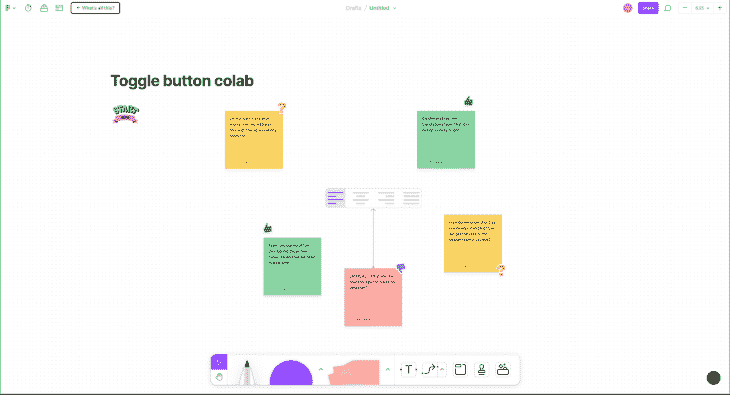

A recent addition to Figma, Figjam makes collaboration fun and more importantly, productive!

Figma 的第一层是免费的。

### Mockplus

Mockplus 最适合利益相关者或非传统的设计者，以及那些想要快速将他们的想法概念化的人。

正如所建立的那样，Figma 将为许多人，尤其是设计师，勾选许多框。但并不是每个人都有 Figma 可能需要的信心或时间。如前所述，它缺乏的一点是创建原型时显示的交互性。这就是像 Mockplus 这样的工具的用武之地。

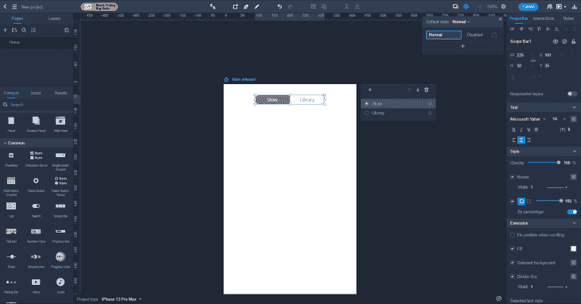

Mockplus seeks to simplify the design process even further; notice the popup modal that allows us to add additional items to our toggle button.

Mockplus 是为那些想设计界面，但按职称可能不是设计师的人提供的解决方案。该界面非常强调自己是一个拖放界面，一个一体化的设计应用程序，使原型设计变得轻而易举。

对于没有时间学习像 Figma 这样的新设计工具的人来说，或者对于没有专门设计师的小型创业公司来说，Mockplus 非常棒。可以选择将画板和资源从 Figma 导入到 Mockplus，还可以使用 Mockplus 的原型引擎向利益相关者展示杀手级设计。

交互性是 Mockplus 的标准配置。非常适合那些需要展示注册流程的人，作为流程的一部分，切换按钮允许用户选择不同的会员级别。Mockplus 消除了您与切换按钮交互时发生的猜测，并为希望快速看到结果的利益相关者消除了猜测。

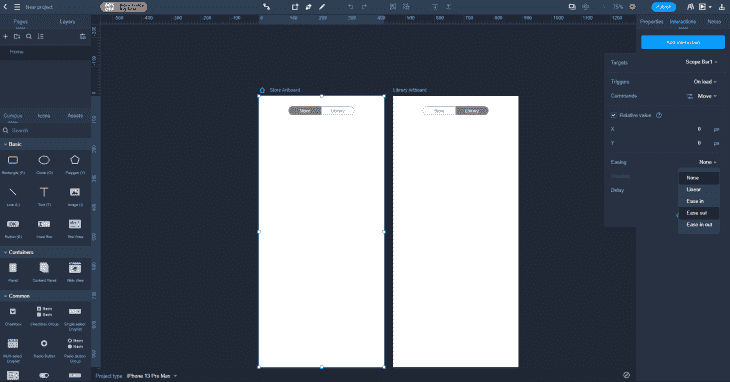

Create multiple artboards in Mockplus, then link them together to create a userflow. Show stakeholders; don’t tell them what will happen when a user enters a certain point in the app.

Mockplus 的基本层是免费的。

### 贾丝廷娜

与 MockPlus 非常相似，Justinmind 最适合利益相关者或非传统设计师，以及那些希望快速将想法概念化的人。

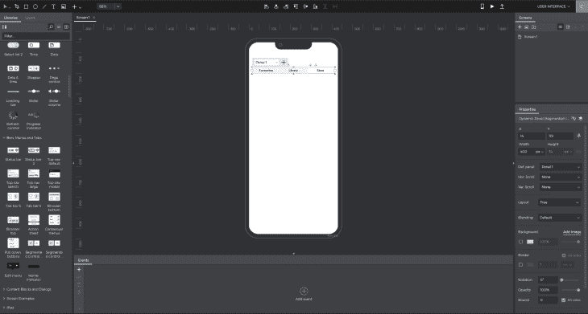

As with Mockplus, you’ll feel right at home if you’re happy with dragging and dropping elements onto the canvas in the center. In this example, I’ve dropped in a toggle button, with options on the right to change different attributes.

作为 Mockplus 的替代，Justinmind 是另一个寻求在自称的设计师和非设计师之间架起桥梁的工具。就像 Mockplus 一样，Justinmind 声称他们的拖放界面使用户能够通过多个交互式组件来选择设计概念。在左侧，您有一个充满流行组件的面板，其中当然包括现成的切换按钮。

对于那些不想花时间学习新的设计工具(如 Figma)的人来说，Justinmind 是另一个潜在的选择，因为他们的大部分时间传统上都花在了其他地方。

Mockplus 允许用户从 Figma 导入设计，而 Justinmind 则不同，它与 Figma 共生。那是什么意思？根据 [Justinmind 支持网站](https://www.justinmind.com/support/sketch-and-justinmind-integration/)，这是他们对与其他设计工具一起工作的说法:

Justinmind 的功能特别强大，可以让设计具有交互性，并根据用户的需要模拟真实的网络和移动应用程序。一旦你使用 **复制 SVG 代码** *将设计从 Figma 带到 Justinmind，你可以立即选择任何层并[向其添加事件。](https://www.justinmind.com/support/events-and-interactions/)*

这又是一个特别有用的特性，它允许我们的工作可视化，类似于交给工程团队开发之前的成品。有什么更好的方式来准确地显示当用户在多项切换按钮的不同选项之间点击时会发生什么？

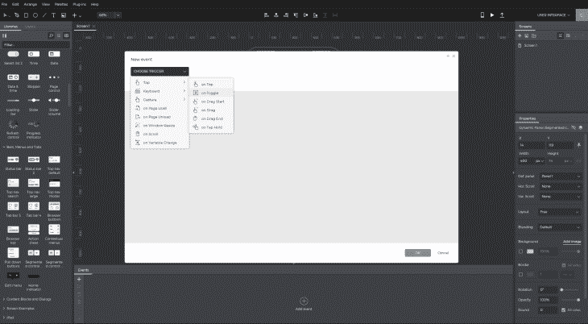

*Animations are determined by their triggers, such as tap, click, or gesture*

Justinmind 的免费层是免费的。

### 动词 （verb 的缩写）一个

动词 （verb 的缩写）其中一个最适合那些想同时设计和实现的修补者。创建切换按钮的外观，而 V.One 在后台编译代码。

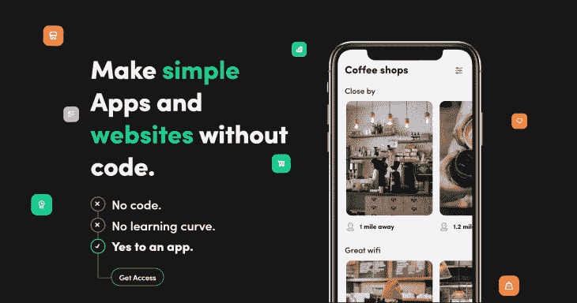

V.One is a relatively new offering in the no-code space, but don’t let that fool you: their system is robust and full of options.

GitHub 的首席执行官克里斯·万斯特拉斯(Chris Wanstrath)称，“编码的未来是完全没有编码。”

“无代码”是一个相对较新的运动，它赋予了那些没有技术背景的人力量。如果你真的想在 iOS 或 Android 上构建系统和界面，这是迄今为止工程师们的专利，你可以做到！不仅仅是一种趋势，而是技术爱好者和企业家之间的一场日益增长的运动。

就其核心而言，V.One 是一个界面生成器。它与我们到目前为止提到的工具有相似之处，但作为无代码空间的一部分的关键区别在于，无论你能设计什么，你都可以将其作为网站或应用程序来发布。

动词 （verb 的缩写）人们已经在无代码领域取得了巨大的进步。V.One 被定位为创建在线应用程序的一站式商店，尤其是那些符合仪表板范式的应用程序，它允许用户快速重复可以发布的想法。原型，迭代，推出，并扩大你的想法。

拖放是这个游戏的名字，如果你足够勇敢去尝试的话，你可以选择在简化的界面后面窥视。从左侧拖动组件允许您构建应用程序。无论你是建立一个新的旅游应用程序，还是为一个新的 SaaS 平台建立一个伟大的想法，V.one 都有大量的组件可供选择，其中当然包括可访问的，精心设计的切换按钮。

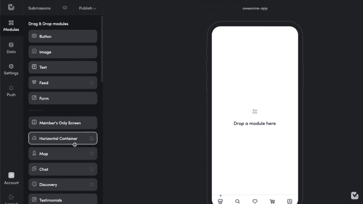

Building an app is a case of building a series of modules.

V.One 的入门版是免费的。

### 湍流

FlutterFlow 结合了两个世界的优点，适合那些乐于修补的人——但是设计者，尤其是基于网络的设计者，应该对它的界面感觉很舒服

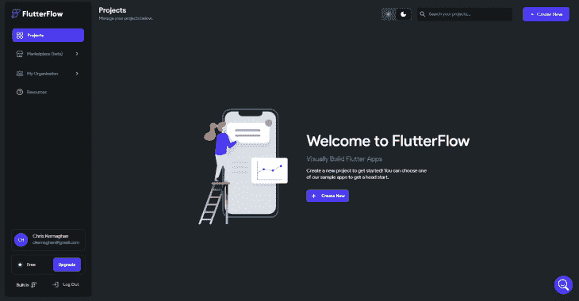

Flutterflow has an extremely simple interface, which is quite an achievement given the complexity on offer.

另一个无代码领域的宠儿，FlutterFlow 已经像 V.One 一样取得了长足的进步，让用户能够“创建漂亮的 UI，生成干净的代码，一键部署到应用商店”。如果 V.One 在无代码市场的相对年轻没有让你充满信心，也许 Flutterflow 是你需要的替代选择。

Flutterflow 还拥有大量的客户，从 Rakuten 到 Lumen，这突出表明，不仅没有代码，FlutterFlow 也是如此。

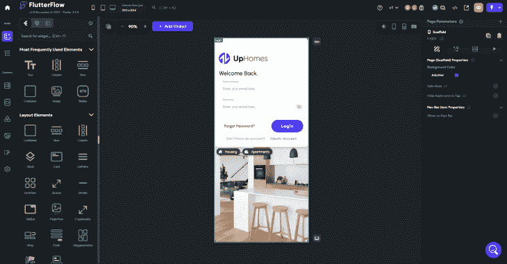

FlutterFlow 的启动层是免费的。

## 摘要

毫无疑问，我们生活在一个选择的时代。不管你是谁，或者你的职位是什么，一个工具是为所有人而存在的。无论你的应用程序或网站的想法是什么，切换按钮很有可能是其中的一部分。最好的东西？上面列出的工具允许您设计、创建并与团队成员共享您的切换按钮。

不仅如此，这些工具还允许我们创建符合我们在开始时提到的基本标准的切换按钮。切换按钮应该是独立的，易于理解，使用合适的标签或图标，并且易于访问。我很高兴地说，我们可以做到这一点，不管你最终使用什么工具。

## [LogRocket](https://lp.logrocket.com/blg/signup) :无需采访即可获得 UX 洞察的分析

[LogRocket](https://lp.logrocket.com/blg/signup) 让您可以回放用户的产品体验，以可视化竞争，了解影响采用的问题，并结合定性和定量数据，以便您可以创建令人惊叹的数字体验。

查看设计选择、交互和问题如何影响您的用户— [立即尝试 LogRocket】。](hhttps://lp.logrocket.com/blg/signup)