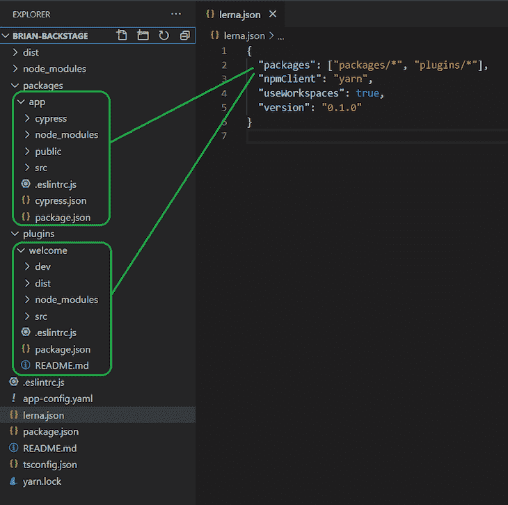
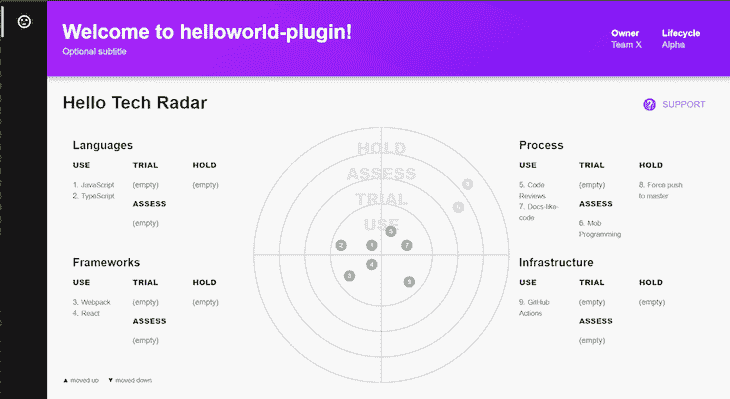

# 利用 Spotify 的 Backstage - LogRocket 博客建立更好的开发者门户

> 原文：<https://blog.logrocket.com/better-developer-portals-spotify-backstage/>

Spotify 工程团队最近发布了一款名为 Backstage 的新开源工具。虽然最初的发布仍然是一项进行中的工作，但该工具有很大的潜力来填补开发人员工具中的空白，许多工程团队可能甚至没有意识到它可以帮助他们。

## 后台是什么？

Backstage 由 Spotify 工程团队开发，是一个用于构建开发者门户的开源平台。它基于 Spotify 用来帮助组织开发工具、文档和流程的内部工具，新开发人员在开发新应用或 API 时需要了解这些工具。

简单来说，Backstage 帮助你构建开发者生产力工具。Backstage 背后的想法是，通过将通常需要的资源整合到一个基于浏览器的用户界面中，它有助于减少新开发人员的认知负担。

当你开始为一个新的组织开发东西时，想想你需要熟悉的所有东西。有没有一套标准的设计模式、框架和编程语言是你期望使用的？在哪里可以找到关于您可能需要使用的组织 API 的文档？您可以或应该如何以及在哪里部署您的解决方案？

您可以通过构建自己的 Backstage 自定义实例、使用不断增长的现有插件库或构建自己的插件来帮助开发人员回答这些类型的问题。

> **注意**:记住后台还是很新的。事实上，最初的 alpha 版本是在 2020 年 3 月 16 日发布的[。不要期望一个完整的插件生态系统。然而，请期待一个干净的解决方案，新鲜的用户界面，周到的文档，以及一些伟大的潜力。](https://backstage.io/blog/2020/03/18/what-is-backstage)

本文中的一些例子可能很快就过时了，所以有疑问时请参考官方文档。

## 后台技术堆栈亮点

在动手操作 Backstage 之前，让我们先来看几个工具和框架，它们是 Backstage 实现的基础。

*   [Node.js](https://nodejs.org/en/) : Backstage 是一个 web 前端，它被设计成运行在 Node.js 上，至少在开发时是这样。后台目前需要节点 12；我在节点 14 上运行的结果有好有坏
*   TypeScript : Backstage 大部分是用 TypeScript 编写的，不过如果你愿意，你也可以用纯 JavaScript 编写代码
*   [React](https://reactjs.org/) :前端代码是用 React 写的。React 组件在 Backstage 的插件架构中扮演着重要的角色。插件本质上是单独打包的 React 组件
*   [Yarn](https://classic.yarnpkg.com/en/) 和 [Lerna](https://github.com/lerna/lerna) :这两个 JavaScript 工具是齐头并进的。作为 npm 的替代，纱线包装管理器增加了一些额外的功能，使后台的 monorepo 结构成为可能。同样，Lerna 也有助于实现单回购结构。稍后会有更多相关内容

## 入门指南

让我们从 Backstage 开始，创建它的一个新实例，探索开箱即用的内容。有一个 [Backstage CLI](https://www.google.com/search?q=Backstage+CLI&oq=Backstage+CLI&aqs=chrome..69i57j0j69i60l4j0.2795j1j4&sourceid=chrome&ie=UTF-8) (一个 npm 包)我们可以用来快速创建一个新的 Backstage 工作区。

> **注意**:您需要安装 Node.js 12 才能使用 Backstage CLI。

打开终端，导航到您的计算机上要在其中创建新 Backstage 工作区的文件夹。运行以下命令安装并运行 CLI。此时，您只需要为您的 Backstage 实例提供一个名称。

```
> npm install -g @backstage/cli
> backage-cli create-app
> Enter a name for the app [required] brian-backstage

Creating the app...

 Checking if the directory is available:
  checking      brian-backstage ✔

 Creating a temporary app directory:
  creating      temporary directory ✔

 Preparing files:
 ...

 Moving to final location:
  moving        brian-backstage ✔

 Building the app:
  executing     yarn install ✔
  executing     yarn tsc ✔
  executing     yarn build ✔

Successfully created brian-backstage
```

构建步骤可能需要一些时间才能完成。完成后，导航到刚刚创建的文件夹，并首次启动应用程序。例如:

```
cd brian-backstage
npm start
```

现在，您应该能够在浏览器中看到您的 Backstage 实例，它运行在 [http://localhost:3000](http://localhost:3000) 。它看起来会像这样:


The Backstage scaffold page.

## 探索存储库结构

后台被构造成一个 monorepo。构建实例所需的一切都包含在一个存储库中。这简化了开发人员的体验，同时允许 Backstage 拥有一个插件架构，每个插件都可以独立地构建、测试和共享。这是单一回购结构的样子:



The Backstage monorepo structure.

主 Backstage UI 的源代码在`packages/app`文件夹中，插件可以在`plugins`文件夹中找到。注意，app 文件夹和每个插件文件夹都是独立的 npm 包，有自己的`package.json`。多亏了[勒纳](https://github.com/lerna/lerna)和[纱线](https://classic.yarnpkg.com/en/docs/workspaces/)，这种结构才成为可能。这两种工具共同创造了一个无缝的单一回购结构。

Yarn 的工作空间特性允许一个存储库包含多个 npm 包的源代码。在 Yarn 术语中，工作区是包含 npm 包的文件夹。被视为 Yarn 工作空间的文件夹列表在顶层`package.json`中定义如下:

```
  "workspaces": {
    "packages": [
      "packages/*",
      "plugins/*"
    ]
  },
```

这个配置告诉 Yarn，`packages`和`plugins`文件夹中的任何子文件夹都是包含 npm 包的独立工作区。在这些 npm 包之间创建依赖关系就像引用普通 npm 包一样简单。例如:

```
// packages/app/src/plugins.ts
export { plugin as HelloworldPlugin } from '@backstage/plugin-helloworld-plugin';
```

Lerna 提供 CLI 命令来将 monorepo 中的所有包作为一个单元进行构建、测试和 lint。其配置可在`lerna.json`中找到:

```
{
  "packages": ["packages/*", "plugins/*"],
  "npmClient": "yarn",
  "useWorkspaces": true,
  "version": "0.1.0"
}
```

与 Yarn 类似，Lerna 的配置指定了一组包含 npm 包的文件夹。它还指定 Yarn 应该用作 npm 客户端，并且应该使用 Yarn 工作区功能。

`package.json`中定义的脚本很好地展示了 Yarn 和 Lerna 在构建过程中的位置:

```
 "scripts": {
    "start": "yarn workspace app start",
    "bundle": "yarn workspace app bundle",
    "build": "lerna run build",
    "tsc": "tsc",
    "clean": "backstage-cli clean && lerna run clean",
    "diff": "lerna run diff --",
    "test": "lerna run test --since origin/master -- --coverage",
    "test:all": "lerna run test -- --coverage",
    "lint": "lerna run lint --since origin/master --",
    "lint:all": "lerna run lint --",
    "create-plugin": "backstage-cli create-plugin",
    "remove-plugin": "backstage-cli remove-plugin"
 },
```

Lerna 用于应该针对多个工作区运行的任何脚本。例如，当我们运行`npm test`时，我们希望同时运行应用程序和所有插件的测试:

```
$ npm test
> [email protected] test D:\brian-backstage
> lerna run test -- --coverage

lerna notice cli v3.22.1
lerna info Executing command in 3 packages: "yarn run test --coverage"
lerna info run Ran npm script 'test' in 'plugin-welcome' in 81.7s:
yarn run v1.22.4
$ backstage-cli test --coverage
...
```

> **注意**:如果您没有将 Backstage 工作区推入 GitHub 之类的远程存储库，那么一些现成的 Lerna 脚本将会失败。

这些脚本旨在考虑您的本地代码是否与远程存储库中的代码不同。如果您不想将代码推送到远程存储库，请从脚本中删除`--since origin/master`。

## 创建自定义插件

Backstage CLI 允许您快速生成新插件。在存储库的根目录下运行以下命令，并为插件提供一个名称:

```
backstage-cli create-plugin
Enter an ID for the plugin [required] helloworld-plugin
```

CLI 将在`plugins`文件夹下创建一个新插件。它将插件连接到后台应用程序。例如，您会注意到在`plugins/helloworld-plugin/src/plugin.tsx`中已经建立了一条新路线:

```
export const rootRouteRef = createRouteRef({
path: '/helloworld-plugin',
title: 'helloworld-plugin',
});
```

默认情况下，插件的主要组件`ExampleComponent`位于`/helloworld-plugin`路径。用`npm start`启动你的服务器，导航到[http://localhost:3000/hello world-plugin](http://localhost:3000/helloworld-plugin)查看你的插件。尝试通过修改`ExampleComponent`组件来改变插件的标题。

## 使用现有插件

Spotify 工程团队已经在主后台 GitHub repo 中提供了几个插件。其中一些插件由前端和后端包组成。合并这些插件几乎和运行 Yarn 命令一样简单:`yarn add @backstage/plugin-tech-radar`。

我们来看看如何添加[科技雷达插件](https://github.com/spotify/backstage/tree/1a747c5e5a9aa1a9b4937e0ea404c4a8a44ce78c/plugins/tech-radar)。这个插件呈现了你的组织的标准化技术的可视化。驱动可视化的数据可以从外部 API 提供，但是对于这个例子，我们将使用嵌入插件的样本数据。

实际上有两种方法可以使用科技雷达插件。有一个“简单配置”可以让您将其作为普通的 Backstage 插件安装，还有一个“高级配置”可以让您在自己的自定义插件中重用 Tech Radar visualization 作为普通的 React 组件。

让我们试试高级配置选项，将技术雷达可视化整合到我们刚刚创建的 hello world 插件中。首先你需要把科技雷达 npm 包添加到插件中。导航到插件的子目录并安装软件包:

```
cd plugins/helloworld-plugin
yarn add @backstage/plugin-tech-radar
```

用以下代码替换`plugins\helloworld-plugin\src\components\ExampleComponent.tsx`的内容:

```
import React, { FC } from 'react';
import { Grid } from '@material-ui/core';
import { Header, Page, pageTheme, Content, ContentHeader, HeaderLabel, SupportButton } from '@backstage/core';
import { TechRadarComponent } from '@backstage/plugin-tech-radar';

const ExampleComponent: FC<{}> = () => (
  <Page theme={pageTheme.tool}>
    <Header title="Welcome to helloworld-plugin!" subtitle="Optional subtitle">
      <HeaderLabel label="Owner" value="Team X" />
      <HeaderLabel label="Lifecycle" value="Alpha" />
    </Header>
    <Content>
      <ContentHeader title="Hello Tech Radar">
        <SupportButton>A description of your plugin goes here.</SupportButton>
      </ContentHeader>
      <Grid container spacing={3} direction="column">
        <Grid item>
          <TechRadarComponent width={1000} height={400} />
        </Grid>
      </Grid>
    </Content>
  </Page>
);

export default ExampleComponent;
```

第 4 行导入`TechRadarComponent` React UI 组件，第 18 行呈现它。您会注意到我们在组件上指定了最小的属性——只有宽度和高度。该组件的作者包括了一组丰富的示例数据，如果没有提供数据源，默认情况下会显示这些数据。您可以通过在`getData`属性上指定您自己的函数来提供您自己的数据。查看科技雷达组件 API [这里](https://github.com/spotify/backstage/blob/3878da1b65907983ef1eb178e8e4366ffe73de15/plugins/tech-radar/src/api.ts#L49-L64)。

当您运行您的应用程序并访问您的 hello world 插件时，它应该看起来像这样:



Our hello world plugin with the Tech Radar component.

## 下一步是什么？

我们了解了 Backstage 的结构，以及如何创建、构建和运行它的新实例。我们还看了如何创建一个定制插件和重用现有插件。

此时，您可能希望部署您已有的资源。一个部署选项是将实例封装并部署为 Docker 容器。Spotify 工程团队的 Backstage 实例很好地展示了如何做到这一点。查看他们的 [Dockerfile](https://github.com/spotify/backstage/blob/1a747c5e5a9aa1a9b4937e0ea404c4a8a44ce78c/Dockerfile) 开始吧，你很快就会被部署。

## 使用 [LogRocket](https://lp.logrocket.com/blg/signup) 消除传统错误报告的干扰

[](https://lp.logrocket.com/blg/signup)

[LogRocket](https://lp.logrocket.com/blg/signup) 是一个数字体验分析解决方案，它可以保护您免受数百个假阳性错误警报的影响，只针对几个真正重要的项目。LogRocket 会告诉您应用程序中实际影响用户的最具影响力的 bug 和 UX 问题。

然后，使用具有深层技术遥测的会话重放来确切地查看用户看到了什么以及是什么导致了问题，就像你在他们身后看一样。

LogRocket 自动聚合客户端错误、JS 异常、前端性能指标和用户交互。然后 LogRocket 使用机器学习来告诉你哪些问题正在影响大多数用户，并提供你需要修复它的上下文。

关注重要的 bug—[今天就试试 LogRocket】。](https://lp.logrocket.com/blg/signup-issue-free)