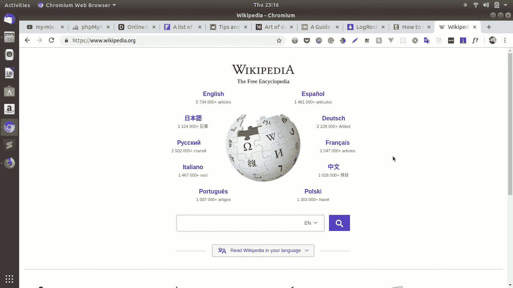
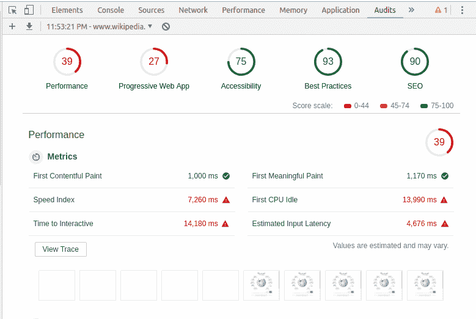
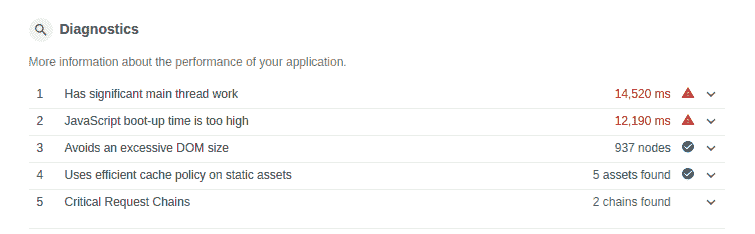
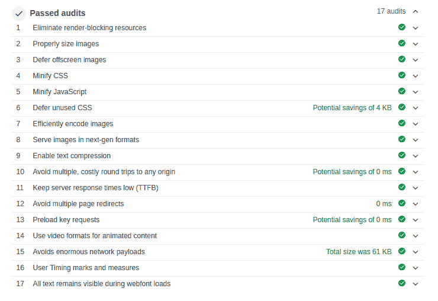
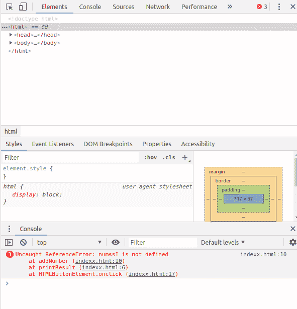
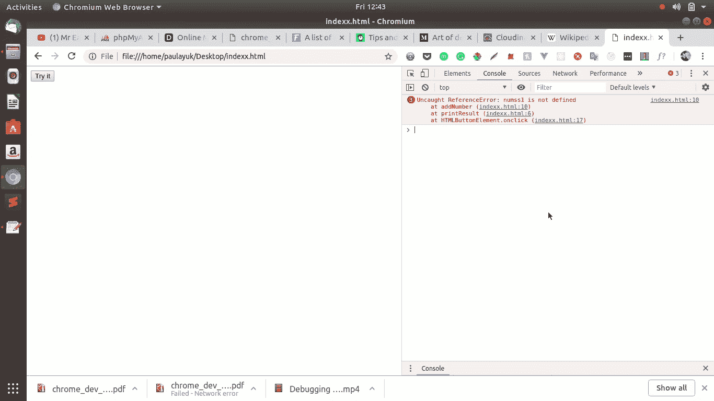
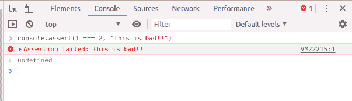
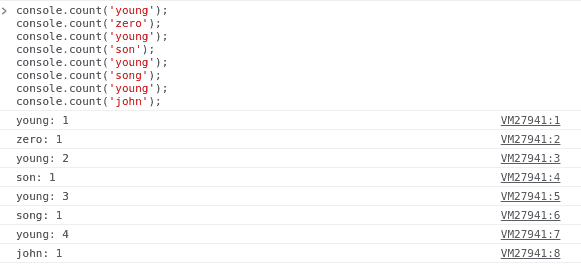
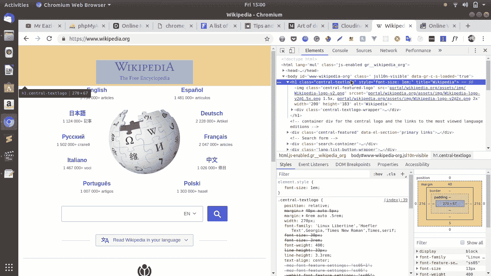

# 使用 Chrome DevTools 提高加载性能和调试

> 原文：<https://blog.logrocket.com/better-development-with-chrome-developer-tools-78b7d688438a/>


Chrome 开发者工具是一个基于浏览器的控制台，预装了谷歌 Chrome。它不仅附带了许多工具和资源，使开发人员能够构建和调试 web 应用程序，而且还可以用来加速您的 web 开发过程。

在本教程中，我们将讨论如何提高您的网站的加载性能，有效的调试，以及使用 Chrome 开发工具时的一般提示和技巧。

### 提高负载性能

当试图提高性能时，你应该做的第一件事就是**审计**你的站点。在本例中，我们将是 wikipedia.org 的**审计**、T4。

用 Chrome Dev tools 审计你的网站:首先**右击**并检查打开工具面板，或者在 Linux/Windows 上按 **ctrl + shift + I** 或者在 mac 上按 **cmd + opt + j** 。之后，点击上方窗格上的箭头，并点击**审计**。



当审计面板打开时，您需要选择您的首选分析选项:


**设备:**表示您想要分析的设备。

**审计:**在这里，你选择你关心的具体审计。性能？最佳实践？我建议你不要遗漏任何东西。

**节流:**这模拟了大部分网站用户的网速。(据 [Akamai](https://www.akamai.com/us/en/multimedia/documents/state-of-the-internet/q1-2017-state-of-the-internet-connectivity-report.pdf) 称，全球平均连接速度为 7.2)。考虑到用户的位置，这个选项非常重要。

最后一个选项**清除存储**删除所有存储的数据，并模拟第一次访问您的网站。我建议你第一次想审计你的网站时检查这个。

现在，单击 Run Audits，等待几秒钟，它将生成一份包含您的网站状态的报告。这是我们测试网站的一份报告:



根据您选择的审核，将为您的网站生成一份报告。每个审核至少有两个部分(指标和通过的审核)。让我们讨论一下绩效审计以及如何提高绩效审计。

你看到的第一个明显的信息是性能分数。现在是 **39** 。因为它是在 **100** 之上测量的，所以你的目标应该是至少达到 75%。值得庆幸的是，dev tools 让我们了解了如何改进我们的网站。将鼠标悬停在某个指标上以了解它，或单击`learn more`阅读它。

**第一个内容丰富的绘画:**表示用户看到你的第一个内容所需要的时间。在我们的审计中，值 s 1.000ms 对于像维基百科这样的高流量网站来说是一个积极的分数。**互动时间:**这是用户可以在你的网站上执行操作之前的时间。例如，在用户能够看到任何有用的内容之前所花费的时间，在事件监听器被加载之前所花费的时间。这里大概需要 14.180ms，不太好。

如果您将鼠标悬停在这些指标上，您会发现更多关于如何解决它们的信息。



诊断部分显示了它发现的具体问题。绿色的复选标记表示您有一个很好的实现，而红色的停止标记表示有一个需要解决的问题。

在我们的例子中，我们有两个危险信号:**有一个重要的主线程网络，JavaScript 启动时间过长“**，让我们来看看它们:

1.  **有一个重要的主线程网络:**这是浏览器执行大部分活动的地方，比如解析 HTML/CSS 和其他功能。我们的审核分数是 **14，520 毫秒**，这意味着还有改进的空间。要了解更多关于改进的信息，你可以在 Chrome DevTools [博客](https://developers.google.com/web/updates/2018/05/lighthouse)上阅读这篇文章
2.  **Javascript 启动时间过长:**这衡量 Javascript 对页面加载性能的总体影响。JavaScript 可以通过以下方式降低页面速度:

*   推迟第一次有意义的绘画
*   减缓互动的时间

一些建议:

*   移除未使用的代码
*   在用户浏览器中缓存代码
*   缩小你的代码

通过阅读 Chrome DevTools [博客上的这篇文章，你可以了解更多关于改进 JavaScript 启动时间的信息。](https://developers.google.com/web/updates/2018/05/lighthouse)



此部分显示您的网站已经通过的所有审核。你可以通过查看绿色复选标记来判断这里的一切都是好的。

### 排除故障

由于 Chrome 基本上是一个 JavaScript 引擎，它在调试 JavaScript 应用程序时最有效，但也可以用于调试 HTML/CSS。让我们模拟一个 JavaScript 错误进行测试。创建一个名为`index.html`的文件，并向其中添加以下代码行:

```
<!DOCTYPE html> 
<html> 
  <head> 
    <script> 
    function printResult() { 
      document.write(addNumber(7, 8)); 
    } 
    function addNumber(num1, num2) { 
      var result = num1 + num2; 
      return result; 
    } 
    </script> 
  </head> 
  <body> 
    <button type="button" onclick="printResult()">Try it</button>       </body> 
</html>
```

这个函数将两个数相加，并将结果打印在屏幕上。然而，让我们故意放一个错误，这样我们就可以试验如何使用 Chrome DevTools 进行调试。就像这样改变一个函数:

```
function addNumber(num1, num2) { 
  var result = numss1 + num2; 
  return result; 
}
```

现在，当我们试图点击它，我们没有得到回应，让我们看看如何开发工具可以帮助我们跟踪错误。在 Linux/Windows 上，通过右键单击或按下 **ctrl + shift + I** 打开面板；如果你在 Mac 上，则按下 **cmd + opt + j** 打开面板。



如果您查看控制台，您会看到错误消息。**第一行**告诉你发生错误的文件，**第二行**显示函数和出错的行，**第三行**显示触发错误的动作。



当您在控制台中单击错误文件时，它会在控制台的 sources 选项卡下打开该文件。如果您将鼠标悬停在错误上，系统会提示您确切的错误消息。现在，如果您通过更改这条线`var result = num1 + num2`来修复错误，您会看到错误将会消失。用开发工具调试代码还有很多方法，比如设置断点、监听器等。

要阅读更多关于使用 **Chrome 开发工具**进行调试的信息，请看这里的[。](https://developers.google.com/web/tools/chrome-devtools/)

### 提示和技巧

有许多事情可以用开发工具来检查。我们来看几个。

**测试**

您可以通过使用 **assert** 函数来模拟一个 JavaScript 测试环境。在您的开发工具控制台中，键入以下代码:

```
console.assert(1 === 2, "this is bad!!")
```

您应该会看到以下屏幕:



另外，请注意，如果您试图测试像`1 === 1`这样的真值，控制台上不会记录任何内容，因为**断言**只会记录假值。

**查看 DOM 元素**

您可以通过两种方式查看页面上的 Dom 元素，一种是:`console.log(‘tagname’)` —这将只记录页面上元素的内部属性。您还可以使用:`console.dir(‘tagname’)` —这将记录关于元素的每一个细节。比如样式、子节点、id、innerHtml 等等。

**计算数值或属性**

很多时候你可能想记录一个元素在你的页面上被使用的次数，你可以用 count 函数很容易的做到。这将显示一个元素在页面上被调用的次数。为了演示起见，让我们记录人名。在您的控制台中键入:

```
console.count('young'); console.count('zero'); console.count('young'); console.count('son'); console.count('young'); console.count('song'); console.count('young'); console.count('john');
```

您应该会得到以下结果:



**隔离 DOM 元素**

如果你想知道更多关于一个元素的信息，但是因为代码太难而无法得到，你需要做的就是在元素窗格中点击标签名，一个变量($0)将被分配给它，你可以记录它。



### 结论

在这篇文章中，我们看到了 Chrome DevTools 可以增强我们开发的一些方式。还有很多技巧和窍门没有在本文中介绍，我建议大家继续探索并关注 Chrome DevTools [博客。](https://developers.google.com/web/tools/chrome-devtools/)

希望这篇文章对你有帮助！

## 使用 [LogRocket](https://lp.logrocket.com/blg/signup) 消除传统错误报告的干扰

[](https://lp.logrocket.com/blg/signup)

[LogRocket](https://lp.logrocket.com/blg/signup) 是一个数字体验分析解决方案，它可以保护您免受数百个假阳性错误警报的影响，只针对几个真正重要的项目。LogRocket 会告诉您应用程序中实际影响用户的最具影响力的 bug 和 UX 问题。

然后，使用具有深层技术遥测的会话重放来确切地查看用户看到了什么以及是什么导致了问题，就像你在他们身后看一样。

LogRocket 自动聚合客户端错误、JS 异常、前端性能指标和用户交互。然后 LogRocket 使用机器学习来告诉你哪些问题正在影响大多数用户，并提供你需要修复它的上下文。

关注重要的 bug—[今天就试试 LogRocket】。](https://lp.logrocket.com/blg/signup-issue-free)