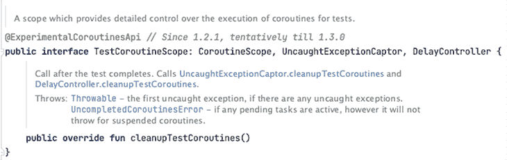

# Kotlin coroutine 单元测试更好的方式- LogRocket Blog

> 原文：<https://blog.logrocket.com/better-kotlin-coroutine-unit-testing/>

如果你用 Kotlin 编程，你最有可能使用协程来完成你的异步工作。

然而，使用协程的代码也应该进行单元测试。由于有了`kotlinx-coroutines-test`库，乍一看，这似乎是一个简单的任务。

然而，许多开发人员忽略了一件事，这可能会使您的测试不可靠:协程如何处理异常。

在本帖中，我们将介绍一个典型的项目情况，其中一些生产代码调用协程。这段代码经过了单元测试，但是测试配置并不完整，在协程中调用的代码可能会抛出异常。

然后，当协程中抛出的异常没有作为测试失败传播时，我们将找到一个解决方案来减轻这个问题，并为我们的所有测试自动化它。

## 先决条件

为了遵循本教程，我假设您:

*   已经有一个项目使用了 Kotlin 协程
*   使用 [JUnit 5 测试框架](https://junit.org/junit5/docs/current/user-guide/)和`kotlinx-coroutines-test`协程测试库建立单元测试
*   使用 IntelliJ IDEA 或 Android Studio 作为您的 IDE(查看运行单元测试的详细结果)

本教程中的示例测试使用 MockK 来模拟测试依赖，但这并不重要——您也可以使用其他模拟框架。

您还可以设置一个 CI 服务器来运行单元测试，或者从命令行运行它们——只要您可以检查测试运行时抛出的异常。

## 使用协程的示例产品代码

作为协程通常如何在生产中运行的基本机制的一个例子，我将使用一个简单的 presenter 类连接到`ApiService`来获取用户数据，然后在 UI 中显示它。

由于`getUser()`是一个挂起函数，并且我们想要利用结构化并发，我们必须在包装了`CoroutineContext`的`CoroutineScope`中启动它。您的项目中的特定逻辑可能会有所不同，但是如果您使用结构化并发，调用协程的机制将是相似的。

我们必须将协程上下文注入到呈现者的构造函数中，这样就可以很容易地替换它来进行测试:

```
class UserPresenter(
  val userId: String,
  val apiService: ApiService,
  val coroutineContext = Dispatchers.Default
) {

  init {
    CoroutineScope(coroutineContext).launch {
      val user = apiService.getUser(userId)
      // Do something with the user data, e.g. display in the UI
    }
  }
} 

```

## 协程逻辑的单元测试

对于这个演示者，我们有一个示例单元测试，测试在演示者被实例化时，我们是否调用了 API 方法来获取用户数据:

```
class UserPresenterTest {

  val apiService = mockk<ApiService>()

  @Test
  fun `when presenter is instantiated then get user from API`() {

    val presenter = UserPresenter(
      userId = "testUserId",
      apiService = apiService,
      coroutineContext = TestCoroutineDispatcher()
    )

    coVerify { apiService.getUser("testUserId") }
  }
}

```

这里，我们使用了[mock 嘲弄框架](https://mockk.io)来嘲弄`ApiService`依赖；您可能在项目中使用了另一个模仿框架。

我们还将一个`TestCoroutineDispatcher`作为协程上下文注入到我们的表示器中。`TestCoroutineDispatcher`是`kotlinx-coroutines-test`库的一部分，允许我们在测试中更容易地运行协程。

通过使用 MockK 的`coVerify {}`块，我们可以验证`getUser()`方法是否如预期的那样在被模仿的`ApiService`上被调用。

然而，MockK 是一个严格的模仿框架，这意味着它要求我们使用以下语法定义被模仿的`ApiService`的`getUser()`方法的行为:

```
coEvery { 
  apiService.getUser("testUserId") 
} returns User(name = "Test User", email = "[email protected]")

```

正如您在本节开始的示例测试中所看到的，`getUser()`行为的定义已经丢失。这是因为我们忘了定义它。

在编写测试时，有时会发生这种情况。如果出现这种情况，MockK 将在运行测试时抛出一个异常，提醒我们缺少配置，测试应该会失败。

### 测试通过，但是抛出了一个异常

然而，当我们在 IDE 或持续集成服务器上运行测试时，它通过了！

```
UserPresenterTest - PASSED 1 of 1 test
  when presenter is instantiated then get user from API() - PASSED

```

IDE 和 CI 服务器都没有告诉我们忘记配置被模仿的`ApiService.getUser()`行为。

然而，当您在 IntelliJ IDEA 中单击看似绿色的测试结果时，您会看到记录了一个由 MockK 抛出的异常:

```
Exception in thread "Test worker @coroutine#1" 
io.mockk.MockKException: 
no answer found for: ApiService(#1).getUser(testUserId, continuation {})

```

不幸的是，这个异常没有作为测试失败传播到 JUnit 测试框架中，使测试变成绿色，给我们一种错误的安全感。我们的任何报告工具(IDE 或 CI)都不会让我们一眼就看出哪里出错了。

当然，如果你有成百上千的测试，仅仅为了确保你没有忘记模仿某个东西而点击每一个测试是不切实际的。

### 为什么会这样？

协程在内部处理异常，默认情况下不会将它们作为测试失败传播到 JUnit。此外，协程在默认情况下也不会向 JUnit 报告未完成的协程。因此，我们的代码中可能有泄漏的协程，而我们甚至没有注意到它。

在 Kotlin coroutines GitHub 中有一个关于这个主题的有趣的[讨论，](https://github.com/Kotlin/kotlinx.coroutines/issues/1205)[特别是关于一项调查和解决这个问题的不同方法](https://github.com/Kotlin/kotlinx.coroutines/issues/1205#issuecomment-880411987)。

### `runBlockingTest`能修好吗？

上面提到的关于 GitHub 的讨论提到，即使我们将测试代码包装在`runBlocking{}`或`runBlockingTest{}`块中，协程异常也不会作为测试失败传播。下面是修改后的测试，尽管抛出了一个异常，但仍然通过了测试:

```
  @Test
  fun `when presenter is instantiated then get user from API`() = runBlockingTest {

    val presenter = UserPresenter(
      userId = "testUserId",
      apiService = apiService,
      coroutineContext = TestCoroutineDispatcher()
    )

    coVerify { apiService.getUser("testUserId") }
  }

```

## 使用`TestCoroutineScope`将异常作为测试失败传播

如果你浏览 [`kotlinx-coroutines-test`库](https://github.com/Kotlin/kotlinx.coroutines/tree/master/kotlinx-coroutines-test%20target=)，你会发现`TestCoroutineScope`，这似乎正是我们正确处理异常所需要的。



`cleanupTestCoroutines()`方法重新抛出任何在测试过程中可能发生的未被捕获的异常。如果有任何未完成的协程，它也会抛出异常。

### 在测试中使用`TestCoroutineScope`

为了使用`TestCoroutineScope`，我们可以用`TestCoroutineScope.coroutineContext`代替测试中的`TestCoroutineDispatcher()`。我们还必须在每次测试后调用`cleanupTestCoroutines()`:

```
class UserPresenterTest {

  val apiService = mockk<ApiService>()
  val testScope = TestCoroutineScope()

  @Test
  fun `when presenter is instantiated then get user from API`() {

    val presenter = UserPresenter(
      userId = "testUserId",
      apiService = apiService,
      coroutineContext = testScope.coroutineContext
    )

    coVerify { apiService.getUser("testUserId") }
  }

  @AfterEach
  fun tearDown() {
    testScope.cleanupTestCoroutines()
  }
}

```

正如你所看到的，使用`TestCoroutineScrope`最大的好处是我们不必改变我们的测试逻辑本身。

### 测试现在准确地失败了

让我们再做一次测试。现在，我们看到丢失的模拟异常作为测试失败传播到 JUnit:

```
UserPresenterTest - FAILED 1 of 1 test
  when presenter is instantiated then get user from API() - FAILED

  io.mockk.MockKException: 
  no answer found for: ApiService(#1).getUser(testUserId, continuation {})

```

此外，如果我们在测试中有一个未完成的协程，它会报告测试失败。

## 自动化测试配置

通过创建一个 JUnit5 测试扩展，我们可以自动化适当的测试配置以节省时间。

为此，我们必须创建一个`CoroutineTestExtension`类。这个类实现了`TestInstancePostProcessor`，它在创建后将`TestCoroutineScope()`注入到我们的测试实例中，这样我们就可以在测试中轻松使用它。

该类还实现了`AfterEachCallback`，因此我们不需要将`cleanupTestCoroutines()`方法复制并粘贴到每个测试类中:

```
@ExperimentalCoroutinesApi
class CoroutineTestExtension : TestInstancePostProcessor, AfterEachCallback {

   private val testScope = TestCoroutineScope()

   override fun postProcessTestInstance(
           testInstance: Any?, 
           context: ExtensionContext?
   ) {
       (testInstance as? CoroutineTest)?.let { it.testScope = testScope }
   }

   override fun afterEach(context: ExtensionContext?) {
       testScope.cleanupTestCoroutines()
   }
}

```

我们还可以为所有要实现的单元测试类创建一个`CoroutineTest`接口。这个接口用我们刚刚创建的`CoroutineTestExtension`类自动扩展:

```
@ExperimentalCoroutinesApi
@ExtendWith(CoroutineTestExtension::class)
interface CoroutineTest {

   var testScope: TestCoroutineScope
}

```

### 在测试中使用`CoroutineTestExtension`

我们的测试类现在只实现了`CoroutineTest`。

注意，被覆盖的`testScope`是由我们刚刚编写的`CoroutineTestExtension`设置的。这就是为什么将它标记为`lateinit var`完全没问题(在 Kotlin 中允许用`lateinit var`覆盖`var`):

```
class UserPresenterTest : CoroutineTest {

  val apiService = mockk<ApiService>()
  override lateinit var testScope: TestCoroutineScope

  @Test
  fun `when presenter is instantiated then get user from API`() {

    val presenter = UserPresenter(
      userId = "testUserId",
      apiService = apiService,
      coroutineContext = testScope.coroutineContext
    )
    // No changes to test logic :)
  }
}

```

现在，您的测试将正确地将所有协程异常和未完成的协程报告为测试失败。

## 结论

通过在您的测试中使用`CoroutineTestExtension`,无论何时当您的协程中出现异常或者您的协程未完成时，您都可以确信您的测试会准确地失败。不会再有传递虚假安全感的假否定。

此外，由于有了`CoroutineTest`接口，正确配置您的测试将像在您的测试中编写两行额外的代码一样简单。这使得人们更有可能真的去做。

## LogRocket :即时重现你的安卓应用中的问题。

[](https://lp.logrocket.com/blg/kotlin-signup)

[LogRocket](https://lp.logrocket.com/blg/kotlin-signup) 是一款 Android 监控解决方案，可以帮助您即时重现问题，确定 bug 的优先级，并了解您的 Android 应用程序的性能。

LogRocket 还可以向你展示用户是如何与你的应用程序互动的，从而帮助你提高转化率和产品使用率。LogRocket 的产品分析功能揭示了用户不完成特定流程或不采用新功能的原因。

开始主动监控您的 Android 应用程序— [免费试用 LogRocket】。](hhttps://lp.logrocket.com/blg/kotlin-signup)