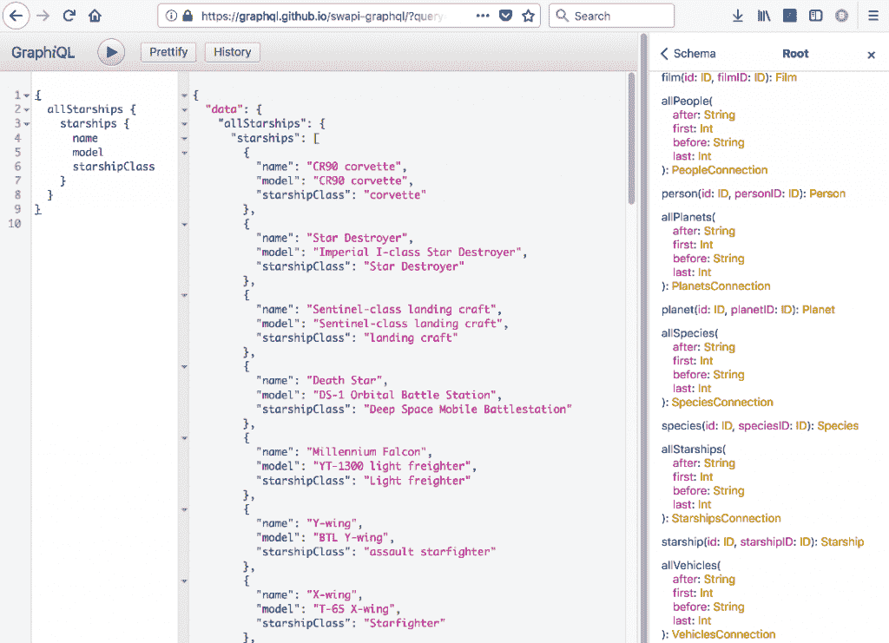
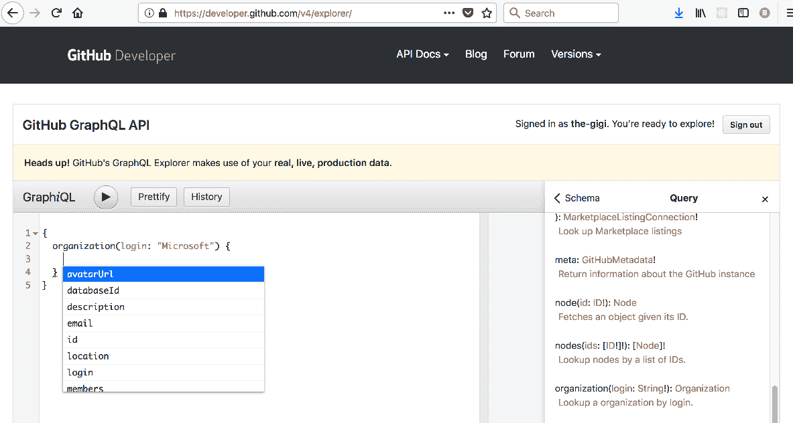
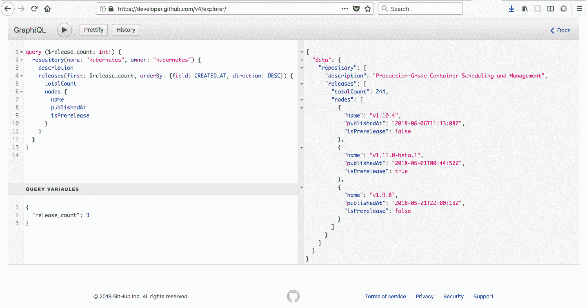
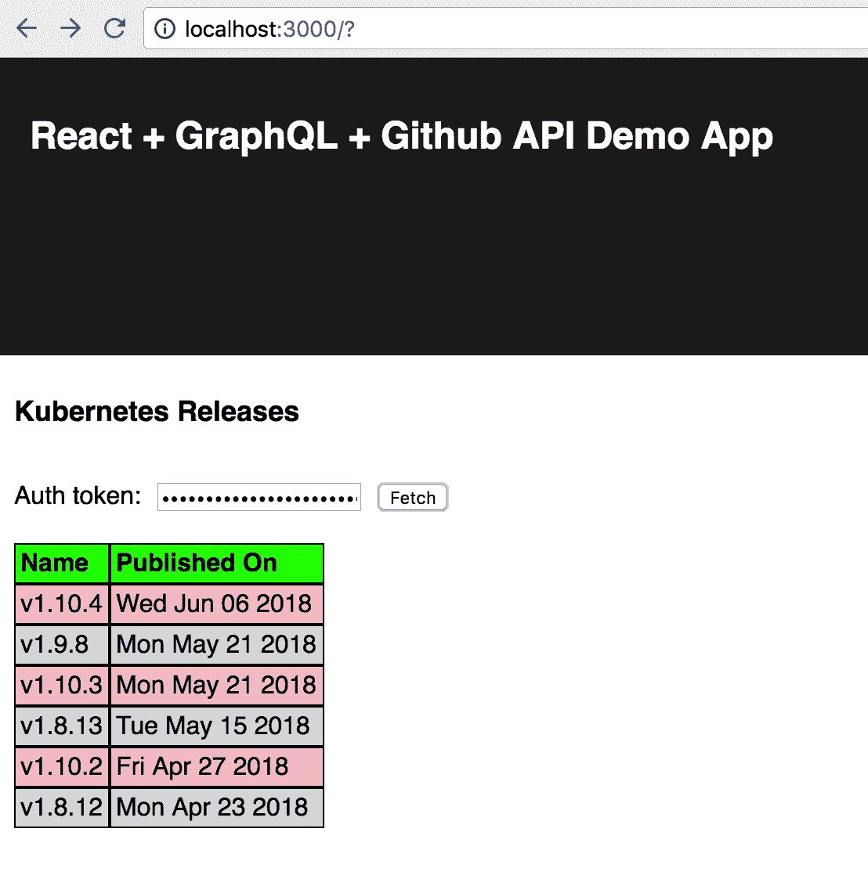

# 超越 REST——使用 GraphQL 塑造您的数据日志博客

> 原文：<https://blog.logrocket.com/beyond-rest-using-graphql-to-shape-your-data-6a04650e6242/>


### 概观

GraphQL 是一个令人兴奋的 API，用于专门查询和操纵分层数据。与 REST 相比，它非常灵活，有很好的工具，并提供了很多好处。

脸书在 2012 年开发了它，并使用它来驱动其庞大的社交图。GraphQL [在 2015 年开源后，采用率飙升](http://graphql.org/users/)。

在本教程中，您将学习 GraphQL 的原理，它与 REST 的比较，如何实现查询，以及构建一个很酷的 React 应用程序来访问 Github GraphQL。

### 图形 SQL？

GraphQL 首先是一种查询语言和规范，它为前端开发人员提供了查询图形和分层数据的强大能力。

使用 GraphQL，您可以通过一次调用获取不同深度的许多资源。但是，GraphQL 并没有就此止步。它还支持数据、变量甚至订阅(通过 WebSockets)的变化。

GraphQL 的基础是它的类型系统。有像字符串和整数这样的基本类型，也有具有命名属性的复杂类型。每个属性都有一个类型，可以是基本的，也可以是复杂的。

这就是等级制度的由来。当复杂类型具有本身就是复杂类型的属性时。特定的 GraphQL 应用程序有一个定义所有类型的模式。最好的部分是 GraphQL 支持自省，您可以查询它的模式来发现所有类型及其属性。

[](https://logrocket.com/signup/)

让我们看一个模式定义语言的简单例子。这里有两种类型:玩家和团队。一个队可以有很多球员，一个球员属于一个队。此外，球队和球员都有名字和他们赢得的冠军数。

```
type Player {
 id: ID
 name: String!
 team: Team!
 championshipCount: Integer!
}

type Team {
 id: ID
 name: String!
 players: [Player!]!
 championshipCount: Integer!
}
```

请注意，team 的 players 属性实际上是一个 player 对象数组。ID 属性是 GraphQL 本身提供的基本类型。感叹号表示属性不能为空。你可以在这里找到完整的规格。

查询也是类型。下面是一个返回所有玩家的简单查询:

```
type Query {
 allPlayers: [Player!]!
}
```

为了创造新的玩家，我们可以定义一个突变:

```
type Mutation {
 createPlayer(name: String, 
 championshipCount: Int, 
 teamId: String): Player
}
```

这看起来很像一个函数，但它是一个类型。解析/解析客户端发送的 GraphQL 表达式并应用它们是服务器的工作。

GraphQL 的另一个有趣之处是它的工具。我非常喜欢交互式图形浏览器 [GraphiQL](https://github.com/graphql/graphiql) 。它允许您尝试不同的查询，同时显示目标 GraphQL 模式，甚至具有自动完成和内置的
验证。

这是一个在 https://graphql.github.io/swapi-graphql 从星球大战电影模式中查询飞船的例子。



### GraphQL 与。休息一下

如果你眯着眼睛看，REST 和 GraphQL 看起来非常相似。两者都遵循严格的概念框架，都使用 HTTP 作为传输，并且通常都使用 JSON 作为有效负载。

然而，相似之处到此为止。REST(表述性状态转移)将世界视为一组资源，您可以在这些资源上执行 CRUD(创建、读取、更新和删除)操作。它与 HTTP 动词紧密耦合，旨在利用缓存等 web 基础设施。这是一个巧妙的想法，但是事实证明，严格使用基于资源的观点来对真实世界的领域建模是相当困难的。出于实际原因，开发人员很快偏离了纯 REST 方法，但仍然称他们的 API 为 RESTful。

另一方面，GraphQL 将世界视为具有属性的连接实体的图形。这种节点、边和属性视图对于建模世界来说更加自然，并且受到正式模式的支持。

此外，GraphQL 解决了 REST APIs 一直难以解决的可怕的 N+1 问题。假设我们将《星球大战》电影建模为 REST API。我们将为电影、角色、导演、星际飞船、行星等设置单独的端点。每个资源将由 ID 标识。

现在，让我们尝试获取一些嵌套信息，例如，让我们获取每部电影的导演姓名、所有角色以及每个角色的姓名、眼睛颜色和星球名称。要获得这些信息，首先我们需要获取所有的电影(1 个查询返回 N 个结果)。电影资源将包含其导演的 ID 和角色 ID 列表。现在，对于每部电影，我们需要访问每部电影的导演端点并获取导演(N 个查询返回 1 个结果)，然后我们需要聚合所有电影的所有角色 id，删除重复项并访问每部电影的角色端点。一旦我们得到了角色，我们需要让每个角色到达行星的终点并取回它的母星。

如果你遵循严格的休息原则，那就没有办法了。你可以设计一个定制的端点，就像电影和他们的导演和角色和他们的家一样。但是，这不是 REST，它感觉很笨拙，而且每当前端决定他们需要一些其他方法来查询数据时，您必须不断更改后端以支持不同的定制端点。

REST 的另一个问题是过度获取。无论何时获得资源，都会获得它的所有属性或字段。通常，一个资源(或实体)会有许多属性，但是您只对名称或标题或所有属性的其他子集感兴趣。对于 REST，没有办法指定它。

同样，您可以想出一种方法将它编码到查询参数中，但是想想如果您也有定制的端点来获取分层数据，那将是多么麻烦。您必须为查询中的每个实体类型指定您感兴趣的属性。GraphQL 的查询语言通过其层次结构支持准确地获取您自然想要的内容，由于其模式，甚至可以生成工具和代码来自动验证它。

最后，但同样重要的是，GraphQL 超越了 HTTP，支持 WebSockets 上的订阅。客户端创建与服务器的稳定连接，这可以将事件推送到客户端。

### Raw GraphQL 诉 Apollo GraphQL 客户端

没有订阅的基本 GraphQL 的编程 API 非常简单。有一个 HTTP 端点、一个定义良好的模式和一个定义良好的查询语言，让您可以发送一个 JSON blob 来按照您想要的方式分割数据。当然，当您需要遍历大型数据集时，GraphQL 也支持分页。因此，您可以使用任何 HTTP 客户端来查询(或改变)任何 GraphQL 服务。

* * *

### 更多来自 LogRocket 的精彩文章:

* * *

如果您不需要订阅(或者您连接到的 GraphQL 服务器没有定义任何订阅)，您可以在 React 应用程序中使用标准的 fetch API(或 Axios)。然而，如果你想将订阅整合到你的应用程序中，我推荐使用 [Apollo 客户端库](https://www.apollographql.com/docs/react/essentials/get-started.html)。

Apollo 客户端还增加了一些其他不错的功能，比如:

*   声明性数据提取
*   自动缓存
*   混合本地和远程数据

让我们关注基本的 GraphQL React 以及如何将其与 React 应用程序集成。Apollo 客户端的魔力只会妨碍理解正在发生的事情，如果不是不可能的话，也会使理解变得更加困难。

### 了解 GitHub GraphQL API

GitHub(或者应该说微软 GitHub？)公开了一个非常复杂和深入的 [GraphQL API](https://developer.github.com/v4) 。该模式非常精细，包含许多类型，表示 GitHub 的深层对象模型。

下面是 Github GraphQL API 支持的类型列表，每种类型都有几个示例:

*   查询(字段、连接)
*   突变(createProject，addStar)
*   对象(责备、提交、提交注释)
*   接口(参与者，可分配)
*   枚举(GistPrivacy，DeploymentState)
*   联合(RequestedReviewer，MilestoneItem)
*   InputObjects (CommitAuthor，ReleaseOrder)
*   标量(URI，GitTimestamp)

值得注意的是，不支持订阅。

我没有数过，但是很容易就有一百多种不同的类型反映了 GitHub 的每一个可编程和可搜索的方面。

GitHub 甚至嵌入了一个 GraphiQL [explorer](https://developer.github.com/v4/explorer/) ,你可以玩它来熟悉它提供的丰富选项。右侧的模式面板为所有根类型提供了即时参考，当您将它与自动完成功能结合使用时，结果是一种非常直观的交互式体验。

下面是一个屏幕截图，展示了右边的模式文档(带超链接)和左边的自动完成:



让我们疯狂吧。微软最近已经成为开源的典范(这还不是最疯狂的部分)。下面的查询怎么样:获得微软存储库的总数及其累积的磁盘使用量+三个最受欢迎的微软回购(基于按流行度排序的星级数),对于每个回购显示项目的名称、url、星级数和最后提交作者的用户名(URL)。

以下是 GraphQL 查询:

```
{
  organization(login: "Microsoft") {
    repositories(first: 3, 
                 orderBy: { field: STARGAZERS, 
                             direction: DESC }) {
      totalCount
      totalDiskUsage
      nodes {
        name
        homepageUrl
        stargazers {
          totalCount
        }
        commitComments(last: 1) {
          nodes {
            author {
              url
            }
          }
        }        
      }
    }
  }
}
```

结果相当可观。微软在 Github 上有 1841 个 Git 存储库，总磁盘使用量约为 44 GB(我从交互文档中了解到的单位是千字节)。排名前 3 的项目是 VSCode (52，314 ★)、TypeScript (35，065 ★)和令人惊讶的认知工具包(14，590 ★)。

以下是完整的 JSON 回应:

```
{
  "data": {
    "organization": {
      "repositories": {
        "totalCount": 1841,
        "totalDiskUsage": 44528492,
        "nodes": [
          {
            "name": "vscode",
            "homepageUrl": "https://code.visualstudio.com",
            "stargazers": {
              "totalCount": 52314
            },
            "commitComments": {
              "nodes": [
                {
                  "author": {
                    "url": "https://github.com/CruiseMan"
                  }
                }
              ]
            }
          },
          {
            "name": "TypeScript",
            "homepageUrl": "http://www.typescriptlang.org",
            "stargazers": {
              "totalCount": 35065
            },
            "commitComments": {
              "nodes": [
                {
                  "author": {
                    "url": "https://github.com/adiebohi"
                  }
                }
              ]
            }
          },
          {
            "name": "CNTK",
            "homepageUrl": "https://docs.microsoft.com/cognitive-toolkit/",
            "stargazers": {
              "totalCount": 14590
            },
            "commitComments": {
              "nodes": [
                {
                  "author": {
                    "url": "https://github.com/tprimak"
                  }
                }
              ]
            }
          }
        ]
      }
    }
  }
}
```

我邀请你，勇敢的读者，从 Github 的 [REST API](https://developer.github.com/v3/) 中提取同样的信息。告诉我你进行了多少次 API 调用，获取了多少冗余数据。

### React 应用程序中的 GraphQL 查询

好吧，GraphQL 很酷。让我们看看它在 React 应用程序中是如何工作的。

具有讽刺意味的是，[演示应用](https://gitlab.com/the-gigi/react-graphql-github)存储在 GitLab 上。这与微软最近的公告无关。我在 [GitHub](https://github.com/the-gigi/) 和 [GitLab](https://gitlab.com/the-gigi) 上有很多项目，我计划继续使用这两个项目。该应用程序在 GitHub GraphQL API 中查询最近的 [Kubernetes](https://kubernetes.io/) 版本，并将它们显示在一个表格中。

我关心 Kubernetes 版本，因为 PacktPub 最近出版了我的书[掌握 Kubernetes](https://www.amazon.com/Mastering-Kubernetes-Master-container-management/dp/1788999789) 的第二版，这是最新的 1.10 Kubernetes 版本。我正在密切关注 Alpha 和 Beta 版本，以保持对最新发展的了解。

下面是我将使用的查询:



这是应用程序本身:



我为我糟糕的设计技巧道歉。

### 钻研代码

无论如何，这个应用是基于[创建-反应-应用](https://github.com/facebook/create-react-app)的。很少有理由以任何其他方式在 2018 年启动 React 项目。

让我们直接进入代码。

有一个主应用程序组件、一个数据表单组件和一个发布列表组件。该应用负责与 Github API 服务器的所有交互。DataFetchForm 是一个负责获取 Github 访问令牌的表单，该令牌是向 Github GraphQL 服务器认证应用程序所必需的。ReleaseList 是一个简单的功能组件，它显示带有每个版本名称及其发布时间的表格。

#### 数据表单组件

该组件在其状态中存储令牌(最初为空)以及在其 props 中接收的 onFetch 回调。

```
import React, {Component} from 'react'

class DataFetchForm extends Component {
  constructor(props) {
    super(props)
    this.state = {
      onFetch: props.onFetch,
      token: '',
    }
  }
```

render()方法显示带有 auth 令牌(security，first)的密码输入字段的表单。对吗？)和一个“获取”提交按钮。仅当您输入令牌时,“获取”按钮才会启用。每当您更改令牌的值时，就会调用 onChange()方法，当您单击“fetch”时，就会调用 onFetch()方法。

```
render = () => {
    return (
        <form onSubmit={this.onSubmit}>
        <label>
          Auth token:
          <input type="password" 
                 value={this.state.token} 
                 onChange={this.onChange}
          />
        </label>
        <input type="submit" 
               value="Fetch" 
               disabled={this.state.token === ''}
        />
      </form>
    )
  }
```

onChange()方法只存储当前状态的 auth 令牌:

```
onChange = event => this.setState({…this.state, token: event.target.value})
```

onSubmit()方法调用 onFetch()回调函数，该函数是作为 prop 从其父方法接收的，并向其传递 auth 令牌:

```
onSubmit = event => {
     this.state.onFetch(this.state.token)
     event.preventDefault()
 }
```

#### ReleaseList 组件

此组件在 esch 行中显示一个带有发布名称和发布日期的表。它的名气在于它可以忽略发行前的版本。它还将发布时间戳转换成更人性化的日期字符串。然后，它构建了一个名为“行”的数组，并把它们放在表格样板的中间。

```
import React from 'react'
import '../App.css'

const ReleaseList = ({count, releases, includePrerelease}) => {
  if (releases.length === 0) {
    return null
  }
  if (!includePrerelease) {
    releases = releases.filter(r => !r.isPrerelease)
  }

let rows = releases.map(r => <tr key={r.name}>
                                  <td>{r.name}</td>
                                  <td>{(new Date(r.publishedAt)).toDateString()}</td>
                                </tr>)
  return  <table>
            <thead>
              <tr>
                <td>Name</td>
                <td>Published On</td>
              </tr>
            </thead>
            <tbody>
              {rows}
            </tbody>
          </table>
}

export default ReleaseList
```

如果你一定要欣赏这个网页设计的经典杰作，你可以看看 [App.css 文件](https://gitlab.com/the-gigi/react-graphql-github/blob/master/src/App.css)。

#### 应用程序组件

应用组件是酷小子。它从导入 React、各种组件、css 文件和 [Axios](https://github.com/axios/axios) (比内置的 fetch API 更好的 HTTP 客户端)开始。然后，它定义 GitHub GraphQL API 端点和请求发布的数量。州政府只是保留了一份最初为空的释放名单。

```
import React, {Component} from 'react'
import './App.css'
import ReleaseList from "./components/ReleaseList"
import DataFetchForm from "./components/DataFetchForm"
import axios from 'axios'

const githubApiUrl = 'https://api.github.com/graphql'
const releaseCount = 10

class App extends Component {
  constructor(props) {
    super(props)
    this.state = {
      releases: []
    }
  }
```

render()方法也很普通。它显示标题、数据获取表单(向其传递 onFetch()方法)以及最后的 ReleaseList，其中包含发布计数、来自状态的发布列表以及 false 以忽略预发布发布。

```
render() {
    return (
      <div className="App">
        <header className="App-header">
          <h1 className="App-title">
            React + GraphQL + Github API Demo App
          </h1>
        </header>
        <h2 className="App-intro">
          Kubernetes Releases
        </h2>
        <DataFetchForm onFetch={this.onFetch}/>
        <ReleaseList count={releaseCount} 
                     releases={this.state.releases} 
                     includePrerelease={false}/>
      </div>
    )
  }
}
```

好了，我们开始吧。当用户在 dataFetch 表单中单击 fetch 按钮时，就会调用 onFetch()方法。查询字符串是多行 GraphQL 查询。注意，它必须以一个“查询”键盘开始，这在 graphiql explorer 中是不需要的。releaseCount 从文件顶部的常量注入。

然后，它调用 makes axios.post()传递 jsonified 查询和 auth 令牌。当结果返回时，它只是存储状态中的版本。提取数据需要使用**r . data . data . repository . releases . nodes**进行一些钻取，但这并不太糟糕。稍后，ReleaseList 组件将从这些数据中获得意义。

```
onFetch = (token) => {
    const query = `
      query { 
        repository(name: kubernetes, owner: kubernetes) {
          releases(first: ${releaseCount}, 
                   orderBy: { field: CREATED_AT, direction: DESC}) {
            totalCount
            nodes {
              name
              publishedAt
              isPrerelease
            }
          }
        }
      }
    `
axios.post(githubApiUrl, 
               JSON.stringify({query}), 
               {headers: {Authorization: `bearer ${token}`}})
      .then(r => {
        this.setState({...this.state, releases: r.data.data.repository.releases.nodes})
      })
      .catch(e => console.log(e))
  }
```

### 结论

GraphQL 是一个强大而灵活的工具，用于对分层数据进行切片和切块。它解决了 REST APIs 存在的一些重要问题，并拥有出色的工具和社区。

GitHub API 是一个全面的、设计良好的 GraphQL API，它展示了 GraphQL 在现实世界中的优势。我展示的演示应用程序展示了将 GraphQL 集成到 React 应用程序中是多么容易，即使没有像 ApolloClient 这样花哨的库。

现在，该是你玩 GraphQL 和构建酷东西的时候了。

## [LogRocket](https://lp.logrocket.com/blg/react-signup-general) :全面了解您的生产 React 应用

调试 React 应用程序可能很困难，尤其是当用户遇到难以重现的问题时。如果您对监视和跟踪 Redux 状态、自动显示 JavaScript 错误以及跟踪缓慢的网络请求和组件加载时间感兴趣，

[try LogRocket](https://lp.logrocket.com/blg/react-signup-general)

.

[ ](https://lp.logrocket.com/blg/react-signup-general) [](https://lp.logrocket.com/blg/react-signup-general) 

LogRocket 结合了会话回放、产品分析和错误跟踪，使软件团队能够创建理想的 web 和移动产品体验。这对你来说意味着什么？

LogRocket 不是猜测错误发生的原因，也不是要求用户提供截图和日志转储，而是让您回放问题，就像它们发生在您自己的浏览器中一样，以快速了解哪里出错了。

不再有嘈杂的警报。智能错误跟踪允许您对问题进行分类，然后从中学习。获得有影响的用户问题的通知，而不是误报。警报越少，有用的信号越多。

LogRocket Redux 中间件包为您的用户会话增加了一层额外的可见性。LogRocket 记录 Redux 存储中的所有操作和状态。

现代化您调试 React 应用的方式— [开始免费监控](https://lp.logrocket.com/blg/react-signup-general)。

* * *