# 超越标签:将符号学应用于网页设计

> 原文：<https://blog.logrocket.com/beyond-the-hashtag-applying-semiotics-to-web-design/>

## 介绍

无论是在现实生活中，还是在互联网上，人们每天都在与符号互动。从箭头和交通灯，到标签和进度条，我们已经习惯了许多符号的含义，因此成为符号学研究的主要对象。

在这篇文章中，我们将探索符号学背后的理论，以及我们如何利用对符号和符号的研究，以一种可访问的、引人入胜的方式为我们的网页设计提供信息，从而改善用户体验。

## 符号学简史

### 能指与所指

简而言之，符号学是对代表任何其他事物的任何事物的研究——符号，标志，你能想到的。虽然这个术语本身起源于 17 世纪，但直到 19 世纪末，语言学和语言系统的学者弗迪南·德·索绪尔才开始将符号学建立为一种理论。

根据索绪尔的符号学讲座，一个符号由两部分组成:

*   意符:符号、记号或占位符
*   所指:占位符的符号、标志是用来交流的概念

这里有一个例子:

你在街上开车。你会看到一个巨大的红色五边形。你停下来。

在这种情况下，“停止”是要传达的信息，即所指，而符号本身是代表这一信息的能指。

### 图标、索引和符号

在索绪尔工作期间，美国哲学家查尔斯·桑德斯·皮尔士也在研究符号和符号系统。皮尔士系统地阐述了个人符号及其分类的理论，他也称之为符号学。

根据皮尔斯的理论，符号有三种分类:

*   图标——这看起来像它所代表的东西。例如，一张船的图片看起来像一艘船。
*   指数——这显示了符号和它所代表的事物之间的某种物理联系。例如，指示着火的脚印或烟柱。
*   符号-没有链接。相反，观看标志的人必须学会这种联系。比如竖起大拇指。如果没有社会化的含义，举在空中的拇指本身没有任何意义。

皮尔士还认为，一个符号永远不可能有一个完全固定的意义，因为符号可以被重新利用和改造。以数字符号#为例。在某个时间点，这个符号仅仅代表一个数字。现在，世界上许多人把它看作是一个“标签”，它作为“英镑键”的日子已经过去很久了。

有了符号学的基础知识，在接下来的章节中，我们将了解更多关于理解符号和标志如何帮助我们改善网页设计和最终用户体验。

## 网页设计中的日常符号学

今天网络上使用的一些符号是从他们现实生活中的样子借来的，而另一些则是发明出来的，它们的含义随着时间的推移而学习。

在下表中，我们将根据皮尔士的符号分类来解释网络上一些最常见的符号。注意，我们不会在我们的分析中包括图标，因为图标仅仅是图形，正如上面解释的那样，它确切地代表了它们的外观。虽然在网站上发现的标志被普遍称为“图标”，但这些标志实际上属于皮尔斯的符号分类。

### **网络上熟悉的标志**

| **符号** | **描述** | **皮尔斯分类** |
|  | 这个标志本身就是一座房子，它本身可以作为一个直接的图标。然而，在 web 浏览器中，这个符号指向用户配置为浏览器主页的任何内容。 | 索引 |
|  | 就其本身而言，这个图像只是一个放大镜图标。然而，对于大多数搜索引擎来说，这个符号通过显示用户可以在哪里提交查询并返回结果来表示对某个主题的进一步了解。 | 索引 |
| 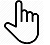 | 默认情况下，如果你使用电脑和鼠标浏览网页，当你将鼠标放在一个链接上时，它会变成一个人手的图像，第二个手指指向该链接。这表明您可以单击链接转到该资源。在现实世界中，这类似于以“就是这样”或“他们在那里”的心态指向某物或某人。 | 索引 |
|  | 互联网上最常用的社交媒体平台的标志是ー Facebook。 | 标志 |
|  | Instagram 的装饰符号可能会向观察用户表明，该应用程序或网站的主要目标是与相机相关的，具体来说，是智能手机的相机。然而，如果用户不习惯这两者之间的联系，标志和 Instagram 本身之间就没有逻辑意义。 | 标志 |
|  | Twitter 的蓝鸟将只是一只没有 Twitter 平台和它的标志之间的已知联系的鸟。 | 标志 |

## 符号在网页设计中的应用

当你更广泛地观察网络上的标志时，你会发现不同的标志有不同的功能。出于我们的目的，我们将这些功能分为四组:

*   动作标志
*   方向标志
*   表情符号
*   具象符号

### 动作标志

这些类别的符号允许您在网页上找到它们的任何地方执行特定的操作。例子包括:

### 方向标志

顾名思义，当你与这些符号互动时，它们可以帮助你从一个页面导航到另一个页面或者在一个页面内导航。这些迹象包括:

*   向后箭头
*   向前箭头
*   向上箭头
*   下箭头键

### 表情符号

这些是试图模仿人类面部和身体表情的标志。最现代的例子是表情符号(尽管我们许多人都记得“冒号-右括号”和“冒号-左括号”的时代)。

*   😄─微笑
*   🙁─微微皱眉的脸
*   🙂─微微笑着的脸
*   😠─愤怒

### 具象符号

这些标志代表一个过程、组织、公司或应用程序。例如:

*   照片墙
*   脸谱网
*   购物车

理解网络上的符号是很重要的，因为你已经习惯了它们，并开始理解它们的含义，而自己却不知道。下一次你看到一个你以前见过的标志时——尽管形状、大小或角度不同——你的潜意识已经准备好让你知道它意味着什么。

## 符号学与色彩理论

在某些情况下，一个标志本身并不能告诉用户这个标志想要传达的全部信息。色彩理论规定了色彩应该如何与符号相结合，以传达用户能够正确理解的信息。

如果我们回到前面的停车标志的例子，你会记得我们认识停车标志不仅仅是因为它是五边形的，上面写着“停车”，还因为标志本身是红色的。在许多文化中，红色象征着危险。因此，当我们看到红色停车标志时，我们会减速以避免风险。

在许多网站上，开发人员遵循相同的逻辑，在用户配置文件设置中使用红色来表示“危险区域”，在该区域执行的任何操作都可能产生不可逆转的后果。例如，删除一个帐户的按钮通常是红色的，因为如果用户删除了它，就有完全关闭帐户的危险。

同样，绿色通常与成功或“前进”联系在一起如果您曾经使用过允许您存储与您的用户帐户相关联的一些设置的 web 应用程序，则在成功存储后，您可能会看到一个绿色勾号。您可能还会注意到，当某个东西仍处于草稿模式时，会使用黄色或橙色，因为这些颜色(就像红灯一样)表示进度缓慢或不完整。

还有更多的例子需要注意，但是下次你发现自己在页面上执行操作时，试着观察一下网站是否使用了颜色和符号的组合来与你交流。

## 流行网站的符号学分析

在前面的段落中，您了解了 web 应用程序使用符号与用户交流。现在，您将了解互联网顶级网站如何在其用户界面上实施这些标志(如有必要，连同颜色),以便与用户交流和互动。下面列出了我们将分析的网站。

### Reddit

作为自称的“互联网首页”，Reddit 有自己的一套标志和符号，你必须知道。这是其品牌 DNA 的一部分。

对于其中的一些标志，Reddit 开发人员在它们旁边放上了最能描述其功能的名称，如“热门”、“新”和“热门”帖子。

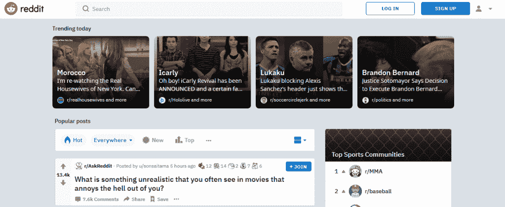

对于其他人来说，用户必须使用鼠标等指示设备与标志进行交互，工具提示会出现在标志下方，说明他们的姓名和描述(例如:金奖)。

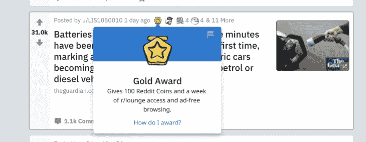

在 Reddit 的右上角，您会发现一个由半圆形状上的圆形组成的标志，旁边有一个向下的箭头标志。这不是 Reddit 独有的；这是“用户资料”的常见网络符号

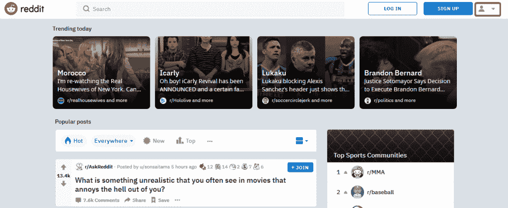

Reddit 还使用了经典的“停用账户”索引和颜色:一个垃圾桶图标，上面用红色写着“停用账户”。这意味着用户“当你点击这个按钮时，你的账户将被废弃，这是危险的”。"

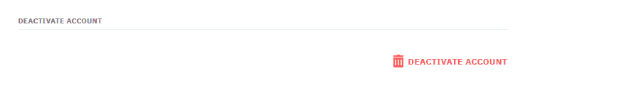

Deactivate account on Reddit

### 推特

Twitter 的大部分功能都隐藏在一个经过认证的系统后面，因此，你必须登录才能使用这个应用程序。

和 Reddit 一样，Twitter 内部有许多独特的用户体验标志。铃铛符号是什么意思？还是蓝色背景上的白色鸟毛和加号？书签标志呢？

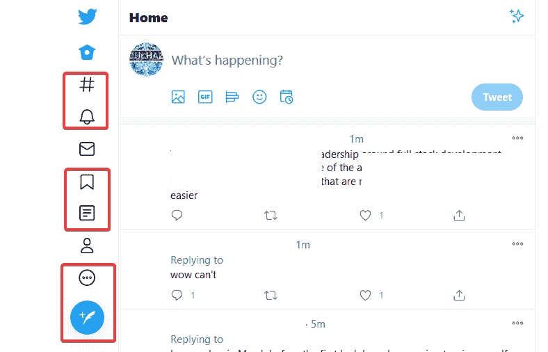

幸运的是，当用户悬停在符号上时，Twitter 会为每个符号提供解释。

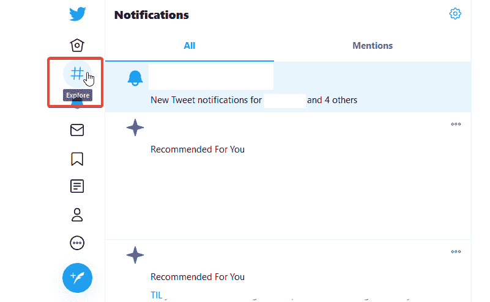

对于撰写和提交推文，Twitter 还使用符号来象征用户的帖子定制，包括:图像、gif、投票、表情符号和帖子时间。

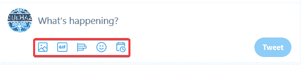

对于已经发布的推文，用户可以选择右上角的省略号来打开一个新的选项菜单。尽管省略号不是 Twitter 独有的，但是选项菜单是，正如你在下图中看到的。

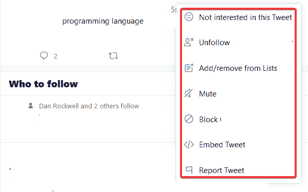

每个菜单选项都有一个符号，试图显示符号和设置名称之间的联系，例如，悲伤的表情符号表示您对推文不感兴趣，或者带有“X”的用户图标表示您想要取消关注用户帐户。

总的来说，Twitter 的开发人员在将文本与简单易懂的符号配对方面做得很好，即使没有文字，这些符号仍会传达相对清晰的意思，包括如果你点击它会发生什么的指示。

### 照片墙

像 Twitter 一样，Instagram 使用用户登录账户后可用的标志。与 Twitter 不同，Instagram 在符号和标志的使用上相当保守。

第一组标志位于界面的右上角，它们类似于你在分析 Reddit 和 Twitter 时看到的。唯一的“新”标志是那些看起来像折叠的纸飞机和圆圈中的指南针指针的标志。

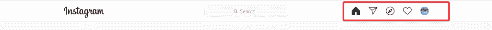

在 Instagram 上，纸平面结构通向向其他 Instagram 用户发送消息的界面；指南针指针是用来探索 Instagram 的。

与 Twitter 类似，每个帖子的右上角都有一个省略号，当你点击它时，会显示该帖子的附加设置。

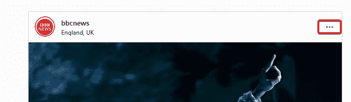

最后，每个 Instagram 帖子都有简单的线框标志，允许用户“喜欢”帖子、评论帖子、分享帖子或为帖子添加书签。

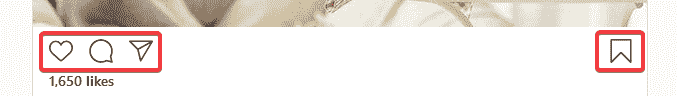

为了保持其界面的简单和吸引人，Instagram 只使用少数几个标志和非常少的特殊符号来引导用户通过其界面。

## 符号学遇上内化(i18n)

每个人都在使用网络，因此，不管用户的文化背景、地区或语言如何，设计网站以适应尽可能多的用户是有益的。这个过程被称为国际化或 i18n。

到目前为止，我们讨论的大多数迹象在网络上非常流行，这在我们分析的网站上显而易见。尽管如此，根据你所处的世界的不同，有些迹象会有不同的解释。

例如，我们之前讨论的右边的复选标记在大多数国家意味着 OK 或正确，但在日本，它意味着某事不正确。因此，在日本市场，复选标记应转换为圆圈，表示正确。改编是称为本地化或 l10n 的过程的一部分。

当然，这只是众多中[的一个例子。如果你发现自己在为一个面向国际受众的网站设计或使用标志，你应该从全球的角度考虑这些标志，并尝试使用国际公认的标志。](https://blog.busuu.com/what-hand-gestures-mean-in-different-countries/)

## 将符号学应用到你的下一个网络项目中

通过这篇文章，你已经了解了符号学，以及流行网站如何使用符号与用户交流。本着无障碍设计的精神，以下是我对在网络项目中使用标志和符号的四大建议:

*   坚持传统
*   在正确的地方使用标志
*   提供额外信息
*   使用图标库

### 坚持传统

保持简单。如果有一种流行的方式来表示某种东西，并且易于用户理解，那么你就不需要重新发明轮子。

一个明显的例子是大多数网站表示“用户档案”或“用户账户”的方式，就像我们在 Reddit 例子中看到的那样。当用户看到这个上面有一个小圆圈的半圆时，他们的大脑下意识地认为这是他们可以创建或更新帐户的地方。

另一个例子是在 Twitter 上为推文添加书签的标志，同样的标志也用于在 Instagram 上保存帖子。标志是相同的，在两个网站上执行相同的功能，ー为将来的目的保存一些东西，ー，虽然他们在两个网站上的名称不同。

出于同样的原因，避免使用流行的标志来表示不流行的东西。例如，你不应该用一个垃圾桶图标来代表创建一个新帖子。

### 在正确的地方使用标志

放大镜符号用在允许用户搜索数据库的网络表单中。想象一下，有人在搜索栏中使用了 home 符号。这是一个很大的“不”

当用户知道期望什么时，用户体验会更好，因此你应该坚持熟悉的位置——搜索栏中的放大镜，左上角的主页按钮，右上角的用户帐户，等等。

即使标志仍然表示相同的意思——主页按钮仍然表示主页，即使在搜索栏中，或者用户帐户仍然表示帐户，即使它被埋在页面底部——当涉及到网页上的标志时，位置很重要。

### 提供额外信息

在我们的分析中，如果你想创造完全属于你自己的标志，Reddit 是最好的例子。如果你成功了，你最好解释一下。

当你创建了一个标志，而你的用户不理解它，他们很可能会有不好的体验或者完全离开你的页面。有两种方法可以防止这种情况发生:

1.  贴上标签
2.  提供悬停信息。

在这两种情况下，您都希望使用文本来解释符号的含义以及用户可以用它来做什么。正如我们在这篇文章中了解到的，如果你在前面解释了这个标志，那么你的用户就会开始内化它的含义，当他们更多地回到你的网站的时候。

### 使用图标库

有很多图标库允许你在网站上使用符号。选择最适合你的项目。我的推荐是 [Fontawesome](https://fontawesome.com) 。别忘了:在今天的网络中，符号通常被称为图标(对不起，皮尔斯！).

## 结论

在这篇文章中，你已经了解到当符号学以一种简单易懂的方式应用到网页设计中时，你可以为你的网站用户创造一种直观的体验，这将使他们更有可能在未来使用你的网站。

关于符号学、符号以及通过非语言设计与用户沟通的更多信息，请查阅以下资源:

#### 参考

使用 [LogRocket](https://lp.logrocket.com/blg/signup) 消除传统错误报告的干扰

## [LogRocket](https://lp.logrocket.com/blg/signup) 是一个数字体验分析解决方案，它可以保护您免受数百个假阳性错误警报的影响，只针对几个真正重要的项目。LogRocket 会告诉您应用程序中实际影响用户的最具影响力的 bug 和 UX 问题。

然后，使用具有深层技术遥测的会话重放来确切地查看用户看到了什么以及是什么导致了问题，就像你在他们身后看一样。

LogRocket 自动聚合客户端错误、JS 异常、前端性能指标和用户交互。然后 LogRocket 使用机器学习来告诉你哪些问题正在影响大多数用户，并提供你需要修复它的上下文。

关注重要的 bug—[今天就试试 LogRocket】。](https://lp.logrocket.com/blg/signup-issue-free)

Focus on the bugs that matter — [try LogRocket today](https://lp.logrocket.com/blg/signup-issue-free).