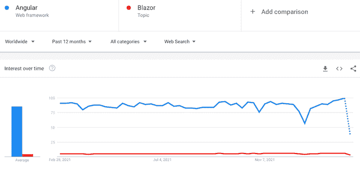

# Blazor vs. Angular 比较指南- LogRocket 博客

> 原文：<https://blog.logrocket.com/blazor-vs-angular-comparison/>

***编者按**:本对比指南于 2022 年 2 月 24 日最后一次更新，以反映 Angular v13 和 Blazor 更新所带来的变化。NET 6。*

Angular 的前身是 AngularJS，直到 2016 年，它的创建是为了让前端开发人员同时与前端和后端进行交互。这在当时非常有用，特别是因为后端通常是用其他语言构建的，比如 C#或 Java，这意味着它通常由不同的开发人员维护。

随着 SPAs 的出现，Angular 变得更加强大，新的竞争框架出现了，比如微软的 [Blazor](https://dotnet.microsoft.com/apps/aspnet/web-apps/blazor) 。Blazor 是一个 web 框架，允许 C#与 HTML 和 CSS 一起运行，创建组件和生成 spa。它是写在。NET 平台，在客户端和服务器端都带来了微软框架的所有功能。

在本文中，我们将比较 Angular 和 Blazor。我们将分析每个框架的社区优势，以及它们的 PWA/SPA 支持、异步特性和架构。

目录

## 棱角分明的优点

因为 Angular 是基于 JavaScript 的，所以有很多资源可以使用。让我们更详细地分析其中的一些。

### 成熟

相比 Blazor，Angular 已经存在很久了。这是一个生产就绪的框架，完全支持 MVC/MVVM 应用，目前被许多大公司使用。另一方面，Blazor 非常有前途，但仍在不断发展。

说到工装，Angular 也是领先的。Angular 对开发有 VS 代码支持，Blazor 只是在最近才实现了[。](https://visualstudiomagazine.com/articles/2019/04/23/vs-code-blazor.aspx)

关于库， [Angular Material](https://material.angular.io/) 是其中最著名的，尤其是因为它包含了谷歌的 [Material Design](https://material.io/) ，这是一种在谷歌产品中非常常见的设计语言。除此之外，通过 [NG Bootstrap](https://ng-bootstrap.github.io/#/home) 库，或 [PrimeNG](https://www.primefaces.org/primeng/#/) ，可以轻松建立其他主要设计库，如 Bootstrap。

Blazor 拥有自己的材料设计库的等效版本，但要达到这样的成熟水平还需要时间。Angular 还提供了几个选项来选择 [Angular 支持的工具](https://angular.io/resources?category=development)，包括 ide、UI 组件和数据库。

棱角分明极受欢迎。在写这篇文章的时候，它的 [GitHub 库](https://github.com/angular/angular)统计了 79.8k 个星和 21k 个叉。这无疑是前端社区中一个重要且受人喜爱的框架。

更难分析 Blazor 的受欢迎程度，[项目](https://github.com/dotnet/blazor)在正式成为【ASP.NET】项目的一部分后，被转移到 ASP.NET 核心回购。之前 Blazor 有 9.3k 星，683 叉。考虑 ASP.NET 的核心数据是不合适的，因为它们涉及到了除 Blazor 本身之外的许多其他因素。

另一个很好的比较是堆栈溢出。在撰写本文时，Angular 已经积累了总共 [272.6k 个问题](https://stackoverflow.com/questions/tagged/angular)，而 Blazor 只有 [7.9k 个问题](https://stackoverflow.com/questions/tagged/blazor)。

比较谷歌趋势中的两种技术，差距变得更加明显:



Google Trends comparison of worldwide interest in Angular and Blazor.

与 Blazor 相比，Angular 凭借如此强大的社区实力和悠久的历史，发展出了一个规模更大、投入更多的社区。你会找到比 Blazor 更多的关于 Angular 的内容、课程、书籍、博客和材料。

### PWA 支持

谷歌是渐进式网络应用程序的忠实粉丝，因此 Angular 也是。只需运行以下命令，就可以将它添加到 Angular 应用程序中:

```
ng add @angular/pwa

```

你可以猜测，对于谷歌的其他项目，比如著名的 Workbox。

在很长一段时间里，Blazor 被归类为不能进行 PWA 的框架。他们最近宣布支持 PWA，然而，和 Blazor 的许多事情一样，这是一项正在进行的工作。除了稳定之外，一些开发者抱怨初始下载应用程序太大，而小的捆绑包大小被认为对 spa 至关重要。

然而，机构群体对 PWA 支持保持乐观。现在还不理想，但还在不断发展。

### 编译和速度优化

视图引擎已从 Angular v13 中完全移除。该框架现在使用一个名为 Ivy 的渲染引擎。因此，Angular 现在允许更快的编译和更高的生产率。

Angular v13 的另一个改进是默认情况下所有新项目都启用持久构建缓存，从而提高了构建速度。

### 范围样式

Angular，像许多其他 web 框架和库一样，允许使用作用域样式，其中您可以专门为相关组件应用 CSS 样式。这里有一个例子:

```
@Component({
  selector: 'app-root',
  template: `

Title H1

  `,
  styles: ['h1 { font-weight: normal; color: red; text-transform: uppercase; }']
})
export class AppComponent {
  ...
}

```

这将产生如下所示的视图:


这是一个[有点争议的功能](https://github.com/w3c/csswg-drafts/issues/3547)，因为它不被许多浏览器版本支持。然而，功能是有趣的。Blazor 缺乏这种能力，尽管有些人已经在[尝试替代方案](https://github.com/alexandrereyes/BlazorScopedCss)。由您来决定范围样式对您的项目是否足够重要。

### 角度优势概述

Angular 已经证明了它的价值。这里总结了它的许多优点:

*   完整，提供对 MVC/MVVM 应用程序以及 SPA 和 PWA 的流畅支持
*   成熟，有一些支持框架的 ide
*   稳定且生产就绪，拥有大量成功的项目组合
*   在谷歌的支持下，它很受欢迎，并得到了一个庞大的开源开发者社区的支持
*   支持限定范围的样式
*   支持 Node.js 16
*   支持 TypeScript 4.4
*   现代 JavaScript 格式，如 ES2020，已经在 Angular v13 中实现了标准化。
*   Angular v13 中显著改进的测试平台，使测试速度更快、占用内存更少、相互依赖性更低

*注意，随着 Angular v13 的发布，对 Internet Explorer 11 的支持已被完全移除*

## Blazor pros

Blazor 是一个很好的选择，具体原因我们将会详细探讨。首先，Blazor 是基于 C#的，所以如果你喜欢面向对象的语言(或者任何 C#的特性)，你会有宾至如归的感觉。C#是强类型的，有大量的辅助库来增强你的编码。

### 用 C 语言构建交互式 web 用户界面

在交互式 web 开发的早期，JavaScript 是唯一支持构建在客户机和服务器上运行的应用程序的编程语言。现在，C#被用来构建同时在客户端和服务器上运行的应用程序，允许你共享和重用代码和库。Blazor 使你能够用 C#、HTML 和 CSS 创建交互式 web 用户界面，而不必使用 JavaScript。现在，C#开发人员不必为了构建客户端应用程序而学习 JavaScript。在浏览器中运行任何非 JavaScript web 应用程序的常见方法是将语言代码转换为 JavaScript。但是，使用 Blazor，您可以构建直接在浏览器中运行的应用程序，而无需代码转换。

### web 程序集和服务器兼容性

使用 WebAssembly，Blazor 可以直接在浏览器中运行客户端 C#代码。你的客户端逻辑也可以通过 Blazor 在服务器上运行。这里，SignalR 是一个实时消息传递框架，用于将客户端 UI 事件传输到服务器。一旦执行完成，适当的 UI 更新将被传递给客户机并合并到 DOM 中。

### 与 JavaScript 的互操作性

有了 Blazor，JavaScript APIs 和库可以在 C#代码库中使用。在 C#中创建逻辑时，您还可以将 JavaScript 库用于客户端 UI。所有这些都不依赖于第三方库。

### 服务器端渲染

这个特性被很多前端开发人员所熟知，尤其是对于 [Next.js](https://nextjs.org/) 框架。但是 Blazor 更喜欢称之为“[预渲染](https://docs.microsoft.com/en-us/aspnet/core/blazor/hosting-models?view=aspnetcore-3.1)”。服务器端渲染包括在服务器端编译应用程序的所有组件和元素，然后生成静态 HTML/资产发送给客户端。

主要好处是提高了整体性能。预渲染页面比普通页面要快得多，所以这个特性也可以提高搜索引擎优化的效果。然而，的使用背后有一个完整的[概念，我强烈建议你在采用这个特性之前学习一下。](https://docs.microsoft.com/en-us/aspnet/core/blazor/hosting-models?view=aspnetcore-3.1)

### WebSocket 连接

Blazor 利用 WebSocket 连接来来回回地传输数据。正因为如此，它下载时的初始页面大小据说比 Angular 小。也许，这种差异是由于 Angular 在其下载包中带来的冗长和样板代码。

除此之外，当处于 HTTP/2 服务器连接时，通过 [signalR](https://github.com/SignalR/SignalR) (一个为您的应用程序添加实时 web 功能的 ASP.NET 库)进行的测试已经证明，由于不必建立连接，延迟和消息帧都非常低。

换句话说，应用程序从服务器向客户端实时发送消息的能力是测试语言(以及所使用的协议)是否真的很快的一种好方法。然后，在您的客户机中，您可以测量请求和响应之间的时间间隔。同样的 WebSocket 也可以用来以非常快的方式通过 push 向 Blazor 组件发送数据。

* * *

### 更多来自 LogRocket 的精彩文章:

* * *

### 构建/编码时间

Blazor 在构建和调试方面非常快。因为它利用了 Visual Studio 及其工具和插件中积累的全部经验，所以开发和调试可以非常快。

Blazor 还在开发过程中引入了著名的实时重新加载功能，您可以立即进行设置:

```
// Add NuGet package:
dotnet add package RazorComponentsPreview

// Add to the StartUp class:
services.AddRazorComponentsRuntimeCompilation();
app.UseRazorComponentsRuntimeCompilation();

```

这个特性依赖于编译和构建时间。Angular 和 Blazor 之间相同功能的性能比较表明，后者的速度快 20 倍，包括在 CI/CD 管道中运行的构建。那太多了。

在编码方面，Angular 以其样板文件而闻名。使用 Blazor，您已经处于后端，这意味着您可以编写可以从上层直接调用的服务方法，而不是像在 Angular 中那样经历整个 API 结构调用。

### 异步性质

虽然 Angular 利用了继承自 JavaScript 的内置异步特性，但它也支持强大的 RxJS 来处理异步操作。C#已经发展到以一种简单和干净的方式支持它。有时，您甚至可以感觉到这两种技术之间的一些实现非常相似。

例如，假设两个分别用 Angular 和 Blazor 开发的客户端应用程序使用同一个 API 端点。

由于它们的异步特性，这两个调用都有以下代码:

```
//Angular
async getUserData() {
   return await this.httpClient.get("api/users").toPromise();
}

```

```
// Blazor
public async Task GetUserData()
{ 
   return await Http.GetFromJsonAsync("api/users");
}

```

你能找出相似之处吗？异步/等待操作允许我们等待单个异步操作完成。这个相同的操作只能完成一次，并且将总是有一个结果。是的，它们同样适用于 Blazor 和 Angular。

### Blazor 优势概述

虽然 Blazor 仍然是一个较新的框架，但它已经证明了它愿意不断改进并听取社区的意见。以下是 Blazor 优点的总结:

*   。NET 的本质，带来了 C#语言面向对象的强大特性
*   服务器端渲染(“预渲染”)功能，可大幅提升应用性能
*   快速构建时间，以及实时重新加载功能
*   异步工作的能力
*   强大而快速的查询
*   较低的服务器负载
*   支持行业标准嵌入式数据库 SQL lite
*   支持。net 数据库实体框架核心
*   热重装
*   使用本机依赖特性与 Rust Libs 兼容
*   使用 WebAssembly 支持脱机启用的 PWA

## Blazor 和 Angular 对比表

下表总结了我们在本文中讨论过的 Blazor 和 Angular 的优点:

| **角度** | **布拉索** |
| 基于 JavaScript 的 | 基于 C#的 |
| 全力支持 SPA 和 PWA | 全力支持 SPA 和 PWA |
| GitHub 上超过 79.8k 颗星星 | GitHub 上超过 93k 颗星星 |
| 生产就绪 | 生产就绪 |
| 成熟的工具和设计库 | The common tools (like IDEs) are working to add support正在进行的设计库 |
| 开源 |
| 支持异步功能 |
| 支持作用域样式 | 尚不支持 |
| 下载大小:~ 111K | 下载大小:~2MB-2.4MB |
| CI/CD 时间:慢 10-20 倍 | CI/CD:快 10-20 倍 |

## 结论

Blazor 和 Angular 都是健壮的开源框架，试图解决前端开发社区面临的常见问题。

与 Blazor 相比，Angular 在一些重要方面非常突出。比如从来没有接触过后端语言或者。NET 可能会发现迁移到 Blazor 有些棘手。这需要学习 C#。网和剃刀。如果你正在雇人做前端项目，很可能你会发现很难找到好的 Blazor 开发人员，尽管有大量的 Angular 开发人员。

与 Angular 相比，Blazor 是一个强大的框架，在开发时考虑了很多灵活性和兼容性。

除了这些不同，Blazor 和 Angular 也有一些重要的相似之处。两个框架的路由系统非常相似，尽管 Angular 的要复杂一些，需要更多的样板代码才能工作。Angular 和 Blazor 都有很好的库来处理 HTTP 调用(也许是从它们的创建者那里继承来的)，还有很好的模板系统(它们的某些部分非常相似)。你呢？你对这两个框架的体验如何？

## 像用户一样体验 Angular 应用程序

调试 Angular 应用程序可能很困难，尤其是当用户遇到难以重现的问题时。如果您对监视和跟踪生产中所有用户的角度状态和动作感兴趣，

[try LogRocket](https://lp.logrocket.com/blg/angular-signup)

.

[](https://lp.logrocket.com/blg/angular-signup)[https://logrocket.com/signup/](https://lp.logrocket.com/blg/angular-signup)

LogRocket 就像是网络和移动应用程序的 DVR，记录你网站上发生的一切，包括网络请求、JavaScript 错误等等。您可以汇总并报告问题发生时应用程序的状态，而不是猜测问题发生的原因。

LogRocket NgRx 插件将角度状态和动作记录到 LogRocket 控制台，为您提供导致错误的环境，以及出现问题时应用程序的状态。

现代化调试 Angular 应用的方式- [开始免费监控](https://lp.logrocket.com/blg/angular-signup)。