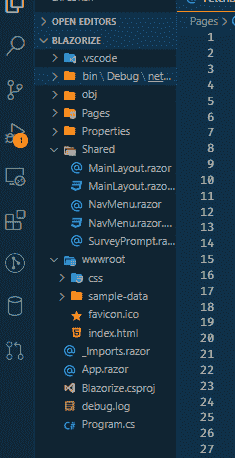
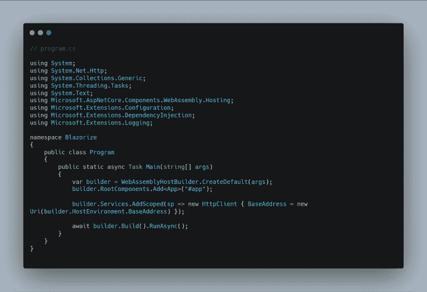
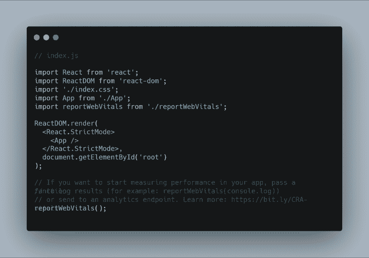
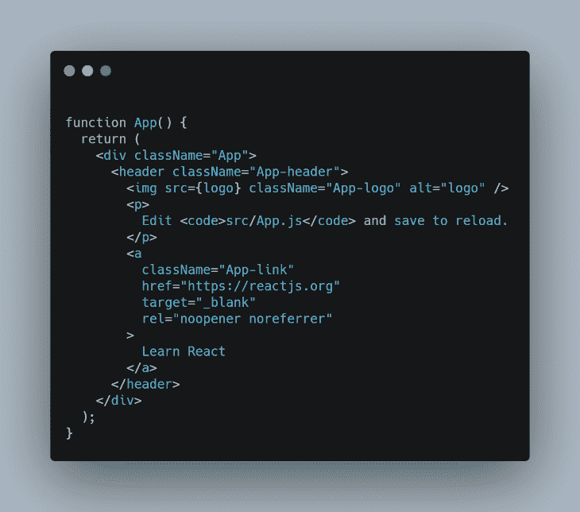
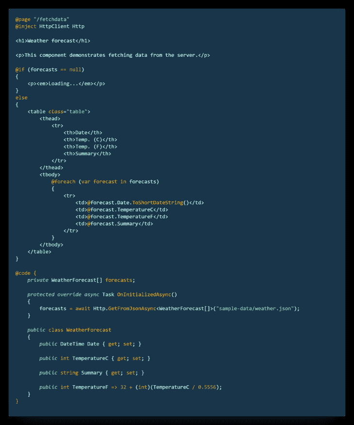
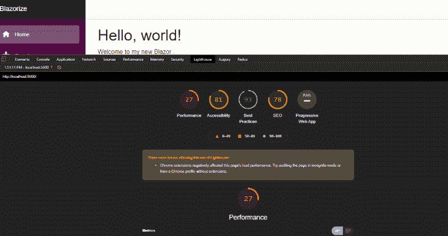
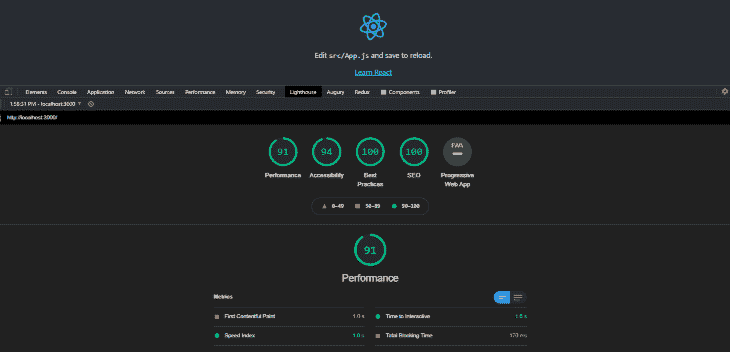
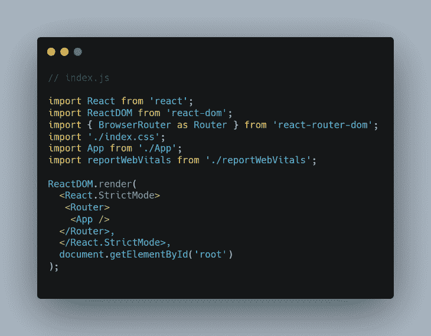
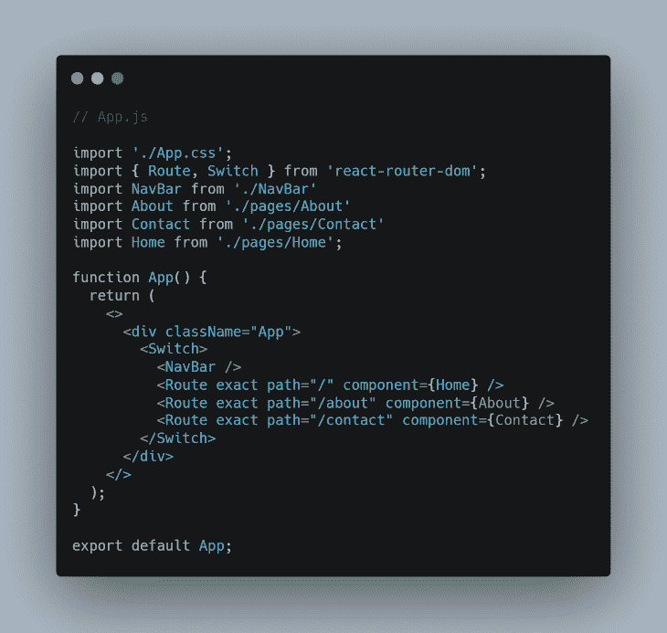
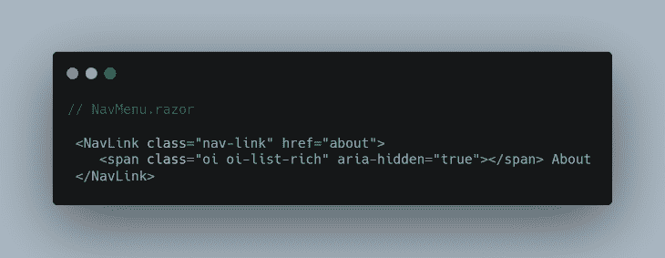

# React vs. Blazor:在你的 SPAs - LogRocket 博客中最小化 JavaScript

> 原文：<https://blog.logrocket.com/blazor-vs-react-minimize-javascript/>

***编者按**:这篇文章最后一次更新是在 2022 年 5 月 12 日，包括了关于布拉索内部运作的信息。*

开发人员在构建单页面应用程序时可以选择几个框架，其中最流行的三个是 Angular 、React 和 Vue。然而，用这三个框架构建 spa 需要 JavaScript。

但是，当开发人员对构建 spa 感兴趣，但不想处理 JavaScript 的警告时，会发生什么呢？在本文中，我们将探讨 React 和 Blazor，这两个不同的客户端选项，用于最小化 JavaScript，并从特性方面对两者进行比较。我们开始吧！

## 布拉索是什么？

Blazor 是一个[微软 UI 框架](https://dotnet.microsoft.com/en-us/apps/aspnet/web-apps/blazor)，它遵循一种独特的方法，利用 C#。NET 和 WebAssembly 来创建在 web 浏览器中运行的 spa。本质上，Blazor 允许开发者使用 HTML、CSS 和 C#构建交互式客户端应用程序。

另一方面，React 是一个声明性的、高效的、灵活的 JavaScript 库，用于构建用户界面和 UI 组件。React 和 Blazor 都是客户端框架和库，用于构建丰富的、交互式的现代客户端应用程序。

Blazor 的一个独特特性是它的 JavaScript 互操作性，这意味着 Blazor 应用程序可以从。NET 方法和。来自 JavaScript 函数的. NET 方法。

Blazor 由两个主要项目组成，客户端的 Blazor WebAssembly 和服务器端的 T2 Blazor Server。Blazor 服务器实现使用更传统的。NET app 方法，需要一个服务器通过 [SignalR](https://dotnet.microsoft.com/apps/aspnet/signalr) 连接到前端进行消息传递。另一方面，Blazor WebAssembly 实现将项目打包成可以部署的静态包。在本文中，我们将重点比较 Blazor WebAssembly 和 React。

## 布拉佐尔·瓦斯姆

Blazor Wasm 运行的是 Xamarin 的 Mono 框架的编译版本。最终结果是，您实际上可以直接在浏览器中运行. NET C#应用程序。布拉佐编译你的。NET 代码转换成 Wasm，然后可以作为静态包进行部署。对于老版本的浏览器，Blazor 使用 [asm.js](http://asmjs.org/) 向下编译成一个老版本浏览器可以支持的通用框架。

Blazor 还支持与 JavaScript 库的互操作性。您仍然可以将 npm 模块与 Blazor 项目一起使用，方法是将其与 build 一起导入。为了直接与 JavaScript 包以及 C#代码交互，Blazor 提供了 C#中的 IJSRuntime 和 JSRuntime。查看[微软文档](https://docs.microsoft.com/en-us/aspnet/core/blazor/javascript-interoperability/call-javascript-from-dotnet?view=aspnetcore-3.1)获得更详细的解释。

## 文件夹结构

让我们创建一个 Blazor 应用程序和一个 React 应用程序，并比较开箱即用的结果。要创建一个新的 Blazor 项目，您需要下载并安装[。NET SDK](https://dotnet.microsoft.com/learn/aspnet/blazor-tutorial/install) 并在您的终端中运行以下命令:

```
dotnet new blazorwasm -n BlazorApp

```

`blazorwasm`命令意味着我们正在用 WebAssembly 创建一个新的 Blazor 项目。`-n`标志代表项目名称:



The Blazor WebAssembly folder structure

`program.cs`文件包含启动和运行 WebAssembly 应用程序所需的主要方法:



The Programs.cs file

我们还安装了我们的应用程序，并选择了一个 ID 为`app`的标签。HTTP 客户端使用依赖注入技术加载，我们的 Blazor 应用程序中的 HTTP 模块构建在 JavaScript Fetch API 之上:


Creating the React app folder structure

在 React 应用中，`index.js`类似于 Blazor 应用中的`program.cs`。在下面的代码片段中，React DOM 呈现了我们的 app 组件，ID 为`root`的元素被选为我们的根组件:



Index.js in React app

## 程序设计语言

Blazor 没有使用 JavaScript，而是使用 C#作为编程语言，利用了现有的。[的网络生态系统。NET 库](https://docs.microsoft.com/en-us/dotnet/standard/class-libraries)。有了这个特性，C#开发人员能够扩展他们的技能，从仅仅用 C#编写后端代码扩展到用 C#作为编程语言构建全栈 web 和移动应用程序。

起初，对于 JavaScript 开发人员来说，C#可能看起来不自然，但是一旦您很好地掌握了 C#，您就可以构建完全用 C#编写的强大的全栈应用程序。

React 使用 JavaScript 作为其编程语言。本质上，web 开发人员仍然可以编写他们最习惯的语言。此外，使用 React Native，您可以构建共享相同代码片段的 web、Android 和 iOS 应用程序。

## 模板

使用 React 创建 SPA 时，建议使用 [Create React App](https://reactjs.org/docs/create-a-new-react-app.html#create-react-app) 工具链。默认情况下，创建 React 应用程序工具链将初始化一个配置了 JSX 的 React 应用程序，这是一个 JavaScript 的语法扩展。它就像一个模板引擎，允许您在 React 中编写 HTML，也可以在 HTML 中编写 JavaScript:



JSX in a React app

Blazor 使用 Razor 模板引擎，这种引擎已经存在多年了。模板引擎在 C#和 ASP.NET 生态系统中并不新鲜。它用于使用 C#和 ASP.Net 将服务器端代码嵌入网页。



The Razor template engine in a Blazor app

就像 JSX 一样，Razor 模板引擎允许你在标记中编写 C#代码。

## 表演

Blazor 项目在客户端很慢，因为你必须在浏览器上下载整个. net 运行时以及必要的`DLL`库。此外，Blazor 应用存在延迟问题。因此，如果你正在构建一个全球用户都可以访问的 web 应用程序，Blazor 不应该是你的首选框架。

另一个需要注意的重要事情是，在 Blazor 应用程序的开发过程中，您无法享受 React 中的热重新加载特性。因此，您的开发过程可能会很慢，因为您必须点击重启按钮来重启应用程序:



Blazor app Lighthouse Score

上图中的 lighthouse 分数清楚地表明，Blazor 应用程序存在一些严重的性能问题。初始页面加载时间很慢，因为必须在初始页面加载时下载必要的依赖项:



React app Lighthouse score

在这方面，React 大放异彩。作为一个 UI 库，核心的 React 包尽可能的精简。它已经过开箱即用的全面优化，可以使用基于组件的范例构建速度极快的现代客户端应用程序。

## 生态系统

在撰写本文时，微软已经宣布了 Blazor 的五个新版本，包括 Blazor WebAssembly 和 Blazor Server。

另一方面，React 生态系统非常大，你可以在 npm 上找到几乎所有你想实现的东西的包。React 得到了脸书的全力支持，它有很多社区支持，因为它改变了客户端应用程序的构建方式。此外，React 对 web 开发人员来说很自然，因为它仍然是 JavaScript。

React 的卖点是“一次学会，随处写。”本质上，使用 React、ReactDOM 和 React Native，您可以构建高度交互和丰富的前端 web、Android 和 iOS 原生应用程序。这使得大多数公司很容易以相对较低的成本构建可靠的产品和平台，因为他们只需雇佣一名擅长 React 和 React Native 的开发人员。

### GitHub 评级

在写这篇文章的时候，React 在 [GitHub](https://github.com/facebook/react) 上有超过 188k 颗星星。毫无疑问，它是最受欢迎的 JavaScript 库之一。同时，Blazor 在 [GitHub](https://github.com/dotnet/aspnetcore) [上有大约](https://github.com/dotnet/aspnetcore) [28k 颗星星。](https://github.com/dotnet/aspnetcore)

鉴于 Blazor 最初于 2018 年发布，并且在撰写本文时对开发者社区来说相对较新，受欢迎程度可能不是将其降低的有效理由。

### Blazor PWA 与 React 中的 PWA 支持

Blazor PWA 为开发者构建高端渐进式网络应用提供支持。在 React 应用程序中，添加 [PWA 支持](https://create-react-app.dev/docs/making-a-progressive-web-app/)轻而易举。运行以下命令将初始化 React 应用程序，并添加一个服务工作者文件:

```
npx create-react-app my-app --template cra-template-pwa

```

### Blazor 原生和 Blazor 混合与 React 原生

在撰写本文时还处于试验阶段的 Blazor Native ，本质上允许开发者使用移动 Blazor 绑定来构建 Blazor 的原生移动应用。使用 C#和。Net，用 Blazor 开发 Android 和 iOS 应用其实是有可能的。

Blazor 混合应用程序是一个应用程序中本地用户界面和网络用户界面的结合。使用 Blazor，您可以为您的应用程序编写本机 UI，还可以在您的应用程序中创建 web UI，从而为使用 Blazor 构建您的 web 和移动应用程序创造了可能性。

本质上，您将在 web 和移动应用程序之间共享代码片段。这绝对是成为 C#的好时机。Net 开发者。

React 使用 React Native 构建原生移动应用，使 React 开发者能够使用 React 构建移动应用。使用 React Native，您可以使用本机 UI 控件，并拥有对本机平台的完全访问权限。

React Native 目前用于生产，但 Blazor Native 仍处于开发的实验阶段。与 React Native 相比，Blazor Native 几乎没有社区支持。

## 包管理器

React 和其他 JavaScript 框架和库一样，使用 npm 和 Yarn 作为包管理器来管理依赖关系。在 Blazor WebAssembly 应用程序中，您可以通过以下方式轻松安装软件包:

*   包装参考
*   。NET CLI
*   包管理器
*   帕克特 CLI

要安装带有`PackageReference`的包，导航到`Blazorize.csproj`文件，并将包添加到`ItemGroup`标签中:

```
<PackageReference Include="System.Net.Http.Json" Version="5.0.0" />

```

使用安装软件包。NET CLI，在终端中导航到您的应用程序目录的根目录，并运行以下命令:

```
dotnet add package Microsoft.AspNetCore.Blazor.HttpClient --version 3.2.0-preview3.20168.3

```

查看这些指南，了解[。NET CLI](https://docs.microsoft.com/en-us/dotnet/core/tools/) 和 [Paket CLI](https://docs.microsoft.com/en-us/dotnet/core/tools/) 。

## 组件之间的通信

### 反应

默认情况下，React 提供了两种处理组件状态的主要方法。组件可以处理自己的状态或数据，也可以通过 props 接受数据。在处理 HTTP 部分时，我们将看到一个组件如何处理它自己的状态。

以下是 React 应用程序中组件如何通过 props 从其父组件接受数据的示例:

```
// Parent Component

export default function Blog() {
    const blogPosts = [
        {
            id: 1,
            title: 'This is the title',
            content: 'This is some random content',
        },
        {
            id: 2,
            title: 'This is the title',
            content: 'This is some random content',
        },
        {
            id: 3,
            title: 'This is the title',
            content: 'This is some random content',
        },
        {
            id: 4,
            title: 'This is the title',
            content: 'This is some random content',
        },
    ]
    return (
        <>
            <BlogCard blogPosts={blogPosts}/>
        </>
    )
}

```

我们将包含博客文章的对象数组`blogPosts`传递给子组件`BlogCard`:

```
// Child Component

export default function BlogCard( { blogPosts } ) {
    return (
        <>
            {blogPosts.map(blogPost => (
                <div className="blog-post" key={blogPost.id}>
                    <h1>{blogPost.title}</h1>
                    <p>{blogPost.content}</p>
                </div>
                ))}
        </>
    )
}

```

现在，当我们渲染子组件`BlogCard`时，我们可以通过 props 传入博文列表。要了解更多关于 React 中道具的信息，请查看[官方文档](https://reactjs.org/docs/components-and-props.html)。

### 布鲁兹

在 Blazor 中，子组件可以通过参数 s 从其[父组件接收数据:](https://docs.microsoft.com/en-us/aspnet/core/blazor/components/cascading-values-and-parameters?view=aspnetcore-5.0)

```
// Child Component
<h2>@Title</h2>
<p>@Content</p>
@code {    
   // Demonstrates how a parent component can supply parameters
    [Parameter]
    public string Title { get; set; }
    [Parameter]
    public string Content { get; set; }
}

```

当你渲染一个`BlogCard`组件时，你可以传入一个`Title`和`Content`，它将被相应地渲染:

```
<BlogCard Title="What is Blazor?" Content="Blazor is a web UI framework using C#/Razor and HTML..." />

```

## 按指定路线发送

在 React 应用程序中，路由器不是预先配置或安装的。React 路由器包主要用于实现客户端导航。

根据[文档](https://reactrouter.com/)，React 路由器可以在任何渲染 React 的地方工作，包括 React 本地项目。这个 API 非常简单，但是它处理很多强大的特性，比如 URL 参数、组件重定向、延迟加载、页面转换、嵌套路由等等。

要在 React 应用程序中设置路由，通常需要安装`react-router-dom`包，并用 React 路由器 DOM 包中的浏览器路由器模块将整个应用程序包装在`index.js`文件中。然后，在您的`App.js`组件中，您将使用 React Router DOM 中的 route 模块呈现您的页面。

下图说明了路由在 React 中的工作方式:



Routing in React



Routing Path

在 Blazor WebAssembly 客户端应用程序中，路由系统依赖于 ASP。NET 现有的路由引擎。您可以通过使用`@page`指令，然后使用您想要链接到文件顶部的路径，将一个路由映射到 Blazor 组件。

要导航到另一个页面，您必须使用`NavLink`组件，这类似于`NavLink`组件在`react-router-dom`中的工作方式:



通过在文件顶部插入以下代码的`NavigationManager`,以编程方式在 Blazor 应用程序的页面之间导航:

```
@inject NavigationManager NavManager

```

然后，在您注入的`NavManager`的函数中调用`NavigateTo`方法:

```
@inject NavigationManager NavManager
<p>Learn more about us</p>
<button @onclick="navigateHome">Go back home</button>

@code {
    private void navigateHome()
    {
        NavManager.NavigateTo("");
    }
}

```

## 处理 HTTP

### 布拉佐尔

为了探索在 Blazor 应用程序中处理 HTTP 请求，我们将在 pages 目录中创建一个`FetchPost.razor`文件:

```
@page "/http"
@inject HttpClient Http

<h1>Blog post</h1>

@if (posts == null)
{
    <p><em>Loading...</em></p>
}
else
{
    <table class="table">
        <thead>
            <tr>
                <th>Title</th>
                <th>Body</th>
            </tr>
        </thead>
        <tbody>
            @foreach (var post in posts)
            {
                <tr>
                    <td>@post.title</td>
                    <td>@post.body</td>
                </tr>
            }
        </tbody>
    </table>
}
@code {
    private BlogPost[] posts;
    protected override async Task OnInitializedAsync()
    {
        posts = await Http.GetJsonAsync<BlogPost[]>("https://jsonplaceholder.typicode.com/posts");
        Console.WriteLine(posts);
    }
    public class BlogPost
    {
        public int id { get; set; }
        public String title { get; set; }
        public String body { get; set; }
    }
}

```

这里发生了三件有趣的事情。首先，我们注入`HttpClient`，这是一个帮助我们使用 HTTP 客户端进行 HTTP 调用的服务。从 Blazor v3.1.0 开始，您需要将 [Blazor HTTP 客户端](https://stackoverflow.com/questions/56148564/httpclient-has-no-definition-for-getjsonasync)添加到您的`Blazorize.csproj`文件中。

然后，我们使用`GetJsonAsync()`方法调用`HttpClient`从定义的端点获取 JSON。最后，我们创建一个类型为`BlogPost`的结果类型，它能够根据传入的 JSON 结构挑选出在属性`post`上找到的相关数据。

要注入`HttpClient`，在页面顶部添加`@inject` `HttpClient Http`。我们调用`HttpClient`来主动获取数据。我们通过定义`OnInitializedAsync()`来做到这一点，这是一个保证在页面初始化时运行的生命周期方法。

### 反应

使用像 React 这样的库的好处之一是它的工具的灵活性。React 不提供像 Blazor 这样的 HTTP 客户端，所以 React 开发者可以决定使用[获取 API](https://developer.mozilla.org/en-US/docs/Web/API/Fetch_API) 、 [Axios](https://github.com/axios/axios) ，甚至 [XHR](https://developer.mozilla.org/en-US/docs/Glossary/XHR_(XMLHttpRequest)) 来发出 HTTP 请求。

对于 HTTP 请求，我们将使用 JavaScript Fetch API。下面的代码演示了如何使用内置的 JavaScript Fetch API 在 React 应用程序中发出一个简单的 HTTP 请求:

```
// post.js

import React, { useState, useEffect } from 'react'
export default function Post() {
  const [posts, setPosts] = useState([]);
  const [loading, setLoading] = useState(true);

  useEffect(() => {
        fetch("https://jsonplaceholder.typicode.com/posts")
            .then(response => response.json())
            .then(post=> {
                setPosts(post)
                setLoading(false)
            })
    }, [])

   return (
        <div>
            {
            loading ?
                (
                    <p>Loading...</p>
                ) : (
                    posts.map((post, i) => (
                        <div>
                            <p>{post.title}</p>
                            <p>{post.body}</p>
                        </div>
                    ))
                )
            }
        </div>
    )
}

```

注意，我们正在调用`useEffect`钩子上的端点，告诉 React 我们的组件需要在渲染后从我们的 API 获取数据。然后，当我们的请求成功时，我们需要调用`setPosts`并从 API 传递我们的`post`对象。关于`useState`钩子如何在 React 中工作的更多细节，请查看[官方文档](https://reactjs.org/docs/hooks-state.html)。

## 结论

选择最佳前端框架来构建 SPA 取决于很多因素，包括团队偏好、生态系统、性能和可伸缩性。在本文中，我们比较了 React 和 Blazor，以了解这两个令人惊叹的框架是如何工作的。

React 和 Blazor 在一些方面很相似，它们可以用来完成相同的任务。那么，你应该选择和哪一个合作呢？您可能必须考虑它们的受欢迎程度、您正在构建的项目的类型、可伸缩性和可维护性。

希望通过这篇文章中的信息，您能够在为下一个项目选择前端框架时做出明智的决定。我希望你喜欢这篇文章。编码快乐！

## 使用 LogRocket 消除传统反应错误报告的噪音

[LogRocket](https://lp.logrocket.com/blg/react-signup-issue-free)

是一款 React analytics 解决方案，可保护您免受数百个误报错误警报的影响，只针对少数真正重要的项目。LogRocket 告诉您 React 应用程序中实际影响用户的最具影响力的 bug 和 UX 问题。

[ ](https://lp.logrocket.com/blg/react-signup-general) [  ](https://lp.logrocket.com/blg/react-signup-general) [LogRocket](https://lp.logrocket.com/blg/react-signup-issue-free)

自动聚合客户端错误、反应错误边界、还原状态、缓慢的组件加载时间、JS 异常、前端性能指标和用户交互。然后，LogRocket 使用机器学习来通知您影响大多数用户的最具影响力的问题，并提供您修复它所需的上下文。

关注重要的 React bug—[今天就试试 LogRocket】。](https://lp.logrocket.com/blg/react-signup-issue-free)