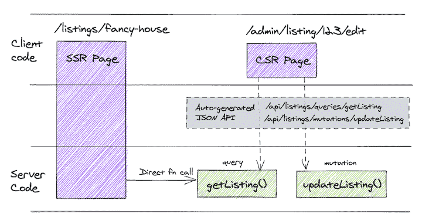
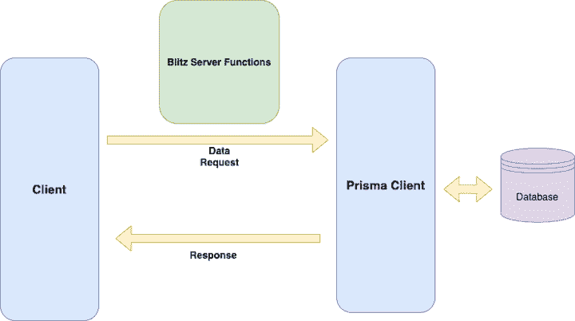
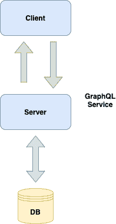
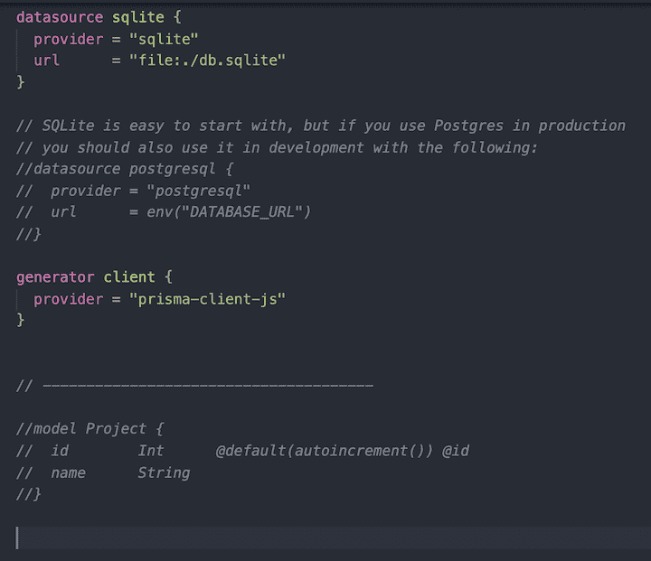
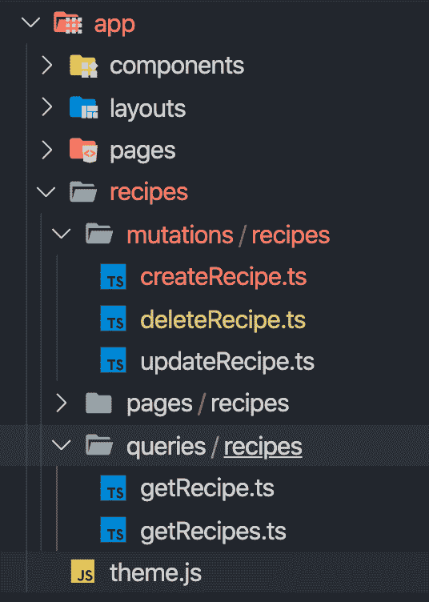
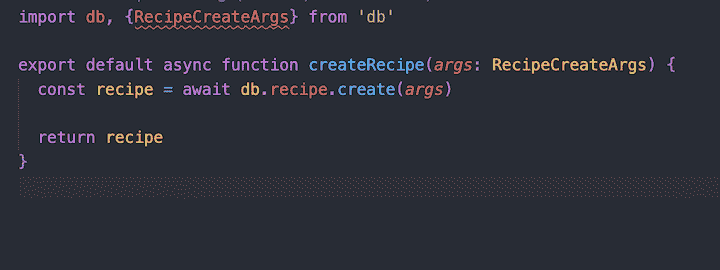
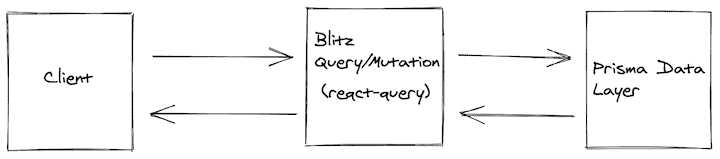
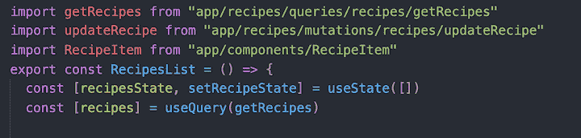
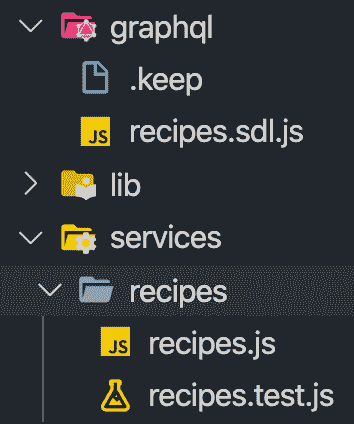
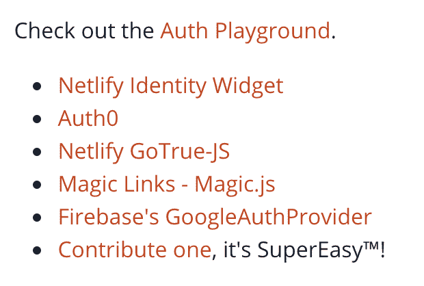

# Blitz.js vs. RedwoodJS - LogRocket 博客

> 原文：<https://blog.logrocket.com/blitz-vs-redwood/>

技术不断发展是必然的。如果你仔细观察这个场景，你会注意到随着技术的成熟而出现的某些模式。特别是，开发人员总是努力提高性能，简化开发过程，并增强开发人员的体验。

在本指南中，我们将分析两个框架来帮助全栈应用领域的开发人员实现这些目标:Blitz.js 和 RedwoodJS。

## Blitz.js 是什么？

受 Ruby on Rails 的启发， [Blitz.js](https://blog.logrocket.com/introduction-to-blitz-js/) 是一个全栈 React 框架，旨在帮助您尽可能快地开发单片应用程序。它为您搭建了许多样板代码，因此您可以专注于业务逻辑，并提供从数据库到前端的完整包。



Blitz.js 使您能够使用 Prisma 从客户机本身请求数据库。



基本上，前端组件调用包含 Prisma DB 函数调用的函数。之后，Prisma 将数据库中的数据返回给客户端。

对于客户端的数据管理，Blitz 在幕后使用了 [React Query](https://github.com/tannerlinsley/react-query) 。

## RedwoodJS 是什么？

RedwoodJS 是一个根据 [JAMstack 方法](https://blog.logrocket.com/why-you-should-be-using-jamstack/)构建全栈应用的框架。如果你熟悉 JAMstack，并想构建一个全栈应用，Redwood 是适合你的框架。

Redwood 类似于传统的老式方法，如 client => server => database。



客户机与服务器连接，在我们的例子中，这是一个 GraphQL 服务。Redwood 使用 Prisma 连接数据库。一旦获取了数据，它就返回给客户端。

尽管这种方法很古老，但它通过提供支架代码和内置模块解决了许多与应用程序开发过程相关的问题。

## 使用 Blitz.js 构建全栈应用

现在我们已经了解了 Blitz 和 Redwood 的工作原理，让我们使用每个框架构建一个全栈应用程序并比较其体验。

任何全栈应用的开发流程都包括三个关键阶段:

1.  设计数据库
2.  构建服务器端
3.  构建客户端

### 设置

您可以使用以下命令引导 Blitz 项目。

```
blitz new my-app

```

您将能够看到服务器和客户机的所有样板代码。

### 设计数据库

Blitz 使用 [Prisma](https://blog.logrocket.com/an-introduction-to-prisma-2/) 来管理数据库连接和模式。



要构建一个表，在 Prisma 中创建一个模型并运行以下命令。

```
blitz db migrate

```

现在，您可以在 Blitz 应用程序中从客户端直接访问数据库。

### 构建服务器端

Blitz 最大的优点之一是您不需要单独管理服务器端代码。数据层在应用程序本身的客户端维护。

大多数时候，你只需要为特定的特性创建一个 CRUD。



正如您所看到的，查询和突变在客户端的`app`目录中。它还包含 Prisma DB 实例，您可以使用它来访问模式。



通过这种方式，您可以编写自定义函数或扩展这些函数以在其中编写您自己的逻辑。

就我个人而言，我觉得这在大多数应用程序开发场景中都很方便。

### 构建客户端



客户端使用`useQuery`，它是 React Query 的包装器，使用 Prisma 从数据库中获取数据。然后，它在 React 组件中呈现数据。



有关如何使用 Blitz 构建全栈应用程序的更详细的演练，请查看“[使用 Blitz.js 构建全栈 React 应用程序](https://blog.logrocket.com/building-a-fullstack-react-application-with-blitz-js/)”

## 用 RedwoodJS 构建一个完整的应用程序

### 设置

要引导 RedwoodJS 项目:

```
yarn create redwood-app ./my-app

```

一旦有了应用程序的所有样板代码，就可以开始构建服务器端和客户端了。

Redwood 遵循单一回购模式。要向客户端或服务器端添加任何库，请使用以下命令。

```
yarn workspace web add react-query
yarn workspace api add jsonwebtoken

```

`web`目录包含客户端,`api`目录包含服务器端代码。

### 设计数据库

Redwood 也是用 Prisma 做数据层，所以逻辑和 Blitz 一样。唯一的区别是，一旦您在 Prisma 中完成了模式，您需要运行下面的命令。

```
rw db save
rw db up

```

基本上，这将最新的模式保存为数据库快照，然后将更改迁移到数据库。

**构建服务器端**

Redwood 管理 API 目录中的所有服务器端代码，该目录还包含带有 SDL 的 GraphQL 数据层和服务器的解析器。


一旦完成了 Prisma，就可以用下面的命令搭建服务器代码，比如 SDL 和服务文件。

```
yarn rw g sdl recipe
yarn rw g service recipe 

```

这将用最少的样板代码生成 SDL 和服务框架。



现在您可以根据您的特定需求定制它，并像平常一样运行 GraphQL 服务器。

**构建客户端**

在构建 Redwood 应用的客户端时，有四个关键的构建模块需要关注。

#### 1.`page`

```
yarn rw generate page recipe

```

上面的命令创建了具有基本功能组件的配方页面。它还在`route.js`中添加了该页面的路线。

`page`构建代码，所以您不需要花费时间从头开始编写代码。

#### 2.`layout`

```
yarn rw generate layout header

```

布局是包装常见组件的简单方式，比如`header`和`footer`。比方说，你需要在所有的页面都有标题组件。在这种情况下，您可以在 redwood 中创建一个布局，它可以在所有组件中重用。

#### 3.`component`

```
yarn rw generate component recipe

```

`components`为你生成 React 功能组件。您可以使用它来呈现`pages`组件。

#### 4.`cell`

```
yarn rw generate cell users

```

`cell`是红木的显著特征。cell 的目的是将数据获取逻辑从组件中分离出来。您不需要在组件本身中混合数据获取。

手机会帮你处理的。你需要做的就是，在组件中导入单元格，并呈现从单元格返回的数据。

如我之前所说，这些都是关于如何使用 redwood 构建全栈应用的高级概述。要了解更多细节，请查看文章。

最后，我们学习了如何使用 blitz.js 和 redwood.js 构建应用程序。让我们比较一下它们，并从开发人员的角度来看一下。

## 开发者体验

当尝试一个新的框架时，最重要的因素之一是开发人员的经验。让我们根据以下标准比较一下 Blitz 和 Redwood 的开发经验。

### 学习曲线

如果您是 Prisma 的新手，在使用 Blitz 或 Redwood 时，您可能会遇到一个学习曲线。从当前堆栈(React、Redux 和 GraphQL)切换可能有些困难。

对于 Blitz，大部分应用开发只需要知道 React 和 Prisma 就可以了。根据您的需求，您可能还需要熟悉其他技术，比如 GraphQL、Node 和无服务器函数。

对于 Redwood，你需要知道 React，Prisma，和 GraphQL。GrapQL 是 Redwood 中与 Prisma 和客户端交互的方式。

就我个人而言，当我需要尽快开发和转移应用程序时，我更喜欢 Blitz。

### 程序调试时间

这两个框架都有助于减少开发时间。

如果您需要开发一个基本的 CRUD 应用程序，Blitz 可能是您的最佳选择，因为您不需要处理 GraphQL。

也就是说，Redwood 有更多的脚手架命令来处理样板代码。这在开发超越简单 CRUD 操作的应用程序时很有帮助。

### 可量测性

说到可伸缩性，我对这两个框架都很满意。有时候你不需要复杂的应用架构来满足你的需求。

与其花时间在建筑设计上，不如采用整体式建筑。Blitz 和 Redwood 都在帮助您开发可伸缩应用程序方面脱颖而出。

### 灵活性

接下来，我们将比较在每个框架中构建定制逻辑有多容易。

假设我想添加基本身份验证:

*   用户必须输入用户名和密码才能在应用程序中注册
*   然后，用户可以使用他们的凭据登录

当我试图在我的应用程序中实现这个特性时，我在两个框架中寻找一个预构建的模块来使我的工作更容易。

Redwood 提供了一些现成的授权机制，并且它仍在积极开发中。



Blitz 正在积极致力于授权会话管理。按照 [GitHub](https://github.com/blitz-js/blitz/pull/475) 的说法，应该很快就会发布。

为了使用本地用户名密码实现身份验证，我们需要在客户端使用 React 上下文实现定制逻辑。

## 摘要

根据我目前的经验，我发现 Blitz.js 和 RedwoodJS 在快速构建应用程序方面非常有用。也就是说，我偏爱 Blitz，因为如果我的应用程序不需要 GraphQL，它不会强迫我使用它。

你更喜欢哪种框架？

## 使用 [LogRocket](https://lp.logrocket.com/blg/signup) 消除传统错误报告的干扰

[](https://lp.logrocket.com/blg/signup)

[LogRocket](https://lp.logrocket.com/blg/signup) 是一个数字体验分析解决方案，它可以保护您免受数百个假阳性错误警报的影响，只针对几个真正重要的项目。LogRocket 会告诉您应用程序中实际影响用户的最具影响力的 bug 和 UX 问题。

然后，使用具有深层技术遥测的会话重放来确切地查看用户看到了什么以及是什么导致了问题，就像你在他们身后看一样。

LogRocket 自动聚合客户端错误、JS 异常、前端性能指标和用户交互。然后 LogRocket 使用机器学习来告诉你哪些问题正在影响大多数用户，并提供你需要修复它的上下文。

关注重要的 bug—[今天就试试 LogRocket】。](https://lp.logrocket.com/blg/signup-issue-free)