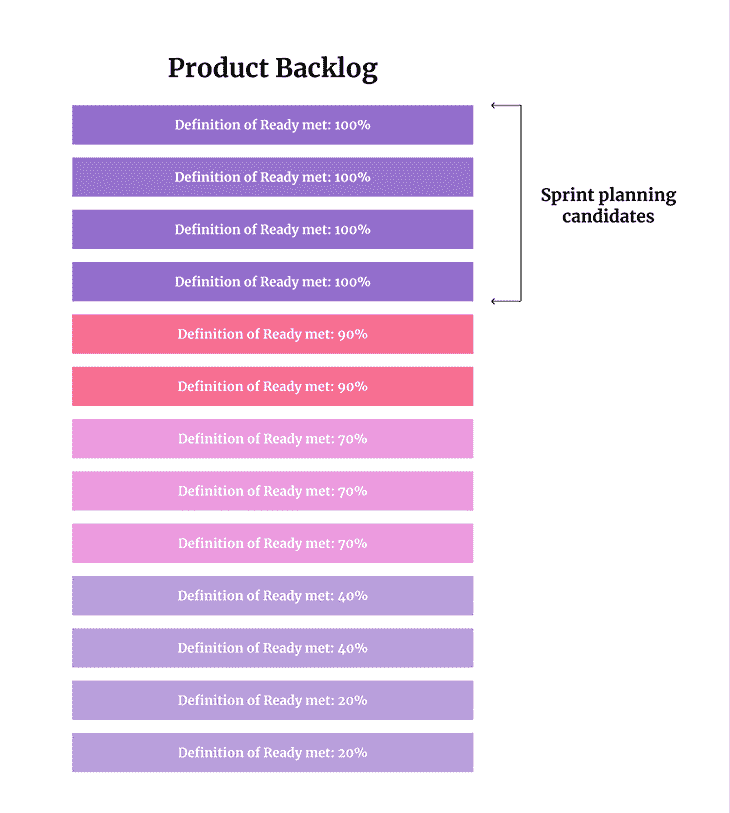

# 打破 scrum 中就绪的定义

> 原文：<https://blog.logrocket.com/product-management/breaking-down-the-definition-of-ready-in-scrum/>

有各种各样的过程和策略可以使一个人的产品开发过程更加健壮。其中之一就是 ready(简称 DoR)的定义。

在本文中，我们将了解 ready it is 的定义、它的优点和缺点，以及您是否应该考虑在您的组织中实现它。

* * *

## 目录

## 准备好的定义是什么？

done 的定义回答了一个给定工作项的工作是否完成的问题，ready 的定义回答了一个工作项是否准备好被开发团队采用的问题。

> 就绪的定义回答了开发团队是否准备好接受工作项的问题。

原则上，在 sprint 规划期间，应该只考虑符合就绪定义的产品待定项。也就是说，除非在计划过程中进行了最后的改进，或者出现了例外。

参见上面订购产品积压项目的图形示例。顶部的标签已经被细化了(正如就绪标准的定义所证明的)，而底部的标签仍然只是粗略的概念。

## 就绪与票证要求的定义

这里出现了一个常见的问题。“如果我把所有要求都写好了，是不是说明票已经‘准备好’了？”嗯，那要看情况。

ready 和 ticket 需求的定义之间的差异类似于 done 和 acceptance criteria 的定义之间的差异——前者是每个工作项的全局护栏，而后者是特定于特定 ticket 的。

因此，虽然“需求”(可以采取验收标准、小黄瓜、案例测试或者仅仅是书面描述的形式)回答了“作为这个任务的一部分，需要做什么”的问题，但是就绪的定义回答了“这个任务是否包含了我们开始工作所需要的一切？”

## 就绪定义的例子

为了让 ready 的定义更加有形，我们来看一些例子。

### 例 1。就绪的轻定义

在一个快节奏的环境中，你可能想要保持就绪指示灯的定义，这样它就不会成为一个障碍。它可能只包括简单的健全性检查，例如:

虽然很短，但它可能会帮助你避免在开始冲刺后意识到你错过了设计的情况。这有时会发生🙂

### 例 2。就绪的沉重定义

假设您想要确保一旦开始售票，就没有任何疑问、问题或误解(例如，您正在将售票外包给世界另一端的一家公司)。在这种情况下，您可能会使用更严格的标准，例如。

*   设计完成了
*   验收测试已经准备好
*   副本是最终版本
*   翻译准备好了
*   后端已经准备好并经过测试
*   准备测试用例
*   确认利益相关方的一致性
*   估计一票
*   创建子任务
*   安全小组已经检查了罚单

这些标准将确保票据非常清晰和有据可查，但代价是大量的前期改进。

最终，准备好的定义可能是轻的，也可能是严格的。

## 准备好的定义的优点

接受就绪的定义有三个主要优点。

### 减少返工

返工最常见的原因之一是“需求误解”这是每个首相至少都会经历一次的事情。团队展示了一些交付的东西，你或者一个涉众突然问，“这是什么？那不应该这样！”

有一个就绪的定义，并在开始工作之前仔细检查每张票的描述和审查程度，可以帮助避免这些情况。毕竟，越清晰的标签，越少的误解，因此，返工，应该有。

### 更快的周期时间

从开始一个工作项目的工作到满足完成的定义的时间往往会更快。

* * *

订阅我们的产品管理简讯
将此类文章发送到您的收件箱

* * *

就绪的定义限制了当某人忘记添加细节或附加设计时的情况，这反过来又限制了阻止者和开发团队与利益相关者之间的反复。

通过限制模糊性，就绪的定义有助于最大限度地提高效率。

### 更精确的估计

尽管评估从来都不是完美的，但是“乐于助人”的定义使得评估更加准确。这有两个原因:

1.  **有一个“通用标准”** —所有票据共享相同的就绪定义，它们包括大致相似的描述。该团队可以比较苹果和苹果，而不是某一天估计一个完整描述和设计的门票，然后第二天只是一个粗略的线框
2.  **更少的缺失部分** —后来发现，评估结果不准确的一个常见原因是。团队了解到他们需要实现一些他们没有预料到或者没有包含在他们的评估中的东西。虽然“准备好”的定义不会阻止这些情况的发生，但它确实通过要求预先更多的思考来限制意外

## 潜在的陷阱

不过，就绪的定义也有一些阴暗面。

### 迷你瀑布

ready 的健壮定义是进行小型瀑布开发的最简单的方法。我们已经强制分离“细化”和“开发”阶段，而不是在旅途中同时包含细化、设计、开发和测试。

尽管在某些特定情况下这可能是件好事，但在现代产品开发中，这是一个严重的反模式，只会拖慢你的速度。

你可以在 Antonio Da Fonseca Neto 的文章中阅读更多关于[敏捷与瀑布的内容。](https://blog.logrocket.com/product-management/agile-vs-waterfall-comparing-project-management-cultures/)

### 灵活性降低

就绪的定义制造了一些人为障碍，使得快速实验更加困难。

比如说，一个有时间限制的市场机会出现在计划的前一天。一方面，你可能喜欢马上开始工作。另一方面，你不可能在那个时候达到准备好的定义。

或者，如果一个设计师离开了，你必须对 MVP 进行一些快速的修改，你会等两个星期才得到预先的设计，还是让开发人员在旅途中解决它？

## 你应该用“准备好”的定义吗？

就绪的定义是一个有趣的策略，用于指导细化工作，并确保团队只处理真正就绪的任务。

你应该在你的团队中接受它吗？在一个现代的、注重结果的产品团队中——我不这么认为。

ready 的定义是构建特性工厂最快的方法之一。在 sprint 开始的时候，你得到了一张精心准备的票，你应该在时限内交付。但产品不应该是这样造出来的。

产品开发很乱。团队应该能够在他们希望的时候就开始着手一项计划，在旅途中发现、学习和实验，有时甚至在冲刺阶段改变方向。就绪的定义不鼓励这种行为，并且倾向于人为地将“提炼”与“交付”分开。

在两种情况下，就绪的定义可能是值得的:

1.  你是一个功能工厂，不是一个产品团队，你的业绩是以送票率来衡量的
2.  你将部分工作外包给了与你沟通有限的承包商

## 结论

在一天结束的时候，让我们记住敏捷宣言的核心价值观之一:个人和交互优于过程和工具。产品开发是混乱的，过去如此，将来也是如此。如果你接受事实，而不是试图与之抗争，你会得到更多。

*精选图片来源:[icon scout](https://iconscout.com/icon/checklist-1627460)*

## [LogRocket](https://lp.logrocket.com/blg/pm-signup) 产生产品见解，从而导致有意义的行动

[LogRocket](https://lp.logrocket.com/blg/pm-signup) 确定用户体验中的摩擦点，以便您能够做出明智的产品和设计变更决策，从而实现您的目标。

使用 LogRocket，您可以[了解影响您产品的问题的范围](https://logrocket.com/for/analytics-for-web-applications)，并优先考虑需要做出的更改。LogRocket 简化了工作流程，允许工程和设计团队使用与您相同的[数据进行工作](https://logrocket.com/for/web-analytics-solutions)，消除了对需要做什么的困惑。

让你的团队步调一致——今天就试试 [LogRocket](https://lp.logrocket.com/blg/pm-signup) 。

[Bart Krawczyk Follow](https://blog.logrocket.com/author/bartkrawczyk/) Learning how to build beautiful products without burning myself out (again). Writing about what I discovered along the way.