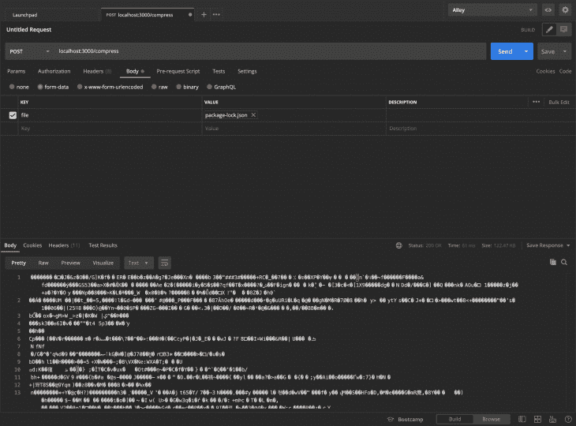
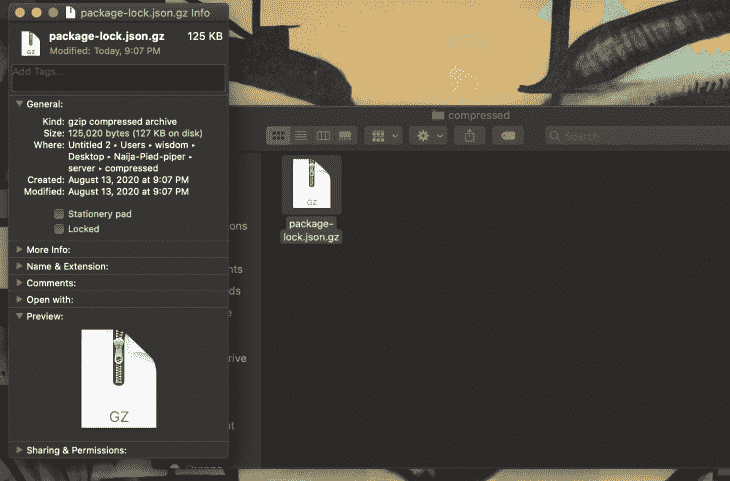
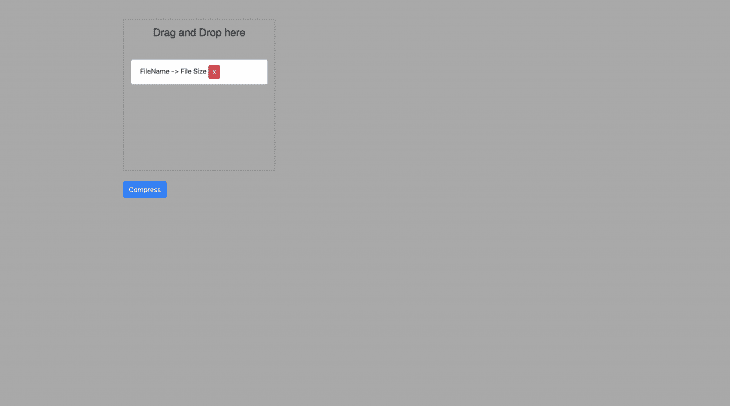
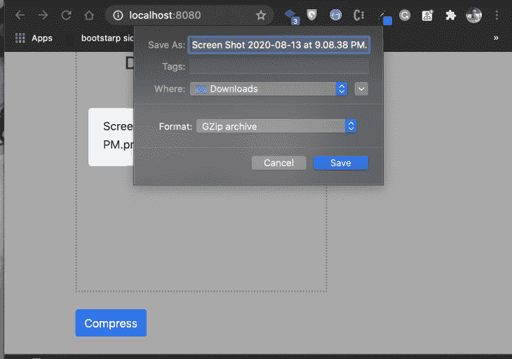

# 在 Node.js 和 Vue.js - LogRocket Blog 中构建一个文件压缩应用程序

> 原文：<https://blog.logrocket.com/build-a-file-compression-application-in-node-js-and-vue-js/>

Node.js 为我们提供了一个帮助文件压缩的模块。在本文中，我们将构建一个应用程序，用户可以上传他们想要压缩的文件，然后使用 Node.js Zlib 模块下载文件的压缩版本。

### 先决条件

要跟随本教程，您需要以下内容:

*   熟悉 HTML、CSS 和 Javascript (ES6+)
*   VS 代码或安装在开发机器上的任何代码编辑器
*   安装在您的开发机器上的 POSTMAN
*   Vue 和 Node.js 的基础知识

## 设置项目

我们将从构建后端开始，这是我们应用程序的主干。在桌面上，为应用程序创建一个文件夹，并通过运行`npm init -y`建立一个新的 Node.js 项目。

```
cd desktop &amp;&amp; mkdir compressor &amp;&amp; cd compressor
mkdir server &amp;&amp; cd server
npm init -y
```

我们现在需要为我们的应用程序安装必要的包:

*   这将有助于设置我们的服务器和压缩路径
*   每当我们对应用程序进行修改时，Nodemon 将重启我们的服务器
*   `multer`:用于上传文件的中间件
*   `cors`:帮助向代理请求添加报头

要安装所有这些，在我们创建的`server`目录中运行这个命令:

```
npm i --save express nodemon multer cors
```

安装完成后，在服务器目录下创建一个`index.js`文件。这是我们写后端代码的地方。

使用 VS 代码打开文件夹。在我们开始之前，让我们创建一个`.gitignore`文件并将`node_modules`添加到其中。这将阻止`node_modules`文件夹被添加到 git。

让我们继续创建一个简单的 Express.js 服务器，然后配置我们的包:

```
var express = require('express');
var multer = require('multer');
var zlib = require('zlib');
var cors = require('cors');
let fs = require('fs');
let path = require('path');
var app = express();
app.use(cors());

//multer
var storage = multer.memoryStorage();
var upload = multer({
  storage: storage,
});

app.listen(3000, () =&gt; {
  console.log('App is runnuing on port 3000');
});
```

我们首先需要我们已安装的软件包，如 Express、Multer 和 Cors。然后，我们创建 Express 的一个实例，并将其存储在一个变量中。我们使用 Express 实例将我们的`cors`配置为中间件。

我们还需要一些 Node.js 核心模块，如`zlib`，我们将使用它们进行实际的压缩。然后，我们使用 Express 的实例来创建一个将监听端口`3000`的服务器。

Multer 使我们能够通过使用 Multer `memoryStorage()`方法获得实际的文件缓冲区。这将返回文件缓冲区，我们将使用它，因为我们的`zlib`模块只接受字符串或缓冲区。

接下来，我们将创建一个路由，它接收一个文件，然后返回压缩文件。

Zlib 有很多压缩方法，但是对于本文，我们将使用`gzip`方法。

```
app.post("/compress", upload.single("file"), async (req, res) => {
  try {
    const destination = `compressed/${req.file.originalname}.gz`;
    let fileBuffer = req.file.buffer;
    await zlib.gzip(fileBuffer, (err, response) => {
      if (err) {
        console.log(err);
      }
      fs.writeFile(path.join(__dirname, destination), response, (err, data) => {
        if (err) {
          console.log(err);
        }
        res.download(path.join(__dirname, destination));
      });
    });
  } catch (err) {
    console.log(err);
    res.json(err);
  }
});
```

我们定义了`/compress`路由，这是一个`POST`请求，然后在路由中传递 Multer 中间件。我们的 Multer 中间件将返回文件缓冲区，我们将它存储在`fileBuffer`变量中。

出于测试目的，让我们创建一个`compressed`目录来存储我们的压缩文件。

我们将使用 Multer 中间件来获取我们想要压缩的文件的名称，这样我们就可以将它保存在我们的`compressed`目录中。

```
const destination = `compressed/${req.file.originalname}.gz`;
```

我们使用 Zlib 方法`gzip`来压缩我们的文件，它将`fileBuffer`作为第一个参数，然后将一个回调函数作为第二个参数。回调函数由任何可能的错误和压缩响应组成。

在获得 Zlib 响应后，我们创建一个文件并将响应存储在`compressed`目录中。这个文件将有一个`.gz`文件扩展名，因为这是用来识别 Zlib 压缩的。

我们现在可以在开始前端之前在 POSTMAN 上测试我们的应用程序。我将压缩一个`package.lock.json`文件。其大小为 488kb。



压缩文件得到 127kb。



现在我们的后端已经准备好了，我们可以为应用程序设置用户界面了。

让我们在`compressor`根目录下创建一个`client`目录。在`client`目录下，创建两个文件:`index.html`和`main.js`。

我们将从定义应用程序的用户界面开始。

我们将搭建一个 HTML 5 样板文件，然后在模板头中添加 Vue.js 脚本、引导 CSS CDN 和 Axios 脚本。然后，我们将在 body 标签的末尾添加我们的`main.js`文件。

```
<!DOCTYPE html>
<html lang="en">
<head>
    <meta charset="UTF-8">
    <meta name="viewport" content="width=device-width, initial-scale=1.0">
    <title>Vue Compressor</title>
    <link rel="stylesheet" href="https://stackpath.bootstrapcdn.com/bootstrap/4.5.2/css/bootstrap.min.css"
        integrity="sha384-JcKb8q3iqJ61gNV9KGb8thSsNjpSL0n8PARn9HuZOnIxN0hoP+VmmDGMN5t9UJ0Z" crossorigin="anonymous">
    <script src="https://cdn.jsdelivr.net/npm/vue"></script>
    <script src="https://cdn.jsdelivr.net/npm/axios/dist/axios.min.js"></script>
</head>
<body>
<div id="app">
    <h1>Compressor</h1>
</div>
    <script src=" main.js"></script>
</body>
</html>
```

对于这个应用程序，用户将通过拖放来添加他们的文件。让我们为我们的应用程序定义一个简单的用户界面。

将您的模板修改为:

```
<!DOCTYPE html>
<html lang="en">
<head>
    <meta charset="UTF-8">
    <meta name="viewport" content="width=device-width, initial-scale=1.0">
    <title>Vue Compressor</title>
    <link rel="stylesheet" href="https://stackpath.bootstrapcdn.com/bootstrap/4.5.2/css/bootstrap.min.css"
        integrity="sha384-JcKb8q3iqJ61gNV9KGb8thSsNjpSL0n8PARn9HuZOnIxN0hoP+VmmDGMN5t9UJ0Z" crossorigin="anonymous">
    <script src="https://cdn.jsdelivr.net/npm/vue"></script>
    <script src="https://cdn.jsdelivr.net/npm/axios/dist/axios.min.js"></script>
    <style>
        body {
            background: darkgrey !important;
        }
        .wrapper {
            width: 350px;
            height: 350px;
            border: 2px dotted gray
        }
        .wrapper h4 {
            text-align: center;
            font-family: sans-serif;
        }
    </style>
</head>
<body>
<div id="app">
    <div class="container">
        <div class="row">
            <div class="col-md-12">
                <div class="wrapper mt-5 p-3">
                    <h4>Drag and Drop here</h4>
                    <ul class="list-group mt-5">
                        <li class="list-group-item">FileName -> File Size <button
                                class="btn btn-sm btn-danger">X</button></li>
                    </ul>
                </div>
                <button class="btn btn-primary my-4">  <span class="spinner-border spinner-border-sm" role="status" v-if="loading" aria-hidden="true"></span>

Compress</button>
            </div>
        </div>
    </div>
</div>
    <script src=" main.js"></script>
</body>
</html>
```

您可以使用您选择的任何实时服务器来运行您的应用程序，以预览您的应用程序:



## 实现拖放

我们将从在`main.js`文件中定义 Vue.js 实例开始。然后，我们将创建一个保存文件的状态:

```
​​var app = new Vue({
​​  el: '#app',
​​  data: {
​​    files: [],
​​    loading:false
​​  },
​​  methods: {
​​    addFile(e) {
​​    },
​​    removeFile(file) {
​​    },
​​    compressFile() {
​​    }
​​  }
​​})
```

为了在 Vue.js 中实现拖放，我们需要添加一个选择文件的`@drop`事件和一个用于在应用程序加载前隐藏`{{tags}}`的`v-cloak`属性。

```
<div class="wrapper mt-5 p-3" v-cloak @drop.prevent="addFile" @dragover.prevent>
            <h4>Drag and Drop here</h4>
        </div>
```

`@drop`事件监听`addFile`方法，我们必须定义:

```
addFile(e) {
      let files = e.dataTransfer.files;
      [...files].forEach(file => {
        this.files.push(file);
        console.log(this.files)
      });
    }
```

通过这种方法，任何放入盒子中的文件都会记录在我们的控制台上。然而，我们希望在我们的盒子中显示文件，所以要这样做，我们必须将`<li>`元素修改为:

```
<li v-for="(file,id) in files" :key="id" class="list-group-item">
                                {{ file.name }}-{{ file.size }} kb<button class="btn btn-sm btn-danger">X</button>
                            </li>
```

有了这个，任何时候我们把一个文件放到盒子里，文件名和大小都会显示出来。

我们可以添加一个额外的特性，通过向`X`按钮添加一个点击事件来从盒子中移除文件。

然后我们定义`removeFile`方法:

```
removeFile(file) {
      this.files = this.files.filter(f => {
        return f != file;
      });
    },
```

让我们定义我们的压缩函数，它将压缩我们选择的文件。这就是 Axios 的用武之地。我们将向我们在后端定义的`/compress`路线发出请求:

```
compressFile() {
      this.loading = true;
      let formdata = new FormData();
      formdata.append('file', this.files[0])
      axios.post('http://localhost:3000/compress', formdata, {
        responseType: 'blob'
      }).then(response => {
        let fileURL = window.URL.createObjectURL(new Blob([(response.data)]))
        let fileLink = document.createElement('a');
        fileLink.href = fileURL;
        fileLink.setAttribute('download', `${this.files[0].name}.gz`);
        document.body.appendChild(fileLink);
        fileLink.click();
        this.loading = false;
      }).catch(err => {
        this.loading = false;
        console.log(err)
      })
    }
```

我们使用`FormData`上传文件。上传文件后，我们的后端压缩文件，并将压缩文件返回给我们。

我们使用`URL.createObjectURL`创建一个`DOMstring`,其中包含一个代表给定对象的 URL。然后，我们下载从后端接收到的给定数据。

我们现在需要向压缩按钮添加一个 click 事件来监听我们创建的方法:

```
<button class="btn btn-primary my-4" @click="compressFile"> <span
                            class="spinner-border spinner-border-sm" role="status" v-if="loading"
                            aria-hidden="true"></span>
                        Compress </button>
```

点击我们的压缩按钮将触发文件下载:



就是这样！

我们刚刚构建了一个简单的压缩应用程序。我们想添加的最后一件事是一个简单的方法，通过创建一个 Vue.js 过滤器来格式化我们的文件大小(以千字节为单位):

```
filters: {
    kb(val) {
      return Math.floor(val / 1024);
    }
  },
```

然后，我们将像这样传递一个管道到文件的大小:

```
{{ file.size | kb }} kb
```

这将把我们文件的大小格式化成更具可读性的格式。

## 结论

Node.js 简化了文件压缩。它还可以用于压缩 HTTP 请求和响应，以提高应用程序的性能。要获得更多 Zlib 特性，可以查看 Zlib 上的 Node.js 文档。

要获取源代码，请点击这里的。

## 像用户一样体验您的 Vue 应用

调试 Vue.js 应用程序可能会很困难，尤其是当用户会话期间有几十个(如果不是几百个)突变时。如果您对监视和跟踪生产中所有用户的 Vue 突变感兴趣，

[try LogRocket](https://lp.logrocket.com/blg/vue-signup)

.

[](https://lp.logrocket.com/blg/vue-signup)[https://logrocket.com/signup/](https://lp.logrocket.com/blg/vue-signup)

LogRocket 就像是网络和移动应用程序的 DVR，记录你的 Vue 应用程序中发生的一切，包括网络请求、JavaScript 错误、性能问题等等。您可以汇总并报告问题发生时应用程序的状态，而不是猜测问题发生的原因。

LogRocket Vuex 插件将 Vuex 突变记录到 LogRocket 控制台，为您提供导致错误的环境，以及出现问题时应用程序的状态。

现代化您调试 Vue 应用的方式- [开始免费监控](https://lp.logrocket.com/blg/vue-signup)。