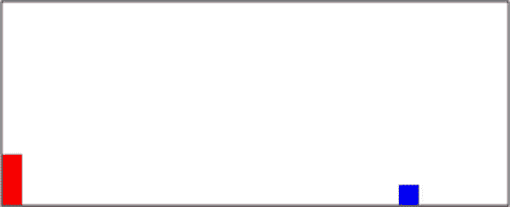
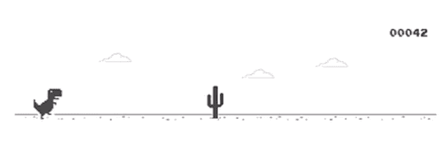

# 如何用 HTML、CSS 和 JavaScript 构建一个游戏

> 原文：<https://blog.logrocket.com/build-a-game-with-html-css-javascript/>

所以你想用你的 web 开发基础知识来创建一个比待办应用稍微酷一点的东西。游戏是你能创造的最好的项目之一，因为它们很容易被最终用户所喜欢，而且制作起来很有趣！有预先为游戏开发制作的 JavaScript [库，但我更喜欢从头开始创建，这样我可以完全理解一切。](https://github.com/collections/javascript-game-engines)



有什么游戏比断网时玩的 Chrome 恐龙游戏更能代表网络开发呢？这是一个有趣的游戏，并且很容易重新创建代码。看起来不完全一样，但功能一样。如果你真的想要，你可以在完成后设计它！



要开始编写游戏代码，请在文档中创建一个新文件夹。用你最喜欢的[文本编辑器](http://brackets.io/)打开那个文件夹，然后创建三个新文件并命名为:`index.html`、`style.css`和`script.js`。用 HTML5 可以在一个文件中做所有的事情，但是把所有的事情分开会更有条理。

我们的`index.html`文件将会非常简单:一旦你有了一个基本的 HTML 布局，创建一个 ID 为`"game"`的 div，然后在其中再创建两个 ID 为`"character"`和`"block"`的 div。角色将是恐龙，而障碍物将是向我们走来的仙人掌。

```
<!DOCTYPE html>
<html lang="en">
<head>
    <meta charset="UTF-8">
    <title>Jump Game</title>
    <link rel="stylesheet" href="style.css">
</head>
<body>
    <div id="game">
        <div id="character"></div>
        <div id="block"></div>
    </div>
<script src="script.js"></script>
</body>
</html>
```

接下来，转到 CSS 文件，开始对我们刚刚创建的两个`div`应用样式。首先，我们从游戏`div`开始。通过元素的`id`选择元素，它由散列符号(`#`)表示。

```
#game{
    width: 500px;
    height: 200px;
    border: 1px solid black;
    margin: auto;
}
```

接下来，我们将样式化我们的角色 div。我们必须将`position`声明为`relative`，因为像`top`和`left`这样的位置属性只适用于[定位的元素](https://www.w3schools.com/css/css_positioning.asp)。

```
#character{
    width: 20px;
    height: 50px;
    background-color: red;
    position: relative;
    top: 150px; //game height - character height (200 - 50)
}
```

创建一个名为 jump 的关键帧动画。该动画将使[顶部](https://www.w3schools.com/cssref/pr_pos_top.asp)位置向上滑动 50px，然后再向下滑动。

```
@keyframes jump{
    0%{top: 150px;}
    30%{top: 100px;}
    70%{top: 100px;}
    100%{top: 150px;}
}
```

接下来，我们将创建一个名为`animate`的新类，它应用了跳转动画。

```
.animate{
    animation: jump 300ms linear;
}
```

每当你点击鼠标时，我们将使用 JavaScript 为我们的角色添加类`"animate"`。

在`script.js`文件中，创建一个名为`jump()`的[函数](https://www.w3schools.com/js/js_function_definition.asp)，它将`"animate"`类添加到角色`div`中。创建一个[事件监听器](https://www.w3schools.com/js/js_htmldom_eventlistener.asp)，监听用户[点击](https://www.w3schools.com/jsref/met_document_addeventlistener.asp)，然后执行跳转功能。

创建另一个名为`removeJump()`的函数来移除 animate 类。然后给`jump()`添加一个`[timeout](https://www.w3schools.com/jsref/met_win_settimeout.asp)`函数，在动画结束时运行`removeJump()`。除非我们删除它，否则动画不会再次运行。

```
var character = document.getElementById("character");
document.addEventListener("click",jump);
function jump(){
    character.classList.add("animate");
    setTimeout(removeJump,300); //300ms = length of animation
};
function removeJump(){
    character.classList.remove("animate");
}
```

这是可行的，但是如果用户在当前跳转时点击，它似乎会出错。要解决这个问题，请在`jump()`的开头添加下面一行。如果动画正在运行，它将停止该函数的任何操作。

```
if(character.classList == "animate"){return;}
```

现在，我们将回到我们的 CSS 文件，并开始样式化块 div。

```
#block{
    width: 20px;
    height: 20px;
    background-color: blue;
    position: relative;
    top: 130px; //game height - character height - block height (200 - 50 - 20)
    left: 480px; //game width - block width (500 - 20)
    animation: block 1s infinite linear;
}
```

我们还没有创建积木动画，所以创建一个动画使积木从右向左滑动。

```
@keyframes block{
    0%{left: 500px} 
    100%{left: -20px}
}
```

现在我们可以跳跃了，但是如果我们碰到障碍物，我们必须让游戏结束。创建一个名为`checkDead()`的函数，获取块和字符的位置，然后评估它们是否在彼此之上。如果是，那么结束游戏。

创建一个名为`characterTop`的变量，它等于字符 div 的顶值。`[getComputedStyle()](https://www.w3schools.com/jsref/jsref_getcomputedstyle.asp)`将返回与一个元素相关联的所有 CSS 值，而`[getPropertyValue()](https://www.w3schools.com/jsref/met_cssstyle_getpropertyvalue.asp)`指定您想要从中获取值的属性。

现在，这将返回一个值为`100px`的字符串。我们只想要数值，所以我们将把所有东西都包装在一个`[parseInt()](https://www.w3schools.com/jsref/jsref_parseint.asp)`函数中，这样它就能以整数的形式返回值。

创建一个`if`语句，检查`blockLeft`的值是否在-20px 和 20px 之间，以及`characterTop`的值是否大于 130px。如果是，那就意味着它们互相重叠，游戏结束。所以我们会设置一个警报`“Game over”`。

创建一个每 10 毫秒运行一次`checkDead`函数的[间隔函数](https://www.w3schools.com/jsref/met_win_setinterval.asp)。

```
var block = document.getElementById("block");
function checkDead(){
    let characterTop = parseInt(window.getComputedStyle(character).getPropertyValue("top"));
    let blockLeft = parseInt(window.getComputedStyle(block).getPropertyValue("left"));
    if(blockLeft<20 && blockLeft>-20 && characterTop>=130){
        alert("Game over");
    }
}

setInterval(checkDead, 10);
```

现在你有一个功能齐全的游戏。这是一个与非开发人员分享的伟大项目，因为他们将能够更好地欣赏你所学到的东西！

如果你想复制代码，这里有我的 GitHub 的链接。如果你在视觉上学得更好，你也可以看看我的 YouTube 视频！

[https://www.youtube.com/embed/bG2BmmYr9NQ](https://www.youtube.com/embed/bG2BmmYr9NQ)

视频

## 通过理解上下文，更容易地调试 JavaScript 错误

调试代码总是一项单调乏味的任务。但是你越了解自己的错误，就越容易改正。

LogRocket 让你以新的独特的方式理解这些错误。我们的前端监控解决方案跟踪用户与您的 JavaScript 前端的互动，让您能够准确找出导致错误的用户行为。

[](https://lp.logrocket.com/blg/javascript-signup)

LogRocket 记录控制台日志、页面加载时间、堆栈跟踪、慢速网络请求/响应(带有标题+正文)、浏览器元数据和自定义日志。理解您的 JavaScript 代码的影响从来没有这么简单过！

[Try it for free](https://lp.logrocket.com/blg/javascript-signup)

.