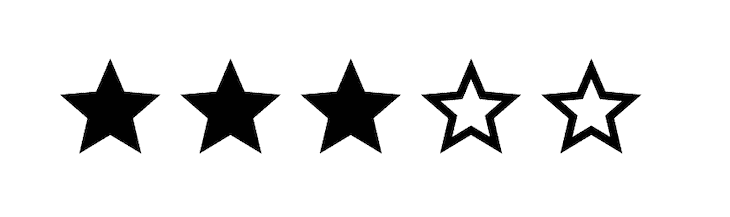
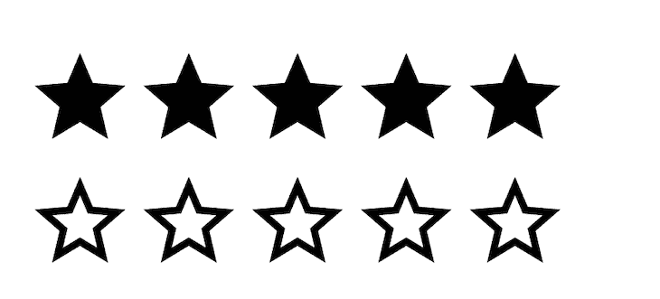
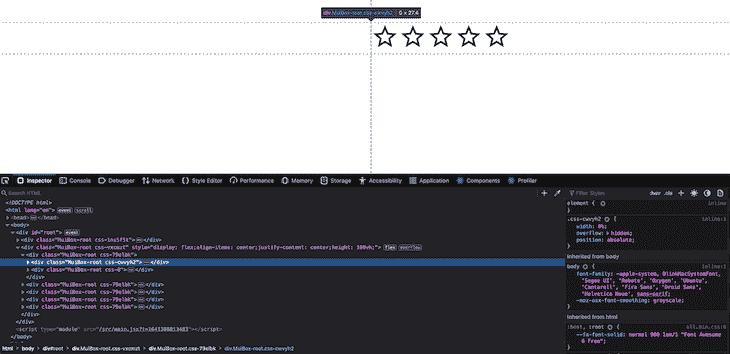
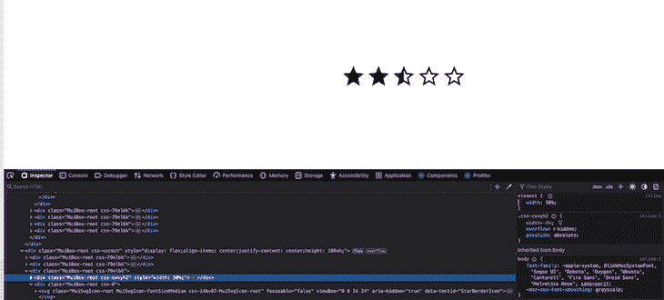
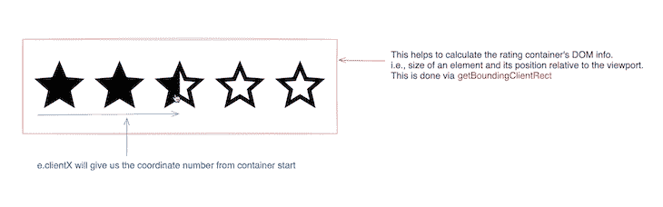
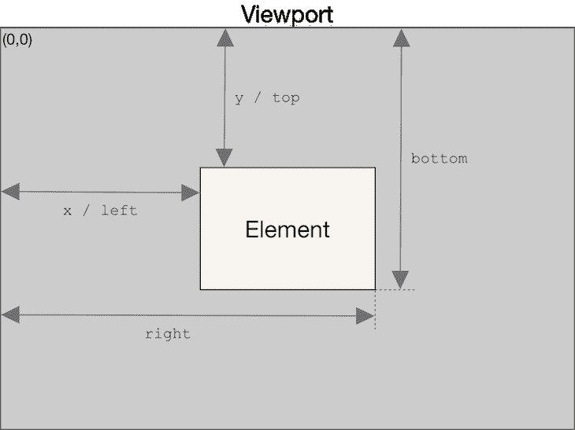
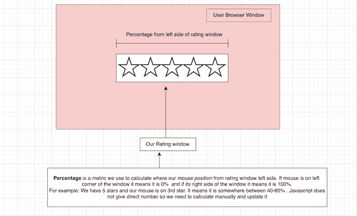
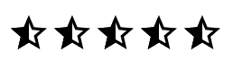

# 在 React from scratch - LogRocket 博客中构建半星评级组件

> 原文：<https://blog.logrocket.com/build-a-half-star-rating-component-in-react-from-scratch/>

在这篇博文中，我们将使用 React 创建自己的评级组件。这些概念在任何 JavaScript 库中也是一样的。

这个问题的简单部分是点击并悬停在星星上，但棘手的部分是实现特定的星级组件—例如，半级，或任何特定的数字精度。在这篇博客中，我们将重点讨论后一部分。

在开始这篇博文之前，请注意有很多方法可以实现这个评级系统。这个只是方法之一！

## 先决条件

要阅读这篇文章，您需要对 React 和 JavaScript 有一个基本的了解。如果你是初学者，你也可以在你选择的框架中实现它，因为每个框架的概念都是一样的。

对于这篇文章，我使用了:

1.  [React](https://reactjs.org) 和 Node.js
2.  [MUI](https://mui.com) (用于快速 CSS 原型制作)
3.  [Vite.js](https://vitejs.dev) (完全由你决定)

## 项目概述和设置

在我们开始之前，我不推荐这种方法，除非您有意实现半星评级系统。这种方法假设我们必须实现一个基于精度的评级系统，因此它将更加复杂。如果您只需要完整的星，您可以通过以下方式实现这样的系统:

*   渲染`n`星星的数量
*   将`click`、`mouseover`和`leave`处理程序附加到您的组件
*   根据您的要求更新状态

在这篇文章中，我们将只讨论半星，但是这种方法应该适用于你想要的任何特定精度。与博客保持一致，你应该能够实现任何你想要的分数星级组件。

我们将经历这些步骤:

1.  安装
2.  使用 CSS 创建半星形
3.  选择并悬停在项目上
4.  奖金
5.  最后的想法
6.  资源

现在，让我们开始有趣的部分吧！

## 安装

如果您的系统中安装了 Node.js，请继续；如果没有，[在继续下一步之前安装](https://nodejs.org/en/)。

1.  使用 Vite

    ```
    yarn create vite star-rating --template react
    ```

    安装 React 项目
2.  安装 MUI。你可以在文档

    ```
    yarn add @mui/material @emotion/react @emotion/styled yarn add @mui/icons-material 
    ```

    中看到他们[最新的安装说明](https://mui.com/getting-started/installation/)

这就是你需要开始的全部。如果您使用的是 Vite，现在可以使用下面的命令运行项目；否则，请查看首选工具的说明:

```
yarn run dev
```

## 使用 CSS 创建半星形

忘记悬停或点击功能。如果您必须只使用 React 创建一个简单的星级组件 UI，您会如何做？

好的——你可以通过跟踪`totalStars`和`activeStars`来完成。基于此，我们可以简单地渲染`active`和`inactive`星星。(我的星星是梅图标。)

The code for this would be:

```
import React from "react";
import Box from "@mui/material/Box";
import StarIcon from "@mui/icons-material/Star";
import StarBorderIcon from "@mui/icons-material/StarBorder";

const BasicFn = () => {
  const totalStars = 5;
  const activeStars = 3;

  return (
    <Box>
      {[...new Array(totalStars)].map((arr, index) => {
        return index < activeStars ? <StarIcon /> : <StarBorderIcon />;
      })}
    </Box>
  );
};

export default BasicFn;

```

悬停和选择星星的逻辑涉及状态操作，与我在前面的解释中提到的相同(在项目概述和设置部分中的*),用于创建一个简单的星级组件。如前所述，你也可以采用这种方法。*

现在，我们进入下一部分。你将如何创建半星评级？

这个比较棘手。为此，我们需要 CSS 更多的帮助。

让我们首先创建`n`个填充的星和`n`个未填充的星。它看起来像这样的第一次:

Here’s what our code for this looks like so far:

```
<Box sx={{ display: "inline-flex" }}>
  {[...new Array(totalStars)].map((arr, index) => {
    return (
      <Box>
        <Box>
          <StarIcon />
        </Box>
        <Box>
          <StarBorderIcon />
        </Box>
      </Box>
    );
  })}
</Box>;

```

**注意:**我使用的是 MUI，这是一个[`css in js`](https://blog.logrocket.com/tag/css-in-js/)库，所以我的大部分 CSS 都是在同一个组件文件中编写的。

因为我们的目标是渲染一个半星形，我们将创建两个独立的星形，在 CSS 属性`absolute`、`overflow`和`width`的帮助下，我们将生成特定的星形精度。我的意思是这样的:

If you can see in the above image, we set the `width` of our filled icon to `0`. This will come in handy soon.

在`absolute`位置道具的帮助下，我们将填充和未填充的星星重叠在一起。到目前为止，您可能已经了解了上下文，但是如果没有，也不用担心:

This is what happens when we set up `width`s for specific stars.

现在，我们只需利用状态来实现这一功能:

```
<Box
  sx={{
    display: "inline-flex",
    position: "relative",
    cursor: "pointer",
    textAlign: "left",
  }}
>
  {[...new Array(totalStars)].map((arr, index) => {
    return (
      <Box position="relative">
        <Box sx={{ width: "0%", overflow: "hidden", position: "absolute" }}>
          <StarIcon />
        </Box>
        <Box>
          <StarBorderIcon />
        </Box>
      </Box>
    );
  })}
</Box>;

```

## 选择并悬停在项目上

到目前为止，我们已经创建了一个 CSS 框架，我们将使用它作为处理这个组件的更动态部分的参考，例如，我们的点击和悬停功能。

因为我们关注的是精确的星星，所以我们应该相应地施加关于点击星星的规则——所以我们需要添加允许用户精确选择星星的功能。例如`3.5`恒星。

如果您不需要处理半星形实现，您只需要跟踪`indexes`并基于条件进行渲染:

```
const Rating = () => {
  const [activeStar, setActiveStar] = useState(-1);
  const totalStars = 5;
  const activeStars = 3;
  const handleClick = (index) => {
    setActiveStar(index);
  };
  return (
    <Box
      sx={{
        display: "inline-flex",
        position: "relative",
        cursor: "pointer",
        textAlign: "left",
      }}
    >
      {[...new Array(totalStars)].map((arr, index) => {
        return (
          <Box
            position="relative"
            sx={{
              cursor: "pointer",
            }}
            onClick={() => handleClick(index)}
          >
            <Box
              sx={{
                width: index <= activeStar ? "100%" : "0%",
                overflow: "hidden",
                position: "absolute",
              }}
            >
              <StarIcon />
            </Box>
            <Box>
              <StarBorderIcon />
            </Box>
          </Box>
        );
      })}
    </Box>
  );
};

```

它将允许用户选择他们想要显示的星级。

[https://stackblitz.com/edit/react-bytdr4?file=src%2FApp.js](https://stackblitz.com/edit/react-bytdr4?file=src%2FApp.js)

悬停的类似过程也适用于这种方法；自己试试吧，在评论里告诉我效果如何！

回到正题——我们如何选择半颗星？让我们深入研究一下这个实现。

为了实现基于精度的评级系统，我们需要一些 DOM APIs 的帮助:

1.  **`clientX`** :根据 [W3C 文档](https://w3c.github.io/uievents/#dom-mouseevent-clientx)，这被定义为:“事件发生时相对于与事件相关联的视口的水平坐标。”
2.  **`getBoundingClientRect` :** 根据 [MDN docs](https://developer.mozilla.org/en-US/docs/Web/API/Element/getBoundingClientRect) ，这被定义为:“ **`Element.getBoundingClientRect()`** 方法返回一个 **`DOMRect`** 对象，该对象提供关于元素的大小及其相对于视口的位置的信息。”

所以，从技术上来说，我们想做一些数学计算，以确定我们将从哪个恒星开始，上面的两种方法将帮助我们实现它。简单来说，我们可以这样解释:

Source: Here is [excalidraw](https://excalidraw.com/#json=d520i4WX0-yR8JtsighCc,dvc9vDB8F7-B5gJ_F39AAg) link.

### 获取 DOM 信息

在 React 中，我们可以使用来自`useRef` [API](https://blog.logrocket.com/tag/css-in-js) 的帮助。我们的代码应该是这样的:

```
const ratingContainerRef = useRef(null);
...
...
...
<Box
...
ref={ratingContainerRef}
...

```

从`ratingContainerRef`开始，我们将计算`Box`的尺寸。我们只对计算`width`和`left`感兴趣，因为我们想要找到我们想要开始的恒星。

1.  **宽度**:设置一个元素的宽度
2.  **left:** 从视窗边缘到最左侧元素左侧的总距离

这是理解`getBoundingClientRect`如何工作的一个很好的图像。

[Source](https://developer.mozilla.org/en-US/docs/Web/API/Element/getBoundingClientRect)

要计算百分比，在我们点击或移动鼠标的地方，我们可以简单地创建这个公式:

```
/*
e.clientX -> will also have left included so we want to remove that part 
so that we get coordinate value started from first rating item and we simply
divided by width to get the percentage
*/
let percent = (e.clientX - left)/width;

/* Since percent is in decimal, for calculation we need to multiply this percent with totalNumberOfStar so it will give 
numbers which is less than or equal total number of start and is in readable form 
*/
//For example: 0.4834 is 48% of total width. But lies on which star make sure by below formula
let numberInStars = percent * totalStars;

```

这将为我们提供单击位置的上下文。如果返回值是`0%`，我们点击了窗口的左边；如果是`100%`，我们已经点击了它的右边。

For example, if it returns `70%`, we can say we’ve clicked somewhere in the fourth star.

### 寻找精确的值

接下来，我们需要找到每颗星的中点的精确值*。*

假设我们使用`0.5`作为精确值，而`numberInStars`是`3.6666`。现在，应该很清楚我们需要通过做一些数学来处理精度。

所以，在上面的例子中，最接近的整数应该是`4`，它应该选择`4`颗恒星。

让我们根据给定的精度写出最近数公式。要写出精确的数学，你不需要成为数学专家。通过简单的谷歌搜索，你可以用 JavaScript 找到它:

```
//This will give number close to number with precision. 
//For Example: numberInStars - 4.666666666666667, precision-> 0.5 will give 5
/*
    For reference you can think of nearest number as the next interval of precision.
    4.223 -> 4.5
    3.45 -> 3.5
    3.60 -> 4 
*/
const nearestNumber  = Math.round((numberInStars+ precision/2)/precision) * precision

```

如果你想了解更多，有一个关于栈溢出的很好的解释可以参考。

还有一点:在上面的公式中，我们加入了`precision/2`。这将始终确保，如果我们悬停在第二颗和第三颗恒星之间，它将根据我们的精度规则选择最接近的数字。

就是这样！由此，您将能够生成一个准确的数字，我们需要将它显示在每个活动评分项下。

如果您没有使用高精度值，如`0.55454`，则不需要此检查。但是，要对我们的应用程序进行安全检查，添加以下内容以确保它永远不会超过该值是有帮助的:

```
Number(nearestNumber.toFixed(precision.toString().split(".")[1]?.length || 0));

```

我们最终的函数应该是这样的:

```
const calculateRating = (e) => {
  const { width, left } = ratingContainerRef.current.getBoundingClientRect();
  let percent = (e.clientX - left) / width;
  const numberInStars = percent * totalStars;
  const nearestNumber = Math.round((numberInStars + precision / 2) / precision) * precision;;
  return Number(
    nearestNumber.toFixed(precision.toString().split(".")[1]?.length || 0)
  );
};

```

这是大多数人挣扎的唯一棘手的部分，主要是因为我们在这里写了一些逻辑。由此，我们将能够像`0.5,1.5,2`一样生成准确的评分数字。

## 把所有的放在一起

现在让我们将它添加到我们的星级项目选择器中。

如果你点击星星，你会看到与我们预期的不同的行为。点击任何一颗星星，你都会看到这样的东西:

There are different ways to solve this problem, but we’ll go through the one I prefer.

我们知道自己的活跃星值(即`2,3.5,5`)。假设我们选择了`3.5`。这意味着前三颗星应该是满的，我们的第四颗星应该是`half`满的。剩下的应该是`empty`。

我们已经将所有的星星渲染成空的(见*使用 CSS 创建半颗星星部分*)，所以我们需要注意只显示一颗未填充的星星。

但是，我们可以不渲染所有的空项目，而是渲染小于我们的活动星(`3.5`表示我们需要显示`3 full star`)的填充项目，即:

```
{
  [...new Array(totalStars)].map((arr, index) => {
    const activeState = activeStar;
        /*
        we only need to render empty icon layout when active state 
        is not set i.e -1  in our case or active state is 
        less than index+1 (number of stars start from 0) i.e show only when its 
        index is greater that active state
      */
    const showEmptyIcon = activeState === -1 || activeState < index + 1;

    return (
      <Box
        position={"relative"}
        sx={{
          cursor: "pointer",
        }}
        key={index}
      >
        <Box
          sx={{
            width: `${(activeState % 1) * 100}%`,
            overflow: "hidden",
            position: "absolute",
          }}
        >
          <StarIcon />
        </Box>
        {/* Notice here */}
        <Box>{showEmptyIcon ? <StarBorderIcon /> : <StarIcon />}</Box>
      </Box>
    );
  });
}

```

这将从选择您想要选择的星星开始。

现在，我们需要渲染我们的精度为基础的明星。这是该逻辑的代码:

```
{
  [...new Array(totalStars)].map((arr, index) => {
    const activeState = activeStar;
    /*
        we only need to render empty icon layout when active state 
        is not set i.e -1  in our case or active state state is 
        less than index i.e show only when its 
        index is greater that active state
      */
    const showEmptyIcon = activeState === -1 || activeState < index + 1;

    const isActiveRating = activeState !== 1;
    const isRatingWithPrecision = activeState % 1 !== 0;
    const isRatingEqualToIndex = Math.ceil(activeState) === index + 1;
    const showRatingWithPrecision =
      isActiveRating && isRatingWithPrecision && isRatingEqualToIndex;

    return (
      <Box
        position={"relative"}
        sx={{
          cursor: "pointer",
        }}
        key={index}
      >
        <Box
          sx={{
            width: showRatingWithPrecision
              ? `${(activeState % 1) * 100}%`
              : "0%",
            overflow: "hidden",
            position: "absolute",
          }}
        >
          <StarIcon />
        </Box>
        {/*Note here */}
        <Box>{showEmptyIcon ? <StarBorderIcon /> : <StarIcon />}</Box>
      </Box>
    );
  });
}

```

以下是上述代码中函数的一些定义:

1.  `isActiveRating`:检查星星是否被点击(或悬停在下一部分，在这种情况下，其值不应为`-1`
2.  `isRatingWithPrecision`:检查我们是否需要使用特定的精度等级(即半星)
3.  `isRatingEqualToIndex`:检查是否需要显示当前指标的评级活动状态。
    1.  **注意:当 precision = `1`，** `isRatingWithPrecision`将会是`0`，所以我们的`showEmptyIcon`条件将足以处理全明星功能
4.  `showRatingWithPrecision`:确定上述三个条件是否满足，如果满足，确定是否需要显示一个基于`precision`的星星。
    1.  例子:`3.5 %1 -> 0.5`表示我们需要显示一个`50%`填充的星星。我们用`showRatingWithPrecision`条件来处理这个问题

终于，我们解决了最大的问题！

## 设置我们的悬停逻辑

设置我们的悬停逻辑将遵循与上面基本相同的步骤；我们只需要追踪我们是否在盘旋。

```
//Similar to active star state, we need to handle hover state
const [hoverActiveStar, setHoverActiveStar] = useState(-1);
// Not necessary. But handy in readability of code.
const [isHovered, setIsHovered] = useState(false);
...
...

//Event listener for mouse move and leave
const handleMouseMove = (e) => {
  setIsHovered(true);
  setHoverActiveStar(calculateRating(e)); // We already calculation in this function
};
const handleMouseLeave = (e) => {
  setHoverActiveStar(-1); // Reset to default state
  setIsHovered(false);
};

...
...

//If you remember we have created separate variable `activeState`.
// Simply toggle state if its hovering take hover one otherwise take active one
const activeState = isHovered ? hoverActiveStar : activeStar;

```

和 rest 将遵循与设置精度等级相同的步骤。

你可以在提供的链接中找到完整的[源代码](https://github.com/shubhamV123/star-rating)和[演示](https://rating.shubhamverma.dev)。

## 其他用途

这不仅仅与星级组件有关！您可以使用任何一组图标，只要您有填充和空的图像版本。请随意查看回购代码，因为我[添加了不同的图标示例](https://rating.shubhamverma.dev/)。

## 最后的想法

这只是在任何 JavaScript 框架中创建通用评级组件的概念验证，并不是专门针对 React 的。

我参考并汲取了灵感[梅的评分部分](https://mui.com/components/rating/)。大多数事情我们内部不需要知道，但这是一个常见的面试问题，所以我认为分享我对这个组件的知识和理解会有所帮助。

您还可以对这段代码进行许多改进。如果你发现任何错误，请随时提出 [PR](https://github.com/shubhamV123/star-rating) 或[通过电子邮件](https://shubhamverma.dev/contact)或在评论中联系我。

## 使用 LogRocket 消除传统反应错误报告的噪音

[LogRocket](https://lp.logrocket.com/blg/react-signup-issue-free)

是一款 React analytics 解决方案，可保护您免受数百个误报错误警报的影响，只针对少数真正重要的项目。LogRocket 告诉您 React 应用程序中实际影响用户的最具影响力的 bug 和 UX 问题。

[ ](https://lp.logrocket.com/blg/react-signup-general) [  ](https://lp.logrocket.com/blg/react-signup-general) [LogRocket](https://lp.logrocket.com/blg/react-signup-issue-free)

自动聚合客户端错误、反应错误边界、还原状态、缓慢的组件加载时间、JS 异常、前端性能指标和用户交互。然后，LogRocket 使用机器学习来通知您影响大多数用户的最具影响力的问题，并提供您修复它所需的上下文。

关注重要的 React bug—[今天就试试 LogRocket】。](https://lp.logrocket.com/blg/react-signup-issue-free)