# 在 Node.js - LogRocket 博客中构建一个位置分析报告 API

> 原文：<https://blog.logrocket.com/build-a-location-analytics-api-in-node-js/>

由纬度和经度定义的位置可以与其他数据结合使用，以产生对企业的洞察力，这被称为位置分析。

在全球范围内运营的企业在价值链中使用位置分析，例如，定位用户、提供服务和投放定向广告。随着社交媒体和移动设备的兴起，位置分析的使用在全球范围内有所增加。

在本教程中，我们将了解如何在 Node.js 中构建轻量级位置分析报告服务 API。在本教程结束时，您将能够为自己的项目构建这种类型的 API。您还将对 Node.js 中的错误处理和良好的文件结构有更好的理解！

我们开始吧！

### 先决条件

要跟随本教程，您需要以下内容:

*   熟悉 Node.js、Express 和 Git
*   Visual Studio 代码编辑器
*   Heroku 帐户
*   邮递员帐户

## 设置文件结构

首先，我们需要建立我们的文件结构。打开您的终端并创建一个新目录，您将在其中存储项目的所有文件。在您的终端中，键入以下命令，后跟文件夹名称`lars`:

```
mkdir lars

```

在 VS 代码编辑器中打开`lars`工作目录:

```
  code .

```

您将看到您的 VS 代码窗口打开:

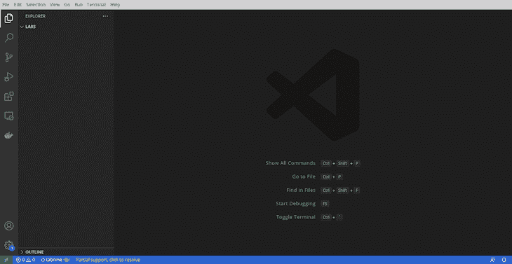

Visual Studio Code window

通过在 Visual Studio 中打开终端并运行`npm init -y`来初始化工作目录。

如果您希望在操作系统终端的 VS 代码之外运行这个命令，请导航到`lars`目录并运行下面的命令:

```
npm init -y

```

上面的代码会自动生成`package.json`文件:

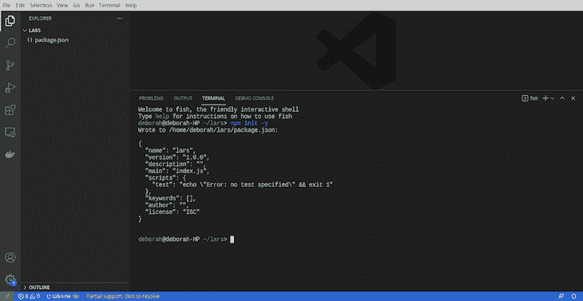

VS Code showing the package.json file created

在本教程中，我们将使用 Express 作为依赖项。通过运行以下命令安装 Express:

```
npm install express --save

```

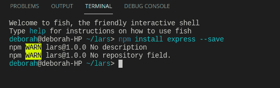

Command to install Express as a dependency

安装 Express 后，您会注意到创建了一个`node_modules`文件夹。要确认您已经安装了 Express，请检查您的`package.json`文件，您将看到 Express 作为一个依赖项安装:

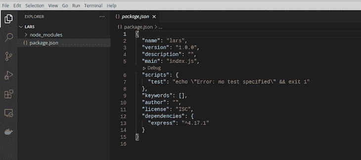

node_modules folder created and Express added to package.json

我们需要将 Express 导入到我们的应用程序中，因为它是一个 npm 模块。在与您的`package.json`文件相同的目录中创建一个名为`app.js`的新文件:

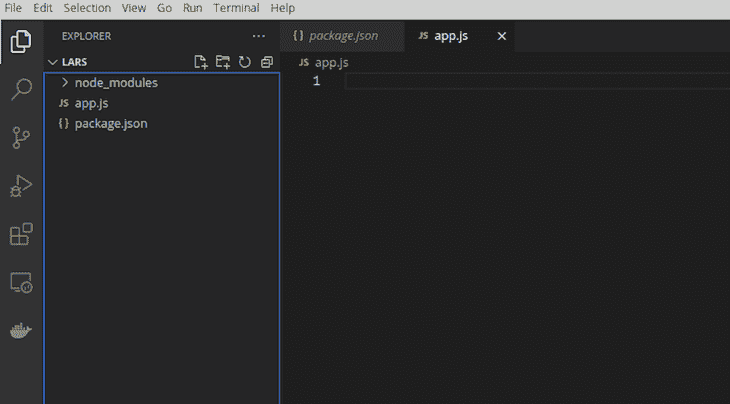

Screenshot of VS Code window showing app.js created

在您的`app.js`文件中，`require`通过运行下面的代码来表示:

```
const express = require('express');

```

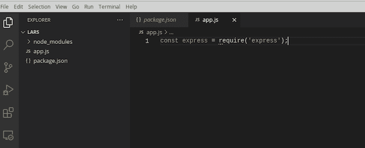

Importing Express

现在，呼叫 Express 来创建您的应用程序、路线和应用程序运行的端口:

```
const app = express();

```

Node.js 实现了模块化，这意味着它将您的应用程序分成模块或各种文件，并导出每个文件。我们将使用关键字`export`导出`app`:

```
module.exports = app;

```

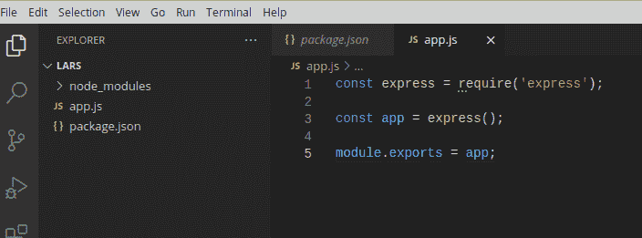

app.js file

接下来，在与`app.js`文件相同的目录中创建另一个名为`server.js`的文件。`Require`的`app.js`文件进入`server.js`文件:

```
const app = require('./app');

```

在与`server.js`相同的目录下创建一个名为`config.env`的文件。`config.env`文件将包含我们应用程序所需的所有`[process.env](https://nodejs.org/dist/latest-v8.x/docs/api/process.html)`键。在`config.env`文件中，创建一个`PORT`变量，并设置`PORT`监听端口`8000`:

```
PORT=8000

```

导入 app 后，在`server.js`文件中创建一个名为`port`的常量。将它设置为您刚刚创建的`PORT`变量和默认端口`3000`:

```
const port = process.env.PORT || 3000;

```

最后，我们将应用程序设置为使用`.listen()`方法监听端口:

```
app.listen(port, () => {
    console.log(`App listening on ${port}`)
});

```

## 构建路线

每当你访问一个网页或运行在网络上的应用程序时，你都是在发出一个 HTTP 请求。服务器用来自后端或数据库的数据进行响应，这就是所谓的 HTTP 响应。

当您在 web 应用程序上创建资源时，您正在调用`POST`请求。类似地，如果您尝试删除或更新 web 应用程序上的资源，您将调用一个`DELETE`、`PATCH`或`UPDATE`请求。让我们建立路由来处理这些请求。

在工作目录中创建一个名为`routes`的文件夹，并在其中创建一个名为`analyticsRoute.js`的文件。`Require`在`analyticsRoute.js`文件中表达为 API 设置路径:

```
      const express = require('express');

```

我们还需要从`app.js`文件中`require`我们的应用程序模块:

```
        const app = require('../app');

```

然后，我们创建路线:

```
        const router = express.Router();

```

最后，我们将导出路由器:

```
        module.exports = router;

```

## 构建控制器

我们需要为控制器创建文件，并将它们导入到我们的`analyticsRoutes`文件中。首先，在您的工作目录中创建一个名为`controllers`的文件夹。

我们的 API 将使用用户提供的 IP 地址和坐标来计算距离和位置。我们的请求需要接受来自用户的信息和请求。

我们将使用一个`POST`请求，因为用户正在将数据包含在`req.body`中。为了保存信息，我们需要在我们的控制器中`require`一个[T3 模块](https://nodejs.org/api/fs.html)(文件系统)。

### 处理`POST`请求

在`controllers`文件夹中创建一个名为`storeController.js`的文件。在`storeController.js`文件中，我们需要导入`fs`模块和`fsPromises.readFile()`方法来处理返回的`promise`，也就是用户的 IP 地址和坐标。

要安装`fs`模块，在工作目录中打开您的终端并运行以下命令:

```
npm i fs --save

```

在文件顶部键入以下代码:

```
const fsp = require('fs').promises;
const fs = require('fs');

```

接下来，我们将创建控制器，它将为`POST`请求处理我们的路由。我们将使用关键字`exports`并创建一个异步的[中间件函数](https://expressjs.com/en/guide/writing-middleware.html#:~:text=Middleware%20functions%20are%20functions%20that,middleware%20succeeding%20the%20current%20middleware.)，它接受三个参数:

*   `req`:代表请求对象
*   `res`:代表响应对象
*   `next`:中间件导出后立即调用函数

```
postAnalytics = async(req, res, next) => {}
```

现在，我们将把`req.body`中数据对象的属性保存到`reportAnalytics`数组中。我们将设置一个`Date()`对象来保存任何数据在`createdAt`键中的创建日期:

```
reportAnalytics.push({...req.body, createdAt: new Date()});

```

我们将创建一个名为`storeAnalytics.json`的文件，使用`JSON.stringify()`将`reportAnalytics`数组的内容保存为一个字符串:

```
 await fsp.writeFile(`${__dirname}/storeAnalytics.json`, JSON.stringify(reportAnalytics));

```

当用户发出`POST`请求时，我们需要检查`storeAnalytics.json`文件是否存在。如果文件存在，我们需要读取文件并保存输出。

输出包含一个名为`reportFile`的常量，它存储了被读取文件的内容。使用`reportFile`上的`JSON.parse`将文件内容转换成 JavaScript 对象:

```
// checks if file exists
if (fs.existsSync(`${__dirname}/storeAnalytics.json`)) {
// If the file exists, reads the file
  const reportFile = await fsp.readFile(`${__dirname}/storeAnalytics.json`, 'utf-8')
// converts the file to JavaScript Object
reportAnalytics = JSON.parse(reportFile)
} else {
  // if file does not exist
   return ('File does not exist');
}

```

`[fs.existsSync()](https://www.geeksforgeeks.org/node-js-fs-existssync-method/)`方法同步检查文件是否存在。它接受`${__dirname}/storeAnalytics.json`路径作为它的单个参数，并指向我们想要检查的文件的位置。

我们使用关键字`await`和`reportFile`来等待通过`fsp.readFile()`方法读取文件的结果。接下来，我们用`(${__dirname}/storeAnalytics.json`指定了我们想要读取的文件的路径。我们将编码格式设置为`utf-8`，这将把从文件中读取的内容转换为字符串。

`JSON.parse()`将`reportFile`转换成一个 JavaScript 对象，并存储在`reportAnalytics`数组中。只有当文件不存在时，`else`语句块中的代码才会运行。最后，我们使用了`return`语句，因为我们想在代码运行后停止函数的执行。

如果文件被成功读取、创建并保存在`storeAnalytics.json`文件中，我们需要发送一个响应。我们将使用响应对象`(res)`，它是我们的异步`postAnalytics`函数中的第二个参数:

```
    res.status(201).json({
        status: 'success',
        data: {
            message: 'IP and Coordinates successfully taken'
        }
    })

```

我们将用状态`success`和数据消息`IP and Coordinates successfully taken`来响应。

您的`storeController.js`文件应该看起来像下面的截图:

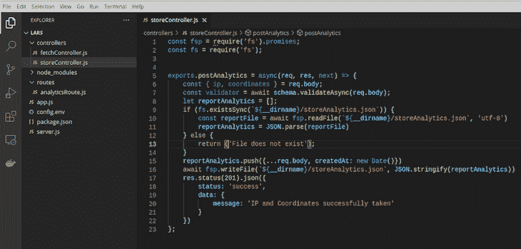

### 处理`GET`请求

我们需要创建另一个控制器文件来处理我们的`GET`请求。当用户向 API 发出`GET`请求时，我们将根据他们的 IP 地址和坐标计算他们的位置。

在`controllers`文件夹中创建一个名为`fetchController.js`的文件。在`storeController.js`文件中，我们需要用`require``fs`模块和`fsPromises.readFile()`方法来处理返回的`promise`:

```
const fsp = require('fs').promises;
const fs = require('fs');

```

让我们创建控制器来处理`GET`请求的路由。我们将使用与上面针对`POST`请求所做的类似的中间件功能和参数:

```
   exports.getAnalytics = async(req, res, next) => {}

```

在`getAnalytics`中间件内部，键入以下代码，从请求的查询中获取 IP 地址:

```
     const { ip } = req.query; 

```

现在，创建一个空数组来存储`req.body`的内容:

```
     let reportAnalytics = [];

```

正如我们之前所做的，我们需要检查`storeAnalytics.json`文件是否存在。如果文件存在，我们将使用`reportFile`上的`JSON.parse`将文件内容转换成一个 JavaScript 对象:

```
if (fs.existsSync(`${__dirname}/storeAnalytics.json`)) {
        const reportFile = await fsp.readFile(`${__dirname}/storeAnalytics.json`, 'utf-8')
        reportAnalytics = JSON.parse(reportFile)
    } else {
        return ('File does not exist');
    }

```

现在，我们可以将用户的 IP 地址和坐标保存在`storeAnalytics.json`文件中。每当用户请求根据所提供的坐标计算地理位置时，IP 地址将以查询的形式包含在请求中。

现在我们已经从`req.query`对象获得了 IP 地址，我们可以编写代码来检查`req.query`对象中提供的 IP 地址是否与存储在`storeAnalytics.json`文件中的 IP 地址相同:

```
   for (let i=0; i<reportAnalytics.length; i++) {
        if (reportAnalytics[i].ip !== ip) {
           return ('No Coordinates found with that IP');
        };
    }

```

在上面的代码中，我们使用`forloop`来遍历`reportAnalytics`数组。我们将代表当前元素在`reportAnalytics`数组中的索引的变量`i`初始化为`0`。如果 I 小于`reportAnalytics`数组的长度，我们就递增它。

* * *

### 更多来自 LogRocket 的精彩文章:

* * *

接下来，我们检查`reportAnalytics`数组的 IP 地址属性是否等于`req.query`中提供的 IP 地址。

让我们来计算仅在过去一小时内存储的 IP 地址的位置:

```
    const hourAgo = new Date();
    hourAgo.setHours(hourAgo.getHours()-1);
    const getReport = reportAnalytics.filter(el => 
        el.ip === ip && new Date(el.createdAt) > hourAgo
    )

```

在上面的代码块中，我们创建了一个名为`hourAgo`的常量，并将其设置为一个`Date`对象。我们使用`setHours()`方法将`hourAgo`设置为最后一个小时`getHours()-1`。

当`reportAnalytics`文件中的当前 IP 地址等于或等于`req.query`中传递的 IP 地址时，意味着数据是在最后一个小时创建的，`getReport`创建一个常量集到一个新数组中。

创建一个名为`coordinatesArray`的常量，它将只存储已经保存在`getReport`数组中的坐标:

```
const coordinatesArray = getReport.map(element => element.coordinates)

```

接下来，我们需要用坐标计算位置。我们需要遍历`coordinatesArray`并通过传入保存为坐标的两个值来计算位置:

```
    let totalLength = 0;
    for (let i=0; i<coordinatesArray.length; i++) {
        if (i == coordinatesArray.length - 1) {
            break;
        }
        let distance = calculateDistance(coordinatesArray[i], coordina         tesArray[i+1]);
        totalLength += distance;
    }

```

在上面的代码中，`totalLength`表示从两个坐标计算出的总距离。为了遍历`coordinatesArray`，我们需要初始化我们的计算结果。将`totalLength`设置为零会初始化总距离。

第二行包含我们正在使用的迭代代码`forloop`。我们用`let i=0`初始化`i`变量。`i`变量代表当前元素在`coordinatesArray`中的索引。

`i<coordinatesArray.length`设置迭代的条件，仅在当前元素的索引小于`coordinatesArray`的长度时运行。接下来，我们在迭代中增加当前元素的索引，以使用`i++`移动到下一个元素。

接下来，我们将检查当前元素的索引是否等于数组中最后一个元素的编号。然后，我们暂停迭代代码的执行，并使用`break`关键字转移到下一个。

最后，我们创建一个名为`calculateDistance`的函数，它接受两个参数，第一个和第二个坐标值(经度和纬度)。我们将在另一个模块中创建`calculateDistance`并将其导出到`fetchController.js`文件中，然后我们将最终结果保存在我们初始化的`totalLength`变量中。

注意，每个请求都需要一个响应。我们将用一个`200`的`statusCode`和一个包含我们将计算的距离值的 JSON 来响应。仅当代码成功时，才会显示响应:

```
     res.status(200).json({distance: totalLength})

```

您的`fetchController.js`文件应该看起来像下面的两个代码块:

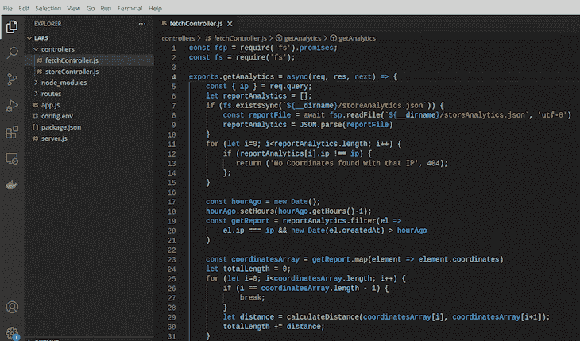

The fetchController.js file

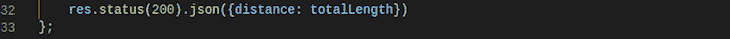

fetchController.js file continuation

## 构建`calculateDistance`函数

在您的工作目录中，创建一个名为`utilities`的新文件夹，并在其中创建一个名为`calculateDistance.js`的文件。打开`calculateDistance.js`文件，添加以下功能:

```
const calculateDistance = (coordinate1, coordinate2) => {
    const distance = Math.sqrt(Math.pow(Number(coordinate1.x) - Number(coordinate2.x), 2) + Math.pow(Number(coordinate1.y) - Number(coordinate2.y), 2));
    return distance;
} 
module.exports = calculateDistance;

```

在第一行中，我们创建了一个名为`calculateDistance`的函数，它接受两个参数:`coordinate1`和`coordinate2`。它使用以下等式:

*   `Math.sqrt`:数学中的平方根
*   `Math.pow`:对一个数字进行幂运算
*   `Number()`:将数值转换为数字
*   `coordinate1.x`:第一个坐标的第二个值(经度)
*   `coordinate2.x`:第一个坐标的第一个值(经度)
*   `coordinate1.y`:第二个坐标的第二个值(纬度)
*   `coordinate2.y`:第二个坐标的第一个值(纬度)

既然我们已经创建了`calculateDistance`函数，我们需要将`require`函数放到`fetchController.js`文件中的代码中。在`fs`模块后添加以下代码:

```
const calculateDistance = require('../utilities/calculateDistance');

```

## 实现错误处理

实现错误处理是很重要的，以防我们的代码失败或者某个特定的实现没有按照设计的方式工作。我们将增加开发和生产中的错误处理。

打开您的`config.env`文件并运行`NODE_ENV=development`来设置开发环境。

在您的`controllers`文件夹中，创建一个名为`errorController.js`的新文件。下面的代码片段创建了一个名为`sendErrorDev`的函数来处理开发环境中遇到的错误:

```
const sendErrorDev = (err, res) => {
    res.status(err.statusCode).json({
        status: err.status,
        error: err,
        message: err.message,
        stack: err.stack,
    });
}

```

我们将创建一个名为`sendErrorDev`的函数，它接受两个参数，`err`表示错误，`res`表示响应。`response.status`接受错误的`statusCode`,并用 JSON 数据响应。

此外，我们将创建一个名为`sendErrorProd`的函数，它将处理 API 在生产环境中遇到的错误:

```
const sendErrorProd = (err, res) => {
    if(err.isOperational) {
        res.status(err.statusCode).json({
            status: err.status,
            message: err.message
        });    
    } else {
        console.error('Error', err);
        res.status(500).json({
            status: 'error',
            message: 'Something went wrong'
        })
    }
}

```

在您的`utilities`文件夹中，创建一个名为`appError.js`的文件，并键入以下代码:

```
class AppError extends Error {
    constructor(message, statusCode) {
        super(message);
        this.statusCode = statusCode;
        this.status = `${statusCode}`.startsWith('4') ? 'fail' : 'error';
        this.isOperational = true;
        Error.captureStackTrace(this, this.constructor);
    }
}
module.exports = AppError;

```

我们将创建一个名为`AppError`的类，它扩展了 [`Error`对象](https://developer.mozilla.org/en-US/docs/Web/JavaScript/Reference/Global_Objects/Error)。

然后，我们将创建一个构造函数来初始化这个类的对象。它接受两个名为`message`和`statusCode`的参数。 [`super`方法](https://www.w3schools.com/jsref/jsref_class_super.asp)用一个参数调用构造函数，将其传递给`message`，并获得对构造函数的属性和方法的访问。

接下来，我们将把构造函数的`statusCode`属性设置为`statusCode`。我们将构造函数的`status`属性设置为任何以`4`开头的`statusCode`，例如`404 statusCode`到`fail`或者`error`。

创建另一个名为`catchAsync.js`的文件，并在其中添加以下代码:

```
module.exports = fn => {
    return (req, res, next) => {
        fn(req, res, next).catch(next);
    }
}

```

### 向控制器文件添加错误处理

`Require`您的`storeController.js`和`fetchController.js`文件中的`appError.js`文件和`catchAsync.js`文件。将这两个导入语句放在两个文件中代码的顶部:

```
const catchAsync = require('../utilities/catchAsync');
const AppError = require('../utilities/appError');

```

在`storeController.js`和`fetchController.js`文件中，用`catchAsync()`方法包装函数，如下所示:

```
// For storeController.js file
exports.postAnalytics = catchAsync(async(req, res, next) => {...} 

// For fetchController.js file
exports.getAnalytics = catchAsync(async(req, res, next) => {...}

```

接下来，在您的`fetchController.js`文件中，运行`AppError`类:

```
   for (let i=0; i<reportAnalytics.length; i++) {
        if (reportAnalytics[i].ip !== ip) {
           return next(new AppError('No Coordinates found with that IP', 404));
        };
    }

```

接下来，运行`storeController.js`文件中的`AppError`类:

```
   if (fs.existsSync(`${__dirname}/storeAnalytics.json`)) {
        const reportFile = await fsp.readFile(`${__dirname}/storeAnalytics.json`, 'utf-8')
        reportAnalytics = JSON.parse(reportFile)
    } else {
        return next(new AppError('File does not exist', 404));
    }

```

您的`storeController.js`和`fetchController.js`文件中的代码应该类似于下面的截图:

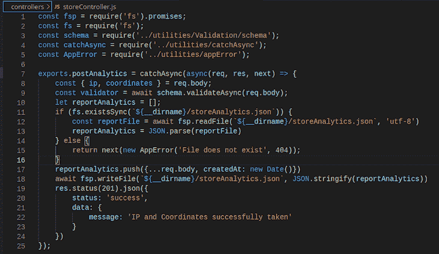

Screenshot of the storeController.js file

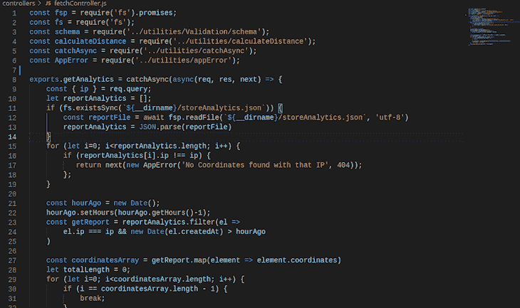

fetchController.js file lines 1-32


fetchController.js file lines 33-37

## 设置验证

我们需要验证在`req.body`中收到的数据(包括 IP 地址和坐标)是正确的，并且格式正确。坐标应该至少有两个值，代表经度和纬度。

在`utilities`文件夹中，创建一个名为`Validation`的新文件夹。在`Validation`文件夹中，创建一个名为`schema.js`的文件。`schema.js`文件将包含`req.body`中提供的任何数据的所需格式。我们将使用`[joi](https://www.npmjs.com/package/joi)`验证器:

```
npm install joi 
```

在`schema.js`文件中键入以下代码:

```
const Joi = require('joi');
const schema = Joi.object().keys({
    ip: Joi.string().ip().required(),
    coordinates: Joi.object({
        x: Joi.number().required(),
        y: Joi.number().required()
    }).required()
})
module.exports = schema;

```

在上面的代码块中，我们`require`了`joi`验证器，并使用它来创建我们的模式。然后，我们将 IP 地址设置为一个字符串，并通过在请求体中要求它来验证 IP 地址。

我们将坐标设为一个`object`。我们将代表经度和纬度值的`x`和`y`值都设置为一个数字，并使用`require`来运行我们的代码。最后，我们导出了模式。

在验证文件夹中，创建另一个名为`validateIP.js`的文件。在内部，我们将使用`[is-ip](https://www.npmjs.com/package/is-ip)` npm 包编写代码来验证 IP 地址。让我们将包导出到我们的代码中。

在`validateIP.js`文件中，添加以下代码:

```
const isIp = require('is-ip');
const fsp = require('fs').promises;
const fs = require('fs');
exports.validateIP = (req, res, next) => {
    if(isIp(req.query.ip) !== true) {
        return res.status(404).json({
            status: 'fail',
            data: {
                message: 'Invalid IP, not found.'
            }
        })
    }
    next();
}

```

运行以下命令，为我们的 API 安装必要的依赖项:

```
npm install body-parser cors dotenv express fs is-ip joi morgan ndb nodemon

```

您的`app.js`文件应该看起来像下面的截图:

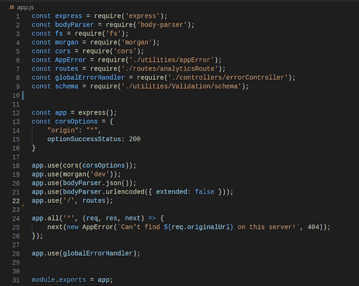

app.js file

在`package.json`文件的`scripts`部分下，添加以下代码片段:

```
"start:dev": "node server.js",
    "debug": "ndb server.js"

```

您的`package.json`文件应该看起来像下面的截图:

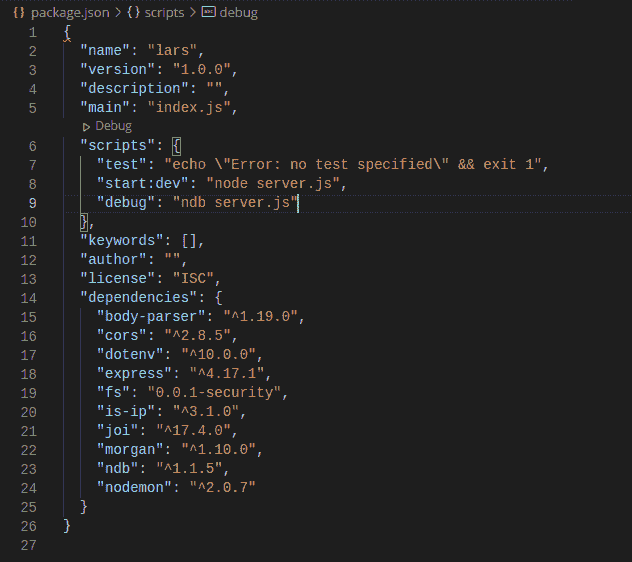

package.json file

用以下代码更新您的`analyticsRoute.js`文件:

```
const express = require('express');
const app = require('../app');
const router = express.Router();
const validateIP = require('../utilities/Validation/validateIP');
const storeController = require('../controllers/storeController');
const fetchController = require('../controllers/fetchController');
router.route('/analytics').post(storeController.postAnalytics).get(validateIP.validateIP, fetchController.getAnalytics);
module.exports = router;

```

现在，我们已经完成了位置分析 API 的构建！现在，让我们测试我们的代码，以确保它的工作。

## 测试 API

我们将使用 [Postman](https://www.postman.com/) 来测试我们的 API。让我们启动 API 以确保它在我们的终端中运行:

```
node server.js 
```

您将在终端中看到以下输出:

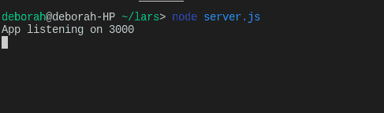

Terminal

我们的 API 的最终输出，托管在 [Heroku](https://www.heroku.com/) 上，应该看起来像下面的输出:

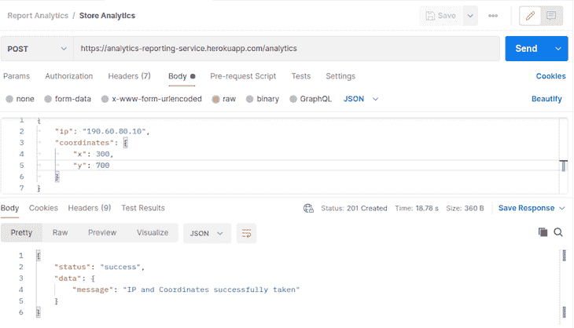

您可以在托管文档上自己测试这个 API。

## 结论

位置分析对企业来说是一个很好的工具。位置信息可以让公司更好地服务于潜在客户和当前客户。

在本教程中，我们学习了如何构建一个以 IP 地址和坐标形式获取位置信息并计算距离的工具。我们在 Node.js 中设置了文件结构，构建了处理`GET`和`POST`请求的路由，添加了错误处理，最后测试了我们的应用程序。

您可以使用在本教程中学到的信息来设置您自己的位置报告 API，您可以根据自己的业务需求对其进行自定义。

## 200 只显示器出现故障，生产中网络请求缓慢

部署基于节点的 web 应用程序或网站是容易的部分。确保您的节点实例继续为您的应用程序提供资源是事情变得更加困难的地方。如果您对确保对后端或第三方服务的请求成功感兴趣，

[try LogRocket](https://lp.logrocket.com/blg/node-signup)

.

[](https://lp.logrocket.com/blg/node-signup)[https://logrocket.com/signup/](https://lp.logrocket.com/blg/node-signup)

LogRocket 就像是网络和移动应用程序的 DVR，记录下用户与你的应用程序交互时发生的一切。您可以汇总并报告有问题的网络请求，以快速了解根本原因，而不是猜测问题发生的原因。

LogRocket 检测您的应用程序以记录基线性能计时，如页面加载时间、到达第一个字节的时间、慢速网络请求，还记录 Redux、NgRx 和 Vuex 操作/状态。

[Start monitoring for free](https://lp.logrocket.com/blg/node-signup)

.