# 用 Vue 和电子日志创建一个 Markdown 预览器

> 原文：<https://blog.logrocket.com/build-a-markdown-previewer-with-vue-and-electron/>

开发人员必须适应的最新趋势是为多个操作系统编写一个代码库。

Electron 是一个 JavaScript 框架，使您能够使用简单的 JavaScript 和 HTML 创建桌面应用程序，并将网站转换为可执行的应用程序，这些应用程序可以充分利用 Windows、Mac 或 Linux 操作系统的所有功能。

Vue 是一个为构建交互式和渐进式 web 应用程序而设计的库。它为数据反应组件提供了一个简单灵活的 API。

在本教程中，我们将介绍如何使用 Vue 和 electronic 构建一个 markdown 预览应用程序。

## 先决条件

要跟随本教程，您需要以下内容。

*   熟悉 HTML、CSS 和 Javascript (ES6+)
*   VS 代码或安装在开发机器上的任何代码编辑器
*   Vue 的基础知识

## 我们将建造什么

我们将构建一个预览降价代码的桌面应用程序。基本上，我们将有一个包含两列的网格:一列用于文本编辑器，另一列用于预览。

最终的结果看起来会像这样:

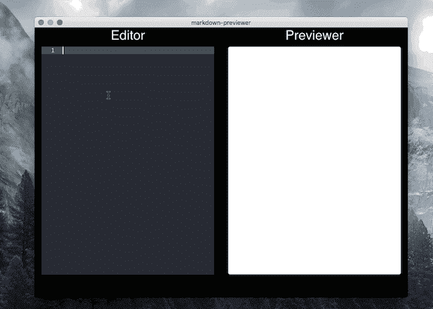

## 设置 Vue

使用 Vue CLI 创建新的 Vuejs 应用程序。如果您的开发计算机上没有安装 Vue CLI，您可以使用以下命令安装它:

```
npm install -g @vue/cli

```

`-g`标志会将它全局安装到你的机器上。

接下来，使用 CLI 创建新的 Vue 应用程序。使用`vue create`命令，后跟项目名称。

我们的应用程序的名称是`markdown-previewer`，因此我们可以通过运行以下命令来创建它:

```
vue create markdown-previewer

```

运行`vue create markdown-previewer`将创建一个新的 Vue 应用程序。但是首先，您将被提示一些问题来设置应用程序。

### 第一步

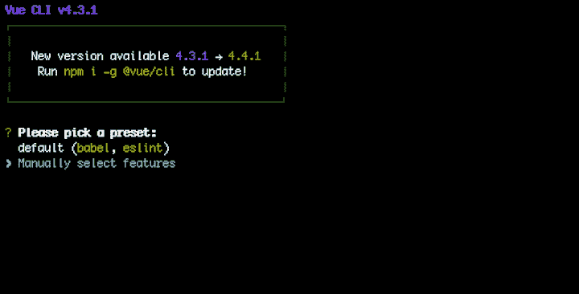

选择`Manually select features`并点击回车。这将使您能够明确地选择要在新项目中包含哪些库。

### 第二步

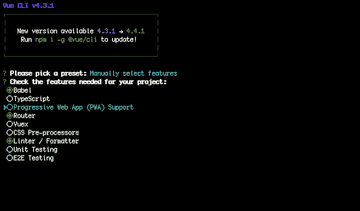

要选择和控制功能列表上的项目，您的鼠标在这里不起作用，所以当您想要选择/取消选择功能时，请使用箭头上下移动，然后按空格键。选择`Router`、`Babel`和`Linter`。

### 第三步

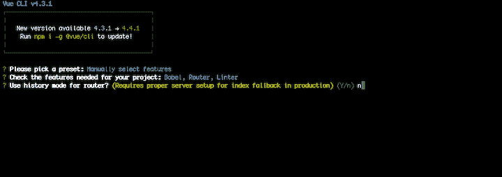

我们不会使用历史模式；相反，我们将使用散列模式。

### 第四步

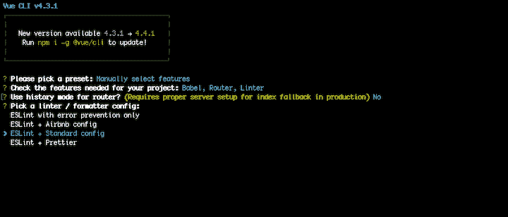

选择`ESLint + standard config`。这基本上是我们 linter 的配置。ESLint 帮助您在编写代码时维护一种模式。

### 第五步

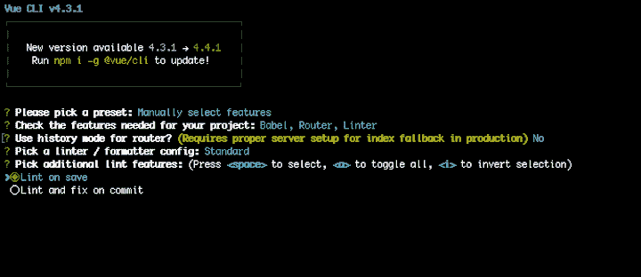

点击`Lint on save`。这将在您保存代码时运行 lint。

### 第六步

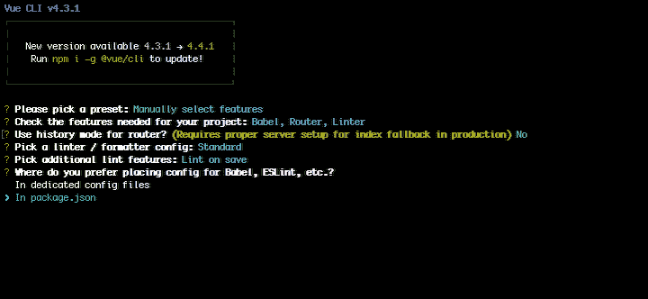

选择`package.json`。这是我们存储所有项目依赖项的地方。

### 第七步

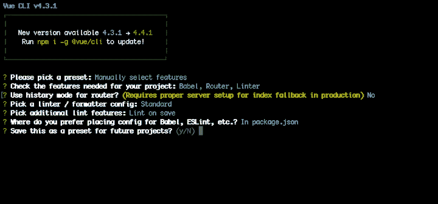

键入`Y`或`N`，这取决于您是否要将其保存为预设。在创建新的 Vue 应用程序时，这可以节省您完成所有这些步骤的时间。

单击 enter 开始搭建新的 Vue 应用程序。

创建应用程序后，您应该会在终端上看到以下内容:


要运行应用程序，进入项目目录，然后运行`npm run serve`。

```
cd markdown-previewer
code . && npm run serve

```

`code .`命令将在 VS 代码中打开项目，但是欢迎您使用您选择的任何代码编辑器。

编译完成后，app 会在端口`[http://localhost:8080/](http://localhost:8080/)`上运行应用的终端上输出。

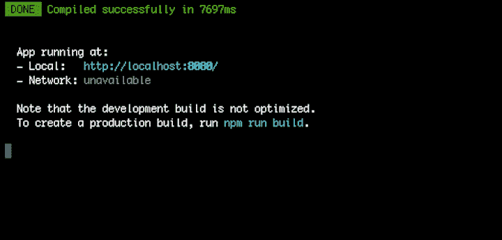

某些本地机器上的端口号可能不同。例如，如果您的应用程序已经在端口 8080 上运行，Vue 将使用最近的端口为您的应用程序提供服务。

如果您在浏览器上访问`[http://localhost:8080/](http://localhost:8080/)`，您应该会看到以下内容。

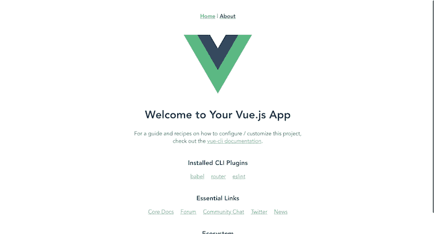

既然我们已经启动并运行了 Vue 应用程序，是时候添加`electron-builder`包了。

## 添加`electron-builder`

`electron-builder`包帮助您打包并构建一个现成的支持自动更新的面向 macOS、Windows 和 Linux 的电子应用程序。它解决了为桌面构建的困难部分。

要将这个包添加到您的应用程序中，请使用`Vue add`命令。Vue CLI 的这一超酷功能可在应用程序中自动配置软件包。

要安装该软件包，请运行以下命令。

```
vue add electron-builder

```

接下来，系统会提示您选择您喜欢的版本。选择最新的版本(撰写本文时是 9.0.0 ),然后按 enter 键继续。

运行该命令后，会在`src`目录中创建一个`background.js`文件。这就是电子出现的地方。主进程为应用程序创建桌面窗口。

安装完`electron-builder`包后，您会在`package.json`文件中发现一些新的脚本:

```
"electron:build": "vue-cli-service electron:build",
"electron:serve": "vue-cli-service electron:serve",
"postinstall": "electron-builder install-app-deps",
"postuninstall": "electron-builder install-app-deps"

```

使用`electron:serve`命令运行应用程序。

```
npm run electron:serve

```

这将打开您桌面上的电子应用程序。

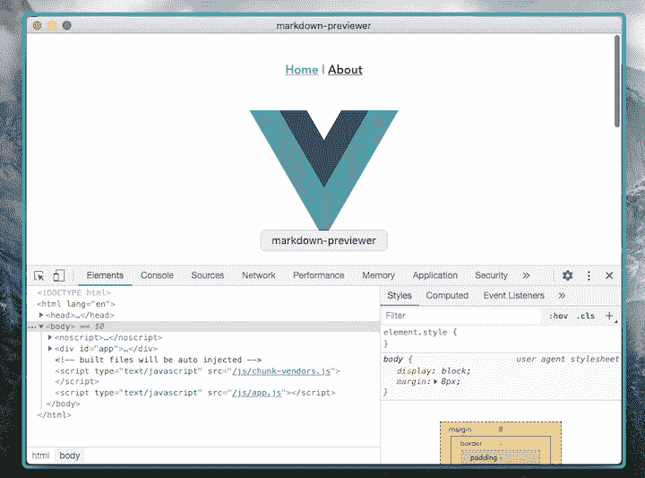

## 安装引导程序

下一步是安装引导程序。这将帮助您更快地设置用户界面。

使用`vue add`命令安装引导程序。记住，`vue add`命令将处理`main.js`文件中的包注册。要安装它，请运行以下命令。

```
vue add bootstrap-vue bootstrap

```

您将被询问是否要使用`babel`。键入`y`并按回车键继续。

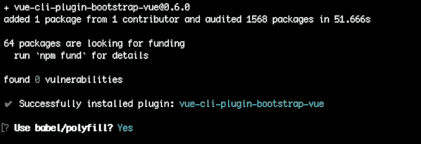

现在我们可以设置我们的用户界面(UI)。

## 设置用户界面

在我们设置用户界面之前，让我们稍微整理一下。

首先，用以下代码替换`compoments/HelloWorld`中的代码。

```
<template>
  <section>
    <div class="container-fluid">
      <div class="row text-light">
        <div class="col-md-6">
          <h3>Editor</h3>
        </div>
        <div class="col-md-6">
            <h3>Previewer</h3>
        </div>
      </div>
    </div>
  </section>
</template>
<script>
export default {
  name: "HelloWorld"
};
</script>

```

这是 Bootstrap 中的一个基本网格系统。由于`eslint-loader`，您应该会遇到一个错误。要停用它，创建一个`vue.config.js`文件并添加以下内容。

```
module.exports = {
  lintOnSave: false
}

```

要使这些更改生效，您需要重新启动服务器。

现在让我们设置我们的代码编辑器。为此，我们将使用`Ace`包。

要安装此软件包，请打开您的终端并键入以下内容。

```
npm install --save-dev vue2-ace-editor

```

接下来，在`HelloWorld.vue`组件中定义`ace`包。

```
components: {
    editor: require("vue2-ace-editor")
  }

```

您还必须为编辑器定义一些状态。例如，您需要定义内容状态，这是存储所有降价代码的地方。此外，您应该使用`state`属性定义编辑器的高度。

```
  data() {
    return {
      content: "",
      height: window.innerHeight - 100
    };
  },

```

现在创建一个方法，引入编辑器的所有实例，比如语言类型、主题和模式。

```
 methods: {
    editorInit() {
       editorInit() {
      require("brace/ext/language_tools");
      require("brace/mode/markdown");
      require("brace/theme/dracula");
    }
    }
  }

```

现在，您可以在模板部分注册组件了。

```
 <editor
            v-model="content"
            ref="”aceeditor”"
            @init="editorInit"
            lang="”markdown”"
            theme="dracula"
            :height="height"
          ></editor>

```

输出应该如下所示:


我们的用户界面需要更多的清理。让我们删除 Vue 徽标，并为预览添加一个部分。

要删除 Vue 徽标，请转到`views/Home.vue`文件，并用以下代码替换代码。

```
<template>
  <div>
    <HelloWorld />
  </div>
</template>
<script>
// @ is an alias to /src
import HelloWorld from "@/components/HelloWorld.vue";
export default {
  name: "Home",
  components: {
    HelloWorld
  }
};
</script>

```

我们还需要删除应用程序顶部的导航链接，并更改背景颜色。打开根`App.vue`组件，用下面的代码替换。

```
<template>
  <div id="app">
    <router-view />
  </div>
</template>
<style>
body {
  background: #000000;
}
#app {
  font-family: helvetica;
  -webkit-font-smoothing: antialiased;
  -moz-osx-font-smoothing: grayscale;
  text-align: center;
  color: #2c3e50;
  height: 100%;
}
</style>

```

更改的结果应该如下所示:

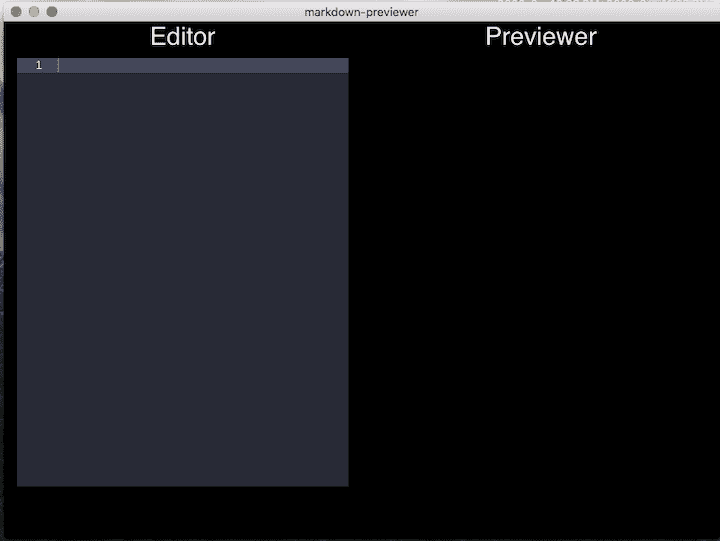

我们现在可以添加我们的预览部分。我们将使用一张卡来预览降价。

将一张简单的卡片添加到您的`components/HelloWorld.vue`文件的模板中。

```
<div class="col-md-6">
  <h3>Previewer</h3>
  <div class="card text-left p-2" :style="styleObject">{{content}}</div>
</div>

```

然后，定义一个状态来保存数据的一些样式。

```
 styleObject: {
        height: window.innerHeight - 100 + "px",
        color: "black",
        overflowY: "auto"
      },

```

在这里，我们使用类`card`向 div 添加一些动态样式，以便高度总是与代码编辑器的高度相匹配。

您在代码编辑器上键入的任何内容都将显示在预览卡上。

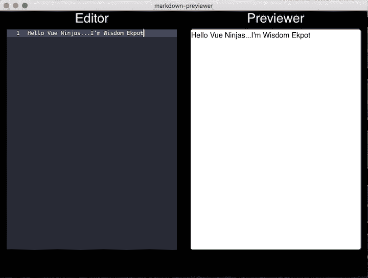

## 实现降价预览器

您可以使用`v-html`指令将代码库转换成 HTML 预览器。

```
<div class="card text-left p-2" :style="styleObject" v-html="content"></div>

```

这将把编辑器中的代码转换成 HTML。

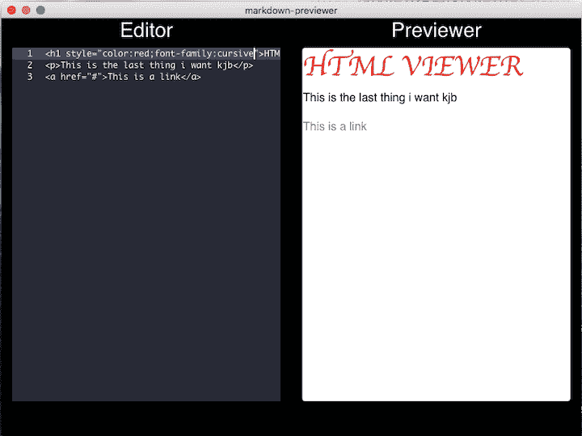

我们将用两种方式演示如何实现 markdown 预览器:简单的方式和复杂的方式。

复杂的方法需要编写自己的定制降价指令。简单的方法就是从你的 markdown 代码中安装一个包。

先说复杂的方式。

### 复杂的方式

我们将使用正则表达式为 markdown 设置我们自己的自定义 Vue 指令。这是一个繁琐的过程。

首先在`src`控制器中创建一个`directive`目录，然后创建一个`decode.js`文件。这是你写所有降价配置的地方。

接下来，在`main.js`文件中注册降价。

```
import decode from '@/directives/decode'
Vue.directive("decode", decode)

```

为你的降价设置代码代码。一个定制的 Vue 指令被包装在一个`bind()`方法中，一个元素被作为参数传递。

```
export default {
  bind: el => {
    console.log(el.innerHTML)
  }
}

```

现在可以在模板上使用`v-decode`指令了。

```
          <div v-markdown :key="content" class="card text-left p-2" :style="styleObject">{{content}}</div>

```

将内容作为密钥传递。任何时候在编辑器上有一个`keyup`事件，该指令将在您的控制台上记录内容。

下一步是开始为降价编写一些正则表达式。

创建一个定制的`rules`数组来保存所有的正则表达式。从一个简单的标题开始。

```
const rules = [
  [/^(?:######)\s*(.+?)[ \t]*$/gm, '<h6>$1</h6>'],
]

```

这个简单的规则将把`######`转换成一个 HTML 元素。

让我们来分析一下这里发生了什么:

*   `^`声明行首的位置
*   `(?:######)`匹配字符`######`
*   `\s*`匹配空白字符
*   `(.+?)`匹配除行结束符之外的所有字符。一个例子是行结束符，它在输入字符序列中标记一行的结束
*   `[ \t]*`是一个在`zero`和`unlimited`之间匹配的限定符，它匹配一个空格或制表符
*   `g`返回所有匹配项
*   `m`使`^`和`$`匹配每一行的开始/结束

要了解更多关于正则表达式的知识，请前往[正则表达式 101](https://regex101.com/) 。

现在我们的元素有了一个正则表达式，我们可以通过修改表达式对其余的 header 元素做同样的事情。

```
const rules = [
  [/^(?:######)\s*(.+?)[ \t]*$/gm, '<h6>$1</h6>'],
  [/^(?:#####)\s*(.+?)[ \t]*$/gm, '<h5>$1</h5>'],
  [/^(?:####)\s*(.+?)[ \t]*$/gm, '<h4>$1</h4>'],
  [/^(?:###)\s*(.+?)[ \t]*$/gm, '<h3>$1</h3>'],
  [/^(?:##)\s*(.+?)[ \t]*$/gm, '<h2>$1</h2>'],
  [/^(?:#)\s*(.+?)[ \t]*$/gm, '<h1>$1</h1>']
]

```

这里我们为所有的 header 元素定义了一个正则表达式。要使用它们，我们必须遍历并使用匹配表达式的规则替换我们的自定义输入。

```
 bind(el) {
    let content = el.textContent
    rules.forEach(([rule, template]) => {
      content = content.replace(rule, template);
      console.log(content)
    })
    el.innerHTML = content
  }
}

```

有了这个定义，我们就可以在编辑器中使用 header 元素了。

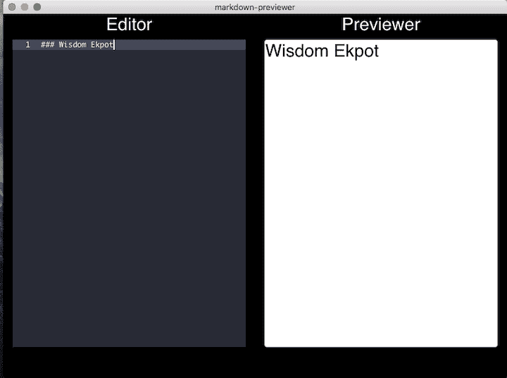

让我们定义一些其他的简单规则。

#### 目录

```
[/^(?:-)\s*(.+?)[ \t]*$/gm, '<ul><li>$1</li></ul>']
```

#### 阻止引用

```
[/^(?:>)\s*(.+?)[ \t]*$/gm, ' <blockquote>$1</blockquote>']
```

为我们的降价写所有的表达式可能是令人困惑和耗时的。但是理解所有软件包下发生的事情总是好的。这让我们想到了实现 markdown 预览器的简单方法。

### 简单的方法

更简单的方法是安装一个软件包来帮助你处理数据。

我们将使用`vue-directive-markdown`。要安装它，打开您的终端运行以下。

```
npm install vue-directive-markdown --save-dev 

```

接下来，在您的`main.js`文件中注册并配置它，以便您可以在您的应用程序中全局访问它。

```
import VueDirectiveMarkdown from 'vue-directive-markdown'
Vue.directive('decode', VueDirectiveMarkdown)

```

您可以通过解析模板中的`v-decode`来访问它。

```
          <div v-decode :key="content" class="card text-left p-2" :style="styleObject">{{content}}</div>

```

最后，将内容作为一个键传递，这样无论何时输入，它都会更新。

## 结论

理解如何编写定制指令将真正提升你的 Vue 技能。为桌面和 web 编写一个代码库的需求是我们都必须适应的。

前往 [GitHub](https://github.com/Wisdom132/Electron-Vue-Markdown-Previewer-) 获取完整的源代码。

## 像用户一样体验您的 Vue 应用

调试 Vue.js 应用程序可能会很困难，尤其是当用户会话期间有几十个(如果不是几百个)突变时。如果您对监视和跟踪生产中所有用户的 Vue 突变感兴趣，

[try LogRocket](https://lp.logrocket.com/blg/vue-signup)

.

[](https://lp.logrocket.com/blg/vue-signup)[https://logrocket.com/signup/](https://lp.logrocket.com/blg/vue-signup)

LogRocket 就像是网络和移动应用程序的 DVR，记录你的 Vue 应用程序中发生的一切，包括网络请求、JavaScript 错误、性能问题等等。您可以汇总并报告问题发生时应用程序的状态，而不是猜测问题发生的原因。

LogRocket Vuex 插件将 Vuex 突变记录到 LogRocket 控制台，为您提供导致错误的环境，以及出现问题时应用程序的状态。

现代化您调试 Vue 应用的方式- [开始免费监控](https://lp.logrocket.com/blg/vue-signup)。