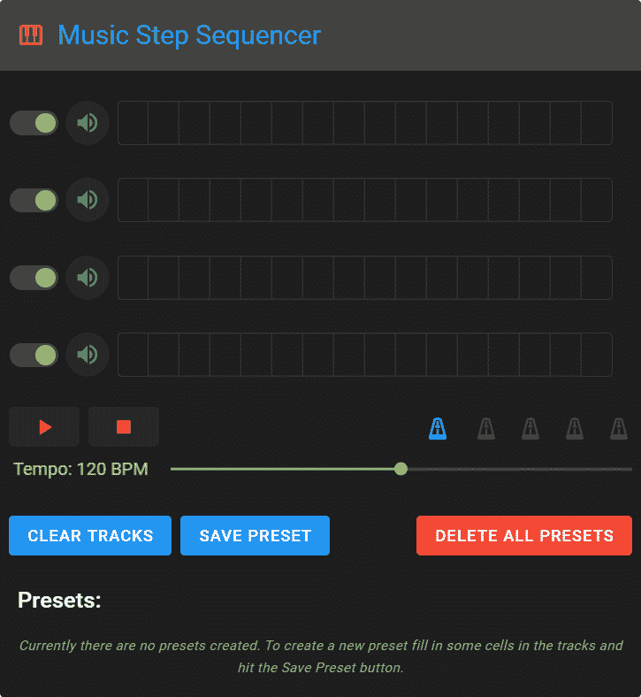
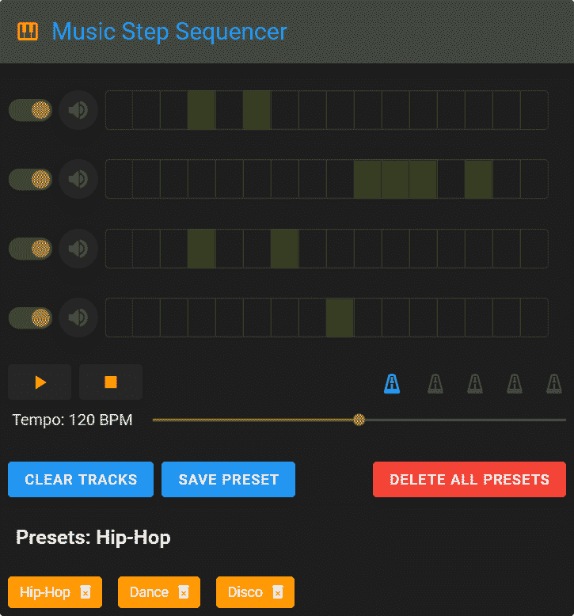
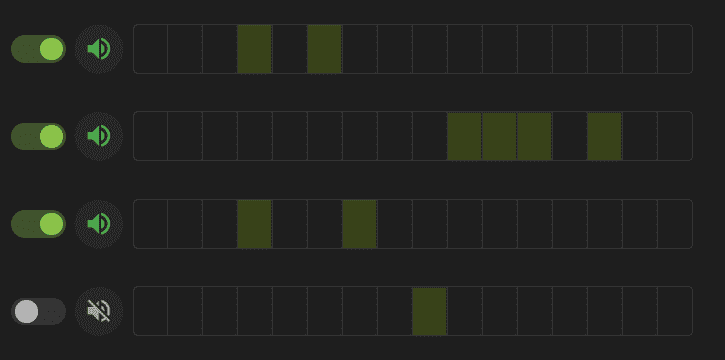
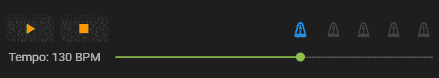
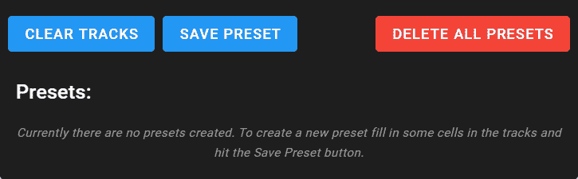
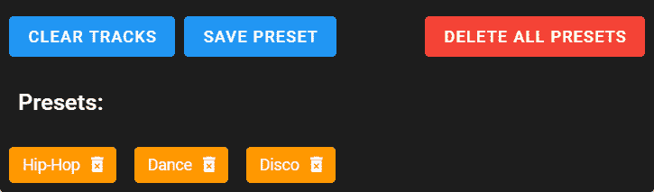
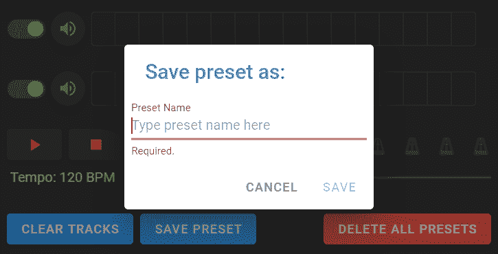
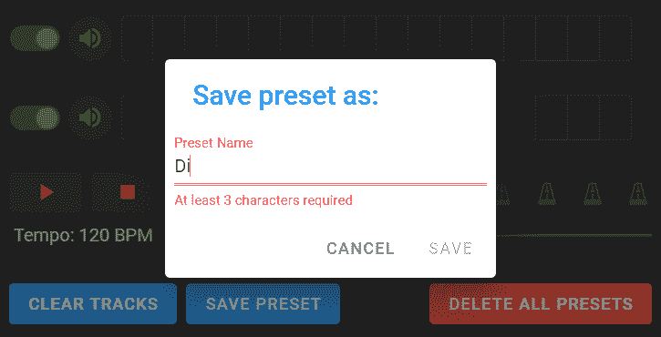

# 用 Vue 和 Vuetify 构建一个音乐步音序器

> 原文：<https://blog.logrocket.com/build-a-music-step-sequencer-with-vue-and-vuetify/>

[Vue](https://vuejs.org/) 的一个主要优势就是多功能性。尽管该库仅专注于视图层，但我们可以轻松地将其与各种现有的 JavaScript 库和/或基于 Vue 的项目集成，以构建几乎任何我们想要的东西——从简单的待办事项应用程序到复杂的大规模项目。

今天，我们将看到如何使用 Vue 与 [Vuetify](https://vuetifyjs.com/en/) 和 [howler.js](https://howlerjs.com/) 一起创建一个简单但功能齐全的音乐步音序器。

Vuetify 提供了丰富的可定制、预制的 Vue 组件集合，我们将使用这些组件来构建应用程序的 UI。为了处理音频播放，我们将使用 howler.js，它包装了 Web Audio API，使它的使用更容易。

## 入门指南

在本教程中，正如其标题所示，我们将建立一个简单的音乐步音序器。我们将能够创建简单的节拍，并将其保存为预设以供将来使用。在下图中，你可以看到音乐音序器第一次运行时的样子，并且还没有创建预设。



正如你所看到的，将有四个轨道，每一个代表一个单一的声音(踢，小军鼓，踩镲，摇)。节拍是通过选择我们希望可播放的步骤(轨道行中的单元格)来创建的。每个轨道可以单独静音，以便更好地控制。为了改变播放速度，我们将使用速度滑块。我们还有一个节拍器，可以测量每一拍。最后，我们能够将轨道的当前状态和速度值保存为可重复使用的预置。如果我们对当前的结果不满意，我们可以通过点击**清除轨迹**按钮重新开始，这将取消选择所有选定的步骤。

下图显示了创建了一些预置的音乐音序器:



保存的预设被表示为标签列表。要加载预设，我们单击相应的标签，要删除它，我们单击垃圾桶图标。我们也可以通过点击红色按钮一次删除所有预设。预设通过 Web 存储 API 存储在用户浏览器中。

你可以在 [GitHub repo](https://github.com/codeknack/music-step-sequencer) 找到该项目的源文件，并在[演示页面](https://codeknack.github.io/music-step-sequencer/)测试该应用。

> 注意，在我们开始之前，您需要确保您的计算机上安装了 Node.js、Vue 和 Vue CLI。为此，[为您的系统下载 Node.js](https://nodejs.org/en/download/) 安装程序并运行它。对于 Vue CLI，请遵循其[安装页面](https://cli.vuejs.org/guide/installation.html)上的说明。

首先，让我们创建一个新的 Vue 项目:

```
vue create music-step-sequencer
```

当系统提示选择一个预设时，只需保留默认的(已经选择的)并点击*输入*。这将安装一个有 Babel 和 ESLint 支持的基本项目。

下一步是向项目中添加 Vuetify:

```
cd music-step-sequencer
vue add vuetify
```

Vuetify 还会要求您选择一个预设。再次选择默认预设，点击*进入*。

最后，我们需要添加 howler.js:

```
npm install howler
```

在我们安装了所有必要的库之后，我们需要清理一下默认的 Vue 项目。首先，删除 src/components 文件夹中的`HelloWorld.vue`。然后，打开`App.vue`并删除`<v-app>`元素之间的所有内容。另外，删除导入声明和`HelloWorld.vue`组件的注册。现在我们准备开始构建我们的新应用程序。

## 添加基础应用程序模板

我们将从顶部到底部构建应用程序，从标题栏开始，如下所示:


要创建它，让我们在`<v-app>`元素之间添加以下标记:

```
<v-card dark width="580" max-width="580" class="mx-auto">
  <v-toolbar color="grey darken-3">
    <v-icon class="orange--text text--lighten-1 mr-3">mdi-piano</v-icon>
    <v-toolbar-title class="blue--text headline">Music Step Sequencer</v-toolbar-title>
  </v-toolbar>
  <!-- Add <SoundTracks></SoundTracks> component here-->
  <!-- Add <SoundControls></SoundControls> component here-->
  <!-- Add <SoundPresets></SoundPresets> component here-->
</v-card>
```

我们将应用程序包装在`v-card`组件中，并使用`v-toolbar`创建标题栏。

现在，是时候测试我们已经完成的工作了。使用以下命令运行项目:

```
npm run serve
```

这将启动服务器，并在`[http://localhost:8080/](http://localhost:8080/)`为项目提供服务。在浏览器中打开它之后，您应该会看到一个带有我们刚刚创建的标题栏的空白页面。如果一切顺利，让我们继续前进。

## 创建基本音频功能

在我们开始创建应用程序的组件之前，我们需要设置音序器工作所需的基本音频功能。

我们需要做的第一件事是包含四个声音样本文件—`kick.mp3`、`snare.mp3`、`hihat.mp3`和`shaker.mp3`。所以，让我们这样做:

```
import { Howl } from "howler";
const kick = new Howl({src: ["https://raw.githubusercontent.com/codeknack/music-step-sequencer/master/src/assets/sounds/kick.mp3",],});
const snare = new Howl({src: ["https://raw.githubusercontent.com/codeknack/music-step-sequencer/master/src/assets/sounds/snare.mp3",],});
const hihat = new Howl({src: ["https://raw.githubusercontent.com/codeknack/music-step-sequencer/master/src/assets/sounds/hihat.mp3",],});
const shaker = new Howl({src: ["https://raw.githubusercontent.com/codeknack/music-step-sequencer/master/src/assets/sounds/shaker.mp3",],});
```

这里，我们从 howler.js 导入`Howl`对象，然后用它来设置声音。`new Howl()`函数创建一个声音对象，我们可以播放、静音等。

> 注意，我在这里使用外部声源的原因是现代浏览器在加载和播放音频文件方面有一些限制。所以，本地 URL 不行。解决方案是使用真实服务器的绝对 URL，并允许在浏览器中自动播放音频。对于 Chrome，点击地址栏中`[http://localhost:8080/](http://localhost:8080/)`前的图标，选择*站点设置*。然后，导航到*声音*并将选择从*自动(默认)*更改为*允许*。

不幸的是，对于每个浏览器来说，这个设置的位置和描述它的实际用词是不同的。所以，如果你没有使用 Chrome，你需要使用你最喜欢的搜索引擎来找到你使用的浏览器的程序。要使用您自己的音频文件，只需在部署之前将 URL 与指向项目目录中声音的适当链接进行交换。

在我们添加了声音样本之后，我们在它们下面创建了一个新的音频上下文实例`let audioContext = new AudioContext();`。然后，在 Vue 实例对象中，我们定义以下属性:

```
data() {
  return {
    tempo: 120,
    tracks: {
      kick: [],
      snare: [],
      hihat: [],
      shaker: [],
    },
    futureTickTime: audioContext.currentTime,
    counter: 0,
    timerID: null,
    isPlaying: false,      
  };
},
computed: {
  secondsPerBeat() {
    return 60 / this.tempo;
  },
  counterTimeValue() {
    return this.secondsPerBeat / 4;
  },
},
```

`tempo`属性定义音频播放的速度。`tracks`对象包含数组，用于定义每个轨迹的选定步骤。

`futureTickTime`、`counter`和`timerID`将用于循环播放音轨中的步骤。

`secondsPerBeat`和`counterTimeValue`计算属性根据`tempo`的值计算单步的时间。例如，在节奏 120 BPM(每分钟节拍数)`secondsPerBeat`将等于`0.5`(每节拍半秒)。当我们在`counterTimeValue`把这个值除以 4，结果就是`0.125`(一步的时长)。因此，当我们改变速度时，该步的持续时间会相应地更新。

现在让我们创建安排、播放和停止声音的方法:

```
 methods: {
  scheduleSound(trackArray, sound, counter) {
    for (var i = 0; i < trackArray.length; i += 1) {
      if (counter === trackArray[i]) {
        sound.play();
      }
    }
  },
}
```

第一种方法有三个参数:

1.  一个带有数字的数组，代表我们想要玩的步骤
2.  我们想要播放的实际声音
3.  一个计数器变量，用于检查数组中是否包含与当前步骤编号匹配的项

方法循环访问音轨，当计数器值和数组项匹配时，播放与音轨关联的声音。

下一种方法是将回放移动到音轨的下一步:

```
playTick() {
  this.counter += 1;
  this.futureTickTime += this.counterTimeValue;
  if (this.counter > 15) {
    this.counter = 0;
  }
},
```

该方法将`counter`递增 1，并通过增加一步的时间来移动`futureTickTime`。如果`counter`变得大于 15，它就重新开始，以这种方式，它循环通过轨道的 16 个步骤。

下一个方法安排声音，并通过以下步骤循环播放:

```
scheduler() {
  if (this.futureTickTime < audioContext.currentTime + 0.1) {
    this.scheduleSound(this.tracks.kick, kick, this.counter);
    this.scheduleSound(this.tracks.snare, snare, this.counter);
    this.scheduleSound(this.tracks.hihat, hihat, this.counter);
    this.scheduleSound(this.tracks.shaker, shaker, this.counter);
    this.playTick();
  }
  this.timerID = window.setTimeout(this.scheduler, 0);
},
```

该方法检查`futureTickTime`是否在`audioContext.currentTime`的十分之一秒之内，如果是，则`scheduleSound()`为每个声音运行。`playTick()`运行一次，将播放向前推进一步。最后，递归运行`scheduler()`的`setTimeout()`被分配给`timerID`。

* * *

### 更多来自 LogRocket 的精彩文章:

* * *

正如我们前面看到的，`playTick()`用一步的时间增加了`futureTickTime`。结果值保持不变，直到`audioContext.currentTime`赶上它。然后`futureTickTime`再次增加一步(在`playTick()`的下一次运行中)。只要`scheduler()`被允许运行，所有这些“时间竞赛”就会持续下去。

接下来的两种方法用于播放和停止播放:

```
play() {
  if (this.isPlaying === false) {
    this.counter = 0;
    this.futureTickTime = audioContext.currentTime;
    this.scheduler();
    this.isPlaying = true;
  }
},
```

如果音序器没有播放，该方法启动`scheduler()`并从`data`对象设置相应的属性:

```
stop() {
  if (this.isPlaying === true) {
    window.clearTimeout(this.timerID);
    this.isPlaying = false;
  }
},
```

如果音序器正在播放，该方法通过清除先前在`timerID`中设置的`setTimeout()`来停止播放。

## 创建应用程序组件

现在，基本音频功能已经设置完毕。我们准备开始创建实际的应用程序组件。

### 创建音轨组件

我们将从负责渲染轨迹的组件开始。下面是它的样子:



在 components 文件夹中，用以下内容创建一个新的`SoundTracks.vue`组件:

```
<template>

</template>
<script>

export default {

}
</script>
```

> 注意，这是每个新组件的起始模板。

接下来，让我们添加我们需要的属性和方法:

```
props: ["tracks"],
data() {
  return {
    toggles: {
      kick: true,
      snare: true,
      hihat: true,
      shaker: true,
    },
  };
},
methods: {
  playSound(sound) {
    this.$emit('playsound', sound);
  },
  muteSound(sound, toggle) {
    this.$emit('mutesound', {sound, toggle});
  }
}
```

我们传递一个道具`tracks`，我们将使用它来渲染轨迹。`playSound()`方法发出一个`playsound`定制事件和实际的声音——踢腿声、响弦声等。`muteSound()`方法类似，但这里第二个参数是一个对象，它包含我们想要静音/取消静音的声音和一个决定声音当前状态的切换变量。因为我们有四个独立的声音，我们需要四个不同的切换变量。否则，声音将一起静音/取消静音。这就是为什么我们为每个轨迹创建一个单独属性的`toggles`对象。

现在，让我们创建组件的模板。在`<template>`元素中添加以下标记:

```
<v-container>
  <template v-for="(track, name) in tracks" >
    <v-row :key="name" align="center" dense>
      <v-col>
        <v-switch inset dense color="light-green"
          v-model="toggles[name]"
          @change="muteSound(name, toggles[name])"
        ></v-switch>
      </v-col>
      <v-col>
        <v-btn fab raised small @click="playSound(name)">
          <v-icon class="green--text" v-show="toggles[name]">mdi-volume-high</v-icon>
          <v-icon class="grey--text" v-show="!toggles[name]">mdi-volume-off</v-icon>
        </v-btn>
      </v-col>
      <v-col>         
        <v-btn-toggle  v-model="tracks[name]" multiple>
          <v-btn color="lime accent-4" height="40" small icon
            v-for="n in 16" :key="n"
          ></v-btn>
        </v-btn-toggle>
      </v-col>
    </v-row>
  </template>
</v-container>
```

这里，我们使用`v-for`指令迭代`tracks`并创建三列。

1.  第一列呈现一个切换按钮(带有`v-switch`组件)，该按钮使相应音轨的声音静音/取消静音
2.  第二列呈现一个按钮，播放与音轨相关的声音
3.  第三列呈现实际轨迹。我们使用`v-button-toggle`组件来创建一组 16 个切换按钮，代表轨迹的步骤

现在，让我们切换回`App.vue`并添加以下方法:

```
playSound(sound) {
  eval(sound).play()
},
muteSound(obj) {
  eval(obj['sound']).mute(!obj['toggle'])
},
```

`playSound()`方法播放从子组件接收的声音。

根据开关的值，`muteSound()`方法使从子组件接收的声音静音/取消静音。

接下来要做的是将组件包含在模板中:

```
<SoundTracks
  :tracks="tracks"
  @playsound="playSound"
  @mutesound="muteSound"
></SoundTracks>
```

我们将`tracks`道具绑定到`data`对象中相应的道具。我们还向`playsound`和`mutesound`事件添加监听器，它们将运行`playSound()`和`muteSound()`方法。

最后，我们导入组件并注册它:

```
import SoundTracks from "./components/SoundTracks.vue";
...
components: {
  SoundTracks,
},
```

现在，第一部分完成了。当我们检查一切是否正常时，我们可以继续下一个。

## 创建 SoundControls 组件

在这个组件中，我们将创建播放和停止音序器、改变速度和运行节拍器的所有控件。下面是它的样子:



在 components 文件夹中，创建新的`SoundControls.vue`组件并添加以下属性和方法:

```
props: ['tempo', 'counter', 'isPlaying'],
data() {
  return {
    localTempo: this.tempo,
    metronome: 0,
  };
},
watch: {
  counter(val) {
    if (this.isPlaying) {
      if (val >= 0 && val <= 3) {
        this.metronome = 1;
      } else if (val > 3 && val <= 7) {
        this.metronome = 2;
      } else if (val > 7 && val <= 11) {
        this.metronome = 3;
      } else if (val > 11 && val <= 15) {
        this.metronome = 4;
      }
    }
  },
  tempo(val) {
    this.localTempo = val;
  }
},
methods: {
  play() {
    this.$emit("play");
  },
  stop() {
    this.$emit("stop");
    this.metronome = 0;
  },
  updateTempo() {
    this.$emit("update:tempo", this.localTempo);
  },
},
```

首先，我们从父节点传递三个道具，`tempo`、`counter`和`isPlaying`。接下来，我们将`tempo`赋给一个新的局部变量(`localTempo`)，因为不建议直接从子变量中变异道具。我们还添加了节拍器功能所需的`metronome`属性。

我们需要为两个变量添加观察器。我们需要监视`counter`，因为我们需要它的当前值来改变/更新`metronome`的值。我们还监视`tempo`，以便在父节点中的`tempo`发生变化时更新`localTempo`。

`play()`和`stop()`方法发出相应的事件。并且后者还重置了`metronome`的值。`updateTempo()`方法为速度和`localTempo`的值发出一个更新事件。

现在，让我们将必要的标记放入组件的模板中:

```
<div>
  <div class="d-flex justify-space-between">
    <div class="ml-2">
      <v-btn @click="play">
        <v-icon class="orange--text">mdi-play</v-icon>
      </v-btn>
      <v-btn @click="stop" class="ml-2">
        <v-icon class="orange--text">mdi-stop</v-icon>
      </v-btn>
    </div>
    <div class="d-flex align-center">
      <v-icon class="mr-3 blue--text">mdi-metronome-tick</v-icon>
      <v-rating
        full-icon="mdi-metronome"
        empty-icon="mdi-metronome-tick"
        color="green" background-color="grey darken-3"
        length="4" readonly
        v-model="metronome"
      ></v-rating>
    </div>
  </div>
  <div>
    <v-slider
      class="ml-3" color="light-green" dense
      max="180" min="60" step="10"
      v-model="localTempo"
      :label="'Tempo: ' + localTempo + ' BPM'"
      @click="updateTempo"
    ></v-slider>
  </div>
</div>
```

首先，我们创建播放和停止按钮。

然后，我们使用`v-rating`组件来模拟一个节拍器。我们将`length`属性设置为`4`，因为我们在音序器中有四个节拍。我们添加了`readonly`属性来禁用用户交互。我们将它与`metronome`的值绑定在一起。

最后，我们添加一个`v-slider`组件来改变`tempo`的值。滑块绑定在`localTempo`上，所以我们可以安全地改变速度而不会有 Vue 警告。

现在，让我们在`App.vue`的模板中添加组件:

```
<SoundControls
  :tempo.sync="tempo"
  :counter="counter"
  :isPlaying="isPlaying"
  @play="play"
  @stop="stop"
></SoundControls>
```

这里，我们将子属性绑定到父属性中相应的属性。我们使用`tempo`的`.sync`修饰符来创建父和子之间的双向数据绑定。我们还为运行之前创建的`play()`和`stop()`方法设置了事件监听器。

最后，我们导入组件并注册它:

```
import SoundTracks from "./components/SoundTracks.vue";
import SoundControls from "./components/SoundControls.vue";
...
components: {
  SoundTracks,
  SoundControls,
},
```

现在，我们可以使用控件来查看是否一切正常，然后继续进行最后的组件。

## 创建 SoundPresets 组件

最后要创建的功能是保存 beats 预设以备后用。该组件应该如下所示:



上图显示了创建和保存预设之前的组件。下图显示了带有已保存预设列表的组件:



在 components 文件夹中，创建一个新的`SoundPresets.vue`组件，并添加以下属性和方法:

```
created() {
  this.userPresets = JSON.parse(localStorage.getItem('userPresets') || '{}');
},
props: ['currentPreset'],
data() {
  return {
    dialog: false,
    presetName: '',
    rules: {
      required: value => !!value || 'Required.',
      counter: value => value.length >= 3 || 'At least 3 characters required',
    },
    userPresets: {},
    selectedPreset: '',
  };
},
```

这里，我们传递了一个`currentPreset`道具，我们需要它来保存新的预置。我们定义了保存预置模式所需的`dialog`和`presetName`道具，我们将在后面创建。`rules`属性将用于验证预设名称的文本字段。第一个规则检查以确保文本的值不为空，第二个规则检查以确保它包含两个以上的字符。在这两种情况下，如果检查返回 false，将出现指定的错误消息。

我们需要一个`userPresets`对象来临时存储预置。我们将使用这个对象来渲染预置。我们需要的最后一个属性是`selectedPreset`，用于显示当前选择的预置。

最后，我们使用`created()`事件挂钩来加载先前保存的预置(如果有的话)。

现在，让我们创建所有必要的方法:

```
methods: {
  clearTracks() {
    this.$emit('cleartracks');
    this.selectedPreset = '';
  },
  loadPreset(preset) {
    this.$emit('loadpreset', preset);
    this.selectedPreset = preset;
  },
  savePreset() {
      this.dialog = false;
      this.userPresets[this.presetName] = {};
      let tracks = Object.assign({}, this.currentPreset.tracks);
      this.userPresets[this.presetName].tempo = this.currentPreset.tempo;
      this.userPresets[this.presetName].tracks = tracks;
      localStorage.setItem('userPresets', JSON.stringify(this.userPresets));
      this.presetName = '';
  },
  cancelDialog() {
    this.dialog = false;
    this.presetName = '';
  },
  deletePreset(preset) {
    this.$delete(this.userPresets, preset);
    localStorage.setItem('userPresets', JSON.stringify(this.userPresets));
    if (preset == this.selectedPreset) {
      this.selectedPreset = '';
    }
  },
  deleteAllPresets() {
    localStorage.clear();
    this.userPresets = {};
  },
  isEmpty(obj) {
    return Object.entries(obj).length === 0;
  }
}
```

下面我们来逐一解释一下以上的方法:

*   `clearTracks()`发出一个`cleartracks`事件，复位`selectedPreset`
*   `loadPreset()`发出一个`loadpreset`事件和当前预置的名称。它还将后者分配给`selectedPreset`
*   `savePreset()`通过将`dialog`道具改为`false`来关闭模态。它为我们想要保存的预置创建一个新的空对象。然后，它定义了一个`tracks`变量，并给它分配了一个 tracks 对象的副本。(这是必需的，因为否则会引用相同的对象，从而导致为每个新预设保存同一个对象。)接下来，我们将速度和轨道属性分配给新的预设对象。然后，它将更新后的`userPresets`对象保存在本地存储器中。最后，重置`presetName`
*   点击`Cancel`按钮时`cancelDialog()`触发。它关闭模态并重置`presetName`
*   `deletePreset()`删除预设并更新存储。如果我们删除当前选择的预置，那么我们在删除时重置`selectedPreset`属性
*   `deleteAllPresets()`删除存储器中所有保存的用户预设并清空`userPresets`对象
*   是一个检查对象是否为空的实用方法

现在让我们开始创建组件的模板:

```
<div>
  <div class="d-flex ma-2">
    <v-btn color="blue" @click="clearTracks">
      Clear Tracks
    </v-btn>
    <v-btn class="ml-2" color="blue" @click.stop="dialog = true">
      Save Preset
    </v-btn>
    <v-spacer></v-spacer>
    <v-btn color="red" @click="deleteAllPresets">
      Delete All Presets
    </v-btn>
  </div>
  ...
</div>
```

在这里，我们创建了用于清除轨道、保存预设和删除所有预设的按钮。在保存预设的点击事件监听器中，我们使用`.stop`修改器来停止事件的传播。

让我们添加模板的下一部分:

```
<v-card>
  <v-card-title>Presets: {{selectedPreset}}</v-card-title>
  <v-slide-y-transition>
  <v-card-text v-show="isEmpty(userPresets)" class="grey--text font-italic text-center text-caption">Currently there are no presets created. To create a new preset fill in some cells in the tracks and hit the Save Preset button.</v-card-text>
  </v-slide-y-transition>
  <v-scroll-y-transition>
    <div v-if="!isEmpty(userPresets)">
      <v-chip
        close close-icon="mdi-delete-forever"
        @click:close="deletePreset(name)"
        class="ma-2" color="orange" label
        v-for="(preset, name) in userPresets" :key="name"
        @click="loadPreset(name)"
      > {{name}}
      </v-chip>
    </div>
  </v-scroll-y-transition>
</v-card>
...
```

在这里，我们创建一个预置列表。在顶部，我们添加了一个标题`Presets:`,后跟当前所选预设的名称，如果有的话。下面，我们设置了一个消息，如果没有预置显示。我们使用`isEmpty()`来检查预设是否存在。如果存在预设，则隐藏消息，并渲染预设。每个预设都被渲染成一个带有删除图标的`v-chip`组件。单击预设会将其加载到轨迹中。点按废纸篓图标会删除预置。

模板的最后一部分是模式对话框的标记:

```
<v-dialog v-model="dialog" max-width="290" light persistent>
  <v-card light rounded>
    <v-card-title class="headline blue--text">Save preset as:</v-card-title>
      <v-text-field
        class="ma-2" label="Preset Name"
        placeholder="Type preset name here"
        v-model="presetName"
        :rules="[rules.required, rules.counter]"
      ></v-text-field>
    <v-card-actions>
      <v-spacer></v-spacer>
      <v-btn color="green lighten-2" text @click="cancelDialog">
        Cancel
      </v-btn>
      <v-btn color="green darken-2" text @click="savePreset" :disabled="!(presetName.length >=3)">
        Save
      </v-btn>
    </v-card-actions>
  </v-card>
</v-dialog>
```

这里，我们使用了`v-text-field`组件，并用之前创建的验证规则绑定它。然后我们添加`Cancel`和`Save`按钮。为防止保存没有指定名称的预置，当文本字段值的长度少于三个字符时，禁用`Save`按钮。

在这里，您可以看到第一个验证规则失败的模式:



而在这里，模态的第二个验证规则是失败的:



现在，让我们切换到`App.vue`并添加代表曲目和速度当前状态的`currentPreset`计算属性:

```
currentPreset() {
  return {
    tempo: this.tempo,
    tracks: this.tracks
  };
}
```

接下来，我们需要添加清除轨道和加载预设的方法:

```
clearTracks() {
  this.tracks =  {
    kick: [],
    snare: [],
    hihat: [],
    shaker: [],
  }
},
loadPreset(preset) {
  let presets = JSON.parse(localStorage.getItem('userPresets'));
  this.tempo = presets[preset].tempo;
  this.tracks = presets[preset].tracks;
},
```

*   清空轨道的数组
*   `loadPreset`创建一个新的`presets`变量，并为其分配从本地存储器获取的预置
*   这里，我们再次使用来自本地存储的数据，而不是`userPresets`对象，因为后者是通过引用传递的。然后，它用所选预置的值更新`tempo`和`tracks`属性

接下来，我们将组件包含在模板中:

```
<SoundPresets
  :currentPreset="currentPreset"
  @cleartracks="clearTracks"
  @loadpreset="loadPreset"
></SoundPresets>
```

最后，我们导入组件并注册它:

```
import SoundTracks from "./components/SoundTracks.vue";
import SoundControls from "./components/SoundControls.vue";
import SoundPresets from "./components/SoundPresets.vue";
...
components: {
  SoundTracks,
  SoundControls,
  SoundPresets
},
```

瞧啊。我们已经成功地完成了我们的项目。

## 结论

恭喜你。你刚刚建立了一个功能齐全的音乐音序器。正如您刚才看到的，Vue 可以轻松地与基于 Vue 的项目和普通 JavaScript 库结合，构建我们想要的任何功能。这让您可以自由轻松地创建各种项目。

## 像用户一样体验您的 Vue 应用

调试 Vue.js 应用程序可能会很困难，尤其是当用户会话期间有几十个(如果不是几百个)突变时。如果您对监视和跟踪生产中所有用户的 Vue 突变感兴趣，

[try LogRocket](https://lp.logrocket.com/blg/vue-signup)

.

[](https://lp.logrocket.com/blg/vue-signup)[https://logrocket.com/signup/](https://lp.logrocket.com/blg/vue-signup)

LogRocket 就像是网络和移动应用程序的 DVR，记录你的 Vue 应用程序中发生的一切，包括网络请求、JavaScript 错误、性能问题等等。您可以汇总并报告问题发生时应用程序的状态，而不是猜测问题发生的原因。

LogRocket Vuex 插件将 Vuex 突变记录到 LogRocket 控制台，为您提供导致错误的环境，以及出现问题时应用程序的状态。

现代化您调试 Vue 应用的方式- [开始免费监控](https://lp.logrocket.com/blg/vue-signup)。