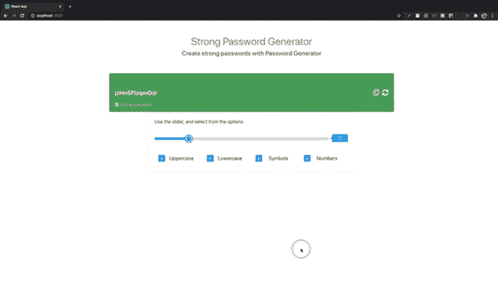
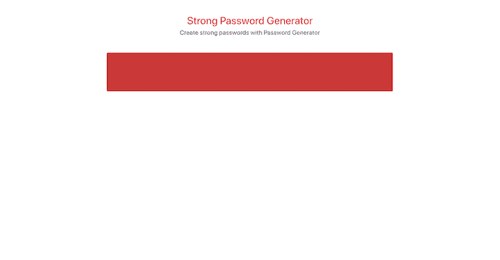
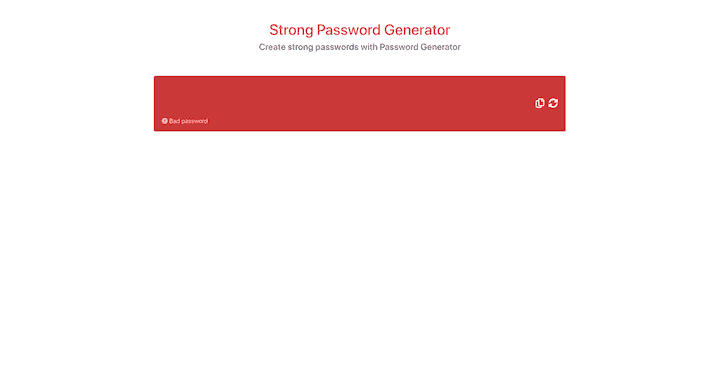
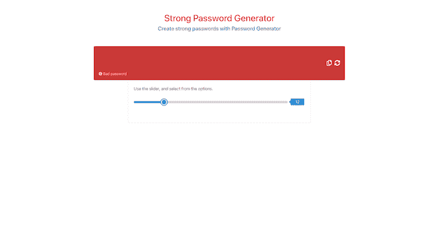
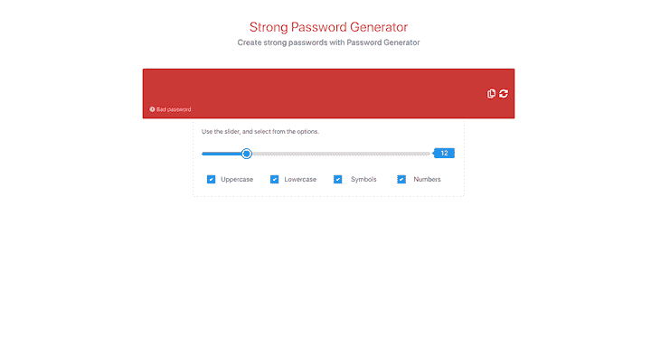
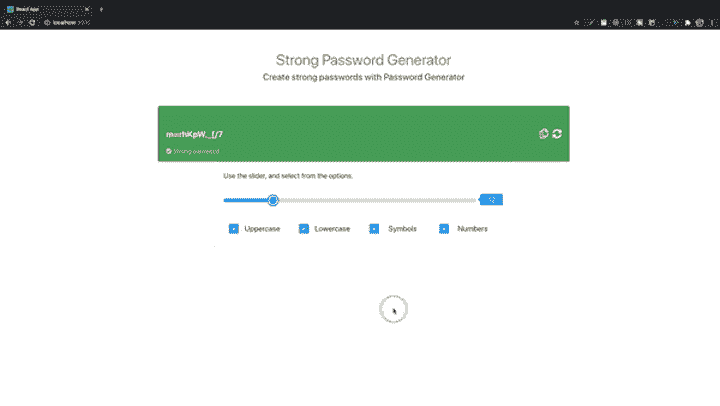
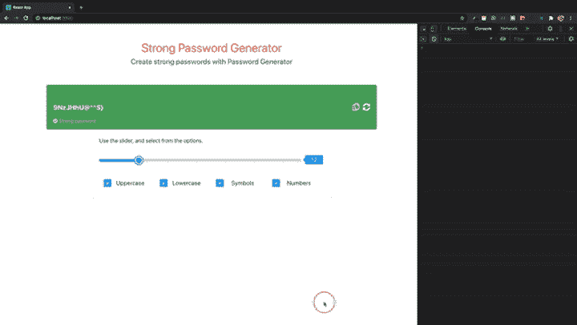
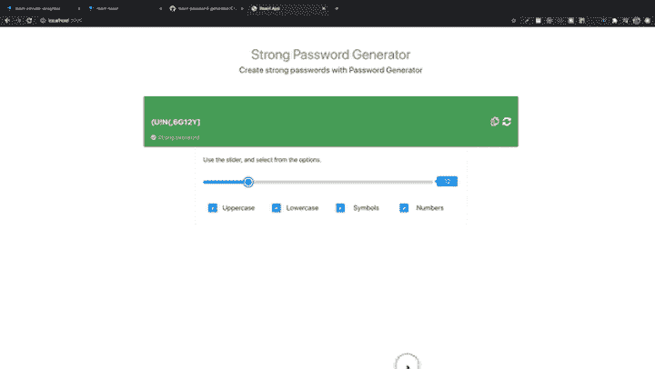
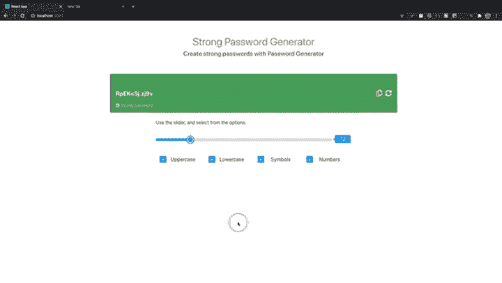

# 在 React 中用可重用组件构建一个密码生成器应用程序

> 原文：<https://blog.logrocket.com/build-a-password-generator-app-in-react-with-reusable-components/>

在本指南中，我们将介绍如何使用 React 创建密码生成器应用程序。该应用程序将使用户能够使用各种字符组合创建强密码，包括大小写字母、符号和数字。它还会有一个指示器来帮助衡量用户选择的密码的强度。

作为教程的一部分，您将学习如何在 React 中创建可重用的组件。我们将创建以下组件。

*   滑块
*   纽扣
*   检验盒
*   工具提示

最终结果应该是这样的:



## 入门指南

在开始之前，我们需要创建一个 React 应用程序。我们将在 npx 中使用`create-react-app`。我假设您的计算机上安装了 Node.js。

打开命令提示符或终端，导航到要添加项目的目录，然后键入以下内容。

```
npx create-react-app password-generator

```

`create-react-app`创建一个`src`目录。这是包含条目组件(`App.js`)的目录，其他组件将在这里创建。您可以用自己选择的 IDE 打开该项目。

在项目中打开一个终端并运行:

```
yarn add bootstrap

```

将以下内容添加到`index.css`。

```
import 'bootstrap/dist/css/bootstrap.min.css';

```

将以下内容添加到公共文件夹内的`index.html`的头部分。

```
<link rel="stylesheet" href="https://cdnjs.cloudflare.com/ajax/libs/font-awesome/5.12.1/css/all.min.css" />

```

在`src`目录下创建两个名为`components`和`utils`的新文件夹。`components`文件夹包含所有需要的组件。`utils`文件夹包含一个帮助文件。

在`components`文件夹中，添加以下文件和文件夹。

*   `Main.js`
*   `header` - > `Header.js`和`Header.css`
*   `display` - > `Display.js`和`Display.css`

将以下代码复制并粘贴到`Header.js`文件中。

```
import React from 'react';
import './Header.css';
const Header = () => {
    return (
        <div className="row">
            <div className="col-md-12 header">
                <h1 className="h1">Strong Password Generator</h1>
                <div className="col-md-12">
                    <h4>
                        Create strong passwords with Password Generator
                    </h4>
                </div>
            </div>
        </div>
    )
}
export default Header;

```

添加 CSS 样式`Header.css`文件。你可以从 [GitHub](https://github.com/uzochukwueddie/react-password-generator/blob/master/src/components/header/Header.css) 那里得到代码。

header 组件包含要在页面上显示的文本。显示组件将包括一个密码显示和用于复制和重新加载新密码的按钮。

给`Display.js`增加一个功能。

```
import React from 'react';
import './Display.css';
const Display = () => {
    return (
        <>
            <div className="row">
                <div className="col-12 password-display-container">
                    <div>
                        <div className="password-display">
                            <input type="text" className="password-display-input" readOnly />
                        </div>
                        <div className="password-description">

                        </div>
                    </div>
                    <div className="password-display-icons">

                    </div>
                </div>
            </div>
        </>
    )
}
export default Display;

```

添加 CSS 样式文件， [`Display.css`](https://github.com/uzochukwueddie/react-password-generator/blob/master/src/components/display/Display.css) 。

标题和显示组件需要添加到`Main.js`。然后将主组件添加到`App.js`。

```
import React from 'react';
import Header from './header/Header';
import Display from './display/Display';
const Main = () => {
    return (
        <>
            <Header />
            <Display />
        </>
    )
}
export default Main;

```

打开应用程序组件，将其内容替换为以下内容。

```
import React from 'react';
import './App.css';
import Main from './components/Main';
const App = () => {
  return (
    <div className="container">
      <Main />
    </div>
  );
}
export default App;

```

该应用程序应该如下图所示。



## **助手功能**

在`utils`文件夹中，创建一个名为`Helper.js`的文件。帮助文件将包含所有用于创建密码的函数。

用户可以选择使用大写字母、小写字母、数字和特殊字符的组合来创建密码。密码生成将是随机的。

将以下内容添加到 helper 文件中。

```
let characters = '';
let passwordLength = 0;

```

用户选择的所有密码选项都连接到`characters`变量。用户选择`passwordLength`。

### 大写方法

```
const setUpperCase = isUpperCase => {
    if (isUpperCase) {
        characters += 'ABCDEFGHIJKLMNOPQRSTUVWXYZ';
    }
    return '';
}

```

### 小写字母

```
const setLowerCase = isLowerCase => {
    if (isLowerCase) {
        characters += 'abcdefghijklmnopqrstuvwxyz';
    }
    return '';
}

```

### 特殊字符

```
const setSymbols = isSymbol => {
    if (isSymbol) {
        characters += '[email protected]#$%^&*()<>,.?/[]{}-=_+|/';
    }
    return '';
}

```

### 数字

```
const setNumber = isNumeric => {
    if (isNumeric) {
        characters += '0123456789';
    }
    return '';
}

```

如果未设置参数，这些方法将返回一个空字符串。

接下来，我们需要添加一个返回随机整数的方法。整数从`characters`变量中选择随机数量的字符。

```
characters = '[email protected]#$%^&*()<>,.?/[]{}-=_+|/0123456789';

```

```
const getRandomInteger = (min, max) => {
    return Math.floor(Math.random() * (max - min + 1)) + min;
}

```

该方法获取最小值和最大值，并基于传递的参数返回一个随机整数。

### 密码字符

```
const passwordCharacters = () => {
    let password = '';
    if (characters.length) {
        for (let i = 0; i < passwordLength; i++) {
            password += characters[getRandomInteger(0, characters.length - 1)];
        }
        characters = '';
        passwordLength = 0;
        return password;
    }
}

```

`passwordCharacters`方法从`characters`变量中选择随机字符。`passwordLength`是用`setPasswordLength`方法设置的。如果字符长度大于零，则以密码长度循环。在每次迭代中，都会选择一个随机字符并将其连接到密码变量。在循环结束时，字符和`passwordLength`变量被重置，密码字符被返回。

到目前为止创建的方法只在助手文件中使用。下一组方法将被导出并在我们的组件中使用。

### 设置密码长度

```
export const setPasswordLength = length => {
    passwordLength = length;
    return passwordLength;
}

```

此方法用于设置密码长度。用户使用滑块指定密码的长度。

### 生成密码方法

```
export const generatePassword = (passwordProps, pwdLength) => {
    const { uppercase, lowercase, symbols, numbers } = passwordProps;
    setPasswordLength(pwdLength);
    setUpperCase(uppercase);
    setLowerCase(lowercase);
    setSymbols(symbols);
    setNumber(numbers);
    const password = passwordCharacters();
    return password;
}

```

这是用不同字符生成密码的方法。大写、小写、符号和数字的方法中的参数是布尔值。布尔参数通过复选框设置。在调用`passwordCharacters`方法之前设置`characters`值。

现在我们有了助手方法，我们可以创建我们的组件了。在使用我们刚刚创建的助手方法之前，我们需要创建一些组件。

在组件目录中，创建一个名为`container`的文件夹。该文件夹将包含滑块、工具提示、复选框和按钮等组件。

## 按钮组件

在容器目录中创建一个名为 button 的文件夹。添加一个文件`Button.js`。我们在`Button.js`文件中使用了一个功能组件。

```
import React from 'react'
import PropTypes from 'prop-types'
const Button = props => {
    const { label, className, iconClass, handleClick } = props;
    return (
        <>
            <button
                className={className}
                label={label}
                onClick={handleClick}
            >
                <i className={iconClass}></i> {label}
            </button>
        </>
    )
}
Button.propTypes = {
    label: PropTypes.string,
    className: PropTypes.string,
    iconClass: PropTypes.string,
    handleClick: PropTypes.func
}
export default Button;

```

`Button`方法接受一个由标签、`className`、`iconClass`和`handleClick`方法组成的 props 对象。`propTypes`是一个确认，确保正确的属性被传递给按钮。该组件是一个可重用的按钮组件。

## 密码显示组件

显示组件显示随机密码。该组件还有一个容器组件，由滑块和复选框组成。该组件中还添加了重新加载和复制密码按钮。

输入字段是只读的，这使我们能够添加复制密码功能。

导入 React `useState`和`useRef`钩子。另外，在`Display`函数中添加一个名为`password`的状态变量和一个`passwordRef`变量。

```
import React, { useState, useRef } from 'react';

```

```
const [password, setPassword] = useState('');
const passwordRef = useRef(null);

```

我们需要在输入字段上设置 ref，并使用 password 变量作为它的值。

```
<input 
    ref={passwordRef}
    type="text"
    value={password}
    className="password-display-input"
    readOnly
/>

```

密码显示在只读输入字段中。

接下来，我们需要一个方法来显示密码描述。如果密码在一定长度内，我们会显示一条消息，并为密码显示容器设置一种背景色。

添加新变量:

```
let pwdDescription = '';

```

这将包含以下内容的描述:

*   错误的密码
*   弱密码
*   强密码

将下面的方法添加到组件中。

```
const setBackgroundColor = password => {
    if (password && password.length === 1 && password.length <= 5) {
        pwdDescription = 'Bad password';
        return '#cb473e';
    } else if (password && password.length >= 6 && password.length <= 10) {
        pwdDescription = 'Weak password';
        return '#f07d58';
    } else if (password && password.length > 10) {
        pwdDescription = 'Strong password';
        return '#55a95d';
    } else {
        pwdDescription = 'Bad password';
        return '#cb473e';
    }
}

```

这个方法很简单。如果密码长度在 1 到 5 个字符之间，则密码描述为`Bad password`，该方法返回红色。如果它在 6 和 10 之间，它显示`Weak password`并且该方法返回黄色。如果大于 10，描述为`Strong password`，方法返回绿色。默认消息是背景颜色为红色的`Bad password`。您可以为密码及其描述设置任意长度。

在带有`className` `password-display-container`的 div 上添加`style={{ backgroundColor: setBackgroundColor(password) }}`作为属性。回想一下，`setBackgroundColor`方法根据密码的长度返回颜色。

```
<div className="row">
    <div className="col-12 password-display-container" style={{ backgroundColor: setBackgroundColor(password) }}>
        <div style={{ width: '100%' }}>
            <div className="password-display">
                <input 
                    ref={passwordRef}
                    type="text"
                    value={password}
                    className="password-display-input"
                    readOnly
                />
            </div>
            <div className="password-description">

            </div>
        </div>
        <div className="password-display-icons">

        </div>
    </div>
</div>

```

为了显示描述，在类名`password-description`中添加以下内容。

```
{
    password && password.length > 10 ?
    <>
        <i className="fas fa-check-circle"></i> { pwdDescription }
    </> :
    <>
        <i className="fas fa-exclamation-circle"></i> { pwdDescription }
    </>
}

```

如果密码长度大于 10，应用程序会显示一个圆圈检查图标及其说明。否则，它会显示不同的图标和描述。

让我们添加复制和重新加载密码按钮。我们将使用已经创建的按钮组件。

`Button`组件需要一些道具。从容器文件夹中导入`Button`组件。

```
import Button from '../container/button/Button';

```

接下来，创建两个用于按钮点击的方法:`copyClipBoard`和`generateNewPassword`。

```
const generateNewPassword = () => {
}

const copyClipBoard = () => {

}

```

在带有`className` `password-display-icons`的 div 内部，添加按钮组件。

```
<Button
    className="copy-btn"
    iconClass="far fa-copy"
    handleClick={copyClipBoard}
/>

<Button
    className="generate-btn"
    iconClass="fas fa-sync-alt"
    handleClick={generateNewPassword}
/>

```

`Button`组件接受道具`className`、`iconClass`和`handleClick`。当调用`copyClipBoard`时，输入中显示的密码字符串被复制。

点击`generateNewPassword`改变密码。



让我们创建一个容器、复选框和滑块组件。我们需要在显示组件中包含这些组件。

## 滑块组件

用户切换滑块组件来设置密码的长度。滑块将有一个最小值和最大值。

在`container`导演里面创建一个名为`slider`的文件夹，添加两个文件:`Slider.js`和`Slider.css`。
组件是功能性组件。

```
import React from 'react';
import PropTypes from 'prop-types';
import './Slider.css';
const Slider = () => {
    return (
        <div className="slider-container">
            <div className="slider">
                <input 
                    className="range-slider"
                    type="range"
                    step={step}
                    min={min}
                    max={max}
                    value={value}
                />
                <span className="range-slider-value">100</span>
            </div>
        </div>
    )
}

Slider.propTypes = {
    step: PropTypes.number.isRequired,
    min: PropTypes.number.isRequired,
    max: PropTypes.number.isRequired,
    defaultLength: PropTypes.number.isRequired,
    value: PropTypes.number.isRequired,
    onChangeValue: PropTypes.func.isRequired,
}

export default Slider;

```

添加 [`Slider.css`](https://github.com/uzochukwueddie/react-password-generator/blob/master/src/components/container/slider/Slider.css) 文件。

slider 组件返回一个 div，其`className`为`Slider-container`，其中包含一个输入类型为 range 的 div 和一个显示滑块值的 span。这些样式将覆盖一些 HTML5 滑块样式。该组件由一些用于类型检查的道具组成。传入滑块组件的所有道具都是必需的。线性渐变将被添加到类型范围的输入中。

在容器文件夹中，创建两个文件:`Container.js`和`Container.css`。在使用滑块之前，我们需要设置这个组件。将`Container`组件添加到显示组件中。

添加 [`Container.css`](https://github.com/uzochukwueddie/react-password-generator/blob/master/src/components/container/Container.css) 。

```
import React from 'react';
import './Container.css';
const Container = () => {
    return (
        <div className="password-settings">
            <h3 className="h3">Use the slider, and select from the options.</h3>
            <div className="row">
                <div className="col-md-12">
                    <div className="form-group">

                    </div>
                </div>
                <div className="col-md-12">
                    <div className="row checkbox-container">

                    </div>
                </div>
            </div>
        </div>
    )
}
export { Container };

```

滑块和复选框组件将被添加到容器组件中。导入滑块组件。

```
import Slider from './slider/Slider';

```

接下来，用`form-group`类在 div 中添加`Slider`组件。

```
&nbsp;
<Slider 
    min={0}
    max={50}
    step={1}
    defaultLength={10}
    value={20}
    onChangeValue={onChangeSlider}
/>

```

定义当滑块旋钮移动时从滑块获取值的`onChangeSlider`方法。

```
const onChangeSlider = event => {}

```

现在，滑块属性值是静态的。这些值将在以后更改。

让我们将`Container`组件添加到`Display`组件中。

```
import { Container } from '../container/Container';

```

在 div 之后添加容器组件，div 的`className`为`row`。

```
<>
    <div className="row">
        ...
    </div>
    <Container  />
</>

```

范围输入有一个白色背景。我们将在输入中添加 CSS 线性渐变属性，以便在移动滑块旋钮时改变背景颜色。

旋钮的当前位置由传递给组件的 prop 值决定。将`useState`和`useRef`挂钩添加到`Slider`组件，然后添加所需的变量。

```
import React, { useState, useRef } from 'react';

```

```
const rangeRef = useRef();
let [range, setRange] = useState();

```

在范围输入上，添加一个 ref 属性。这将使我们能够从输入中获得所需的属性。

```
<input 
    ref={rangeRef}
    ...
/>

```

创建两个新变量作为范围输入的默认颜色。你可以用任何你想要的颜色。

```
const activeRangeColor = '#4aa1f3';
const rangeBackground = '#d7dcdf';

```

接下来，创建一个名为`handleChange`的方法。这就是输入的`onChange`方法。

```
const handleChange = maxNum => event => {

}

```

`handleChange`方法采用一个名为`maxNum`(代表范围的最大值)的参数和一个`event`。回想一下，滑块道具有一个属性叫做`onChangeValue`。这是滑块父组件中的一个方法。每当调用`handleChange`时，就会调用`onChangeValue` prop 并获取事件。

```
const handleChange = maxNum => event => {
    onChangeValue(e);
}

```

将方法添加到范围输入中。

```
<input 
    ...
    onChange={handleChange(max)}
/>

```

在`handleChange`方法后添加以下内容。

```
if (range !== defaultLength || !range) {
    range = defaultLength;
}
const progress = (range / max) * 100 + '%';

```

当页面被加载时，我们不想将滑块旋钮放在零位置。这就是为什么范围被设置为等于默认长度。下一步是使用范围值和最大 prop 乘以 100 来计算进度。然后我们连接一个字符串百分比符号。该百分比用于计算 CSS 线性梯度。

在进度百分比计算之后，添加以下内容。

```
const styleInput = {
    background: `linear-gradient(90deg, ${activeRangeColor} 0% ${progress}, ${rangeBackground} ${progress} 100%)`
}

```

这是加载页面时的默认线性渐变。CSS linear-gradient 以度为单位获取渐变的方向、主色(在本例中为`rangeBackground`)、渐变颜色(`activeRangeColor`)和进度百分比。将`styleInput`作为内嵌样式添加到范围输入中。

```
<input 
    ...
    style={styleInput}
/>
<span className="range-slider-value">{range}</span>

```

在`handleChange`方法中，添加下面几行。

```
const value = event.target.value;
setRange(value);
const progress = (value / maxNum) * 100 + '%';
const newBackgroundStyle = `linear-gradient(90deg, ${activeRangeColor} 0% ${progress}, ${rangeBackground} ${progress} 100%)`;
rangeRef.current.style.background = newBackgroundStyle;

```

我们首先使用`useState`方法`setRange`设置范围值。然后，我们计算进度百分比和线性梯度。`useRef`钩子用于设置范围输入的 CSS 背景样式。回想一下，我们在输入上添加了`ref={rangeRef}`。我们用它来获取输入的当前对象，然后从样式对象中获取背景。

如果你在浏览器中查看滑块，你会注意到旋钮和线性渐变不在同一点。这是因为我们没有在`Container`组件中设置`onChangeSlider`功能。

在容器组件中，添加`useState`钩子和一些变量。

```
import React, { useState } from 'react';

```

```
const [rangeValue, setRangeValue] = useState(12);
const [minMaxValue, setMinMaxValue] = useState({
    min: 1,
    max: 60
});
const { min, max } = minMaxValue;

```

更改滑块组件中的道具。

```
<Slider 
    min={parseInt(min, 10)}
    max={parseInt(max, 10)}
    step={1}
    defaultLength={parseInt(rangeValue, 10)}
    value={parseInt(rangeValue, 10)}
    onChangeValue={onChangeSlider}
/>

```

`parseInt`将字符串转换成`integer`。在`onChangeSlider`方法中设置了`rangeValue`。

```
setRangeValue(event.target.value);

```

在`onChangeSlider`方法内部。随着滑块的移动，`rangeValue`用`setRangeValue useState`方法设定。



您可以移动滑块旋钮来查看线性渐变的移动。

## 复选框

让我们添加一个复选框组件。在`container`目录下创建一个`checkbox`文件夹，添加`CheckBox.js`和`CheckBox.css`。

添加 [`CheckBox.css`](https://github.com/uzochukwueddie/react-password-generator/blob/master/src/components/container/checkbox/CheckBox.css) ，然后将下面的代码添加到`CheckBox.js`组件中。

```
import React from 'react';
import PropTypes from 'prop-types';
import './CheckBox.css';
const CheckBox = props => {
    const { label, value, checked, name, onChange, disabled } = props;
    return (
        <>
            <div className="col-md-3">
                <label className="container">
                    <h1>{label}</h1>
                    <input 
                        type="checkbox"
                        name={name}
                        checked={checked}
                        value={value}
                        onChange={onChange}
                        disabled={disabled}
                        className="checkbox-input"
                    />
                    <span className="checkmark"
                        style={{ opacity: disabled ? '0.7' : '' }}
                    ></span>
                </label>
            </div>
        </>
    )
}
CheckBox.propTypes = {
    label: PropTypes.string.isRequired,
    value: PropTypes.bool.isRequired,
    checked: PropTypes.bool.isRequired,
    name: PropTypes.string.isRequired,
    disabled: PropTypes.bool.isRequired,
    onChange: PropTypes.func.isRequired,
}
export default CheckBox;

```

这个组件接受一些道具。输入类型是复选框，可以在容器组件中多次使用。

因为我们需要复选框来为密码添加大小写字母、符号和数字，所以在容器组件中为这些分别添加复选框是没有意义的。这样做会使 HTML 变得不必要的庞大。相反，我们将把不同的复选框属性添加到一个对象数组中，然后遍历 HTML 模板中的数组。这样，我们只使用一个复选框组件。

```
const CHECKBOX_LIST = [
    {
        id: 0,
        name: 'uppercase',
        label: 'Uppercase',
        isChecked: true
    },
    {
        id: 1,
        name: 'lowercase',
        label: 'Lowercase',
        isChecked: true
    },
    {
        id: 2,
        name: 'symbols',
        label: 'Symbols',
        isChecked: true
    },
    {
        id: 3,
        name: 'numbers',
        label: 'Numbers',
        isChecked: true
    },
];

```

在容器组件内部的顶部添加`CHECKBOX_LIST`。导入复选框组件。

```
import CheckBox from './checkbox/CheckBox';

```

接下来，将`CheckBox`组件添加到带有`className` `checkbox-container`的 div 中。

```
<div className="row checkbox-container">
    {
        CHECKBOX_LIST.map(checkbox =>
            <CheckBox 
                key={checkbox.id}
                name={checkbox.name}
                checked={checkbox.isChecked}
                label={checkbox.label}
                value={checkbox.isChecked}
                onChange={onChangeCheckBox}
                disabled={
                    checked && checkbox.isChecked && checkedName === checkbox.name
                }
            />
        )
    }
</div>

```

不是有四个独立的复选框组件，而是映射通过`CHECKBOX_LIST`，然后将各自的属性传递给复选框。

在您看到页面上的复选框之前，我们需要添加一些`useState`属性和`onChangeCheckBox`方法。

```
const [checkbox, setCheckBox] = useState({
    uppercase: true,
    lowercase: true,
    symbols: true,
    numbers: true
});
const [checked, setChecked] = useState(false);
const [checkedName, setCheckedName] = useState(''); 

```

checkbox 对象具有布尔属性，其值默认为 true。这意味着当用户进入页面时，默认情况下所有复选框都被选中。

析构 checkbox 对象的属性。

```
const { uppercase, lowercase, symbols, numbers } = checkbox;

```

接下来，添加`onChangeCheckBox`方法。

```
const onChangeCheckBox = e => {
}

```

您的页面应该是这样的:



我们有我们需要的组件。现在让我们开始添加在容器和显示组件中获取密码的方法。

在`Display`组件中，我们将为`Container`组件添加一些道具。滑块和复选框所做的更改将反映在显示组件中。当用户移动滑块时，密码在显示组件中改变。此外，如果复选框被选中或取消选中，密码也会改变。

滑块和复选框组件都在容器组件内，所以我们需要将方法从显示组件传递到容器组件。

将`useState`属性添加到显示组件

```
const [rangeValue, setRange] = useState();
const [passwordProps, setPasswordProps] = useState();

```

这两个属性都将在容器组件中设置，这就是它们作为 props 传递的原因。容器组件中也设置了`setPassword`属性。

```
<Container 
    setPassword={setPassword}
    setRange={setRange}
    setPasswordProps={setPasswordProps}
/>

```

仍然在`Display`组件内部，从助手文件导入`generatePassword`方法。

```
import { generatePassword } from '../../utils/Helper';

```

该方法被添加到重新加载按钮中。将其添加到`generateNewPassword`方法中。

```
const generateNewPassword = () => {
    const pwd = rangeValue > 3 ? generatePassword(passwordProps, rangeValue) : generatePassword(passwordProps, 3);
    setPassword(pwd);
}

```

如果范围值大于 3，第一行生成一个密码。否则，它会生成一个包含三个字符的密码。这仅仅意味着用户生成的密码不能少于三个。

如果你点击 reload 按钮，你会得到一个错误，因为`passwordProps`没有被设置。

在`Container`组件内部，将一个`props`参数传递给该方法，然后析构从显示器内部传递给该组件的属性。

```
const { setPassword, setRange, setPasswordProps } = props;

```

导入`generatePassword`和`setPasswordLength`方法并添加一个名为`passwordGenerated`的方法。

```
import { generatePassword, setPasswordLength } from '../../utils/Helper';

```

```
const passwordGenerated = (checkbox, rangeValue) => {
    const pwd = rangeValue > 3 ? generatePassword(checkbox, rangeValue) : generatePassword(checkbox, 3);
    setPassword(pwd);
    setPasswordProps(checkbox);
}

```

`setPassword`和`setPasswordProps`来自于`Display`组件。在`onChangeSlider`方法中，添加:

```
setPasswordLength(event.target.value);
setRange(event.target.value);
passwordGenerated(checkbox, event.target.value);

```

这些方法的值是在移动滑块时设置的。

```
const onChangeSlider = event => {
    setRangeValue(event.target.value);
    setPasswordLength(event.target.value);
    setRange(event.target.value);
    passwordGenerated(checkbox, event.target.value);
}

```

我们加了很多，但是密码不显示。为了显示和更改密码，我们需要在滑块或复选框改变时调用`passwordGenerated`、`setPasswordLength`、`setRange`和`setRangeValue`等方法。我们可以将这些方法添加到`useEffect`钩子中。每当它的一个依赖关系改变时，钩子将被调用。

将`useEffect`添加到 React 导入中。用上面列出的方法添加`useEffect`挂钩。

```
useEffect(() => {
    setPasswordLength(rangeValue);
    setRange(rangeValue);
    setRangeValue(rangeValue);
    passwordGenerated(checkbox, rangeValue);
    // eslint-disable-next-line
}, [uppercase, lowercase, symbols, numbers]);

```

如果`rangeValue`或另一个依赖关系改变，钩子将被调用。线`// eslint-disable-next-line`用于禁用钩子给出的警告信息。

有些依赖项我们并不真的需要放在数组中。如果您愿意，可以尝试添加所有依赖项，看看会发生什么；很多情况下，你的应用会陷入无限循环。这就是为什么你必须小心不要因为依赖而发疯。仅在阵列中添加您真正需要的依赖项。否则，只需禁用警告。

现在，您可以保存并查看应用程序的外观。目前只有滑块和重新加载按钮可以使用。移动滑块时，显示背景颜色会发生变化。

请注意，您可以设置的最小字符长度是三个。默认值为 12。现在，您生成的密码包含所有字符，因为复选框不能被取消选中。默认情况下，所有复选框均为真。



为了让复选框工作，我们需要从`onChangeCheckBox`中获取 checked 值，然后更新`CHECKBOX_LIST`中所选复选框的 checked 属性。我们将通过`CHECKBOX_LIST`阵列绘制地图。

将以下内容添加到`onChangeCheckBox`方法中。

```
let { name, checked } = event.target;
CHECKBOX_LIST.map(checkbox => {
    if (checkbox.name === name) {
        checkbox.isChecked = checked;
        setCheckBox(prevState => ({ ...prevState, [name]: checkbox.isChecked }));
        setPasswordLength(rangeValue);
        setRangeValue(rangeValue);
    }
    return '';
});

```

首先，从事件目标中析构名称和检查的属性。然后，映射整个`CHECKBOX_LIST`数组，如果对象名称与事件目标的名称匹配，则设置各自的属性。

```
setCheckBox(prevState => ({ ...prevState, [name]: checkbox.isChecked }));

```

对 checkbox 对象属性的前一状态使用 spread 运算符，然后相应地更新每个属性。



如您所见，复选框是有效的。但是如果你取消所有的复选框，你会在浏览器控制台得到一个警告。我们需要保留至少一个复选框，这样用户就不能取消选中所有的复选框。

计算选中的框的数量。如果您只选中了一个复选框，请禁用所有复选框，并在至少选中了两个复选框时启用它们。

添加方法:

```
const checkBoxCount = () => {
    const checkedCount = Object.keys(checkbox).filter(key => checkbox[key]);
    const disabled = checkedCount.length === 1;
    const name = checkedCount[0];
    if (disabled) {
        setChecked(disabled);
        setCheckedName(name);
    } else {
        setChecked(false);
        setCheckedName('');
    }
}

```

过滤 checkbox 对象并检查错误的属性。`checkedCount`返回复选框属性的数组。如果长度为 1，禁用所有复选框。回想一下，我们已经向`CheckBox`组件传递了一个禁用的属性。将该方法添加到`useEffect`钩子中。现在，您可以测试浏览器上的复选框。



## 从剪贴板复制密码

现在我们要添加剪贴板功能。在`Display`组件上，我们已经有了一个复制密码的占位符按钮。一旦用户生成密码，他们可以单击复制按钮，密码将被复制到剪贴板。

浏览器以两种方式与系统剪贴板交互:一种是 [`Document.execCommand()`](https://developer.mozilla.org/en-US/docs/Mozilla/Add-ons/WebExtensions/Interact_with_the_clipboard) 方法，另一种是[剪贴板 API](https://developer.mozilla.org/en-US/docs/Web/API/Clipboard_API) 。

您可以通过指定所需的命令来使用`Document.execCommand()`方法，如`copy`、`cut`和`paste`。我们将使用`Document.execCommand()`从剪贴板中复制密码。

在 helper 文件中，添加以下方法。

```
export const copyToClipBoard = elementRef => {
    elementRef.select();
    document.execCommand('copy');
}

```

这个方法叫做`copyToClipBoard`(你可以随意命名)。它接受一个参数，该参数是对要复制的元素的引用——在我们的例子中，是只读文本输入。

首先，调用`select`方法，该方法选择一个`<input>`元素中的所有文本并包含一个文本字段。接下来，我们用`copy`命令调用`document.execCommand`。如果你想删减文本，可以传入`cut`。这就是从文本字段中复制文本所需的全部内容。

将方法`copyToClipBoard`添加到`Display`组件内部的助手导入中。

```
import { generatePassword, copyToClipBoard } from '../../utils/Helper';

```

在`copyClipBoard`方法中，添加:

```
copyToClipBoard(passwordRef.current);

```

该方法接受对 input 元素的引用。`copyClipBoard`现在变成了:

```
const copyClipBoard = () => {
    copyToClipBoard(passwordRef.current);
}

```

如果您测试该功能，您会注意到没有迹象表明密码被复制，除非您将它粘贴到某个地方。让我们以工具提示的形式添加一个指示器。

在名为`Tooltip.js`的容器目录中添加一个新组件，并在`tooltip`文件夹中添加一个`Tooltip.css`文件。

添加 [`Tooltip.css`](https://github.com/uzochukwueddie/react-password-generator/blob/master/src/components/container/tooltip/Tooltip.css) 。

对于组件，添加以下内容。

```
import React from 'react';
import PropTypes from 'prop-types';
import './Tooltip.css';
const Tooltip = props => {
    const { message, position, displayTooltip } = props;
    return (
        <>
            {
                displayTooltip ?
                <div className={`tooltip-bubble tooltip-${position}`}>
                    <div className="tooltip-message">{message}</div>
                </div> : ''
            }
        </>
    )
}
Tooltip.propTypes = {
    message: PropTypes.string.isRequired,
    position: PropTypes.string.isRequired,
    displayTooltip: PropTypes.bool.isRequired,
}
export default Tooltip;

```

组件接受一些道具，比如`message`、`position`、`displayTooltip`。`displayTooltip`是显示或隐藏工具提示的布尔值。所有道具都是必须的。

现在我们有了工具提示组件，让我们在`Display`组件中使用它。单击复制按钮后，工具提示会显示出来，几秒钟后隐藏起来。

导入工具提示组件。

```
import Tooltip from '../container/tooltip/Tooltip';

```

添加一个`useState`布尔属性来设置工具提示的`displayTooltip`属性的值。

```
const [tooltip, setTooltip] = useState(false);

```

在第二个`Button`组件后添加下面的`Tooltip`组件。

```
<div className="password-display-icons">
    <Button
        className="copy-btn"
        iconClass="far fa-copy"
        handleClick={copyClipBoard}
    />
    <Button
        className="generate-btn"
        iconClass="fas fa-sync-alt"
        handleClick={generateNewPassword}
    />
    <Tooltip 
        message="Copied"
        position="left"
        displayTooltip={tooltip}
    />
</div>

```

组件接受消息、位置和`useState`工具提示布尔属性。

现在我们需要设置`useState`工具提示属性。将以下内容添加到`copyClipBoard`方法中。

```
setTooltip(true);
setTimeout(() => {
    setTooltip(false);
}, 2000);

```

当调用该方法时，工具提示的`displayTooltip`被设置为`true`。两秒钟后，它被设置为`false`，从而隐藏工具提示。

```
const copyClipBoard = () => {
    copyToClipBoard(passwordRef.current);
    setTooltip(true);
    setTimeout(() => {
        setTooltip(false);
    }, 2000);
}

```

现在有一个指示器，让你知道密码已经从剪贴板复制。



你可以在 [GitHub](https://github.com/uzochukwueddie/react-password-generator) 上找到完整的源代码。

## 结论

我们已经演练了如何向您的应用程序添加各种功能来生成随机密码。我们创建了复选框、按钮、滑块和工具提示组件。现在，您应该能够在 React 中为其他项目创建可重用的组件。

下一步，您可以考虑通过添加一些功能来扩展应用程序，使用户能够选择是生成 PIN 还是密码。

## [LogRocket](https://lp.logrocket.com/blg/react-signup-general) :全面了解您的生产 React 应用

调试 React 应用程序可能很困难，尤其是当用户遇到难以重现的问题时。如果您对监视和跟踪 Redux 状态、自动显示 JavaScript 错误以及跟踪缓慢的网络请求和组件加载时间感兴趣，

[try LogRocket](https://lp.logrocket.com/blg/react-signup-general)

.

[ ](https://lp.logrocket.com/blg/react-signup-general) [](https://lp.logrocket.com/blg/react-signup-general) 

LogRocket 结合了会话回放、产品分析和错误跟踪，使软件团队能够创建理想的 web 和移动产品体验。这对你来说意味着什么？

LogRocket 不是猜测错误发生的原因，也不是要求用户提供截图和日志转储，而是让您回放问题，就像它们发生在您自己的浏览器中一样，以快速了解哪里出错了。

不再有嘈杂的警报。智能错误跟踪允许您对问题进行分类，然后从中学习。获得有影响的用户问题的通知，而不是误报。警报越少，有用的信号越多。

LogRocket Redux 中间件包为您的用户会话增加了一层额外的可见性。LogRocket 记录 Redux 存储中的所有操作和状态。

现代化您调试 React 应用的方式— [开始免费监控](https://lp.logrocket.com/blg/react-signup-general)。