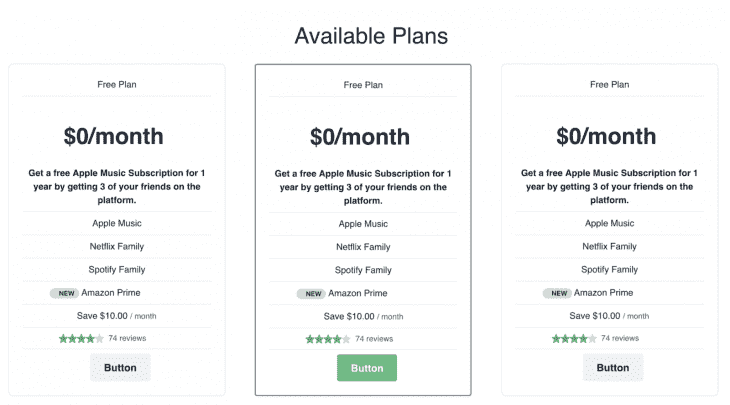

# 使用 Chakra UI 在 Vue 中构建 SaaS 产品定价组件

> 原文：<https://blog.logrocket.com/build-a-saas-product-pricing-component-in-vue-with-chakra-ui/>

## 开始之前

本教程是为使用 Vue.js 的前端开发者准备的，所以你应该了解基本概念和如何安装包。以下是你需要的:

*   安装 Node.js 10.x 及以上版本。您可以通过在终端/命令提示符下运行以下命令来验证您是否拥有 Node:

```
node -v
```

*   你应该已经安装了节点包管理器 6.7(T1)(NPM)或更高版本
*   强烈推荐您选择的任何代码编辑器，Visual Studio 代码
*   Vue 的最新版本全球安装在您的机器上
*   安装在您机器上的 Vue CLI 3.0 。为此，请先卸载旧版本的 CLI:

```
npm uninstall -g vue-cli
```

然后安装新的:

```
npm install -g @vue/cli
```

## 什么是查克拉 UI？

据创建者称，Chakra UI 是一个简单的模块化和可访问的组件库，为您提供快速构建 Vue 应用程序的构建模块。它是最干净的 UI 组件库之一，支持 Vue.js。

## 为什么是查克拉 UI？

首先，它是按照严格的 WAI-ARIA 标准从零开始建造的，非常容易接近。所有的 Chakra UI 组件都带有适当的属性，甚至是开箱即用的键盘交互。它也是非常快速的，可主题化的，可组合的，这意味着它很容易用 Vue 设置的方式引用值，不需要新的学习曲线。

## 入门指南

如果您从一开始就关注了这篇文章，那么您已经安装了 Vue，所以打开您的 VS 代码并打开一个新的终端，导航到您选择的目录，然后创建一个新项目:

```
vue create newApp
```

当你设置好一个名为`newApp`的新 Vue 项目后，测试它以确认它没有错误:

```
cd newApp
npm run serve
```

如果你在提供的端口上访问`localhost`，你会看到新的 Vue 应用搭建得很好。

## 装置

设置好 Vue 后，下一步是使用你选择的软件包管理器在项目上安装 Chakra UI，我们将使用 NPM。在 VS 代码中打开终端，运行下面的命令:

```
npm install @chakra-ui/vue emotion --save
vue add chakra-ui
```

按照提示操作，Vue 将为您设置依赖项，如果您遇到任何关于特定软件包的错误，请使用以下命令重新安装:

```
npm install packageName
```

完成后，导航到根文件夹，在`main.js`文件中用下面的代码块替换内容:

```
import Vue from 'vue'
import Chakra, { CThemeProvider, CReset } from '@chakra-ui/vue'
import App from './App.vue'
Vue.use(Chakra)
new Vue({
  el: '#app',
  render: (h) => h(CThemeProvider, [h(CReset), h(App)])
}).$mount()
```

## 你将会建造什么

在本帖中，您将学习为 SaaS 产品构建一个现代定价 UI 组件，该组件具有不同的层次、功能，甚至是一个创意亮点。



## 设置

在本教程的课程中，您将设置`app.vue`文件，以使用每个 Vue CLI 支架自带的`HelloWorld`组件作为我们的定价组件。您的`app.vue`文件应该是这样的:

```
<template>
  <c-theme-provider>
    <c-reset />
    <!--Your application goes here -->
    <HelloWorld />
  </c-theme-provider>
</template>
<script>
import HelloWorld from './components/HelloWorld'
export default {
  name: "App",
  components: {
    HelloWorld
  }
};
</script>
```

现在我们将使用 Chakra UI box 元素来构建 UI 组件，它基本上是一个卡片元素。我们将有三张间距和样式相同的卡片来阐述我们想要的结果。

## 演示文稿

对于演示代码，将下面的代码块复制到您的`helloworld.vue`文件的模板部分:

```
<template class="cbox">
<div id="mine">
<h1>Available Plans</h1>
<c-grid w="100%" template-columns="repeat(3, 1fr)" gap="6"  >
  <c-box maxW="sm" border-width="1px" rounded="lg" overflow="hidden">
    <c-box p="6">
      <h2>Free Plan</h2>
      <c-divider />
      <c-box
        mt="6"
        mb="6"
        font-weight="semibold"
        as="h3"
        text-align="center"
        line-height="tight"
        is-truncated>
        {{ property.title }} <br>
      </c-box>
      <c-box
      mt="6"
        font-weight="semibold"
        as="h5"
        text-align="center"
        line-height="tight"
        is-truncated>
        {{property.note}}</c-box>
      <c-divider />
      <h2>Apple Music</h2>
      <c-divider />
      <h2>Netflix Family</h2>
      <c-divider />
      <h2>Spotify Family</h2>
      <c-divider />
       <c-box d="flex" align-items="baseline">
        <c-badge rounded="full" px="2" variant-color="green" pl="4" ml="12">
          New
        </c-badge>
        <c-box
          ml="1"
          text-align="center">
         <h2>Amazon Prime</h2>
        </c-box>
      </c-box>
      <c-divider />
      <c-box pl="12" ml="12">
        Save {{ property.formattedPrice }}
        <c-box as="span" color="gray.600" fontSize="sm" >
          / month
        </c-box>
      </c-box>
      <c-divider />
      <c-box d="flex" mt="2" pl="4" ml="12" align-items="center">
        <c-icon
          v-for="(_, i) in Array(5).fill('')"
          name="star"
          :key="i"
          :color="i < property.rating ? 'green.500' : 'gray.300'"
        />
        <c-box as="span" ml="2" color="gray.600" font-size="sm">
          {{ property.reviewCount }} reviews
        </c-box>
      </c-box>
      <c-divider />
      <c-button-group pl="12" ml="12">
      <c-button ml="6" size="lg" variant-color="gray">Button</c-button>
      </c-button-group>
    </c-box>
  </c-box>
  <!-- new cards here -->
</c-grid>
</div>
</template>
```

首先，你可以看到我们使用了 card 元素(在 Chakra UI 中称为盒子)来创建一个容器。然后，我们使用各种元素，如徽章，评级和按钮。您还会注意到，内联样式方法接近于 Bootstrap，这对于以前使用过 Bootstrap 的人来说非常好，因为没有什么新东西需要学习。

## 逻辑

我们使用了一些东西，比如每个 Vue 开发者都遇到过的文本插值的 Vue 属性绑定实践。这是为了重申，有了 Vue.js 中的 Chakra UI，你就拥有了所有的 Vue 知识，事情的运作方式不会改变:

```
<script>
  export default {
    name: 'Example',
    data () {
      return {
        property: {
          title: "$0/month",
          note: "Get a free Apple Music Subscription for 1 year by getting 3 of your friends on the platform.",
          formattedPrice: "$10.00",
          reviewCount: 74,
          rating: 4,
        }
      }
    }
  }
</script>
```

在这里，我们绑定了一些属性，如星级计数、评论数等。对于您的项目，您可以硬编码这些属性，或者使用 API 动态请求它们，使用适当的 Vue 语法可以很好地解析它们。

## 造型

对于样式，我们将它的范围限定为`helloworld`组件，这样您就可以添加其他样式的东西，比如页眉和页脚:

```
<style scoped>
#mine {
  margin: 20px;
}
h3, h1 {
  margin: 40px 10px 20px;
  text-align: center;
  font-size: 40px;
}
h2{
  text-align: center;
}
ul {
  list-style-type: none;
  padding: 0;
}
li {
  display: inline-block;
  margin: 0 10px;
}
a {
  color: #42b983;
}
</style>
```

现在，您已经将所有这些 UI 元素很好地组合在一起，当您保存并再次运行应用程序时，您可以看到:

```
npm run serve
```

## 结论

这是对 Vue.js 的 Chakra UI 组件库的介绍，以及如何轻松地设置它。它也说明了为什么查克拉用户界面是重要的，尤其是对于可访问性。你还需要为 SaaS 的产品——happy hacking——建立一个定价用户界面组件。

## 像用户一样体验您的 Vue 应用

调试 Vue.js 应用程序可能会很困难，尤其是当用户会话期间有几十个(如果不是几百个)突变时。如果您对监视和跟踪生产中所有用户的 Vue 突变感兴趣，

[try LogRocket](https://lp.logrocket.com/blg/vue-signup)

.

[](https://lp.logrocket.com/blg/vue-signup)[https://logrocket.com/signup/](https://lp.logrocket.com/blg/vue-signup)

LogRocket 就像是网络和移动应用程序的 DVR，记录你的 Vue 应用程序中发生的一切，包括网络请求、JavaScript 错误、性能问题等等。您可以汇总并报告问题发生时应用程序的状态，而不是猜测问题发生的原因。

LogRocket Vuex 插件将 Vuex 突变记录到 LogRocket 控制台，为您提供导致错误的环境，以及出现问题时应用程序的状态。

现代化您调试 Vue 应用的方式- [开始免费监控](https://lp.logrocket.com/blg/vue-signup)。