# 用 Slack 的 Bolt API 在 Node.js 中构建一个 Slackbot

> 原文：<https://blog.logrocket.com/build-a-slackbot-in-node-js-with-slacks-bolt-api/>

## 新的 Bolt API

我最近试图用节点 Slack SDK 开发 Slackbot，但不幸的是，我遇到了一些错误。那时我偶然发现了新的 [Bolt API](https://api.slack.com/tools/bolt) 。根据 Slack 的说法，这是“用 JavaScript 在 Slack 平台上开始编程的最快方式。”

有很多理由可以尝试 Slack 的新 Bolt API 来构建你的下一个 Slack 应用或 bot。首先，它是一个有良好文档记录的库，可以帮助您避免以后遇到奇怪的错误和问题。其次，API 是由 Slack 开发和维护的，这确保了它会被频繁地更新。

使用这个 API 进行开发轻而易举，我可以向您保证，在开发 Slack 应用程序时，Bolt API 库是必由之路。在本教程中，您将学习如何使用 Bolt API 创建自己的 Slackbot。

## 设置

### 先决条件

要跟随本教程，您需要:

*   JavaScript 和 Node.js 的基础知识
*   Node.js v12 或更高版本
*   npm

### 创建工作区

首先，我们需要一个工作空间来安装我们的机器人。一个[宽松的工作空间](https://slack.com/intl/en-ng/help/articles/212675257-Join-a-Slack-workspace#:~:text=A%20Slack%20workspace%20is%20made,separate%20account%20for%20each%20one.)是一种在组织内组织沟通的方式。组织中的每个人都可以属于一个工作空间，然后该工作空间被细分为多个渠道。

在你的设备上安装 Slack 并创建一个[新的工作空间](https://slack.com/create#email)。然后 Slack 会发送一个 6 位数的代码到你的邮箱，你可以用它来验证。现在是有趣的部分！为您的工作区命名；在本教程中，我们将创建一个名为 Zobo Tea Company 的虚构公司。

> *注:* *如果你感到好奇，你可以阅读更多关于* [*芙蓉茶*](https://en.wikipedia.org/wiki/Hibiscus_tea) *(也被称为 Zobo)。*

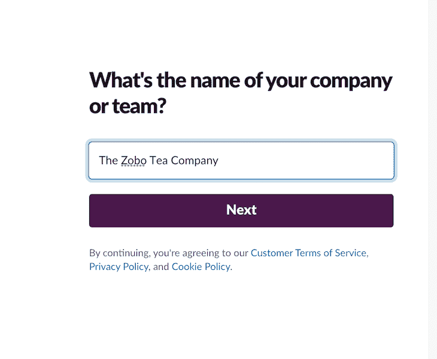

接下来，Slack 将提示您输入正在进行的项目的名称。你可以给这个项目起任何名字。您可以跳过最后一步，在这一步中，Slack 会提示您添加其他工作组成员。

### 创建新的松弛应用程序

现在，我们将创建一个新的 Slack 应用程序。Slack 应用是在工作空间内提供特定功能的小应用。您可以通过登录到您的 Slack 工作区并在 Slack 应用程序目录中搜索应用程序来安装一个预先存在的 Slack 应用程序。

我们将创建的 Slack 应用程序是一个知识库，可以帮助我们虚拟组织中的员工快速找到常见问题的答案。

要创建一个新的 Slack 应用程序，请转到 [Slack API](https://api.slack.com/apps/) 仪表板。点击右上角的**创建新应用**按钮。给你的机器人一个名字，然后选择你想要安装应用的工作空间。我们称我们的为`ask-ztc-bot`。

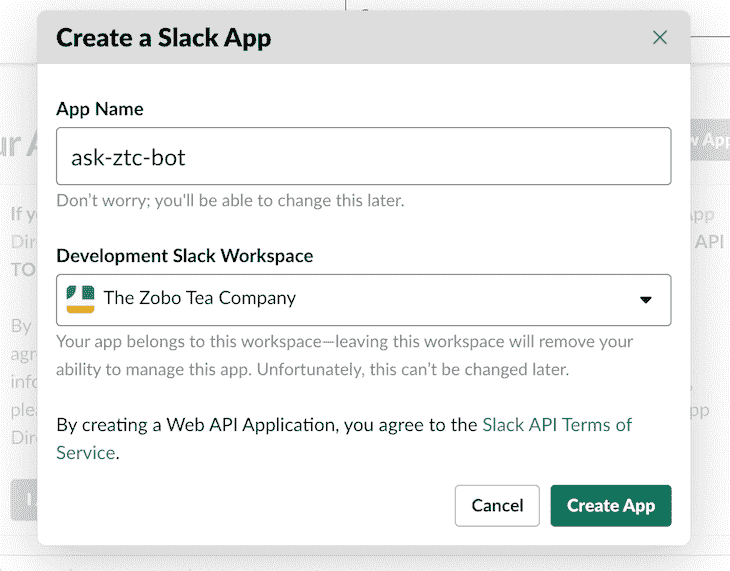

点击**创建应用**，你将被重定向到新应用的仪表盘。

### oAuth 和权限

我们需要给我们的新应用程序一定的权限，让它能够在我们的 Slack 工作空间中访问数据和执行操作。

在你的 Slack 仪表盘上，你会在左边栏找到 **OAuth 和权限**菜单选项。一旦你导航到这里，向下滚动到**范围**。我们需要我们的`ask-ztc-bot`能够阅读来自用户的即时消息并回复这些消息。这是我们给机器人的瞄准镜截图:


### 将应用程序安装到您的工作区

完成后，我们现在可以将应用程序安装到我们的工作区。从左侧栏，导航到**设置** > **安装应用** > **安装到工作区。**

## 设置 Slackbot 服务器

接下来，是时候写一些代码了。我们需要为我们的 Slackbot 设置一个服务器，我们可以向它发送请求。让我们开始吧！

创建一个名为`ask-ztc-bot`的目录并初始化 npm:

```
mkdir ask-ztc-bot && cd ask-ztc-bot 
npm init -y
```

在`ask-ztc-bot` 目录下安装以下软件包:

*   [@slack/bolt](https://www.npmjs.com/package/@slack/bolt) :一个 JavaScript 框架，使用最新的平台特性在瞬间构建 slack 应用
*   [n](https://www.npmjs.com/package/nodemon)
*   [dotenv](https://www.npmjs.com/package/dotenv) :从`.env`文件加载环境变量到 [`process.env`](https://nodejs.org/docs/latest/api/process.html#process_process_env) 的零依赖模块

我将使用 Yarn 包管理器来安装这些包，但是您也可以使用 npm:

```
yarn add @slack/bolt
yarn add -D nodemon dotenv

```

我们需要对我们的`package.json`文件做一点小小的调整。让我们添加一个运行`nodemon app.js`的新脚本`dev`。您的`package.json`应该是这样的:

```
...
  "main": "index.js",
  "scripts": {
    "dev": "nodemon app.js"
  },
....

```

当我们对代码库中的任何文件进行修改时，`dev`脚本会自动重启我们的服务器。接下来，创建包含服务器代码的`app.js`文件:

```
touch app.js

```

## 使用令牌和秘密进行身份验证

Slack 需要认证我们的机器人来连接它。Slack 使用一个`SIGNING_SECRET`和一个`BOT_TOKEN`来认证应用。我们需要将`SLACK_SIGNING_SECRET`和`SLACK_BOT_TOKEN`存储在一个`.env`文件中，以防止它们在使用版本控制时被暴露。

要找到你的`SLACK_SIGNING_SECRET`，导航到**基本信息** > **App 凭证** > **签约秘笈**。要获得您的`SLACK_BOT_TOKEN`，请前往**设置** > **安装 App** > **Bot 用户 oAuth 令牌**。你的`SLACK_BOT_TOKEN`应该以`xoxb`开头。

在项目的根目录下创建一个`.env`,并分配从上一步中获得的`SECRET`和`TOKEN`:

```
SLACK_SIGNING_SECRET="YOUR SIGNING SECRET"
SLACK_BOT_TOKEN="YOUR BOT TOKEN" 
```

## 设置服务器

进入我们之前创建的`app.js`文件，添加下面的代码:

```
const { App } = require("@slack/bolt");
require("dotenv").config();
// Initializes your app with your bot token and signing secret
const app = new App({
  token: process.env.SLACK_BOT_TOKEN,
  signingSecret: process.env.SLACK_SIGNING_SECRET,
});

(async () => {
  const port = 3000
  // Start your app
  await app.start(process.env.PORT || port);
  console.log(`⚡️ Slack Bolt app is running on port ${port}!`);
})();

```

运行我们之前创建的`yarn run dev`脚本，确保一切正常运行。你应该会在你的终端上看到一条消息“⚡️松弛螺栓应用程序正在`port 3000`上运行！”

## 设置 ngrok

我们需要一种方法让我们的 Slack 应用程序/机器人到达我们在`localhost`上创建的服务器。为此，我们可以通过由类似 [ngrok](https://ngrok.com) 的服务创建的公共 URL 代理到`localhost`。一旦安装了 ngrok，在目录中运行以下命令:

```
./ngrok http 3000

```

这将创建一个公共 URL，代理运行在`port 3000`上的`localhost`。现在，确保你在`localhost:3000`上的服务器还在运行。

## 套接字模式

Slack 还有一个叫做 [Socket Mode](https://slack.dev/bolt-js/concepts#socket-mode) 的特性，它允许 Slack 使用 [WebSockets](https://developer.mozilla.org/en-US/docs/Web/API/WebSockets_API) 连接到我们的应用服务器，而不是像上面我们使用 ngrok 那样使用 HTTP。套接字模式为我们提供了更快的开发体验，因为我们可以跳过设置 ngrok。

### 套接字模式入门

首先导航到**设置** > **基本信息** > **App 级令牌**。一旦出现，点击**生成令牌和作用域**按钮。给你的令牌一个名字，给你的应用程序两个可用的范围:`connections:write` *a* 和`authorizations:read`。点击**生成**按钮。然后，将下一个屏幕上的令牌复制到您的`.env`文件中。

接下来，将**设为** > **插座** **模式。**切换**使能**插座模式**toggler。最后，进入您的`app.js`文件，用`socketMode:true`和您的`appToken`更新初始化您的`app`的代码:**

```
const app = new App({
  token: process.env.SLACK_BOT_TOKEN,
  signingSecret: process.env.SLACK_SIGNING_SECRET,
  socketMode:true, // enable the following to use socket mode
  appToken: process.env.APP_TOKEN
});

```

完成后，对开发服务器的所有请求都将通过 WebSockets 而不是 HTTP 发生。

# 斜线命令

现在我们已经给了我们的应用一些权限，并设置了服务器和公共 URL，下一步是允许它监听[斜杠命令](https://api.slack.com/interactivity/slash-commands)。在 Slack 中，您可以通过将命令作为消息发送来触发动作。例如，斜杠命令可以是`/knowledge`来显示我们知识库中的所有内容。

要启用斜线命令，点击左侧工具条上的**斜线命令**菜单选项。然后点击**创建** **新命令**按钮。以下面的图片为指导填写表格。请求 URL 应该是 ngrok 为您的应用程序自动生成的自定义 URL。

确保在 ngrok URL 的末尾追加`/slack/events`:

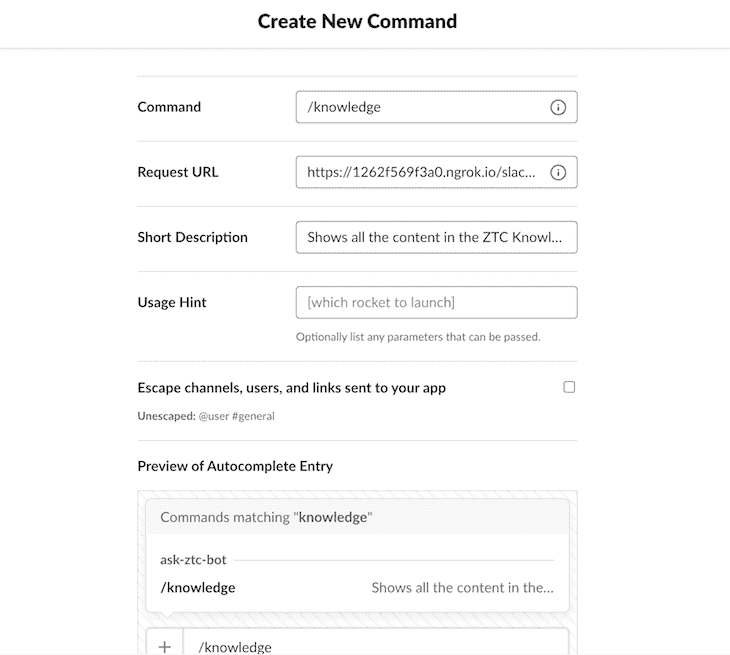

点击位于屏幕右下方的**保存**按钮。Slack 将提示您将应用程序重新安装到您的工作区，以使您的更改生效。按照这些说明，您的`/knowledge`命令现在应该已经创建好了！

### 测试`/knowledge`命令

现在，我们可以从 Slack 内部测试`/knowledge`命令。首先，我们将创建一个监听器来监听包含`/knowledge`命令的事件。在您的`app.js`文件中，添加以下代码:

```
const { App } = require("@slack/bolt");
require("dotenv").config();
// Initializes your app with your bot token and signing secret
const app = new App({
  token: process.env.SLACK_BOT_TOKEN,
  signingSecret: process.env.SLACK_SIGNING_SECRET,
});

app.command("/knowledge", async ({ command, ack, say }) => {
    try {
      await ack();
      say("Yaaay! that command works!");
    } catch (error) {
        console.log("err")
      console.error(error);
    }
});

(async () => {
  const port = 3000
  // Start your app
  await app.start(process.env.PORT || port);
  console.log(`⚡️ Slack Bolt app is running on port ${port}!`);
})();

```

测试机器人前的最后一步。您可能会注意到，您无法向新创建的 slackbot 发送消息。当你点击 Slack 中 **Apps** 标签下的 bot 时，你可能会看到一条信息，上面写着“向该应用发送消息已被关闭”。让我们打开它！

回到你的**应用设置**页面。在**功能**下，点击 **App 主菜单**选项。向下滚动，然后选中**允许用户从消息选项卡**复选框发送斜线命令和消息。

如果你在 Mac 上，你可以使用`CMD + R`重新加载 Slack，如果你在 PC 上，运行`CTRL + R`。现在，您应该能够向您的机器人发送消息了。

让我们测试我们的代码！在 Slack 应用中，你应该会在**你的应用**部分看到`ask-ztc-bot`应用。单击该按钮向机器人发送消息。键入`/knowledge`并按回车键。您应该会收到一条消息，内容为“Yaaay！那个命令管用！”。

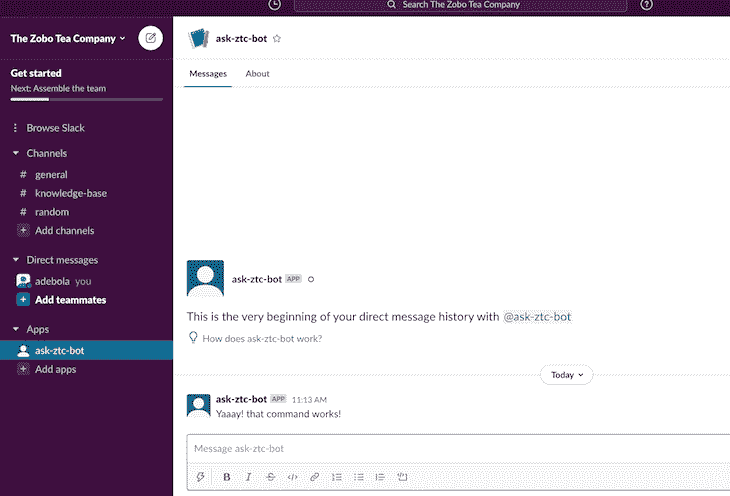

## 闲置的消息

我们还可以提及或`@`机器人，并包含附加文本作为消息发送给机器人。
在 Slack 中，提到一个 app 就是一种[事件](https://api.slack.com/apis/connections/events-api)。我们还可以监听[其他事件](https://api.slack.com/events)，比如当新用户加入一个频道，一个新频道被创建，等等。为了让我们的 bot/app 监听事件，我们需要设置事件订阅。

### 事件订阅

要启用活动，请从您的 Slack 应用仪表板导航至**功能>活动订阅**。打开**启用事件**按钮。

为了让 Slack 通知我们的应用程序事件，我们需要提供一个公共 URL，Slack 可以验证。复制我们之前创建的 [ngrok URL](https://www.dropbox.com/scl/fi/7uptlm38z07n7a3kp25uv/Untitled-1.paper?dl=0&rlkey=tds1madv3qkai06abnof5v5a6#:uid=118079201273443651885213&h2=Setting-up-ngrok) ，并将其粘贴到**请求 URL** 输入字段中。您需要将`/slack/events`追加到 URL，因为 Slack 将通过发送 POST 请求来验证您的 URL。

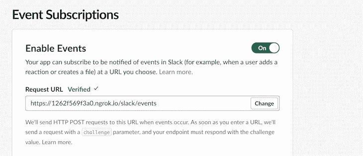

一旦你看到带有勾号的绿色验证文本，你就知道你的应用已经被 Slack 成功验证，你就可以开始了！

接下来，我们需要给 app 一些事件权限。点击 **subscribe to bot events** 下拉菜单，添加以下事件。有四个与消息相关的事件:

*   `message.channels`:监听公共频道中的消息
*   `message.groups`:监听私人频道中的消息
*   `message.im`:与用户一起收听应用程序 DMs 中的消息
*   `message.mpim`:监听多人 DMs 中的消息

在本教程中，我们将只订阅`message.im`，因为我们只希望用户 DM 我们的机器人。


点击屏幕右下角的**保存更改**按钮保存您的更改。

现在，我们可以测试我们的应用程序，以确保它可以接收和响应消息。在您的`app.js`中，添加以下代码:

```
app.message("hey", async ({ command, say }) => {
    try {
      say("Yaaay! that command works!");
    } catch (error) {
        console.log("err")
      console.error(error);
    }
});

```

回到`azk-ztc-bot`应用程序，向它发送一条类似于`@ask-ztc-bot hey`的消息。你应该会得到回复。

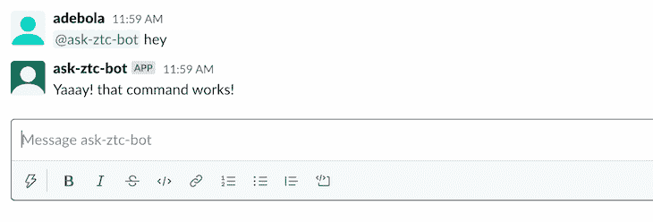

对于一个知识库这样的 app，我们并不能真正匹配到精确的词。我们需要一种方法来检查用户发送给我们的机器人的消息是否包含与我们知识库中的关键字相匹配的关键字。为此，Slack 允许我们使用正则表达式。例如，让我们更新上面使用的代码块，如下所示:

```
// matches any string that contains the string hey
app.message(/hey/, async ({ command, say }) => {
    try {
      say("Yaaay! that command works!");
    } catch (error) {
        console.log("err")
      console.error(error);
    }
});

```

发送包含格式为`Well, hey there Mr.bot!`的字符串`hey`的消息。我们的机器人仍然会正确响应，因为消息包含字符串`hey`。

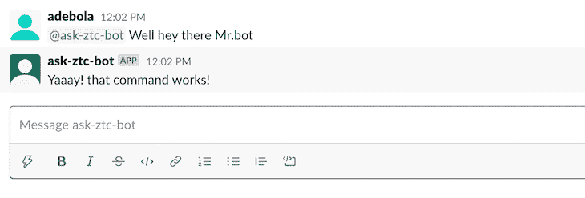

## 创建知识库

现在，我们可以开始实际创建知识库。

首先，我们将创建一个迷你数据库来存储常见问题和答案。我们的数据库将是服务器上的一个简单的 JSON 文件。如果您的数据需求变得庞大而复杂，您可能会考虑像 [MongoDB](https://www.mongodb.com/) 这样的 DBMS。

在项目的根目录下，创建一个`db.json`文件，并添加以下数据:

```
{
    "data":[
        {
            "keyword": "products",
            "question": "How many different products do we sell at ZTC?",
            "answer": "ZTC currently has 3 products on the market. Hibiscus tea with a hint of one of Lemon/Pineapple or ginger."
        },
        {
            "keyword": "products",
            "question": "What online stores sell our products?",
            "answer": "Amazon, Macy's and Shoprite."
        },
        {
            "keyword": "people",
            "question": "How many people work at ZTC?",
            "answer": "ZTC currently employs 250 people from 21 different countries."
        },
        {
            "keyword": "reset password",
            "question": "How do I reset my password?",
            "answer": "To reset your company E-mail password, call Ola on ext.8099."
        }

    ]
}

```

我们创建了一套四个问题及其答案，并根据特定的关键字对它们进行了分组，以便于参考。

### 响应命令

随着 JSON 数据库的建立，我们需要一种方法来读取其中的数据。我们将使用 Node.js 的内置`[fs](https://nodejs.org/api/fs.html)`模块来读取`db.json`文件。在`app.js`文件的顶层，添加以下代码块:

```
// require the fs module that's built into Node.js
const fs = require('fs')
// get the raw data from the db.json file
let raw = fs.readFileSync('db.json');
// parse the raw bytes from the file as JSON
let faqs= JSON.parse(raw);

```

现在，我们可以编写响应`/knowledge`命令的代码了。该命令将向用户显示我们数据库中的所有问题和答案:

```
app.command("/knowledge", async ({ command, ack, say }) => {
  try {
    await ack();
    let message = { blocks: [] };
    faqs.data.map((faq) => {
      message.blocks.push(
        {
          type: "section",
          text: {
            type: "mrkdwn",
            text: "*Question*",
          },
        },
        {
          type: "section",
          text: {
            type: "mrkdwn",
            text: faq.question,
          },
        },
        {
            type: "section",
            text: {
              type: "mrkdwn",
              text: "*Answer*",
            },
          },
          {
            type: "section",
            text: {
              type: "mrkdwn",
              text: faq.answer,
            },
          }
      );
    });
    say(message);
  } catch (error) {
    console.log("err");
    console.error(error);
  }
});

```

我们使用 blocks(由 Slack Bolt API 提供)和 markdown 来格式化我们将向用户显示的消息。为了进一步定制发送给用户的 bot 消息，Slack 提供了一个 [Block Kit Builder](https://app.slack.com/workspace-signin?redir=%2Fgantry%2Fblock-kit-builder#%7B%22blocks%22:%5B%7B%22type%22:%22section%22,%22text%22:%7B%22type%22:%22mrkdwn%22,%22text%22:%22Hello,%20Assistant%20to%20the%20Regional%20Manager%20Dwight!%20*Michael%20Scott*%20wants%20to%20know%20where%20you'd%20like%20to%20take%20the%20Paper%20Company%20investors%20to%20dinner%20tonight.%5Cn%5Cn%20*Please%20select%20a%20restaurant:*%22%7D%7D,%7B%22type%22:%22divider%22%7D,%7B%22type%22:%22section%22,%22text%22:%7B%22type%22:%22mrkdwn%22,%22text%22:%22*Farmhouse%20Thai%20Cuisine*%5Cn:star::star::star::star:%201528%20reviews%5Cn%20They%20do%20have%20some%20vegan%20options,%20like%20the%20roti%20and%20curry,%20plus%20they%20have%20a%20ton%20of%20salad%20stuff%20and%20noodles%20can%20be%20ordered%20without%20meat!!%20They%20have%20something%20for%20everyone%20here%22%7D,%22accessory%22:%7B%22type%22:%22image%22,%22image_url%22:%22https://s3-media3.fl.yelpcdn.com/bphoto/c7ed05m9lC2EmA3Aruue7A/o.jpg%22,%22alt_text%22:%22alt%20text%20for%20image%22%7D%7D,%7B%22type%22:%22section%22,%22text%22:%7B%22type%22:%22mrkdwn%22,%22text%22:%22*Kin%20Khao*%5Cn:star::star::star::star:%201638%20reviews%5Cn%20The%20sticky%20rice%20also%20goes%20wonderfully%20with%20the%20caramelized%20pork%20belly,%20which%20is%20absolutely%20melt-in-your-mouth%20and%20so%20soft.%22%7D,%22accessory%22:%7B%22type%22:%22image%22,%22image_url%22:%22https://s3-media2.fl.yelpcdn.com/bphoto/korel-1YjNtFtJlMTaC26A/o.jpg%22,%22alt_text%22:%22alt%20text%20for%20image%22%7D%7D,%7B%22type%22:%22section%22,%22text%22:%7B%22type%22:%22mrkdwn%22,%22text%22:%22*Ler%20Ros*%5Cn:star::star::star::star:%202082%20reviews%5Cn%20I%20would%20really%20recommend%20the%20%20Yum%20Koh%20Moo%20Yang%20-%20Spicy%20lime%20dressing%20and%20roasted%20quick%20marinated%20pork%20shoulder,%20basil%20leaves,%20chili%20&%20rice%20powder.%22%7D,%22accessory%22:%7B%22type%22:%22image%22,%22image_url%22:%22https://s3-media2.fl.yelpcdn.com/bphoto/DawwNigKJ2ckPeDeDM7jAg/o.jpg%22,%22alt_text%22:%22alt%20text%20for%20image%22%7D%7D,%7B%22type%22:%22divider%22%7D,%7B%22type%22:%22actions%22,%22elements%22:%5B%7B%22type%22:%22button%22,%22text%22:%7B%22type%22:%22plain_text%22,%22text%22:%22Farmhouse%22,%22emoji%22:true%7D,%22value%22:%22click_me_123%22%7D,%7B%22type%22:%22button%22,%22text%22:%7B%22type%22:%22plain_text%22,%22text%22:%22Kin%20Khao%22,%22emoji%22:true%7D,%22value%22:%22click_me_123%22,%22url%22:%22https://google.com%22%7D,%7B%22type%22:%22button%22,%22text%22:%7B%22type%22:%22plain_text%22,%22text%22:%22Ler%20Ros%22,%22emoji%22:true%7D,%22value%22:%22click_me_123%22,%22url%22:%22https://google.com%22%7D%5D%7D%5D%7D) ，您可以使用它来获得您想要的模板。

您可以通过在与`ask-ztc-bot`的私人对话中键入命令`/knowledge`来测试这一点。

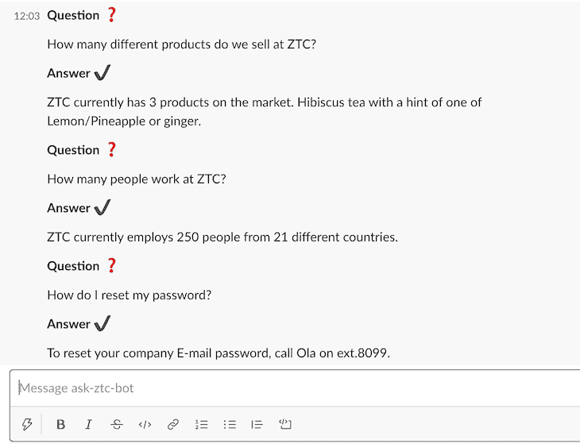

如您所见，它正确地列出了我们知识库中的所有常见问题。

接下来，我们将使用一个简单的正则表达式来检测用户是否在其问题中包含了关键字 products。如果有，我们将向他们展示带有关键词产品的常见问题解答:

```
app.message(/products/, async ({ command, say }) => {
  try {
    let message = { blocks: [] };
    const productsFAQs = faqs.data.filter((faq) => faq.keyword === "products");

    productsFAQs.map((faq) => {
      message.blocks.push(
        {
          type: "section",
          text: {
            type: "mrkdwn",
            text: "*Question ❓*",
          },
        },
        {
          type: "section",
          text: {
            type: "mrkdwn",
            text: faq.question,
          },
        },
        {
          type: "section",
          text: {
            type: "mrkdwn",
            text: "*Answer ✔️*",
          },
        },
        {
          type: "section",
          text: {
            type: "mrkdwn",
            text: faq.answer,
          },
        }
      );
    });

    say(message);
  } catch (error) {
    console.log("err");
    console.error(error);
  }
});

```

为了测试这一点，向机器人发送一条包含单词 products 的消息，机器人将用与 products 关键字有关的所有信息进行响应。

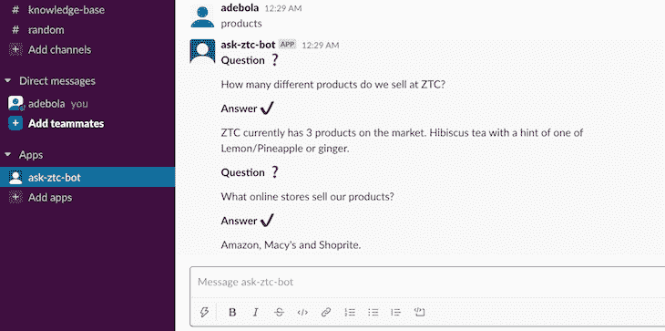

### 更新知识库

最后，我们希望让用户能够将自己的数据添加到知识库中。

创建一个名为`/update`的新斜线命令。用户将调用此命令向我们的知识库添加新数据。

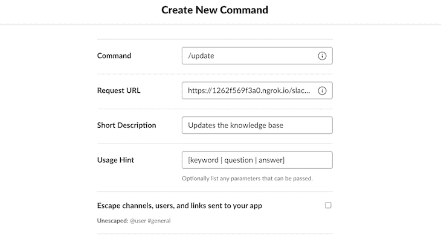

我们对这个命令做了一点小小的改动。在用法提示中，我们已经指定用户应该使用管道字符`|`来分隔不同的字段。这样，我们可以获取用户发送的输入字符串，并使用管道字符将其拆分。

> *注意:* *如果你计划将你的 Slackbot 添加到一个频道，并认为可能有其他应用程序具有与你相似的命令，那么可能值得创建一个命令，例如**。、*** *`/ask-ztc`，并让* *用户向命令追加一个附加字符串。例如，* *使用* *`/ask-ztc knowledge`显示知识库中的所有常见问题。*

下面是处理`/update`斜杠命令的代码。我们通过首先读取文件中的数据并将用户发送的新数据附加到文件中来更新`db.json`文件:

```
app.command("/update", async ({ command, ack, say }) => {
  try {
    await ack();
    const data = command.text.split("|");
    const newFAQ = {
      keyword: data[0].trim(),
      question: data[1].trim(),
      answer: data[2].trim(),
    };
    // save data to db.json
    fs.readFile("db.json", function (err, data) {
      const json = JSON.parse(data);
      json.data.push(newFAQ);
      fs.writeFile("db.json", JSON.stringify(json), function (err) {
        if (err) throw err;
        console.log("Successfully saved to db.json!");
      });
    });
    say(`You've added a new FAQ with the keyword *${newFAQ.keyword}.*`);
  } catch (error) {
    console.log("err");
    console.error(error);
  }
});

```

让我们来测试一下！

我们将使用以下文本调用`/update`命令:“如果我的互联网出现问题，我应该联系谁？|打电话给 IT 部门，分机号码是 9090。

`/update`端点将响应消息:

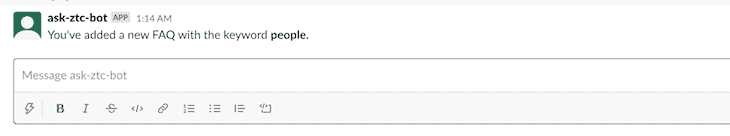

现在，当我们调用我们的`/knowledge`命令时，我们应该看到我们新添加的 FAQ 作为从我们的数据库返回的 FAQ 的一部分。

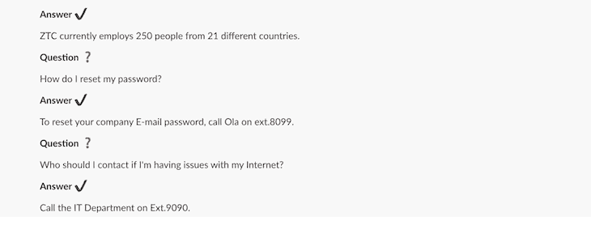

现在你知道了！

您已经成功创建了一个可以响应命令和提及的 Slackbot。它还可以接受来自用户的新数据，并将其存储在数据库中。

这个例子的源代码可以在我的 [GitHub](https://github.com/onedebos/knowledgebase-slackbot) 上找到。

## 部署

您可以像部署常规 Node.js 应用程序一样，将应用程序部署到 Heroku 这样的平台上。别忘了把活动订阅部分的网址改成 Heroku 提供的新网址。

你可以访问 [Bolt API 文档](https://slack.dev/bolt-js/tutorial/getting-started)作为参考。

## 200 只显示器出现故障，生产中网络请求缓慢

部署基于节点的 web 应用程序或网站是容易的部分。确保您的节点实例继续为您的应用程序提供资源是事情变得更加困难的地方。如果您对确保对后端或第三方服务的请求成功感兴趣，

[try LogRocket](https://lp.logrocket.com/blg/node-signup)

.

[](https://lp.logrocket.com/blg/node-signup)[https://logrocket.com/signup/](https://lp.logrocket.com/blg/node-signup)

LogRocket 就像是网络和移动应用程序的 DVR，记录下用户与你的应用程序交互时发生的一切。您可以汇总并报告有问题的网络请求，以快速了解根本原因，而不是猜测问题发生的原因。

LogRocket 检测您的应用程序以记录基线性能计时，如页面加载时间、到达第一个字节的时间、慢速网络请求，还记录 Redux、NgRx 和 Vuex 操作/状态。

[Start monitoring for free](https://lp.logrocket.com/blg/node-signup)

.