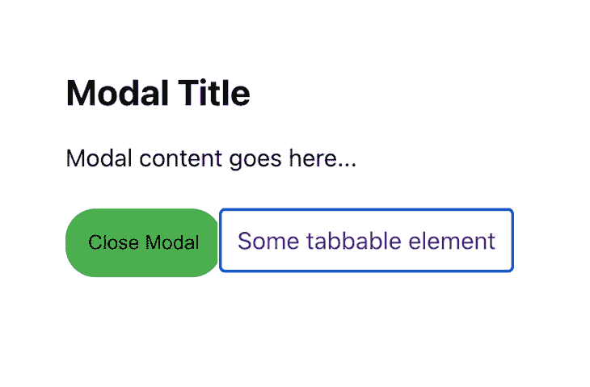

# 用焦点-陷阱-反应建立一个可访问的模型

> 原文：<https://blog.logrocket.com/build-accessible-modal-focus-trap-react/>

构建一个可访问的模型可能是一项棘手的任务，但是使用正确的工具和技术，这是可行的。可访问性的一个重要方面是确保用户可以只使用键盘在模态中导航。实现这一点的一种方法是使用 focus-trap-react 库。

在深入技术细节之前，让我们先了解一下什么是可访问模态。可访问模式也称为对话框，是一种用户界面组件，用于在当前视图顶部的单独窗口或覆盖层中显示内容。这些模态通常用于显示表单、确认或对网页主要内容不重要的附加信息。

无障碍模式旨在供所有用户使用，包括残障人士。实现可访问模态的方法之一是使用 [focus-trap-react](https://github.com/focus-trap/focus-trap-react) 包。

focus-trap-react 是一个简单、轻量级的库，帮助在特定的 DOM 元素中捕获焦点，比如模态对话框或菜单。这确保了用户可以只使用键盘在模态中导航，而不会意外地与模态之外的元素交互。

您可以使用该组件来构建各种类型的用户界面，如模式、下拉菜单和工具提示，这些界面对于所有用户(包括残障人士)来说都是易于访问和使用的。

*向前跳跃*:

## 要求

要学习本教程，您必须安装以下软件:

*   Node.js 是一个 JavaScript 运行时，支持在服务器端执行 JavaScript。你可以在这里得到它
*   代码编辑器:为了编写和编辑你的代码，你需要一个像 [Visual Studio Code](https://code.visualstudio.com/) 这样的代码编辑器

需要注意的是，教程使用的是 [React 18.2.0](https://github.com/facebook/react/blob/main/CHANGELOG.md#1820-june-14-2022) 和 [focus-trap-react v10](https://www.npmjs.com/package/focus-trap-react) 。如果您想在本文中看到完整的项目开发，请看一下 [GitHub 项目](https://github.com/hulyak/modal-focus-trap)。请随意克隆它、派生它或提交一个问题。

## 设置我们的项目

打开命令行，导航到要创建项目的目录。然后，执行以下命令，使用 [Create React App](https://create-react-app.dev/) 创建一个新的 React 项目:

```
npx create-react-app focus-trap-example

```

这将创建一个名为`focus-trap-example`的新目录，其中包含构建 React 应用程序所需的基本文件结构和配置。接下来，导航到新项目目录:

```
cd focus-trap-example

```

然后，使用 npm 或 Yarn 安装 focus-trap-react 软件包:

```
npm install focus-trap-react
# or
yarn add focus-trap-react

```

## 建立模型

一旦安装了库，就可以开始构建模态组件了。

首先，在项目的`src`目录下创建一个名为`Modal.js`的新文件。

然后，通过在文件顶部添加以下行，将 focus-trap-react 库导入到新文件中:

```
import FocusTrap from "focus-trap-react"

```

接下来，创建一个名为`Modal`的新功能组件，并使用`FocusTrap`组件包装模态的内容。`FocusTrap`创建一个焦点陷阱，当它打开时在模态中保持焦点，当它关闭时将焦点返回到打开模态的元素:

```
const Modal = () => {
  return (
    <FocusTrap>
      <div className="modal-content">
        <h2>Modal Title</h2>
        <p>Modal content goes here...</p>
        <button className="link-button">Close Modal</button>
        <a href="#" className="link-href">
          Some tabbable element
        </a>
      </div>
    </FocusTrap>
  )
}

```

使用`FocusTrap`时，确保组件至少有一个可制表的子元素，或者一个可聚焦的元素。可聚焦元素是 HTML 文档中可以获得焦点的元素，例如按钮、链接、输入字段和其他交互式元素，如复选框或选择框。可以使用键盘的 Tab 键导航到这些元素，也可以通过用鼠标或触摸设备点击它们来激活它们。

主要的可聚焦元素是:

*   `<a>`(锚)
*   `<button>`
*   `<input>`(所有类型)
*   `<select>`
*   `<textarea></code`
*   `<label>`

您还可以通过给其他元素一个`[tabindex](https://developer.mozilla.org/en-US/docs/Web/HTML/Global_attributes/tabindex)`属性来使它们成为焦点。正整数值将使元素按照数字指定的顺序成为焦点。0 的`tabindex`将使元素成为焦点，但是将在所有具有正`tabindex`的元素之后被导航。

在这个例子中，`FocusTrap`用于在模态中捕获焦点。模态内容包括一个`button`和一个`a`标签，目的是使其可制表，以便`FocusTrap`可以关注它:

## 添加焦点选项

要定制`FocusTrap`的行为，您可以使用`[focusTrapOptions](https://github.com/focus-trap/focus-trap-react#focustrapoptions)`属性来指定当模态第一次打开时应该聚焦哪个元素。

`initialFocus`选项允许您指定当陷阱被激活时，焦点陷阱中的哪个元素应该接收焦点。例如，您可能希望将焦点设置在模式中的 link 元素上:

```
const Modal = () => {
  return (
    <FocusTrap focusTrapOptions={{ initialFocus: "#modal-link" }}>
      <div className="modal-content">
        <h2>Modal Title</h2>
        <p>Modal content goes here...</p>
        <button className="link-button">Close Modal</button>
        <a href="#" className="link-href" id="modal-link">
          Some tabbable element
        </a>
      </div>
    </FocusTrap>
  )
}
export default Modal

```

在本例中，当模态打开时，`a href`链接将被聚焦:



我们将在另一部分探讨其他选项。

## 使模态函数化

目前，我们的 modal 没有打开按钮，关闭按钮也不起作用。让我们使用钩子和函数使模态函数化:

```
import { useState } from "react"
import FocusTrap from "focus-trap-react"

const Modal = () => {
  const [isOpen, setIsOpen] = useState(false)

  const openModal = () => setIsOpen(true)
  const closeModal = () => setIsOpen(false)

  return (
    <>
      <button onClick={openModal} className="button">
        Open Modal
      </button>
      {isOpen && (
        <FocusTrap focusTrapOptions={{ initialFocus: "#modal-link" }}>
          <div className="modal-content">
            <h2>Modal Title</h2>
            <p>Modal content goes here...</p>
            <button className="link-button" onClick={closeModal}>
              Close Modal
            </button>
            <a href="#" className="link-href" id="modal-link">
              Some tabbable element
            </a>
          </div>
        </FocusTrap>
      )}
    </>
  )
}
export default Modal

```

在这个例子中，`useState`钩子被用来创建一个状态变量`isOpen`，它跟踪模态当前是打开的还是关闭的。默认情况下，这个变量被设置为`false`，这意味着当页面第一次加载时模态是关闭的。

定义了两个函数`openModal`和`closeModal`，分别将`isOpen`的值改为 true 和 false。这些函数作为处理程序传递给`Open Modal`和`Close Modal`按钮，这样当按钮被点击时，模态就会打开或关闭。当`isOpen`状态为真时，模态在屏幕上变得可见:

## 添加更多内容`focusTrapOptions`

我们在前面的章节中已经看到了`initialFocus`选项。再来看看其他几个。

首先考虑`onPostActivate`。该选项在焦点陷阱激活后和初始焦点设置后调用。这是在打开模式并设置焦点后执行附加操作的一种方式:

```
import { useRef } from 'react';
import FocusTrap from "focus-trap-react"

const Modal = () => {
  const firstInputRef = useRef(null);

  return (
    <>
      <button onClick={openModal}>Open Modal</button>
      {isOpen && (
        <FocusTrap
          focusTrapOptions={{
            onPostActivate: () => {
              firstInputRef.current.focus();
            },
          }}
        >
          <div className="modal-content">
            <input type="text" ref={firstInputRef}/>
            <button onClick={closeModal}>Close Modal</button>
          </div>
        </FocusTrap>
      )}
    </>
  )

}

```

在这个例子中，当打开模态并设置焦点时，调用`onPostActivate`，它将焦点设置在模态中的第一个输入元素上，因此用户可以在模态打开后立即在输入字段中开始输入。

添加此功能会使用户体验更加流畅和自然，因为在打开模式后让用户在表单中输入信息是一个常见的用例:

让我们来看看其他一些选项:

*   `onActivate`:该选项允许您指定一个当焦点陷阱被激活时将被执行的回调函数。例如，您可能希望向模态元素添加一个类，以便在它处于活动状态时更改它的外观
*   `onDeactivate`:该选项允许您指定一个当焦点陷阱失效时将被执行的回调函数。例如，您可能希望删除激活时添加的类
*   `clickOutsideDeactivates`:该选项允许您指定当用户在陷阱外单击时，是否应禁用焦点陷阱。它是一个布尔值，默认情况下设置为`true`，这意味着当用户在它之外单击时，焦点陷阱将被禁用。

现在，让我们将这些选项添加到我们的模式中:

```
import { useRef } from "react"
import FocusTrap from "focus-trap-react"

const Modal = () => {
  const modalRef = useRef(null)

  const onActivate = () => {
    modalRef.current.classList.add("active")
  }
  const onDeactivate = () => {
    modalRef.current.classList.remove("active")
  }
  return (
    <>
      <div>
        <button onClick={openModal} className="button">
          Open Modal
        </button>
      </div>
      {isOpen && (
        <FocusTrap
          focusTrapOptions={{
            onActivate,
            onDeactivate,
            clickOutsideDeactivates: true,
          }}
        >
          <div
            className="modal-content"
            ref={modalRef}
          >
           {/* JSX elements */}       
          </div>
        </FocusTrap>
      )}
    </>
  )
}

```

在这个例子中，我们使用`useRef`钩子来创建对模态元素的引用，然后将它作为 ref 传递给包装了模态内容的 div 元素。这样，我们可以通过使用`modalRef.current`来访问`onActivate`和`onDeactivate`回调中的元素。

`onActivate`函数将类`"active"`添加到模态元素中，当模态元素打开时，它将背景颜色更改为`blue`。

当模态关闭时，`onDeactivate`函数从模态元素中移除`"active"`类。

`clickOutsideDeactivates: true`选项告诉焦点陷阱在单击发生在模态之外时停用，因此当用户在模态之外单击时，模态将关闭:

你可以在[聚焦陷阱文档](https://github.com/focus-trap/focus-trap#createoptions)中找到选项的完整列表。

## 测试我们的模型

在`App.js`中导入模态组件并渲染模态组件:

```
import "./App.css"
import Modal from "./Modal"

export default function App() {
  return (
    <div className="App">
      <Modal />
    </div>
  )
}

```

然后，从终端运行您的应用程序:

```
npm start
# or
yarn start

```

这将启动一个开发服务器，您应该在`[http://localhost:3000](http://localhost:3000/)`看到应用程序在浏览器中运行。

要测试模态:

*   使用 Tab 键在模式中的可聚焦元素间导航
*   使用回车键激活按钮和链接
*   使用`Shift + Tab`键以相反的顺序浏览模态，并检查焦点是否反向移动通过模态的可聚焦元素

此外，用像 [JAWS](https://www.freedomscientific.com/products/software/jaws/) 或 [NVDA](https://www.nvaccess.org/download/) 这样的屏幕阅读器来测试 modal 是很重要的，以确保它对不同能力的用户来说都像预期的那样工作。

## 结论

focus-trap-react 库是一个低级的库，它提供了在一个组件中捕获焦点的基本功能，但是它不提供内置的可访问性特性，比如添加 ARIA 属性。

您可以使用另一个库，如 [react-aria-modal](https://github.com/davidtheclark/react-aria-modal) ，它提供了完全可访问的模态对话框，遵循 WAI-ARIA 创作实践，您可以将它与 focus-trap-react 一起使用。

为了使一个模型具有可访问性，遵循 [WAI-ARIA](https://www.w3.org/WAI/standards-guidelines/aria/) 创作实践指南是很重要的。这包括为该模式提供一个清晰的描述性标签，确保该模式可以使用键盘关闭，并在该模式中捕获焦点，以便用户可以使用键盘浏览其内容。

总之，focus-trap-react 库是一个简单有效的方法，可以让你的模态更容易访问。值得注意的是，在模态中捕获焦点只是使模态可访问的一个方面。您还应该确保模式标签正确，关闭按钮清晰可见且易于访问。此外，您应该考虑使用屏幕阅读器和其他辅助技术的用户的需求。

## 使用 LogRocket 消除传统反应错误报告的噪音

[LogRocket](https://lp.logrocket.com/blg/react-signup-issue-free)

是一款 React analytics 解决方案，可保护您免受数百个误报错误警报的影响，只针对少数真正重要的项目。LogRocket 告诉您 React 应用程序中实际影响用户的最具影响力的 bug 和 UX 问题。

[ ](https://lp.logrocket.com/blg/react-signup-general) [  ](https://lp.logrocket.com/blg/react-signup-general) [LogRocket](https://lp.logrocket.com/blg/react-signup-issue-free)

自动聚合客户端错误、反应错误边界、还原状态、缓慢的组件加载时间、JS 异常、前端性能指标和用户交互。然后，LogRocket 使用机器学习来通知您影响大多数用户的最具影响力的问题，并提供您修复它所需的上下文。

关注重要的 React bug—[今天就试试 LogRocket】。](https://lp.logrocket.com/blg/react-signup-issue-free)